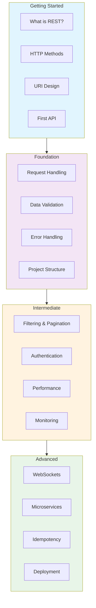

# 🚀 RESTful FastAPI Guidelines


*A comprehensive, progressive guide to building robust and scalable RESTful APIs with FastAPI, using intuitive restaurant analogies.*

## 📋 Overview

This project is a complete learning journey for building production-ready RESTful APIs with FastAPI. Using a **"Restaurant Analogy,"** we make complex API concepts intuitive and easy to grasp. Whether you're a beginner or an experienced developer, this guide offers a structured path from fundamental concepts to advanced enterprise-grade patterns.

## 🎯 What You'll Learn

### 🌟 **Progressive Learning Journey**
- **Getting Started**: Learn the basics of REST, HTTP, and build your first API "restaurant."
- **Foundation**: Establish a solid base with production-ready patterns for validation, error handling, and project structure.
- **Intermediate**: Dive into advanced topics like filtering, pagination, security, and performance optimization.
- **Advanced & Enterprise**: Master enterprise-grade features like WebSockets, microservices, and cloud deployment.

### 🛠️ **Practical Skills**
- Design and build RESTful APIs with FastAPI from scratch.
- Apply industry best practices for API design, security, and performance.
- Implement robust data validation with Pydantic.
- Develop a scalable and maintainable project structure.
- Write effective tests to ensure API reliability.
- Deploy FastAPI applications using Docker and serverless technologies.

## 📚 Documentation Structure

Our documentation is structured as a progressive learning path, taking you from a simple "café" to a full-fledged "restaurant chain."



## 🚀 Quick Start

### Prerequisites
- **Python 3.8+** installed
- **Node.js 18+** for documentation
- **Git** for version control
- **Code editor** (VS Code recommended)

### 1. Clone the Repository
```bash
git clone https://github.com/ridwanspace/restful-fastapi-guideline.git
cd restful-fastapi-guideline
```

### 2. Install Dependencies
```bash
# Install Node.js dependencies for documentation
npm install

# For FastAPI development (examples in docs)
pip install fastapi uvicorn pydantic
```

### 3. Start the Documentation Server
```bash
npm run dev
```
- Open [http://localhost:3000](http://localhost:3000) to access the landing page.
- Open [http://localhost:3000/docs](http://localhost:3000/docs) to access the complete documentation.

### 4. Follow the Learning Path
Start with [Getting Started](/docs/01_getting-started) and progress through each section:

```bash
# Navigate to each section in order:
1. 🚀 Getting Started    → /docs/01_getting-started
2. 🏛️ Foundation        → /docs/02_foundation
3. 🚀 Intermediate      → /docs/03_intermediate
4. 🏢 Advanced          → /docs/04_advanced
```

## 📖 Documentation Sections

### 🚀 [Getting Started](/docs/01_getting-started)
Perfect for beginners. Learn the core concepts of REST and build your first API.
- **What is REST?**: Core principles explained with our restaurant analogy.
- **HTTP Methods**: Understand GET, POST, PUT, DELETE.
- **Your First API**: A hands-on tutorial to build your first "API restaurant."

### 🏛️ [Foundation](/docs/02_foundation)
Essential concepts for building production-ready APIs.
- **Request Handling**: Manage path/query parameters and request bodies.
- **Data Validation**: Ensure data integrity with Pydantic.
- **Error Handling**: Implement robust error handling strategies.
- **Project Structure**: Organize your code for scalability.

### 🚀 [Intermediate](/docs/03_intermediate)
Advanced patterns for more complex applications.
- **Filtering, Pagination & Sorting**: Efficiently handle large datasets.
- **Authentication & Authorization**: Secure your endpoints.
- **Performance Optimization**: Speed up your API with caching and other techniques.
- **Monitoring**: Gain insights into your API's performance.

### 🏢 [Advanced](/docs/04_advanced)
Enterprise-grade techniques for high-scale applications.
- **WebSockets**: Implement real-time communication.
- **Microservices**: Design your API as part of a larger ecosystem.
- **Idempotency**: Ensure reliable, repeatable operations.
- **Deployment**: Deploy your application using Docker and serverless.

## 🛠️ Technology Stack

| Component | Technology | Purpose |
|-----------|------------|---------|
| **Documentation Framework** | Next.js + MDX | Interactive and beautiful documentation |
| **API Framework** | FastAPI | High-performance Python API framework |
| **Validation** | Pydantic | Robust data validation and settings management |
| **Styling** | Tailwind CSS | Modern and responsive design |
| **Diagrams** | Mermaid | Clear visual explanations of concepts |

## 🤝 Contributing

We welcome contributions! Please see our [contribution guidelines](./CONTRIBUTING.md) for more details on how to get involved.

## 📄 License

This project is licensed under the **MIT License** - see the [LICENSE](LICENSE) file for details.