# 🚀 RESTful FastAPI Guidelines


*A comprehensive, structured guide to building production-ready RESTful APIs with FastAPI*

## 📋 Overview

This comprehensive documentation project provides a complete learning journey for building RESTful APIs with FastAPI, from beginner concepts to advanced enterprise patterns. Whether you're just starting with APIs or looking to master advanced techniques, this guide offers structured learning paths with practical examples, best practices, and real-world patterns.

## 🎯 What You'll Learn

### 🌟 **Complete Learning Journey**
- **Beginner**: REST fundamentals, HTTP methods, and basic API development
- **Foundation**: Production-ready patterns, validation, and error handling
- **Intermediate**: Advanced design patterns and enterprise considerations
- **Advanced**: Performance optimization, security, and monitoring

### 🛠️ **Practical Skills**
- FastAPI development from basics to advanced patterns
- RESTful API design principles and best practices
- Data validation with Pydantic models
- Error handling and resilience patterns
- API versioning and evolution strategies
- Security implementation and performance optimization

## 📚 Documentation Structure

```mermaid
graph TD
    A[🚀 Getting Started] --> B[🏛️ Foundation]
    B --> C[🚀 Intermediate]
    C --> D[🎯 Advanced]
    
    A1[📚 What is REST?] --> A2[🔧 HTTP Methods]
    A2 --> A3[🏗️ URI Design]
    A3 --> A4[⚙️ Installation]
    A4 --> A5[🚀 First API]
    
    B1[🔍 Introduction] --> B2[📥 Request Handling]
    B2 --> B3[✅ Data Validation]
    B3 --> B4[📤 Response Handling]
    B4 --> B5[🛡️ Error Handling]
    B5 --> B6[🔄 API Versioning]
    B6 --> B7[🏗️ Project Structure]
    B7 --> B8[🧪 Testing Basics]
    
    C1[🏗️ Advanced URI] --> C2[🚀 HTTP Methods]
    C2 --> C3[🔄 Versioning]
    C3 --> C4[🎨 Request Formats]
    C4 --> C5[🎯 Response Formats]
    C5 --> C6[📊 Status Codes]
    C6 --> C7[🛡️ Error Handling]
    
    D1[🔍 Filtering] --> D2[📄 Pagination]
    D2 --> D3[🔄 Sorting]
    D3 --> D4[🛠️ Implementation]
    D4 --> D5[🛡️ Security]
    D5 --> D6[⚡ Performance]
    D6 --> D7[📊 Monitoring]
    D7 --> D8[📚 Best Practices]
    
    style A fill:#e1f5fe
    style B fill:#f3e5f5
    style C fill:#fff3e0
    style D fill:#e8f5e8
```



## 🎯 Learning Paths

| Level | Description | Duration | Prerequisites |
|-------|-------------|----------|---------------|
| **🚀 Getting Started** | REST basics, HTTP methods, first API | 2-3 hours | Basic Python knowledge |
| **🏛️ Foundation** | Production patterns, validation, testing | 1-2 days | Getting Started completed |
| **🚀 Intermediate** | Advanced patterns, enterprise design | 2-3 days | Foundation concepts |
| **🎯 Advanced** | Performance, security, monitoring | 3-5 days | Intermediate mastery |

## 🚀 Quick Start

### Prerequisites
- **Python 3.8+** installed
- **Node.js 18+** for documentation
- **Git** for version control
- **Code editor** (VS Code recommended)

### 1. Clone the Repository
```bash
git clone https://github.com/ridwanspace/restful-fastapi-guideline.git
cd restful-fastapi-guideline
```

### 2. Install Dependencies
```bash
# Install Node.js dependencies for documentation
npm install

# For FastAPI development (examples in docs)
pip install fastapi uvicorn pydantic
```

### 3. Start the Documentation Server
```bash
npm run dev
```

- Open [http://localhost:3000](http://localhost:3000) to access the landing page.
- Open [http://localhost:3000/docs](http://localhost:3000/docs) to access the complete documentation.

### 4. Follow the Learning Path
Start with [Getting Started](/docs/01_getting-started) and progress through each section:

```bash
# Navigate to each section in order:
1. 🚀 Getting Started    → /docs/01_getting-started
2. 🏛️ Foundation        → /docs/02_foundation  
3. 🚀 Intermediate      → /docs/03_intermediate
4. 🎯 Advanced          → /docs/04_advance
```

## 📖 Documentation Sections

### 🚀 [Getting Started](/docs/01_getting-started)
Perfect for API beginners or FastAPI newcomers:
- **What is REST?** - Core concepts and principles
- **HTTP Methods** - GET, POST, PUT, DELETE fundamentals
- **URI Design** - Clean, predictable endpoint patterns
- **Installation** - Setting up your development environment
- **Your First API** - Complete hands-on tutorial

### 🏛️ [Foundation](/docs/02_foundation)
Essential concepts for production-ready APIs:
- **Request Handling** - Path, query, and body parameters
- **Data Validation** - Pydantic models and automatic validation
- **Response Handling** - Status codes and response models
- **Error Handling** - Custom exceptions and error responses
- **API Versioning** - Backward compatibility strategies
- **Project Structure** - Scalable code organization
- **Testing Basics** - Unit and integration testing

### 🚀 [Intermediate](/docs/03_intermediate)
Advanced patterns for complex business requirements:
- **Advanced URI Design** - Complex resource relationships
- **HTTP Methods Mastery** - Idempotency and conditional requests
- **Enterprise Versioning** - Multi-strategy version management
- **Request Formats** - Multi-format content negotiation
- **Response Formats** - HATEOAS and adaptive responses
- **Status Code Patterns** - Strategic status code architecture
- **Enterprise Error Handling** - Circuit breakers and recovery

### 🎯 [Advanced](/docs/04_advance)
Enterprise-grade techniques for high-scale applications:
- **Filtering & Searching** - Complex query capabilities
- **Pagination Strategies** - Efficient large dataset handling
- **Sorting & Ordering** - Flexible multi-field sorting
- **Security Considerations** - Enterprise security measures
- **Performance Optimization** - Caching and compression
- **Monitoring & Observability** - Production monitoring
- **Best Practices** - Proven patterns and anti-patterns
- **References & Standards** - Industry specifications

## 🛠️ Technology Stack

| Component | Technology | Purpose |
|-----------|------------|---------|
| **Documentation Framework** | Next.js + MDX | Interactive documentation |
| **API Framework** | FastAPI | High-performance Python API framework |
| **Validation** | Pydantic | Data validation and serialization |
| **Styling** | Tailwind CSS | Responsive documentation design |
| **Code Examples** | Python + TypeScript | Practical implementation examples |
| **Diagrams** | Mermaid | Visual learning aids |

## 🎓 Learning Objectives

By completing this guide, you'll master:

### **🔰 Beginner Level**
- ✅ REST architectural principles and HTTP fundamentals
- ✅ FastAPI basics and development environment setup
- ✅ Building your first complete API with CRUD operations
- ✅ Basic testing and documentation techniques

### **🏗️ Foundation Level**
- ✅ Production-ready request and response handling
- ✅ Advanced data validation with Pydantic
- ✅ Comprehensive error handling strategies
- ✅ API versioning and backward compatibility
- ✅ Project structure and testing methodologies

### **🚀 Intermediate Level**
- ✅ Complex business logic implementation
- ✅ Enterprise-grade design patterns
- ✅ Multi-format content negotiation
- ✅ Advanced HTTP semantics and status codes
- ✅ Resilience and recovery mechanisms

### **🎯 Advanced Level**
- ✅ High-performance optimization techniques
- ✅ Enterprise security implementation
- ✅ Production monitoring and observability
- ✅ Scalable architecture patterns
- ✅ Industry best practices and standards compliance

## 🤝 Contributing

We welcome contributions to improve this comprehensive guide! Here's how you can help:

### Ways to Contribute
- 📝 **Improve Documentation**: Fix typos, clarify explanations, add examples
- 🐛 **Report Issues**: Found a problem? Open an issue with details
- 💡 **Suggest Features**: Ideas for new sections or improvements
- 🔧 **Code Examples**: Add practical implementation examples
- 🌐 **Translations**: Help make this guide accessible worldwide

### Contribution Process
1. **Fork** the repository
2. **Create** a feature branch (`git checkout -b feature/amazing-improvement`)
3. **Commit** your changes (`git commit -m 'Add amazing improvement'`)
4. **Push** to the branch (`git push origin feature/amazing-improvement`)
5. **Open** a Pull Request with a clear description

## 📄 License

This project is licensed under the **MIT License** - see the [LICENSE](LICENSE) file for details.

## 🙏 Acknowledgments

- **FastAPI Team** - For creating an amazing Python API framework
- **Pydantic Team** - For excellent data validation tools
- **Next.js Team** - For the powerful documentation framework
- **Open Source Community** - For continuous inspiration and support

## 📞 Support & Community

- 📚 **Documentation**: [Full Guide](http://localhost:3000)
- 🐛 **Issues**: [GitHub Issues](https://github.com/your-username/restful-fastapi-guideline/issues)
- 💬 **Discussions**: [GitHub Discussions](https://github.com/your-username/restful-fastapi-guideline/discussions)
- 🌟 **Star this repo** if you find it helpful!

---

<div align="center">

**🚀 Ready to master RESTful APIs with FastAPI?**

[Get Started →](/docs/01_getting-started) | [View Examples →](/docs/04_advance/04-implementation-examples) | [Best Practices →](/docs/04_advance/08-best-practices)

*Built with ❤️ for the developer community*

</div>