# 🌐 What is a RESTful API?

Welcome to the world of APIs! If terms like "REST" or "API" sound like a secret language, you're in the right place. By the end of this guide, you'll not only understand these concepts but also see how they power nearly every app you use daily.

## 🎯 The Big Picture

Before diving into technical details, let's understand why APIs exist and why they're so important in modern software development.

### Prerequisites
- Basic understanding of the internet (you browse websites)
- Familiarity with apps on your phone or computer
- No programming experience required!

### What You'll Learn
1. What an API is and why it matters
2. How APIs work in everyday applications
3. What makes an API "RESTful"
4. Why FastAPI is perfect for building REST APIs
5. Essential terminology and concepts

## 🏪 Real-World Analogy: The Restaurant Model

Let's start with something familiar - a restaurant experience. This analogy will help us understand APIs throughout this guide.

### The Restaurant Experience

```mermaid
graph TD
    subgraph "Restaurant Dining Experience"
        A[🧑 Customer<br/>You arrive hungry] --> B[📋 Menu<br/>Browse options]
        B --> C[🤵 Waiter<br/>Takes your order]
        C --> D[👨‍🍳 Kitchen<br/>Prepares food]
        D --> E[🍽️ Plated Dish<br/>Food is ready]
        E --> C
        C --> F[😋 Happy Customer<br/>Enjoys meal]
    end
    
    style C fill:#e1f5fe,stroke:#0277bd,stroke-width:3px
    style A fill:#f3e5f5
    style F fill:#c8e6c9
```

In this restaurant:
- **You (Customer)** = The app or website making requests
- **Menu** = API documentation showing available options
- **Waiter** = The API that handles communication
- **Kitchen** = The server processing requests
- **Chef** = The business logic preparing data
- **Plated Dish** = The formatted response you receive

## What is an API?

### 📝 Definition
An **API (Application Programming Interface)** is a set of rules and protocols that allows different software applications to communicate with each other. It's like a universal translator between different programs.

### 🎯 Purpose
APIs exist to:
- **Connect** different applications seamlessly
- **Share** data and functionality between systems
- **Simplify** complex operations into easy-to-use interfaces
- **Standardize** how applications talk to each other

### 🔧 How It Works

Let's see how our restaurant analogy maps to the technical world:

```mermaid
graph LR
    subgraph "Client Side"
        A1[📱 Mobile App]
        A2[💻 Web Browser]
        A3[⌚ Smart Device]
    end
    
    subgraph "API Layer"
        B[🌐 REST API<br/>The Waiter]
    end
    
    subgraph "Server Side"
        C[🏢 Business Logic<br/>The Kitchen]
        D[🗄️ Database<br/>The Pantry]
    end
    
    A1 -->|HTTP Request<br/>"I'd like..."| B
    A2 -->|HTTP Request| B
    A3 -->|HTTP Request| B
    B -->|Process Order| C
    C -->|Get Ingredients| D
    D -->|Raw Data| C
    C -->|Prepared Data| B
    B -->|JSON Response<br/>"Here's your order"| A1
    B -->|JSON Response| A2
    B -->|JSON Response| A3
    
    style B fill:#e1f5fe,stroke:#0277bd,stroke-width:3px
```

### 💡 Key Insight
Just as a waiter doesn't need to know how to cook (that's the chef's job) and the chef doesn't need to serve tables (that's the waiter's job), APIs create a **separation of concerns** where each part of the system focuses on what it does best.

## Real-World Examples You Use Every Day

Let's explore how APIs power the apps you already use, connecting our restaurant analogy to real digital experiences.

### 1. Weather Apps 🌤️ - The Weather Information Restaurant

**The Analogy:**
Think of a weather app as ordering today's special from a restaurant that serves weather information.

```mermaid
sequenceDiagram
    participant You as 📱 Your Weather App
    participant API as 🌐 Weather API<br/>(The Waiter)
    participant Service as ☁️ Weather Service<br/>(The Kitchen)
    participant Sensors as 📡 Weather Stations<br/>(Fresh Ingredients)
    
    You->>API: "What's the weather in NYC?"
    Note over API: Validates request format
    API->>Service: Fetch NYC weather data
    Service->>Sensors: Get latest readings
    Sensors-->>Service: Temp: 72°F, Humidity: 65%
    Service-->>API: Formatted weather data
    API-->>You: {"temp": 72, "condition": "sunny", "rain_chance": 10}
    Note over You: Display pretty weather UI
```

**What Actually Happens:**
```python
# Your weather app makes a request (like placing an order)
GET https://api.weather.com/v1/location/NYC/weather
Authorization: Bearer YOUR_API_KEY

# The API responds (like receiving your meal)
{
    "location": "New York City",
    "temperature": {
        "value": 72,
        "unit": "fahrenheit"
    },
    "condition": "sunny",
    "precipitation": {
        "chance": 10,
        "type": "rain"
    },
    "updated_at": "2024-01-06T14:30:00Z"
}
```

### 2. Social Media 📱 - The Social Restaurant Chain

**The Analogy:**
Instagram is like a restaurant where you can both order food (view posts) and contribute recipes (share posts).

```mermaid
graph TD
    subgraph "Posting a Photo"
        A[📸 Take Photo] --> B[📱 Instagram App]
        B -->|POST /posts| C[🌐 Instagram API]
        C --> D[🔍 Content Validation<br/>Check guidelines]
        D --> E[💾 Store in Database]
        E --> F[📢 Notify Followers]
        F --> G[✅ "Posted Successfully!"]
    end
    
    subgraph "Behind the Scenes"
        E --> H[🖼️ Generate Thumbnails]
        E --> I[🏷️ Process Hashtags]
        E --> J[👥 Update User Feed]
    end
    
    style C fill:#e1f5fe,stroke:#0277bd,stroke-width:3px
    style G fill:#c8e6c9
```

**Technical Implementation:**
```python
# How Instagram's API might handle your photo upload
# (Simplified example using FastAPI concepts)

from fastapi import FastAPI, UploadFile, File
from typing import Dict, List
import datetime

app = FastAPI()

@app.post("/api/v1/posts", response_model=Dict[str, any])
async def create_instagram_post(
    photo: UploadFile = File(...),  # The photo file
    caption: str = "",              # Your post caption
    tags: List[str] = [],           # Hashtags
    location: str = None            # Optional location
):
    """
    Like a chef receiving your custom order, this endpoint:
    1. Validates the photo (checks if it's actually an image)
    2. Processes it (creates different sizes)
    3. Stores it securely
    4. Notifies your followers
    5. Returns confirmation
    """
    # In a real implementation, this would:
    # - Validate image format and size
    # - Apply filters if requested
    # - Store in CDN for fast delivery
    # - Update follower feeds
    # - Process hashtags for discovery
    
    return {
        "post_id": "123456789",
        "status": "published",
        "url": f"https://instagram.com/p/123456789",
        "timestamp": datetime.datetime.now().isoformat(),
        "message": "Your post is now live!"
    }
```

### 3. Online Shopping 🛒 - The Payment Processing Kitchen

**The Analogy:**
Payment processing is like having a specialized cashier who securely handles your payment at multiple restaurant locations.

```mermaid
stateDiagram-v2
    [*] --> ShoppingCart: Add items
    ShoppingCart --> Checkout: Proceed to pay
    
    state Checkout {
        [*] --> EnterDetails: Payment info
        EnterDetails --> APICall: Submit order
        
        state APICall {
            [*] --> Validate: Check card
            Validate --> BankAPI: Process payment
            BankAPI --> Response: Bank decision
        }
        
        APICall --> Success: Approved ✅
        APICall --> Failed: Declined ❌
    }
    
    Success --> OrderConfirmed: Show receipt
    Failed --> ShoppingCart: Try again
    OrderConfirmed --> [*]
```

**Real API Flow:**
```python
# E-commerce site integrating with payment API
from fastapi import FastAPI, HTTPException
from pydantic import BaseModel, Field
from typing import Optional
import httpx  # For making external API calls

app = FastAPI()

class PaymentRequest(BaseModel):
    """Like an order form, this defines what payment info we need"""
    amount: float = Field(..., gt=0, description="Amount in USD")
    card_number: str = Field(..., regex=r"^\d{16}$")  # Simplified
    card_holder: str = Field(..., min_length=2)
    cvv: str = Field(..., regex=r"^\d{3,4}$")
    
class PaymentResponse(BaseModel):
    """Like a receipt, this shows the payment result"""
    transaction_id: str
    status: str  # "success" or "failed"
    message: str
    timestamp: str

@app.post("/api/v1/checkout", response_model=PaymentResponse)
async def process_payment(payment: PaymentRequest):
    """
    Like a cashier processing your payment:
    1. Validates the payment details
    2. Contacts the payment processor (bank)
    3. Handles the response
    4. Returns a receipt
    """
    
    # In reality, you'd call a service like Stripe or PayPal
    async with httpx.AsyncClient() as client:
        try:
            # Send to payment processor (the specialized kitchen)
            response = await client.post(
                "https://api.paymentprocessor.com/charge",
                json={
                    "amount": payment.amount,
                    "card": payment.card_number,
                    # Never log sensitive data!
                },
                headers={"Authorization": "Bearer YOUR_SECRET_KEY"}
            )
            
            if response.status_code == 200:
                return PaymentResponse(
                    transaction_id="TXN_123456",
                    status="success",
                    message="Payment processed successfully",
                    timestamp=datetime.datetime.now().isoformat()
                )
            else:
                raise HTTPException(status_code=400, detail="Payment failed")
                
        except Exception as e:
            # Always handle errors gracefully
            raise HTTPException(
                status_code=500, 
                detail="Payment processing error. Please try again."
            )
```

### 💡 Key Takeaway
Notice how in each example:
- The API acts as the **middleman** (waiter)
- It **validates** requests (checks your order is valid)
- It **processes** the request (sends to the kitchen)
- It **formats** the response (presents your meal nicely)
- It **handles errors** gracefully (apologizes if something goes wrong)

## Why Do We Need APIs?

APIs solve fundamental problems in software development. Let's explore why they're essential.

### 1. **Separation of Concerns** 🏗️ - The Multi-Restaurant Kitchen

**Real-World Analogy:**
Imagine a food court where multiple restaurants share a central kitchen. Each restaurant (app) has its own dining area (user interface), but they all order from the same kitchen (API/server).

```mermaid
graph TD
    subgraph "Different Dining Experiences"
        A[📱 Mobile App<br/>Quick Service Counter]
        B[💻 Web App<br/>Full Service Restaurant]
        C[⌚ Smart Watch<br/>Drive-Through]
        D[🎮 Gaming Console<br/>Delivery Service]
    end
    
    subgraph "Shared Kitchen (API)"
        E[🌐 REST API<br/>Order Management]
    end
    
    subgraph "Kitchen Operations"
        F[👨‍🍳 Business Logic<br/>Recipe Execution]
        G[🗄️ Database<br/>Ingredient Storage]
        H[🔐 Security<br/>Health & Safety]
    end
    
    A -->|Order #1| E
    B -->|Order #2| E
    C -->|Order #3| E
    D -->|Order #4| E
    
    E --> F
    E --> G
    E --> H
    
    style E fill:#e1f5fe,stroke:#0277bd,stroke-width:3px
```

**Technical Benefits:**
```python
# Without API (Bad) - Each app has its own implementation
# Mobile App Code
def mobile_get_user_data():
    # Connect to database
    # Complex SQL queries
    # Format for mobile
    pass

# Web App Code  
def web_get_user_data():
    # Connect to database (duplicate!)
    # Same SQL queries (duplicate!)
    # Format for web
    pass

# With API (Good) - Single source of truth
# API Code (shared by all)
from fastapi import FastAPI
from typing import Dict, Any

app = FastAPI()

@app.get("/api/v1/users/{user_id}")
async def get_user_data(user_id: int) -> Dict[str, Any]:
    """
    Single endpoint serving all platforms.
    Like one kitchen serving multiple restaurants.
    """
    # One place for database logic
    user = await fetch_user_from_database(user_id)
    
    # One place for business rules
    if not user.is_active:
        raise HTTPException(status_code=403, detail="User account suspended")
    
    # Consistent data format for all clients
    return {
        "id": user.id,
        "name": user.name,
        "email": user.email,
        "avatar_url": user.avatar_url
    }

# Now ANY client can use this:
# Mobile: GET https://api.company.com/api/v1/users/123
# Web:    GET https://api.company.com/api/v1/users/123  
# Watch:  GET https://api.company.com/api/v1/users/123
```

### 2. **Reusability** ♻️ - The Franchise Model

**Real-World Analogy:**
APIs are like restaurant franchises - one recipe (API) can be used by thousands of locations (apps).

```mermaid
graph LR
    subgraph "Google Maps API Kitchen"
        A[🗺️ Google Maps API<br/>Master Recipe Book]
    end
    
    subgraph "Different Restaurants Using the Recipe"
        B[🚗 Uber<br/>"Find drivers near you"]
        C[🍕 DoorDash<br/>"Track your delivery"]
        D[🏃 Strava<br/>"Map your run"]
        E[🏠 Airbnb<br/>"Explore neighborhood"]
        F[📱 Pokemon GO<br/>"Find Pokemon nearby"]
    end
    
    A -->|Same maps, different use| B
    A -->|Same maps, different use| C
    A -->|Same maps, different use| D
    A -->|Same maps, different use| E
    A -->|Same maps, different use| F
    
    style A fill:#e1f5fe,stroke:#0277bd,stroke-width:3px
```

**Practical Example:**
```python
# How different apps use the same Google Maps API

# Uber's implementation
async def find_nearby_drivers(user_location: dict):
    """Uber uses Maps API to find drivers"""
    response = await maps_api.nearby_search(
        location=user_location,
        radius=5000,  # 5km radius
        type="taxi_driver"  # Custom type for Uber
    )
    return format_for_uber_app(response)

# DoorDash's implementation  
async def track_delivery(order_id: str):
    """DoorDash uses Maps API for delivery tracking"""
    route = await maps_api.directions(
        origin=restaurant_location,
        destination=customer_location,
        mode="driving"
    )
    return calculate_delivery_time(route)

# Airbnb's implementation
async def explore_neighborhood(property_id: str):
    """Airbnb uses Maps API to show nearby attractions"""
    attractions = await maps_api.places_nearby(
        location=property_location,
        types=["restaurant", "tourist_attraction", "subway_station"],
        radius=1000  # 1km walking distance
    )
    return categorize_attractions(attractions)
```

### 3. **Security** 🔒 - The Bouncer and the Vault

**Real-World Analogy:**
APIs are like a club with a bouncer (authentication) and a vault (data protection). The bouncer checks IDs, and the vault ensures valuables are secure.

```mermaid
stateDiagram-v2
    [*] --> Request: Client makes request
    
    state "API Security Layers" {
        Request --> Authentication: Who are you?
        Authentication --> Authorization: What can you do?
        Authorization --> Validation: Is request valid?
        Validation --> RateLimiting: Not too fast!
        RateLimiting --> Processing: All checks passed ✅
    }
    
    Processing --> SecureResponse: Filtered data
    Authentication --> Rejected: Invalid credentials ❌
    Authorization --> Rejected: No permission ❌
    Validation --> Rejected: Bad request ❌
    RateLimiting --> Rejected: Too many requests ❌
    
    SecureResponse --> [*]
    Rejected --> [*]
```

**Security Implementation:**
```python
from fastapi import FastAPI, Depends, HTTPException, status
from fastapi.security import HTTPBearer, HTTPAuthorizationCredentials
from typing import Optional
import time

app = FastAPI()
security = HTTPBearer()

# Security Layer 1: Authentication (The Bouncer)
async def verify_token(credentials: HTTPAuthorizationCredentials = Depends(security)):
    """Like checking ID at the door"""
    token = credentials.credentials
    
    # In real apps, verify with database or JWT
    if not is_valid_token(token):
        raise HTTPException(
            status_code=status.HTTP_401_UNAUTHORIZED,
            detail="Invalid authentication credentials",
            headers={"WWW-Authenticate": "Bearer"},
        )
    return decode_token(token)

# Security Layer 2: Authorization (VIP Access)
async def check_permissions(user=Depends(verify_token), required_role: str = "user"):
    """Like checking if you're on the VIP list"""
    if user.role != required_role and user.role != "admin":
        raise HTTPException(
            status_code=status.HTTP_403_FORBIDDEN,
            detail="You don't have permission to access this resource"
        )
    return user

# Security Layer 3: Rate Limiting (crowd Control)
request_counts = {}  # In production, use Redis

async def rate_limit(user=Depends(verify_token)):
    """Like limiting drinks per customer"""
    current_time = time.time()
    user_id = user.id
    
    # Check request count in last minute
    if user_id in request_counts:
        requests = request_counts[user_id]
        recent_requests = [t for t in requests if current_time - t < 60]
        
        if len(recent_requests) >= 100:  # 100 requests per minute
            raise HTTPException(
                status_code=status.HTTP_429_TOO_MANY_REQUESTS,
                detail="Rate limit exceeded. Please try again later."
            )
        
        request_counts[user_id] = recent_requests + [current_time]
    else:
        request_counts[user_id] = [current_time]

# Secure Endpoint Example
@app.get("/api/v1/sensitive-data")
async def get_sensitive_data(
    user=Depends(check_permissions),
    _=Depends(rate_limit)  # Apply rate limiting
):
    """
    This endpoint:
    1. Checks if you're authenticated (have valid ID)
    2. Verifies you have permission (on the list)
    3. Ensures you're not abusing the system (rate limit)
    4. Only returns data you're allowed to see
    """
    
    # Filter data based on user permissions
    if user.role == "admin":
        return {"data": "All company secrets", "level": "admin"}
    else:
        return {"data": "Limited information", "level": "user"}
```

### 🔍 Why This Matters

**Without APIs:**
- 🔄 Duplicate code everywhere
- 🐛 Fix bugs in multiple places
- 🔓 Security vulnerabilities in each app
- 💰 Expensive to maintain
- 🐌 Slow development

**With APIs:**
- ✨ Write once, use everywhere
- 🛡️ Centralized security
- 🚀 Faster development
- 📊 Easier to monitor and scale
- 🤝 Teams can work independently

## What Makes an API "RESTful"?

### 🏯 Real-World Analogy: The International Restaurant Protocol

Imagine if every restaurant in the world followed the same basic service protocol - regardless of cuisine type or location. You'd know exactly how to:
- View the menu (GET)
- Place an order (POST)
- Modify your order (PUT)
- Cancel your order (DELETE)

That's what REST does for APIs - it creates a universal "service protocol" that all APIs can follow.

### 📖 Definition
**REST** stands for **Representational State Transfer**. It's an architectural style (a set of guidelines) created by Roy Fielding in 2000 for designing networked applications.

### 🎯 Purpose
REST provides:
- **Predictability**: Developers know what to expect
- **Scalability**: Systems can grow without breaking
- **Simplicity**: Easy to understand and implement
- **Flexibility**: Works with any programming language

### 💡 Key Insight
REST is not a technology - it's a philosophy. Like how "good customer service" isn't a specific script but a set of principles, REST is a set of principles for good API design.

## The 6 REST Principles (With Visual Guides)

### 1. **Client-Server Separation** 📱↔️🖥️ - The Restaurant and Home Delivery

**Real-World Analogy:**
You can enjoy restaurant food either by dining in (client at restaurant) or ordering delivery (client at home). The kitchen doesn't need to know where you'll eat - it just prepares the food.

```mermaid
graph LR
    subgraph "Clients (Where You Eat)"
        A1[🏠 Home<br/>Mobile App]
        A2[🏢 Office<br/>Web Browser]
        A3[🚗 Car<br/>Voice Assistant]
    end
    
    subgraph "Internet (Delivery Service)"
        B[(🌐 HTTP/HTTPS<br/>The Delivery Network)]
    end
    
    subgraph "Server (The Restaurant)"
        C[🍳 Kitchen<br/>Business Logic]
        D[🗄️ Storage<br/>Database]
    end
    
    A1 <-->|Order/Food| B
    A2 <-->|Order/Food| B
    A3 <-->|Order/Food| B
    B <-->|Process| C
    C <-->|Ingredients| D
    
    style B fill:#e1f5fe,stroke:#0277bd,stroke-width:3px
```

**Technical Implementation:**
```python
# Client Side (Can be anywhere - mobile, web, CLI)
import httpx

# Client doesn't need to know HOW the server works
async def get_menu_items():
    """Client just knows WHAT to ask for"""
    async with httpx.AsyncClient() as client:
        response = await client.get("https://api.restaurant.com/menu")
        return response.json()

# Server Side (Completely independent)
from fastapi import FastAPI
from typing import List, Dict

app = FastAPI()

@app.get("/menu", response_model=List[Dict[str, any]])
async def serve_menu():
    """Server doesn't care what kind of client is asking"""
    # Could be mobile app, web browser, smart fridge - doesn't matter!
    menu_items = await fetch_from_database()
    return format_menu_for_display(menu_items)
```

### 2. **Stateless** 🔄 - The Forgetful but Efficient Waiter

**Real-World Analogy:**
Imagine a super-efficient restaurant where waiters don't remember customers between visits. Every time you order, you need to provide complete information. This seems inefficient, but it actually allows the restaurant to serve many more customers!

```mermaid
sequenceDiagram
    participant C as 📱 Client
    participant S as 🌐 Stateless Server
    participant D as 🗄️ Database
    
    Note over S: Server has no memory<br/>of previous requests
    
    C->>S: Request 1: "Get user 123's profile"<br/>+ Auth Token: "abc123"
    S->>D: Verify token & fetch user 123
    D-->>S: User data
    S-->>C: {"name": "John", "email": "john@example.com"}
    
    Note over S: Server immediately<br/>forgets this interaction
    
    C->>S: Request 2: "Get user 123's orders"<br/>+ Auth Token: "abc123"
    S->>D: Verify token & fetch orders for user 123
    D-->>S: Order data
    S-->>C: {"orders": [{"id": 1, "total": 25.99}]}
    
    Note over S: Each request is complete<br/>and independent
```

**❌ Bad Example (Stateful - Don't Do This):**
```python
# WRONG: Server remembers state between requests
active_sessions = {}  # Server memory of clients

@app.post("/login")
async def login(username: str, password: str):
    user = authenticate(username, password)
    session_id = generate_session_id()
    active_sessions[session_id] = user  # Server remembers!
    return {"session_id": session_id}

@app.get("/profile")
async def get_profile(session_id: str):
    # Server needs to remember who you are
    if session_id not in active_sessions:
        raise HTTPException(status_code=401)
    user = active_sessions[session_id]
    return user.profile
```

**✅ Good Example (Stateless - Do This):**
```python
# RIGHT: Each request contains all needed information
from fastapi import FastAPI, Header, HTTPException
from typing import Optional
import jwt  # For token handling

app = FastAPI()

@app.post("/login")
async def login(username: str, password: str):
    """Return a token that contains user info"""
    user = await authenticate(username, password)
    
    # Create self-contained token (like a VIP wristband)
    token = jwt.encode({
        "user_id": user.id,
        "email": user.email,
        "role": user.role,
        "exp": datetime.utcnow() + timedelta(hours=24)
    }, SECRET_KEY, algorithm="HS256")
    
    return {"access_token": token, "token_type": "bearer"}

@app.get("/profile")
async def get_profile(
    authorization: Optional[str] = Header(None)
):
    """Each request includes everything needed"""
    if not authorization or not authorization.startswith("Bearer "):
        raise HTTPException(status_code=401, detail="Missing auth token")
    
    token = authorization.split(" ")[1]
    
    try:
        # Decode token to get user info (like reading the wristband)
        payload = jwt.decode(token, SECRET_KEY, algorithms=["HS256"])
        user_id = payload["user_id"]
        
        # Fetch fresh data every time
        user_profile = await get_user_from_database(user_id)
        return user_profile
        
    except jwt.InvalidTokenError:
        raise HTTPException(status_code=401, detail="Invalid token")
```

### 3. **Uniform Interface** 🎯 - The Universal Restaurant Menu System

**Real-World Analogy:**
Imagine if every restaurant menu in the world used the same format:
- Appetizers are always on page 1
- Main courses are always on page 2
- Desserts are always on page 3
- Prices are always in the same spot

That's what REST's uniform interface does for APIs!

#### 🔨 The Four Constraints of Uniform Interface:

```mermaid
graph TD
    subgraph "1. Resource Identification"
        A[🏷️ Everything has a unique address<br/>/restaurants/123<br/>/restaurants/123/menu<br/>/restaurants/123/reviews]
    end
    
    subgraph "2. Resource Manipulation"
        B[🔄 Use standard methods<br/>GET - Read<br/>POST - Create<br/>PUT - Update<br/>DELETE - Remove]
    end
    
    subgraph "3. Self-Descriptive Messages"
        C[📦 Complete information<br/>Headers describe content<br/>Status codes explain results<br/>Body contains data]
    end
    
    subgraph "4. HATEOAS*"
        D[🔗 Links to related actions<br/>Like a 'You might also like' section]
    end
    
    A --> E[Uniform Interface]
    B --> E
    C --> E
    D --> E
    
    style E fill:#e1f5fe,stroke:#0277bd,stroke-width:3px
```

*HATEOAS = Hypermedia As The Engine Of Application State (advanced concept)

#### 🎯 Standard HTTP Methods (The Universal Verbs):

```python
from fastapi import FastAPI, status
from typing import List, Optional
from pydantic import BaseModel

app = FastAPI()

# Define our resource model (like a menu item template)
class Book(BaseModel):
    """What a book looks like in our system"""
    id: Optional[int] = None
    title: str
    author: str
    price: float
    in_stock: bool = True

class BookUpdate(BaseModel):
    """What fields can be updated"""
    title: Optional[str] = None
    author: Optional[str] = None
    price: Optional[float] = None
    in_stock: Optional[bool] = None

# Fake database for examples
books_db = {}

# 1. GET - Retrieve Resources (Like browsing a catalog)
@app.get("/books", response_model=List[Book])
async def get_all_books(
    skip: int = 0, 
    limit: int = 10,
    in_stock_only: bool = False
):
    """
    GET = "Show me" 👀
    - Never modifies data
    - Can be called multiple times safely (idempotent)
    - Results can be cached
    - Like window shopping - just looking!
    """
    books = list(books_db.values())
    
    if in_stock_only:
        books = [b for b in books if b.in_stock]
    
    return books[skip:skip + limit]

@app.get("/books/{book_id}", response_model=Book)
async def get_single_book(book_id: int):
    """
    GET specific resource
    Like asking: "Can I see that specific book on shelf 3?"
    """
    if book_id not in books_db:
        raise HTTPException(
            status_code=status.HTTP_404_NOT_FOUND,
            detail=f"Book {book_id} not found in our catalog"
        )
    return books_db[book_id]

# 2. POST - Create New Resources (Like placing a new order)
@app.post(
    "/books", 
    response_model=Book, 
    status_code=status.HTTP_201_CREATED
)
async def create_book(book: Book):
    """
    POST = "Create this" ➕
    - Creates new resources
    - Not idempotent (calling twice creates two books)
    - Returns the created resource
    - Like ordering a custom item
    """
    # Generate ID (in real apps, database does this)
    book.id = len(books_db) + 1
    
    # Store in our "database"
    books_db[book.id] = book
    
    # Return created resource with its new ID
    return book

# 3. PUT - Replace Entire Resource (Like exchanging an item)
@app.put("/books/{book_id}", response_model=Book)
async def replace_book(book_id: int, book: Book):
    """
    PUT = "Replace this entirely" 🔄
    - Replaces entire resource
    - Idempotent (calling twice has same effect as once)
    - Like returning an item and buying a different one
    """
    if book_id not in books_db:
        raise HTTPException(
            status_code=status.HTTP_404_NOT_FOUND,
            detail=f"Book {book_id} not found"
        )
    
    book.id = book_id  # Ensure ID stays the same
    books_db[book_id] = book
    return book

# 4. PATCH - Partial Update (Like modifying an order)
@app.patch("/books/{book_id}", response_model=Book)
async def update_book(book_id: int, updates: BookUpdate):
    """
    PATCH = "Update just these parts" ✏️
    - Updates only specified fields
    - Idempotent
    - Like asking to "just change the size, keep everything else"
    """
    if book_id not in books_db:
        raise HTTPException(
            status_code=status.HTTP_404_NOT_FOUND,
            detail=f"Book {book_id} not found"
        )
    
    stored_book = books_db[book_id]
    update_data = updates.dict(exclude_unset=True)
    
    # Only update provided fields
    for field, value in update_data.items():
        setattr(stored_book, field, value)
    
    return stored_book

# 5. DELETE - Remove Resource (Like canceling an order)
@app.delete(
    "/books/{book_id}", 
    status_code=status.HTTP_204_NO_CONTENT
)
async def delete_book(book_id: int):
    """
    DELETE = "Remove this" 🗑️
    - Removes resource permanently
    - Idempotent (deleting twice is same as once)
    - Like canceling an order
    """
    if book_id not in books_db:
        raise HTTPException(
            status_code=status.HTTP_404_NOT_FOUND,
            detail=f"Book {book_id} not found"
        )
    
    del books_db[book_id]
    # 204 No Content = Success, but nothing to return
```

#### 🎯 Resource-Based URLs (Nouns, Not Verbs):

```python
# ✅ GOOD - RESTful URLs (Resources are nouns)
/books                    # Collection of books
/books/123               # Specific book
/books/123/reviews       # Reviews of specific book
/authors                 # Collection of authors
/authors/456            # Specific author
/authors/456/books      # Books by specific author

# ❌ BAD - Non-RESTful URLs (Actions in URLs)
/getBooks               # Don't put verb in URL
/createNewBook          # Use POST /books instead
/updateBookInfo         # Use PUT/PATCH /books/123 instead
/book_list.php          # Don't expose implementation
/api?action=get&type=book  # Too generic
```

### 4. **Layered System** 🏗️ - The Restaurant Service Layers

**Real-World Analogy:**
A fancy restaurant has many invisible layers between you and your food:
- Host (Load Balancer) - Directs you to available tables
- Waiter (API Gateway) - Takes your order
- Head Waiter (Authentication) - Checks your reservation
- Kitchen Manager (Business Logic) - Coordinates cooking
- Chef (Database) - Actually prepares the food

You only interact with the waiter, unaware of the complexity behind the scenes.

```mermaid
graph TB
    subgraph "What Client Sees"
        A[📱 Client App]
    end
    
    subgraph "Hidden Layers"
        B[🌐 CDN<br/>Static Content]
        C[🚪 API Gateway<br/>Entry Point]
        D[🔒 Auth Service<br/>Security Check]
        E[⚖️ Load Balancer<br/>Traffic Distribution]
        F[💾 Cache Layer<br/>Quick Responses]
        G[🏢 Application Servers<br/>Business Logic]
        H[🗄️ Database Cluster<br/>Data Storage]
    end
    
    A -->|Request| B
    B -->|Dynamic Request| C
    C --> D
    D --> E
    E --> F
    F -->|Cache Miss| G
    G --> H
    
    H -.->|Data| G
    G -.->|Response| F
    F -.->|Response| E
    E -.->|Response| D
    D -.->|Response| C
    C -.->|Response| A
    
    style C fill:#e1f5fe,stroke:#0277bd,stroke-width:3px
```

**Implementation Example:**
```python
# Client only knows about the main API endpoint
import httpx

async def get_user_data(user_id: int):
    """Client doesn't know about all the layers"""
    async with httpx.AsyncClient() as client:
        # Simple request to what appears to be one server
        response = await client.get(
            f"https://api.example.com/users/{user_id}",
            headers={"Authorization": "Bearer my-token"}
        )
        return response.json()

# Behind the scenes (unknown to client):
# 1. Request hits CloudFlare CDN
# 2. Forwarded to AWS API Gateway
# 3. Lambda function checks authentication
# 4. Route to appropriate microservice
# 5. Check Redis cache
# 6. Query PostgreSQL if needed
# 7. Response travels back through all layers
```

### 5. **Cacheable** 💾 - The Prepared Meals System

**Real-World Analogy:**
Restaurants often prepare popular dishes in advance. When you order a common item, they can serve it immediately instead of cooking from scratch. This is like API caching!


**Implementation with Cache Headers:**
```python
from fastapi import FastAPI, Response
from datetime import datetime, timedelta
import hashlib

app = FastAPI()

@app.get("/api/v1/menu/today")
async def get_todays_menu(response: Response):
    """
    Like a restaurant's daily specials that don't change often
    """
    menu_data = await fetch_todays_menu()
    
    # Tell clients they can cache this for 1 hour
    response.headers["Cache-Control"] = "public, max-age=3600"
    
    # ETag for validation (like a version number)
    content = str(menu_data).encode()
    etag = hashlib.md5(content).hexdigest()
    response.headers["ETag"] = f'"{etag}"'
    
    # Last modified time
    response.headers["Last-Modified"] = datetime.utcnow().strftime(
        "%a, %d %b %Y %H:%M:%S GMT"
    )
    
    return {
        "date": datetime.now().date().isoformat(),
        "menu": menu_data,
        "valid_until": (datetime.now() + timedelta(hours=1)).isoformat()
    }

@app.get("/api/v1/products/{product_id}")
async def get_product(product_id: int, response: Response):
    """
    Product data that rarely changes
    """
    product = await fetch_product(product_id)
    
    if product.is_static:
        # Static products can be cached for a week
        response.headers["Cache-Control"] = "public, max-age=604800"
    else:
        # Dynamic products (like stock levels) shouldn't be cached long
        response.headers["Cache-Control"] = "private, max-age=300"
    
    return product

@app.get("/api/v1/user/profile")
async def get_user_profile(response: Response, user=Depends(get_current_user)):
    """
    Personal data should not be publicly cached
    """
    # Private = only browser can cache, not shared proxies
    response.headers["Cache-Control"] = "private, no-store"
    
    return {
        "user_id": user.id,
        "email": user.email,
        "preferences": user.preferences
    }
```

### 6. **Code on Demand (Optional)** 📦 - The Recipe Kit Delivery

**Real-World Analogy:**
Some restaurants send you a meal kit with ingredients and recipe instructions. You cook it at home following their exact process. Similarly, APIs can send executable code to clients.

```python
# Example: API sends JavaScript to be executed on client
@app.get("/api/v1/dynamic-validator")
async def get_validator_script():
    """
    Sends validation logic to be run on client-side
    Like sending cooking instructions with ingredients
    """
    return {
        "validator": """
            function validateOrder(order) {
                if (order.items.length === 0) {
                    return { valid: false, error: "Order cannot be empty" };
                }
                if (order.total < 10) {
                    return { valid: false, error: "Minimum order is $10" };
                }
                return { valid: true };
            }
        """,
        "usage": "Call validateOrder(order) before submitting"
    }
```

## 🎯 REST in Action: Complete Bookstore Example

Let's build a complete RESTful API for a bookstore, applying all the principles we've learned:

### 📊 API Design Overview

```mermaid
graph TD
    subgraph "Resources"
        A[📚 Books]
        B[👥 Authors]
        C[👤 Users]
        D[🛒 Orders]
        E[⭐ Reviews]
    end
    
    subgraph "Operations"
        F[GET - Browse]
        G[POST - Create]
        H[PUT - Replace]
        I[PATCH - Update]
        J[DELETE - Remove]
    end
    
    subgraph "Features"
        K[🔍 Search]
        L[📊 Pagination]
        M[📊 Sorting]
        N[🔐 Auth]
    end
    
    A --> F
    A --> G
    A --> H
    A --> I
    A --> J
    
    style A fill:#e1f5fe,stroke:#0277bd,stroke-width:3px
```

### 🛠️ Complete Implementation

```python
from fastapi import FastAPI, HTTPException, Query, Depends, status
from fastapi.security import HTTPBearer, HTTPAuthorizationCredentials
from typing import List, Optional
from pydantic import BaseModel, Field
from datetime import datetime
import math

# Initialize our restaurant... er, API!
app = FastAPI(
    title="RESTful Bookstore API",
    description="A complete example of REST principles in action",
    version="1.0.0"
)

# Security (our bouncer)
security = HTTPBearer()

# ===== MODELS (Our Menu Items) =====

class BookBase(BaseModel):
    """Base recipe for a book"""
    title: str = Field(..., min_length=1, max_length=200)
    author: str = Field(..., min_length=1, max_length=100)
    isbn: str = Field(..., regex=r"^\d{13}$")
    price: float = Field(..., gt=0, le=9999.99)
    stock: int = Field(default=0, ge=0)
    category: str
    description: Optional[str] = None

class BookCreate(BookBase):
    """What we need to create a new book"""
    pass

class BookUpdate(BaseModel):
    """What can be updated (all optional)"""
    title: Optional[str] = None
    price: Optional[float] = Field(None, gt=0)
    stock: Optional[int] = Field(None, ge=0)
    description: Optional[str] = None

class Book(BookBase):
    """Complete book with server-generated fields"""
    id: int
    created_at: datetime
    updated_at: datetime
    view_count: int = 0
    
    class Config:
        orm_mode = True

class PaginatedResponse(BaseModel):
    """Standard pagination wrapper"""
    items: List[Book]
    total: int
    page: int
    per_page: int
    pages: int
    has_next: bool
    has_prev: bool

# ===== FAKE DATABASE =====
books_db = {}
next_id = 1

# ===== HELPER FUNCTIONS =====

async def get_current_user(credentials: HTTPAuthorizationCredentials = Depends(security)):
    """Our authentication check (the ID verification)"""
    # In real app, verify JWT token here
    return {"user_id": 1, "role": "customer"}

def paginate(items: list, page: int, per_page: int) -> dict:
    """Like plating food - present it nicely"""
    total = len(items)
    pages = math.ceil(total / per_page)
    start = (page - 1) * per_page
    end = start + per_page
    
    return {
        "items": items[start:end],
        "total": total,
        "page": page,
        "per_page": per_page,
        "pages": pages,
        "has_next": page < pages,
        "has_prev": page > 1
    }

# ===== ENDPOINTS (Our Service Counter) =====

# 1. GET /books - Browse our catalog
@app.get(
    "/api/v1/books",
    response_model=PaginatedResponse,
    summary="Browse bookstore catalog",
    description="Like walking through the bookstore aisles"
)
async def list_books(
    # Query parameters (like asking the librarian)
    page: int = Query(1, ge=1, description="Page number"),
    per_page: int = Query(10, ge=1, le=100, description="Items per page"),
    category: Optional[str] = Query(None, description="Filter by category"),
    min_price: Optional[float] = Query(None, ge=0, description="Minimum price"),
    max_price: Optional[float] = Query(None, ge=0, description="Maximum price"),
    in_stock: Optional[bool] = Query(None, description="Only show in-stock items"),
    sort_by: str = Query("created_at", description="Sort field"),
    order: str = Query("desc", regex="^(asc|desc)$", description="Sort order")
):
    """
    RESTful browsing with all the fixings:
    - Filtering (like store sections)
    - Pagination (like catalog pages)
    - Sorting (by price, date, etc.)
    """
    # Start with all books
    books = list(books_db.values())
    
    # Apply filters (like shopping preferences)
    if category:
        books = [b for b in books if b.category.lower() == category.lower()]
    if min_price is not None:
        books = [b for b in books if b.price >= min_price]
    if max_price is not None:
        books = [b for b in books if b.price <= max_price]
    if in_stock is not None:
        books = [b for b in books if (b.stock > 0) == in_stock]
    
    # Sort results (like organizing shelves)
    reverse = (order == "desc")
    try:
        books.sort(key=lambda x: getattr(x, sort_by), reverse=reverse)
    except AttributeError:
        raise HTTPException(
            status_code=400,
            detail=f"Cannot sort by '{sort_by}'"
        )
    
    # Paginate and return
    return paginate(books, page, per_page)

# 2. GET /books/{id} - Look at specific book
@app.get(
    "/api/v1/books/{book_id}",
    response_model=Book,
    summary="Get book details",
    responses={
        404: {"description": "Book not found"}
    }
)
async def get_book(book_id: int):
    """
    Like picking up a specific book to examine.
    Increments view count (browsing metrics).
    """
    if book_id not in books_db:
        raise HTTPException(
            status_code=status.HTTP_404_NOT_FOUND,
            detail=f"Book with ID {book_id} not found on our shelves"
        )
    
    book = books_db[book_id]
    book.view_count += 1  # Track interest
    book.updated_at = datetime.utcnow()
    
    return book

# 3. POST /books - Add new book to inventory
@app.post(
    "/api/v1/books",
    response_model=Book,
    status_code=status.HTTP_201_CREATED,
    summary="Add new book to catalog",
    dependencies=[Depends(get_current_user)]  # Must be logged in
)
async def create_book(
    book: BookCreate,
    user=Depends(get_current_user)
):
    """
    Like adding a new item to store inventory.
    Returns the created book with generated ID.
    """
    # Check if ISBN already exists (no duplicates!)
    for existing in books_db.values():
        if existing.isbn == book.isbn:
            raise HTTPException(
                status_code=status.HTTP_409_CONFLICT,
                detail=f"Book with ISBN {book.isbn} already in catalog"
            )
    
    # Create new book
    global next_id
    new_book = Book(
        id=next_id,
        **book.dict(),
        created_at=datetime.utcnow(),
        updated_at=datetime.utcnow(),
        view_count=0
    )
    
    books_db[next_id] = new_book
    next_id += 1
    
    return new_book

# 4. PUT /books/{id} - Replace entire book
@app.put(
    "/api/v1/books/{book_id}",
    response_model=Book,
    summary="Replace book completely",
    dependencies=[Depends(get_current_user)]
)
async def replace_book(
    book_id: int,
    book: BookCreate,
    user=Depends(get_current_user)
):
    """
    Like returning a book and getting a different edition.
    Replaces ALL fields (keeps ID and timestamps).
    """
    if book_id not in books_db:
        raise HTTPException(
            status_code=status.HTTP_404_NOT_FOUND,
            detail=f"Book {book_id} not found"
        )
    
    # Keep server-managed fields
    old_book = books_db[book_id]
    
    # Replace with new data
    updated_book = Book(
        id=book_id,
        **book.dict(),
        created_at=old_book.created_at,  # Preserve creation time
        updated_at=datetime.utcnow(),     # Update modification time
        view_count=old_book.view_count    # Preserve metrics
    )
    
    books_db[book_id] = updated_book
    return updated_book

# 5. PATCH /books/{id} - Update specific fields
@app.patch(
    "/api/v1/books/{book_id}",
    response_model=Book,
    summary="Update book partially",
    dependencies=[Depends(get_current_user)]
)
async def update_book(
    book_id: int,
    updates: BookUpdate,
    user=Depends(get_current_user)
):
    """
    Like putting a new price sticker on a book.
    Only updates provided fields.
    """
    if book_id not in books_db:
        raise HTTPException(
            status_code=status.HTTP_404_NOT_FOUND,
            detail=f"Book {book_id} not found"
        )
    
    book = books_db[book_id]
    update_data = updates.dict(exclude_unset=True)
    
    # Apply updates
    for field, value in update_data.items():
        setattr(book, field, value)
    
    book.updated_at = datetime.utcnow()
    
    return book

# 6. DELETE /books/{id} - Remove from catalog
@app.delete(
    "/api/v1/books/{book_id}",
    status_code=status.HTTP_204_NO_CONTENT,
    summary="Remove book from catalog",
    dependencies=[Depends(get_current_user)]
)
async def delete_book(
    book_id: int,
    user=Depends(get_current_user)
):
    """
    Like removing a book from the shelves permanently.
    Returns no content on success (204).
    """
    if book_id not in books_db:
        raise HTTPException(
            status_code=status.HTTP_404_NOT_FOUND,
            detail=f"Book {book_id} not found"
        )
    
    # Check permissions (only admins can delete)
    if user["role"] != "admin":
        raise HTTPException(
            status_code=status.HTTP_403_FORBIDDEN,
            detail="Only administrators can remove books"
        )
    
    del books_db[book_id]
    # No return needed - 204 status says it all

# ===== SEARCH ENDPOINT (Bonus!) =====

@app.get(
    "/api/v1/books/search",
    response_model=PaginatedResponse,
    summary="Search books by title or author"
)
async def search_books(
    q: str = Query(..., min_length=2, description="Search query"),
    page: int = Query(1, ge=1),
    per_page: int = Query(10, ge=1, le=100)
):
    """
    Like asking the librarian: "Do you have anything by Stephen King?"
    Searches in title and author fields.
    """
    query = q.lower()
    
    # Simple search implementation
    results = [
        book for book in books_db.values()
        if query in book.title.lower() or query in book.author.lower()
    ]
    
    return paginate(results, page, per_page)
```

### 🌟 API Usage Examples

```bash
# 1. Browse catalog with filters
GET /api/v1/books?category=fiction&min_price=10&max_price=30&in_stock=true

# 2. Get specific book
GET /api/v1/books/123

# 3. Search for books
GET /api/v1/books/search?q=python

# 4. Add new book (requires auth)
POST /api/v1/books
Authorization: Bearer your-token-here
Content-Type: application/json
{
    "title": "FastAPI for Beginners",
    "author": "Jane Developer",
    "isbn": "9781234567890",
    "price": 29.99,
    "stock": 50,
    "category": "technology",
    "description": "Learn to build APIs the RESTful way"
}

# 5. Update book price
PATCH /api/v1/books/123
Authorization: Bearer your-token-here
{
    "price": 24.99,
    "stock": 45
}

# 6. Remove book (admin only)
DELETE /api/v1/books/123
Authorization: Bearer admin-token-here
```

## Why Choose FastAPI for REST APIs?

### 🏯 Real-World Analogy: The Perfect Restaurant Management System

Imagine a restaurant management system that:
- Automatically creates menus from your recipes
- Checks every order for correctness before sending to kitchen
- Handles thousands of orders simultaneously
- Provides real-time order tracking
- Never makes mistakes with orders

That's FastAPI for REST APIs!

### 🌟 Core Advantages

#### 1. **Natural REST Implementation** 🎯

**The Beauty of Simplicity:**
```python
from fastapi import FastAPI, HTTPException, status
from typing import List, Optional
from pydantic import BaseModel, Field
from datetime import datetime

# Create your API (restaurant) with rich metadata
app = FastAPI(
    title="My Restaurant API",
    description="A delicious API serving fresh endpoints daily",
    version="1.0.0",
    terms_of_service="https://example.com/terms",
    contact={
        "name": "API Support",
        "email": "api@example.com"
    },
    license_info={
        "name": "MIT",
        "url": "https://opensource.org/licenses/MIT"
    }
)

# Define your data models (like standardized recipes)
class MenuItem(BaseModel):
    """What a menu item looks like"""
    name: str = Field(..., example="Margherita Pizza")
    description: Optional[str] = Field(None, example="Classic Italian pizza")
    price: float = Field(..., gt=0, example=12.99)
    category: str = Field(..., example="Pizza")
    vegetarian: bool = Field(default=False)
    available: bool = Field(default=True)

class Order(BaseModel):
    """Customer order structure"""
    table_number: int = Field(..., ge=1, le=50)
    items: List[str] = Field(..., min_items=1)
    special_requests: Optional[str] = None
    
# RESTful endpoints that feel natural
@app.get("/menu", response_model=List[MenuItem], tags=["Menu"])
async def get_menu(
    category: Optional[str] = None,
    vegetarian: Optional[bool] = None,
    available: bool = True
):
    """Browse our menu with optional filters - like asking your waiter for recommendations"""
    # In real app, this would query a database
    menu = await fetch_menu_from_database()
    
    # Apply filters
    if category:
        menu = [item for item in menu if item.category == category]
    if vegetarian is not None:
        menu = [item for item in menu if item.vegetarian == vegetarian]
    if available:
        menu = [item for item in menu if item.available]
    
    return menu

@app.post("/orders", response_model=dict, status_code=status.HTTP_201_CREATED)
async def place_order(order: Order):
    """Place a new order - like giving your order to the waiter"""
    # Validate all items exist
    menu = await fetch_menu_from_database()
    menu_names = {item.name for item in menu}
    
    invalid_items = [item for item in order.items if item not in menu_names]
    if invalid_items:
        raise HTTPException(
            status_code=status.HTTP_400_BAD_REQUEST,
            detail=f"Sorry, these items aren't on our menu: {invalid_items}"
        )
    
    # Process order
    order_id = await create_order_in_kitchen(order)
    
    return {
        "order_id": order_id,
        "message": "Your order has been sent to the kitchen!",
        "estimated_time": "20-25 minutes",
        "table": order.table_number
    }
```

#### 2. **Automatic Interactive Documentation** 📚

**Like a Self-Updating Menu with Order Forms:**


```python
# Just by writing this code:
@app.get(
    "/restaurants/{restaurant_id}/reviews",
    response_model=List[Review],
    summary="Get restaurant reviews",
    description="""
    Retrieve all reviews for a specific restaurant.
    
    Reviews are sorted by date (newest first) and include:
    - Customer rating (1-5 stars)
    - Written feedback
    - Response from restaurant (if any)
    """,
    responses={
        200: {
            "description": "List of reviews",
            "content": {
                "application/json": {
                    "example": [
                        {
                            "id": 1,
                            "rating": 5,
                            "comment": "Best pizza in town!",
                            "date": "2024-01-06"
                        }
                    ]
                }
            }
        },
        404: {"description": "Restaurant not found"}
    }
)
async def get_restaurant_reviews(
    restaurant_id: int = Path(..., description="The ID of the restaurant"),
    min_rating: Optional[int] = Query(None, ge=1, le=5, description="Filter by minimum rating")
):
    # Your endpoint logic here
    pass

# FastAPI automatically generates:
# 1. Interactive documentation at /docs
# 2. Alternative docs at /redoc
# 3. OpenAPI schema at /openapi.json
# 4. Try-it-out functionality in the browser!
```

#### 3. **Built-in Data Validation** ✅

**Like a Waiter Who Always Gets Your Order Right:**

```python
from pydantic import BaseModel, Field, validator
from typing import List, Optional
from datetime import date

class CustomerInfo(BaseModel):
    """Like a reservation form with built-in validation"""
    name: str = Field(
        ..., 
        min_length=2, 
        max_length=50,
        description="Customer's full name"
    )
    email: str = Field(
        ...,
        regex=r"^[a-zA-Z0-9_.+-]+@[a-zA-Z0-9-]+\.[a-zA-Z0-9-.]+$",
        description="Valid email address"
    )
    phone: Optional[str] = Field(
        None,
        regex=r"^\+?1?\d{9,15}$",
        description="Phone number with optional country code"
    )
    party_size: int = Field(
        ...,
        ge=1,
        le=20,
        description="Number of people (1-20)"
    )
    
    @validator('name')
    def name_must_not_be_numeric(cls, v):
        """Custom validation - like checking ID at the door"""
        if v.replace(' ', '').isdigit():
            raise ValueError('Name cannot be all numbers')
        return v.title()  # Auto-capitalize names

class Reservation(BaseModel):
    """Complete reservation with all validations"""
    customer: CustomerInfo
    date: date = Field(..., description="Reservation date")
    time: str = Field(
        ...,
        regex=r"^([01]?[0-9]|2[0-3]):[0-5][0-9]$",
        description="Time in HH:MM format"
    )
    special_requests: Optional[str] = Field(
        None,
        max_length=500,
        description="Dietary restrictions, celebrations, etc."
    )
    
    @validator('date')
    def date_must_be_future(cls, v):
        """Can't make reservations in the past!"""
        if v < date.today():
            raise ValueError('Reservation date must be in the future')
        return v

@app.post("/reservations")
async def create_reservation(reservation: Reservation):
    """
    FastAPI automatically:
    1. Validates all fields
    2. Converts data types
    3. Checks regex patterns
    4. Runs custom validators
    5. Returns helpful error messages if anything is wrong
    """
    return {
        "confirmation_number": "RES-2024-001",
        "message": f"Table for {reservation.customer.party_size} confirmed!",
        "details": reservation.dict()
    }

# If customer sends invalid data:
# POST /reservations
# {
#   "customer": {
#     "name": "J",  // Too short!
#     "email": "not-an-email",  // Invalid format!
#     "party_size": 100  // Too large!
#   },
#   "date": "2020-01-01",  // In the past!
#   "time": "25:00"  // Invalid time!
# }

# FastAPI automatically returns:
# {
#   "detail": [
#     {
#       "loc": ["body", "customer", "name"],
#       "msg": "ensure this value has at least 2 characters",
#       "type": "value_error.any_str.min_length"
#     },
#     {
#       "loc": ["body", "customer", "email"],
#       "msg": "string does not match regex",
#       "type": "value_error.str.regex"
#     },
#     // ... more specific errors
#   ]
# }
```

#### 4. **Type Safety & IDE Support** 🛡️

**Like Having a Sous Chef Double-Check Everything:**

```python
# Your IDE knows exactly what types to expect
from typing import List, Dict, Any
import asyncio

async def process_bulk_orders(
    orders: List[Order]
) -> Dict[str, Any]:
    """
    With type hints, your IDE can:
    - Autocomplete attributes
    - Catch type errors before runtime
    - Provide better refactoring support
    - Generate accurate documentation
    """
    results = {
        "processed": 0,
        "failed": 0,
        "total_revenue": 0.0
    }
    
    for order in orders:
        # IDE knows order has: table_number, items, special_requests
        # Autocomplete works perfectly!
        if order.table_number > 0:  # IDE knows this is an int
            results["processed"] += 1
            # Calculate order total with type safety
            order_total = await calculate_order_total(order.items)
            results["total_revenue"] += order_total
        else:
            results["failed"] += 1
    
    return results
```

#### 5. **Blazing Fast Performance** ⚡

**Like a Kitchen That Never Slows Down:**

```mermaid
graph LR
    subgraph "FastAPI Stack"
        A[FastAPI] --> B[Starlette<br/>ASGI Framework]
        A --> C[Pydantic<br/>Data Validation]
        B --> D[Uvicorn<br/>ASGI Server]
    end
    
    subgraph "Performance Benefits"
        E[🚀 Async Support]
        F[⚡ Fast JSON]
        G[🔄 Connection Pooling]
        H[🎯 Type Checking]
    end
    
    D --> E
    D --> F
    D --> G
    C --> H
    
    style A fill:#e1f5fe,stroke:#0277bd,stroke-width:3px
```

```python
# Async endpoints can handle thousands of requests
@app.get("/health")
async def health_check():
    """Lightning-fast health check endpoint"""
    return {"status": "healthy", "timestamp": datetime.utcnow()}

# Handle multiple operations concurrently
@app.get("/dashboard")
async def get_dashboard_data():
    """Fetch multiple data sources in parallel - like multiple chefs working together"""
    # All these happen AT THE SAME TIME!
    orders_task = fetch_todays_orders()
    revenue_task = calculate_revenue()
    inventory_task = check_inventory()
    reviews_task = fetch_recent_reviews()
    
    # Wait for all to complete
    orders, revenue, inventory, reviews = await asyncio.gather(
        orders_task,
        revenue_task,
        inventory_task,
        reviews_task
    )
    
    return {
        "orders": orders,
        "revenue": revenue,
        "low_inventory": inventory,
        "recent_reviews": reviews,
        "generated_at": datetime.utcnow()
    }
```

### 🎆 Additional FastAPI Superpowers

```python
# Dependency Injection (Like prep stations in a kitchen)
from fastapi import Depends

async def get_db_connection():
    """Reusable database connection"""
    async with DatabasePool() as db:
        yield db

async def get_current_user(token: str = Header(...)):
    """Reusable authentication"""
    user = await verify_token(token)
    if not user:
        raise HTTPException(status_code=401)
    return user

@app.get("/my-orders")
async def get_my_orders(
    user=Depends(get_current_user),
    db=Depends(get_db_connection)
):
    """Clean, reusable dependencies"""
    return await db.fetch_orders(user.id)

# Background Tasks (Like kitchen prep work)
from fastapi import BackgroundTasks

@app.post("/newsletter/subscribe")
async def subscribe_newsletter(
    email: str,
    background_tasks: BackgroundTasks
):
    """Immediate response, processing happens in background"""
    # Quick response to user
    background_tasks.add_task(send_welcome_email, email)
    background_tasks.add_task(add_to_mailing_list, email)
    
    return {"message": "Successfully subscribed!"}

# WebSocket Support (Like live order tracking)
@app.websocket("/ws/orders/{table_number}")
async def websocket_endpoint(websocket: WebSocket, table_number: int):
    await websocket.accept()
    while True:
        # Send real-time order updates
        order_status = await get_order_status(table_number)
        await websocket.send_json(order_status)
        await asyncio.sleep(5)  # Update every 5 seconds
```

## 📖 Essential API Terminology

### Restaurant-to-API Dictionary

| Restaurant Term | API Term | Description |
|----------------|----------|-------------|
| Customer | **Client** | The app or browser making requests |
| Waiter | **API** | The interface handling requests |
| Menu | **Documentation** | Available endpoints and how to use them |
| Order | **Request** | What the client wants |
| Kitchen | **Server** | Where processing happens |
| Meal | **Response** | What the server sends back |
| Receipt | **Status Code** | Confirmation of what happened |
| Table Number | **Endpoint** | Specific location/URL |
| Dish | **Resource** | The thing being requested |
| Recipe | **Schema** | Structure of data |

### Technical Terms Explained

```mermaid
graph TD
    subgraph "API Communication Flow"
        A[📱 Client] -->|Request| B[🌐 Endpoint]
        B --> C{🔍 Processing}
        C -->|Success| D[✅ 200 OK]
        C -->|Not Found| E[❌ 404]
        C -->|Error| F[🚨 500]
        D --> G[📦 JSON Response]
        E --> G
        F --> G
        G -->|Response| A
    end
    
    style B fill:#e1f5fe,stroke:#0277bd,stroke-width:3px
```

- **Endpoint**: A specific URL path like `/api/v1/users/123`
- **Resource**: The "thing" (user, book, order) your API manages
- **HTTP Method**: The action (GET, POST, PUT, DELETE)
- **Headers**: Metadata about the request (like authentication)
- **Body**: The main data being sent
- **Query Parameters**: Filters and options (`?sort=name&limit=10`)
- **Path Parameters**: IDs in the URL (`/users/{user_id}`)
- **Status Code**: Standard numbers indicating result:
  - `2xx` = Success (200 OK, 201 Created)
  - `4xx` = Client Error (404 Not Found, 401 Unauthorized)
  - `5xx` = Server Error (500 Internal Server Error)

## 🌟 Quick Reference Card

### The Restaurant Analogy Cheat Sheet

```python
# The Complete Restaurant-to-API Mental Model

# 1. Setting Up Your Restaurant (Creating the API)
app = FastAPI(title="My Restaurant API")

# 2. Creating the Menu (Defining Endpoints)
@app.get("/menu")  # Customers browsing the menu
@app.post("/orders")  # Customers placing orders
@app.get("/orders/{order_id}")  # Checking order status
@app.put("/orders/{order_id}")  # Modifying an order
@app.delete("/orders/{order_id}")  # Canceling an order

# 3. Taking Orders (Handling Requests)
async def take_order(items: List[str], table: int):
    # Waiter writes down the order
    return {"order_id": 123, "status": "preparing"}

# 4. Kitchen Processing (Business Logic)
async def prepare_food(order_id: int):
    # Chef cooks the meal
    return {"status": "ready", "items": [...]}

# 5. Serving Food (Sending Responses)  
return JSONResponse(
    content={"your": "delicious data"},
    status_code=200  # Happy customer!
)
```

### HTTP Methods at a Glance

| Method | Purpose | Analogy | Safe? | Idempotent? |
|--------|---------|---------|-------|-------------|
| **GET** | Retrieve data | Browse menu | ✅ Yes | ✅ Yes |
| **POST** | Create new | Place order | ❌ No | ❌ No |
| **PUT** | Replace entirely | Exchange dish | ❌ No | ✅ Yes |
| **PATCH** | Update partially | Modify order | ❌ No | ✅ Yes |
| **DELETE** | Remove | Cancel order | ❌ No | ✅ Yes |

### REST Principles Summary

1. **Client-Server** = Customer & Restaurant are separate
2. **Stateless** = Each order is complete (no "the usual")
3. **Uniform Interface** = Standard menu format everywhere
4. **Layered System** = Multiple kitchen stations you don't see
5. **Cacheable** = Popular dishes prepared in advance
6. **Code on Demand** = Recipe cards sent home (optional)

## 💪 Hands-On Challenge

Ready to practice? Try this mini-exercise:

```python
# Challenge: Create a simple coffee shop API
# Requirements:
# 1. GET /menu - Show available drinks
# 2. POST /orders - Place a drink order
# 3. GET /orders/{order_id} - Check order status

# Your code here:
from fastapi import FastAPI
from typing import List, Dict
from pydantic import BaseModel

app = FastAPI(title="Coffee Shop API")

# Hint: Start by defining your data models
class Drink(BaseModel):
    name: str
    size: str  # small, medium, large
    price: float

# Now create your endpoints!
# When done, run with: uvicorn main:app --reload
# Visit http://localhost:8000/docs to test
```

## 🚀 What's Next?

Congratulations! 🎉 You now understand:
- ✅ What APIs are and why they matter
- ✅ How REST principles create better APIs
- ✅ Why FastAPI is an excellent choice
- ✅ The restaurant analogy to remember it all

Your learning path continues:

### 🆙 Next Stop: [Basic HTTP Methods](/docs/01_getting-started/basic-http-methods)
Dive deeper into GET, POST, PUT, PATCH, and DELETE with practical examples.

### 🎓 Level Up: [Foundation](/docs/02_foundation)
Master data validation, error handling, authentication, and testing.

### 💡 Pro Tip
The best way to learn is by doing. Start with a simple API:
1. A todo list API (classic starter)
2. A recipe collection API (fun and practical)
3. A personal finance tracker API (useful)

### 🎯 Remember
> "The best API is one that feels obvious to use." 

REST principles aren't rules to memorize - they're patterns that make APIs intuitive. Think like a restaurant owner: make it easy for customers to order, ensure orders are correct, and deliver exactly what was promised.

### 🤝 Community & Resources
- 📖 [FastAPI Documentation](https://fastapi.tiangolo.com/)
- 💬 [FastAPI Discord Community](https://discord.gg/fastapi)
- 🎓 [REST API Best Practices](https://restfulapi.net/)
- 🔧 [HTTPie - API Testing Tool](https://httpie.io/)

---

<div style={{"text-align": "center", "marginTop": "50px", "padding": "20px", "backgroundColor": "#f0f7ff", "borderRadius": "10px"}}>

### 🎆 You're Ready to Build Amazing APIs!

*Remember: Every expert was once a beginner. The journey of a thousand endpoints begins with a single GET request.*

**Happy Coding!** 🚀

</div>