# 🌐 What is a RESTful API?

If you're new to programming or web development, the term "API" might sound intimidating. Don't worry! By the end of this guide, you'll have a clear understanding of what APIs are, why they're everywhere, and what makes an API "RESTful."

## What is an API?

Think of an **API (Application Programming Interface)** as a waiter in a restaurant:

- **You** (the customer) want something from the kitchen
- **The waiter** (the API) takes your order to the kitchen
- **The kitchen** (the server/database) prepares your food
- **The waiter** brings your food back to you

```mermaid
graph LR
    A[👤 You<br/>Customer] -->|Order| B[🍽️ Waiter<br/>API]
    B -->|Takes order| C[👨‍🍳 Kitchen<br/>Server]
    C -->|Prepares food| B
    B -->|Delivers food| A
    
    style B fill:#e1f5fe
```



In the digital world:
- **You** are a mobile app, website, or another program
- **The API** is the middleman that handles requests
- **The kitchen** is the server with all the data and business logic

## Real-World Examples You Use Every Day

### 1. Weather Apps 🌤️
When you check the weather on your phone:
1. Your app asks the weather API: "What's the weather in New York?"
2. The API contacts weather services to get current data
3. The API sends back: "72°F, sunny, 10% chance of rain"
4. Your app displays this information in a beautiful interface

### 2. Social Media 📱
When you post a photo on Instagram:
1. Your app sends the photo to Instagram's API
2. The API saves your photo and updates your profile
3. The API notifies your followers about your new post
4. Your friends see your photo in their feeds

### 3. Online Shopping 🛒
When you buy something online:
1. The website asks the payment API to process your credit card
2. The API securely handles the payment with your bank
3. The API tells the website: "Payment successful" or "Payment failed"
4. The website shows you the result

## Why Do We Need APIs?

### 1. **Separation of Concerns** 🏗️
Just like a restaurant separates the dining area from the kitchen, APIs separate different parts of an application:

```mermaid
graph TD
    A[📱 Mobile App] --> D[🌐 API]
    B[💻 Web App] --> D
    C[⌚ Smart Watch] --> D
    D --> E[🏢 Business Logic]
    D --> F[🗄️ Database]
    
    style D fill:#e1f5fe
```



**Benefits:**
- You can update the mobile app without changing the server
- Multiple apps can use the same data and functionality
- Different teams can work on different parts independently

### 2. **Reusability** ♻️
One API can power many different applications:
- The same Twitter API powers the mobile app, website, and third-party tools
- Google Maps API is used by Uber, food delivery apps, and weather services

### 3. **Security** 🔒
APIs act as gatekeepers:
- They control who can access what data
- They validate that requests are properly formatted
- They hide internal system complexity from external users

## What Makes an API "RESTful"?

**REST** stands for **Representational State Transfer**. It's not a technology or programming language - it's a set of rules (or "architectural style") for designing APIs that are easy to understand and use.

Think of REST as the "good manners" of API design. Just like social etiquette makes interactions smoother, REST principles make APIs predictable and intuitive.

## The 5 REST Principles (Simplified)

### 1. **Client-Server Separation** 📱↔️🖥️
The client (your app) and server (the API) are separate entities that communicate over the internet.

**Real-world analogy:** Like calling a pizza place - you don't need to know how they make the pizza, you just need to know how to place an order.

### 2. **Stateless** 🔄
Each request to the API must contain all the information needed to understand and process it. The server doesn't remember previous requests.

**Real-world analogy:** Like ordering at a fast-food counter - each order is independent, and you need to tell them your complete order every time.

```
❌ Bad (Stateful):
Request 1: "Login as John"
Request 2: "Get my profile"  // Server remembers John

✅ Good (Stateless):
Request 1: "Get John's profile" + authentication token
Request 2: "Get John's orders" + authentication token
```

### 3. **Uniform Interface** 🎯
All APIs should work in a similar, predictable way. This includes:

#### Standard HTTP Methods (Verbs)
- **GET**: Retrieve data (like browsing a catalog)
- **POST**: Create new data (like placing an order)
- **PUT**: Update existing data (like editing your profile)
- **DELETE**: Remove data (like canceling an order)

#### Resource-Based URLs
Everything is treated as a "resource" (a thing) with a web address:
```
✅ Good:
/books          - Collection of books
/books/123      - Specific book with ID 123
/users/456      - Specific user with ID 456

❌ Bad:
/getBooks       - Contains action in URL
/userInfo       - Unclear what this represents
```

### 4. **Layered System** 🏗️
The API can have multiple layers (security, caching, load balancing) between the client and server, but the client doesn't need to know about them.

**Real-world analogy:** When you call customer service, you might go through multiple departments, but you just dial one number.

### 5. **Cacheable** 💾
API responses can be stored temporarily to make future requests faster.

**Real-world analogy:** Like keeping frequently asked questions and answers handy instead of looking them up every time.

## REST in Action: A Simple Example

Let's say we're building an API for a bookstore:

| Action | HTTP Method | URL | What it does |
|--------|-------------|-----|--------------|
| List all books | `GET` | `/books` | Shows all available books |
| Get specific book | `GET` | `/books/123` | Shows details of book #123 |
| Add new book | `POST` | `/books` | Creates a new book record |
| Update book | `PUT` | `/books/123` | Updates all info for book #123 |
| Delete book | `DELETE` | `/books/123` | Removes book #123 |

Notice the pattern:
- URLs represent **things** (books), not **actions**
- HTTP methods tell us **what to do** with those things
- The structure is consistent and predictable

## Why Choose FastAPI for REST APIs?

FastAPI makes building RESTful APIs incredibly easy because it:

### 1. **Follows REST Naturally** 🌟
```python
from fastapi import FastAPI

app = FastAPI()

@app.get("/books")          # GET /books
@app.post("/books")         # POST /books  
@app.get("/books/{book_id}") # GET /books/123
@app.put("/books/{book_id}") # PUT /books/123
@app.delete("/books/{book_id}") # DELETE /books/123
```

### 2. **Automatic Documentation** 📚
FastAPI generates beautiful, interactive documentation automatically:
- Visit `/docs` to see Swagger UI
- Visit `/redoc` for alternative documentation
- Test your API directly in the browser!

### 3. **Built-in Validation** ✅
FastAPI automatically validates data and returns helpful error messages:
```python
@app.post("/books")
async def create_book(
    title: str,      # Must be a string
    pages: int,      # Must be an integer
    price: float     # Must be a number
):
    return {"message": f"Created book: {title}"}
```

### 4. **Type Safety** 🛡️
Use Python type hints to catch errors early and get better IDE support.

### 5. **High Performance** ⚡
FastAPI is one of the fastest Python web frameworks available.

## Common Terms You'll Hear

- **Endpoint**: A specific URL in your API (like `/books/123`)
- **Resource**: A thing your API manages (like books, users, orders)
- **Request**: When a client asks your API for something
- **Response**: What your API sends back to the client
- **Status Code**: A number that tells you if the request succeeded (200 = OK, 404 = Not Found)
- **JSON**: The most common format for sending data between APIs and clients

---

## Quick Reference

**Remember the Restaurant Analogy:**
- You = Client (app, website)
- Waiter = API
- Kitchen = Server/Database
- Menu = API Documentation
- Your Order = API Request
- Your Food = API Response

**The 4 Main HTTP Methods:**
- GET = "Show me" (👁️)
- POST = "Create this" (➕)
- PUT = "Update this" (✏️)
- DELETE = "Remove this" (🗑️)

## What's Next?

Congratulations! You now understand the fundamentals of REST APIs. You're ready to:

1. **Learn [Basic HTTP Methods](/docs/01_getting-started/basic-http-methods)** - Understand how to use GET, POST, PUT, and DELETE
2. **Move to [Foundation](/docs/02_foundation)** - Learn advanced concepts like data validation, error handling, authentication, and testing
3. **Practice more** - Try building different types of APIs using what you've learned

Remember: REST is the foundation of good API design. Master these principles, and you'll build APIs that other developers will love to use!