# 🔀 Basic HTTP Methods

## 🎯 The Big Picture: HTTP Methods as Universal Language

Imagine HTTP methods as a **universal language for digital communication** - like how we use specific verbs in everyday conversation to express what we want to do.

When you speak to another person, you use action words:
- "**Show** me the menu" (GET)
- "**Add** this to my order" (POST) 
- "**Replace** my entire order" (PUT)
- "**Change** just the drink" (PATCH)
- "**Remove** the dessert" (DELETE)

HTTP methods work exactly the same way - they're the **action words** your applications use to communicate with APIs.

### 📊 HTTP Methods Overview

```mermaid
graph TD
    A[🧑‍💼 Client Application<br/>Wants to interact with data] --> B{What action?}
    
    B -->|Show me data| C[📖 GET<br/>Safe & Idempotent<br/>Like browsing a catalog]
    B -->|Create new data| D[➕ POST<br/>Creates new resources<br/>Like placing an order]
    B -->|Replace entirely| E[✏️ PUT<br/>Complete replacement<br/>Like rewriting a document]
    B -->|Update partially| F[🔧 PATCH<br/>Selective updates<br/>Like editing specific fields]
    B -->|Remove data| G[🗑️ DELETE<br/>Removes resources<br/>Like canceling an order]
    
    C --> H[📄 Resource Response]
    D --> I[🆕 Created Resource]
    E --> J[🔄 Updated Resource]
    F --> K[⚡ Modified Resource]
    G --> L[✅ Deletion Confirmation]
    
    style A fill:#e3f2fd
    style C fill:#c8e6c9
    style D fill:#fff3e0
    style E fill:#f3e5f5
    style F fill:#e8f5e8
    style G fill:#ffebee
```



If URIs are the "**what**" (the resources), then HTTP methods are the "**how**" (the actions).

## 📚 Progressive Learning: HTTP Methods Explained

Let's build your understanding step by step, starting with the most fundamental concept and progressing to more complex operations.

---

## 📖 GET Method: The Foundation of Data Retrieval

### 🎯 Real-World Analogy: The Library Experience
Think of GET requests like **visiting a library**:
- You walk through the aisles **looking** at books (browsing resources)
- You **read** book titles on shelves (listing data)
- You **examine** a specific book (viewing details)
- **Nothing changes** - books stay exactly where they were
- You can **return anytime** and see the same thing (idempotent)
- The librarian might **remember** popular books for faster access (caching)

### 📊 GET Method Flow Diagram

```mermaid
sequenceDiagram
    participant C as 🧑‍💼 Client
    participant A as 🏪 FastAPI App
    participant D as 📚 Database
    
    Note over C,D: GET Request Flow - Like browsing a library catalog
    
    C->>A: 📖 GET /books<br/>"Show me the book catalog"
    A->>D: 🔍 Query all books<br/>"Gather the catalog"
    D-->>A: 📋 Book list<br/>"Here's what we have"
    A-->>C: 📄 JSON Response<br/>"Your catalog, no changes made"
    
    Note over C,D: Safe operation - nothing modified
```



### ✅ What Makes GET Special?

| Characteristic | Description | Library Analogy |
|---------------|-------------|-----------------|
| **🛡️ Safe** | Doesn't modify server data | Looking doesn't change books |
| **🔄 Idempotent** | Same result every time | Catalog looks same each visit |
| **💾 Cacheable** | Results can be stored temporarily | Librarian remembers popular sections |
| **🚫 No Body** | Data passed via URL parameters | You ask verbally, don't write notes |

### 🔧 Enhanced GET Examples

```python
from fastapi import FastAPI, Query, HTTPException
from typing import List, Optional, Dict, Any
from datetime import datetime
import logging

# Set up our library management system
app = FastAPI(
    title="Digital Library API",
    description="A comprehensive book management system",
    version="1.0.0"
)

# Enhanced logging for better debugging
logging.basicConfig(level=logging.INFO)
logger = logging.getLogger(__name__)

# Sample database - in real apps, this would be a proper database
books_db: Dict[int, Dict[str, Any]] = {
    1: {
        "id": 1,
        "title": "The Python Cookbook",
        "author": "David Beazley",
        "pages": 706,
        "genre": "Programming",
        "isbn": "978-1449340377",
        "available": True,
        "created_at": "2024-01-15T10:30:00Z"
    },
    2: {
        "id": 2,
        "title": "Clean Code",
        "author": "Robert Martin",
        "pages": 464,
        "genre": "Programming",
        "isbn": "978-0132350884",
        "available": True,
        "created_at": "2024-01-16T14:20:00Z"
    }
}

# GET Collection - Like browsing library shelves
@app.get("/books", response_model=List[Dict[str, Any]])
async def get_all_books(
    # Query parameters - like asking librarian for specific help
    genre: Optional[str] = Query(None, description="Filter books by genre"),
    author: Optional[str] = Query(None, description="Filter books by author name"),
    available_only: Optional[bool] = Query(True, description="Show only available books"),
    limit: int = Query(10, ge=1, le=100, description="Maximum number of books to return"),
    offset: int = Query(0, ge=0, description="Number of books to skip for pagination")
) -> List[Dict[str, Any]]:
    """
    📖 Browse our library catalog with smart filtering
    
    Like asking a librarian: "Show me programming books by Robert Martin that are available"
    
    Returns:
        List of books matching your criteria
    """
    logger.info(f"📖 Library browse request: genre={genre}, author={author}")
    
    # Start with all books (like walking into the library)
    books = list(books_db.values())
    
    # Apply filters progressively (like the librarian helping you narrow down choices)
    if available_only:
        books = [book for book in books if book.get("available", False)]
        logger.info(f"🔍 Filtered to {len(books)} available books")
    
    if genre:
        books = [book for book in books if book.get("genre", "").lower() == genre.lower()]
        logger.info(f"🔍 Filtered to {len(books)} books in '{genre}' genre")
    
    if author:
        books = [book for book in books if author.lower() in book.get("author", "").lower()]
        logger.info(f"🔍 Filtered to {len(books)} books by authors matching '{author}'")
    
    # Apply pagination (like the librarian showing you one shelf at a time)
    total_books = len(books)
    books = books[offset:offset + limit]
    
    # Add helpful metadata (like the librarian telling you what's available)
    logger.info(f"📊 Returning {len(books)} books (offset: {offset}, total: {total_books})")
    
    return books


# GET Single Resource - Like examining a specific book
@app.get("/books/{book_id}", response_model=Dict[str, Any])
async def get_book_by_id(book_id: int) -> Dict[str, Any]:
    """
    📚 Get detailed information about a specific book
    
    Like saying to the librarian: "I want to examine book #123 in detail"
    
    Args:
        book_id: The unique identifier of the book
        
    Returns:
        Complete book information
        
    Raises:
        HTTPException: If book doesn't exist (like asking for a book not in the library)
    """
    logger.info(f"📚 Looking up book with ID: {book_id}")
    
    # Check if book exists (like librarian checking the catalog)
    if book_id not in books_db:
        logger.warning(f"❌ Book {book_id} not found in library")
        raise HTTPException(
            status_code=404, 
            detail={
                "error": "Book not found",
                "message": f"No book with ID {book_id} exists in our library",
                "suggestion": "Try browsing /books to see available books"
            }
        )
    
    # Return the book details (like librarian handing you the book)
    book = books_db[book_id]
    logger.info(f"✅ Found book: {book['title']} by {book['author']}")
    
    return book


# GET with Complex Search - Like asking librarian for research help
@app.get("/books/search", response_model=List[Dict[str, Any]])
async def search_books(
    query: str = Query(..., min_length=2, description="Search term for title or author"),
    sort_by: str = Query("title", regex="^(title|author|pages|created_at)$", description="Field to sort by"),
    sort_order: str = Query("asc", regex="^(asc|desc)$", description="Sort order: ascending or descending")
) -> List[Dict[str, Any]]:
    """
    🔍 Advanced search through our library collection
    
    Like asking: "Find me all books with 'Python' in the title or author, sorted by publication date"
    
    Returns:
        List of books matching search criteria, properly sorted
    """
    logger.info(f"🔍 Advanced search: query='{query}', sort_by={sort_by}, order={sort_order}")
    
    # Search through all books (like librarian checking every catalog entry)
    matching_books = []
    query_lower = query.lower()
    
    for book in books_db.values():
        # Search in title and author (like checking multiple fields)
        title_match = query_lower in book.get("title", "").lower()
        author_match = query_lower in book.get("author", "").lower()
        
        if title_match or author_match:
            matching_books.append(book)
    
    # Sort results (like librarian organizing books by your preference)
    reverse_order = sort_order == "desc"
    try:
        matching_books.sort(key=lambda x: x.get(sort_by, ""), reverse=reverse_order)
        logger.info(f"📊 Found {len(matching_books)} books, sorted by {sort_by} ({sort_order})")
    except Exception as e:
        logger.error(f"❌ Sorting error: {e}")
        # Return unsorted results rather than failing completely
    
    return matching_books
```

### 💡 Pro Tips for GET Requests

**✅ Do:**
- Use query parameters for filtering and pagination
- Include proper error handling for missing resources
- Add response models for clear documentation
- Log requests for debugging (but not sensitive data)
- Cache results when appropriate

**❌ Don't:**
- Modify data in GET endpoints (violates HTTP standards)
- Put sensitive data in URL parameters (they're logged everywhere)
- Return different data structures for the same endpoint
- Forget to handle edge cases (empty results, invalid IDs)

### 🎯 When to Use GET

| Scenario | Example | Why GET? |
|----------|---------|----------|
| **📋 Browsing lists** | `/products`, `/users` | Safe, idempotent, cacheable |
| **🔍 Viewing details** | `/products/123`, `/users/profile` | No modification, repeatable |
| **🔎 Searching data** | `/products?search=laptop` | Query-based, cacheable results |
| **📊 Getting reports** | `/sales/monthly`, `/analytics/traffic` | Read-only operations |
| **✅ Health checks** | `/health`, `/status` | Safe monitoring operations |

### 🚀 Next: Creating New Resources
Now that you understand how to **retrieve** data safely, let's learn how to **create** new resources with POST...

---

## ➕ POST Method: Creating New Resources

### 🎯 Real-World Analogy: The Restaurant Order Experience
Think of POST requests like **placing an order at a restaurant**:
- You **fill out an order form** with specific details (request body)
- You **submit it to the kitchen** (send to server)
- The chef **creates your meal** (new resource is created)
- Each order is **unique and new** (not idempotent)
- You **can't take it back** once submitted (not safe)
- The **kitchen receipt shows** what was created (response with new ID)

### 📊 POST Method Flow Diagram

```mermaid
sequenceDiagram
    participant C as 🧑‍💼 Client
    participant A as 🏪 FastAPI App
    participant D as 📚 Database
    participant V as ✅ Validator
    
    Note over C,D: POST Request Flow - Like placing a restaurant order
    
    C->>A: ➕ POST /books<br/>📋 {book data}<br/>"I want to add this book"
    A->>V: 🔍 Validate data<br/>"Check if order is complete"
    V-->>A: ✅ Validation passed<br/>"Order looks good"
    A->>D: 💾 Create new book<br/>"Add to collection"
    D-->>A: 🆕 Book created<br/>"Here's your new book with ID"
    A-->>C: 📄 201 Created<br/>"Success! Here's what we created"
    
    Note over C,D: Data is permanently changed
```



### ✅ What Makes POST Special?

| Characteristic | Description | Restaurant Analogy |
|---------------|-------------|-------------------|
| **⚠️ Not Safe** | Modifies server data | Placing order changes kitchen queue |
| **🔄 Not Idempotent** | Each request creates something new | Same order = multiple meals |
| **🚫 Not Cacheable** | Fresh results each time | Each meal is freshly made |
| **📋 Has Body** | Data sent in request body | Written order form with details |

### 🔧 Enhanced POST Examples

```python
from fastapi import FastAPI, HTTPException, status, Body
from pydantic import BaseModel, Field, validator
from typing import Optional, Dict, Any, List
from datetime import datetime
import uuid
import logging

# Enhanced data models with validation
class BookCreateRequest(BaseModel):
    """
    📝 Data model for creating a new book
    
    Like a restaurant order form - specifies exactly what information is required
    """
    title: str = Field(
        ..., 
        min_length=1, 
        max_length=200,
        description="The book title (required, 1-200 characters)",
        example="The FastAPI Cookbook"
    )
    author: str = Field(
        ..., 
        min_length=1, 
        max_length=100,
        description="The author's name (required, 1-100 characters)", 
        example="John Smith"
    )
    pages: int = Field(
        ..., 
        gt=0, 
        le=10000,
        description="Number of pages (must be positive, max 10,000)",
        example=350
    )
    genre: Optional[str] = Field(
        None, 
        max_length=50,
        description="Book genre (optional, max 50 characters)",
        example="Programming"
    )
    isbn: Optional[str] = Field(
        None, 
        regex=r'^\d{3}-\d{10}$',
        description="ISBN in format XXX-XXXXXXXXXX",
        example="978-0123456789"
    )
    
    @validator('title')
    def title_must_not_be_whitespace(cls, v):
        """Ensure title isn't just whitespace - like checking order isn't blank"""
        if not v.strip():
            raise ValueError('Title cannot be empty or just whitespace')
        return v.strip()
    
    @validator('author')
    def author_must_be_realistic(cls, v):
        """Basic author name validation - like checking customer name is realistic"""
        if not v.strip():
            raise ValueError('Author name cannot be empty')
        if len(v.strip().split()) < 1:
            raise ValueError('Author name should contain at least one word')
        return v.strip()

class BookCreateResponse(BaseModel):
    """
    📄 Data model for successful book creation response
    
    Like the kitchen receipt showing exactly what was prepared
    """
    id: int = Field(description="Unique book identifier assigned by system")
    title: str = Field(description="The book title as stored")
    author: str = Field(description="The author name as stored")
    pages: int = Field(description="Number of pages")
    genre: Optional[str] = Field(description="Book genre if provided")
    isbn: Optional[str] = Field(description="ISBN if provided")
    available: bool = Field(description="Whether book is available for checkout")
    created_at: str = Field(description="When the book was added to the system")
    library_id: str = Field(description="Internal library tracking ID")

# Global counter for book IDs (in real apps, database handles this)
next_book_id = max(books_db.keys()) + 1 if books_db else 1

# POST endpoint - Like the restaurant's order processing system
@app.post("/books", 
          status_code=status.HTTP_201_CREATED,
          response_model=BookCreateResponse)
async def create_new_book(
    book_data: BookCreateRequest = Body(
        ...,
        description="Complete book information for creation",
        example={
            "title": "FastAPI for Beginners",
            "author": "Jane Developer",
            "pages": 285,
            "genre": "Programming",
            "isbn": "978-1234567890"
        }
    )
) -> BookCreateResponse:
    """
    ➕ Add a new book to our library collection
    
    Like a restaurant taking your order and creating your meal:
    1. We receive your book details (order form)
    2. We validate everything is correct (kitchen checks ingredients)
    3. We create the book record (chef prepares the meal)
    4. We assign it a unique ID (table number for delivery)
    5. We return the complete book info (bring you the finished dish)
    
    Args:
        book_data: All the information needed to create the book
        
    Returns:
        Complete information about the newly created book
        
    Raises:
        HTTPException: If book data is invalid or creation fails
    """
    global next_book_id
    
    logger.info(f"➕ Creating new book: '{book_data.title}' by {book_data.author}")
    
    try:
        # Check for potential duplicates (like restaurant checking if same order exists)
        existing_books = [
            book for book in books_db.values() 
            if book['title'].lower() == book_data.title.lower() 
            and book['author'].lower() == book_data.author.lower()
        ]
        
        if existing_books:
            logger.warning(f"⚠️ Potential duplicate book detected: {book_data.title}")
            # Note: In real systems, you might want to prevent duplicates or handle them differently
        
        # Generate unique library tracking ID (like internal kitchen order number)
        library_id = f"LIB-{datetime.now().strftime('%Y%m%d')}-{uuid.uuid4().hex[:6].upper()}"
        
        # Create the new book record (like kitchen preparing the order)
        new_book = {
            "id": next_book_id,
            "title": book_data.title,
            "author": book_data.author,
            "pages": book_data.pages,
            "genre": book_data.genre,
            "isbn": book_data.isbn,
            "available": True,  # New books are available by default
            "created_at": datetime.now().isoformat(),
            "updated_at": datetime.now().isoformat(),
            "library_id": library_id
        }
        
        # Add to our database (like adding the meal to the order queue)
        books_db[next_book_id] = new_book
        
        # Increment ID for next book (like getting next order number ready)
        next_book_id += 1
        
        logger.info(f"✅ Successfully created book ID {new_book['id']}: {new_book['title']}")
        
        # Return the created book (like serving the completed meal)
        return BookCreateResponse(**new_book)
        
    except Exception as e:
        logger.error(f"❌ Failed to create book: {str(e)}")
        raise HTTPException(
            status_code=status.HTTP_500_INTERNAL_SERVER_ERROR,
            detail={
                "error": "Book creation failed",
                "message": "An unexpected error occurred while creating the book",
                "suggestion": "Please try again or contact support if the problem persists"
            }
        )

# POST with file upload - Like submitting a book with cover image
@app.post("/books/with-cover", status_code=status.HTTP_201_CREATED)
async def create_book_with_cover(
    title: str = Body(..., description="Book title"),
    author: str = Body(..., description="Author name"), 
    pages: int = Body(..., description="Number of pages"),
    cover_image: Optional[bytes] = Body(None, description="Book cover image data")
) -> Dict[str, Any]:
    """
    ➕ Create a book with optional cover image
    
    Like submitting a restaurant order with a special photo of how you want it plated
    
    Returns:
        Information about the created book and cover processing status
    """
    logger.info(f"📚 Creating book with cover: {title}")
    
    # Create basic book (reuse our existing logic)
    book_data = BookCreateRequest(title=title, author=author, pages=pages)
    new_book_response = await create_new_book(book_data)
    
    cover_status = "no_cover"
    if cover_image:
        # In real applications, you'd save this to cloud storage
        logger.info(f"📷 Processing cover image ({len(cover_image)} bytes)")
        cover_status = "cover_uploaded"
        # Simulate cover processing
        # cover_url = upload_to_storage(cover_image)
        
    return {
        "book": new_book_response.dict(),
        "cover_status": cover_status,
        "message": f"Book '{title}' created successfully" + 
                  (" with cover image" if cover_image else "")
    }

# POST for bulk creation - Like placing a large catering order
@app.post("/books/bulk", status_code=status.HTTP_201_CREATED)
async def create_multiple_books(
    books: List[BookCreateRequest] = Body(
        ..., 
        min_items=1, 
        max_items=50,
        description="List of books to create (max 50 at once)"
    )
) -> Dict[str, Any]:
    """
    ➕ Create multiple books in one request
    
    Like placing a large catering order - efficient for bulk operations
    
    Returns:
        Summary of creation results including successes and failures
    """
    logger.info(f"📚 Bulk creating {len(books)} books")
    
    created_books = []
    failed_books = []
    
    for i, book_data in enumerate(books):
        try:
            # Create each book individually (like processing each dish in large order)
            new_book = await create_new_book(book_data)
            created_books.append(new_book.dict())
            logger.info(f"✅ Created book {i+1}/{len(books)}: {book_data.title}")
            
        except Exception as e:
            error_info = {
                "index": i,
                "title": book_data.title,
                "error": str(e)
            }
            failed_books.append(error_info)
            logger.error(f"❌ Failed to create book {i+1}/{len(books)}: {str(e)}")
    
    return {
        "summary": {
            "total_requested": len(books),
            "successfully_created": len(created_books),
            "failed_to_create": len(failed_books)
        },
        "created_books": created_books,
        "failed_books": failed_books,
        "message": f"Bulk creation completed: {len(created_books)} success, {len(failed_books)} failed"
    }
```

### 💡 Pro Tips for POST Requests

**✅ Do:**
- Always validate input data thoroughly
- Return 201 Created status for successful creation
- Include the created resource in the response
- Use proper data models (Pydantic) for validation
- Handle errors gracefully with descriptive messages
- Log creation events for auditing

**❌ Don't:**
- Create duplicate resources without checking
- Return sensitive data in responses
- Ignore validation errors
- Use POST for retrieving data (use GET instead)
- Create resources without proper error handling

### 🎯 When to Use POST

| Scenario | Example | Why POST? |
|----------|---------|-----------|
| **👤 User registration** | `/users/register` | Creates new user account |
| **📝 Form submission** | `/contact/messages` | Processes form data |
| **📁 File upload** | `/documents/upload` | Stores new files |
| **🛒 Placing orders** | `/orders` | Creates new order records |
| **💬 Creating posts** | `/blog/posts` | Adds new content |
| **🔐 Login attempts** | `/auth/login` | Creates session/token |

### ⚠️ Common POST Pitfalls to Avoid

1. **Double Submission**: Prevent users from accidentally creating duplicates
2. **Missing Validation**: Always validate before creating
3. **Poor Error Messages**: Give clear, actionable error feedback
4. **Ignoring Business Rules**: Enforce your domain logic
5. **No Logging**: Track what gets created for debugging

### 🚀 Next: Updating Existing Resources
Now that you can **create** new resources, let's learn how to **update** existing ones with PUT and PATCH...

---

## ✏️ PUT Method: Complete Resource Replacement

### 🎯 Real-World Analogy: The Document Rewrite Experience
Think of PUT requests like **completely rewriting a document**:
- You **take the entire document** (existing resource)
- You **replace everything** with new content (complete replacement)
- **Nothing from the original remains** (all fields updated)
- **Doing it twice gives same result** (idempotent)
- You **need the complete new version** to proceed (full data required)
- The **final document is exactly what you sent** (predictable outcome)

### 📊 PUT Method Flow Diagram

```mermaid
sequenceDiagram
    participant C as 🧑‍💼 Client
    participant A as 🏪 FastAPI App
    participant D as 📚 Database
    
    Note over C,D: PUT Request Flow - Like completely rewriting a document
    
    C->>A: ✏️ PUT /books/123<br/>📄 {complete book data}<br/>"Replace this book entirely"
    A->>D: 🔍 Find existing book<br/>"Locate the document to replace"
    
    alt Book exists
        D-->>A: ✅ Book found<br/>"Here's the current document"
        A->>D: 🔄 Replace completely<br/>"Overwrite everything"
        D-->>A: ✅ Book updated<br/>"Document rewritten successfully"
        A-->>C: 📄 200 OK<br/>"Here's your completely new version"
    else Book not found
        A-->>C: ❌ 404 Not Found<br/>"No document exists to replace"
    end
    
    Note over C,D: Original content completely replaced
```



### ✅ What Makes PUT Special?

| Characteristic | Description | Document Analogy |
|---------------|-------------|-----------------|
| **⚠️ Not Safe** | Modifies server data | Rewriting changes the document |
| **🔄 Idempotent** | Same result every time | Rewriting with same content = same result |
| **🚫 Not Cacheable** | Fresh data each time | Need to see latest version |
| **📋 Complete Data** | Requires all fields | Must provide entire new document |

### 🔧 Enhanced PUT Examples

```python
from pydantic import BaseModel, Field
from typing import Optional, Dict, Any
from datetime import datetime

class BookCompleteUpdate(BaseModel):
    """
    📝 Data model for completely updating a book
    
    Like providing a completely rewritten document - all fields required
    """
    title: str = Field(
        ..., 
        min_length=1, 
        max_length=200,
        description="The new book title (required)",
        example="Updated: The Complete FastAPI Guide"
    )
    author: str = Field(
        ..., 
        min_length=1, 
        max_length=100,
        description="The new author name (required)",
        example="Jane Smith-Updated"
    )
    pages: int = Field(
        ..., 
        gt=0, 
        le=10000,
        description="New page count (required)",
        example=420
    )
    genre: str = Field(
        ..., 
        max_length=50,
        description="Book genre (required for complete update)",
        example="Advanced Programming"
    )
    isbn: Optional[str] = Field(
        None, 
        regex=r'^\d{3}-\d{10}$',
        description="New ISBN if applicable",
        example="978-9876543210"
    )
    
    @validator('title')
    def validate_title(cls, v):
        """Ensure title is meaningful - like checking rewritten document makes sense"""
        if not v.strip():
            raise ValueError('Title cannot be empty')
        return v.strip()

# PUT endpoint - Like a document replacement service
@app.put("/books/{book_id}", response_model=Dict[str, Any])
async def replace_book_completely(
    book_id: int,
    updated_book: BookCompleteUpdate = Body(
        ...,
        description="Complete new book data - all fields will be replaced",
        example={
            "title": "The Advanced FastAPI Cookbook - Second Edition",
            "author": "Dr. Jane Developer",
            "pages": 550,
            "genre": "Advanced Programming",
            "isbn": "978-1111111111"
        }
    )
) -> Dict[str, Any]:
    """
    ✏️ Completely replace a book's information
    
    Like rewriting an entire document from scratch:
    1. We locate the existing book (find the document)
    2. We validate your new data (check the rewrite is valid)
    3. We replace ALL information (overwrite everything)
    4. We preserve metadata like creation date (keep document history)
    5. We return the completely updated book (show the new document)
    
    ⚠️ WARNING: This replaces ALL book data. Use PATCH for partial updates.
    
    Args:
        book_id: ID of the book to replace
        updated_book: Complete new book information
        
    Returns:
        The completely updated book information
        
    Raises:
        HTTPException: If book doesn't exist or update fails
    """
    logger.info(f"✏️ Completely replacing book {book_id}")
    
    # Check if book exists (like verifying document exists before rewriting)
    if book_id not in books_db:
        logger.warning(f"❌ Book {book_id} not found for complete replacement")
        raise HTTPException(
            status_code=404,
            detail={
                "error": "Book not found",
                "message": f"No book with ID {book_id} exists to replace",
                "suggestion": "Use POST /books to create a new book instead"
            }
        )
    
    # Store original creation info (like keeping document creation metadata)
    original_book = books_db[book_id]
    original_created_at = original_book.get("created_at")
    original_library_id = original_book.get("library_id")
    
    try:
        # Create completely new book data (like rewriting the entire document)
        completely_new_book = {
            "id": book_id,  # Keep the same ID (like keeping same document filename)
            "title": updated_book.title,
            "author": updated_book.author,
            "pages": updated_book.pages,
            "genre": updated_book.genre,
            "isbn": updated_book.isbn,
            "available": True,  # Reset to available (part of complete replacement)
            "created_at": original_created_at,  # Preserve original creation time
            "updated_at": datetime.now().isoformat(),  # Mark when rewritten
            "library_id": original_library_id,  # Keep original library tracking
            "revision_count": original_book.get("revision_count", 0) + 1  # Track revisions
        }
        
        # Replace the entire record (like overwriting the document file)
        books_db[book_id] = completely_new_book
        
        logger.info(f"✅ Book {book_id} completely replaced: '{updated_book.title}' by {updated_book.author}")
        
        # Return the completely new book (like showing the rewritten document)
        return {
            "book": completely_new_book,
            "operation": "complete_replacement",
            "message": f"Book {book_id} has been completely replaced",
            "changes": "All fields updated - this was a complete replacement"
        }
        
    except Exception as e:
        logger.error(f"❌ Failed to replace book {book_id}: {str(e)}")
        raise HTTPException(
            status_code=500,
            detail={
                "error": "Update failed",
                "message": "An error occurred while replacing the book",
                "suggestion": "Please verify your data and try again"
            }
        )

# PUT with conditional replacement - Like rewriting only if document hasn't changed
@app.put("/books/{book_id}/conditional")
async def replace_book_conditionally(
    book_id: int,
    updated_book: BookCompleteUpdate,
    if_match: Optional[str] = Header(None, description="ETag for conditional update")
) -> Dict[str, Any]:
    """
    ✏️ Conditionally replace a book if it hasn't changed
    
    Like asking: "Rewrite this document only if no one else has edited it"
    This prevents accidentally overwriting someone else's changes.
    
    Returns:
        Updated book if successful, error if conditions not met
    """
    logger.info(f"✏️ Conditional replacement of book {book_id} with ETag: {if_match}")
    
    if book_id not in books_db:
        raise HTTPException(status_code=404, detail="Book not found")
    
    current_book = books_db[book_id]
    
    # Simple ETag check (in real apps, use proper ETag generation)
    current_etag = str(hash(str(current_book.get("updated_at", ""))))
    
    if if_match and if_match != current_etag:
        logger.warning(f"⚠️ ETag mismatch for book {book_id}: expected {if_match}, got {current_etag}")
        raise HTTPException(
            status_code=412,  # Precondition Failed
            detail={
                "error": "Precondition failed",
                "message": "The book has been modified by another request",
                "suggestion": "Fetch the latest version and try again",
                "current_etag": current_etag
            }
        )
    
    # Proceed with replacement (reuse our existing logic)
    return await replace_book_completely(book_id, updated_book)

# PUT for bulk replacement - Like rewriting multiple documents
@app.put("/books/bulk-replace")
async def replace_multiple_books(
    book_updates: Dict[int, BookCompleteUpdate] = Body(
        ...,
        description="Map of book IDs to their complete replacement data",
        example={
            1: {
                "title": "New Title 1",
                "author": "New Author 1", 
                "pages": 300,
                "genre": "Fiction"
            },
            2: {
                "title": "New Title 2",
                "author": "New Author 2",
                "pages": 400, 
                "genre": "Non-Fiction"
            }
        }
    )
) -> Dict[str, Any]:
    """
    ✏️ Replace multiple books completely
    
    Like rewriting several documents in one operation - efficient for bulk updates
    
    Returns:
        Summary of replacement operations
    """
    logger.info(f"✏️ Bulk replacing {len(book_updates)} books")
    
    replaced_books = []
    failed_replacements = []
    
    for book_id, update_data in book_updates.items():
        try:
            # Replace each book individually (like rewriting each document)
            result = await replace_book_completely(book_id, update_data)
            replaced_books.append({
                "book_id": book_id,
                "status": "replaced",
                "book": result["book"]
            })
            logger.info(f"✅ Replaced book {book_id}")
            
        except HTTPException as e:
            failed_replacements.append({
                "book_id": book_id,
                "error": e.detail,
                "status": "failed"
            })
            logger.error(f"❌ Failed to replace book {book_id}: {e.detail}")
    
    return {
        "summary": {
            "total_requested": len(book_updates),
            "successfully_replaced": len(replaced_books),
            "failed_to_replace": len(failed_replacements)
        },
        "replaced_books": replaced_books,
        "failed_replacements": failed_replacements,
        "message": f"Bulk replacement completed: {len(replaced_books)} success, {len(failed_replacements)} failed"
    }
```

### 💡 Pro Tips for PUT Requests

**✅ Do:**
- Require ALL fields in your update model
- Preserve important metadata (creation date, ID)
- Validate the complete replacement data
- Use version control/ETags for concurrent updates
- Return the complete updated resource
- Log replacement operations for auditing

**❌ Don't:**
- Use PUT for partial updates (use PATCH instead)
- Allow missing required fields
- Forget to validate the new data
- Ignore concurrent update conflicts
- Replace system-generated fields like IDs

### 🎯 When to Use PUT

| Scenario | Example | Why PUT? |
|----------|---------|----------|
| **👤 Complete profile update** | `/users/123` | Replace entire user profile |
| **📄 Document replacement** | `/documents/456` | Replace entire document content |
| **🛠️ Configuration update** | `/settings/config` | Replace complete configuration |
| **🔄 Resource migration** | `/data/migrate/789` | Replace with migrated version |
| **📋 Form complete resubmission** | `/applications/101` | Replace entire application |

### ⚠️ PUT vs PATCH: The Critical Difference

```python
# ✅ PUT - Complete replacement (like rewriting entire document)
@app.put("/books/{book_id}")
async def replace_book(book_id: int, complete_book: BookCompleteUpdate):
    # Requires ALL fields
    # Replaces EVERYTHING
    pass

# ✅ PATCH - Partial update (like editing specific paragraphs)
@app.patch("/books/{book_id}")
async def update_book_partially(book_id: int, partial_updates: dict):
    # Only requires changed fields
    # Updates ONLY what's provided
    pass
```

### 🚀 Next: Partial Updates with PATCH
Now that you understand **complete replacement** with PUT, let's learn how to make **selective updates** with PATCH...

---

## 🔧 PATCH Method: Selective Updates

### 🎯 Real-World Analogy: The Document Editor Experience
Think of PATCH requests like **editing a document with a pen**:
- You **identify specific sections** to change (target fields)
- You **make only necessary corrections** (minimal changes)
- **Everything else stays the same** (unchanged fields remain)
- **Multiple edits might not be identical** (potentially not idempotent)
- You **only need the corrections** (partial data required)
- The **final result combines old + new** (merge operation)

### 📊 PATCH Method Flow Diagram

```mermaid
sequenceDiagram
    participant C as 🧑‍💼 Client
    participant A as 🏪 FastAPI App
    participant D as 📚 Database
    participant M as 🔄 Merger
    
    Note over C,D: PATCH Request Flow - Like editing specific document sections
    
    C->>A: 🔧 PATCH /books/123<br/>📝 {partial updates}<br/>"Change just these fields"
    A->>D: 🔍 Find existing book<br/>"Get current document"
    D-->>A: 📄 Current book data<br/>"Here's what we have"
    A->>M: 🔄 Merge changes<br/>"Apply edits to existing content"
    M-->>A: ✅ Updated book<br/>"Document with edits applied"
    A->>D: 💾 Save merged result<br/>"Store the edited version"
    D-->>A: ✅ Update confirmed<br/>"Changes saved successfully"
    A-->>C: 📄 200 OK<br/>"Here's your selectively updated book"
    
    Note over C,D: Only specified fields changed
```



### ✅ What Makes PATCH Special?

| Characteristic | Description | Document Editing Analogy |
|---------------|-------------|------------------------|
| **⚠️ Not Safe** | Modifies server data | Editing changes the document |
| **❓ Maybe Idempotent** | Depends on operation type | Same edit = same result (usually) |
| **🚫 Not Cacheable** | Fresh data each time | Need to see latest edits |
| **📝 Partial Data** | Only changed fields needed | Only send the corrections |

### 🔧 Enhanced PATCH Examples

```python
from pydantic import BaseModel, Field, validator
from typing import Optional, Dict, Any, Set
from datetime import datetime
import json

class BookPartialUpdate(BaseModel):
    """
    📝 Data model for partial book updates
    
    Like a document correction form - only include fields you want to change
    """
    title: Optional[str] = Field(
        None, 
        min_length=1, 
        max_length=200,
        description="New title (optional - only if changing)",
        example="Updated: The FastAPI Guide"
    )
    author: Optional[str] = Field(
        None, 
        min_length=1, 
        max_length=100,
        description="New author (optional - only if changing)",
        example="Dr. Jane Developer"
    )
    pages: Optional[int] = Field(
        None, 
        gt=0, 
        le=10000,
        description="New page count (optional - only if changing)",
        example=450
    )
    genre: Optional[str] = Field(
        None, 
        max_length=50,
        description="New genre (optional - only if changing)",
        example="Advanced Programming"
    )
    available: Optional[bool] = Field(
        None,
        description="Availability status (optional - only if changing)",
        example=False
    )
    
    @validator('title')
    def validate_title_if_provided(cls, v):
        """Validate title only if it's being updated - like checking edits make sense"""
        if v is not None and not v.strip():
            raise ValueError('Title cannot be empty if provided')
        return v.strip() if v else v
    
    def dict_excluding_none(self) -> Dict[str, Any]:
        """Get only the fields that are being updated - like listing only the edits"""
        return {k: v for k, v in self.dict().items() if v is not None}

# PATCH endpoint - Like a document editing service
@app.patch("/books/{book_id}", response_model=Dict[str, Any])
async def update_book_selectively(
    book_id: int,
    updates: BookPartialUpdate = Body(
        ...,
        description="Only the fields you want to change - leave others as null/undefined",
        example={
            "title": "The Complete FastAPI Guide - Updated Edition",
            "pages": 475
            # Note: author, genre, available not included = no change to those fields
        }
    )
) -> Dict[str, Any]:
    """
    🔧 Selectively update specific fields of a book
    
    Like editing a document with a pen:
    1. We find the existing book (locate the document)
    2. We identify what you want to change (find the sections to edit)
    3. We apply only those changes (make precise edits)
    4. We keep everything else the same (leave unchanged content alone)
    5. We return the updated book (show the edited document)
    
    💡 TIP: Only include fields you want to change in the request
    
    Args:
        book_id: ID of the book to update
        updates: Only the fields you want to change
        
    Returns:
        The book with selective updates applied
        
    Raises:
        HTTPException: If book doesn't exist or update fails
    """
    logger.info(f"🔧 Selectively updating book {book_id}")
    
    # Check if book exists (like verifying document exists before editing)
    if book_id not in books_db:
        logger.warning(f"❌ Book {book_id} not found for selective update")
        raise HTTPException(
            status_code=404,
            detail={
                "error": "Book not found",
                "message": f"No book with ID {book_id} exists to update",
                "suggestion": "Use POST /books to create a new book, or verify the book ID"
            }
        )
    
    # Get current book data (like retrieving the document to edit)
    current_book = books_db[book_id].copy()
    
    # Get only the fields being updated (like identifying the edits)
    updates_dict = updates.dict_excluding_none()
    
    if not updates_dict:
        logger.info(f"ℹ️ No updates provided for book {book_id}")
        return {
            "book": current_book,
            "operation": "no_changes",
            "message": "No fields were provided for update",
            "suggestion": "Include the fields you want to change in the request body"
        }
    
    try:
        # Track what's being changed (like keeping an edit log)
        changed_fields = []
        original_values = {}
        
        # Apply each update selectively (like making each edit one by one)
        for field, new_value in updates_dict.items():
            if field in current_book:
                original_values[field] = current_book[field]
                current_book[field] = new_value
                changed_fields.append(field)
                logger.info(f"📝 Updated {field}: '{original_values[field]}' → '{new_value}'")
            else:
                logger.warning(f"⚠️ Field '{field}' not found in book {book_id}")
        
        # Update metadata (like adding edit timestamp)
        current_book["updated_at"] = datetime.now().isoformat()
        current_book["last_modified_fields"] = changed_fields
        
        # Save the edited book (like saving the document)
        books_db[book_id] = current_book
        
        logger.info(f"✅ Book {book_id} selectively updated: {len(changed_fields)} fields changed")
        
        # Return detailed update information (like showing what was edited)
        return {
            "book": current_book,
            "operation": "selective_update",
            "changes_made": {
                "fields_updated": changed_fields,
                "original_values": original_values,
                "new_values": updates_dict
            },
            "message": f"Successfully updated {len(changed_fields)} field(s)"
        }
        
    except Exception as e:
        logger.error(f"❌ Failed to update book {book_id}: {str(e)}")
        raise HTTPException(
            status_code=500,
            detail={
                "error": "Update failed",
                "message": "An error occurred while updating the book",
                "suggestion": "Please verify your data and try again"
            }
        )

# PATCH with JSON Patch standard - Like professional document editing
@app.patch("/books/{book_id}/json-patch")
async def update_book_with_json_patch(
    book_id: int,
    patch_operations: List[Dict[str, Any]] = Body(
        ...,
        description="JSON Patch operations (RFC 6902 standard)",
        example=[
            {"op": "replace", "path": "/title", "value": "New Title"},
            {"op": "add", "path": "/tags", "value": ["programming", "api"]},
            {"op": "remove", "path": "/temp_field"}
        ]
    )
) -> Dict[str, Any]:
    """
    🔧 Update a book using JSON Patch standard (RFC 6902)
    
    Like professional document editing with precise operation instructions:
    - "replace": Change existing field value
    - "add": Add new field or append to array
    - "remove": Delete field or array element
    - "move": Move value from one location to another
    - "copy": Copy value from one location to another
    - "test": Verify field has expected value before other operations
    
    Returns:
        The book with JSON Patch operations applied
    """
    logger.info(f"🔧 Applying JSON Patch to book {book_id}: {len(patch_operations)} operations")
    
    if book_id not in books_db:
        raise HTTPException(status_code=404, detail="Book not found")
    
    current_book = books_db[book_id].copy()
    
    try:
        # Apply each JSON Patch operation (like following editing instructions)
        for i, operation in enumerate(patch_operations):
            op = operation.get("op")
            path = operation.get("path", "").lstrip("/")
            value = operation.get("value")
            
            logger.info(f"📝 Operation {i+1}: {op} at /{path}")
            
            if op == "replace" and path in current_book:
                current_book[path] = value
            elif op == "add":
                current_book[path] = value
            elif op == "remove" and path in current_book:
                del current_book[path]
            elif op == "test":
                if current_book.get(path) != value:
                    raise HTTPException(
                        status_code=422,
                        detail=f"Test operation failed: {path} is not {value}"
                    )
            else:
                logger.warning(f"⚠️ Unsupported or invalid operation: {operation}")
        
        # Update metadata
        current_book["updated_at"] = datetime.now().isoformat()
        books_db[book_id] = current_book
        
        return {
            "book": current_book,
            "operation": "json_patch",
            "operations_applied": len(patch_operations),
            "message": f"Applied {len(patch_operations)} JSON Patch operations"
        }
        
    except Exception as e:
        logger.error(f"❌ JSON Patch failed for book {book_id}: {str(e)}")
        raise HTTPException(status_code=422, detail=f"JSON Patch operation failed: {str(e)}")

# PATCH for status updates - Like changing document state
@app.patch("/books/{book_id}/status")
async def update_book_status(
    book_id: int,
    status_update: Dict[str, Any] = Body(
        ...,
        description="Status-related updates only",
        example={
            "available": False,
            "checkout_status": "checked_out",
            "due_date": "2024-02-15",
            "borrower_id": 456
        }
    )
) -> Dict[str, Any]:
    """
    🔧 Update only status-related fields of a book
    
    Like updating the checkout card on a library book - focused on state changes
    
    Returns:
        Book with updated status information
    """
    logger.info(f"🔧 Status update for book {book_id}")
    
    if book_id not in books_db:
        raise HTTPException(status_code=404, detail="Book not found")
    
    current_book = books_db[book_id].copy()
    
    # Define allowed status fields (like limiting edits to specific sections)
    allowed_status_fields = {
        "available", "checkout_status", "due_date", 
        "borrower_id", "reservation_count", "condition"
    }
    
    # Apply only allowed status updates
    updated_fields = []
    for field, value in status_update.items():
        if field in allowed_status_fields:
            current_book[field] = value
            updated_fields.append(field)
            logger.info(f"📝 Status update: {field} = {value}")
        else:
            logger.warning(f"⚠️ Field '{field}' not allowed in status update")
    
    current_book["updated_at"] = datetime.now().isoformat()
    current_book["status_last_updated"] = datetime.now().isoformat()
    
    books_db[book_id] = current_book
    
    return {
        "book": current_book,
        "operation": "status_update", 
        "updated_fields": updated_fields,
        "message": f"Updated {len(updated_fields)} status field(s)"
    }
```

### 💡 Pro Tips for PATCH Requests

**✅ Do:**
- Only include fields you want to change
- Validate each field being updated
- Preserve fields not mentioned in the request
- Track what fields were changed for auditing
- Handle partial update failures gracefully
- Use clear error messages for validation failures

**❌ Don't:**
- Include fields with null/undefined values unless you want to set them to null
- Update read-only fields (like ID, creation date)
- Apply updates without validation
- Assume PATCH is always idempotent
- Forget to update metadata (like last_modified timestamp)

### 🎯 When to Use PATCH

| Scenario | Example | Why PATCH? |
|----------|---------|------------|
| **📧 Email update** | `/users/123` + `{"email": "new@email.com"}` | Only email changes |
| **🔄 Status change** | `/orders/456` + `{"status": "shipped"}` | Only status updates |
| **🏷️ Adding tags** | `/posts/789` + `{"tags": ["api", "guide"]}` | Add metadata |
| **🔧 Preference update** | `/settings` + `{"theme": "dark"}` | Single setting change |
| **📊 Counter increment** | `/articles/101` + `{"view_count": 150}` | Specific field update |

### ⚠️ PATCH vs PUT: When to Choose Which?

```python
# 🎯 Use PATCH when you want to change SOME fields
@app.patch("/books/{book_id}")
async def update_specific_fields(book_id: int, updates: BookPartialUpdate):
    """
    Perfect for: changing title and pages, leaving author unchanged
    Request: {"title": "New Title", "pages": 500}
    Result: Only title and pages updated, everything else stays the same
    """
    pass

# 🎯 Use PUT when you want to replace EVERYTHING
@app.put("/books/{book_id}")  
async def replace_entire_book(book_id: int, complete_book: BookCompleteUpdate):
    """
    Perfect for: replacing the entire book with new information
    Request: {"title": "...", "author": "...", "pages": 500, "genre": "..."}
    Result: ALL fields replaced with new values
    """
    pass
```

### 🚀 Next: Removing Resources
Now that you understand **selective updates** with PATCH, let's learn how to **remove** resources safely with DELETE...

---

## 🗑️ DELETE Method: Safe Resource Removal

### 🎯 Real-World Analogy: The Secure Document Shredding Experience
Think of DELETE requests like **securely disposing of documents**:
- You **identify the specific document** to remove (target resource)
- You **verify you have permission** to dispose of it (authorization check)
- You **permanently remove it** from the system (deletion)
- **Asking to delete the same thing twice has no effect** (idempotent)
- You **can't undo the action** easily (not safe)
- You **get confirmation** of what was removed (deletion receipt)

### 📊 DELETE Method Flow Diagram

```mermaid
sequenceDiagram
    participant C as 🧑‍💼 Client
    participant A as 🏪 FastAPI App
    participant D as 📚 Database
    participant T as 🗑️ Trash/Archive
    
    Note over C,D: DELETE Request Flow - Like securely disposing documents
    
    C->>A: 🗑️ DELETE /books/123<br/>"Remove this book permanently"
    A->>D: 🔍 Find existing book<br/>"Locate document to dispose"
    
    alt Book exists
        D-->>A: ✅ Book found<br/>"Here's the document"
        A->>A: 🔐 Check permissions<br/>"Verify disposal authority"
        A->>T: 📁 Archive/backup<br/>"Keep deletion record"
        A->>D: 🗑️ Remove from database<br/>"Permanently dispose"
        D-->>A: ✅ Deletion confirmed<br/>"Document disposed"
        A-->>C: 📄 200 OK / 204 No Content<br/>"Disposal completed successfully"
    else Book not found
        A-->>C: 📄 200 OK<br/>"Already gone (idempotent)"
    end
    
    Note over C,D: Resource permanently removed
```



### ✅ What Makes DELETE Special?

| Characteristic | Description | Document Disposal Analogy |
|---------------|-------------|---------------------------|
| **⚠️ Not Safe** | Modifies server data | Shredding changes the system |
| **🔄 Idempotent** | Same result every time | Shredding disposed paper = no change |
| **🚫 Not Cacheable** | Fresh confirmation each time | Always verify disposal happened |
| **🚨 Irreversible** | Usually permanent action | Shredded documents can't be unshredded |

### 🔧 Enhanced DELETE Examples

```python
from fastapi import HTTPException, status, Depends
from typing import Dict, Any, Optional, List
from datetime import datetime
import logging

class DeletionRecord(BaseModel):
    """
    📋 Record of what was deleted for audit purposes
    
    Like keeping a disposal log for important documents
    """
    deleted_resource_id: int
    resource_type: str
    deleted_at: str
    deleted_by: Optional[str] = None
    deletion_reason: Optional[str] = None
    backup_location: Optional[str] = None

# Simple deletion log (in real apps, this would be a proper audit system)
deletion_log: List[DeletionRecord] = []

# DELETE endpoint - Like a secure document disposal service
@app.delete("/books/{book_id}", status_code=status.HTTP_200_OK)
async def delete_book_safely(
    book_id: int,
    deletion_reason: Optional[str] = Query(None, description="Reason for deletion (optional)"),
    force_delete: bool = Query(False, description="Force delete even if book is checked out")
) -> Dict[str, Any]:
    """
    🗑️ Safely remove a book from the library system
    
    Like securely disposing of a document:
    1. We locate the book (find the document)
    2. We check if it's safe to delete (verify disposal conditions)
    3. We create a backup record (keep disposal log)
    4. We remove it from the system (shred the document)
    5. We confirm the deletion (provide disposal receipt)
    
    ⚠️ WARNING: This action cannot be easily undone
    
    Args:
        book_id: ID of the book to delete
        deletion_reason: Optional reason for the deletion
        force_delete: Whether to delete even if book is checked out
        
    Returns:
        Confirmation of deletion with details about what was removed
        
    Raises:
        HTTPException: If deletion cannot be performed safely
    """
    logger.info(f"🗑️ Deletion request for book {book_id} (reason: {deletion_reason})")
    
    # Check if book exists (like verifying document exists before disposal)
    if book_id not in books_db:
        # For DELETE, returning success even if resource doesn't exist is idempotent
        logger.info(f"ℹ️ Book {book_id} not found - treating as already deleted (idempotent)")
        return {
            "status": "success", 
            "message": f"Book {book_id} was already deleted or never existed",
            "operation": "idempotent_delete",
            "note": "DELETE operations are idempotent - no error for missing resources"
        }
    
    book_to_delete = books_db[book_id].copy()
    
    # Safety checks (like verifying it's safe to dispose of the document)
    safety_issues = []
    
    # Check if book is currently checked out
    if book_to_delete.get("available") == False and not force_delete:
        safety_issues.append("Book is currently checked out")
    
    # Check if book has reservations
    reservation_count = book_to_delete.get("reservation_count", 0) 
    if reservation_count > 0 and not force_delete:
        safety_issues.append(f"Book has {reservation_count} pending reservations")
    
    # If there are safety issues and force delete is not enabled
    if safety_issues and not force_delete:
        logger.warning(f"⚠️ Cannot safely delete book {book_id}: {', '.join(safety_issues)}")
        raise HTTPException(
            status_code=status.HTTP_409_CONFLICT,
            detail={
                "error": "Cannot delete book safely",
                "issues": safety_issues,
                "suggestion": "Use force_delete=true to override safety checks",
                "book_info": {
                    "title": book_to_delete.get("title"),
                    "status": "in_use" if not book_to_delete.get("available") else "available"
                }
            }
        )
    
    try:
        # Create deletion record for audit (like keeping disposal documentation)
        deletion_record = DeletionRecord(
            deleted_resource_id=book_id,
            resource_type="book",
            deleted_at=datetime.now().isoformat(),
            deleted_by="system",  # In real apps, this would be the authenticated user
            deletion_reason=deletion_reason,
            backup_location=f"backup/books/{book_id}-{int(datetime.now().timestamp())}.json"
        )
        
        # Add to deletion log (like recording the disposal)
        deletion_log.append(deletion_record)
        
        # Actually remove the book (like shredding the document)
        deleted_book = books_db.pop(book_id)
        
        logger.info(f"✅ Book {book_id} successfully deleted: '{deleted_book['title']}'")
        
        # Return deletion confirmation (like providing disposal receipt)
        return {
            "status": "deleted",
            "message": f"Book '{deleted_book['title']}' by {deleted_book['author']} successfully deleted",
            "deleted_book": {
                "id": deleted_book["id"],
                "title": deleted_book["title"],
                "author": deleted_book["author"],
                "was_available": deleted_book.get("available", True)
            },
            "deletion_info": {
                "deleted_at": deletion_record.deleted_at,
                "reason": deletion_reason,
                "forced": force_delete,
                "backup_created": True
            },
            "operation": "permanent_deletion"
        }
        
    except Exception as e:
        logger.error(f"❌ Failed to delete book {book_id}: {str(e)}")
        raise HTTPException(
            status_code=status.HTTP_500_INTERNAL_SERVER_ERROR,
            detail={
                "error": "Deletion failed",
                "message": "An unexpected error occurred during deletion",
                "suggestion": "Please try again or contact support"
            }
        )

# Soft delete endpoint - Like moving to recycling bin
@app.delete("/books/{book_id}/soft", status_code=status.HTTP_200_OK)
async def soft_delete_book(book_id: int) -> Dict[str, Any]:
    """
    🗑️ Soft delete a book (mark as deleted without removing)
    
    Like moving a document to the recycling bin instead of shredding:
    - The book stays in the database but is marked as deleted
    - Can be restored later if needed
    - Safer than permanent deletion
    
    Returns:
        Confirmation that book was soft deleted
    """
    logger.info(f"🗑️ Soft deletion request for book {book_id}")
    
    if book_id not in books_db:
        return {
            "status": "success",
            "message": f"Book {book_id} was already deleted",
            "operation": "idempotent_soft_delete"
        }
    
    # Mark as deleted instead of removing (like moving to recycling bin)
    current_book = books_db[book_id]
    current_book["deleted"] = True
    current_book["deleted_at"] = datetime.now().isoformat()
    current_book["available"] = False  # Make unavailable
    
    logger.info(f"✅ Book {book_id} soft deleted: '{current_book['title']}'")
    
    return {
        "status": "soft_deleted",
        "message": f"Book '{current_book['title']}' moved to deleted items",
        "book": current_book,
        "note": "Book can be restored using POST /books/{book_id}/restore"
    }

# Bulk delete endpoint - Like disposing multiple documents
@app.delete("/books/bulk", status_code=status.HTTP_200_OK)
async def delete_multiple_books(
    book_ids: List[int] = Body(..., description="List of book IDs to delete"),
    deletion_reason: Optional[str] = Body(None, description="Reason for bulk deletion"),
    force_delete: bool = Body(False, description="Force delete all books")
) -> Dict[str, Any]:
    """
    🗑️ Delete multiple books in one operation
    
    Like bulk document disposal - efficient for removing many resources
    
    Returns:
        Summary of deletion operations including successes and failures
    """
    logger.info(f"🗑️ Bulk deletion request for {len(book_ids)} books")
    
    deleted_books = []
    failed_deletions = []
    skipped_books = []
    
    for book_id in book_ids:
        try:
            # Attempt to delete each book (like processing each document)
            if book_id not in books_db:
                skipped_books.append({
                    "book_id": book_id,
                    "reason": "Not found (already deleted)"
                })
                continue
                
            # Perform the deletion (reuse our existing logic)
            result = await delete_book_safely(book_id, deletion_reason, force_delete)
            
            if result["status"] == "deleted":
                deleted_books.append({
                    "book_id": book_id,
                    "title": result["deleted_book"]["title"],
                    "status": "deleted"
                })
                logger.info(f"✅ Bulk deleted book {book_id}")
            else:
                skipped_books.append({
                    "book_id": book_id,
                    "reason": "Already deleted"
                })
                
        except HTTPException as e:
            failed_deletions.append({
                "book_id": book_id,
                "error": e.detail,
                "status": "failed"
            })
            logger.error(f"❌ Failed to delete book {book_id} in bulk operation")
    
    return {
        "summary": {
            "total_requested": len(book_ids),
            "successfully_deleted": len(deleted_books),
            "failed_to_delete": len(failed_deletions),
            "skipped": len(skipped_books)
        },
        "deleted_books": deleted_books,
        "failed_deletions": failed_deletions,
        "skipped_books": skipped_books,
        "message": f"Bulk deletion completed: {len(deleted_books)} deleted, {len(failed_deletions)} failed, {len(skipped_books)} skipped"
    }

# Restore endpoint - Like retrieving from recycling bin
@app.post("/books/{book_id}/restore", status_code=status.HTTP_200_OK)
async def restore_deleted_book(book_id: int) -> Dict[str, Any]:
    """
    🔄 Restore a soft-deleted book
    
    Like retrieving a document from the recycling bin
    
    Returns:
        The restored book information
    """
    logger.info(f"🔄 Restoration request for book {book_id}")
    
    if book_id not in books_db:
        raise HTTPException(
            status_code=404,
            detail="Book not found - it may have been permanently deleted"
        )
    
    current_book = books_db[book_id]
    
    if not current_book.get("deleted", False):
        return {
            "status": "no_action_needed",
            "message": "Book was not deleted",
            "book": current_book
        }
    
    # Restore the book (like moving back from recycling bin)
    current_book["deleted"] = False
    current_book["restored_at"] = datetime.now().isoformat()
    current_book["available"] = True  # Make available again
    
    # Remove deletion timestamp
    if "deleted_at" in current_book:
        del current_book["deleted_at"]
    
    logger.info(f"✅ Book {book_id} restored: '{current_book['title']}'")
    
    return {
        "status": "restored",
        "message": f"Book '{current_book['title']}' has been restored",
        "book": current_book
    }
```

### 💡 Pro Tips for DELETE Requests

**✅ Do:**
- Make DELETE operations idempotent (safe to call multiple times)
- Perform safety checks before deletion
- Create audit logs for deleted resources
- Consider soft delete for important data
- Return meaningful confirmation messages
- Handle cascading deletions properly

**❌ Don't:**
- Return 404 for already-deleted resources (breaks idempotency)
- Delete resources without proper authorization checks
- Forget to handle related data/relationships
- Skip audit logging for important deletions
- Allow deletion of resources in use without confirmation

### 🎯 When to Use DELETE

| Scenario | Example | Why DELETE? |
|----------|---------|-------------|
| **👤 Account removal** | `/users/123` | Permanently remove user |
| **📁 File deletion** | `/files/document.pdf` | Remove uploaded files |
| **🛒 Order cancellation** | `/orders/456` | Cancel pending orders |
| **💬 Content removal** | `/posts/789` | Delete blog posts/comments |
| **🔧 Data cleanup** | `/temp-data/session-123` | Remove temporary data |

### 🛡️ DELETE Safety Patterns

```python
# ✅ Pattern 1: Idempotent DELETE
@app.delete("/resources/{id}")
async def delete_resource(id: int):
    if id not in database:
        return {"status": "already_deleted"}  # Don't return 404
    # ... perform deletion

# ✅ Pattern 2: Safety Checks
@app.delete("/users/{id}")
async def delete_user(id: int, force: bool = False):
    if not force and user_has_active_orders(id):
        raise HTTPException(409, detail="User has active orders")
    # ... safe to delete

# ✅ Pattern 3: Soft Delete Option
@app.delete("/posts/{id}")
async def delete_post(id: int, permanent: bool = False):
    if permanent:
        return permanently_delete_post(id)
    else:
        return soft_delete_post(id)  # Default to safe option
```

### ⚠️ Common DELETE Pitfalls to Avoid

1. **Non-Idempotent Behavior**: Returning 404 for missing resources
2. **Cascade Issues**: Not handling related data properly
3. **No Audit Trail**: Deleting without logging what happened
4. **Missing Safety Checks**: Allowing dangerous deletions
5. **Poor Error Messages**: Not explaining why deletion failed

### 🚀 Next: Putting It All Together
Now that you understand all five HTTP methods, let's see how they work together in a complete API...

## Complete Example: Library Management API

Let's see all HTTP methods working together in a library management system:

```python
from fastapi import FastAPI, HTTPException
from pydantic import BaseModel
from typing import Optional, Dict, List
from datetime import datetime

app = FastAPI(title="Library Management API")

# Data Models
class BookCreate(BaseModel):
    title: str
    author: str
    pages: int
    genre: Optional[str] = None

class BookUpdate(BaseModel):
    title: str
    author: str
    pages: int
    genre: Optional[str] = None

# In-memory database
books_db: Dict[int, dict] = {}
next_id = 1

# GET - Read operations
@app.get("/books", response_model=List[dict])
async def get_all_books(
    genre: Optional[str] = None,
    author: Optional[str] = None
):
    """Get all books with optional filtering"""
    books = list(books_db.values())
    
    # Apply filters if provided
    if genre:
        books = [book for book in books if book.get("genre") == genre]
    if author:
        books = [book for book in books if author.lower() in book.get("author", "").lower()]
    
    return books

@app.get("/books/{book_id}")
async def get_book(book_id: int):
    """Get a specific book by ID"""
    if book_id not in books_db:
        raise HTTPException(status_code=404, detail="Book not found")
    return books_db[book_id]

# POST - Create operations
@app.post("/books", status_code=201)
async def create_book(book: BookCreate):
    """Create a new book"""
    global next_id
    
    new_book = {
        "id": next_id,
        "title": book.title,
        "author": book.author,
        "pages": book.pages,
        "genre": book.genre,
        "created_at": datetime.now().isoformat(),
        "updated_at": datetime.now().isoformat()
    }
    
    books_db[next_id] = new_book
    next_id += 1
    
    return new_book

# PUT - Complete update operations
@app.put("/books/{book_id}")
async def update_book_completely(book_id: int, book: BookUpdate):
    """Completely replace a book's information"""
    if book_id not in books_db:
        raise HTTPException(status_code=404, detail="Book not found")
    
    updated_book = {
        "id": book_id,
        "title": book.title,
        "author": book.author,
        "pages": book.pages,
        "genre": book.genre,
        "created_at": books_db[book_id]["created_at"],  # Keep original creation time
        "updated_at": datetime.now().isoformat()
    }
    
    books_db[book_id] = updated_book
    return updated_book

# PATCH - Partial update operations
@app.patch("/books/{book_id}")
async def update_book_partially(book_id: int, updates: dict):
    """Partially update a book's information"""
    if book_id not in books_db:
        raise HTTPException(status_code=404, detail="Book not found")
    
    # Get current book data
    current_book = books_db[book_id].copy()
    
    # Apply only the provided updates
    allowed_fields = {"title", "author", "pages", "genre"}
    for field, value in updates.items():
        if field in allowed_fields:
            current_book[field] = value
    
    current_book["updated_at"] = datetime.now().isoformat()
    books_db[book_id] = current_book
    
    return current_book

# DELETE - Remove operations
@app.delete("/books/{book_id}")
async def delete_book(book_id: int):
    """Delete a book"""
    if book_id not in books_db:
        raise HTTPException(status_code=404, detail="Book not found")
    
    deleted_book = books_db.pop(book_id)
    return {
        "message": f"Book '{deleted_book['title']}' by {deleted_book['author']} deleted successfully",
        "deleted_book": deleted_book
    }
```

## HTTP Status Codes for Each Method

Different HTTP methods typically return different status codes:

| Method | Success Status | Description |
|--------|---------------|-------------|
| **GET** | `200 OK` | Successfully retrieved data |
| **POST** | `201 Created` | Successfully created new resource |
| **PUT** | `200 OK` | Successfully updated existing resource |
| **PATCH** | `200 OK` | Successfully updated parts of resource |
| **DELETE** | `200 OK` or `204 No Content` | Successfully deleted resource |

**Common error status codes for all methods:**
- `400 Bad Request`: Invalid data sent
- `401 Unauthorized`: Authentication required
- `403 Forbidden`: Not allowed to perform this action
- `404 Not Found`: Resource doesn't exist
- `500 Internal Server Error`: Something went wrong on the server

## PUT vs PATCH: When to Use Which?

This is often confusing for beginners. Here's a simple way to remember:

### Use PUT when:
- You're replacing the **entire** resource
- You have **all** the data for the resource
- You want to ensure the resource looks exactly like what you're sending

**Example:** Updating a user profile form where you send all fields:
```json
PUT /users/123
{
  "name": "John Doe",
  "email": "john@example.com",
  "phone": "555-1234",
  "address": "123 Main St"
}
```

### Use PATCH when:
- You're updating **part** of a resource
- You only want to change **specific** fields
- You want to leave other fields unchanged

**Example:** Just updating a user's email:
```json
PATCH /users/123
{
  "email": "newemail@example.com"
}
```

## Best Practices

### 1. Use the Right Method for the Right Job
```python
# ✅ Good
@app.get("/users")           # List users
@app.post("/users")          # Create user
@app.get("/users/123")       # Get specific user
@app.put("/users/123")       # Update entire user
@app.patch("/users/123")     # Update parts of user
@app.delete("/users/123")    # Delete user

# ❌ Bad
@app.get("/createUser")      # Should be POST
@app.post("/getUsers")       # Should be GET
@app.get("/deleteUser/123")  # Should be DELETE
```

### 2. Return Appropriate Status Codes
```python
@app.post("/books", status_code=201)  # Created
@app.delete("/books/{id}", status_code=204)  # No Content
```

### 3. Handle Errors Properly
```python
@app.get("/books/{book_id}")
async def get_book(book_id: int):
    if book_id not in books_db:
        raise HTTPException(
            status_code=404, 
            detail=f"Book with ID {book_id} not found"
        )
    return books_db[book_id]
```

### 4. Be Consistent
- Always use the same patterns across your API
- If you use plural nouns for collections, use them everywhere
- Return similar data structures for similar operations

## Common Beginner Mistakes

### ❌ Mistake 1: Using GET for Actions That Modify Data
```python
# Bad - GET should never modify data
@app.get("/users/{user_id}/activate")

# Good - Use POST for actions that change state
@app.post("/users/{user_id}/activate")
```

### ❌ Mistake 2: Using POST for Everything
```python
# Bad - overusing POST
@app.post("/getUserById")
@app.post("/updateUser")
@app.post("/deleteUser")

# Good - use appropriate methods
@app.get("/users/{user_id}")
@app.put("/users/{user_id}")
@app.delete("/users/{user_id}")
```

### ❌ Mistake 3: Ignoring Idempotency
```python
# Consider: what happens if this is called twice?
@app.post("/users/{user_id}/increment_score")

# Better: make it clear what the final state should be
@app.patch("/users/{user_id}", {"score": new_score})
```

## Testing Your API Methods

Use the FastAPI docs at `http://127.0.0.1:8000/docs` to test each method:

1. **GET**: Click "Try it out" and see the data returned
2. **POST**: Add request body data and create new resources
3. **PUT**: Update entire resources with new data
4. **PATCH**: Update partial data
5. **DELETE**: Remove resources and see confirmation

## Quick Reference

| Method | Purpose | Safe? | Idempotent? | Request Body? |
|--------|---------|-------|-------------|---------------|
| **GET** | Retrieve data | ✅ Yes | ✅ Yes | ❌ No |
| **POST** | Create new | ❌ No | ❌ No | ✅ Yes |
| **PUT** | Replace entire | ❌ No | ✅ Yes | ✅ Yes |
| **PATCH** | Update partial | ❌ No | ❓ Maybe | ✅ Yes |
| **DELETE** | Remove | ❌ No | ✅ Yes | ❌ No |

## What's Next?

Congratulations! You now understand HTTP methods and how to use them effectively in FastAPI. You're ready to:

1. **Move to [Foundation](/docs/02_foundation)** - Learn advanced concepts like data validation, error handling, authentication, and testing
2. **Practice more** - Try building different types of APIs using what you've learned
3. **Explore real-world patterns** - Learn about pagination, filtering, and API versioning

Remember: HTTP methods are the foundation of good API design. Master these principles, and you'll build APIs that other developers will love to use!