# What is a RESTful API?

If you're new to programming or web development, the term "API" might sound intimidating. Don't worry! By the end of this guide, you'll have a clear understanding of what APIs are, why they're everywhere, and what makes an API "RESTful."

## What is an API?

Think of an **API (Application Programming Interface)** as a waiter in a restaurant:

- **You** (the customer) want something from the kitchen
- **The waiter** (the API) takes your order to the kitchen
- **The kitchen** (the server/database) prepares your food
- **The waiter** brings your food back to you

```mermaid
graph LR
    A[👤 You<br/>Customer] -->|Order| B[🍽️ Waiter<br/>API]
    B -->|Takes order| C[👨‍🍳 Kitchen<br/>Server]
    C -->|Prepares food| B
    B -->|Delivers food| A
    
    style B fill:#e1f5fe
```



In the digital world:
- **You** are a mobile app, website, or another program
- **The API** is the middleman that handles requests
- **The kitchen** is the server with all the data and business logic

## Real-World Examples You Use Every Day

### 1. Weather Apps 🌤️
When you check the weather on your phone:
1. Your app asks the weather API: "What's the weather in New York?"
2. The API contacts weather services to get current data
3. The API sends back: "72°F, sunny, 10% chance of rain"
4. Your app displays this information in a beautiful interface

### 2. Social Media 📱
When you post a photo on Instagram:
1. Your app sends the photo to Instagram's API
2. The API saves your photo and updates your profile
3. The API notifies your followers about your new post
4. Your friends see your photo in their feeds

### 3. Online Shopping 🛒
When you buy something online:
1. The website asks the payment API to process your credit card
2. The API securely handles the payment with your bank
3. The API tells the website: "Payment successful" or "Payment failed"
4. The website shows you the result

## Why Do We Need APIs?

### 1. **Separation of Concerns** 🏗️
Just like a restaurant separates the dining area from the kitchen, APIs separate different parts of an application:

```mermaid
graph TD
    A[📱 Mobile App] --> D[🌐 API]
    B[💻 Web App] --> D
    C[⌚ Smart Watch] --> D
    D --> E[🏢 Business Logic]
    D --> F[🗄️ Database]
    
    style D fill:#e1f5fe
```



**Benefits:**
- You can update the mobile app without changing the server
- Multiple apps can use the same data and functionality
- Different teams can work on different parts independently

### 2. **Reusability** ♻️
One API can power many different applications:
- The same Twitter API powers the mobile app, website, and third-party tools
- Google Maps API is used by Uber, food delivery apps, and weather services

### 3. **Security** 🔒
APIs act as gatekeepers:
- They control who can access what data
- They validate that requests are properly formatted
- They hide internal system complexity from external users

## What Makes an API "RESTful"?

**REST** stands for **Representational State Transfer**. It's not a technology or programming language - it's a set of rules (or "architectural style") for designing APIs that are easy to understand and use.

Think of REST as the "good manners" of API design. Just like social etiquette makes interactions smoother, REST principles make APIs predictable and intuitive.

## The 5 REST Principles (Simplified)

### 1. **Client-Server Separation** 📱↔️🖥️
The client (your app) and server (the API) are separate entities that communicate over the internet.

**Real-world analogy:** Like calling a pizza place - you don't need to know how they make the pizza, you just need to know how to place an order.

### 2. **Stateless** 🔄
Each request to the API must contain all the information needed to understand and process it. The server doesn't remember previous requests.

**Real-world analogy:** Like ordering at a fast-food counter - each order is independent, and you need to tell them your complete order every time.

```
❌ Bad (Stateful):
Request 1: "Login as John"
Request 2: "Get my profile"  // Server remembers John

✅ Good (Stateless):
Request 1: "Get John's profile" + authentication token
Request 2: "Get John's orders" + authentication token
```

### 3. **Uniform Interface** 🎯
All APIs should work in a similar, predictable way. This includes:

#### Standard HTTP Methods (Verbs)
- **GET**: Retrieve data (like browsing a catalog)
- **POST**: Create new data (like placing an order)
- **PUT**: Update existing data (like editing your profile)
- **DELETE**: Remove data (like canceling an order)

#### Resource-Based URLs
Everything is treated as a "resource" (a thing) with a web address:
```
✅ Good:
/books          - Collection of books
/books/123      - Specific book with ID 123
/users/456      - Specific user with ID 456

❌ Bad:
/getBooks       - Contains action in URL
/userInfo       - Unclear what this represents
```

### 4. **Layered System** 🏗️
The API can have multiple layers (security, caching, load balancing) between the client and server, but the client doesn't need to know about them.

**Real-world analogy:** When you call customer service, you might go through multiple departments, but you just dial one number.

### 5. **Cacheable** 💾
API responses can be stored temporarily to make future requests faster.

**Real-world analogy:** Like keeping frequently asked questions and answers handy instead of looking them up every time.

## REST in Action: A Simple Example

Let's say we're building an API for a bookstore:

| Action | HTTP Method | URL | What it does |
|--------|-------------|-----|--------------|
| List all books | `GET` | `/books` | Shows all available books |
| Get specific book | `GET` | `/books/123` | Shows details of book #123 |
| Add new book | `POST` | `/books` | Creates a new book record |
| Update book | `PUT` | `/books/123` | Updates all info for book #123 |
| Delete book | `DELETE` | `/books/123` | Removes book #123 |

Notice the pattern:
- URLs represent **things** (books), not **actions**
- HTTP methods tell us **what to do** with those things
- The structure is consistent and predictable

## Why Choose FastAPI for REST APIs?

FastAPI makes building RESTful APIs incredibly easy because it:

### 1. **Follows REST Naturally** 🌟
```python
from fastapi import FastAPI

app = FastAPI()

@app.get("/books")          # GET /books
@app.post("/books")         # POST /books  
@app.get("/books/{book_id}") # GET /books/123
@app.put("/books/{book_id}") # PUT /books/123
@app.delete("/books/{book_id}") # DELETE /books/123
```

### 2. **Automatic Documentation** 📚
FastAPI generates beautiful, interactive documentation automatically:
- Visit `/docs` to see Swagger UI
- Visit `/redoc` for alternative documentation
- Test your API directly in the browser!

### 3. **Built-in Validation** ✅
FastAPI automatically validates data and returns helpful error messages:
```python
@app.post("/books")
async def create_book(
    title: str,      # Must be a string
    pages: int,      # Must be an integer
    price: float     # Must be a number
):
    return {"message": f"Created book: {title}"}
```

### 4. **Type Safety** 🛡️
Use Python type hints to catch errors early and get better IDE support.

### 5. **High Performance** ⚡
FastAPI is one of the fastest Python web frameworks available.

## Common Terms You'll Hear

- **Endpoint**: A specific URL in your API (like `/books/123`)
- **Resource**: A thing your API manages (like books, users, orders)
- **Request**: When a client asks your API for something
- **Response**: What your API sends back to the client
- **Status Code**: A number that tells you if the request succeeded (200 = OK, 404 = Not Found)
- **JSON**: The most common format for sending data between APIs and clients

---

# Basic HTTP Methods

HTTP methods (also called "HTTP verbs") are like action words that tell your API what to do with a resource. Think of them as the "verbs" in the sentence: "I want to [verb] this [resource]."

If URIs are the "what" (the resources), then HTTP methods are the "how" (the actions).

## Understanding HTTP Methods Through Real-World Analogies

Let's understand each HTTP method using familiar real-world examples:

### GET - "Show me" 👁️

**Real-world analogy:** Looking at a book in a library or browsing items in a store window.

**What it does:** Retrieves data without changing anything.

**Characteristics:**
- **Safe**: Doesn't modify data (like looking doesn't change what you're looking at)
- **Idempotent**: You can do it multiple times with the same result
- **Cacheable**: Results can be stored temporarily for faster future requests

```python
@app.get("/books")
async def get_all_books():
    """Get a list of all books"""
    return books_db

@app.get("/books/{book_id}")
async def get_book(book_id: int):
    """Get details of a specific book"""
    return books_db.get(book_id)
```

**When to use GET:**
- Viewing a list of items
- Getting details of a specific item
- Searching or filtering data
- Any time you want to read data without changing it

### POST - "Create this" ➕

**Real-world analogy:** Submitting an application form or placing an order at a restaurant.

**What it does:** Creates new resources.

**Characteristics:**
- **Not safe**: Modifies data (creates something new)
- **Not idempotent**: Each request creates a new resource
- **Not cacheable**: Results shouldn't be cached

```python
from pydantic import BaseModel

class BookCreate(BaseModel):
    title: str
    author: str
    pages: int

@app.post("/books", status_code=201)
async def create_book(book: BookCreate):
    """Create a new book"""
    new_id = len(books_db) + 1
    new_book = {
        "id": new_id,
        "title": book.title,
        "author": book.author,
        "pages": book.pages,
        "created_at": datetime.now()
    }
    books_db[new_id] = new_book
    return new_book
```

**When to use POST:**
- Creating new user accounts
- Placing orders
- Uploading files
- Submitting forms
- Any time you're adding something new

### PUT - "Replace this completely" ✏️

**Real-world analogy:** Completely rewriting a document or replacing all the contents of a folder.

**What it does:** Completely replaces an existing resource with new data.

**Characteristics:**
- **Not safe**: Modifies data
- **Idempotent**: Same request multiple times has the same effect
- **Not cacheable**: Results shouldn't be cached

```python
class BookUpdate(BaseModel):
    title: str
    author: str
    pages: int

@app.put("/books/{book_id}")
async def update_book(book_id: int, book: BookUpdate):
    """Completely update a book"""
    if book_id not in books_db:
        raise HTTPException(status_code=404, detail="Book not found")
    
    # Replace ALL fields
    books_db[book_id] = {
        "id": book_id,
        "title": book.title,
        "author": book.author,
        "pages": book.pages,
        "updated_at": datetime.now()
    }
    return books_db[book_id]
```

**When to use PUT:**
- Updating a user's complete profile
- Replacing a document entirely
- When you want to update ALL fields of a resource

### PATCH - "Update parts of this" 🔧

**Real-world analogy:** Making corrections to a document with a pen or updating just your address on a form.

**What it does:** Partially updates an existing resource.

**Characteristics:**
- **Not safe**: Modifies data
- **Not necessarily idempotent**: Depends on the type of updates
- **Not cacheable**: Results shouldn't be cached

```python
@app.patch("/books/{book_id}")
async def update_book_partial(book_id: int, updates: dict):
    """Partially update a book"""
    if book_id not in books_db:
        raise HTTPException(status_code=404, detail="Book not found")
    
    # Update only the provided fields
    current_book = books_db[book_id].copy()
    current_book.update(updates)
    current_book["updated_at"] = datetime.now()
    
    books_db[book_id] = current_book
    return current_book
```

**When to use PATCH:**
- Updating just an email address
- Changing only the status of an order
- When you want to update SOME fields of a resource

### DELETE - "Remove this" 🗑️

**Real-world analogy:** Throwing something in the trash or removing a file from your computer.

**What it does:** Removes a resource.

**Characteristics:**
- **Not safe**: Modifies data (removes something)
- **Idempotent**: Deleting something already deleted has the same effect
- **Not cacheable**: Results shouldn't be cached

```python
@app.delete("/books/{book_id}")
async def delete_book(book_id: int):
    """Delete a book"""
    if book_id not in books_db:
        raise HTTPException(status_code=404, detail="Book not found")
    
    deleted_book = books_db.pop(book_id)
    return {"message": f"Book '{deleted_book['title']}' deleted successfully"}
```

**When to use DELETE:**
- Removing user accounts
- Canceling orders
- Deleting files or posts
- Any time you want to remove something permanently

## Complete Example: Library Management API

Let's see all HTTP methods working together in a library management system:

```python
from fastapi import FastAPI, HTTPException
from pydantic import BaseModel
from typing import Optional, Dict, List
from datetime import datetime

app = FastAPI(title="Library Management API")

# Data Models
class BookCreate(BaseModel):
    title: str
    author: str
    pages: int
    genre: Optional[str] = None

class BookUpdate(BaseModel):
    title: str
    author: str
    pages: int
    genre: Optional[str] = None

# In-memory database
books_db: Dict[int, dict] = {}
next_id = 1

# GET - Read operations
@app.get("/books", response_model=List[dict])
async def get_all_books(
    genre: Optional[str] = None,
    author: Optional[str] = None
):
    """Get all books with optional filtering"""
    books = list(books_db.values())
    
    # Apply filters if provided
    if genre:
        books = [book for book in books if book.get("genre") == genre]
    if author:
        books = [book for book in books if author.lower() in book.get("author", "").lower()]
    
    return books

@app.get("/books/{book_id}")
async def get_book(book_id: int):
    """Get a specific book by ID"""
    if book_id not in books_db:
        raise HTTPException(status_code=404, detail="Book not found")
    return books_db[book_id]

# POST - Create operations
@app.post("/books", status_code=201)
async def create_book(book: BookCreate):
    """Create a new book"""
    global next_id
    
    new_book = {
        "id": next_id,
        "title": book.title,
        "author": book.author,
        "pages": book.pages,
        "genre": book.genre,
        "created_at": datetime.now().isoformat(),
        "updated_at": datetime.now().isoformat()
    }
    
    books_db[next_id] = new_book
    next_id += 1
    
    return new_book

# PUT - Complete update operations
@app.put("/books/{book_id}")
async def update_book_completely(book_id: int, book: BookUpdate):
    """Completely replace a book's information"""
    if book_id not in books_db:
        raise HTTPException(status_code=404, detail="Book not found")
    
    updated_book = {
        "id": book_id,
        "title": book.title,
        "author": book.author,
        "pages": book.pages,
        "genre": book.genre,
        "created_at": books_db[book_id]["created_at"],  # Keep original creation time
        "updated_at": datetime.now().isoformat()
    }
    
    books_db[book_id] = updated_book
    return updated_book

# PATCH - Partial update operations
@app.patch("/books/{book_id}")
async def update_book_partially(book_id: int, updates: dict):
    """Partially update a book's information"""
    if book_id not in books_db:
        raise HTTPException(status_code=404, detail="Book not found")
    
    # Get current book data
    current_book = books_db[book_id].copy()
    
    # Apply only the provided updates
    allowed_fields = {"title", "author", "pages", "genre"}
    for field, value in updates.items():
        if field in allowed_fields:
            current_book[field] = value
    
    current_book["updated_at"] = datetime.now().isoformat()
    books_db[book_id] = current_book
    
    return current_book

# DELETE - Remove operations
@app.delete("/books/{book_id}")
async def delete_book(book_id: int):
    """Delete a book"""
    if book_id not in books_db:
        raise HTTPException(status_code=404, detail="Book not found")
    
    deleted_book = books_db.pop(book_id)
    return {
        "message": f"Book '{deleted_book['title']}' by {deleted_book['author']} deleted successfully",
        "deleted_book": deleted_book
    }
```

## HTTP Status Codes for Each Method

Different HTTP methods typically return different status codes:

| Method | Success Status | Description |
|--------|---------------|-------------|
| **GET** | `200 OK` | Successfully retrieved data |
| **POST** | `201 Created` | Successfully created new resource |
| **PUT** | `200 OK` | Successfully updated existing resource |
| **PATCH** | `200 OK` | Successfully updated parts of resource |
| **DELETE** | `200 OK` or `204 No Content` | Successfully deleted resource |

**Common error status codes for all methods:**
- `400 Bad Request`: Invalid data sent
- `401 Unauthorized`: Authentication required
- `403 Forbidden`: Not allowed to perform this action
- `404 Not Found`: Resource doesn't exist
- `500 Internal Server Error`: Something went wrong on the server

## PUT vs PATCH: When to Use Which?

This is often confusing for beginners. Here's a simple way to remember:

### Use PUT when:
- You're replacing the **entire** resource
- You have **all** the data for the resource
- You want to ensure the resource looks exactly like what you're sending

**Example:** Updating a user profile form where you send all fields:
```json
PUT /users/123
{
  "name": "John Doe",
  "email": "john@example.com",
  "phone": "555-1234",
  "address": "123 Main St"
}
```

### Use PATCH when:
- You're updating **part** of a resource
- You only want to change **specific** fields
- You want to leave other fields unchanged

**Example:** Just updating a user's email:
```json
PATCH /users/123
{
  "email": "newemail@example.com"
}
```

## Best Practices

### 1. Use the Right Method for the Right Job
```python
# ✅ Good
@app.get("/users")           # List users
@app.post("/users")          # Create user
@app.get("/users/123")       # Get specific user
@app.put("/users/123")       # Update entire user
@app.patch("/users/123")     # Update parts of user
@app.delete("/users/123")    # Delete user

# ❌ Bad
@app.get("/createUser")      # Should be POST
@app.post("/getUsers")       # Should be GET
@app.get("/deleteUser/123")  # Should be DELETE
```

### 2. Return Appropriate Status Codes
```python
@app.post("/books", status_code=201)  # Created
@app.delete("/books/{id}", status_code=204)  # No Content
```

### 3. Handle Errors Properly
```python
@app.get("/books/{book_id}")
async def get_book(book_id: int):
    if book_id not in books_db:
        raise HTTPException(
            status_code=404, 
            detail=f"Book with ID {book_id} not found"
        )
    return books_db[book_id]
```

### 4. Be Consistent
- Always use the same patterns across your API
- If you use plural nouns for collections, use them everywhere
- Return similar data structures for similar operations

## Common Beginner Mistakes

### ❌ Mistake 1: Using GET for Actions That Modify Data
```python
# Bad - GET should never modify data
@app.get("/users/{user_id}/activate")

# Good - Use POST for actions that change state
@app.post("/users/{user_id}/activate")
```

### ❌ Mistake 2: Using POST for Everything
```python
# Bad - overusing POST
@app.post("/getUserById")
@app.post("/updateUser")
@app.post("/deleteUser")

# Good - use appropriate methods
@app.get("/users/{user_id}")
@app.put("/users/{user_id}")
@app.delete("/users/{user_id}")
```

### ❌ Mistake 3: Ignoring Idempotency
```python
# Consider: what happens if this is called twice?
@app.post("/users/{user_id}/increment_score")

# Better: make it clear what the final state should be
@app.patch("/users/{user_id}", {"score": new_score})
```

## Testing Your API Methods

Use the FastAPI docs at `http://127.0.0.1:8000/docs` to test each method:

1. **GET**: Click "Try it out" and see the data returned
2. **POST**: Add request body data and create new resources
3. **PUT**: Update entire resources with new data
4. **PATCH**: Update partial data
5. **DELETE**: Remove resources and see confirmation

## Quick Reference

| Method | Purpose | Safe? | Idempotent? | Request Body? |
|--------|---------|-------|-------------|---------------|
| **GET** | Retrieve data | ✅ Yes | ✅ Yes | ❌ No |
| **POST** | Create new | ❌ No | ❌ No | ✅ Yes |
| **PUT** | Replace entire | ❌ No | ✅ Yes | ✅ Yes |
| **PATCH** | Update partial | ❌ No | ❓ Maybe | ✅ Yes |
| **DELETE** | Remove | ❌ No | ✅ Yes | ❌ No |

## Quick Reference

**Remember the Restaurant Analogy:**
- You = Client (app, website)
- Waiter = API
- Kitchen = Server/Database
- Menu = API Documentation
- Your Order = API Request
- Your Food = API Response

**The 4 Main HTTP Methods:**
- GET = "Show me" (👁️)
- POST = "Create this" (➕)
- PUT = "Update this" (✏️)
- DELETE = "Remove this" (🗑️)

## What's Next?

Congratulations! You now understand the fundamentals of REST and HTTP methods. You're ready to:

1. **Move to [Foundation](/docs/02_foundation)** - Learn advanced concepts like data validation, error handling, authentication, and testing
2. **Practice more** - Try building different types of APIs using what you've learned
3. **Explore real-world patterns** - Learn about pagination, filtering, and API versioning

Remember: REST and HTTP methods are the foundation of good API design. Master these principles, and you'll build APIs that other developers will love to use!