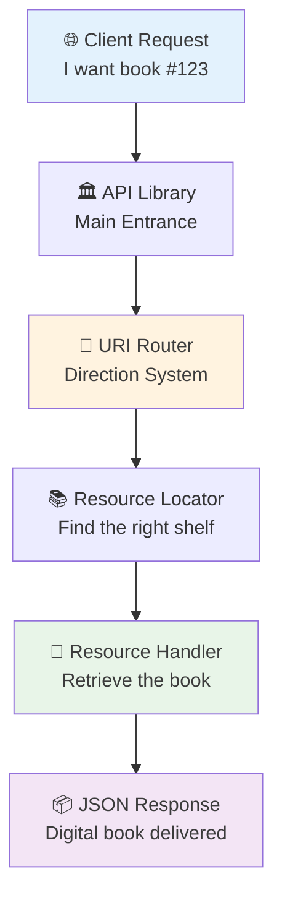
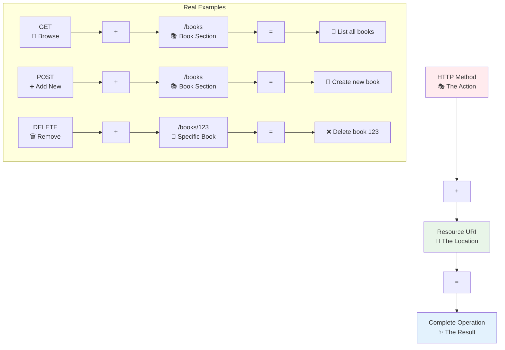
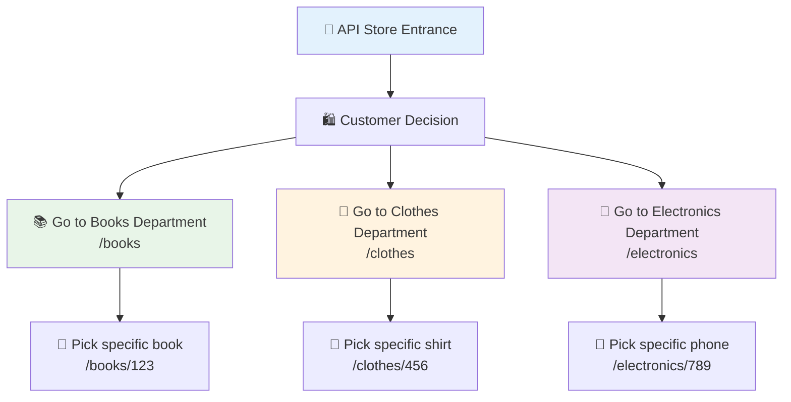
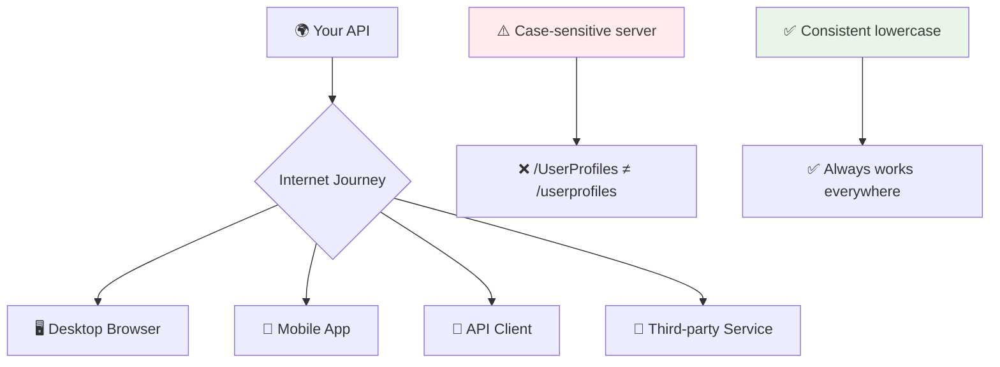
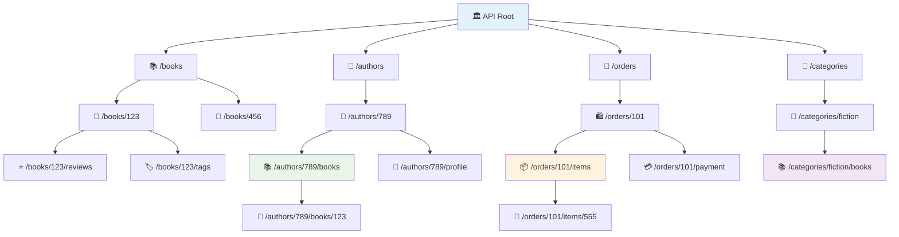

# 🏗️ Basic URI Design & Naming

## 🎯 The Big Picture: URIs as Digital Addresses

Think of your API as a massive library building. Just like a well-organized library has a logical system for finding books, your API needs a clear addressing system for finding digital resources. URI design is the art of creating these digital addresses.

### 🏛️ Real-World Analogy: The Library System
Imagine you're designing the address system for the world's largest library:
- **Floor numbers** represent your main resource categories (`/books`, `/authors`)
- **Section letters** represent subcategories (`/books/fiction`, `/books/science`)
- **Shelf numbers** represent specific items (`/books/123`, `/authors/456`)
- **Catalog cards** contain the detailed information (your API responses)

### 📊 Visual Overview: How URIs Work


## What is a URI?

A **URI (Uniform Resource Identifier)** is like a precise postal address for your API resources. Just as "123 Main Street, Apt 4B, New York, NY 10001" tells the mail carrier exactly where to deliver a package, a URI tells clients exactly where to find digital resources.

### 🏠 URI Structure Breakdown
```
https://api.bookstore.com/books/123/reviews/456
  ↑         ↑             ↑      ↑     ↑       ↑
Protocol  Domain      Collection ID  Sub-resource Sub-ID
(delivery  (building   (floor)   (room) (section)  (item)
 method)   address)
```

### 💡 The Fundamental Principle
In RESTful APIs, URIs should represent **"things"** (resources), not **"actions"**. Think of it this way:
- **Good**: `/books` (pointing to a bookshelf)
- **Bad**: `/getBooks` (describing what the librarian should do)

The librarian (your API) already knows what to do based on how you ask (HTTP method). You just need to tell them **where** to look.

## The Golden Rules of URI Design

### 🎯 Rule 1: Use Nouns, Not Verbs - The "What vs How" Principle

Think of URIs like pointing to locations in our library, while HTTP methods are like instructions to the librarian.

#### 🏛️ Library Analogy
- **URI (Noun)**: "Go to the Science Fiction shelf" → `/books/fiction`
- **HTTP Method (Verb)**: "Browse the books" (GET), "Add a new book" (POST), "Remove a book" (DELETE)

You wouldn't say "Go to the place where you get science fiction books" - you'd just say "Go to the science fiction shelf" and then specify what to do when you get there.

#### 📊 Visual: How HTTP Methods Work with Resources


#### ✅ Excellent Examples (Following the Library System)
```python
# Think: "Go to the books section and browse" (GET)
GET    /books                    # Browse all books in the library
# Think: "Go to the books section and add a new one" (POST)  
POST   /books                    # Add a new book to the collection
# Think: "Go to book #123 and examine it" (GET)
GET    /books/123                # Look at specific book #123
# Think: "Go to book #123 and replace it completely" (PUT)
PUT    /books/123                # Replace book #123 entirely
# Think: "Go to book #123 and update some details" (PATCH)
PATCH  /books/123                # Update specific parts of book #123
# Think: "Go to book #123 and remove it" (DELETE)
DELETE /books/123                # Remove book #123 from collection
```

#### ❌ Common Mistakes (Breaking the Library Rule)
```python
# Bad: Including actions in the location (like saying "go to the getting-books place")
GET    /getBooks                 # Action in URI - redundant!
POST   /createBook               # Action in URI - POST already means create!
GET    /deleteBook/123           # Action in URI - wrong method too!
DELETE /books/delete/123         # Double action - HTTP method + URI verb
PUT    /books/update/123         # Redundant - PUT already means update

# Even worse: Mixed actions and wrong methods
GET    /books/create             # GET can't create things!
POST   /books/123/delete         # POST should not be used for deletion
```

#### 💡 Pro Tip: The "Point and Ask" Test
Before writing a URI, try this mental test:
1. **Point**: Can you point to this thing in the real world? ✅ `/books/123` (yes, you can point to a book)
2. **Ask**: Are you telling someone what to do? ❌ `/getBooks` (yes, you're giving instructions)

If you pass the "point" test and fail the "ask" test, you've got a good URI!

### 📚 Rule 2: Use Plural Nouns for Collections - The "Department Store" Principle

Think of your API like a well-organized department store. Even when you want just one shirt, you go to the "Shirts" department, not the "Shirt" department.

#### 🏪 Department Store Analogy
In a real store, departments are always plural:
- **"Shoes"** department (not "Shoe") - even if you're buying just one pair
- **"Electronics"** section (not "Electronic") - even for one phone
- **"Books"** section (not "Book") - even for one specific book

This makes navigation predictable and logical.

#### 🎯 Why Consistency Matters


#### ✅ Excellent Examples (The Department Store Way)
```python
# Collections (Departments) - Always plural
GET    /books                    # Browse the "Books" department
GET    /users                    # Browse the "Users" directory  
GET    /orders                   # Browse the "Orders" archive
GET    /products                 # Browse the "Products" catalog
GET    /categories               # Browse the "Categories" list

# Specific Items - Plural collection + ID
GET    /books/123                # Book #123 from Books department
GET    /users/456                # User #456 from Users directory
GET    /orders/789               # Order #789 from Orders archive
POST   /books                    # Add new book to Books department
PUT    /users/456                # Update user #456 in Users directory
DELETE /orders/789               # Remove order #789 from Orders archive

# Nested Resources - All departments remain plural
GET    /users/456/orders         # User 456's orders from their order history
GET    /categories/fiction/books # Fiction books from the Fiction category
GET    /orders/789/items         # Items in order #789
```

#### ❌ Common Mistakes (Inconsistent Store Layout)
```python
# Bad: Mixing singular and plural (confusing store layout)
GET    /book                     # Is this one book or many? Unclear!
GET    /book/123                 # Inconsistent with other departments
GET    /user/456/order           # Mixed conventions = confused customers

# Bad: All singular (like having "Book" and "Shoe" departments)
GET    /book                     # Which book? Very confusing!
GET    /user                     # Which user? Ambiguous!
GET    /order                    # Feels incomplete

# Bad: Random mixing
GET    /books                    # Plural ✅
GET    /user/123                 # Singular ❌ 
GET    /order                    # Singular ❌
```

#### 🧠 Memory Trick: The "Always Plural Store"
```python
# Think: "I'm going to the _____ department"
# If it sounds natural, it's probably right:

"I'm going to the BOOKS department"     ✅ /books
"I'm going to the USERS department"     ✅ /users  
"I'm going to the ORDERS department"    ✅ /orders

"I'm going to the BOOK department"      ❌ /book (sounds weird!)
"I'm going to the USER department"      ❌ /user (doesn't sound right!)
"I'm going to the ORDER department"     ❌ /order (feels incomplete!)
```

#### 💡 Special Cases and Pro Tips
```python
# Irregular plurals - use the correct English plural
GET    /children                 # Not /childs
GET    /people                   # Not /persons (though /users is more common in APIs)
GET    /data                     # Data is already plural (datum is singular)

# Compound nouns - hyphenate the plural part
GET    /user-profiles            # Not /users-profile or /user-profile
GET    /order-items              # Not /orders-item or /order-item
GET    /shopping-carts           # Not /shopping-cart

# Abstract concepts - still plural for consistency
GET    /analytics                # Not /analytic
GET    /statistics               # Not /statistic
GET    /settings                 # Not /setting (though this one's debatable!)
```

### 🔤 Rule 3: Use Lowercase and Hyphens - The "Internet Highway" Standard

Think of URIs like road signs on the internet highway. Just like highway signs use consistent, easy-to-read formatting, your URIs should follow web standards for maximum compatibility.

#### 🛣️ Highway Sign Analogy
Real highway signs follow strict standards:
- **Consistent case**: All uppercase or all lowercase for readability
- **Clear separators**: Hyphens instead of spaces for clarity
- **Universal compatibility**: Readable by everyone, everywhere

Your URIs should follow the same principle - clear, consistent, and universally compatible.

#### 🌐 Why Web Standards Matter


#### ✅ Excellent Examples (Following Web Standards)
```python
# Perfect: Lowercase with hyphens (the gold standard)
GET    /user-profiles            # ✅ Clear word separation
GET    /order-items              # ✅ Easy to read and type
GET    /product-categories       # ✅ Follows web conventions
GET    /shopping-carts           # ✅ Professional appearance
GET    /payment-methods          # ✅ Universally compatible
GET    /api-endpoints            # ✅ Even technical terms work

# Complex examples with multiple words
GET    /user-account-settings    # ✅ Clear hierarchy
GET    /real-time-notifications  # ✅ Readable even with many words
GET    /customer-support-tickets # ✅ Professional and clear
```

#### ❌ Common Mistakes (Breaking Web Standards)
```python
# Bad: Mixed case (the "Microsoft Word" mistake)
GET    /UserProfiles             # ❌ Looks like class names
GET    /OrderItems               # ❌ Case-sensitive issues
GET    /ProductCategories        # ❌ Harder to type
GET    /ShoppingCarts            # ❌ Not web-standard

# Bad: Underscores (the "database field" mistake)  
GET    /user_profiles            # ❌ Harder to read in URLs
GET    /order_items              # ❌ Less common in web APIs
GET    /product_categories       # ❌ Looks like SQL tables

# Bad: camelCase (the "JavaScript variable" mistake)
GET    /userProfiles             # ❌ Inconsistent with web standards
GET    /orderItems               # ❌ Mixed case problems
GET    /productCategories        # ❌ Hard to parse visually

# Terrible: Mixed conventions (the chaos approach)
GET    /UserProfiles             # PascalCase
GET    /order_items              # snake_case  
GET    /productCategories        # camelCase
GET    /shopping-carts           # kebab-case
# This API looks unprofessional and confusing!
```

#### 🧠 Memory Tricks and Rules
```python
# The "All Lowercase Highway" rule
✅ "If it goes on the internet highway, make it lowercase"

# The "Readable Hyphen" rule  
✅ "If you'd put a space in English, use a hyphen in URLs"
   "user profiles" → "user-profiles"
   "order items" → "order-items"
   "shopping carts" → "shopping-carts"

# The "Type Test" rule
✅ "If it's hard to type or remember, it's probably wrong"
   /user-profiles     ← Easy to type and remember
   /UserProfiles      ← Have to think about capitals
   /user_profiles     ← Underscore requires Shift key
```

#### 💡 Advanced Formatting Guidelines
```python
# Single words - keep simple
GET    /books                    # ✅ No hyphens needed
GET    /users                    # ✅ Clean and simple
GET    /orders                   # ✅ Perfect as-is

# Numbers and IDs - no special formatting
GET    /books/123                # ✅ Numbers need no hyphens
GET    /orders/2024-001          # ✅ Year-number format OK
GET    /versions/v1              # ✅ Version prefixes work

# Technical terms - still follow the rules
GET    /oauth-tokens             # ✅ Even "OAuth" becomes lowercase
GET    /json-schemas             # ✅ "JSON" becomes lowercase  
GET    /api-keys                 # ✅ "API" becomes lowercase
GET    /http-headers             # ✅ "HTTP" becomes lowercase

# Very long names - consider abbreviation
GET    /customer-support-tickets                    # ✅ Clear but long
GET    /support-tickets                             # ✅ Better - shorter
GET    /extremely-long-descriptive-resource-names   # ❌ Too long!
GET    /descriptive-resources                       # ✅ Better - simplified
```

#### 🔍 Real-World Compatibility Test
```python
# Test your URIs against these scenarios:

# 1. Mobile typing test
"Can I easily type this on a phone keyboard?"
✅ /user-profiles      (easy - all lowercase, common symbols)
❌ /UserProfiles       (annoying - need to toggle caps)
❌ /user_profiles      (harder - underscore not on main keyboard)

# 2. International compatibility test  
"Will this work in different countries/systems?"
✅ /user-profiles      (universal ASCII characters)
❌ /UserProfiles       (case-sensitivity varies by system)

# 3. Developer handoff test
"Can a new developer immediately understand the pattern?"
✅ /user-profiles, /order-items, /shopping-carts    (clear pattern)
❌ /UserProfiles, /order_items, /shoppingCarts      (mixed patterns)
```

### 🏗️ Rule 4: Create Logical Hierarchies - The "Filing Cabinet" System

Think of your API like a perfectly organized filing cabinet where related documents are grouped together in logical folders and subfolders.

#### 🗂️ Filing Cabinet Analogy
In a physical filing system:
- **Main drawers**: Top-level categories (`/authors`, `/books`)
- **Folders**: Specific items (`/authors/123`, `/books/456`) 
- **Subfolders**: Related documents (`/authors/123/books`, `/books/456/reviews`)
- **Individual files**: Specific sub-items (`/authors/123/books/789`)

This creates a natural navigation path that anyone can follow.

#### 🌲 Visual: Resource Hierarchy Tree


#### ✅ Excellent Hierarchy Examples (Logical File Organization)
```python
# User-centric hierarchies (user's personal folders)
GET    /users/123                    # User 123's main profile
GET    /users/123/orders             # User 123's order history folder
GET    /users/123/orders/456         # Specific order within user's history
GET    /users/123/preferences        # User 123's settings folder
GET    /users/123/addresses          # User 123's address book

# Content hierarchies (organized by topic)
GET    /authors/789                  # Author 789's main page
GET    /authors/789/books            # All books by this author
GET    /authors/789/books/123        # Specific book by this author
GET    /authors/789/biography        # Author's biographical info
GET    /authors/789/awards           # Author's awards and recognition

# Category hierarchies (organized by type)
GET    /categories/fiction           # Fiction category main page
GET    /categories/fiction/books     # All fiction books
GET    /categories/fiction/authors   # All fiction authors
GET    /categories/sci-fi/books      # Science fiction subcategory

# Transaction hierarchies (business process organization)
GET    /orders/456                   # Order 456 main details
GET    /orders/456/items             # Items within this order
GET    /orders/456/items/789         # Specific item within this order
GET    /orders/456/payment           # Payment info for this order
GET    /orders/456/shipping          # Shipping details for this order
```

#### 🎯 When to Use Nested Hierarchies vs. Query Parameters

**✅ Use nested paths when** (parent-child relationship):
```python
# Strong ownership/containment relationships
GET    /authors/123/books            # Books BELONG TO this author
GET    /orders/456/items             # Items ARE PART OF this order
GET    /users/789/addresses          # Addresses BELONG TO this user
GET    /courses/101/lessons          # Lessons ARE PART OF this course

# Logical navigation paths
GET    /categories/fiction/books     # Fiction books (clear hierarchy)
GET    /departments/sales/employees  # Sales employees (org structure)
```

**✅ Use query parameters when** (filtering/searching):
```python
# Cross-cutting filters that don't imply ownership
GET    /books?author=tolkien         # Books filtered by author (not owned by author)
GET    /books?category=fiction       # Books filtered by category
GET    /books?published_after=2020   # Books filtered by date
GET    /books?rating_above=4         # Books filtered by rating

# Search and discovery
GET    /books?search=dragon          # Search across all books
GET    /users?role=admin             # Filter users by role
GET    /orders?status=pending        # Filter orders by status
```

#### 🧠 The "Ownership Test" for Hierarchies
```python
# Ask: "Does the child resource BELONG TO the parent?"

✅ /users/123/orders              # "User 123's orders" - YES, belongs to user
✅ /orders/456/items              # "Order 456's items" - YES, part of order  
✅ /authors/789/books             # "Author 789's books" - YES, written by author

❌ /books?author=789              # "Books by author 789" - NO, books exist independently
❌ /categories?type=fiction       # "Fiction categories" - NO, filtering categories
```

#### ⚠️ Common Hierarchy Mistakes
```python
# ❌ Too deep - going beyond logical relationships
GET    /countries/usa/states/california/cities/la/users/123/orders/456/items/789
# Better: /orders/456/items/789 (orders have items, regardless of geography)

# ❌ Backwards hierarchy - child containing parent
GET    /books/123/authors/456        # Wrong - implies book contains author
# Better: /authors/456/books/123     # Correct - author contains books

# ❌ Redundant nesting - unnecessary depth
GET    /users/123/profile/addresses/456/details
# Better: /users/123/addresses/456   # Profile is implied, details are the resource

# ❌ Mixed approaches - inconsistent patterns
GET    /authors/123/books            # Nested approach
GET    /books?author=123             # Query approach  
# Pick one approach and stick with it throughout your API!
```

#### 💡 Advanced Hierarchy Patterns
```python
# Sub-resource actions (actions on child resources)
POST   /users/123/addresses          # Add new address to user 123
PUT    /users/123/addresses/456      # Update user 123's address 456
DELETE /users/123/addresses/456      # Remove address from user 123

# Cross-references (same resource accessible via different hierarchies)  
GET    /books/123                    # Book 123 (canonical location)
GET    /authors/456/books/123        # Same book, accessed via author
GET    /categories/fiction/books/123 # Same book, accessed via category

# Nested collection operations
GET    /authors/456/books?sort=date  # Author's books sorted by date
GET    /users/123/orders?status=pending  # User's pending orders only
POST   /orders/789/items             # Add item to specific order
```

#### 🔍 Hierarchy Design Checklist
Before creating a nested URI, ask:
1. **Ownership**: Does the child truly belong to the parent?
2. **Navigation**: Would a user naturally navigate this way?
3. **Depth**: Am I going more than 2-3 levels deep?
4. **Consistency**: Does this match patterns elsewhere in my API?
5. **Alternative**: Could query parameters work better here?

## Complete Example: Bookstore API

Let's design a complete API for an online bookstore:

| Resource | URI | Description |
|----------|-----|-------------|
| **Books** |
| All books | `GET /books` | List all books |
| Specific book | `GET /books/123` | Get book details |
| Create book | `POST /books` | Add a new book |
| Update book | `PUT /books/123` | Update book completely |
| Delete book | `DELETE /books/123` | Remove book |
| **Authors** |
| All authors | `GET /authors` | List all authors |
| Specific author | `GET /authors/456` | Get author details |
| Author's books | `GET /authors/456/books` | Books by this author |
| **Categories** |
| All categories | `GET /categories` | List all categories |
| Books in category | `GET /categories/fiction/books` | Books in fiction |
| **Users** |
| User profile | `GET /users/789` | Get user details |
| User's orders | `GET /users/789/orders` | User's order history |
| **Orders** |
| Create order | `POST /orders` | Place a new order |
| Order details | `GET /orders/101` | Get order details |
| Order items | `GET /orders/101/items` | Items in this order |

## Advanced URI Patterns

### Query Parameters for Filtering 🔍

Use query parameters (after `?`) for optional modifications like filtering, sorting, and pagination:

```
# Basic resource
GET /books

# With filtering
GET /books?category=fiction&author=tolkien

# With pagination
GET /books?page=2&limit=20

# With sorting
GET /books?sort=title&order=asc

# Combined
GET /books?category=fiction&sort=rating&order=desc&limit=10
```

### Nested Resources vs. Query Parameters

**Use nested paths when:**
- The relationship is strong and clear
- You're accessing a sub-collection

```
/authors/123/books     # Books belong to this author
/orders/456/items      # Items belong to this order
```

**Use query parameters when:**
- Filtering or searching
- Optional modifications
- Cross-cutting concerns

```
/books?author=tolkien  # Filter books by author
/books?search=dragon   # Search books
/books?published_after=2020  # Filter by date
```

## 🚀 FastAPI Implementation: Building Your Digital Library

Now let's transform our library analogy into actual FastAPI code! Think of this as building the actual digital infrastructure for our library system.

### 📚 Setting Up the Digital Library (Base Configuration)

```python
# Import the tools for building our digital library system
from fastapi import FastAPI, Query, HTTPException, Path, status
from typing import Optional, List, Dict, Any
from pydantic import BaseModel, Field
from datetime import datetime
from enum import Enum

# Create our digital library building (FastAPI app)
# Think of this as constructing the main library building with all its departments
app = FastAPI(
    title="Digital Library API",  # The name on the library's front sign
    description="A RESTful API following the filing cabinet principles",
    version="1.0.0",  # Version for tracking library system updates
    docs_url="/api-docs",  # Where developers can see the library catalog
    redoc_url="/api-redocs"  # Alternative catalog view
)

# Define our data models (like catalog card templates)
class BookCategory(str, Enum):
    """Available book categories (like library sections)"""
    FICTION = "fiction"
    NON_FICTION = "non-fiction" 
    SCIENCE = "science"
    BIOGRAPHY = "biography"
    MYSTERY = "mystery"

class BookCreate(BaseModel):
    """Template for adding new books to our library catalog"""
    title: str = Field(..., min_length=1, max_length=200, description="Book title")
    author: str = Field(..., min_length=1, max_length=100, description="Author name")
    isbn: str = Field(..., regex=r"^\d{10}(\d{3})?$", description="ISBN-10 or ISBN-13")
    category: BookCategory = Field(..., description="Book category/section")
    price: float = Field(..., gt=0, description="Book price in USD")
    publication_year: int = Field(..., ge=1000, le=datetime.now().year, description="Year published")

class BookResponse(BookCreate):
    """Template for book information (what customers see)"""
    id: int = Field(..., description="Unique book identifier")
    created_at: datetime = Field(..., description="When book was added to catalog")
    updated_at: Optional[datetime] = Field(None, description="Last update time")

class BookUpdate(BaseModel):
    """Template for updating existing books (partial updates allowed)"""
    title: Optional[str] = Field(None, min_length=1, max_length=200)
    author: Optional[str] = Field(None, min_length=1, max_length=100)
    category: Optional[BookCategory] = None
    price: Optional[float] = Field(None, gt=0)
    publication_year: Optional[int] = Field(None, ge=1000, le=datetime.now().year)
```

### 📖 Collection Endpoints (Department-Level Operations)

```python
# RULE 1 & 2: Use plural nouns, not verbs - "/books" is a department, not an action
@app.get(
    "/books",  # The "Books" department (always plural!)
    response_model=List[BookResponse],  # Type hint for better documentation
    status_code=status.HTTP_200_OK,  # Explicit success status
    summary="Browse the Books Department",  # Short description
    description="Get all books with optional filtering - like browsing library shelves"
)
async def browse_books_department(
    # Query parameters - like asking the librarian for help finding specific books
    category: Optional[BookCategory] = Query(
        None, 
        description="Filter books by category (like going to a specific library section)"
    ),
    author: Optional[str] = Query(
        None, 
        min_length=1,
        description="Filter books by author name (like searching for a specific writer)"
    ),
    search: Optional[str] = Query(
        None,
        min_length=1, 
        description="Search books by title or keywords"
    ),
    # Pagination - like limiting how many books the librarian shows at once
    page: int = Query(1, ge=1, description="Page number for pagination"),
    limit: int = Query(10, ge=1, le=100, description="Number of books per page (max 100)"),
    # Sorting - like asking for books arranged in a specific order
    sort_by: Optional[str] = Query("title", regex="^(title|author|price|publication_year)$"),
    order: Optional[str] = Query("asc", regex="^(asc|desc)$")
) -> List[BookResponse]:
    """
    Browse the Books department with optional filters and sorting.
    
    Like walking into the Books section of our library and asking:
    "Show me fiction books by Tolkien, sorted by publication year"
    
    Returns:
        List of books matching the criteria
    """
    try:
        # In a real implementation, this would query your database
        # For now, we'll return a placeholder response
        
        # Simulate error handling - like a librarian dealing with issues
        if search and len(search.strip()) == 0:
            raise HTTPException(
                status_code=status.HTTP_400_BAD_REQUEST,
                detail="Search term cannot be empty - please provide valid keywords"
            )
        
        # TODO: Implement actual database query logic here
        return []  # Placeholder return
        
    except HTTPException:
        raise  # Re-raise HTTP exceptions
    except Exception as e:
        # Log the error and return a user-friendly message
        raise HTTPException(
            status_code=status.HTTP_500_INTERNAL_SERVER_ERROR,
            detail="The librarian encountered an issue while searching - please try again"
        )

@app.post(
    "/books",  # POST to collection creates new resource
    response_model=BookResponse,
    status_code=status.HTTP_201_CREATED,  # 201 for successful creation
    summary="Add New Book to Library",
    description="Add a new book to the library catalog - like a librarian cataloging a new acquisition"
)
async def add_book_to_library(
    book_data: BookCreate = Field(..., description="New book information")
) -> BookResponse:
    """
    Add a new book to the library catalog.
    
    Like bringing a new book to the librarian's desk and saying:
    "Please add this to the library collection"
    
    Args:
        book_data: Complete information about the new book
        
    Returns:
        The newly created book with its assigned library ID
    """
    try:
        # TODO: Implement actual database creation logic
        # Simulate creating a new book record
        
        # Return the created book (in real app, this would include database-generated ID)
        return BookResponse(
            **book_data.dict(),
            id=12345,  # This would be generated by your database
            created_at=datetime.now(),
            updated_at=None
        )
        
    except Exception as e:
        raise HTTPException(
            status_code=status.HTTP_500_INTERNAL_SERVER_ERROR,
            detail="Failed to add book to library catalog - please check the information and try again"
        )
```

### 🎯 Individual Resource Endpoints (Specific Item Operations)

```python
@app.get(
    "/books/{book_id}",  # Path parameter for specific book (like a call number)
    response_model=BookResponse,
    status_code=status.HTTP_200_OK,
    summary="Get Specific Book Details", 
    description="Retrieve details for a specific book - like asking for book #123 from the catalog"
)
async def get_specific_book(
    book_id: int = Path(..., gt=0, description="Unique book identifier (like a library call number)")
) -> BookResponse:
    """
    Get detailed information about a specific book.
    
    Like going to the librarian and saying: "I need book #123"
    
    Args:
        book_id: The unique identifier for the book
        
    Returns:
        Complete book details
        
    Raises:
        404: If book doesn't exist (like book not found in catalog)
    """
    try:
        # TODO: Implement actual database lookup
        
        # Simulate book not found scenario
        if book_id <= 0:
            raise HTTPException(
                status_code=status.HTTP_404_NOT_FOUND,
                detail=f"Book #{book_id} not found in our library catalog"
            )
            
        # TODO: Return actual book data from database
        return BookResponse(
            id=book_id,
            title="Sample Book",
            author="Sample Author", 
            isbn="1234567890",
            category=BookCategory.FICTION,
            price=19.99,
            publication_year=2023,
            created_at=datetime.now(),
            updated_at=None
        )
        
    except HTTPException:
        raise
    except Exception as e:
        raise HTTPException(
            status_code=status.HTTP_500_INTERNAL_SERVER_ERROR,
            detail="Error retrieving book from catalog - please try again"
        )

@app.put(
    "/books/{book_id}",
    response_model=BookResponse,
    status_code=status.HTTP_200_OK,
    summary="Update Complete Book Record",
    description="Replace entire book record - like completely rewriting a catalog card"
)
async def replace_book_record(
    book_id: int = Path(..., gt=0, description="Book ID to update"),
    book_data: BookCreate = Field(..., description="Complete new book information")
) -> BookResponse:
    """
    Completely replace a book's information in the catalog.
    
    Like taking the old catalog card and replacing it entirely with a new one.
    ALL fields must be provided (complete replacement).
    
    Args:
        book_id: The book to update
        book_data: Complete new book information
        
    Returns:
        The updated book record
    """
    try:
        # TODO: Implement database update logic
        # Verify book exists first
        
        return BookResponse(
            **book_data.dict(),
            id=book_id,
            created_at=datetime.now(),  # Would be original creation time
            updated_at=datetime.now()   # Current timestamp
        )
        
    except Exception as e:
        raise HTTPException(
            status_code=status.HTTP_500_INTERNAL_SERVER_ERROR,
            detail="Failed to update book record"
        )

@app.patch(
    "/books/{book_id}",
    response_model=BookResponse, 
    status_code=status.HTTP_200_OK,
    summary="Update Partial Book Information",
    description="Update only specific fields - like editing part of a catalog card"
)
async def update_book_details(
    book_id: int = Path(..., gt=0, description="Book ID to update"),
    book_updates: BookUpdate = Field(..., description="Fields to update (partial update)")
) -> BookResponse:
    """
    Update only specific fields of a book record.
    
    Like asking the librarian: "Please update just the price for book #123"
    Only the fields you provide will be changed.
    
    Args:
        book_id: The book to update
        book_updates: Only the fields you want to change
        
    Returns:
        The updated book record
    """
    try:
        # TODO: Implement partial update logic
        # Get existing book, apply only provided updates
        
        # Simulate partial update
        return BookResponse(
            id=book_id,
            title="Updated Book",  # Would merge with existing data
            author="Updated Author",
            isbn="1234567890", 
            category=BookCategory.FICTION,
            price=29.99,
            publication_year=2023,
            created_at=datetime.now(),
            updated_at=datetime.now()
        )
        
    except Exception as e:
        raise HTTPException(
            status_code=status.HTTP_500_INTERNAL_SERVER_ERROR,
            detail="Failed to update book details"
        )

@app.delete(
    "/books/{book_id}",
    status_code=status.HTTP_204_NO_CONTENT,  # 204 means successful deletion, no content returned
    summary="Remove Book from Library",
    description="Remove a book from the library catalog - like taking a book out of circulation"
)
async def remove_book_from_catalog(
    book_id: int = Path(..., gt=0, description="Book ID to remove")
) -> None:
    """
    Remove a book from the library catalog completely.
    
    Like telling the librarian: "Please remove book #123 from our collection"
    This cannot be undone!
    
    Args:
        book_id: The book to remove
        
    Returns:
        No content (204 status code indicates successful deletion)
    """
    try:
        # TODO: Implement actual deletion logic
        # Verify book exists first, then delete
        
        # Check if book exists
        if book_id <= 0:
            raise HTTPException(
                status_code=status.HTTP_404_NOT_FOUND,
                detail=f"Book #{book_id} not found - cannot delete non-existent book"
            )
            
        # TODO: Perform actual deletion
        # No return statement needed for 204 status
        
    except HTTPException:
        raise
    except Exception as e:
        raise HTTPException(
            status_code=status.HTTP_500_INTERNAL_SERVER_ERROR,
            detail="Failed to remove book from catalog"
        )
```

### 🏗️ Nested Resource Endpoints (Hierarchical Operations)

```python
# RULE 4: Logical hierarchies - books that belong to specific authors
@app.get(
    "/authors/{author_id}/books",  # Nested: author contains books
    response_model=List[BookResponse],
    status_code=status.HTTP_200_OK,
    summary="Get Author's Books",
    description="Get all books by a specific author - like going to an author's dedicated shelf"
)
async def get_books_by_author(
    author_id: int = Path(..., gt=0, description="Author's unique identifier"),
    # Still allow filtering within this author's collection
    category: Optional[BookCategory] = Query(None, description="Filter this author's books by category"),
    limit: int = Query(10, ge=1, le=100, description="Maximum books to return")
) -> List[BookResponse]:
    """
    Get all books written by a specific author.
    
    Like going to the library and saying: "Show me all books by author #789"
    This demonstrates proper hierarchy: /authors/{id}/books
    
    Args:
        author_id: The author whose books to retrieve
        category: Optional filter for book category
        limit: Maximum number of books to return
        
    Returns:
        List of books by this author
    """
    try:
        # TODO: Implement author lookup and book retrieval
        
        # Verify author exists first
        if author_id <= 0:
            raise HTTPException(
                status_code=status.HTTP_404_NOT_FOUND,
                detail=f"Author #{author_id} not found in our database"
            )
            
        # TODO: Get books by this author from database
        return []  # Placeholder
        
    except HTTPException:
        raise
    except Exception as e:
        raise HTTPException(
            status_code=status.HTTP_500_INTERNAL_SERVER_ERROR,
            detail="Error retrieving author's books"
        )

@app.get(
    "/categories/{category_name}/books",  # Hierarchical: category contains books
    response_model=List[BookResponse],
    status_code=status.HTTP_200_OK,
    summary="Get Books in Category",
    description="Get all books in a specific category - like browsing a particular library section"
)
async def get_books_in_category(
    category_name: BookCategory = Path(..., description="Category name (fiction, science, etc.)"),
    author: Optional[str] = Query(None, description="Filter by author within this category"),
    limit: int = Query(20, ge=1, le=100, description="Maximum books to return")
) -> List[BookResponse]:
    """
    Get all books in a specific category.
    
    Like walking to the "Fiction" section and browsing all the books there.
    This shows proper use of categories as organizational hierarchies.
    
    Args:
        category_name: The category to browse
        author: Optional filter by author within this category
        limit: Maximum number of books to return
        
    Returns:
        List of books in this category
    """
    try:
        # TODO: Implement category-based book retrieval
        return []  # Placeholder
        
    except Exception as e:
        raise HTTPException(
            status_code=status.HTTP_500_INTERNAL_SERVER_ERROR,
            detail=f"Error retrieving books from {category_name} category"
        )

# Example of adding items to nested collections
@app.post(
    "/authors/{author_id}/books",
    response_model=BookResponse,
    status_code=status.HTTP_201_CREATED,
    summary="Add Book to Author's Collection",
    description="Add a new book and associate it with a specific author"
)
async def add_book_to_author(
    author_id: int = Path(..., gt=0, description="Author to associate book with"),
    book_data: BookCreate = Field(..., description="New book information")
) -> BookResponse:
    """
    Add a new book and associate it with a specific author.
    
    Like saying: "Add this new book to author #456's collection"
    This demonstrates creating resources within hierarchical structures.
    
    Args:
        author_id: The author who wrote this book
        book_data: Complete book information
        
    Returns:
        The newly created book with author association
    """
    try:
        # TODO: Verify author exists, then create book with author association
        
        # Create book and link to author
        return BookResponse(
            **book_data.dict(),
            id=67890,  # Generated by database
            created_at=datetime.now(),
            updated_at=None
        )
        
    except Exception as e:
        raise HTTPException(
            status_code=status.HTTP_500_INTERNAL_SERVER_ERROR,
            detail="Failed to add book to author's collection"
        )
```

### 💡 Pro Tips: FastAPI Best Practices Applied

```python
# Error handling with proper HTTP status codes
@app.exception_handler(404)
async def not_found_handler(request, exc):
    """Custom 404 handler with library analogy"""
    return JSONResponse(
        status_code=404,
        content={
            "error": "Resource not found",
            "message": "Like looking for a book that's not in our catalog",
            "suggestion": "Check the resource ID and try again"
        }
    )

# Input validation with helpful error messages
@app.post("/books/validate-isbn")
async def validate_book_isbn(isbn: str = Field(..., regex=r"^\d{10}(\d{3})?$")):
    """
    Validate ISBN format before adding to catalog.
    
    Like a librarian checking if a book number follows the proper format
    before adding it to the official catalog system.
    """
    return {"valid": True, "message": "ISBN format is correct"}

# Health check endpoint (common in production APIs)
@app.get("/health", status_code=200, summary="Library System Health Check")
async def check_library_system_health():
    """
    Check if the library system is running properly.
    
    Like checking if all library departments are open and operational.
    """
    return {
        "status": "healthy",
        "timestamp": datetime.now(),
        "message": "Digital library system is operational"
    }
```

This FastAPI implementation follows all our golden rules:

1. **✅ Nouns, not verbs**: `/books` not `/getBooks`
2. **✅ Plural collections**: `/books`, `/authors`, not `/book`
3. **✅ Lowercase with hyphens**: All endpoints use proper web standards
4. **✅ Logical hierarchies**: `/authors/{id}/books` shows clear relationships
5. **✅ Query parameters for filtering**: `?category=fiction&author=tolkien`
6. **✅ Proper HTTP methods**: GET for reading, POST for creating, etc.
7. **✅ Type hints and validation**: Using Pydantic models for data validation
8. **✅ Error handling**: Proper HTTP status codes and user-friendly messages
9. **✅ Documentation**: FastAPI auto-generates interactive API docs

## 🚨 Common Mistakes to Avoid: Learning from Others' Errors

Learning what NOT to do is just as important as learning best practices. Here are the most common URI design mistakes that can make your API confusing and unprofessional.

### ❌ Critical Mistake 1: Actions in URLs (The "Verb Virus")

**The Problem**: Including actions in URLs breaks the fundamental REST principle and makes your API inconsistent.

#### 🏛️ Library Analogy of the Mistake
Imagine if library sections were named by what you do there:
- "Getting-Books Section" instead of "Books Section"
- "Borrowing-DVDs Area" instead of "DVDs Section"  
- "Returning-Items Counter" instead of "Returns Counter"

This would be confusing because the HTTP method already tells us the action!

#### ❌ Bad Examples (Action-Heavy URLs)
```python
# The "Verb Virus" - actions polluting our clean URLs
@app.get("/users/login")           # ❌ Action in URL
@app.get("/books/search")          # ❌ Action in URL
@app.post("/orders/create")        # ❌ Double action (POST + create)
@app.get("/products/getAllActive") # ❌ Action + mixed case + redundant
@app.delete("/users/delete/123")   # ❌ Double deletion instruction

# Even worse: Wrong methods with actions
@app.get("/books/add")             # ❌ GET can't add things!
@app.post("/users/get/123")        # ❌ POST shouldn't get things!
```

#### ✅ Clean Solutions (Resource-Focused URLs)
```python
# Clean, resource-focused endpoints following REST principles
@app.post("/sessions")             # ✅ Login creates a session
@app.get("/books?search=keyword")  # ✅ Search via query parameters
@app.post("/orders")               # ✅ POST implies creation
@app.get("/products?status=active") # ✅ Filter via query params
@app.delete("/users/123")          # ✅ One clear deletion instruction

# Correct methods with clean URLs
@app.post("/books")                # ✅ POST to add new book
@app.get("/users/123")             # ✅ GET to retrieve user
```

### ❌ Critical Mistake 2: Inconsistent Naming (The "Convention Chaos")

**The Problem**: Mixing different naming conventions makes your API look amateur and creates confusion.

#### 🏪 Department Store Analogy of the Mistake
Imagine a store with inconsistent signage:
- "ELECTRONICS" (all caps)
- "home_furnishings" (snake_case)
- "KidsClothing" (PascalCase)
- "sports-equipment" (kebab-case)

Customers would be confused about where to find things!

#### ❌ Bad Examples (Mixed Conventions)
```python
# The "Convention Chaos" - mixing different styles randomly
@app.get("/Users")                 # ❌ PascalCase (looks like a class)
@app.get("/book_reviews")          # ❌ snake_case (database style)
@app.get("/orderItems")            # ❌ camelCase (JavaScript style)
@app.get("/Product-Categories")    # ❌ Mixed case with hyphens
@app.get("/CUSTOMER_PROFILES")     # ❌ SCREAMING_SNAKE_CASE

# Results in a confusing, unprofessional API
```

#### ✅ Consistent Solutions (Unified Convention)
```python
# All endpoints follow the same kebab-case convention
@app.get("/users")                 # ✅ Clean and consistent
@app.get("/book-reviews")          # ✅ Readable word separation
@app.get("/order-items")           # ✅ Professional appearance
@app.get("/product-categories")    # ✅ Clear hierarchy
@app.get("/customer-profiles")     # ✅ Easy to type and remember
```

### ❌ Critical Mistake 3: Excessive Nesting (The "Rabbit Hole")*)

**The Problem**: Going too deep in URL hierarchies makes endpoints unwieldy and often doesn't reflect real relationships.

#### 🗂️ Filing Cabinet Analogy of the Mistake
Imagine a filing system like this:
```
Building/Floor3/Section-A/Cabinet-5/Drawer-2/Folder-Books/Subfolder-Fiction/Author-Tolkien/Book-123/Chapter-4/Page-89
```

By the time you navigate to what you want, you've forgotten where you started!

#### ❌ Bad Examples (Too Deep Nesting)
```python
# The "Rabbit Hole" - going way too deep
@app.get("/countries/usa/states/california/cities/la/stores/123/departments/electronics/products/456/reviews/789")
# ❌ This is 9 levels deep! Way too much!

@app.get("/companies/123/departments/456/teams/789/employees/101/projects/202/tasks/303/comments/404")
# ❌ 10 levels! You've lost track of what you're actually getting

@app.get("/users/123/profiles/456/preferences/789/notifications/101/settings/202/email/303")
# ❌ Each level adds confusion rather than clarity
```

#### ✅ Practical Solutions (Logical Depth Limits)
```python
# Keep it simple - usually 2-3 levels maximum
@app.get("/stores/123/products")           # ✅ 2 levels - clear relationship
@app.get("/products?store=123&city=la")    # ✅ Use query params for filters

@app.get("/employees/101/projects")        # ✅ 2 levels - direct relationship
@app.get("/projects?employee=101&team=789") # ✅ Complex filters via query params

@app.get("/users/123/notifications")       # ✅ 2 levels - clear ownership
@app.get("/notifications/101")             # ✅ Direct access when you have the ID
```

### ❌ Mistake 4: Query Parameter Abuse (The "URL Soup")

**The Problem**: Putting too much logic into query parameters makes URLs unreadable and hard to cache.

#### ❌ Bad Examples (Query Parameter Overload)
```python
# The "URL Soup" - too much complexity in query strings
@app.get("/books?author=tolkien&category=fiction&min_price=10&max_price=50&published_after=2000&published_before=2023&rating_above=4&language=english&format=hardcover&available=true&sort=title&order=asc&page=1&limit=20")
# ❌ This URL is impossible to read or remember!

# Putting hierarchical data in query params
@app.get("/books?author_id=123&author_books=true")  # ❌ Use nested paths instead
```

#### ✅ Better Solutions (Balanced Approach)
```python
# Keep query params focused and reasonable
@app.get("/books?category=fiction&author=tolkien&sort=title")  # ✅ Clean and focused
@app.get("/authors/123/books")                                 # ✅ Use hierarchy for relationships
```

### 🔧 Debugging Your URI Design

#### The "5-Second Rule" Test
Can someone understand what your endpoint does in 5 seconds?

```python
# 5-Second Test Results:
"/books/123"                    # ✅ Clear: "Get book number 123"
"/users/456/orders"             # ✅ Clear: "Get orders for user 456"  
"/getUserProfileSettings"       # ❌ Confusing: "What method? What format?"
"/api/v1/get/users/profile/123/settings/personal" # ❌ Too complex
```

#### The "New Developer" Test
If a new developer joined your team, could they guess your API patterns?

```python
# Pattern Recognition Test:
@app.get("/books")              # Pattern: /resources
@app.get("/authors")            # Follows pattern ✅
@app.get("/orders")             # Follows pattern ✅
@app.get("/getProducts")        # Breaks pattern ❌
```

#### The "Mobile Typing" Test
Can someone easily type your URLs on a mobile device?

```python
# Mobile Typing Difficulty:
"/user-profiles"      # ✅ Easy - lowercase, common symbols
"/UserProfiles"       # ❌ Hard - requires case switching
"/user_profiles"      # ❌ Harder - underscore not on main keyboard
```

## 📋 Best Practices Mastery Checklist

Before declaring your URI design complete, ensure you've followed these Vue.js-excellence standards:

### 🎯 Core Design Principles (Must-Have)
- **✅ Use nouns, not verbs** - Resources are "things," actions are HTTP methods
- **✅ Use plural collections** - `/books`, `/users`, not `/book`, `/user`
- **✅ Use lowercase with hyphens** - `user-profiles`, not `UserProfiles` or `user_profiles`  
- **✅ Logical hierarchies** - `/authors/123/books`, not `/books?author=123` when showing ownership
- **✅ Query parameters for filtering** - `/books?category=fiction&sort=title`
- **✅ Limit nesting depth** - 2-3 levels maximum for readability
- **✅ Consistent patterns** - Same naming conventions throughout your entire API

### 🏗️ Professional Quality Markers (Should-Have)
- **✅ Type hints and validation** - Use Pydantic models for data validation
- **✅ Proper HTTP status codes** - 200, 201, 404, 500 with meaningful messages
- **✅ Error handling** - Graceful failures with helpful error messages
- **✅ Documentation** - Clear descriptions and examples for each endpoint
- **✅ Input validation** - Prevent bad data with proper validation rules
- **✅ Security considerations** - Rate limiting, input sanitization, proper authentication

### 🚀 Excellence Indicators (Nice-to-Have)
- **✅ Health check endpoints** - `/health` for monitoring
- **✅ API versioning strategy** - `/v1/books` or version headers
- **✅ Pagination support** - `?page=1&limit=20` for large datasets
- **✅ Filtering and sorting** - Multiple ways to query your data
- **✅ Custom error handlers** - User-friendly error responses
- **✅ Performance optimization** - Caching headers, optimized queries

## 🔍 Testing Your URI Design Excellence

### The "Developer Experience" Test
```python
# Rate your API on developer experience:

# 1. Discoverability Test
"Can developers guess endpoint patterns after seeing 2-3 examples?"
✅ /books, /authors, /orders → /products (predictable)
❌ /books, /getAuthors, /order-list → /??? (unpredictable)

# 2. Readability Test  
"Can you read the endpoint aloud naturally?"
✅ "GET users 123 orders" → GET /users/123/orders
❌ "GET users get orders by user ID" → GET /users/getOrdersByUserId

# 3. Memorability Test
"Can developers remember the pattern after using it once?"
✅ /resources/{id}/sub-resources (clear pattern)
❌ /getResourcesByIdWithSubResources (complex pattern)
```

### The "Real-World Usage" Test
```python
# Test with realistic scenarios:

# Mobile App Integration
"Can a mobile developer easily implement this?"
✅ Simple, consistent endpoints with clear documentation
❌ Complex nesting and inconsistent patterns

# Third-Party Integration
"Would you be comfortable giving this API to external developers?"
✅ Professional, well-documented, predictable
❌ Confusing, undocumented, inconsistent

# Long-term Maintenance
"Will this API structure still make sense in 2 years?"
✅ Clear, logical organization following REST principles
❌ Ad-hoc structure that grew without planning
```

## 🛠️ Troubleshooting Guide: Common URI Design Issues

### ⚠️ Problem: "My URLs are getting too long and complex"

**Symptoms**:
```python
@app.get("/users/123/preferences/notifications/email/marketing/campaigns/456/analytics/performance/metrics")
```

**Diagnosis**: Over-nesting and trying to represent too much hierarchy in the URL.

**💊 Treatment**:
```python
# Instead of deep nesting, use direct access + query parameters
@app.get("/campaigns/456/analytics")  # Direct access to what you need
@app.get("/analytics?campaign=456&type=performance&metric=email")  # Or filter approach
```

### ⚠️ Problem: "Developers keep using my API wrong"

**Symptoms**: Users consistently making incorrect API calls or asking for clarification.

**Diagnosis**: Unclear or inconsistent URL patterns.

**💊 Treatment**:
```python
# Before: Confusing patterns
@app.get("/user")           # Singular - confusing
@app.get("/getBooks")       # Action in URL
@app.get("/order_items")    # Different naming convention

# After: Clear, consistent patterns  
@app.get("/users")          # Plural collections
@app.get("/books")          # Resource-focused
@app.get("/order-items")    # Consistent naming
```

### ⚠️ Problem: "I can't decide between nested URLs and query parameters"

**Decision Tree**:
```python
# Ask: "Does the child resource BELONG TO the parent?"

# YES → Use nested URLs
@app.get("/users/123/orders")        # Orders belong to user
@app.get("/orders/456/items")        # Items belong to order

# NO → Use query parameters  
@app.get("/books?author=tolkien")    # Books don't belong to author
@app.get("/products?category=electronics")  # Products don't belong to category
```

### ⚠️ Problem: "My API feels inconsistent"

**Diagnosis Checklist**:
```python
# Check these common inconsistency sources:

# 1. Mixed naming conventions
❌ /users, /book_reviews, /orderItems  # Mixed styles
✅ /users, /book-reviews, /order-items  # Consistent kebab-case

# 2. Inconsistent resource patterns
❌ /books/{id}, /authors/get/{id}      # Mixed patterns
✅ /books/{id}, /authors/{id}          # Consistent patterns

# 3. Inconsistent HTTP method usage
❌ GET /books/create, POST /books/search  # Wrong methods
✅ POST /books, GET /books?search=term    # Correct methods
```

## 🎓 Advanced URI Design Patterns

### Pattern 1: Resource Actions (Non-CRUD Operations)
```python
# For actions that don't fit standard CRUD:
@app.post("/orders/123/cancel")     # Cancel an order
@app.post("/books/456/reserve")     # Reserve a book  
@app.post("/users/789/activate")    # Activate a user account

# Think: "I'm performing an action ON this specific resource"
```

### Pattern 2: Batch Operations
```python
# For operations on multiple resources:
@app.post("/books/batch")           # Create multiple books
@app.delete("/orders/batch")        # Cancel multiple orders
@app.patch("/users/batch")          # Update multiple users

# Body contains array of resources or IDs to operate on
```

### Pattern 3: Related Resource Access
```python
# Multiple ways to access the same data:
@app.get("/books/123")              # Canonical access
@app.get("/authors/456/books/123")  # Access via relationship
@app.get("/categories/fiction/books/123")  # Access via category

# Each provides different context for the same resource
```

## 🚀 What's Next: Your URI Design Journey

### 🎯 Immediate Next Steps
1. **Practice the Golden Rules** - Apply all 4 rules to a simple project
2. **Learn HTTP Methods** - Master GET, POST, PUT, PATCH, DELETE
3. **Study Real APIs** - Look at GitHub, Stripe, or Twitter API patterns

### 📚 Progressive Learning Path
Now that you've mastered URI design basics, you're ready for:

- **[Basic HTTP Methods](/docs/01_getting-started/basic-http-methods)** - Master REST verbs and understand when to use each method
- **[Your First API](/docs/01_getting-started/your-first-api)** - Build a complete API applying these URI design principles
- **[Foundation Concepts](/docs/02_foundation)** - Learn data validation, error handling, and testing

### 💡 Pro Tips for Continued Growth
1. **Study Popular APIs** - GitHub, Stripe, and Twilio have excellent URI design
2. **Get Feedback Early** - Share your API design with other developers
3. **Document Everything** - Good documentation makes average APIs great
4. **Think Like a User** - Your API should feel intuitive to developers using it

### 🎉 Success Metrics
You'll know you've mastered URI design when:
- **New developers** can use your API without extensive documentation
- **Your future self** can understand the API structure months later  
- **Other developers** compliment your API's intuitive design
- **Integration time** for new features takes minutes, not hours

Remember: Excellent URI design is like a well-organized library - everything has its logical place, and finding what you need feels natural and effortless. Take time to plan your resource structure thoughtfully, and your API will serve you and your users well for years to come!

## 📖 Quick Reference Card

```python
# The URI Design Cheat Sheet - Keep this handy!

# ✅ GOOD Examples:
GET    /books                    # Browse collection
GET    /books/123                # Get specific item
POST   /books                    # Create new item
PUT    /books/123                # Replace entire item
PATCH  /books/123                # Update specific fields
DELETE /books/123                # Remove item
GET    /authors/456/books        # Get related collection
GET    /books?category=fiction   # Filter collection

# ❌ AVOID These:
GET    /getBooks                 # Action in URL
POST   /createBook               # Action in URL
GET    /book/123                 # Singular collection
GET    /Books                    # Wrong case
GET    /user_books               # Wrong separator
GET    /a/b/c/d/e/f/g           # Too deep nesting
```