# 🏗️ Basic URI Design & Naming

Designing good API endpoints is like creating a well-organized filing system - everything should be in a logical place that's easy to find. Let's learn the fundamental principles of URI (URL) design that will make your API intuitive and predictable.

## What is a URI?

A **URI (Uniform Resource Identifier)** is the address for your API endpoint. Think of it like a street address that tells clients exactly where to find specific resources.

```
https://api.bookstore.com/books/123
     ↑           ↑         ↑    ↑
   Protocol    Domain   Resource ID
```

In RESTful APIs, URIs should represent **"things"** (resources), not **"actions"**.

## The Golden Rules of URI Design

### 1. Use Nouns, Not Verbs 📝

URIs should represent **what** (the resource), while HTTP methods tell us **how** (the action).

```mermaid
graph LR
    A[HTTP Method] + B[Resource URI] = C[Complete Operation]
    
    D[GET] + E[/books] = F[Get all books]
    G[POST] + H[/books] = I[Create new book]
    J[DELETE] + K[/books/123] = L[Delete book 123]
```

**✅ Good Examples:**
```
GET    /books           # Get all books
POST   /books           # Create a new book
GET    /books/123       # Get book with ID 123
PUT    /books/123       # Update book 123
DELETE /books/123       # Delete book 123
```

**❌ Bad Examples:**
```
GET    /getBooks        # Action in URI
POST   /createBook      # Action in URI
GET    /book/delete/123 # Action in URI
```

**Why this matters:** The HTTP method already tells us the action, so including it in the URI is redundant and breaks REST principles.

### 2. Use Plural Nouns for Collections 👥

Always use plural forms for consistency, even when dealing with a single item.

**✅ Good:**
```
/books          # Collection of books
/books/123      # Specific book within the collection
/users          # Collection of users
/users/456      # Specific user within the collection
```

**❌ Bad:**
```
/book           # Unclear if this is one book or many
/book/123       # Inconsistent with collection naming
```

**Real-world analogy:** Think of a library with sections like "Books," "Magazines," and "DVDs" - even when you're looking for one specific book, you still go to the "Books" section.

### 3. Use Lowercase and Hyphens 🔤

Stick to lowercase letters and use hyphens to separate words for maximum compatibility.

**✅ Good:**
```
/user-profiles
/order-items
/product-categories
```

**❌ Bad:**
```
/UserProfiles    # Mixed case
/user_profiles   # Underscores (less common in URLs)
/orderItems      # camelCase
```

**Why:** URLs are case-sensitive in some systems, and lowercase with hyphens is the web standard.

### 4. Create Logical Hierarchies 🏗️

Show relationships between resources using nested paths.

```mermaid
graph TD
    A[📚 /books] --> B[📖 /books/123]
    A --> C[📖 /books/456]
    
    D[👥 /authors] --> E[👤 /authors/789]
    E --> F[📚 /authors/789/books]
    F --> G[📖 /authors/789/books/123]
    
    style F fill:#e1f5fe
    style G fill:#f3e5f5
```



**Examples:**
```
/authors/789/books           # All books by author 789
/categories/fiction/books    # All fiction books
/users/123/orders           # All orders by user 123
/orders/456/items           # All items in order 456
```

## Complete Example: Bookstore API

Let's design a complete API for an online bookstore:

| Resource | URI | Description |
|----------|-----|-------------|
| **Books** |
| All books | `GET /books` | List all books |
| Specific book | `GET /books/123` | Get book details |
| Create book | `POST /books` | Add a new book |
| Update book | `PUT /books/123` | Update book completely |
| Delete book | `DELETE /books/123` | Remove book |
| **Authors** |
| All authors | `GET /authors` | List all authors |
| Specific author | `GET /authors/456` | Get author details |
| Author's books | `GET /authors/456/books` | Books by this author |
| **Categories** |
| All categories | `GET /categories` | List all categories |
| Books in category | `GET /categories/fiction/books` | Books in fiction |
| **Users** |
| User profile | `GET /users/789` | Get user details |
| User's orders | `GET /users/789/orders` | User's order history |
| **Orders** |
| Create order | `POST /orders` | Place a new order |
| Order details | `GET /orders/101` | Get order details |
| Order items | `GET /orders/101/items` | Items in this order |

## Advanced URI Patterns

### Query Parameters for Filtering 🔍

Use query parameters (after `?`) for optional modifications like filtering, sorting, and pagination:

```
# Basic resource
GET /books

# With filtering
GET /books?category=fiction&author=tolkien

# With pagination
GET /books?page=2&limit=20

# With sorting
GET /books?sort=title&order=asc

# Combined
GET /books?category=fiction&sort=rating&order=desc&limit=10
```

### Nested Resources vs. Query Parameters

**Use nested paths when:**
- The relationship is strong and clear
- You're accessing a sub-collection

```
/authors/123/books     # Books belong to this author
/orders/456/items      # Items belong to this order
```

**Use query parameters when:**
- Filtering or searching
- Optional modifications
- Cross-cutting concerns

```
/books?author=tolkien  # Filter books by author
/books?search=dragon   # Search books
/books?published_after=2020  # Filter by date
```

## FastAPI Implementation

Here's how these principles look in FastAPI:

```python
from fastapi import FastAPI, Query
from typing import Optional

app = FastAPI()

# Collection endpoints
@app.get("/books")
async def get_books(
    category: Optional[str] = Query(None),
    author: Optional[str] = Query(None),
    limit: int = Query(10, le=100)
):
    """Get all books with optional filtering"""
    # Implementation here
    pass

@app.post("/books")
async def create_book(book: BookCreate):
    """Create a new book"""
    pass

# Individual resource endpoints
@app.get("/books/{book_id}")
async def get_book(book_id: int):
    """Get a specific book"""
    pass

@app.put("/books/{book_id}")
async def update_book(book_id: int, book: BookUpdate):
    """Update a specific book"""
    pass

@app.delete("/books/{book_id}")
async def delete_book(book_id: int):
    """Delete a specific book"""
    pass

# Nested resource endpoints
@app.get("/authors/{author_id}/books")
async def get_author_books(author_id: int):
    """Get all books by a specific author"""
    pass

@app.get("/categories/{category_name}/books")
async def get_category_books(category_name: str):
    """Get all books in a specific category"""
    pass
```

## Common Mistakes to Avoid

### ❌ Mistake 1: Actions in URLs
```python
# Bad
@app.get("/users/login")
@app.get("/books/search")
@app.post("/orders/create")

# Good
@app.post("/sessions")      # Login creates a session
@app.get("/books")          # Use query params for search
@app.post("/orders")        # POST already means create
```

### ❌ Mistake 2: Inconsistent Naming
```python
# Bad - mixed conventions
@app.get("/Users")          # Capital U
@app.get("/book_reviews")   # Underscore
@app.get("/orderItems")     # camelCase

# Good - consistent naming
@app.get("/users")
@app.get("/book-reviews")
@app.get("/order-items")
```

### ❌ Mistake 3: Too Deep Nesting
```python
# Bad - too deep
@app.get("/countries/usa/states/california/cities/la/stores/123/products")

# Good - limit nesting depth
@app.get("/stores/123/products")
@app.get("/products?city=la&state=california")
```

## Best Practices Summary

1. **✅ Use nouns, not verbs** - Let HTTP methods handle actions
2. **✅ Use plural forms** - Consistent collection naming
3. **✅ Use lowercase with hyphens** - Web-standard formatting
4. **✅ Keep URLs predictable** - Similar resources should have similar patterns
5. **✅ Use query parameters for filtering** - Keep URLs clean
6. **✅ Limit nesting depth** - Usually 2-3 levels maximum
7. **✅ Be consistent** - Same patterns throughout your API

## Testing Your URI Design

Ask yourself these questions:

1. **Is it intuitive?** Can someone guess what `/books/123/reviews` returns?
2. **Is it consistent?** Do similar resources follow the same patterns?
3. **Is it flexible?** Can you easily add new features with query parameters?
4. **Is it RESTful?** Are you using HTTP methods correctly?

## What's Next?

Now that you understand URI design, you're ready to learn about:

- **[What is REST & HTTP Methods](/docs/01_getting-started/basic-http-methods)** - Understand REST principles and master GET, POST, PUT, and DELETE
- **[Foundation](/docs/02_foundation)** - Learn advanced concepts like databases, authentication, and testing

Remember: Good URI design makes your API feel intuitive and professional. Take time to plan your resource structure before you start coding!