# ⚡ Setting Up Your FastAPI Development Kitchen

Welcome to your journey into API development! Think of setting up FastAPI like preparing to open a modern restaurant - you need the right kitchen equipment, a clean workspace, and quality ingredients before you can start serving customers.

## 🎯 The Restaurant Analogy: Why Setup Matters

**Imagine you're opening a restaurant.** Before you can serve your first customer, you need:
- **A properly equipped kitchen** (Python environment)
- **Clean, organized prep stations** (virtual environments) 
- **Quality ingredients and tools** (FastAPI and Uvicorn)
- **A way to test your recipes** (running and testing your API)

Just like a restaurant, your development environment needs proper setup before you can start serving "digital meals" (API responses) to your customers (users making requests).

## 📊 Installation Workflow Overview

```mermaid
graph TD
    A[🏪 Check Kitchen Readiness<br/>Verify Python Installation] --> B[🧹 Set Up Clean Workspace<br/>Create Project & Virtual Environment]
    B --> C[📦 Stock Your Pantry<br/>Install FastAPI & Uvicorn]
    C --> D[👨‍🍳 Test Your First Recipe<br/>Create & Run Hello World API]
    D --> E[🍽️ Serve Your First Customer<br/>Access API Documentation]
    
    A --> A1[❌ Python Missing?<br/>Install Python 3.8+]
    A1 --> B
    
    C --> C1[📋 What We're Installing<br/>• FastAPI: The chef's toolkit<br/>• Uvicorn: The serving system]
    
    D --> D1[🧪 Testing Station<br/>• Main endpoint<br/>• Health check<br/>• Auto-docs]
    
    style A fill:#e3f2fd,color:#3b3b3b
    style B fill:#f3e5f5,color:#3b3b3b
    style C fill:#e8f5e8,color:#3b3b3b
    style D fill:#fff3e0,color:#3b3b3b
    style E fill:#c8e6c9,color:#3b3b3b
```



## Prerequisites: What You Need to Know

### 🎓 Knowledge Requirements
- **Basic command line usage** (opening terminal, running commands)
- **Basic understanding of files and folders**
- **No prior API development experience required** - we'll explain everything!

### 💻 System Requirements
- **Operating System**: Windows 10+, macOS 10.14+, or Ubuntu 18.04+
- **Python**: 3.8 or higher (we'll help you check and install)
- **Internet connection**: For downloading packages
- **Text editor**: Any editor will work (VS Code, PyCharm, even Notepad!)

---

## Step 1: Check Your Kitchen Equipment (Python Version)

### 🎯 Real-World Connection
**Think of Python as your kitchen's foundation** - just like a restaurant needs gas, electricity, and water before cooking, your computer needs Python before running FastAPI.

### What We're Checking
FastAPI requires **Python 3.8 or higher** to run properly. Let's verify your "kitchen equipment" is ready.

### 🔧 Verification Commands

Open your **terminal** (Command Prompt on Windows, Terminal on Mac/Linux) and test these commands:

```bash
# Primary check - this works on most systems
python --version

# Alternative check - some systems use 'python3'
python3 --version

# Expected output format:
# Python 3.9.7  (or 3.8+)
```

### 📝 Understanding the Output

**✅ Success Indicators:**
```bash
Python 3.9.7    # Perfect!
Python 3.11.2   # Even better!
Python 3.8.10   # Minimum requirement met
```

**❌ Problem Indicators:**
```bash
Python 2.7.18                    # Too old - we need Python 3!
'python' is not recognized...     # Python not installed
python: command not found        # Python not installed or not in PATH
```

### Installing Python (If Needed)

#### 🪟 **Windows Installation**


**Critical Step:** Always check **"Add Python to PATH"** during installation - this is like making sure your kitchen tools are accessible from anywhere in your restaurant.

#### 🍎 **macOS Installation**
```bash
# Option 1: Using Homebrew (recommended - like having a restaurant supply company)
brew install python

# Option 2: Download from python.org (like buying equipment directly)
# Visit https://python.org and download the installer
```

#### 🐧 **Linux Installation (Ubuntu/Debian)**
```bash
# Update your package list (like checking your supplier catalog)
sudo apt update

# Install Python and essential tools (complete kitchen setup)
sudo apt install python3 python3-pip python3-venv

# Verify installation worked
python3 --version
```

### 💡 **Tip: Multiple Python Versions**
If you have multiple Python versions installed, you might need to use `python3` instead of `python` for all commands in this guide.

---

## Step 2: Create Your Restaurant Space (Project Setup)

### 🎯 Analogy: Choosing Your Location
**Think of this step as finding and preparing your restaurant location.** You need a dedicated space that's:
- Clean and organized
- Separate from other businesses
- Easy to find and access
- Ready for customization

### 🏗️ Create Your Project Directory

```bash
# Create your restaurant's main directory
# (Choose a descriptive name for your API project)
mkdir my-fastapi-restaurant
cd my-fastapi-restaurant

# Alternative: You can name it anything meaningful
mkdir user-management-api
cd user-management-api
```

### 📂 What Just Happened?
```bash
# You now have a dedicated workspace:
my-fastapi-restaurant/
├── (empty - ready for your API files)
└── (we'll add virtual environment here next)
```

---

## Step 3: Set Up Your Clean Prep Station (Virtual Environment)

### 🎯 The Kitchen Prep Station Analogy

**Imagine having separate prep stations for different types of food:**
- **Sushi station** - specialized tools, specific ingredients
- **Pizza station** - different ovens, unique toppings  
- **Pastry station** - precise measurements, delicate equipment

**Virtual environments work the same way** - they create isolated spaces where each project has its own tools and ingredients, preventing cross-contamination between different projects.

### 📊 Virtual Environment Benefits

```mermaid
graph TD
    A[🏪 Your Computer<br/>Main Kitchen] --> B[🥗 Project A<br/>FastAPI Restaurant]
    A --> C[🍕 Project B<br/>Django Pizzeria]
    A --> D[🧁 Project C<br/>Flask Bakery]
    
    B --> B1[FastAPI 0.104.1<br/>Uvicorn 0.24.0]
    C --> C1[Django 4.2<br/>Different tools]
    D --> D1[Flask 2.3<br/>Minimal setup]
    
    style A fill:#e3f2fd,color:#3b3b3b
    style B fill:#e8f5e8,color:#3b3b3b
    style C fill:#fff3e0,color:#3b3b3b
    style D fill:#f3e5f5,color:#3b3b3b
```



### 🔧 Create Your Virtual Environment

```bash
# Create a virtual environment named 'fastapi-env'
# (Think: Setting up a dedicated prep station)
python -m venv fastapi-env

# Alternative naming (be descriptive):
python -m venv api-development-env
```

**What this command does:**
- Creates a `fastapi-env` folder in your project directory
- Installs a clean, isolated Python environment inside it
- Prepares it for your project-specific packages

### 🔄 Activate Your Prep Station

**Activation is like stepping into your dedicated workspace** - you're now working in your isolated environment.

#### **Windows Users:**
```bash
# Activate the environment (step into your prep station)
fastapi-env\Scripts\activate

# You'll see this change in your prompt:
# Before: C:\Users\YourName\my-fastapi-restaurant>
# After:  (fastapi-env) C:\Users\YourName\my-fastapi-restaurant>
```

#### **macOS/Linux Users:**
```bash
# Activate the environment (step into your prep station)
source fastapi-env/bin/activate

# You'll see this change in your prompt:
# Before: username@computer:~/my-fastapi-restaurant$
# After:  (fastapi-env) username@computer:~/my-fastapi-restaurant$
```

### ✅ Success Indicators
**You'll know activation worked when:**
- Your terminal prompt shows `(fastapi-env)` at the beginning
- You're now in an isolated environment
- Any packages you install will only affect this project

### 🔄 Managing Your Environment

```bash
# To deactivate (leave your prep station) when done working:
deactivate

# To reactivate next time you work on the project:
# Windows:
fastapi-env\Scripts\activate
# macOS/Linux:
source fastapi-env/bin/activate
```

### ⚠️ **Important: Always Activate First**
**Remember:** Every time you work on your FastAPI project, activate the virtual environment first - just like a chef puts on their apron before cooking!

---

## Step 4: Stock Your Pantry (Install FastAPI & Uvicorn)

### 🎯 The Restaurant Supply Analogy

**Installing FastAPI and Uvicorn is like stocking your restaurant with essential ingredients and equipment:**

- **FastAPI** = Your master chef's toolkit (handles orders, creates responses)
- **Uvicorn** = Your restaurant's serving system (delivers food to customers)
- **[standard] extras** = Premium kitchen appliances (automatic reload, performance monitoring)

### 📦 The Installation Command

```bash
# Make sure your virtual environment is active first!
# You should see (fastapi-env) in your prompt

# Install FastAPI with Uvicorn and premium features
pip install fastapi uvicorn[standard]
```

### 🔍 Understanding What You're Installing

```mermaid
graph LR
    A[pip install command] --> B[FastAPI Package]
    A --> C[Uvicorn Server]
    A --> D[Standard Extras]
    
    B --> B1[🧑‍🍳 Request Handling<br/>Response Generation<br/>Data Validation]
    C --> C1[🚀 ASGI Server<br/>HTTP Processing<br/>Connection Management]
    D --> D1[⚡ Hot Reload<br/>Performance Monitoring<br/>Better Error Messages]
    
    style A fill:#e3f2fd,color:#3b3b3b
    style B fill:#e8f5e8,color:#3b3b3b
    style C fill:#fff3e0,color:#3b3b3b
    style D fill:#f3e5f5,color:#3b3b3b
```



### 📋 Package Breakdown

**FastAPI** (`fastapi`):
- Web framework for building APIs
- Handles HTTP requests and responses
- Provides automatic data validation
- Generates interactive documentation

**Uvicorn** (`uvicorn`):
- ASGI (Asynchronous Server Gateway Interface) server
- Serves your FastAPI application to the internet
- Handles incoming connections and routing

**Standard Extras** (`[standard]`):
- Automatic code reload during development
- Enhanced performance monitoring
- Better error messages and debugging
- Additional development tools

### ✅ Successful Installation Output

**You should see something like:**
```bash
Collecting fastapi
  Downloading fastapi-0.104.1-py3-none-any.whl (92 kB)
Collecting uvicorn[standard]
  Downloading uvicorn-0.24.0-py3-none-any.whl (59 kB)
Collecting pydantic>=1.6.2
  Downloading pydantic-2.5.0-py3-none-any.whl (374 kB)
...
Successfully installed fastapi-0.104.1 uvicorn-0.24.0 pydantic-2.5.0 starlette-0.27.0
```

### 🧪 Verify Installation

```bash
# Check that FastAPI is properly installed
python -c "import fastapi; print(f'FastAPI version: {fastapi.__version__}')"

# Check Uvicorn installation
python -c "import uvicorn; print(f'Uvicorn version: {uvicorn.__version__}')"

# Expected output:
# FastAPI version: 0.104.1
# Uvicorn version: 0.24.0
```

---

## Step 5: Cook Your First Recipe (Create & Test Your API)

### 🎯 The First Day Analogy

**Think of this as your restaurant's soft opening** - you're preparing a simple menu to test that everything works before welcoming the public.

### 🧑‍🍳 Create Your First API Recipe

Create a new file called `main.py` in your project directory:

```python
# main.py - Your restaurant's first menu and kitchen setup

# Import the FastAPI class - like importing a restaurant management system
from fastapi import FastAPI
from typing import Dict, Any  # Type hints for better code quality and documentation

# Create your restaurant instance
# This FastAPI app is like your restaurant's main establishment
app = FastAPI(
    title="My First API Restaurant",  # Give your API a memorable name
    description="A beginner-friendly FastAPI that serves digital meals to customers",
    version="1.0.0",  # Always version your APIs for better management
    docs_url="/menu",  # Custom URL for interactive documentation
    redoc_url="/menu-alt"  # Alternative documentation view
)

# Your restaurant's signature greeting (root endpoint)
@app.get("/", response_model=Dict[str, str])
async def serve_welcome_greeting() -> Dict[str, str]:
    """
    The front door greeting - first impression for new customers.
    
    This endpoint is like your restaurant's host greeting customers
    when they walk through the front door.
    
    Returns:
        Dict: A welcoming message with restaurant information
    """
    return {
        "message": "🍽️ Welcome to My First API Restaurant!",
        "status": "We're open for business",
        "chef_special": "Today we're serving fresh JSON responses",
        "next_step": "Visit /menu to see our full interactive documentation"
    }

# Health check endpoint - like checking if your kitchen is operational
@app.get("/health", response_model=Dict[str, Any])
async def kitchen_health_check() -> Dict[str, Any]:
    """
    Kitchen status check - ensures everything is running smoothly.
    
    This is like a manager checking that all kitchen equipment
    is working properly before opening to customers.
    
    Returns:
        Dict: Current operational status of the API
    """
    return {
        "status": "healthy",
        "kitchen": "operational", 
        "servers": "ready",
        "message": "All systems running smoothly! 🟢"
    }

# Customer information endpoint - like a restaurant information desk
@app.get("/info", response_model=Dict[str, Any])
async def restaurant_information() -> Dict[str, Any]:
    """
    Restaurant information desk - tells customers about your establishment.
    
    Returns:
        Dict: Information about the API and its capabilities
    """
    return {
        "name": "My First API Restaurant",
        "cuisine_type": "JSON-based digital meals",
        "established": "Today!",
        "specialties": [
            "Fast response times",
            "Automatic documentation",
            "Type-safe data handling",
            "Interactive API testing"
        ],
        "hours": "24/7 - We never close!",
        "reservations": "No reservations needed - all endpoints are self-service"
    }
```

### 📊 Code Structure Visualization

```mermaid
graph TD
    A[main.py<br/>🏪 Your Restaurant] --> B[FastAPI App<br/>🏢 Restaurant Management]
    B --> C[Welcome Endpoint /<br/>👋 Front Door Greeting]
    B --> D[Health Check /health<br/>🔧 Kitchen Status]
    B --> E[Info Endpoint /info<br/>ℹ️ Information Desk]
    
    B --> F[Auto-Generated Features]
    F --> G["/menu - Swagger UI<br/>📋 Interactive Menu"]
    F --> H["/menu-alt - ReDoc<br/>📖 Beautiful Documentation"]
    
    style A fill:#e3f2fd,color:#3b3b3b
    style B fill:#e8f5e8,color:#3b3b3b
    style C fill:#fff3e0,color:#3b3b3b
    style D fill:#ffebee,color:#3b3b3b
    style E fill:#f3e5f5,color:#3b3b3b
```



### 🚀 Fire Up Your Restaurant (Start the Server)

In your terminal (with virtual environment activated), run:

```bash
# Start your restaurant's serving system
# This is like opening your doors to customers
uvicorn main:app --reload --host 127.0.0.1 --port 8000

# Breaking down the command:
# uvicorn     -> The server (like your restaurant's service system)
# main        -> Your Python file name (main.py)
# app         -> The FastAPI instance variable name
# --reload    -> Auto-restart when code changes (perfect for development!)
# --host      -> What address to serve on (127.0.0.1 = localhost)
# --port      -> What port to use (8000 is the default)
```

### ✅ Success! Your Restaurant Is Open

**You should see output like:**
```bash
INFO:     Will watch for changes in these directories: ['/path/to/your/project']
INFO:     Uvicorn running on http://127.0.0.1:8000 (Press CTRL+C to quit)
INFO:     Started reloader process [12345] using WatchFiles
INFO:     Started server process [12346]
INFO:     Waiting for application startup.
INFO:     Application startup complete.
```

**🎉 Congratulations! Your API restaurant is now open for business!**

---

## Step 6: Serve Your First Customers (Test Your API)

### 🎯 The Customer Experience

**Now let's be customers visiting your restaurant** - we'll test different parts of your establishment to make sure everything works perfectly.

### 🌐 Browser Testing (The Customer Experience)

Open your web browser and visit these URLs:

#### **1. Front Door Greeting** 
**URL:** `http://127.0.0.1:8000`
```json
{
  "message": "🍽️ Welcome to My First API Restaurant!",
  "status": "We're open for business",
  "chef_special": "Today we're serving fresh JSON responses",
  "next_step": "Visit /menu to see our full interactive documentation"
}
```

#### **2. Kitchen Health Check**
**URL:** `http://127.0.0.1:8000/health`
```json
{
  "status": "healthy",
  "kitchen": "operational",
  "servers": "ready", 
  "message": "All systems running smoothly! 🟢"
}
```

#### **3. Restaurant Information**
**URL:** `http://127.0.0.1:8000/info`
```json
{
  "name": "My First API Restaurant",
  "cuisine_type": "JSON-based digital meals",
  "established": "Today!",
  "specialties": [
    "Fast response times",
    "Automatic documentation", 
    "Type-safe data handling",
    "Interactive API testing"
  ],
  "hours": "24/7 - We never close!",
  "reservations": "No reservations needed - all endpoints are self-service"
}
```

### 📋 Interactive Menu Testing (Auto-Generated Documentation)

#### **Swagger UI (Interactive Testing Interface)**
**URL:** `http://127.0.0.1:8000/menu`

**What you'll see:**
- 🎯 **Interactive interface** where you can test endpoints
- 📝 **Automatic documentation** from your code comments
- 🧪 **"Try it out" buttons** for live testing
- 📊 **Response schemas** showing data structure
- 🔧 **Request/response examples** for each endpoint

#### **ReDoc (Beautiful Alternative Documentation)**
**URL:** `http://127.0.0.1:8000/menu-alt`

**What you'll see:**
- 📚 **Clean, readable documentation** in a book-like format
- 🎨 **Beautiful visual presentation** of your API
- 📖 **Detailed descriptions** from your docstrings
- 🔍 **Easy navigation** through your endpoints

### 💡 **Why This Is Amazing**

**FastAPI automatically created:**
- ✅ Interactive testing interface
- ✅ Beautiful documentation
- ✅ Request/response validation  
- ✅ Type checking and hints
- ✅ Error handling
- ✅ JSON schema generation

**All from your Python code!** No extra work required.

---

## 🛠️ Troubleshooting: When Things Don't Go as Planned

### 🎯 Systematic Debugging Approach

**Think of troubleshooting like being a restaurant manager** - when something goes wrong, you systematically check each part of the operation.

### 🔍 Common Installation Issues

#### **Issue: "python: command not found"**

**🧐 Diagnosis:** Python isn't installed or not accessible from terminal.

**🔧 Solutions:**
```bash
# Check if Python is installed with different commands:
python3 --version    # Try python3 instead
py --version         # Windows alternative

# If none work, Python needs installation:
# Follow the Python installation steps above for your OS
```

**💡 Prevention:** Always restart your terminal after installing Python.

---

#### **Issue: "pip: command not found"**

**🧐 Diagnosis:** pip (Python package installer) isn't accessible.

**🔧 Solutions:**
```bash
# Use Python module approach:
python -m pip install fastapi uvicorn[standard]

# Or try python3:
python3 -m pip install fastapi uvicorn[standard]
```

---

#### **Issue: Virtual Environment Won't Activate**

**🧐 Diagnosis:** Wrong directory, incorrect command, or path issues.

**🔧 Systematic Solutions:**

**Step 1: Verify you're in the right location**
```bash
# Check current directory
pwd                    # macOS/Linux
cd                     # Windows

# Make sure you see your project folder
ls                     # macOS/Linux  
dir                    # Windows

# You should see 'fastapi-env' folder
```

**Step 2: Use correct activation command**
```bash
# Windows:
fastapi-env\Scripts\activate

# macOS/Linux:
source fastapi-env/bin/activate

# Alternative for some systems:
. fastapi-env/bin/activate
```

**Step 3: If still not working, recreate environment**
```bash
# Remove old environment
rm -rf fastapi-env     # macOS/Linux
rmdir /s fastapi-env   # Windows

# Create fresh environment
python -m venv fastapi-env
```

---

#### **Issue: Port 8000 Already in Use**

**🧐 Diagnosis:** Another application is using port 8000.

**🔧 Solutions:**

**Option 1: Use a different port**
```bash
uvicorn main:app --reload --port 8001
# Then visit: http://127.0.0.1:8001
```

**Option 2: Find and stop the other process**
```bash
# Find what's using port 8000:
# Windows:
netstat -ano | findstr :8000

# macOS/Linux:
lsof -i :8000

# Kill the process (use the PID from above):
# Windows:
taskkill /PID <PID_NUMBER> /F

# macOS/Linux:
kill <PID_NUMBER>
```

---

#### **Issue: Can't Access http://127.0.0.1:8000**

**🧐 Diagnosis:** Server not running, wrong URL, or network issues.

**🔧 Systematic Debugging:**

**Step 1: Verify server is running**
```bash
# In your terminal, you should see:
# "Uvicorn running on http://127.0.0.1:8000"
# If not, restart with: uvicorn main:app --reload
```

**Step 2: Try alternative URLs**
```bash
http://localhost:8000      # Alternative to 127.0.0.1
http://0.0.0.0:8000       # If using Docker or remote access
```

**Step 3: Check firewall/antivirus**
- Temporarily disable firewall/antivirus
- Some security software blocks local servers

---

#### **Issue: Import Errors or Module Not Found**

**🧐 Diagnosis:** Virtual environment not activated or packages not installed.

**🔧 Solutions:**

**Step 1: Verify virtual environment**
```bash
# Check if you see (fastapi-env) in your prompt
# If not, activate it:
source fastapi-env/bin/activate  # macOS/Linux
fastapi-env\Scripts\activate     # Windows
```

**Step 2: Verify package installation**
```bash
# Check installed packages
pip list

# Should see fastapi and uvicorn in the list
# If not, reinstall:
pip install fastapi uvicorn[standard]
```

**Step 3: Check Python path**
```bash
# Verify you're using the virtual environment's Python
which python     # macOS/Linux
where python     # Windows

# Should point to your fastapi-env directory
```

---

## 🚀 Development Best Practices

### 💡 **Essential Daily Workflow**

**Think of this as your daily restaurant opening routine:**

```bash
# 1. Navigate to your restaurant directory
cd my-fastapi-restaurant

# 2. Put on your chef's apron (activate virtual environment)
source fastapi-env/bin/activate    # macOS/Linux
fastapi-env\Scripts\activate       # Windows

# 3. Start serving customers (run your API)
uvicorn main:app --reload

# 4. When done, close the restaurant (stop server)
# Press Ctrl+C (or Cmd+C on Mac)

# 5. Take off your apron (deactivate environment)
deactivate
```

### 🔄 **Hot Reload: Your Kitchen's Magic**

**The `--reload` flag is like having a magic kitchen** that automatically updates your recipes when you change them:

```python
# Edit your main.py file while the server is running
@app.get("/new-dish")
async def new_menu_item():
    return {"dish": "Freshly added without restarting!"}
```

**💡 As soon as you save the file:**
- Server automatically restarts
- New endpoint immediately available
- No manual restart needed!

### 📦 **Adding New Ingredients (Installing Additional Packages)**

```bash
# Always activate your environment first!
source fastapi-env/bin/activate

# Install additional packages for your restaurant
pip install requests      # For calling other APIs (like ordering from suppliers)
pip install pytest        # For testing your recipes
pip install sqlalchemy    # For database management
pip install python-multipart  # For handling file uploads

# See all installed packages
pip list

# Save your recipe list for sharing with other chefs
pip freeze > requirements.txt
```

### 🧪 **Testing Your Recipes**

**Create a simple test to verify your API works:**

```python
# test_main.py
from fastapi.testclient import TestClient
from main import app

# Create a test customer
client = TestClient(app)

def test_welcome_greeting():
    """Test that our front door greeting works."""
    response = client.get("/")
    assert response.status_code == 200
    data = response.json()
    assert "Welcome to My First API Restaurant" in data["message"]

def test_health_check():
    """Test that our kitchen is operational."""
    response = client.get("/health")
    assert response.status_code == 200
    assert response.json()["status"] == "healthy"

# Run tests with: python -m pytest test_main.py
```

---

## 🎯 Success Checklist: Your Restaurant Is Ready!

**Congratulations! If you've made it this far, you have successfully:**

### ✅ **Kitchen Setup (Environment)**
- [x] **Python 3.8+ installed** and accessible from terminal
- [x] **Virtual environment created** and properly activated  
- [x] **FastAPI and Uvicorn installed** in isolated environment
- [x] **Project directory organized** and ready for development

### ✅ **First Recipe (API Creation)**
- [x] **main.py created** with multiple endpoints
- [x] **Server running successfully** on localhost:8000
- [x] **All endpoints responding** with proper JSON
- [x] **Interactive documentation accessible** at /menu

### ✅ **Customer Service (Testing)**
- [x] **Welcome endpoint working** (/)
- [x] **Health check functional** (/health)  
- [x] **Restaurant info available** (/info)
- [x] **Swagger UI accessible** (/menu)
- [x] **ReDoc documentation working** (/menu-alt)

### ✅ **Professional Setup (Best Practices)**
- [x] **Type hints implemented** for better code quality
- [x] **Descriptive function names** and documentation
- [x] **Error handling basics** understood
- [x] **Development workflow** established

---

## 🚀 What's Next? Expanding Your Restaurant

**Now that your basic restaurant is operational, you're ready to expand your menu and services:**

### 🎯 **Immediate Next Steps (Choose Your Path)**

#### **🏃‍♂️ Fast Track: Start Building**
- **[Create Your First Complete API →](/docs/01_getting-started/your-first-api)**
  - Build a full CRUD API step-by-step
  - Learn request/response handling
  - Master data validation

#### **🏗️ Foundation Track: Learn the Principles**
- **[Master URI Design →](/docs/01_getting-started/basic-uri-design)**
  - Design clean, intuitive endpoints
  - Follow RESTful conventions
  - Create professional API structures

#### **🔧 Technical Track: Understand the Tools**
- **[Explore HTTP Methods →](/docs/01_getting-started/basic-http-methods)**
  - Master GET, POST, PUT, DELETE
  - Learn when to use each method
  - Understand HTTP status codes

### 📚 **Progressive Learning Path**

```mermaid
graph TD
    A[✅ Installation Complete] --> B{Choose Your Path}
    
    B --> C[🏃‍♂️ Fast Track<br/>Build First API]
    B --> D[🏗️ Foundation Track<br/>Learn URI Design]  
    B --> E[🔧 Technical Track<br/>Master HTTP Methods]
    
    C --> F[🔄 All Paths Converge<br/>Intermediate Concepts]
    D --> F
    E --> F
    
    F --> G[📊 Data Handling]
    F --> H[🔒 Security Basics]
    F --> I[🧪 Testing Strategies]
    
    style A fill:#c8e6c9,color:#3b3b3b
    style F fill:#e3f2fd,color:#3b3b3b
```



### 🎓 **Learning Progression Overview**

**Beginner Level (You Are Here! ✅)**
- ✅ Environment setup and basic API creation
- ⏭️ CRUD operations and data handling
- ⏭️ Request/response patterns
- ⏭️ Basic error handling

**Intermediate Level (Coming Soon)**
- Advanced data validation
- Authentication and authorization  
- Database integration
- API testing and documentation

**Advanced Level (Future Goals)**
- Performance optimization
- Microservices architecture
- Deployment and monitoring
- Enterprise patterns

---

## 📚 Quick Reference Guide

### 🔄 **Daily Development Commands**

```bash
# Activate your development environment
source fastapi-env/bin/activate    # macOS/Linux
fastapi-env\Scripts\activate       # Windows

# Start your API server
uvicorn main:app --reload

# Install new packages
pip install package-name

# See installed packages  
pip list

# Deactivate when done
deactivate
```

### 🌐 **Important URLs**

```bash
# Your API endpoints
http://127.0.0.1:8000          # Welcome page
http://127.0.0.1:8000/health   # Health check
http://127.0.0.1:8000/info     # Restaurant info

# Auto-generated documentation  
http://127.0.0.1:8000/menu     # Swagger UI (interactive)
http://127.0.0.1:8000/menu-alt # ReDoc (beautiful docs)

# Alternative localhost URLs
http://localhost:8000           # Same as 127.0.0.1:8000
```

### 🛠️ **Troubleshooting Quick Fixes**

```bash
# Server won't start? Try different port:
uvicorn main:app --reload --port 8001

# Python not found? Try alternatives:
python3 --version
py --version

# Virtual environment issues? Recreate:
rm -rf fastapi-env && python -m venv fastapi-env

# Package installation issues? Use module method:
python -m pip install fastapi uvicorn[standard]
```

---

**🎉 Happy API Development! You're now ready to build amazing digital restaurants with FastAPI!**

**Remember:** Every expert chef started with their first recipe. You've just cooked yours! 👨‍🍳✨