# 🚀 Getting Started with RESTful APIs and FastAPI

*Your comprehensive journey into building modern web APIs with FastAPI*

Welcome to your journey into building web APIs! Whether you're new to APIs or new to FastAPI, this guide will walk you through everything you need to know to build your first RESTful API.

## 📋 What You'll Learn

By the end of this section, you'll understand:

### 🔍 **Core Concepts**
- What APIs are and why they're important in modern software development
- RESTful architecture principles and best practices
- HTTP protocol fundamentals and status codes

### ⚙️ **Technical Skills**
- How to set up FastAPI in your development environment
- Building and testing your first API endpoints
- Handling different types of requests and responses

### 🏗️ **Practical Application**
- Real-world API design patterns
- Code organization and project structure
- Debugging and troubleshooting common issues

## 🎯 Prerequisites

You should have:
- ✅ **Basic Python knowledge**: Variables, functions, classes, and basic data types
- ✅ **Python 3.8+** installed on your system
- ✅ **A code editor** (VS Code, PyCharm, or any editor you prefer)

*No prior API experience required! We'll start from the very beginning.*

## 🛤️ Learning Path

```mermaid
graph TD
    A[📚 What is REST?] --> B[🔧 HTTP Methods]
    B --> C[🏗️ URI Design]
    C --> D[⚙️ Installation]
    D --> E[🚀 First API]
    
    style A fill:#e1f5fe
    style B fill:#f3e5f5
    style C fill:#fff3e0
    style D fill:#e8f5e8
    style E fill:#f3e5f5
```

Follow this sequence for the best learning experience:

### 📚 **1. [What is REST & HTTP APIs](/docs/01_getting-started/a-start-what-is-restapi)**
Start here to understand what APIs and REST are all about, then master the standard HTTP verbs (GET, POST, PUT, DELETE) with practical FastAPI examples and real-world use cases.

**Key Topics:**
- REST architectural principles
- HTTP protocol fundamentals
- API vs. web service differences
- Real-world API examples

[→ Understand REST Concepts](/docs/01_getting-started/a-start-what-is-restapi)

---

### 🔧 **2. [Basic HTTP Methods](/docs/01_getting-started/basic-http-methods)**
Learn the core HTTP methods (GET, POST, PUT, DELETE) with hands-on FastAPI examples and understand when to use each method.

**Key Topics:**
- HTTP method semantics and safety
- CRUD operations mapping
- Request/response patterns
- Method idempotency concepts

[→ Master HTTP Methods](/docs/01_getting-started/basic-http-methods)

---

### 🏗️ **3. [Basic URI Design & Naming](/docs/01_getting-started/basic-uri-design)**
Learn the fundamentals of designing clean, predictable API endpoints that other developers will love to use.

**Key Topics:**
- Resource naming conventions
- URI structure best practices
- Path parameter patterns
- Query parameter usage

[→ Design Clean URIs](/docs/01_getting-started/basic-uri-design)

---

### ⚙️ **4. [Installing FastAPI](/docs/01_getting-started/installation)**
Get your development environment ready. We'll install FastAPI, set up a virtual environment, and verify everything works with a simple "Hello World" API.

**Key Topics:**
- Python virtual environment setup
- FastAPI and dependency installation
- Development server configuration
- IDE setup and extensions

[→ Set Up Environment](/docs/01_getting-started/installation)

---

### 🚀 **5. [Your First Complete API](/docs/01_getting-started/your-first-api)**
Build a complete, working API step-by-step. You'll create endpoints, handle different types of requests, and see your API in action.

**Key Topics:**
- Project structure organization
- Endpoint implementation
- Request validation basics
- Testing your API

[→ Build Your First API](/docs/01_getting-started/your-first-api)

---

## 🎓 Learning Objectives

By completing this getting-started guide, you'll be able to:

- ✅ Explain REST principles and HTTP fundamentals
- ✅ Set up a FastAPI development environment
- ✅ Design clean and intuitive API endpoints
- ✅ Implement basic CRUD operations
- ✅ Test your APIs using built-in documentation
- ✅ Understand common API patterns and conventions

## 🚀 What's Next?

After completing this getting-started guide, you'll be ready to dive into the **[Foundation](/docs/02_foundation)** section, where you'll learn advanced concepts like data validation, error handling, and testing.

**Ready to start your API journey? Let's begin! 🎉**