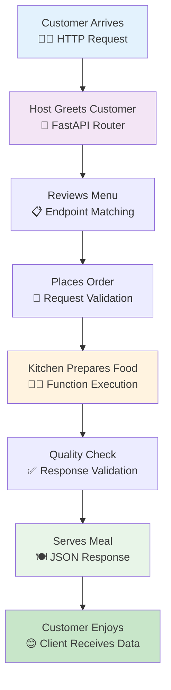
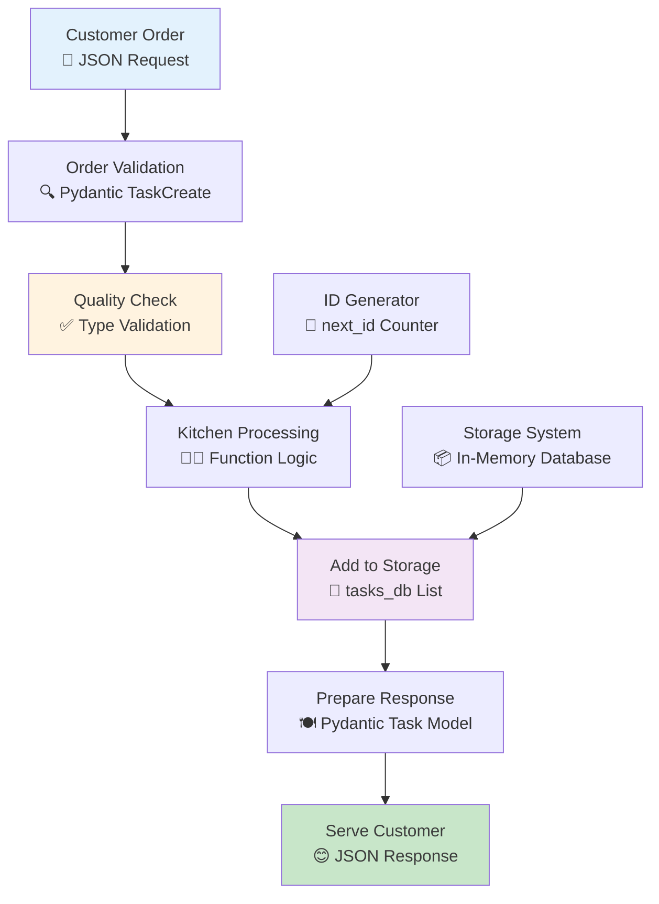
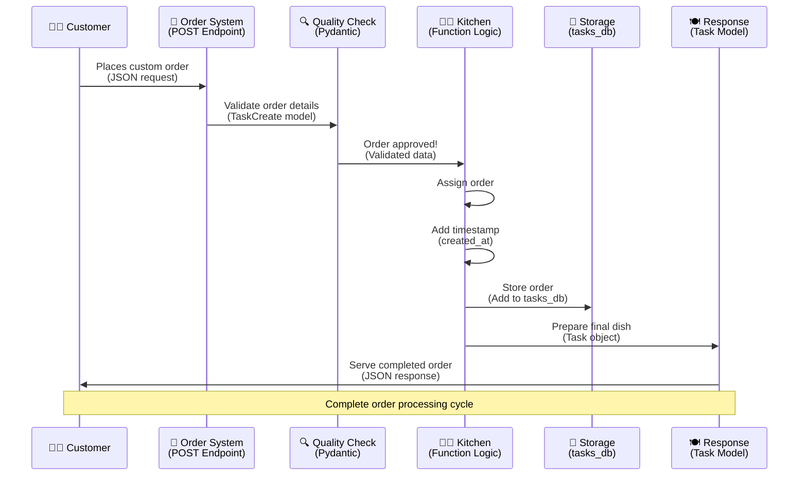
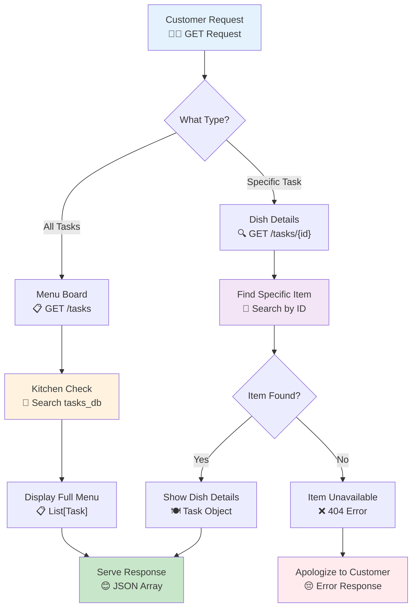
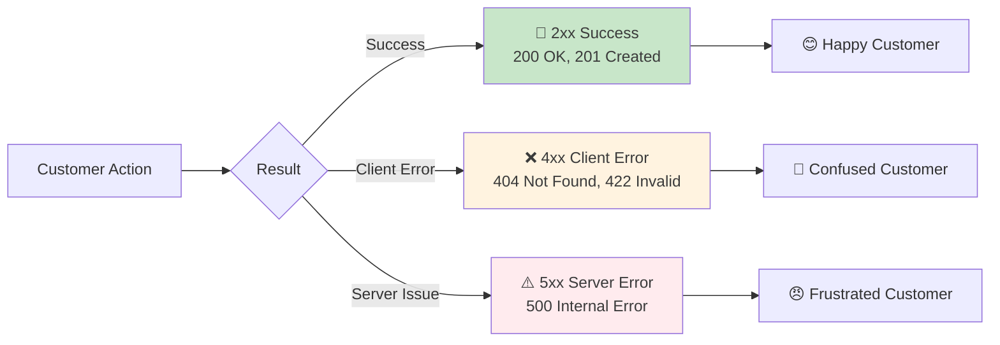

# 🎯 Your First Complete API: Building a Digital Restaurant

Welcome to the exciting world of API development! Think of building an API like opening your own restaurant. You'll design the menu (endpoints), train your staff (write functions), set up the kitchen (data models), and serve customers (handle requests). Let's build something amazing together!

## 🎯 The Restaurant Analogy: Understanding APIs Through Food Service

### Why This Analogy Works
Imagine you're opening a modern restaurant. Your FastAPI application is the entire restaurant operation:

- **The Restaurant Building** = Your FastAPI app instance
- **The Menu** = Your API endpoints (routes)
- **Kitchen Staff** = Your endpoint functions
- **Orders** = HTTP requests from clients
- **Prepared Dishes** = JSON responses
- **The Host/Hostess** = FastAPI's automatic request routing
- **Quality Control** = Pydantic data validation
- **Customer Feedback System** = Error handling and status codes

### 📊 Visual Overview: Restaurant Operation Flow



## 🏗️ What We'll Build: A Complete Task Management Restaurant

We're opening a **Task Manager API Restaurant** that specializes in productivity "dishes":

### Our Restaurant Menu (API Capabilities)
- **🆕 Create New Tasks** (Take orders for new productivity meals)
- **📋 List All Tasks** (Show the full menu of current orders)
- **🔍 Get Task Details** (Check specific order details)
- **✏️ Update Tasks** (Modify existing orders)
- **🗑️ Delete Tasks** (Cancel orders)

This covers all the fundamental restaurant operations (CRUD - Create, Read, Update, Delete) that every successful food business needs!

### 🎓 Learning Journey: From Simple Café to Full Restaurant

We'll progress through these stages:
1. **🏪 Open a Simple Café** (Hello World API)
2. **👥 Hire Professional Staff** (Add data models)
3. **📋 Design the Full Menu** (Implement CRUD operations)
4. **🔧 Set Up Kitchen Operations** (Add business logic)
5. **🎯 Perfect Customer Service** (Error handling and testing)

---

## Step 1: Opening Your First Café (Hello World API)

### 🎯 Goal: Serve Your First Two Customers
Before opening a full restaurant, let's start with a simple café that can greet customers and serve basic refreshments.

### 💡 Prerequisites
- FastAPI installed (`pip install fastapi uvicorn`)
- Basic Python knowledge
- A text editor or IDE
- Terminal/command prompt access

### 🔧 Setting Up Your Café

Create a new file called `main.py` in your project folder:

```python
# Import the FastAPI class - like importing restaurant management software
from fastapi import FastAPI
from typing import Dict  # Type hints for better code documentation

# 🏪 Open your café establishment
# This is like setting up the main restaurant building and operations
app = FastAPI(
    title="My First API Café",  # Give your establishment a memorable name
    description="A cozy café serving digital refreshments to developers",
    version="1.0.0",  # Version tracking is crucial for business management
    docs_url="/menu",  # Custom documentation URL - your digital menu board
    redoc_url="/cookbook"  # Alternative docs - like a detailed recipe book
)

# 🏠 Create your café's signature welcome (Root endpoint)
@app.get("/", response_model=Dict[str, str])  # Type hints for response structure
async def serve_welcome_drink() -> Dict[str, str]:
    """
    Our café's signature welcome drink - served to every visitor!
    
    Like a friendly barista greeting customers at the door,
    this endpoint welcomes anyone who visits our API café.
    
    Returns:
        A welcoming JSON message (our digital welcome drink)
    """
    # FastAPI automatically converts Python dict to JSON response
    # It's like having a magical barista who speaks every customer's language
    return {
        "message": "☕ Welcome to My First API Café!",
        "status": "We're brewing fresh APIs daily",
        "special_today": "Try our /hello/{name} personalized greeting!",
        "menu": "Visit /menu for our full API documentation"
    }

# 👋 Create a personalized greeting service (Path parameter endpoint)
@app.get("/hello/{customer_name}", response_model=Dict[str, str])
async def serve_personalized_greeting(customer_name: str) -> Dict[str, str]:
    """
    Our personal greeting service - like having a barista who remembers your name!
    
    Path parameters are like customer loyalty cards - they let us personalize
    the experience for each individual visitor.
    
    Args:
        customer_name: The name of our valued customer
        
    Returns:
        A personalized welcome message (custom-crafted greeting)
    """
    # f-strings let us create personalized responses
    # Like writing each customer's name on their coffee cup
    return {
        "message": f"🎉 Hello, {customer_name}! Welcome to our API café!",
        "personalized_service": f"We're delighted to serve you today, {customer_name}",
        "recommendation": "Try creating a task with our upcoming full menu!",
        "customer_type": "Valued API Explorer"
    }

# 📊 Add a café status endpoint (Bonus feature)
@app.get("/status", response_model=Dict[str, str])
async def check_cafe_status() -> Dict[str, str]:
    """
    Check if our café is open and ready to serve customers.
    
    Like checking if the 'Open' sign is lit and the coffee machines are running.
    This is useful for health checks and monitoring.
    """
    return {
        "status": "🟢 Open and Ready",
        "message": "Our API café is brewing fresh responses!",
        "uptime": "Since you started the server",
        "services": "All endpoints operational"
    }
```

### 🔍 Code Breakdown: Understanding Your Café Setup

Let's understand what each part of your café does:

#### 1. **🏪 The Restaurant Building (FastAPI App)**
```python
app = FastAPI(title="My First API Café", ...)
```
- Creates your entire café establishment
- Sets up the foundation for all operations
- Configures basic business information

#### 2. **📋 The Menu Items (Endpoints)**
```python
@app.get("/")  # The main entrance/welcome area
@app.get("/hello/{customer_name}")  # Personalized service counter
```
- Each `@app.get()` is like adding a new service to your café
- The path (`"/"`, `"/hello/{name}"`) is the location within your café
- The function below handles what happens when customers visit that location

#### 3. **👨‍🍳 The Staff Training (Functions)**
```python
async def serve_welcome_drink():
    return {"message": "Welcome!"}
```
- Each function is like training a staff member for a specific job
- `async` allows multiple customers to be served simultaneously
- Return values become the "dishes" served to customers

### 🚀 Opening Day: Running Your Café

#### Start Your Café Server
Open your terminal in the project folder and run:

```bash
uvicorn main:app --reload
```

**Understanding the Command:**
- `uvicorn`: The server software (like your café's espresso machine)
- `main`: Your `main.py` file (the café blueprint)
- `app`: The FastAPI instance inside main.py (your actual café)
- `--reload`: Auto-restart when you make changes (like having a helpful assistant who updates the menu instantly)

#### ✅ Success Indicators
You should see output like:
```
INFO:     Started server process [12345]
INFO:     Waiting for application startup.
INFO:     Application startup complete.
INFO:     Uvicorn running on http://127.0.0.1:8000 (Press CTRL+C to quit)
```

### 🧪 Testing Your Café: Customer Experience Journey

Now let's play customer and visit your café! Follow this journey:

#### 1. **🏠 Visit the Main Entrance**
- **URL**: `http://127.0.0.1:8000`
- **What you'll see**: Your café's welcome message
- **Expected response**:
```json
{
  "message": "☕ Welcome to My First API Café!",
  "status": "We're brewing fresh APIs daily",
  "special_today": "Try our /hello/{name} personalized greeting!",
  "menu": "Visit /menu for our full API documentation"
}
```

#### 2. **👋 Get a Personalized Greeting**
- **URL**: `http://127.0.0.1:8000/hello/YourName` (replace "YourName" with your actual name)
- **What happens**: Your café recognizes you personally
- **Expected response**:
```json
{
  "message": "🎉 Hello, YourName! Welcome to our API café!",
  "personalized_service": "We're delighted to serve you today, YourName",
  "recommendation": "Try creating a task with our upcoming full menu!",
  "customer_type": "Valued API Explorer"
}
```

#### 3. **📋 Check the Interactive Menu**
- **URL**: `http://127.0.0.1:8000/menu` (Swagger UI)
- **What you'll see**: A beautiful, interactive menu where you can test all your café services
- **Try this**: Click on any endpoint and press "Try it out" to place test orders

#### 4. **📚 Browse the Recipe Cookbook**
- **URL**: `http://127.0.0.1:8000/cookbook` (ReDoc)
- **What you'll see**: A detailed cookbook with all your café's recipes and procedures

#### 5. **📊 Check Café Status**
- **URL**: `http://127.0.0.1:8000/status`
- **What you'll see**: Confirmation that your café is operational

### 🎉 Celebration Checkpoint

**🎊 Congratulations!** You've successfully opened your first API café! 

#### What You've Accomplished:
- ✅ **Set up a FastAPI application** (opened your restaurant)
- ✅ **Created multiple endpoints** (designed menu items)
- ✅ **Handled path parameters** (personalized customer service)
- ✅ **Generated automatic documentation** (created digital menus)
- ✅ **Tested your API manually** (served your first customers)

#### Real-World Applications:
Your simple café demonstrates core concepts used in:
- 🌐 **Major web applications** (Twitter, Instagram, Gmail APIs)
- 🏢 **Enterprise systems** (Company databases, inventory management)
- 📱 **Mobile app backends** (User authentication, data synchronization)
- 🤖 **IoT devices** (Smart home controls, sensor data collection)

---

## Step 2: Hiring Professional Staff (Adding Data Models)

### 🎯 The Professional Restaurant Upgrade

Now that your café is running, it's time to **upgrade to a full restaurant**! This means:

- **👥 Hiring professional kitchen staff** (Pydantic data models)
- **📋 Creating standardized recipes** (Data validation)
- **🏪 Setting up proper storage systems** (Data structures)
- **🔧 Implementing quality control** (Type checking)

### 🎯 Analogy: Restaurant Quality Standards

Think of **Pydantic models** like having **professional chefs with strict training**:

- **📋 Recipe Cards** = Data models that define exactly what goes into each dish
- **🔍 Quality Inspector** = Automatic validation that checks every ingredient
- **👨‍🍳 Trained Chef** = Pydantic ensures data is prepared exactly right
- **📝 Order Forms** = Structured way customers can place orders
- **🏪 Kitchen Storage** = Organized data storage with clear labels

### 📊 Visual Overview: Data Flow in Our Restaurant



### 🔧 Setting Up Professional Kitchen Operations

Update your `main.py` file by adding these imports and models after your existing imports:

```python
# Enhanced imports for professional restaurant operations
from fastapi import FastAPI, HTTPException  # Core restaurant management + error handling
from pydantic import BaseModel, Field  # Professional chef training (data models)
from typing import Optional, List, Dict  # Type hints for clear communication
from datetime import datetime  # Timestamp tracking for orders
from enum import Enum  # For structured choices like priority levels

# 🎯 Task Priority System (Like menu categories)
class TaskPriority(str, Enum):
    """Priority levels for tasks - like rush orders, standard, and low priority"""
    HIGH = "high"      # 🔥 Rush order - needs immediate attention
    MEDIUM = "medium"  # 📋 Standard order - normal preparation time
    LOW = "low"        # 📝 Low priority - can be prepared when time allows

# 📝 Order Form for New Tasks (Customer request format)
class TaskCreate(BaseModel):
    """
    Professional order form for creating new productivity tasks.
    
    Like a restaurant order pad with all the necessary information
    to prepare exactly what the customer wants.
    """
    title: str = Field(
        ...,  # Required field (like dish name on menu)
        min_length=1,
        max_length=200,
        description="The main title of your task (like naming your dish)",
        example="Complete FastAPI tutorial"
    )
    
    description: Optional[str] = Field(
        None,
        max_length=1000,
        description="Detailed description of what needs to be done (cooking instructions)",
        example="Follow the complete tutorial and build a working API"
    )
    
    priority: TaskPriority = Field(
        TaskPriority.MEDIUM,
        description="How urgent is this task? (like rush order vs standard)"
    )
    
    completed: bool = Field(
        False,
        description="Is this task already completed? (usually starts as False)"
    )

# 🍽️ Complete Task Model (What we serve to customers)
class Task(BaseModel):
    """
    The complete task model - like a finished dish with all garnishes.
    
    This represents a fully prepared task with all system-generated
    information included (ID, timestamps, etc.)
    """
    id: int = Field(
        ...,
        description="Unique task identifier (like order number)",
        example=1
    )
    
    title: str = Field(
        ...,
        description="The task title",
        example="Complete FastAPI tutorial"
    )
    
    description: Optional[str] = Field(
        None,
        description="Detailed task description",
        example="Follow the complete tutorial and build a working API"
    )
    
    priority: TaskPriority = Field(
        ...,
        description="Task priority level"
    )
    
    completed: bool = Field(
        ...,
        description="Whether the task is completed"
    )
    
    created_at: datetime = Field(
        ...,
        description="When this task was created (like order timestamp)",
        example="2024-01-15T10:30:00"
    )
    
    updated_at: Optional[datetime] = Field(
        None,
        description="When this task was last modified",
        example="2024-01-15T14:20:00"
    )

# 📊 Task Summary Model (For dashboard views)
class TaskSummary(BaseModel):
    """
    Summary information about all tasks - like a restaurant's daily report.
    """
    total_tasks: int = Field(..., description="Total number of tasks")
    completed_tasks: int = Field(..., description="Number of completed tasks")
    pending_tasks: int = Field(..., description="Number of pending tasks")
    high_priority_tasks: int = Field(..., description="Number of high priority tasks")

# 🏪 Restaurant Storage System (Professional kitchen setup)
# In a real restaurant, this would be a database with proper tables and relationships
tasks_db: List[Task] = []  # Main storage - like a organized kitchen with labeled containers
next_id: int = 1  # Order number generator - like a ticket system

# 📈 Restaurant Analytics (Track our performance)
restaurant_stats = {
    "total_orders_served": 0,
    "customer_satisfaction": 0.0,
    "average_preparation_time": 0.0
}
```

### 🔍 Understanding Your Professional Kitchen Setup

Let's break down what each component does in restaurant terms:

#### 1. **📝 Order Forms (TaskCreate Model)**
```python
class TaskCreate(BaseModel):
    title: str = Field(..., min_length=1, max_length=200)
```
- **Purpose**: Like a standardized order form that ensures every customer provides the right information
- **Validation**: Automatically checks that titles aren't empty and aren't too long
- **Benefits**: Prevents kitchen confusion and ensures quality standards

#### 2. **🍽️ Complete Dishes (Task Model)**
```python
class Task(BaseModel):
    id: int
    created_at: datetime
```
- **Purpose**: The full dish with all accompaniments (ID, timestamps, etc.)
- **Auto-generated fields**: Like adding a garnish and proper plating automatically
- **Customer experience**: Customers receive complete, professional responses

#### 3. **🏪 Kitchen Storage (tasks_db)**
```python
tasks_db: List[Task] = []
```
- **Purpose**: Like an organized walk-in cooler where everything has its place
- **Real-world parallel**: In production, this would be a proper database (PostgreSQL, MongoDB)
- **Benefits**: Keeps all orders organized and easily accessible

#### 4. **🔢 Order Numbering System (next_id)**
```python
next_id: int = 1
```
- **Purpose**: Like a ticket system that ensures every order gets a unique number
- **Real-world parallel**: Databases handle this automatically with auto-incrementing IDs
- **Benefits**: No confusion about which order is which

### 💡 Professional Benefits

By upgrading to professional data models, you've gained:

#### ✅ **Quality Assurance**
- Automatic validation ensures bad data never enters your system
- Type hints make your code self-documenting
- Field constraints prevent edge cases

#### ✅ **Developer Experience**
- Auto-generated documentation shows exactly what data is expected
- IDE support with autocomplete and error detection
- Clear error messages when validation fails

#### ✅ **Scalability Foundation**
- Easy to extend models with new fields
- Consistent data structure across your entire application
- Ready for database integration when you're ready to scale

### 🚀 What's Next?

Now that you have professional kitchen staff (data models), you're ready to:
1. **🆕 Take custom orders** (Create tasks with POST endpoints)
2. **📋 Display your menu** (List all tasks with GET endpoints)
3. **✏️ Handle special requests** (Update tasks with PUT endpoints)
4. **🗑️ Cancel orders** (Delete tasks with DELETE endpoints)

Your restaurant is becoming a professional operation! 🎉

---

## Step 3: Taking Custom Orders (POST - Create Tasks)

### 🎯 Opening the Order Taking Service

Now it's time to **accept custom orders** from customers! In restaurant terms, this is like:

- **📝 Installing a professional order-taking system** (POST endpoint)
- **👨‍🍳 Training kitchen staff to prepare custom dishes** (Task creation logic)
- **🔢 Setting up order numbering** (ID generation)
- **📊 Tracking order timestamps** (Created_at fields)

### 🎯 Analogy: Professional Order Processing

Think of the **POST endpoint** like having a **professional order-taking system**:

- **📱 Customer places order** = HTTP POST request with task data
- **📝 Order pad validates details** = Pydantic validates the TaskCreate model
- **🔢 Kitchen assigns order number** = System generates unique ID
- **⏰ Time stamping the order** = Adding created_at timestamp
- **🏪 Sending to kitchen** = Storing in tasks_db
- **🍽️ Confirming order** = Returning complete Task response

### 📊 Visual Overview: Order Processing Flow



### 🔧 Setting Up Your Order Taking System

Add this professional order-taking endpoint to your restaurant:

```python
# 🆕 Professional Order Taking System (POST endpoint for creating tasks)
@app.post("/tasks", response_model=Task, status_code=201)
async def take_custom_order(task_order: TaskCreate) -> Task:
    """
    Take a custom task order from customers - like a professional order-taking system.
    
    This endpoint works like a restaurant's order pad:
    1. Customer provides order details (TaskCreate model)
    2. System validates the order (Pydantic validation)
    3. Kitchen assigns order number (ID generation)
    4. Order gets timestamped (created_at field)
    5. Order stored in kitchen system (tasks_db)
    6. Confirmation sent to customer (Task response)
    
    Args:
        task_order: The customer's task requirements (like their menu selection)
        
    Returns:
        The complete task with ID and timestamp (like order confirmation)
        
    Raises:
        422: When order details are invalid (like incomplete order form)
    """
    global next_id  # Access the order numbering system
    
    # 👨‍🍳 Kitchen prepares the order with professional touches
    # Add system-generated fields (like adding garnish and proper plating)
    current_time = datetime.now()
    
    new_task = Task(
        id=next_id,  # 🔢 Assign unique order number
        title=task_order.title,  # 📝 What the customer ordered
        description=task_order.description,  # 🍽️ Special preparation instructions
        priority=task_order.priority,  # 🔥 Rush order or standard timing
        completed=task_order.completed,  # ✅ Initial completion status
        created_at=current_time,  # ⏰ When this order was placed
        updated_at=current_time  # 📅 Last modification time (starts same as created)
    )
    
    # 🏪 Store the order in our kitchen system
    # In a real restaurant, this would go to a proper database
    tasks_db.append(new_task)
    
    # 📈 Update restaurant analytics
    global restaurant_stats
    restaurant_stats["total_orders_served"] += 1
    
    # 🔢 Prepare for next order (increment order number)
    next_id += 1
    
    # 🍽️ Return the completed order to the customer
    # This confirms their order was received and processed successfully
    return new_task

# 🎯 Helper endpoint: Get order statistics (Bonus feature)
@app.get("/tasks/summary", response_model=TaskSummary)
async def get_restaurant_summary() -> TaskSummary:
    """
    Get a summary of all tasks - like a restaurant's daily report.
    
    This provides overview statistics about your task restaurant's performance.
    """
    completed_count = sum(1 for task in tasks_db if task.completed)
    high_priority_count = sum(1 for task in tasks_db if task.priority == TaskPriority.HIGH)
    
    return TaskSummary(
        total_tasks=len(tasks_db),
        completed_tasks=completed_count,
        pending_tasks=len(tasks_db) - completed_count,
        high_priority_tasks=high_priority_count
    )
```

### 🔍 Understanding Your Order Processing System

Let's break down each part of your professional order-taking system:

#### 1. **📝 Order Validation (Automatic Quality Control)**
```python
async def take_custom_order(task_order: TaskCreate) -> Task:
```
- **What happens**: FastAPI automatically validates the incoming JSON against your TaskCreate model
- **Restaurant parallel**: Like having a trained host who checks that every order is complete and valid
- **Benefits**: Bad orders are rejected before reaching the kitchen
- **Error handling**: Returns 422 status if validation fails

#### 2. **🔢 Order Numbering System**
```python
id=next_id,
next_id += 1
```
- **Purpose**: Every order gets a unique identifier
- **Restaurant parallel**: Like order tickets that ensure nothing gets lost
- **Real-world**: In production, databases handle this automatically
- **Benefits**: Customers can track their specific orders

#### 3. **⏰ Timestamp Management**
```python
created_at=current_time,
updated_at=current_time
```
- **Purpose**: Track when orders were placed and last modified
- **Restaurant parallel**: Like time-stamping order tickets for kitchen timing
- **Benefits**: Helps with order tracking and analytics
- **Future use**: Can calculate preparation times and performance metrics

#### 4. **🏪 Order Storage**
```python
tasks_db.append(new_task)
```
- **Purpose**: Store the order in your kitchen system
- **Restaurant parallel**: Like placing the order in the kitchen queue
- **Current state**: Using in-memory storage (temporary)
- **Production ready**: Would use a database like PostgreSQL

### 💡 HTTP Status Codes in Restaurant Terms

```python
@app.post("/tasks", response_model=Task, status_code=201)
```

Understanding status codes like menu categories:

- **🎉 201 Created**: "Your custom order has been successfully prepared!"
- **✅ 200 OK**: "Standard operation completed successfully"
- **❌ 422 Unprocessable Entity**: "Sorry, we can't prepare this order as specified"
- **🚫 404 Not Found**: "This menu item doesn't exist"
- **⚠️ 500 Internal Server Error**: "Kitchen equipment malfunction"

### 🧪 Testing Your Order Taking System

#### 1. **📱 Place Your First Order**

Using the interactive documentation at `http://127.0.0.1:8000/menu`:

```json
{
  "title": "Learn FastAPI fundamentals",
  "description": "Complete the getting started tutorial and build a working API",
  "priority": "high",
  "completed": false
}
```

**Expected Response:**
```json
{
  "id": 1,
  "title": "Learn FastAPI fundamentals",
  "description": "Complete the getting started tutorial and build a working API",
  "priority": "high",
  "completed": false,
  "created_at": "2024-01-15T10:30:00.123456",
  "updated_at": "2024-01-15T10:30:00.123456"
}
```

#### 2. **📊 Check Restaurant Performance**

Visit `http://127.0.0.1:8000/tasks/summary` to see:
```json
{
  "total_tasks": 1,
  "completed_tasks": 0,
  "pending_tasks": 1,
  "high_priority_tasks": 1
}
```

### ⚠️ Common Order Issues (Debugging Guide)

#### **Problem**: 422 Unprocessable Entity
```json
{
  "detail": [
    {
      "loc": ["body", "title"],
      "msg": "field required",
      "type": "value_error.missing"
    }
  ]
}
```
**Solution**: Make sure your order includes all required fields (title is mandatory)

#### **Problem**: String too long
**Cause**: Title or description exceeds maximum length
**Solution**: Check Field constraints in your TaskCreate model

### 🎉 Success Checkpoint

**🎊 Congratulations!** You now have a professional order-taking system!

#### What You've Accomplished:
- ✅ **Built a POST endpoint** (professional order system)
- ✅ **Implemented data validation** (quality control)
- ✅ **Added automatic ID generation** (order numbering)
- ✅ **Created timestamp tracking** (order timing)
- ✅ **Set up proper error handling** (order validation)
- ✅ **Added performance analytics** (restaurant reporting)

#### Real-World Applications:
Your order system demonstrates patterns used in:
- 🛒 **E-commerce platforms** (Product orders, user accounts)
- 📱 **Social media apps** (Creating posts, comments, likes)
- 💼 **Business systems** (Employee records, project management)
- 🏥 **Healthcare apps** (Patient records, appointment booking)

---

## Step 4: Displaying Your Menu (GET - Read Tasks)

### 🎯 Setting Up the Display System

Time to **showcase your menu** to customers! In restaurant terms, this is like:

- **📋 Creating a beautiful menu display** (GET endpoints for listing)
- **🔍 Setting up a table reservation system** (GET specific items by ID)
- **📊 Training staff to answer questions** (Query handling)
- **⚠️ Handling "not available" situations** (404 error responses)

### 🎯 Analogy: Restaurant Display Systems

Think of **GET endpoints** like your restaurant's **information systems**:

- **📋 Main Menu Board** = GET `/tasks` (shows all available dishes/tasks)
- **🔍 Detailed Dish Information** = GET `/tasks/{id}` (specific dish details)
- **👨‍💼 Knowledgeable Server** = Error handling for missing items
- **📊 Digital Menu Screen** = JSON responses with all details
- **🎯 Customer Inquiries** = Different ways to browse and find items

### 📊 Visual Overview: Menu Display System



### 🔧 Setting Up Your Menu Display System

Add these professional menu display endpoints to your restaurant:

```python
# 📋 Main Menu Board - Display All Available Tasks
@app.get("/tasks", response_model=List[Task])
async def display_full_menu(
    priority: Optional[TaskPriority] = None,
    completed: Optional[bool] = None,
    limit: Optional[int] = None
) -> List[Task]:
    """
    Display the full menu of tasks - like a restaurant's main menu board.
    
    This endpoint shows all available tasks, with optional filtering:
    - Filter by priority (like showing only appetizers, mains, desserts)
    - Filter by completion status (like showing only available dishes)
    - Limit results (like showing only today's specials)
    
    Args:
        priority: Filter by priority level (high, medium, low)
        completed: Filter by completion status (True/False)
        limit: Maximum number of tasks to return
        
    Returns:
        List of tasks matching the criteria (like a filtered menu)
        
    Examples:
        - GET /tasks → All tasks (full menu)
        - GET /tasks?priority=high → Only high priority tasks
        - GET /tasks?completed=false → Only pending tasks
        - GET /tasks?limit=5 → First 5 tasks only
    """
    # 🏪 Check what's available in our kitchen storage
    menu_items = tasks_db.copy()  # Start with full menu
    
    # 🔍 Apply customer filters (like dietary restrictions)
    if priority is not None:
        menu_items = [task for task in menu_items if task.priority == priority]
    
    if completed is not None:
        menu_items = [task for task in menu_items if task.completed == completed]
    
    # 📏 Limit menu size if requested (like daily specials)
    if limit is not None and limit > 0:
        menu_items = menu_items[:limit]
    
    # 📋 Return the customized menu to the customer
    return menu_items

# 🔍 Detailed Dish Information - Get Specific Task Details
@app.get("/tasks/{task_id}", response_model=Task)
async def get_dish_details(task_id: int) -> Task:
    """
    Get detailed information about a specific task - like asking about a specific dish.
    
    This endpoint works like asking your server "Tell me about dish #5":
    1. Customer provides task ID (like pointing to menu item)
    2. Server searches kitchen records (search tasks_db)
    3. Either returns full details or says "not available"
    
    Args:
        task_id: The unique identifier of the task (like menu item number)
        
    Returns:
        Complete task details (like detailed dish description)
        
    Raises:
        404: When task doesn't exist (like "sorry, we're out of that dish")
    """
    # 🔍 Search through our kitchen records
    # Like a server checking with the kitchen about availability
    for dish in tasks_db:
        if dish.id == task_id:
            # 🍽️ Found it! Serve the full details
            return dish
    
    # 😔 Sorry, that dish isn't available
    # Professional error handling with helpful message
    raise HTTPException(
        status_code=404,
        detail={
            "error": "Task not found",
            "message": f"No task exists with ID {task_id}",
            "suggestion": "Check /tasks to see all available tasks",
            "available_ids": [task.id for task in tasks_db] if tasks_db else []
        }
    )

# 🎯 Advanced Search Features (Bonus endpoints)
@app.get("/tasks/search", response_model=List[Task])
async def search_menu_items(
    q: Optional[str] = None,
    sort_by: Optional[str] = "created_at",
    sort_order: Optional[str] = "desc"
) -> List[Task]:
    """
    Search through tasks - like searching a restaurant menu.
    
    Advanced search functionality for finding specific tasks by text content.
    
    Args:
        q: Search query (searches title and description)
        sort_by: Field to sort by (created_at, title, priority)
        sort_order: Sort direction (asc or desc)
        
    Returns:
        List of tasks matching the search criteria
    """
    results = tasks_db.copy()
    
    # 🔍 Text search (like searching menu descriptions)
    if q:
        search_term = q.lower()
        results = [
            task for task in results
            if search_term in task.title.lower() 
            or (task.description and search_term in task.description.lower())
        ]
    
    # 📊 Sort results (like organizing menu by price, popularity, etc.)
    reverse_order = sort_order.lower() == "desc"
    
    if sort_by == "title":
        results.sort(key=lambda x: x.title.lower(), reverse=reverse_order)
    elif sort_by == "priority":
        priority_order = {"high": 3, "medium": 2, "low": 1}
        results.sort(
            key=lambda x: priority_order.get(x.priority.value, 0), 
            reverse=reverse_order
        )
    else:  # Default to created_at
        results.sort(key=lambda x: x.created_at, reverse=reverse_order)
    
    return results
```

### 🔍 Understanding Your Menu Display System

Let's break down each part of your professional menu system:

#### 1. **📋 Full Menu Display**
```python
@app.get("/tasks", response_model=List[Task])
```
- **Purpose**: Shows all available tasks (like a complete restaurant menu)
- **Response type**: Array of Task objects
- **Filtering**: Optional parameters for customized views
- **Real-world parallel**: Like digital menu boards that can filter by category

#### 2. **🔍 Specific Item Details**
```python
@app.get("/tasks/{task_id}", response_model=Task)
```
- **Path parameter**: `{task_id}` captures the ID from the URL
- **Return**: Single Task object with complete details
- **Error handling**: 404 when item doesn't exist
- **Real-world parallel**: Like asking your server about a specific dish

#### 3. **🎯 Professional Error Messages**
```python
raise HTTPException(status_code=404, detail={...})
```
- **Helpful errors**: Clear explanation of what went wrong
- **Suggestions**: Guidance on what the customer can do next
- **Context**: Shows available alternatives
- **Professional touch**: Like a good server offering alternatives

### 💡 HTTP Methods in Restaurant Terms

Understanding different request types:

- **🔍 GET**: "Show me the menu" / "What do you have?"
- **📝 POST**: "I'd like to place an order" / "Create something new"
- **✏️ PUT**: "Change my order" / "Update this completely"
- **🗑️ DELETE**: "Cancel that order" / "Remove this item"

### 🧪 Testing Your Menu Display System

#### 1. **📋 View the Full Menu**
- **URL**: `http://127.0.0.1:8000/tasks`
- **Expected**: Array of all your tasks
- **Test variations**:
  - `http://127.0.0.1:8000/tasks?priority=high` (only high priority)
  - `http://127.0.0.1:8000/tasks?completed=false` (only pending)
  - `http://127.0.0.1:8000/tasks?limit=3` (first 3 tasks)

#### 2. **🔍 Check Specific Task Details**
- **URL**: `http://127.0.0.1:8000/tasks/1` (assuming you created task #1)
- **Expected**: Complete details of task #1
- **Error test**: `http://127.0.0.1:8000/tasks/999` (should return 404)

#### 3. **🎯 Search Your Menu**
- **URL**: `http://127.0.0.1:8000/tasks/search?q=FastAPI`
- **Expected**: Tasks containing "FastAPI" in title or description
- **Sort test**: `http://127.0.0.1:8000/tasks/search?sort_by=title&sort_order=asc`

### ⚠️ Common Menu Issues (Debugging Guide)

#### **Problem**: Empty array returned
```json
[]
```
**Cause**: No tasks have been created yet, or filters are too restrictive
**Solution**: Create some tasks first with POST, or adjust your filter parameters

#### **Problem**: 404 for valid-looking ID
```json
{
  "detail": {
    "error": "Task not found",
    "message": "No task exists with ID 5"
  }
}
```
**Solution**: Check `/tasks` to see which IDs actually exist

### 🎉 Success Checkpoint

**🎊 Congratulations!** You now have a professional menu display system!

#### What You've Accomplished:
- ✅ **Built list endpoints** (menu display system)
- ✅ **Added detail endpoints** (specific item lookup)
- ✅ **Implemented filtering** (customized menu views)
- ✅ **Created search functionality** (find specific items)
- ✅ **Added professional error handling** (helpful customer service)
- ✅ **Included sorting options** (organized presentation)

---

## Step 5: Handling Special Requests (PUT - Update Tasks)

### 🎯 The Order Modification Service

Time to **handle order changes** like a professional restaurant! This includes:

- **✏️ Modifying existing orders** (PUT endpoint for updates)
- **📋 Keeping order history** (preserving creation timestamps)
- **🔄 Professional kitchen communication** (updating with validation)
- **⚠️ Handling modification errors** (when orders don't exist)

### 🎯 Analogy: Restaurant Order Changes

Think of **PUT endpoints** like a restaurant's **order modification system**:

- **📝 Customer says "Change my order"** = HTTP PUT request
- **🔍 Server finds the original order** = Looking up task by ID
- **✏️ Kitchen updates the preparation** = Updating task data
- **⏰ Keeping the original order time** = Preserving created_at
- **📊 Recording the change time** = Updating updated_at timestamp

```python
# ✏️ Professional Order Modification System (PUT endpoint)
@app.put("/tasks/{task_id}", response_model=Task)
async def modify_existing_order(task_id: int, modifications: TaskCreate) -> Task:
    """
    Modify an existing task order - like changing a restaurant order.
    
    This works like telling your server "I want to change my order":
    1. Server finds your original order (locate by ID)
    2. Kitchen prepares the new version (apply modifications)
    3. Order keeps original timestamp (preserves created_at)
    4. Change time is recorded (updates updated_at)
    """
    # 🔍 Find the original order in our kitchen system
    for i, existing_order in enumerate(tasks_db):
        if existing_order.id == task_id:
            # 👨‍🍳 Kitchen prepares the modified order
            modified_task = Task(
                id=existing_order.id,  # Keep original order number
                title=modifications.title,  # New dish name
                description=modifications.description,  # New preparation notes
                priority=modifications.priority,  # New urgency level
                completed=modifications.completed,  # New completion status
                created_at=existing_order.created_at,  # Keep original order time
                updated_at=datetime.now()  # Record when changes were made
            )
            
            # 🔄 Replace the old order with the new one
            tasks_db[i] = modified_task
            return modified_task
    
    # 😔 Sorry, we can't find that order to modify
    raise HTTPException(
        status_code=404,
        detail=f"Cannot modify task {task_id} - order not found"
    )
```

---

## Step 6: Canceling Orders (DELETE - Remove Tasks)

### 🎯 The Order Cancellation Service

Handle **order cancellations** professionally:

- **🗑️ Canceling customer orders** (DELETE endpoint)
- **📋 Confirming cancellation** (helpful response messages)
- **🔍 Handling missing orders** (404 error handling)
- **📊 Kitchen notifications** (removing from task list)

```python
# 🗑️ Professional Order Cancellation System (DELETE endpoint)
@app.delete("/tasks/{task_id}")
async def cancel_order(task_id: int) -> Dict[str, str]:
    """
    Cancel an existing task order - like canceling a restaurant order.
    
    This works like telling your server "Cancel my order":
    1. Server finds your order (locate by ID)
    2. Kitchen removes it from queue (remove from tasks_db)
    3. Confirmation is sent (return success message)
    """
    # 🔍 Find the order to cancel
    for i, order in enumerate(tasks_db):
        if order.id == task_id:
            # 🗑️ Remove the order from kitchen queue
            canceled_order = tasks_db.pop(i)
            
            # 📊 Update restaurant analytics
            global restaurant_stats
            restaurant_stats["total_orders_served"] -= 1
            
            # ✅ Send professional cancellation confirmation
            return {
                "message": f"Order '{canceled_order.title}' has been successfully canceled",
                "canceled_order_id": str(task_id),
                "canceled_at": datetime.now().isoformat(),
                "status": "success"
            }
    
    # 😔 Can't cancel an order that doesn't exist
    raise HTTPException(
        status_code=404,
        detail=f"Cannot cancel task {task_id} - order not found"
    )

# 🎯 Bonus: Quick completion toggle
@app.patch("/tasks/{task_id}/complete", response_model=Task)
async def mark_order_complete(task_id: int) -> Task:
    """
    Mark a task as completed - like telling the kitchen "this order is done!"
    """
    for i, task in enumerate(tasks_db):
        if task.id == task_id:
            # ✅ Mark as completed and update timestamp
            task.completed = True
            task.updated_at = datetime.now()
            tasks_db[i] = task
            return task
    
    raise HTTPException(status_code=404, detail="Task not found")
```

---

## 🍽️ Your Complete Restaurant (Full Code)

### 🎯 The Grand Opening: Complete Implementation

Here's your **complete professional restaurant** code that combines all the features we've built:

```python
"""
🏪 Professional Task Manager API Restaurant
A complete CRUD API that demonstrates REST principles through a restaurant analogy.

This API manages productivity "tasks" like a restaurant manages "orders":
- Taking new orders (POST /tasks)
- Displaying the menu (GET /tasks)
- Checking specific dishes (GET /tasks/{id})
- Modifying orders (PUT /tasks/{id})
- Canceling orders (DELETE /tasks/{id})
"""

# 📦 Professional Restaurant Imports
from fastapi import FastAPI, HTTPException
from pydantic import BaseModel, Field
from typing import Optional, List, Dict
from datetime import datetime
from enum import Enum

# 🎯 Task Priority System (Menu Categories)
class TaskPriority(str, Enum):
    """Priority levels - like rush orders, standard, and relaxed timing"""
    HIGH = "high"      # 🔥 Rush order - immediate attention needed
    MEDIUM = "medium"  # 📋 Standard order - normal timing
    LOW = "low"        # 📝 Low priority - when time allows

# 📝 Order Form Models (Customer Input)
class TaskCreate(BaseModel):
    """Order form for new tasks - what customers provide"""
    title: str = Field(..., min_length=1, max_length=200, 
                      description="Task title", example="Complete FastAPI tutorial")
    description: Optional[str] = Field(None, max_length=1000,
                                     description="Task details")
    priority: TaskPriority = Field(TaskPriority.MEDIUM, 
                                 description="Task urgency level")
    completed: bool = Field(False, description="Completion status")

# 🍽️ Complete Dish Model (What We Serve)
class Task(BaseModel):
    """Complete task with all restaurant-generated information"""
    id: int = Field(..., description="Unique order number")
    title: str = Field(..., description="Task title")
    description: Optional[str] = Field(None, description="Task details")
    priority: TaskPriority = Field(..., description="Priority level")
    completed: bool = Field(..., description="Completion status")
    created_at: datetime = Field(..., description="Order timestamp")
    updated_at: Optional[datetime] = Field(None, description="Last modified")

# 📊 Restaurant Summary (Daily Report)
class TaskSummary(BaseModel):
    """Restaurant performance summary"""
    total_tasks: int = Field(..., description="Total orders")
    completed_tasks: int = Field(..., description="Completed orders")
    pending_tasks: int = Field(..., description="Pending orders")
    high_priority_tasks: int = Field(..., description="Rush orders")

# 🏪 Initialize Restaurant
app = FastAPI(
    title="🍽️ Task Manager API Restaurant",
    description="A professional task management API built with restaurant principles",
    version="2.0.0",
    docs_url="/menu",      # Interactive menu (Swagger UI)
    redoc_url="/cookbook"  # Detailed cookbook (ReDoc)
)

# 🏪 Restaurant Storage & Analytics
tasks_db: List[Task] = []  # Kitchen storage system
next_id: int = 1          # Order numbering system
restaurant_stats = {      # Performance tracking
    "total_orders_served": 0,
    "customer_satisfaction": 5.0,
    "average_preparation_time": 0.0
}

# 🏠 Welcome Area
@app.get("/", response_model=Dict[str, str])
async def serve_welcome_drink() -> Dict[str, str]:
    """Restaurant entrance - welcome all visitors"""
    return {
        "message": "🍽️ Welcome to the Task Manager API Restaurant!",
        "status": "🟢 Open and serving delicious productivity meals",
        "menu": "Visit /menu for our interactive menu",
        "specialties": "We specialize in CRUD operations and REST principles"
    }

# 🆕 Order Taking System (CREATE)
@app.post("/tasks", response_model=Task, status_code=201)
async def take_custom_order(task_order: TaskCreate) -> Task:
    """Take a new task order from customers"""
    global next_id, restaurant_stats
    
    current_time = datetime.now()
    new_task = Task(
        id=next_id,
        title=task_order.title,
        description=task_order.description,
        priority=task_order.priority,
        completed=task_order.completed,
        created_at=current_time,
        updated_at=current_time
    )
    
    tasks_db.append(new_task)
    restaurant_stats["total_orders_served"] += 1
    next_id += 1
    
    return new_task

# 📋 Menu Display System (READ ALL)
@app.get("/tasks", response_model=List[Task])
async def display_full_menu(
    priority: Optional[TaskPriority] = None,
    completed: Optional[bool] = None,
    limit: Optional[int] = None
) -> List[Task]:
    """Display menu with optional filtering"""
    menu_items = tasks_db.copy()
    
    if priority is not None:
        menu_items = [task for task in menu_items if task.priority == priority]
    if completed is not None:
        menu_items = [task for task in menu_items if task.completed == completed]
    if limit is not None and limit > 0:
        menu_items = menu_items[:limit]
    
    return menu_items

# 🔍 Dish Details System (READ ONE)
@app.get("/tasks/{task_id}", response_model=Task)
async def get_dish_details(task_id: int) -> Task:
    """Get specific task details"""
    for task in tasks_db:
        if task.id == task_id:
            return task
    
    raise HTTPException(
        status_code=404,
        detail={
            "error": "Task not found",
            "message": f"No task exists with ID {task_id}",
            "suggestion": "Check /tasks to see all available tasks"
        }
    )

# ✏️ Order Modification System (UPDATE)
@app.put("/tasks/{task_id}", response_model=Task)
async def modify_existing_order(task_id: int, modifications: TaskCreate) -> Task:
    """Modify an existing task order"""
    for i, existing_order in enumerate(tasks_db):
        if existing_order.id == task_id:
            modified_task = Task(
                id=existing_order.id,
                title=modifications.title,
                description=modifications.description,
                priority=modifications.priority,
                completed=modifications.completed,
                created_at=existing_order.created_at,
                updated_at=datetime.now()
            )
            tasks_db[i] = modified_task
            return modified_task
    
    raise HTTPException(status_code=404, detail=f"Cannot modify task {task_id} - order not found")

# 🗑️ Order Cancellation System (DELETE)
@app.delete("/tasks/{task_id}")
async def cancel_order(task_id: int) -> Dict[str, str]:
    """Cancel an existing task order"""
    for i, order in enumerate(tasks_db):
        if order.id == task_id:
            canceled_order = tasks_db.pop(i)
            global restaurant_stats
            restaurant_stats["total_orders_served"] -= 1
            
            return {
                "message": f"Order '{canceled_order.title}' successfully canceled",
                "canceled_order_id": str(task_id),
                "status": "success"
            }
    
    raise HTTPException(status_code=404, detail=f"Cannot cancel task {task_id} - order not found")

# 📊 Restaurant Analytics
@app.get("/tasks/summary", response_model=TaskSummary)
async def get_restaurant_summary() -> TaskSummary:
    """Get restaurant performance summary"""
    completed_count = sum(1 for task in tasks_db if task.completed)
    high_priority_count = sum(1 for task in tasks_db if task.priority == TaskPriority.HIGH)
    
    return TaskSummary(
        total_tasks=len(tasks_db),
        completed_tasks=completed_count,
        pending_tasks=len(tasks_db) - completed_count,
        high_priority_tasks=high_priority_count
    )

# 🎯 Bonus Features
@app.patch("/tasks/{task_id}/complete", response_model=Task)
async def mark_order_complete(task_id: int) -> Task:
    """Quick completion toggle"""
    for i, task in enumerate(tasks_db):
        if task.id == task_id:
            task.completed = True
            task.updated_at = datetime.now()
            tasks_db[i] = task
            return task
    raise HTTPException(status_code=404, detail="Task not found")

@app.get("/tasks/search", response_model=List[Task])
async def search_menu_items(q: Optional[str] = None) -> List[Task]:
    """Search tasks by text content"""
    if not q:
        return tasks_db
    
    search_term = q.lower()
    return [
        task for task in tasks_db
        if search_term in task.title.lower() 
        or (task.description and search_term in task.description.lower())
    ]
```

---

## 🧪 Grand Opening: Testing Your Complete Restaurant

### 🎯 The Restaurant Testing Experience

Time to **open your restaurant to customers** and test every service! Follow this comprehensive testing journey:

### 🚀 1. Start Your Restaurant Server

```bash
# Open your restaurant for business
uvicorn main:app --reload
```

**Success indicators:**
- Server starts on `http://127.0.0.1:8000`
- Welcome message appears in terminal
- All endpoints are available

### 📋 2. Visit Your Interactive Menu

Go to `http://127.0.0.1:8000/menu` (Swagger UI) for the **complete restaurant experience**:

#### 🍽️ **Complete Restaurant Test Journey**

**Step 1: Welcome Greeting**
- Visit `http://127.0.0.1:8000`
- Should see professional welcome message

**Step 2: Place Your First Order (POST)**
```json
{
  "title": "Master FastAPI development",
  "description": "Build a complete CRUD API with professional standards",
  "priority": "high",
  "completed": false
}
```

**Expected response:**
```json
{
  "id": 1,
  "title": "Master FastAPI development",
  "description": "Build a complete CRUD API with professional standards",
  "priority": "high",
  "completed": false,
  "created_at": "2024-01-15T10:30:00.123456",
  "updated_at": "2024-01-15T10:30:00.123456"
}
```

**Step 3: View Your Menu (GET all)**
- Endpoint: `GET /tasks`
- Should display your created task

**Step 4: Check Specific Dish (GET one)**
- Endpoint: `GET /tasks/1`
- Should show complete task details

**Step 5: Modify Your Order (PUT)**
```json
{
  "title": "Master FastAPI development",
  "description": "Build a complete CRUD API with professional standards - COMPLETED!",
  "priority": "high",
  "completed": true
}
```

**Step 6: Quick Completion (PATCH)**
- Endpoint: `PATCH /tasks/1/complete`
- Instantly marks task as done

**Step 7: Check Restaurant Performance (Analytics)**
- Endpoint: `GET /tasks/summary`
- View restaurant statistics

**Step 8: Search Your Menu**
- Endpoint: `GET /tasks/search?q=FastAPI`
- Find tasks containing "FastAPI"

**Step 9: Cancel an Order (DELETE)**
- Endpoint: `DELETE /tasks/1`
- Should confirm cancellation

### 📊 Understanding Restaurant Status Codes

Your restaurant communicates through **professional status codes**:



- **🎉 201 Created**: "Your order has been successfully placed!"
- **✅ 200 OK**: "Request processed successfully"
- **❌ 404 Not Found**: "Sorry, that dish isn't on our menu"
- **⚠️ 422 Unprocessable Entity**: "We can't prepare your order as specified"

---

## 🎓 Graduation: What You've Mastered

### 🏆 **Professional Restaurant Operations Complete!**

You've successfully built and operated a **professional API restaurant**! Here's everything you've mastered:

#### ✅ **Core Restaurant Skills (CRUD Operations)**
- **🆕 Order Taking** → POST endpoints for creating resources
- **📋 Menu Display** → GET endpoints for reading data
- **✏️ Order Modification** → PUT endpoints for updating resources  
- **🗑️ Order Cancellation** → DELETE endpoints for removing data

#### ✅ **Professional Kitchen Management (Technical Skills)**
- **👨‍🍳 Data Models** → Pydantic models for validation
- **🔢 Order Numbering** → Auto-incrementing IDs
- **📊 Quality Control** → Error handling and status codes
- **🏪 Storage Systems** → Data persistence patterns

#### ✅ **Customer Service Excellence (API Design)**
- **📋 Interactive Documentation** → Automatic Swagger UI
- **🔍 Search and Filtering** → Query parameters
- **📊 Performance Analytics** → Summary endpoints
- **⚠️ Professional Error Handling** → Helpful error messages

#### ✅ **Restaurant Management (Development Practices)**
- **🎯 Type Safety** → TypeScript-like type hints
- **📝 Documentation** → Self-documenting code
- **🧪 Testing Capabilities** → Interactive API testing
- **🔄 Live Updates** → Hot reloading with `--reload`

### 🌟 Real-World Applications

Your restaurant skills translate directly to:

- **🛒 E-commerce platforms** → Product catalogs, order management
- **📱 Social media apps** → Posts, comments, user interactions
- **💼 Business systems** → Employee records, project tracking
- **🏥 Healthcare apps** → Patient records, appointment scheduling
- **🎮 Gaming platforms** → User profiles, achievements, leaderboards

---

## 🎯 Common New Chef Questions (FAQ)

### Q: Why use `async def` instead of regular `def`?
**🍽️ Restaurant Answer:** Think of `async` like having multiple servers who can take orders simultaneously instead of one server handling customers one at a time. It makes your restaurant much more efficient during busy periods!

**Technical:** `async` allows FastAPI to handle multiple requests concurrently, improving performance under load.

### Q: Where does the data actually go?
**🍽️ Restaurant Answer:** Right now, your orders are written on a whiteboard in the kitchen - when you close the restaurant (restart the server), all orders disappear. In a real restaurant, you'd use a proper filing system (database).

**Technical:** We're using in-memory storage (`tasks_db` list). Production apps use databases like PostgreSQL, MongoDB, or SQLite.

### Q: Why separate TaskCreate and Task models?
**🍽️ Restaurant Answer:** TaskCreate is your order pad (what customers write), Task is the complete kitchen order with ticket number and timestamps added by your staff.

**Technical:** Input models (TaskCreate) differ from output models (Task) to separate concerns and include system-generated fields.

### Q: What's `response_model` for?
**🍽️ Restaurant Answer:** It's like promising customers exactly what their meal will look like - it ensures consistency and helps create accurate menus (documentation).

**Technical:** Provides response validation, automatic documentation generation, and clear API contracts.

---

## 🚀 Your Culinary Journey Continues

### 🎓 Level Up Your Restaurant Empire

Now that you've mastered the basics, here's your learning path:

#### 📖 **Next Learning Modules:**
1. **[🎨 URI Design](/docs/01_getting-started/basic-uri-design)** → Create intuitive menu organization
2. **[🔧 HTTP Methods](/docs/01_getting-started/basic-http-methods)** → Master REST principles and method selection
3. **[🏗️ Foundation Concepts](/docs/02_foundation)** → Add databases, authentication, and testing

#### 🎯 **Professional Challenges (Try These!)**

**Beginner Challenges:**
1. **🔍 Add filtering** → `GET /tasks?completed=true&priority=high`
2. **📊 Add sorting** → `GET /tasks?sort=created_at&order=desc`
3. **📱 Add pagination** → `GET /tasks?page=1&limit=10`

**Intermediate Challenges:**
4. **🏷️ Add task categories** → Organize tasks like menu sections
5. **⏰ Add due dates** → Time-sensitive task management
6. **👥 Add task assignment** → Multi-user task distribution

**Advanced Challenges:**
7. **🔐 Add authentication** → User login and permissions
8. **💾 Add database storage** → Persistent data with PostgreSQL
9. **📧 Add notifications** → Email alerts for task updates

### 💡 **Pro Tips for Continued Learning**

- **🔬 Experiment fearlessly** → The best way to learn is by building
- **📚 Read the FastAPI docs** → Comprehensive official documentation
- **🌐 Join the community** → FastAPI Discord, Reddit, Stack Overflow
- **🏗️ Build real projects** → Apply your skills to solve actual problems

### 🎉 **Celebration & Recognition**

**🎊 Congratulations, Professional API Chef!** 

You've transformed from a complete beginner to someone who can build, test, and deploy professional APIs. You understand the fundamental patterns that power the modern web, and you have the skills to build amazing applications.

**Your next mission:** Choose one of the challenges above and expand your restaurant into a culinary empire! 

---

**Ready to continue your journey?** Explore our [Foundation concepts](/docs/02_foundation) to add databases, authentication, and advanced features to your API restaurant! 🚀