# Introduction to RESTful APIs and FastAPI

Welcome to your journey into building professional web APIs! If you're new to web development or APIs, don't worry - we'll start from the basics and build your understanding step by step. By the end of this guide, you'll understand what APIs are, why REST is important, and why FastAPI is an excellent choice for building them.

## What is an API?

An **API (Application Programming Interface)** is like a waiter in a restaurant. Just as a waiter takes your order, communicates it to the kitchen, and brings back your food, an API takes requests from applications, processes them, and returns responses.

```mermaid
graph LR
    A[📱 Mobile App] -->|Request| B[🍽️ API<br/>Waiter]
    C[💻 Web App] -->|Request| B
    D[🖥️ Desktop App] -->|Request| B
    B -->|Processes| E[🏢 Server<br/>Kitchen]
    E -->|Response| B
    B -->|Response| A
    B -->|Response| C
    B -->|Response| D
```

### Real-World Example
When you check the weather on your phone app, here's what happens:
1. **Your app** sends a request: "What's the weather in New York?"
2. **The weather API** receives this request
3. **The API** asks the weather service for New York's weather data
4. **The API** sends back the weather information to your app
5. **Your app** displays the weather to you

## Why Do We Need APIs?

### 1. **Separation of Concerns**
Just like how a restaurant separates the dining area from the kitchen, APIs separate the user interface from the business logic and data.

### 2. **Multiple Clients**
One API can serve many different applications:

```mermaid
graph TD
    A[🌐 Web API] --> B[📱 iOS App]
    A --> C[🤖 Android App]
    A --> D[💻 Web App]
    A --> E[⌚ Smart Watch]
    A --> F[🏠 IoT Devices]
```

### 3. **Scalability and Maintenance**
When you need to update business logic, you only update the API, not every client application.

## What Makes an API RESTful?

**REST (Representational State Transfer)** is like a set of rules for building APIs, similar to how traffic rules help cars move safely and predictably. REST isn't a technology or protocol - it's a architectural style that makes APIs easier to understand and use.

Think of REST as the "good manners" of API design. Just like good manners make social interactions smoother, REST principles make API interactions predictable and intuitive.

```mermaid
graph TD
    A[RESTful API Principles] --> B[📋 Client-Server]
    A --> C[🔄 Stateless]
    A --> D[🎯 Uniform Interface]
    A --> E[🏗️ Layered System]
    A --> F[💾 Cacheable]
    
    B --> B1[Clear separation between<br/>client and server]
    C --> C1[Each request contains<br/>all needed information]
    D --> D1[Standard HTTP methods<br/>and URL patterns]
    E --> E1[Can have multiple layers<br/>like security, caching]
    F --> F1[Responses can be cached<br/>for better performance]
```

### Understanding REST Through Real-World Analogies

Let's understand each REST principle using familiar concepts:

### 1. Client-Server Architecture 📋
**Analogy**: Like a restaurant where customers (clients) and the kitchen (server) are separate

```mermaid
graph LR
    A[👥 Customers<br/>Clients] -.->|Orders| B[🍽️ Waiter<br/>API]
    B -.->|Processes| C[👨‍🍳 Kitchen<br/>Server]
    C -.->|Food Ready| B
    B -.->|Delivers| A
```

**What this means:**
- The **client** (your mobile app) doesn't need to know how the **server** (the backend) works internally
- They can be updated independently - you can redesign your app without changing the server, and vice versa
- Multiple different clients can use the same server

### 2. Statelessness 🔄
**Analogy**: Like ordering at a fast-food counter where each order is independent


**What this means:**
- Each request contains ALL the information needed (like user authentication)
- The server doesn't remember previous requests
- This makes the API more reliable and scalable

**Example:**
```http
❌ Bad (Stateful):
POST /login {"username": "john", "password": "secret"}
GET /profile  // Server remembers John is logged in

✅ Good (Stateless):
GET /profile
Headers: Authorization: Bearer john_auth_token
```

### 3. Uniform Interface 🎯
**Analogy**: Like having a standard menu format across all restaurants

This principle has several parts:

#### a) Resource-Based URLs
Everything is a "resource" (like a thing or object) with a web address:


#### b) Standard HTTP Methods (Verbs)
Use standard "action words" for different operations:

```mermaid
graph LR
    A[HTTP Methods] --> B[GET 👁️<br/>Read/View]
    A --> C[POST ➕<br/>Create]
    A --> D[PUT ✏️<br/>Update/Replace]
    A --> E[DELETE 🗑️<br/>Remove]
    
    B --> B1["GET /users<br/>List all users"]
    C --> C1["POST /users<br/>Create new user"]
    D --> D1["PUT /users/123<br/>Update user 123"]
    E --> E1["DELETE /users/123<br/>Delete user 123"]
```

#### c) Standard Data Format
Usually JSON for modern APIs:

```json
{
  "id": 123,
  "name": "John Doe",
  "email": "john@example.com"
}
```

### 4. Layered System 🏗️
**Analogy**: Like a building with different floors serving different purposes

```mermaid
graph TD
    A[👥 Client] --> B[🔒 Security Layer]
    B --> C[⚡ Caching Layer]
    C --> D[⚖️ Load Balancer]
    D --> E[🖥️ API Server]
    E --> F[🗄️ Database]
```

**What this means:**
- Your API can have multiple layers (security, caching, load balancing)
- The client doesn't need to know about these layers
- You can add or modify layers without affecting the client

### 5. Cacheability 💾
**Analogy**: Like keeping frequently asked questions and answers handy

```mermaid
graph LR
    A[📱 Client] -->|"Get user 123"| B[⚡ Cache]
    B -->|Cache Miss| C[🖥️ Server]
    C -->|User Data| B
    B -->|Cached Data| A
    
    A -->|"Get user 123 again"| B
    B -->|Cache Hit| A
```

**What this means:**
- Responses can be stored temporarily to make future requests faster
- The API tells clients whether data can be cached and for how long
- This improves performance and reduces server load

## Why Choose FastAPI? 🚀

Before diving into how FastAPI implements REST, let's understand why FastAPI is an excellent choice for building APIs, especially for beginners and professionals alike.

### The FastAPI Advantage

```mermaid
graph TD
    A[🚀 FastAPI] --> B[⚡ Fast Performance]
    A --> C[📝 Easy to Learn]
    A --> D[🛡️ Built-in Security]
    A --> E[📚 Auto Documentation]
    A --> F[🔧 Modern Python]
    A --> G[✅ Type Safety]
    
    B --> B1[One of the fastest<br/>Python frameworks]
    C --> C1[Intuitive syntax<br/>like Flask]
    D --> D1[OAuth2, JWT support<br/>out of the box]
    E --> E1[Swagger UI generated<br/>automatically]
    F --> F1[Built for Python 3.8+<br/>with async support]
    G --> G1[Automatic validation<br/>and error handling]
```

### FastAPI vs Other Frameworks

| Feature | FastAPI | Flask | Django REST |
|---------|---------|--------|-------------|
| **Performance** | ⚡⚡⚡ Very Fast | ⚡ Moderate | ⚡⚡ Fast |
| **Learning Curve** | 📈 Easy | 📈 Easy | 📈📈 Moderate |
| **Auto Documentation** | ✅ Built-in | ❌ Manual | 🔧 Plugin needed |
| **Type Hints** | ✅ Native | 🔧 Optional | 🔧 Optional |
| **Async Support** | ✅ Built-in | 🔧 Manual | 🔧 Manual |
| **Validation** | ✅ Automatic | 🔧 Manual | 🔧 Manual |

## How FastAPI Implements REST Principles

FastAPI makes building RESTful APIs incredibly easy and follows REST principles naturally:

### 1. Uniform Interface Made Simple 🎯

FastAPI uses Python decorators that directly map to HTTP methods:

```python
from fastapi import FastAPI

app = FastAPI()

# 📚 Book Management API
@app.get("/books")              # 👁️ READ - Get all books
@app.get("/books/{book_id}")    # 👁️ READ - Get specific book
@app.post("/books")             # ➕ CREATE - Add new book
@app.put("/books/{book_id}")    # ✏️ UPDATE - Modify existing book
@app.delete("/books/{book_id}") # 🗑️ DELETE - Remove book
```

**What's happening here:**
- Each function handles one type of operation
- The HTTP method (GET, POST, etc.) is clear from the decorator
- URLs follow a consistent pattern

### 2. Automatic Documentation 📚

One of FastAPI's superpowers is generating interactive documentation automatically:

```mermaid
graph LR
    A[📝 Your Code] --> B[🤖 FastAPI]
    B --> C[📖 Swagger UI]
    B --> D[📑 ReDoc]
    B --> E[🔧 OpenAPI Schema]
    
    C --> C1[Interactive testing<br/>in browser]
    D --> D1[Beautiful documentation<br/>for reading]
    E --> E1[Machine-readable<br/>API specification]
```

**What you get for free:**
- Interactive API documentation at `/docs`
- Alternative documentation at `/redoc`
- OpenAPI/Swagger specification
- Ability to test your API directly in the browser

### 3. Type Hints and Automatic Validation ✅

FastAPI uses Python type hints to automatically validate requests and responses:

```python
from pydantic import BaseModel
from typing import Optional

# 📋 Define what a book looks like
class Book(BaseModel):
    title: str
    author: str
    pages: int
    published_year: Optional[int] = None

@app.post("/books")
async def create_book(book: Book):
    # FastAPI automatically:
    # ✅ Validates the incoming data
    # ✅ Converts it to the Book model
    # ✅ Returns error if data is invalid
    return {"message": f"Created book: {book.title}"}
```

**What FastAPI does automatically:**
- Validates that `title` and `author` are strings
- Validates that `pages` is an integer
- Makes `published_year` optional
- Returns clear error messages if validation fails

### 4. Proper HTTP Status Codes 📊

FastAPI makes it easy to return the right status codes:

```python
from fastapi import HTTPException, status

@app.get("/books/{book_id}")
async def get_book(book_id: int):
    # Simulate database lookup
    book = find_book_in_database(book_id)
    
    if not book:
        # 🚫 Return 404 if book not found
        raise HTTPException(
            status_code=status.HTTP_404_NOT_FOUND,
            detail="Book not found"
        )
    
    # ✅ Return 200 with book data
    return book

@app.post("/books", status_code=status.HTTP_201_CREATED)
async def create_book(book: Book):
    # 🆕 Returns 201 for successful creation
    created_book = save_book_to_database(book)
    return created_book
```

### 5. Stateless by Design 🔄

FastAPI encourages stateless design through dependency injection:

```python
from fastapi import Depends, Header

async def get_current_user(authorization: str = Header()):
    # Each request includes authentication
    # Server doesn't store user session
    token = authorization.replace("Bearer ", "")
    user = verify_token(token)
    return user

@app.get("/profile")
async def get_profile(current_user = Depends(get_current_user)):
    # User information comes from the request
    # No server-side session storage
    return {"user": current_user}
```

## FastAPI Features That Make Development Easier

### 1. Automatic Request/Response Models 📋

```mermaid
sequenceDiagram
    participant C as 📱 Client
    participant F as 🚀 FastAPI
    participant D as 🗄️ Database
    
    C->>F: POST /users {"name": "John", "email": "john@email.com"}
    Note over F: Automatic validation using Pydantic
    F->>D: Save user data
    D->>F: User created with ID 123
    Note over F: Automatic serialization
    F->>C: {"id": 123, "name": "John", "email": "john@email.com"}
```

### 2. Built-in Security 🛡️

```python
from fastapi.security import OAuth2PasswordBearer

oauth2_scheme = OAuth2PasswordBearer(tokenUrl="token")

@app.get("/protected")
async def protected_route(token: str = Depends(oauth2_scheme)):
    # This endpoint requires authentication
    # FastAPI handles the OAuth2 flow automatically
    return {"message": "This is a protected endpoint"}
```

### 3. Async Support ⚡

```python
import asyncio
import httpx

@app.get("/external-data")
async def get_external_data():
    # FastAPI handles async operations efficiently
    async with httpx.AsyncClient() as client:
        response = await client.get("https://api.external-service.com/data")
        return response.json()
```

## Understanding HTTP Status Codes 📊

HTTP status codes are like emoji for APIs - they quickly tell you what happened:

```mermaid
graph TD
    A[HTTP Status Codes] --> B[2xx ✅<br/>Success]
    A --> C[4xx ❌<br/>Client Error]
    A --> D[5xx 💥<br/>Server Error]
    
    B --> B1[200 OK<br/>Request successful]
    B --> B2[201 Created<br/>Resource created]
    B --> B3[204 No Content<br/>Successful deletion]
    
    C --> C1[400 Bad Request<br/>Invalid data sent]
    C --> C2[401 Unauthorized<br/>Authentication needed]
    C --> C3[404 Not Found<br/>Resource doesn't exist]
    
    D --> D1[500 Internal Server Error<br/>Something went wrong]
    D --> D2[503 Service Unavailable<br/>Server temporarily down]
```

### Common Status Codes in Practice

| Status Code | Meaning | When to Use |
|-------------|---------|-------------|
| **200 OK** | ✅ Success | GET, PUT requests that work |
| **201 Created** | ✅ Resource created | POST requests that create something |
| **204 No Content** | ✅ Success, no data | DELETE requests |
| **400 Bad Request** | ❌ Invalid input | User sent bad data |
| **401 Unauthorized** | ❌ Auth required | User needs to log in |
| **403 Forbidden** | ❌ Access denied | User can't access this |
| **404 Not Found** | ❌ Resource missing | Requested item doesn't exist |
| **500 Server Error** | 💥 Our fault | Something broke on our end |

## Resource Design Best Practices 🎯

Think of resources as "things" in your application. Good resource design makes your API intuitive and predictable.

### 1. Use Nouns, Not Verbs 📝

URLs should represent **things** (nouns), not **actions** (verbs). The HTTP method tells us the action.


**Examples:**

| ✅ Good (Nouns) | ❌ Bad (Verbs) | Why? |
|-----------------|----------------|------|
| `GET /users` | `GET /getUsers` | HTTP method already says "get" |
| `POST /orders` | `POST /createOrder` | POST already means "create" |
| `DELETE /products/123` | `DELETE /deleteProduct/123` | DELETE is redundant |

### 2. Use Plural Names 👥

Always use plural forms for consistency, even when dealing with a single item:

```
✅ Good: 
/books          # Collection of books
/books/123      # Specific book with ID 123

❌ Bad:
/book           # Unclear if this is one book or many
/book/123       # Inconsistent with collection
```

### 3. Hierarchical Resources 🏗️

Show relationships between resources in your URLs:

```mermaid
graph TD
    A[📚 /books] --> B[📖 /books/123]
    A --> C[📖 /books/456]
    
    D[👥 /authors] --> E[👤 /authors/789]
    E --> F[📚 /authors/789/books]
    F --> G[📖 /authors/789/books/123]
    
    style F fill:#e1f5fe
    style G fill:#f3e5f5
```

**Examples:**
```
/authors/789/books          # All books by author 789
/orders/456/items           # All items in order 456
/users/123/orders           # All orders by user 123
/categories/tech/products   # All products in tech category
```

### 4. Filtering, Sorting, and Pagination 🔍

Use query parameters to modify how you retrieve resources:

```mermaid
graph LR
    A[Base Resource] --> B[+ Filters] --> C[+ Sorting] --> D[+ Pagination]
    
    E[/products] --> F[/products?category=electronics]
    F --> G[/products?category=electronics&sort=price]
    G --> H[/products?category=electronics&sort=price&limit=10&offset=20]
```

**Common Query Parameters:**

| Parameter | Purpose | Example |
|-----------|---------|---------|
| **Filtering** | Narrow down results | `?category=electronics&status=active` |
| **Sorting** | Order results | `?sort=price` or `?sort=-created_at` |
| **Pagination** | Limit results | `?limit=10&offset=20` |
| **Search** | Text search | `?search=smartphone` |
| **Fields** | Select specific fields | `?fields=name,price` |

**Complete Example:**
```
GET /products?category=electronics&price_min=100&price_max=500&sort=-rating&limit=20&offset=40
```
This gets electronics products between $100-$500, sorted by highest rating first, showing 20 items starting from item 41.

### 5. Consistent Naming Conventions 📏

Stick to one naming style throughout your API:

```
✅ Good (snake_case):
/user_profiles
/order_items
/created_at

✅ Good (kebab-case):
/user-profiles  
/order-items
/created-at

❌ Bad (mixed):
/user_profiles
/orderItems
/created-at
```

### 6. Version Your API 📊

Include version information to allow your API to evolve:

```
✅ Good:
/v1/users
/v2/users

✅ Also Good:
/api/v1/users
/api/v2/users
```

## Common Pitfalls to Avoid

### 1. Ignoring HTTP Semantics
Don't use GET for operations that modify data or POST for retrieving data.

### 2. Inconsistent Naming
Maintain consistency in your URL patterns, parameter names, and response formats.

### 3. Exposing Internal Implementation
Your API should abstract away database schemas and internal logic.

### 4. Poor Error Messages
Always provide clear, actionable error messages with appropriate status codes.

## Why FastAPI for RESTful APIs?

FastAPI offers several advantages for building RESTful APIs:

1. **Performance**: One of the fastest Python frameworks available
2. **Developer Experience**: Automatic documentation, type hints, and IDE support
3. **Standards-Based**: Built on OpenAPI and JSON Schema standards
4. **Modern Python**: Leverages Python 3.8+ features like async/await
5. **Validation**: Automatic request and response validation
6. **Security**: Built-in security features and authentication support

## Moving Forward

With this foundation, you're ready to explore the practical aspects of building RESTful APIs with FastAPI. The following chapters will dive deep into:
- Handling different types of requests
- Validating and serializing data
- Managing responses and errors
- Structuring larger applications

Remember: Building good APIs is not just about the code—it's about creating intuitive, consistent, and reliable interfaces that other developers (including your future self) will enjoy using.
