# 📥 Request Handling: Mastering the Restaurant Order System

## 🎯 The Big Picture: FastAPI as a Smart Restaurant

Imagine you're running a high-tech restaurant where customers can order in many different ways. Request handling in FastAPI is like managing all these different order methods - whether customers walk in, call ahead, use an app, or have special dietary requirements. FastAPI helps you organize and process every type of request smoothly.

### 📊 Visual Overview: The Complete Request Journey

```mermaid
graph TD
    A[🧑‍💼 Customer arrives<br/>HTTP Request] --> B[🏪 Restaurant Host<br/>FastAPI receives request]
    B --> C{📋 Order Type?<br/>Parameter Classification}
    
    C --> D[🚪 Table Request<br/>Path Parameters<br/>/table/5]
    C --> E[📝 Special Instructions<br/>Query Parameters<br/>?dietary=vegan&spice=mild]
    C --> F[🍽️ Custom Order<br/>Request Body<br/>Complex meal details]
    C --> G[🎫 VIP Card<br/>Headers & Cookies<br/>Authentication]
    
    D --> H[👨‍🍳 Kitchen processes<br/>Function execution]
    E --> H
    F --> H
    G --> H
    
    H --> I[🍽️ Meal ready<br/>JSON Response]
    I --> J[😋 Customer satisfied<br/>Response received]
    
    style A fill:#e3f2fd,color:#3b3b3b
    style J fill:#c8e6c9,color:#3b3b3b
    style C fill:#fff3e0,color:#3b3b3b
```



---

## 🏗️ The Four Pillars of Request Handling

Just like a restaurant handles different types of customer interactions, FastAPI processes four main types of parameters. Let's explore each one with clear examples and real-world connections.

## 1. 🚪 Path Parameters: The Table Number System

### 🎯 Real-World Analogy
Path parameters are like table numbers in a restaurant. When you say "I'm at table 5," everyone knows exactly where to find you. In APIs, path parameters identify specific resources like `/users/123` or `/products/abc`.

### 💡 What Are Path Parameters?
Path parameters are essential parts of the URL that identify specific resources. They're required and embedded directly in the endpoint path.

### ✅ When to Use Path Parameters
- Identifying specific resources (user IDs, product IDs)
- Creating hierarchical relationships (shop → products)
- Building RESTful resource paths

### 🔧 Enhanced Code Examples

```python
from fastapi import FastAPI, Path, HTTPException
from typing import Annotated
from datetime import datetime

# Initialize our restaurant management system
app = FastAPI(
    title="Smart Restaurant API",
    description="Managing customer requests like a pro chef manages orders",
    version="2.0.0"
)

# Single path parameter - like finding a specific table
@app.get("/customers/{customer_id}")
async def get_customer_profile(
    customer_id: Annotated[
        int, 
        Path(
            title="Customer ID", 
            description="Unique identifier for the customer - like a table number",
            ge=1,  # Must be greater than or equal to 1
            example=123
        )
    ]
) -> dict:
    """
    Retrieve a customer's profile information.
    
    Think of this like a waiter checking who's sitting at table #123.
    The customer_id in the URL path tells us exactly which customer to look up.
    
    Args:
        customer_id: The unique ID of the customer (must be positive)
        
    Returns:
        Customer profile with basic information
    """
    # In real implementation, you'd fetch from database
    # This is like checking the reservation book for table details
    if customer_id > 10000:  # Simple validation example
        raise HTTPException(
            status_code=404, 
            detail=f"Customer {customer_id} not found in our system"
        )
    
    return {
        "customer_id": customer_id,
        "name": f"Customer #{customer_id}",
        "table_preference": "window" if customer_id % 2 == 0 else "corner",
        "last_visit": datetime.now().isoformat(),
        "loyalty_level": "gold" if customer_id < 100 else "silver"
    }

# Multiple path parameters - like navigating: restaurant → floor → table → order
@app.get("/restaurants/{restaurant_id}/tables/{table_id}/orders/{order_id}")
async def get_specific_order(
    restaurant_id: Annotated[int, Path(description="Restaurant branch ID", ge=1)],
    table_id: Annotated[int, Path(description="Table number within restaurant", ge=1)],
    order_id: Annotated[int, Path(description="Specific order ID", ge=1)]
) -> dict:
    """
    Navigate the restaurant hierarchy to find a specific order.
    
    This is like telling a manager: "Go to restaurant #1, find table #5, 
    and check order #789." Each path parameter narrows down the location.
    
    URL example: /restaurants/1/tables/5/orders/789
    """
    # Validate the hierarchical relationship
    # In real apps, you'd check if table exists in restaurant, etc.
    
    return {
        "restaurant_id": restaurant_id,
        "restaurant_name": f"Branch #{restaurant_id}",
        "table_id": table_id,
        "order_id": order_id,
        "order_details": {
            "items": ["Pasta Carbonara", "Caesar Salad"],
            "total_amount": 25.99,
            "status": "preparing"
        },
        "estimated_time": "15 minutes"
    }
```

### 📝 Path Parameter Best Practices

💡 **Tip**: Use meaningful parameter names that describe what resource you're identifying. `customer_id` is much clearer than just `id`.

⚠️ **Warning**: Path parameters are always required. If a customer doesn't specify a table number, they can't be seated!

🔧 **Pro Tip**: Use validation constraints like `ge=1` to ensure IDs are positive numbers, just like table numbers should be.

---

## 2. 📝 Query Parameters: The Special Instructions System

### 🎯 Real-World Analogy
Query parameters are like special instructions you give when making a reservation: "I'd like a table by the window, non-smoking section, for someone with a peanut allergy." These aren't required for getting a table, but they help customize your experience. In URLs, they appear after the `?` like: `/menu?dietary=vegan&spicy=mild&portion=large`.

### 💡 What Are Query Parameters?
Query parameters are optional URL parameters that modify or filter the response. They're perfect for searching, sorting, pagination, and customization without changing the core resource path.

### ✅ When to Use Query Parameters
- **Filtering**: Show only vegetarian dishes
- **Sorting**: Order by price or popularity  
- **Pagination**: Show page 2 of results
- **Search**: Find dishes containing "chicken"
- **Customization**: Adjust serving size or spice level

### 📊 Query Parameter Types Diagram

```mermaid
graph TD
    A[📝 Query Parameters<br/>?param=value&other=123] --> B[🔍 Filtering<br/>category=appetizer]
    A --> C[📄 Pagination<br/>page=2&limit=10]
    A --> D[📊 Sorting<br/>sort=price&order=asc]
    A --> E[🔎 Search<br/>q=chicken+tikka]
    
    B --> F[🎯 Targeted Results]
    C --> F
    D --> F
    E --> F
    
    style A fill:#e3f2fd,color:#3b3b3b
    style F fill:#c8e6c9,color:#3b3b3b
```



### 🔧 Enhanced Code Examples

```python
from fastapi import Query, HTTPException
from typing import Optional, List, Dict, Any
from enum import Enum

# Define sorting options like menu categories
class SortField(str, Enum):
    CREATED_AT = "created_at"
    PRICE = "price"
    POPULARITY = "popularity"
    NAME = "name"
    RATING = "rating"

class SortOrder(str, Enum):
    ASC = "asc"     # Like A-Z or lowest to highest price
    DESC = "desc"   # Like Z-A or highest to lowest price

# Comprehensive menu search with all types of customizations
@app.get("/menu/search")
async def search_menu_items(
    # 🔍 Search functionality - like asking "what dishes have chicken?"
    q: Annotated[
        Optional[str], 
        Query(
            description="Search term for dish names and descriptions",
            min_length=2,
            max_length=100,
            example="chicken tikka"
        )
    ] = None,
    
    # 📂 Category filtering - like browsing appetizers vs main courses
    category: Annotated[
        Optional[str],
        Query(
            description="Filter by food category",
            example="appetizer"
        )
    ] = None,
    
    # 💰 Price range filtering - setting your budget
    min_price: Annotated[
        Optional[float],
        Query(
            description="Minimum price in USD - your budget floor",
            ge=0,  # Can't have negative prices!
            example=10.99
        )
    ] = None,
    max_price: Annotated[
        Optional[float],
        Query(
            description="Maximum price in USD - your budget ceiling", 
            ge=0,
            le=1000,  # Reasonable upper limit
            example=25.99
        )
    ] = None,
    
    # 🌶️ Dietary preferences - like telling the waiter your restrictions
    dietary_restrictions: Annotated[
        List[str],
        Query(
            description="Dietary restrictions to filter by",
            example=["vegetarian", "gluten-free"]
        )
    ] = [],
    
    # 🔥 Spice level - how hot do you like it?
    spice_level: Annotated[
        Optional[str],
        Query(
            description="Preferred spice level",
            regex="^(mild|medium|hot|extra-hot)$",
            example="medium"
        )
    ] = None,
    
    # 📄 Pagination - like asking for "page 2 of the menu"
    page: Annotated[
        int,
        Query(
            description="Page number for pagination (starts at 1)",
            ge=1,
            example=1
        )
    ] = 1,
    page_size: Annotated[
        int,
        Query(
            description="Number of items per page",
            ge=1,
            le=100,  # Prevent overwhelming responses
            example=20
        )
    ] = 20,
    
    # 📊 Sorting options - how to arrange the results
    sort_by: Annotated[
        SortField,
        Query(description="Field to sort results by")
    ] = SortField.POPULARITY,
    sort_order: Annotated[
        SortOrder,
        Query(description="Sort direction")
    ] = SortOrder.DESC,
    
    # ⭐ Rating filter - only show highly rated dishes
    min_rating: Annotated[
        Optional[float],
        Query(
            description="Minimum rating (1-5 stars)",
            ge=1.0,
            le=5.0,
            example=4.0
        )
    ] = None
) -> Dict[str, Any]:
    """
    Search and filter menu items with all the flexibility of a gourmet restaurant.
    
    This endpoint is like having an expert waiter who knows exactly how to find
    dishes that match your preferences, budget, and dietary needs.
    
    Example URLs:
    - /menu/search?q=chicken&category=main&min_price=15&max_price=25
    - /menu/search?dietary_restrictions=vegetarian&dietary_restrictions=gluten-free
    - /menu/search?spice_level=medium&sort_by=price&sort_order=asc
    """
    
    # Build the search criteria like a waiter taking detailed notes
    search_criteria = {
        "page": page,
        "page_size": page_size,
        "sort": {"field": sort_by.value, "order": sort_order.value}
    }
    
    # Add search term if provided (like searching the menu for keywords)
    if q:
        search_criteria["search_query"] = q.strip().lower()
    
    # Add category filter (like saying "show me only appetizers")
    if category:
        search_criteria["category"] = category.lower()
    
    # Add price range filtering (staying within budget)
    if min_price is not None:
        search_criteria["min_price"] = min_price
    if max_price is not None:
        search_criteria["max_price"] = max_price
        
        # Validate price range makes sense
        if min_price is not None and max_price < min_price:
            raise HTTPException(
                status_code=400,
                detail="Maximum price cannot be less than minimum price"
            )
    
    # Add dietary restrictions (like allergen filtering)
    if dietary_restrictions:
        search_criteria["dietary_restrictions"] = [
            restriction.lower() for restriction in dietary_restrictions
        ]
    
    # Add spice level preference
    if spice_level:
        search_criteria["spice_level"] = spice_level
    
    # Add rating filter
    if min_rating is not None:
        search_criteria["min_rating"] = min_rating
    
    # Calculate pagination offsets (like turning to the right page)
    skip = (page - 1) * page_size
    search_criteria["skip"] = skip
    search_criteria["limit"] = page_size
    
    # In a real app, you'd query your database here
    # This simulates finding matching dishes
    mock_results = [
        {
            "id": 1,
            "name": "Chicken Tikka Masala",
            "category": "main",
            "price": 18.99,
            "rating": 4.5,
            "spice_level": "medium",
            "dietary_info": ["gluten-free"]
        },
        {
            "id": 2, 
            "name": "Vegetable Samosas",
            "category": "appetizer",
            "price": 8.99,
            "rating": 4.2,
            "spice_level": "mild",
            "dietary_info": ["vegetarian", "vegan"]
        }
    ]
    
    return {
        "search_criteria": search_criteria,
        "pagination": {
            "current_page": page,
            "page_size": page_size,
            "total_items": len(mock_results),
            "total_pages": 1
        },
        "results": mock_results,
        "message": f"Found {len(mock_results)} dishes matching your preferences"
    }

# Simple query parameters example - like asking for today's specials
@app.get("/menu/specials")
async def get_daily_specials(
    available_only: Annotated[
        bool,
        Query(description="Only show items currently available")
    ] = True,
    include_drinks: Annotated[
        bool,
        Query(description="Include beverage specials")
    ] = False
) -> Dict[str, Any]:
    """
    Get today's special menu items.
    
    Like asking your waiter: "What's good today?" with options to filter
    by availability and whether you want drink recommendations too.
    """
    specials = []
    
    if available_only:
        # Only return items actually available (like checking the kitchen)
        specials = ["Chef's Special Pasta", "Grilled Salmon"]
    else:
        # Include items that might be sold out
        specials = ["Chef's Special Pasta", "Grilled Salmon", "Weekend Roast (SOLD OUT)"]
    
    if include_drinks:
        specials.extend(["House Wine Special", "Craft Beer Flight"])
    
    return {
        "date": "2024-01-15",
        "specials": specials,
        "filters_applied": {
            "available_only": available_only,
            "include_drinks": include_drinks
        }
    }
```

### 📝 Query Parameter Best Practices

💡 **Tip**: Always provide sensible defaults for optional parameters. If a customer doesn't specify preferences, give them something good!

⚠️ **Warning**: Validate parameter combinations that don't make sense, like `min_price > max_price`.

🔧 **Pro Tip**: Use enums for limited choice parameters (like spice levels) to prevent invalid values.

📊 **Performance Tip**: Set reasonable limits on page sizes and list parameters to prevent overwhelming your server.

---

## 3. 🍽️ Request Body: The Custom Order System

### 🎯 Real-World Analogy
Request bodies are like placing a detailed custom order at a restaurant. Instead of just saying "table 5" or "make it spicy," you're providing a complete specification: "I want a custom pizza with these exact toppings, this crust type, these cooking instructions, and please split it into these portions." Request bodies handle complex, structured data that's too detailed for a simple URL.

### 💡 What Are Request Bodies?
Request bodies contain structured data (usually JSON) sent with POST, PUT, and PATCH requests. They're perfect for creating or updating resources with multiple fields and complex relationships.

### ✅ When to Use Request Bodies
- **Creating new resources**: Adding a new dish to the menu
- **Updating existing resources**: Modifying a recipe  
- **Complex data structures**: Orders with multiple items
- **File uploads**: Sending images or documents
- **Bulk operations**: Processing multiple items at once

### 📊 Request Body Flow Diagram

```mermaid
graph TD
    A[🧑‍💼 Customer places<br/>complex order] --> B[📝 Order form<br/>Request Body JSON]
    B --> C[✅ Pydantic validation<br/>Check all requirements]
    C --> D{🔍 Valid order?}
    
    D -->|✅ Yes| E[👨‍🍳 Kitchen processes<br/>Function execution]
    D -->|❌ No| F[🚫 Reject order<br/>Validation error]
    
    E --> G[🍽️ Dish created<br/>Success response]
    F --> H[📋 Explain what's wrong<br/>Error details]
    
    style A fill:#e3f2fd,color:#3b3b3b
    style G fill:#c8e6c9,color:#3b3b3b
    style F fill:#ffebee,color:#3b3b3b
    style H fill:#ffebee,color:#3b3b3b
```



### 🔧 Enhanced Code Examples with Pydantic Models

```python
from pydantic import BaseModel, Field, validator, root_validator
from typing import Optional, List, Dict, Any
from datetime import datetime, date
from enum import Enum
from decimal import Decimal

# Define enums like restaurant categories and options
class DishCategory(str, Enum):
    APPETIZER = "appetizer"
    SOUP = "soup" 
    SALAD = "salad"
    MAIN_COURSE = "main_course"
    DESSERT = "dessert"
    BEVERAGE = "beverage"

class SpiceLevel(str, Enum):
    NONE = "none"
    MILD = "mild"
    MEDIUM = "medium"
    HOT = "hot"
    EXTRA_HOT = "extra_hot"

class CookingStyle(str, Enum):
    GRILLED = "grilled"
    FRIED = "fried"
    BAKED = "baked"
    STEAMED = "steamed"
    RAW = "raw"

# Custom ingredient model - like specifying toppings
class Ingredient(BaseModel):
    """Individual ingredient specification - like choosing pizza toppings."""
    
    name: str = Field(
        ..., 
        min_length=1, 
        max_length=50,
        description="Name of the ingredient",
        example="fresh mozzarella"
    )
    quantity: str = Field(
        ...,
        max_length=20,
        description="Amount needed (e.g., '2 cups', '1 lb', 'to taste')",
        example="1 cup"
    )
    optional: bool = Field(
        default=False,
        description="Whether this ingredient can be omitted"
    )
    substitutions: List[str] = Field(
        default_factory=list,
        max_items=5,
        description="Alternative ingredients if this one isn't available"
    )

# Main dish creation model - like a complete recipe order
class DishCreate(BaseModel):
    """
    Complete specification for creating a new dish.
    
    Like giving the chef a detailed recipe with all ingredients,
    cooking instructions, and serving preferences.
    """
    
    # Basic dish information
    name: str = Field(
        ...,
        min_length=2,
        max_length=100,
        description="Name of the dish - make it appetizing!",
        example="Grandma's Special Chicken Tikka Masala"
    )
    
    description: Optional[str] = Field(
        None,
        max_length=500,
        description="Detailed description to entice customers",
        example="Tender chicken in a rich, creamy tomato-based sauce with aromatic spices"
    )
    
    # Classification and characteristics
    category: DishCategory = Field(
        ...,
        description="What type of dish this is"
    )
    
    cuisine_type: str = Field(
        ...,
        max_length=50,
        description="Cuisine style (e.g., Italian, Indian, American)",
        example="Indian"
    )
    
    # Pricing and availability
    price: Decimal = Field(
        ...,
        gt=0,
        max_digits=6,
        decimal_places=2,
        description="Price in USD - must be positive",
        example=18.99
    )
    
    preparation_time: int = Field(
        ...,
        gt=0,
        le=180,  # Max 3 hours prep time
        description="Preparation time in minutes",
        example=25
    )
    
    # Customization options
    spice_level: SpiceLevel = Field(
        default=SpiceLevel.MILD,
        description="Default spice level for this dish"
    )
    
    cooking_style: CookingStyle = Field(
        ...,
        description="Primary cooking method"
    )
    
    # Ingredients list - like a detailed shopping list
    ingredients: List[Ingredient] = Field(
        ...,
        min_items=1,
        max_items=20,
        description="All ingredients needed for this dish"
    )
    
    # Dietary and allergen information
    dietary_tags: List[str] = Field(
        default_factory=list,
        max_items=10,
        description="Dietary tags like 'vegetarian', 'gluten-free', 'vegan'",
        example=["gluten-free", "dairy-free"]
    )
    
    allergens: List[str] = Field(
        default_factory=list,
        max_items=15,
        description="Known allergens in this dish",
        example=["nuts", "dairy"]
    )
    
    # Availability and serving info
    serves: int = Field(
        default=1,
        gt=0,
        le=20,
        description="Number of people this dish serves",
        example=2
    )
    
    available: bool = Field(
        default=True,
        description="Whether this dish is currently available"
    )
    
    seasonal: bool = Field(
        default=False,
        description="Whether this is a seasonal dish"
    )
    
    # Special instructions and notes
    chef_notes: Optional[str] = Field(
        None,
        max_length=300,
        description="Special notes or cooking tips from the chef"
    )
    
    @validator('name')
    def validate_name(cls, v):
        """Ensure dish names are presentable - like proofreading a menu."""
        if not v.strip():
            raise ValueError("Dish name cannot be empty")
        
        # Check for inappropriate words (basic example)
        forbidden_words = ['bad', 'terrible', 'awful']
        if any(word in v.lower() for word in forbidden_words):
            raise ValueError("Dish name should be appetizing and positive")
        
        return v.strip().title()  # Format nicely
    
    @validator('dietary_tags', each_item=True)
    def validate_dietary_tags(cls, v):
        """Ensure dietary tags are standardized."""
        if v:
            return v.lower().strip()
        return v
    
    @root_validator
    def validate_dish_logic(cls, values):
        """Check that the dish makes sense as a whole - like quality control."""
        category = values.get('category')
        ingredients = values.get('ingredients', [])
        price = values.get('price')
        prep_time = values.get('preparation_time')
        
        # Desserts shouldn't have main course spices
        if category == DishCategory.DESSERT:
            spice_level = values.get('spice_level')
            if spice_level in [SpiceLevel.HOT, SpiceLevel.EXTRA_HOT]:
                raise ValueError("Desserts typically aren't spicy!")
        
        # Beverages don't need long prep times
        if category == DishCategory.BEVERAGE and prep_time and prep_time > 15:
            raise ValueError("Beverages shouldn't take more than 15 minutes to prepare")
        
        # Price should make sense for the category
        if category == DishCategory.APPETIZER and price and price > 25:
            raise ValueError("Appetizers over $25 might be too expensive")
        
        return values

# Create a new dish endpoint - like adding an item to the menu
@app.post("/menu/dishes", response_model=Dict[str, Any])
async def create_new_dish(
    dish: DishCreate,
    chef_id: Annotated[
        Optional[int],
        Header(alias="X-Chef-ID", description="ID of the chef creating this dish")
    ] = None
) -> Dict[str, Any]:
    """
    Add a new dish to the restaurant menu.
    
    This is like a head chef reviewing a new recipe proposal, checking
    all the details, and deciding whether to add it to the menu.
    
    The request body contains all the complex details that wouldn't fit
    in a simple URL - ingredients, cooking instructions, pricing, etc.
    """
    
    # Simulate saving to database and generating an ID
    new_dish_id = 12345
    
    # Calculate some derived values (like a restaurant's cost analysis)
    estimated_cost = len(dish.ingredients) * 2.5  # Rough ingredient cost estimate
    profit_margin = float(dish.price) - estimated_cost
    
    # Determine if this is a premium dish
    is_premium = float(dish.price) > 20 or dish.preparation_time > 30
    
    return {
        "dish_id": new_dish_id,
        "status": "created",
        "created_at": datetime.utcnow().isoformat(),
        "created_by_chef": chef_id,
        "dish_details": dish.dict(),
        "analysis": {
            "estimated_ingredient_cost": round(estimated_cost, 2),
            "profit_margin": round(profit_margin, 2),
            "is_premium_dish": is_premium,
            "ingredient_count": len(dish.ingredients)
        },
        "next_steps": [
            "Review with head chef",
            "Test recipe in kitchen",
            "Add to daily specials",
            "Train waitstaff on dish details"
        ]
    }

# Update existing dish - like modifying a recipe
@app.put("/menu/dishes/{dish_id}")
async def update_dish(
    dish_id: int,
    dish_updates: DishCreate,  # Full replacement
    reason: Annotated[
        Optional[str],
        Query(description="Reason for the update", max_length=200)
    ] = None,
    notify_customers: Annotated[
        bool,
        Query(description="Notify customers about the changes")
    ] = False
) -> Dict[str, Any]:
    """
    Update an existing dish completely.
    
    Like a chef saying "I want to completely redo this recipe" - 
    this replaces everything about the dish with new information.
    
    Combines path parameters (dish_id), query parameters (reason, notify),
    and request body (new dish data) in one endpoint.
    """
    
    # In real implementation, you'd:
    # 1. Check if dish exists
    # 2. Validate chef permissions
    # 3. Save changes to database
    # 4. Possibly notify relevant systems
    
    if dish_id <= 0:
        raise HTTPException(
            status_code=400,
            detail="Invalid dish ID"
        )
    
    return {
        "dish_id": dish_id,
        "status": "updated",
        "updated_at": datetime.utcnow().isoformat(),
        "update_reason": reason,
        "updated_dish": dish_updates.dict(),
        "customer_notification": {
            "will_notify": notify_customers,
            "message": f"Recipe for dish #{dish_id} has been improved!" if notify_customers else None
        },
        "changes_effective": "immediately"
    }

# Bulk dish creation - like adding a seasonal menu
@app.post("/menu/dishes/bulk")
async def create_multiple_dishes(
    dishes: List[DishCreate] = Field(
        ...,
        min_items=1,
        max_items=50,
        description="List of dishes to create"
    ),
    menu_name: Annotated[
        str,
        Query(description="Name for this batch of dishes", example="Summer Menu 2024")
    ] = "New Dishes"
) -> Dict[str, Any]:
    """
    Create multiple dishes at once.
    
    Like a chef submitting an entire seasonal menu for approval.
    This shows how request bodies can handle complex, nested data structures.
    """
    
    created_dishes = []
    
    for i, dish in enumerate(dishes, 1):
        # Simulate creation process
        dish_id = 10000 + i
        created_dishes.append({
            "dish_id": dish_id,
            "name": dish.name,
            "category": dish.category,
            "price": float(dish.price),
            "status": "created"
        })
    
    return {
        "menu_name": menu_name,
        "total_dishes": len(dishes),
        "created_dishes": created_dishes,
        "summary": {
            "appetizers": len([d for d in dishes if d.category == DishCategory.APPETIZER]),
            "main_courses": len([d for d in dishes if d.category == DishCategory.MAIN_COURSE]),
            "desserts": len([d for d in dishes if d.category == DishCategory.DESSERT]),
            "total_value": sum(float(d.price) for d in dishes)
        },
        "created_at": datetime.utcnow().isoformat()
    }
```

### 📝 Request Body Best Practices

💡 **Tip**: Use Pydantic models for automatic validation and documentation. They're like having a quality control chef who checks every order!

⚠️ **Warning**: Always validate complex data relationships. A dessert shouldn't be "extra spicy"!

🔧 **Pro Tip**: Use `root_validator` for business logic that involves multiple fields working together.

📊 **Performance Tip**: Set reasonable limits on list sizes and text lengths to prevent oversized requests.

🔒 **Security Tip**: Never trust user input. Validate everything like you're protecting the restaurant's reputation!

---

## 4. 🎫 Headers and Cookies: The VIP Card System

### 🎯 Real-World Analogy
Headers and cookies are like VIP cards and loyalty stamps at a restaurant. Headers are like showing your membership card or special dietary requirements card when you arrive - they provide context about who you are and what you need. Cookies are like getting a loyalty stamp each visit - the restaurant remembers your preferences for next time.

### 💡 What Are Headers and Cookies?
- **Headers**: Metadata sent with requests containing authentication, preferences, or technical information
- **Cookies**: Small pieces of data stored by the browser and sent with each request to remember user state

### ✅ When to Use Headers and Cookies
- **Authentication**: Verifying who the customer is (API keys, tokens)
- **Preferences**: Content type, language, encoding preferences
- **Session Management**: Maintaining login state across requests
- **Analytics**: Tracking user behavior and device information
- **Custom Metadata**: Any additional context needed for processing

### 📊 Headers and Cookies Flow Diagram

```mermaid
graph TD
    A[🧑‍💼 Customer visits<br/>with VIP card] --> B[🎫 Show credentials<br/>Headers sent]
    A --> C[🍪 Loyalty history<br/>Cookies sent]
    
    B --> D[✅ Verify identity<br/>Authentication check]
    C --> E[📋 Check preferences<br/>Personalization]
    
    D --> F{🔒 Valid customer?}
    F -->|✅ Yes| G[🏪 Welcome VIP<br/>Process request]
    F -->|❌ No| H[🚫 Access denied<br/>Authentication error]
    
    E --> G
    G --> I[🍽️ Personalized service<br/>Custom response]
    I --> J[🍪 Update loyalty card<br/>Set response cookies]
    
    style A fill:#e3f2fd,color:#3b3b3b
    style I fill:#c8e6c9,color:#3b3b3b
    style H fill:#ffebee,color:#3b3b3b
```



### 🔧 Enhanced Code Examples

```python
from fastapi import Header, Cookie, HTTPException, Response
from typing import Optional, Dict, Any
import time
import hashlib

# Authentication and user preferences endpoint
@app.get("/customer/profile")
async def get_customer_profile(
    # 🔑 Authentication headers - like showing your VIP card
    authorization: Annotated[
        Optional[str],
        Header(
            description="Bearer token for authentication",
            example="Bearer your-token-here"
        )
    ] = None,
    
    x_api_key: Annotated[
        Optional[str],
        Header(
            alias="X-API-Key",
            description="Alternative API key authentication",
            example="restaurant-api-key-123"
        )
    ] = None,
    
    # 📱 Client information - like noting what device they're using
    user_agent: Annotated[
        Optional[str],
        Header(description="Information about the customer's device/browser")
    ] = None,
    
    # 🌐 Content preferences - like asking "English or Spanish menu?"
    accept_language: Annotated[
        Optional[str],
        Header(
            alias="Accept-Language",
            description="Preferred language for response",
            example="en-US,es;q=0.9"
        )
    ] = "en-US",
    
    accept: Annotated[
        Optional[str],
        Header(
            description="Preferred response format",
            example="application/json"
        )
    ] = "application/json",
    
    # 🍪 Session cookies - like loyalty card information
    session_id: Annotated[
        Optional[str],
        Cookie(
            description="Session identifier for maintaining login state",
            example="session-abc123"
        )
    ] = None,
    
    customer_preferences: Annotated[
        Optional[str],
        Cookie(
            description="Encoded customer preferences and settings",
            example="dietary=vegetarian&spice=mild"
        )
    ] = None,
    
    last_visit: Annotated[
        Optional[str],
        Cookie(description="Timestamp of customer's last visit")
    ] = None
) -> Dict[str, Any]:
    """
    Get customer profile with authentication and personalization.
    
    This endpoint is like a high-end restaurant recognizing a VIP customer:
    - Check their membership status (authentication)
    - Note their preferences (cookies)  
    - Provide personalized service (custom response)
    """
    
    # 🔒 Authentication validation - like checking a VIP card
    authenticated_customer = None
    
    if authorization and authorization.startswith("Bearer "):
        token = authorization.split(" ")[1]
        # In real implementation, you'd validate JWT or similar
        if token == "valid-customer-token":
            authenticated_customer = "premium_member"
        else:
            raise HTTPException(
                status_code=401,
                detail="Invalid access token",
                headers={"WWW-Authenticate": "Bearer"}
            )
    elif x_api_key:
        # Alternative authentication method
        if x_api_key == "restaurant-api-key-123":
            authenticated_customer = "api_client"
        else:
            raise HTTPException(
                status_code=401,
                detail="Invalid API key",
                headers={"X-Auth-Required": "API-Key"}
            )
    else:
        raise HTTPException(
            status_code=401,
            detail="Authentication required. Please provide Bearer token or API key."
        )
    
    # 📋 Parse customer preferences from cookies
    preferences = {}
    if customer_preferences:
        # Simple parsing of cookie data (in real apps, use proper encoding)
        try:
            for pref in customer_preferences.split("&"):
                key, value = pref.split("=")
                preferences[key] = value
        except ValueError:
            # Invalid preference format, use defaults
            preferences = {"dietary": "none", "spice": "medium"}
    
    # 🕐 Parse last visit information
    visit_info = {"is_returning_customer": False, "days_since_visit": None}
    if last_visit:
        try:
            last_timestamp = float(last_visit)
            current_time = time.time()
            days_since = (current_time - last_timestamp) / (24 * 60 * 60)
            visit_info = {
                "is_returning_customer": True,
                "days_since_visit": round(days_since, 1)
            }
        except ValueError:
            pass  # Invalid timestamp format
    
    # 🌐 Determine response language from Accept-Language header
    primary_language = "en"
    if accept_language:
        # Simple language detection (real apps would use proper parsing)
        if "es" in accept_language.lower():
            primary_language = "es"
        elif "fr" in accept_language.lower():
            primary_language = "fr"
    
    # 🎯 Personalized response based on all the gathered information
    welcome_messages = {
        "en": f"Welcome back, {authenticated_customer}!",
        "es": f"¡Bienvenido de nuevo, {authenticated_customer}!",
        "fr": f"Bon retour, {authenticated_customer}!"
    }
    
    return {
        "customer_type": authenticated_customer,
        "session_id": session_id,
        "personalization": {
            "language": primary_language,
            "welcome_message": welcome_messages.get(primary_language, welcome_messages["en"]),
            "dietary_preferences": preferences.get("dietary", "none"),
            "spice_preference": preferences.get("spice", "medium"),
            "user_agent": user_agent
        },
        "visit_history": visit_info,
        "recommendations": [
            "Today's Chef Special - Perfectly spiced for your preference",
            "New vegetarian options available" if preferences.get("dietary") == "vegetarian" else "Premium meat selection available"
        ]
    }

# Setting custom response headers and cookies
@app.post("/customer/checkin")
async def customer_checkin(
    response: Response,
    customer_id: Annotated[int, Header(alias="X-Customer-ID")],
    table_number: Annotated[Optional[int], Query()] = None
) -> Dict[str, Any]:
    """
    Customer check-in process that sets response headers and cookies.
    
    Like a restaurant host checking you in and giving you a table number
    along with any special instructions or loyalty updates.
    """
    
    # Generate session information
    session_id = f"session-{customer_id}-{int(time.time())}"
    current_time = time.time()
    
    # 🍪 Set cookies for future visits (like updating a loyalty card)
    response.set_cookie(
        key="session_id",
        value=session_id,
        max_age=3600,  # 1 hour
        httponly=True,  # Security: not accessible via JavaScript
        secure=True,    # Security: only sent over HTTPS
        samesite="lax"  # CSRF protection
    )
    
    response.set_cookie(
        key="last_visit",
        value=str(current_time),
        max_age=30 * 24 * 3600,  # 30 days
        httponly=True
    )
    
    response.set_cookie(
        key="customer_id",
        value=str(customer_id),
        max_age=30 * 24 * 3600,  # 30 days
        httponly=True
    )
    
    # 📋 Set custom response headers (like special service notes)
    response.headers["X-Service-Level"] = "premium" if customer_id < 1000 else "standard"
    response.headers["X-Session-ID"] = session_id
    response.headers["X-Server-Time"] = str(current_time)
    response.headers["X-Table-Ready"] = "true" if table_number else "false"
    
    # Calculate some personalization info
    estimated_wait = 5 if customer_id < 1000 else 15  # VIP customers wait less
    
    return {
        "checkin_status": "success",
        "session_id": session_id,
        "customer_id": customer_id,
        "table_number": table_number,
        "estimated_wait_minutes": estimated_wait,
        "service_level": "premium" if customer_id < 1000 else "standard",
        "special_offers": [
            "Complimentary appetizer for premium members",
            "10% loyalty discount available"
        ] if customer_id < 1000 else [
            "Join our loyalty program for exclusive benefits"
        ]
    }

# Secure endpoint requiring specific headers
@app.get("/admin/kitchen-status")
async def get_kitchen_status(
    # 🔒 Admin authentication
    x_admin_token: Annotated[
        str,
        Header(
            alias="X-Admin-Token",
            description="Admin authentication token for kitchen access"
        )
    ],
    
    # 📊 Request tracking
    x_request_id: Annotated[
        Optional[str],
        Header(
            alias="X-Request-ID", 
            description="Unique request identifier for logging"
        )
    ] = None,
    
    # 🕐 Client timestamp for sync
    x_client_time: Annotated[
        Optional[str],
        Header(
            alias="X-Client-Time",
            description="Client timestamp for synchronization"
        )
    ] = None
) -> Dict[str, Any]:
    """
    Admin-only endpoint to check kitchen operations.
    
    Like allowing only the manager to check kitchen status - requires
    special authorization and tracks all access for security.
    """
    
    # Validate admin token (like checking manager credentials)
    valid_admin_tokens = ["admin-token-123", "manager-access-456"]
    if x_admin_token not in valid_admin_tokens:
        raise HTTPException(
            status_code=403,
            detail="Invalid admin token. Manager access required.",
            headers={"X-Auth-Required": "Admin-Token"}
        )
    
    # Generate unique request ID if not provided
    if not x_request_id:
        x_request_id = f"req-{int(time.time())}-{hash(x_admin_token) % 10000}"
    
    # Mock kitchen status (in real app, this would be live data)
    kitchen_status = {
        "orders_in_queue": 12,
        "average_prep_time": "18 minutes",
        "staff_on_duty": 8,
        "equipment_status": "all operational",
        "rush_hour": time.time() % 86400 > 43200,  # After noon
        "special_alerts": []
    }
    
    return {
        "request_id": x_request_id,
        "timestamp": time.time(),
        "client_time": x_client_time,
        "kitchen_status": kitchen_status,
        "access_level": "admin",
        "note": "This data is restricted to authorized personnel only"
    }
```

### 📝 Headers and Cookies Best Practices

💡 **Tip**: Use headers for request context and authentication, cookies for persistent user state.

⚠️ **Warning**: Always validate and sanitize header values. Never trust user-provided headers for security decisions!

🔧 **Pro Tip**: Use `httponly=True` for security-sensitive cookies to prevent JavaScript access.

🔒 **Security Tip**: Implement proper authentication flows. Don't rely on simple string matching for real applications!

📊 **Performance Tip**: Be mindful of cookie size limits (4KB) and header count limits.

---

## 🚀 Advanced Request Handling Patterns

Now that you've mastered the fundamentals, let's explore sophisticated techniques that make your API truly professional-grade. These patterns handle complex scenarios you'll encounter in real-world applications.

---

### 📁 File Uploads: The Photo Menu System

### 🎯 Real-World Analogy
File uploads are like allowing customers to send you photos of special dietary requirements, upload their favorite recipe photos, or submit images for a custom cake design. Your restaurant needs to safely receive, validate, and store these files while maintaining security and performance.

### 📊 File Upload Flow Diagram

```mermaid
graph TD
    A[📱 Customer selects<br/>photos to upload] --> B[📋 Form submission<br/>with file data]
    B --> C[🔍 Validate file type<br/>Size and format check]
    C --> D{✅ Valid file?}
    
    D -->|✅ Yes| E[💾 Save file securely<br/>Generate unique filename]
    D -->|❌ No| F[🚫 Reject file<br/>Explain requirements]
    
    E --> G[🖼️ Process image<br/>Resize, optimize]
    G --> H[📁 Store in gallery<br/>Update database]
    H --> I[✅ Success response<br/>File URL returned]
    
    style A fill:#e3f2fd,color:#3b3b3b
    style I fill:#c8e6c9,color:#3b3b3b
    style F fill:#ffebee,color:#3b3b3b
```



### 🔧 Enhanced File Upload Examples

```python
from fastapi import File, UploadFile, Form, HTTPException
from typing import List, Optional, Dict, Any
import aiofiles
import os
from pathlib import Path
import uuid
import imghdr

# Single file upload with validation - like submitting a dish photo
@app.post("/menu/dish-photo")
async def upload_dish_photo(
    # 📸 The main photo file
    photo: Annotated[
        UploadFile, 
        File(
            description="High-quality photo of the dish (JPEG/PNG only)",
            media_type="image/*"
        )
    ],
    
    # 📝 Additional information about the photo
    dish_name: Annotated[
        str,
        Form(
            description="Name of the dish in the photo",
            min_length=2,
            max_length=100
        )
    ],
    
    photographer: Annotated[
        Optional[str],
        Form(description="Photographer credit")
    ] = None,
    
    description: Annotated[
        Optional[str],
        Form(
            description="Description of the photo",
            max_length=500
        )
    ] = None,
    
    is_featured: Annotated[
        bool,
        Form(description="Whether this should be a featured photo")
    ] = False
) -> Dict[str, Any]:
    """
    Upload a high-quality photo of a dish for the menu.
    
    Like a professional food photographer submitting images for the restaurant's
    gallery - we need to validate quality, store safely, and organize properly.
    """
    
    # 🔍 Validate file type and size
    if not photo.filename:
        raise HTTPException(
            status_code=400,
            detail="No file uploaded"
        )
    
    # Check file extension
    allowed_extensions = {'.jpg', '.jpeg', '.png', '.webp'}
    file_ext = Path(photo.filename).suffix.lower()
    if file_ext not in allowed_extensions:
        raise HTTPException(
            status_code=400,
            detail=f"Invalid file type. Allowed: {', '.join(allowed_extensions)}"
        )
    
    # Check file size (max 10MB for high-quality photos)
    max_size = 10 * 1024 * 1024  # 10MB
    content = await photo.read()
    if len(content) > max_size:
        raise HTTPException(
            status_code=413,
            detail="File too large. Maximum size: 10MB"
        )
    
    # Reset file pointer for later use
    await photo.seek(0)
    
    # 🔒 Generate secure filename to prevent directory traversal attacks
    unique_id = str(uuid.uuid4())
    safe_filename = f"{unique_id}_{dish_name.replace(' ', '_')}{file_ext}"
    
    # 💾 Save file to secure location
    upload_dir = Path("uploads/dish_photos")
    upload_dir.mkdir(parents=True, exist_ok=True)
    file_path = upload_dir / safe_filename
    
    try:
        async with aiofiles.open(file_path, 'wb') as f:
            await f.write(content)
    except Exception as e:
        raise HTTPException(
            status_code=500,
            detail=f"Failed to save file: {str(e)}"
        )
    
    # 📊 Extract file information
    file_info = {
        "original_filename": photo.filename,
        "saved_filename": safe_filename,
        "file_size": len(content),
        "content_type": photo.content_type,
        "file_path": str(file_path),
        "upload_id": unique_id
    }
    
    return {
        "upload_status": "success",
        "dish_name": dish_name,
        "photographer": photographer,
        "description": description,
        "is_featured": is_featured,
        "file_info": file_info,
        "next_steps": [
            "Photo will be reviewed by our team",
            "High-quality images will be added to the menu",
            "You'll receive credit if your photo is featured"
        ]
    }

# Multiple file uploads - like submitting a complete photo shoot
@app.post("/menu/photo-gallery")
async def upload_photo_gallery(
    # 📸 Multiple photos at once
    photos: Annotated[
        List[UploadFile],
        File(
            description="Multiple photos for the gallery (max 20 files)",
            media_type="image/*"
        )
    ],
    
    # 📂 Gallery information
    gallery_name: Annotated[
        str,
        Form(
            description="Name for this photo collection",
            example="Summer Menu 2024"
        )
    ],
    
    event_date: Annotated[
        Optional[str],
        Form(description="Date when photos were taken (YYYY-MM-DD)")
    ] = None
) -> Dict[str, Any]:
    """
    Upload multiple photos for a restaurant gallery.
    
    Like a photographer submitting an entire photo shoot - we process
    each image, validate them all, and create a cohesive gallery.
    """
    
    # 📋 Validate batch constraints
    if len(photos) > 20:
        raise HTTPException(
            status_code=400,
            detail="Too many files. Maximum 20 photos per upload."
        )
    
    if len(photos) == 0:
        raise HTTPException(
            status_code=400,
            detail="No photos uploaded."
        )
    
    # 💾 Process each photo
    successful_uploads = []
    failed_uploads = []
    total_size = 0
    
    for i, photo in enumerate(photos):
        try:
            # Basic validation for each file
            if not photo.filename:
                failed_uploads.append({
                    "index": i,
                    "error": "No filename provided"
                })
                continue
            
            # Check file type
            file_ext = Path(photo.filename).suffix.lower()
            if file_ext not in {'.jpg', '.jpeg', '.png', '.webp'}:
                failed_uploads.append({
                    "index": i,
                    "filename": photo.filename,
                    "error": f"Invalid file type: {file_ext}"
                })
                continue
            
            # Read and validate size
            content = await photo.read()
            file_size = len(content)
            total_size += file_size
            
            # Individual file size limit (5MB each)
            if file_size > 5 * 1024 * 1024:
                failed_uploads.append({
                    "index": i,
                    "filename": photo.filename,
                    "error": "File too large (max 5MB per photo)"
                })
                continue
            
            # Total batch size limit (50MB total)
            if total_size > 50 * 1024 * 1024:
                failed_uploads.append({
                    "index": i,
                    "filename": photo.filename,
                    "error": "Total upload size exceeded (max 50MB per batch)"
                })
                break
            
            # Generate secure filename
            unique_id = str(uuid.uuid4())
            safe_filename = f"gallery_{unique_id}_{i:03d}{file_ext}"
            
            # Save file
            upload_dir = Path("uploads/galleries") / gallery_name.replace(' ', '_')
            upload_dir.mkdir(parents=True, exist_ok=True)
            file_path = upload_dir / safe_filename
            
            async with aiofiles.open(file_path, 'wb') as f:
                await f.write(content)
            
            successful_uploads.append({
                "index": i,
                "original_filename": photo.filename,
                "saved_filename": safe_filename,
                "file_size": file_size,
                "content_type": photo.content_type,
                "file_path": str(file_path)
            })
            
        except Exception as e:
            failed_uploads.append({
                "index": i,
                "filename": getattr(photo, 'filename', f'file_{i}'),
                "error": f"Upload failed: {str(e)}"
            })
    
    # 📊 Generate summary
    success_count = len(successful_uploads)
    failure_count = len(failed_uploads)
    
    return {
        "gallery_name": gallery_name,
        "event_date": event_date,
        "upload_summary": {
            "total_attempted": len(photos),
            "successful": success_count,
            "failed": failure_count,
            "total_size_mb": round(total_size / 1024 / 1024, 2)
        },
        "successful_uploads": successful_uploads,
        "failed_uploads": failed_uploads if failed_uploads else None,
        "status": "completed" if failure_count == 0 else "partial_success",
        "next_steps": [
            f"Successfully uploaded {success_count} photos",
            "Gallery will be processed and optimized",
            "Failed uploads can be retried individually"
        ] if success_count > 0 else [
            "All uploads failed - please check file requirements",
            "Supported formats: JPEG, PNG, WebP",
            "Maximum size: 5MB per file, 50MB total"
        ]
    }

# Advanced file upload with progress tracking
@app.post("/menu/bulk-import")
async def bulk_menu_import(
    # 📄 CSV or JSON file with menu data
    menu_file: Annotated[
        UploadFile,
        File(description="Menu data file (CSV or JSON)")
    ],
    
    # 🖼️ Optional photos zip file
    photos_zip: Annotated[
        Optional[UploadFile],
        File(description="ZIP file containing dish photos (optional)")
    ] = None,
    
    # ⚙️ Import options
    overwrite_existing: Annotated[
        bool,
        Form(description="Whether to overwrite existing menu items")
    ] = False,
    
    validate_only: Annotated[
        bool,
        Form(description="Only validate data without importing")
    ] = False
) -> Dict[str, Any]:
    """
    Bulk import menu data with optional photos.
    
    Like a restaurant chain importing standardized menus across locations -
    handles complex data validation, file processing, and batch operations.
    """
    
    # 🔍 Validate main menu file
    if not menu_file.filename:
        raise HTTPException(status_code=400, detail="No menu file uploaded")
    
    file_ext = Path(menu_file.filename).suffix.lower()
    if file_ext not in {'.csv', '.json'}:
        raise HTTPException(
            status_code=400,
            detail="Menu file must be CSV or JSON format"
        )
    
    # 📊 Process the import (simulation)
    # In real implementation, you'd parse CSV/JSON and validate data
    
    import_results = {
        "file_info": {
            "filename": menu_file.filename,
            "file_type": file_ext,
            "file_size": len(await menu_file.read())
        },
        "validation_results": {
            "total_items": 45,
            "valid_items": 42,
            "invalid_items": 3,
            "warnings": [
                "3 items missing price information",
                "5 items have unusually long descriptions"
            ]
        },
        "import_status": "validation_only" if validate_only else "completed",
        "processed_photos": None
    }
    
    # Handle optional photos ZIP file
    if photos_zip and photos_zip.filename:
        import_results["processed_photos"] = {
            "zip_filename": photos_zip.filename,
            "extracted_photos": 28,
            "matched_dishes": 25,
            "unmatched_photos": 3
        }
    
    return import_results
```

### 📝 File Upload Best Practices

💡 **Tip**: Always validate file types and sizes before processing. Never trust file extensions alone!

⚠️ **Warning**: Generate unique filenames to prevent naming conflicts and security issues.

🔧 **Pro Tip**: Use async file operations for better performance with large files.

🔒 **Security Tip**: Store uploaded files outside your web root and scan for malware in production.

📊 **Performance Tip**: Set reasonable file size limits and implement progress tracking for large uploads.

### 🔧 Request Validation with Dependencies: The Shared Kitchen Tools

### 🎯 Real-World Analogy
Dependencies are like shared kitchen tools and preparation techniques. Instead of every chef preparing their own mise en place individually, you have a prep cook who provides common ingredients (pagination, authentication, validation) that multiple chefs (endpoints) can use. This creates consistency and saves time.

### 📊 Dependencies Flow Diagram

```mermaid
graph TD
    A[🧑‍💼 Customer request<br/>to multiple endpoints] --> B[🔧 Common requirements<br/>Pagination, Auth, etc.]
    
    B --> C[👨‍🍳 Prep Cook<br/>Dependency function]
    C --> D[📋 Validate parameters<br/>Apply business rules]
    D --> E[🍽️ Prepared ingredients<br/>Processed parameters]
    
    E --> F[🏪 Endpoint 1<br/>Menu items]
    E --> G[🏪 Endpoint 2<br/>Orders]
    E --> H[🏪 Endpoint 3<br/>Reviews]
    
    F --> I[📊 Consistent results<br/>Same format everywhere]
    G --> I
    H --> I
    
    style A fill:#e3f2fd,color:#3b3b3b
    style I fill:#c8e6c9,color:#3b3b3b
    style C fill:#fff3e0,color:#3b3b3b
```



### 🔧 Enhanced Dependency Examples

```python
from fastapi import Depends, HTTPException, status
from typing import Dict, Any, Optional
from datetime import datetime

# 📄 Pagination dependency - like standardized portion sizes
def pagination_params(
    page: Annotated[
        int,
        Query(
            ge=1,
            description="Page number (starts at 1)",
            example=1
        )
    ] = 1,
    
    page_size: Annotated[
        int,
        Query(
            ge=1,
            le=100,
            description="Items per page (max 100)",
            example=20
        )
    ] = 20,
    
    sort_by: Annotated[
        str,
        Query(
            description="Field to sort by",
            example="created_at"
        )
    ] = "created_at",
    
    sort_order: Annotated[
        str,
        Query(
            regex="^(asc|desc)$",
            description="Sort direction"
        )
    ] = "desc"
) -> Dict[str, Any]:
    """
    Standard pagination and sorting parameters.
    
    Like having a prep cook who always portions ingredients the same way -
    ensures consistency across all endpoints that need pagination.
    """
    
    # Calculate offset for database queries
    skip = (page - 1) * page_size
    
    return {
        "page": page,
        "page_size": page_size,
        "skip": skip,
        "limit": page_size,
        "sort_by": sort_by,
        "sort_order": sort_order,
        "total_pages": None,  # Will be calculated by endpoint
        "has_next": None,     # Will be calculated by endpoint
        "has_previous": page > 1
    }

# 🔒 Authentication dependency - like checking VIP status
def get_current_user(
    authorization: Annotated[
        Optional[str],
        Header(description="Bearer token for authentication")
    ] = None,
    
    x_api_key: Annotated[
        Optional[str],
        Header(alias="X-API-Key", description="Alternative API key")
    ] = None
) -> Dict[str, Any]:
    """
    Authenticate user and return user information.
    
    Like a bouncer checking IDs at a VIP restaurant - validates credentials
    and provides user context for personalized service.
    """
    
    # Check Bearer token first
    if authorization and authorization.startswith("Bearer "):
        token = authorization.split(" ")[1]
        
        # In real implementation, validate JWT and get user from database
        if token == "valid-user-token":
            return {
                "user_id": 123,
                "username": "foodie_customer",
                "email": "customer@example.com",
                "is_premium": True,
                "dietary_restrictions": ["vegetarian"],
                "auth_method": "bearer_token"
            }
        else:
            raise HTTPException(
                status_code=status.HTTP_401_UNAUTHORIZED,
                detail="Invalid or expired token",
                headers={"WWW-Authenticate": "Bearer"}
            )
    
    # Check API key as alternative
    elif x_api_key:
        valid_keys = {"restaurant-api-123": "api_client", "partner-key-456": "partner"}
        
        if x_api_key in valid_keys:
            return {
                "user_id": None,
                "username": valid_keys[x_api_key],
                "email": None,
                "is_premium": False,
                "dietary_restrictions": [],
                "auth_method": "api_key"
            }
        else:
            raise HTTPException(
                status_code=status.HTTP_401_UNAUTHORIZED,
                detail="Invalid API key"
            )
    
    # No authentication provided
    else:
        raise HTTPException(
            status_code=status.HTTP_401_UNAUTHORIZED,
            detail="Authentication required. Provide Bearer token or API key."
        )

# 🕐 Rate limiting dependency - like managing restaurant capacity
def rate_limit_check(
    x_client_id: Annotated[
        Optional[str],
        Header(alias="X-Client-ID", description="Client identifier for rate limiting")
    ] = None
) -> Dict[str, Any]:
    """
    Check rate limits for the client.
    
    Like a restaurant managing how many orders a single customer can place
    per hour to ensure fair service for everyone.
    """
    
    client_id = x_client_id or "anonymous"
    current_time = datetime.now()
    
    # In real implementation, you'd check Redis or database for rate limits
    # This is a simulation
    
    rate_limit_info = {
        "client_id": client_id,
        "requests_made": 45,  # Simulated current count
        "requests_limit": 100,  # Requests per hour
        "reset_time": current_time.replace(minute=0, second=0, microsecond=0),
        "remaining_requests": 55
    }
    
    # Check if limit exceeded
    if rate_limit_info["requests_made"] >= rate_limit_info["requests_limit"]:
        raise HTTPException(
            status_code=status.HTTP_429_TOO_MANY_REQUESTS,
            detail="Rate limit exceeded. Please wait before making more requests.",
            headers={
                "X-RateLimit-Limit": str(rate_limit_info["requests_limit"]),
                "X-RateLimit-Remaining": "0",
                "X-RateLimit-Reset": str(int(rate_limit_info["reset_time"].timestamp()))
            }
        )
    
    return rate_limit_info

# 🌐 Content negotiation dependency - like language preferences
def content_preferences(
    accept_language: Annotated[
        str,
        Header(
            alias="Accept-Language",
            description="Preferred language"
        )
    ] = "en-US",
    
    accept: Annotated[
        str,
        Header(description="Preferred response format")
    ] = "application/json"
) -> Dict[str, str]:
    """
    Parse client content preferences.
    
    Like asking customers "English or Spanish menu?" and "Would you like
    the detailed description or just the summary?"
    """
    
    # Simple language parsing (real implementation would be more sophisticated)
    primary_language = "en"
    if "es" in accept_language.lower():
        primary_language = "es"
    elif "fr" in accept_language.lower():
        primary_language = "fr"
    
    # Content type validation
    supported_types = ["application/json", "application/xml", "text/html"]
    if accept not in supported_types:
        accept = "application/json"  # Default fallback
    
    return {
        "language": primary_language,
        "content_type": accept,
        "timezone": "UTC"  # Could extract from headers or user preferences
    }

# Using multiple dependencies together - like a well-coordinated kitchen
@app.get("/menu/popular-dishes")
async def get_popular_dishes(
    # 📄 Pagination from prep cook
    pagination: Dict[str, Any] = Depends(pagination_params),
    
    # 🔒 User info from security
    current_user: Dict[str, Any] = Depends(get_current_user),
    
    # 🕐 Rate limiting from traffic control
    rate_info: Dict[str, Any] = Depends(rate_limit_check),
    
    # 🌐 Language preferences from host
    preferences: Dict[str, str] = Depends(content_preferences),
    
    # ⭐ Additional filters specific to this endpoint
    min_rating: Annotated[
        float,
        Query(ge=1.0, le=5.0, description="Minimum rating filter")
    ] = 4.0
) -> Dict[str, Any]:
    """
    Get popular dishes with full authentication and personalization.
    
    This endpoint demonstrates how multiple dependencies work together
    like a well-coordinated restaurant team - each dependency handles
    its specific responsibility, then combines for the final result.
    """
    
    # 🎯 Personalize based on user preferences
    personalized_filters = {}
    
    # Apply dietary restrictions if user has them
    if current_user.get("dietary_restrictions"):
        personalized_filters["dietary_restrictions"] = current_user["dietary_restrictions"]
    
    # Premium users see more results
    if current_user.get("is_premium"):
        pagination["page_size"] = min(pagination["page_size"] * 2, 100)
    
    # Mock popular dishes data (in real app, query database)
    popular_dishes = [
        {
            "id": 1,
            "name": "Chef's Special Pasta" if preferences["language"] == "en" else "Pasta Especial del Chef",
            "rating": 4.8,
            "popularity_score": 95,
            "dietary_tags": ["vegetarian"]
        },
        {
            "id": 2,
            "name": "Grilled Salmon" if preferences["language"] == "en" else "Salmón a la Parrilla",
            "rating": 4.6,
            "popularity_score": 87,
            "dietary_tags": ["gluten-free"]
        }
    ]
    
    return {
        "dishes": popular_dishes,
        "pagination": {
            **pagination,
            "total_items": len(popular_dishes),
            "total_pages": 1
        },
        "personalization": {
            "user_id": current_user.get("user_id"),
            "language": preferences["language"],
            "is_premium": current_user.get("is_premium", False),
            "applied_filters": personalized_filters
        },
        "rate_limit": {
            "remaining": rate_info["remaining_requests"],
            "reset_time": rate_info["reset_time"].isoformat()
        },
        "filters": {
            "min_rating": min_rating,
            "sort": f"{pagination['sort_by']} {pagination['sort_order']}"
        }
    }

# Simple endpoint using just pagination
@app.get("/menu/all-items")
async def get_all_menu_items(
    pagination: Dict[str, Any] = Depends(pagination_params)
) -> Dict[str, Any]:
    """
    Simple menu listing with just pagination dependency.
    
    Like having just the prep cook help with consistent portioning - 
    you don't need the full kitchen team for simple requests.
    """
    
    # Mock menu items
    all_items = [{"id": i, "name": f"Dish {i}", "price": 10 + i} for i in range(1, 101)]
    
    # Apply pagination
    start = pagination["skip"]
    end = start + pagination["limit"]
    page_items = all_items[start:end]
    
    return {
        "items": page_items,
        "pagination": {
            **pagination,
            "total_items": len(all_items),
            "total_pages": len(all_items) // pagination["page_size"] + 1,
            "has_next": end < len(all_items)
        }
    }
```

### 📝 Dependencies Best Practices

💡 **Tip**: Create reusable dependencies for common patterns like pagination, authentication, and validation.

⚠️ **Warning**: Don't over-engineer dependencies. Keep them focused on single responsibilities.

🔧 **Pro Tip**: Dependencies can depend on other dependencies, creating a hierarchy of shared functionality.

📊 **Performance Tip**: Dependencies are cached per request, so expensive operations run only once even if used by multiple dependencies.

🔒 **Security Tip**: Use dependencies for security-critical operations like authentication and authorization.

---

## 🎯 Best Practices for Request Handling

These practices will make your API a pleasure to use and maintain - like running a restaurant that customers recommend to their friends.

---

### 1. 📝 Use Meaningful Parameter Names: The Clear Menu Principle

### 🎯 Real-World Analogy
Parameter names should be like a well-written menu - clear, descriptive, and leave no room for confusion. "Grilled Atlantic Salmon with Lemon Herb Butter" is much better than "Fish #3".

```python
# ✅ GOOD - Like a clear, descriptive menu
@app.get("/customers/{customer_id}/orders")
async def get_customer_orders(
    customer_id: Annotated[int, Path(description="Unique customer identifier")],
    include_completed: Annotated[bool, Query(description="Include finished orders")] = True,
    sort_by_date: Annotated[bool, Query(description="Sort by order date vs amount")] = True,
    max_results: Annotated[int, Query(description="Maximum orders to return", le=100)] = 20
) -> Dict[str, Any]:
    """Get orders for a specific customer with clear filtering options."""
    pass

# ❌ BAD - Like a confusing menu with unclear descriptions
@app.get("/customers/{id}/orders")  
async def get_orders(id: int, ic: bool = True, s: bool = True, max: int = 20):
    """Get orders."""  # Unhelpful documentation
    pass
```

### 📝 Why This Matters
- **Self-documenting code**: Other developers immediately understand the purpose
- **Better auto-generated docs**: FastAPI creates clearer documentation
- **Easier debugging**: Clear names make logs and errors more helpful
- **Reduced onboarding time**: New team members understand the API faster

---

### 2. ⚡ Validate Early and Clearly: The Quality Control Chef

### 🎯 Real-World Analogy
Validation is like having a quality control chef who checks every ingredient before it enters the kitchen. Catch problems early, explain them clearly, and help customers fix issues.

```python
from decimal import Decimal, InvalidOperation

@app.post("/orders")
async def create_order(
    order: OrderCreate,
    customer_id: Annotated[int, Header(alias="X-Customer-ID")],
    table_number: Annotated[Optional[int], Query(ge=1, le=100)] = None
) -> Dict[str, Any]:
    """
    Create a new order with comprehensive validation.
    
    Like a careful chef checking each ingredient before cooking - we validate
    everything early to prevent problems and provide helpful error messages.
    """
    
    # 🔍 Business logic validation - like checking if we can fulfill the order
    validation_errors = []
    
    # Check order total makes sense
    if order.total_amount <= 0:
        validation_errors.append("Order total must be greater than $0")
    
    if order.total_amount > 1000:
        validation_errors.append("Order total exceeds maximum allowed ($1000)")
    
    # Check item availability (simulated)
    unavailable_items = []
    for item in order.items:
        if item.name.lower() in ["lobster", "caviar"]:  # Simulated unavailable items
            unavailable_items.append(item.name)
    
    if unavailable_items:
        validation_errors.append(f"Items not available: {', '.join(unavailable_items)}")
    
    # Check customer exists (simulated)
    if customer_id > 10000:
        validation_errors.append(f"Customer {customer_id} not found")
    
    # Check table availability if specified
    if table_number and table_number in [5, 12, 18]:  # Simulated occupied tables
        validation_errors.append(f"Table {table_number} is currently occupied")
    
    # 🚫 Return clear validation errors if any found
    if validation_errors:
        raise HTTPException(
            status_code=422,  # Unprocessable Entity
            detail={
                "message": "Order validation failed",
                "errors": validation_errors,
                "suggestions": [
                    "Check item availability",
                    "Verify customer ID",
                    "Choose a different table if needed"
                ]
            }
        )
    
    # ✅ Process valid order
    order_id = 12345  # Simulated order creation
    
    return {
        "order_id": order_id,
        "status": "created",
        "customer_id": customer_id,
        "table_number": table_number,
        "estimated_time": "25 minutes",
        "message": "Order successfully created!"
    }
```

---

### 3. 📚 Document Your Parameters: The Helpful Server

### 🎯 Real-World Analogy
Good documentation is like having a knowledgeable server who can explain every dish, suggest wine pairings, and help you make the perfect choice for your preferences.

```python
@app.get(
    "/menu/search",
    summary="🔍 Smart Menu Search",
    description="""
    Search our menu with intelligent filtering and personalization.
    
    Like having a knowledgeable sommelier help you find the perfect dish
    based on your preferences, dietary needs, and budget.
    """,
    response_description="Personalized search results with dish recommendations",
    tags=["menu", "search"]
)
async def search_menu_items(
    # 🔍 Search parameters with rich documentation
    query: Annotated[
        str,
        Query(
            min_length=2,
            max_length=100,
            description="""
            Search term for dish names, descriptions, and ingredients.
            
            **Examples:**
            - "chicken curry" - finds all chicken curry dishes
            - "gluten free pasta" - finds gluten-free pasta options
            - "spicy" - finds all spicy dishes
            """,
            example="chicken tikka"
        )
    ],
    
    # 💰 Price filtering with helpful context
    max_budget: Annotated[
        Optional[Decimal],
        Query(
            gt=0,
            le=200,
            description="""
            Maximum price you're willing to pay per dish.
            
            **Price ranges:**
            - Under $15: Appetizers and light meals
            - $15-30: Main courses
            - $30+: Premium dishes and specials
            """,
            example=25.00
        )
    ] = None,
    
    # 🌶️ Dietary preferences with clear options
    dietary_filter: Annotated[
        Optional[List[str]],
        Query(
            description="""
            Filter by dietary requirements and preferences.
            
            **Available options:**
            - vegetarian, vegan, pescatarian
            - gluten-free, dairy-free, nut-free
            - keto, paleo, low-carb
            - halal, kosher
            """,
            example=["vegetarian", "gluten-free"]
        )
    ] = None,
    
    # 🔥 Spice level with cultural context
    spice_tolerance: Annotated[
        Optional[str],
        Query(
            regex="^(mild|medium|hot|extra-hot)$",
            description="""
            Your spice heat preference.
            
            **Spice levels:**
            - mild: Like a gentle warming sensation
            - medium: Noticeable heat but comfortable
            - hot: Serious heat that makes you sweat
            - extra-hot: Challenge level for spice lovers!
            """,
            example="medium"
        )
    ] = None
) -> Dict[str, Any]:
    """
    Search our menu with smart filtering and personalization.
    
    This endpoint acts like a personal food concierge - understanding your
    preferences and finding dishes you'll love within your budget.
    """
    
    # Implementation would go here...
    return {
        "query": query,
        "filters_applied": {
            "max_budget": max_budget,
            "dietary_requirements": dietary_filter,
            "spice_level": spice_tolerance
        },
        "results": [],
        "helpful_tip": "Try adjusting your filters if you don't see enough options!"
    }
```

---

### 4. 🤝 Handle Optional Parameters Gracefully: The Flexible Host

### 🎯 Real-World Analogy
Optional parameters should be handled like a flexible restaurant host who can accommodate any request: "No problem if you don't specify - we'll use sensible defaults, but we can customize everything if you want."

```python
@app.get("/dishes/{dish_id}/reviews")
async def get_dish_reviews(
    dish_id: Annotated[int, Path(description="Dish to get reviews for")],
    
    # Optional filters with smart defaults
    min_rating: Annotated[
        Optional[int],
        Query(ge=1, le=5, description="Minimum star rating to include")
    ] = None,
    
    verified_only: Annotated[
        bool,
        Query(description="Only show reviews from verified customers")
    ] = False,
    
    recent_first: Annotated[
        bool,
        Query(description="Sort newest reviews first")
    ] = True,
    
    include_photos: Annotated[
        bool,
        Query(description="Include reviews that have photos")
    ] = False
) -> Dict[str, Any]:
    """
    Get reviews for a dish with flexible filtering.
    
    Like asking a host: "Show me what people think of this dish" - 
    you can be specific about what reviews you want to see, or just
    get a good general overview.
    """
    
    # 🏗️ Build filters dynamically based on what's provided
    filters = {"dish_id": dish_id}
    applied_filters = []
    
    # Only add filters that were actually specified
    if min_rating is not None:
        filters["rating_gte"] = min_rating
        applied_filters.append(f"Minimum {min_rating} stars")
    
    if verified_only:
        filters["verified_customer"] = True
        applied_filters.append("Verified customers only")
    
    if include_photos:
        filters["has_photos"] = True
        applied_filters.append("Reviews with photos")
    
    # 📊 Set sorting preference
    sort_order = "created_at desc" if recent_first else "created_at asc"
    applied_filters.append("Newest first" if recent_first else "Oldest first")
    
    # 🎯 Provide helpful context about what we're showing
    filter_summary = (
        f"Showing reviews {' and '.join(applied_filters).lower()}"
        if applied_filters 
        else "Showing all reviews"
    )
    
    # Mock review data (in real app, query database with filters)
    mock_reviews = [
        {
            "id": 1,
            "rating": 5,
            "comment": "Absolutely delicious!",
            "verified": True,
            "has_photos": True,
            "created_at": "2024-01-15T10:30:00Z"
        }
    ]
    
    return {
        "dish_id": dish_id,
        "reviews": mock_reviews,
        "filter_summary": filter_summary,
        "applied_filters": filters,
        "total_reviews": len(mock_reviews),
        "average_rating": 4.6,
        "helpful_tip": "Try different filters to see more perspectives on this dish!"
    }
```

---

## 🚨 Common Pitfalls and Solutions

Learn from these common mistakes to avoid customer frustration and developer headaches.

### Pitfall 1: 🙈 Forgetting Default Values

```python
# ❌ BAD - Forces customers to specify everything
@app.get("/search") 
async def search_menu(
    query: str,           # Required - what if they just want to browse?
    category: str,        # Required - what if they want all categories?
    min_price: float,     # Required - what about budget-flexible customers?
    max_price: float      # Required - forces decision even if no upper limit
):
    """This forces customers to make decisions about everything!"""
    pass

# ✅ GOOD - Sensible defaults like a welcoming restaurant
@app.get("/search")
async def search_menu(
    query: Optional[str] = None,                    # Browse mode if no query
    category: Optional[str] = None,                 # All categories by default
    min_price: Annotated[float, Query(ge=0)] = 0,  # No minimum by default
    max_price: Optional[float] = None               # No maximum by default
):
    """
    Flexible search that works for browsers and specific searchers alike.
    Like a restaurant that welcomes both 'just looking' and 'I want exactly this' customers.
    """
    
    # Handle the browse-everything case gracefully
    if not query and not category:
        return {"message": "Here's our full menu!", "browse_mode": True}
    
    return {"results": "filtered results based on what they provided"}
```

### Pitfall 2: 🎲 Not Validating String Enums

```python
# ❌ BAD - Accepts any random string
@app.get("/dishes")
async def get_dishes(sort_order: str = "date"):
    """
    What happens when someone passes 'banana' as sort_order?
    Your code breaks in confusing ways!
    """
    pass

# ✅ GOOD - Clear validation like a menu with fixed options
class SortOrder(str, Enum):
    NEWEST_FIRST = "newest"
    OLDEST_FIRST = "oldest"
    PRICE_LOW_HIGH = "price_asc"
    PRICE_HIGH_LOW = "price_desc"
    POPULARITY = "popular"
    RATING = "rating"

@app.get("/dishes")
async def get_dishes(
    sort_order: Annotated[
        SortOrder,
        Query(description="How to sort the results")
    ] = SortOrder.POPULARITY
):
    """
    Clear options like a restaurant menu - customers know exactly
    what choices they have, and you know exactly what to expect.
    """
    return {"sorted_by": sort_order.value, "results": []}
```

---

## 🚀 Try It Yourself: Build a Master Search Endpoint

Put everything together by creating a comprehensive search endpoint that showcases all the patterns we've learned:

### 🎯 Your Mission
Create a restaurant search endpoint that handles real-world complexity like a professional food discovery platform.

```python
# 🎯 CHALLENGE: Build this endpoint with all best practices
# Your endpoint should handle all these scenarios gracefully:

@app.get("/restaurants/search")
async def search_restaurants(
    # TODO: Add these parameters with proper validation and documentation:
    
    # 🔍 Text search (optional)
    # - Search restaurant names, cuisine types, and specialties
    # - Minimum 2 characters, helpful examples
    
    # 📍 Location filtering (optional)
    # - City name or zip code
    # - Default to "all locations"
    
    # 🍽️ Cuisine type (enum)
    # - italian, mexican, indian, american, etc.
    # - Default to "all cuisines"
    
    # 💰 Price range (two optional parameters)
    # - min_price and max_price
    # - Validate min <= max if both provided
    
    # ⭐ Rating filter (optional)
    # - Minimum rating from 1-5 stars
    # - Default to no minimum
    
    # 📄 Pagination (dependency)
    # - Use the pagination dependency we created earlier
    
    # 🔒 User authentication (dependency)
    # - Use the auth dependency for personalization
    
    # 🎫 Optional features based on user type
    # - VIP users get more results
    # - Regular users get standard results
    
    # 📊 Response format preference (header)
    # - JSON vs XML support
    
    pass  # Your implementation here!

# 🏆 Success criteria:
# 1. All parameters have clear documentation
# 2. Validation prevents nonsensical combinations
# 3. Sensible defaults for everything optional
# 4. Helpful error messages when validation fails
# 5. Different behavior for different user types
# 6. Response includes filter summary and suggestions
```

### 🎯 Bonus Challenges
1. **Add caching headers** based on search parameters
2. **Implement rate limiting** for anonymous vs authenticated users  
3. **Add search suggestions** when no results found
4. **Include analytics tracking** for popular search terms
5. **Support multiple output formats** (JSON, XML, CSV)

---

## 🚀 Next Steps

Congratulations! You've mastered the art of request handling like a world-class restaurant manager. You now know how to:

- ✅ Handle all four types of parameters with finesse
- ✅ Create reusable dependencies for common patterns
- ✅ Upload and validate files securely
- ✅ Document everything clearly for great developer experience
- ✅ Avoid common pitfalls that frustrate users

### 🎯 What's Next?
In the next section, we'll explore **Data Validation** - learning how to use Pydantic models to create bulletproof data structures that validate themselves automatically. Think of it as training your kitchen staff to spot bad ingredients before they reach the customer!