# ✅ Data Validation: Mastering the Restaurant Quality Control System

## 🎯 Analogy: Data Validation as Restaurant Quality Control

Think of data validation like a high-end restaurant's quality control system. Just as a restaurant needs to ensure every ingredient meets standards before it reaches the kitchen, your API needs to validate every piece of data before it enters your system.

In our restaurant analogy:
- **Raw ingredients** = incoming data from users
- **Quality control inspector** = Pydantic validation
- **Recipe specifications** = your data models  
- **Kitchen standards** = validation rules
- **Rejected ingredients** = validation errors
- **Approved ingredients** = validated data ready for processing

### 📊 Visual Overview: The Data Validation Pipeline

```mermaid
graph TD
    A[🧑‍💼 User Sends Data<br/>Customer Orders Food] --> B[📋 API Receives Request<br/>Waiter Takes Order]
    B --> C[🔍 Pydantic Validation<br/>Quality Control Check]
    C --> D{✅ Valid Data?<br/>Ingredients Pass Inspection?}
    D -->|❌ No| E[🚫 Validation Error<br/>Reject Bad Ingredients]
    D -->|✅ Yes| F[⚡ Process Data<br/>Cook the Meal]
    E --> G[📝 Error Response<br/>Explain What's Wrong]
    F --> H[🍽️ Success Response<br/>Serve the Meal]
    
    style C fill:#e3f2fd
    style D fill:#fff3e0
    style E fill:#ffebee
    style F fill:#e8f5e8
```



## Why Data Validation Matters

### 🛡️ The Four Pillars of API Safety

1. **🔒 Security**: Like checking IDs at a club, validation prevents malicious data from entering your system
2. **⚖️ Reliability**: Like ensuring ingredients are fresh, validation ensures your application works with expected data types
3. **📚 Documentation**: Like a restaurant's recipe book, Pydantic models serve as living documentation
4. **🤝 Developer Experience**: Like clear menu descriptions, validation provides helpful error messages when things go wrong

💡 **Tip**: Think of data validation as your API's bouncer – it's the first line of defense that keeps your system safe and running smoothly.

## 🏗️ Foundation: Basic Pydantic Models

### 🎯 Analogy: Recipe Cards for Your Data

Pydantic models are like detailed recipe cards that specify exactly what ingredients (data fields) you need, how much of each (validation rules), and what the final dish (validated object) should look like.

### 📊 Visual: Model Structure


### 🔧 Enhanced Basic Model Example

```python
# Import the necessary tools - like getting your kitchen equipment ready
from pydantic import BaseModel, Field, EmailStr
from typing import Optional, List
from datetime import datetime
from enum import Enum

# Define user roles - like different types of restaurant staff
class UserRole(str, Enum):
    """
    User roles in our system - think of these as different 
    access levels in a restaurant (owner, chef, waiter, customer)
    """
    ADMIN = "admin"      # Restaurant owner - full access
    USER = "user"        # Regular customer - standard access  
    GUEST = "guest"      # Walk-in customer - limited access

# This is like a detailed order form that specifies exactly 
# what information we need to create a new user account
class UserCreate(BaseModel):
    """
    User creation model - like a membership application form
    that ensures we get all the right information in the correct format.
    """
    
    # Username validation - like checking a reservation name
    username: str = Field(
        ...,  # Required field (the ... means "this is mandatory")
        min_length=3,  # Must be at least 3 characters (like minimum party size)
        max_length=50,  # Can't exceed 50 characters (keeps things manageable)
        regex="^[a-zA-Z0-9_]+$",  # Only letters, numbers, and underscores
        description="Unique username for the account",
        example="john_doe_123"
    )
    
    # Email validation - like ensuring we can contact the customer
    email: EmailStr = Field(  # EmailStr automatically validates email format
        ...,
        description="Valid email address for account notifications",
        example="john.doe@email.com"
    )
    
    # Password validation - like setting security requirements
    password: str = Field(
        ...,
        min_length=8,  # Minimum security requirement
        description="Password must be at least 8 characters",
        example="SecurePassword123!"
    )
    
    # Optional fields - like dietary preferences (nice to have, not required)
    full_name: Optional[str] = Field(
        None,  # None means this field is optional
        max_length=100,
        description="User's full name for personalization",
        example="John Doe"
    )
    
    # Age validation - like checking for age-restricted items
    age: Optional[int] = Field(
        None,
        ge=0,    # Greater than or equal to 0 (ge = greater or equal)
        le=150,  # Less than or equal to 150 (reasonable upper limit)
        description="User's age for age-appropriate content",
        example=25
    )
    
    # Default values - like standard menu items
    role: UserRole = UserRole.USER  # Most users get standard access
    is_active: bool = True          # New accounts are active by default

# Response model - like a cleaned-up receipt that shows what was created
# Notice: we NEVER return sensitive information like passwords
class UserResponse(BaseModel):
    """
    User response model - like a customer profile card that shows
    safe information without exposing sensitive data like passwords.
    """
    
    id: int                    # System-generated unique ID
    username: str              # Safe to show
    email: EmailStr            # Safe to show (customer needs to see this)
    full_name: Optional[str]   # Safe to show
    role: UserRole             # Safe to show
    is_active: bool            # Safe to show
    created_at: datetime       # When the account was created
    
    class Config:
        """Configuration for this model"""
        # This allows the model to work with database objects (like SQLAlchemy)
        # It's like teaching your waiter to read both handwritten and printed orders
        orm_mode = True
        
        # Provide example data for API documentation
        schema_extra = {
            "example": {
                "id": 12345,
                "username": "john_doe_123",
                "email": "john.doe@email.com",
                "full_name": "John Doe",
                "role": "user",
                "is_active": True,
                "created_at": "2024-01-15T10:30:00Z"
            }
        }
```

### ✅ What Just Happened?

In restaurant terms, you just:
1. **Created a detailed order form** (UserCreate model) that specifies exactly what information you need
2. **Set quality standards** (validation rules) for each piece of information
3. **Defined a clean receipt format** (UserResponse model) that shows customers what was processed
4. **Protected sensitive information** by not including passwords in responses

⚠️ **Warning**: Never include sensitive fields like passwords in response models! It's like printing credit card numbers on restaurant receipts – a major security risk.

## 🎓 Intermediate: Advanced Validation Techniques

### 🎯 Analogy: Custom Kitchen Rules

Sometimes standard recipes aren't enough – you need custom kitchen rules. Like a chef who insists that seafood must be delivered on ice and vegetables must be organic, you can create custom validation rules for your specific business needs.

### 📊 Visual: Custom Validation Flow


### 🔧 Enhanced Custom Validators Example

```python
from pydantic import BaseModel, validator, root_validator
from typing import List, Dict, Any
import re

class Product(BaseModel):
    """
    Product model with custom business logic validation.
    
    Think of this like a restaurant's ingredient inspection system
    with specific rules for different types of items.
    """
    
    name: str = Field(..., min_length=1, max_length=100)
    price: float = Field(..., gt=0, description="Price must be positive")
    discount_percentage: float = Field(0, ge=0, le=100)
    tags: List[str] = Field(default_factory=list, max_items=10)
    metadata: Dict[str, Any] = Field(default_factory=dict)
    category: str = Field(..., description="Product category")
    
    @validator('name')
    def validate_product_name(cls, v):
        """
        Name validation - like ensuring menu items have proper names.
        
        We don't want products named with just symbols or numbers.
        """
        if not re.search(r'[a-zA-Z]', v):
            raise ValueError('Product name must contain at least one letter')
        
        # Clean up the name - remove extra spaces, capitalize properly
        return ' '.join(word.capitalize() for word in v.strip().split())
    
    @validator('price')
    def price_must_be_reasonable(cls, v):
        """
        Price validation - like checking if prices make business sense.
        
        We set reasonable bounds to prevent obvious mistakes.
        """
        if v <= 0:
            raise ValueError('Price must be greater than 0')
        
        if v > 1_000_000:  # One million dollar limit
            raise ValueError('Price seems unreasonably high - please verify')
        
        # Round to 2 decimal places (currency format)
        return round(v, 2)
    
    @validator('discount_percentage')
    def validate_discount(cls, v):
        """
        Discount validation - like checking promotion rules.
        
        Ensures discounts are within reasonable business limits.
        """
        if not 0 <= v <= 100:
            raise ValueError('Discount must be between 0 and 100 percent')
        
        return round(v, 2)  # Round to 2 decimal places
    
    @validator('tags')
    def validate_and_clean_tags(cls, v):
        """
        Tags validation - like organizing ingredients into categories.
        
        Cleans up tags and ensures they're useful for search and categorization.
        """
        if len(v) > 10:
            raise ValueError('Maximum 10 tags allowed - keep it focused!')
        
        # Clean and process tags
        cleaned_tags = []
        for tag in v:
            if isinstance(tag, str) and tag.strip():
                # Convert to lowercase, remove extra spaces, limit length
                clean_tag = tag.strip().lower()[:50]
                if clean_tag and clean_tag not in cleaned_tags:
                    cleaned_tags.append(clean_tag)
        
        return cleaned_tags
    
    @validator('category')
    def validate_category(cls, v):
        """
        Category validation - like ensuring items are in the right menu section.
        """
        valid_categories = [
            'electronics', 'clothing', 'books', 'home', 'sports', 
            'toys', 'beauty', 'automotive', 'food', 'other'
        ]
        
        v_lower = v.lower().strip()
        if v_lower not in valid_categories:
            raise ValueError(
                f'Category must be one of: {", ".join(valid_categories)}'
            )
        
        return v_lower
    
    @root_validator
    def validate_business_rules(cls, values):
        """
        Cross-field validation - like checking if a meal combination makes sense.
        
        This runs after all individual field validators and can check
        relationships between different fields.
        """
        price = values.get('price', 0)
        discount = values.get('discount_percentage', 0)
        category = values.get('category', '')
        
        # Business rule: High-value discounts only for expensive items
        if discount > 50 and price < 100:
            raise ValueError(
                'Discounts over 50% are only allowed for items priced above $100'
            )
        
        # Business rule: Electronics need special handling
        if category == 'electronics' and discount > 30:
            raise ValueError(
                'Electronics discounts cannot exceed 30% due to warranty policies'
            )
        
        # Business rule: Ensure pricing makes sense with category
        min_prices = {
            'electronics': 10,
            'automotive': 5,
            'books': 1
        }
        
        min_price = min_prices.get(category, 0)
        if price < min_price:
            raise ValueError(
                f'{category.title()} items must be priced at least ${min_price}'
            )
        
        return values
    
    @property
    def final_price(self) -> float:
        """
        Calculate the final price after discount.
        
        This is like showing the customer what they'll actually pay
        after all promotions are applied.
        """
        return round(self.price * (1 - self.discount_percentage / 100), 2)
    
    @property  
    def price_tier(self) -> str:
        """Categorize product by price range - like menu price categories."""
        if self.price < 20:
            return "budget"
        elif self.price < 100:
            return "mid-range"
        else:
            return "premium"
```

### ✅ What Just Happened?

In restaurant terms, you just:
1. **Created custom inspection rules** (@validator decorators) for different ingredients
2. **Set up cross-checking procedures** (@root_validator) to ensure combinations make sense
3. **Added automatic cleanup** (like trimming vegetables or formatting names)
4. **Implemented business logic** (like "no senior discounts on already-discounted items")

💡 **Tip**: Use `@validator` for single-field rules and `@root_validator` for rules that involve multiple fields working together.

## 🏢 Professional: Nested Models & Complex Structures

### 🎯 Analogy: Restaurant Chain Management

Nested models are like managing a restaurant chain where each location has multiple departments (kitchen, front-of-house, management), and each department has its own specific requirements and standards.

### 📊 Visual: Nested Model Structure

```mermaid
graph TD
    A[🏢 Company] --> B[📞 Contact Info]
    A --> C[👥 Employees Count]
    A --> D[💼 Tax Info]
    B --> E[📧 Email]
    B --> F[📱 Phone]
    B --> G[🏠 Address]
    G --> H[🛣️ Street]
    G --> I[🏙️ City]
    G --> J[🗺️ State]
    G --> K[📮 ZIP Code]
    
    style A fill:#e8f5e8
    style B fill:#e3f2fd
    style G fill:#fff3e0
```



### 🔧 Enhanced Nested Models Example

```python
from pydantic import BaseModel, Field, EmailStr, validator
from typing import Optional, List
import re

class Address(BaseModel):
    """
    Address model - like a delivery location card.
    
    This ensures we can actually deliver to the customer
    and meets postal service requirements.
    """
    
    street: str = Field(
        ..., 
        min_length=5, 
        max_length=100,
        description="Street address including number and name",
        example="123 Main Street, Apt 4B"
    )
    
    city: str = Field(
        ..., 
        min_length=2, 
        max_length=50,
        description="City name",
        example="San Francisco"
    )
    
    state: str = Field(
        ..., 
        min_length=2, 
        max_length=50,
        description="State or province",
        example="California"
    )
    
    zip_code: str = Field(
        ..., 
        regex=r"^\d{5}(-\d{4})?$",  # US ZIP code format
        description="5-digit ZIP code or ZIP+4",
        example="94105"
    )
    
    country: str = Field(
        default="USA",
        description="Country code or name",
        example="USA"
    )
    
    @validator('street')
    def validate_street(cls, v):
        """
        Street validation - like checking if an address is deliverable.
        
        We want to ensure the address has enough detail for delivery.
        """
        # Must contain at least one number (street number)
        if not re.search(r'\d', v):
            raise ValueError('Street address must include a street number')
        
        return v.strip().title()  # Clean formatting
    
    @validator('city', 'state')
    def validate_location_names(cls, v):
        """Clean up city and state names for consistency."""
        return v.strip().title()
    
    @property
    def formatted_address(self) -> str:
        """Return a nicely formatted address string."""
        return f"{self.street}, {self.city}, {self.state} {self.zip_code}, {self.country}"

class ContactInfo(BaseModel):
    """
    Contact information - like a customer's preferred communication methods.
    
    This ensures we can reach the customer when needed.
    """
    
    email: EmailStr = Field(
        ...,
        description="Primary contact email",
        example="contact@company.com"
    )
    
    phone: Optional[str] = Field(
        None, 
        regex=r"^\+?1?[2-9]\d{2}[2-9]\d{2}\d{4}$",  # US phone format
        description="Contact phone number (US format)",
        example="+1-555-123-4567"
    )
    
    address: Optional[Address] = Field(
        None,
        description="Physical mailing address"
    )
    
    @validator('phone')
    def format_phone(cls, v):
        """
        Phone formatting - like standardizing how we store phone numbers.
        
        This ensures consistent phone number storage and display.
        """
        if v is None:
            return v
        
        # Remove all non-digits
        digits = re.sub(r'\D', '', v)
        
        # Ensure US format (10 digits, optionally starting with 1)
        if len(digits) == 11 and digits.startswith('1'):
            digits = digits[1:]
        elif len(digits) != 10:
            raise ValueError('Phone number must be 10 digits')
        
        # Format as (XXX) XXX-XXXX
        return f"({digits[:3]}) {digits[3:6]}-{digits[6:]}"

class Company(BaseModel):
    """
    Company model - like a complete business registration form.
    
    This represents all the information we need to do business
    with another company.
    """
    
    name: str = Field(
        ..., 
        min_length=2, 
        max_length=100,
        description="Legal company name",
        example="Acme Corporation"
    )
    
    tax_id: str = Field(
        ..., 
        regex=r"^\d{2}-?\d{7}$",  # EIN format: XX-XXXXXXX
        description="Federal Tax ID (EIN)",
        example="12-3456789"
    )
    
    contact: ContactInfo = Field(
        ...,
        description="Primary contact information"
    )
    
    employees: int = Field(
        ..., 
        ge=1, 
        le=1_000_000,  # Reasonable upper bound
        description="Number of employees",
        example=100
    )
    
    industry: Optional[str] = Field(
        None,
        max_length=50,
        description="Primary industry",
        example="Technology"
    )
    
    @validator('name')
    def validate_company_name(cls, v):
        """
        Company name validation - like checking business registration.
        
        Ensures the company name meets basic business standards.
        """
        # Remove extra spaces and standardize capitalization
        name = ' '.join(word.strip() for word in v.split() if word.strip())
        
        # Must contain at least one letter
        if not re.search(r'[a-zA-Z]', name):
            raise ValueError('Company name must contain at least one letter')
        
        return name
    
    @validator('tax_id')
    def format_tax_id(cls, v):
        """Format tax ID consistently."""
        # Remove any existing hyphens and add the standard one
        digits = re.sub(r'\D', '', v)
        return f"{digits[:2]}-{digits[2:]}"
    
    @validator('industry')
    def validate_industry(cls, v):
        """Clean up industry field."""
        return v.strip().title() if v else None
    
    class Config:
        """Model configuration"""
        # Complete example for API documentation
        schema_extra = {
            "example": {
                "name": "Acme Corporation",
                "tax_id": "12-3456789",
                "contact": {
                    "email": "contact@acme.com",
                    "phone": "(555) 123-4567",
                    "address": {
                        "street": "123 Business Blvd, Suite 100",
                        "city": "San Francisco",
                        "state": "California",
                        "zip_code": "94105",
                        "country": "USA"
                    }
                },
                "employees": 150,
                "industry": "Technology"
            }
        }
```

### ✅ What Just Happened?

In restaurant terms, you just:
1. **Created a complete business profile system** that can handle complex, multi-level information
2. **Set up automatic formatting** (like standardizing phone numbers and addresses)
3. **Built reusable components** (Address can be used for shipping, billing, etc.)
4. **Ensured data consistency** across all related information

💡 **Tip**: Nested models are perfect for representing real-world relationships like "a company HAS contact info" or "an order HAS multiple items."

## 🚀 Expert: Using Validation in Real API Endpoints

### 🎯 Analogy: The Complete Restaurant Experience

Now let's see how all these validation models work together in real API endpoints – like watching the complete flow from customer order to served meal.

### 📊 Visual: Complete API Flow with Validation

```mermaid
sequenceDiagram
    participant Customer
    participant Waiter as API Endpoint
    participant QC as Pydantic Validation  
    participant Kitchen as Business Logic
    participant DB as Database
    
    Customer->>Waiter: Place Order (JSON data)
    Waiter->>QC: Validate Order Format
    
    alt Order Format Invalid
        QC->>Waiter: ❌ Validation Error
        Waiter->>Customer: 422 - Fix Your Order
    else Order Format Valid
        QC->>Waiter: ✅ Clean Order Data
        Waiter->>Kitchen: Process Valid Order
        Kitchen->>DB: Save Order
        DB->>Kitchen: ✅ Order Saved
        Kitchen->>Waiter: Order Confirmation
        Waiter->>Customer: 201 - Order Created!
    end
```



### 🔧 Enhanced API Endpoints Example

```python
from fastapi import FastAPI, HTTPException, status, Depends
from fastapi.responses import JSONResponse
from fastapi.exceptions import RequestValidationError
from typing import List, Dict, Any
import logging

# Set up logging - like keeping kitchen records
logger = logging.getLogger(__name__)

# Create the FastAPI app - like opening your restaurant
app = FastAPI(
    title="Restaurant Data Validation API",
    description="A comprehensive example of data validation in action",
    version="1.0.0"
)

# Simulated database - in real life, this would be a proper database
fake_users_db: Dict[int, dict] = {}
fake_companies_db: Dict[int, dict] = {}
user_id_counter = 1
company_id_counter = 1

@app.post("/users", response_model=UserResponse, status_code=status.HTTP_201_CREATED)
async def create_user(user_data: UserCreate):
    """
    Create a new user account.
    
    This endpoint demonstrates:
    - Automatic request validation using Pydantic
    - Business logic validation  
    - Proper error handling
    - Secure response formatting (no password returned)
    
    Think of this like a restaurant taking a reservation - we need to validate
    all the information before confirming the booking.
    """
    global user_id_counter
    
    # Check for duplicate username (business logic validation)
    # Like checking if a table is already reserved
    for existing_user in fake_users_db.values():
        if existing_user['username'] == user_data.username:
            logger.warning(f"Duplicate username attempt: {user_data.username}")
            raise HTTPException(
                status_code=status.HTTP_400_BAD_REQUEST,
                detail={
                    "message": "Username already exists",
                    "field": "username",
                    "suggestion": "Please choose a different username"
                }
            )
    
    # Check for duplicate email
    for existing_user in fake_users_db.values():
        if existing_user['email'] == user_data.email:
            logger.warning(f"Duplicate email attempt: {user_data.email}")
            raise HTTPException(
                status_code=status.HTTP_400_BAD_REQUEST,
                detail={
                    "message": "Email already registered",
                    "field": "email", 
                    "suggestion": "Use a different email or try logging in"
                }
            )
    
    # Create the user record - like confirming the reservation
    user_record = {
        "id": user_id_counter,
        "username": user_data.username,
        "email": user_data.email,
        "password_hash": f"hashed_{user_data.password}",  # Never store plain passwords!
        "full_name": user_data.full_name,
        "age": user_data.age,
        "role": user_data.role,
        "is_active": user_data.is_active,
        "created_at": "2024-01-15T10:30:00Z"  # In real life: datetime.utcnow()
    }
    
    # Save to "database"
    fake_users_db[user_id_counter] = user_record
    user_id_counter += 1
    
    logger.info(f"Created user: {user_data.username}")
    
    # Return the safe response model (no password!)
    # Like giving the customer a confirmation without sensitive details
    return UserResponse(**user_record)

@app.post("/companies", response_model=Dict[str, Any], status_code=status.HTTP_201_CREATED)
async def create_company(company_data: Company):
    """
    Create a new company profile.
    
    This demonstrates nested model validation - like processing a complex
    catering order that includes multiple addresses and contact methods.
    """
    global company_id_counter
    
    # Business validation: Check for duplicate tax ID
    for existing_company in fake_companies_db.values():
        if existing_company['tax_id'] == company_data.tax_id:
            raise HTTPException(
                status_code=status.HTTP_400_BAD_REQUEST,
                detail={
                    "message": "Company with this Tax ID already exists",
                    "field": "tax_id",
                    "code": "DUPLICATE_TAX_ID"
                }
            )
    
    # Convert Pydantic model to dict for storage
    # The .dict() method respects all our validation and formatting
    company_record = company_data.dict()
    company_record["id"] = company_id_counter
    company_record["created_at"] = "2024-01-15T10:30:00Z"
    
    # Save to "database"
    fake_companies_db[company_id_counter] = company_record
    company_id_counter += 1
    
    logger.info(f"Created company: {company_data.name}")
    
    return {
        "message": "Company created successfully",
        "company_id": company_record["id"],
        "data": company_record
    }

# Example of bulk operations with validation
class BulkUserCreate(BaseModel):
    """
    Bulk user creation - like processing a group reservation.
    
    This shows how to validate lists of complex objects.
    """
    users: List[UserCreate] = Field(
        ..., 
        min_items=1, 
        max_items=100,  # Reasonable limit for bulk operations
        description="List of users to create"
    )
    notify_users: bool = Field(
        default=True,
        description="Whether to send welcome emails"
    )
    department: Optional[str] = Field(
        None,
        max_length=50,
        description="Department for all users in this batch"
    )

@app.post("/users/bulk")
async def create_users_bulk(bulk_data: BulkUserCreate):
    """
    Create multiple users at once.
    
    This demonstrates:
    - List validation with complex objects
    - Partial success handling
    - Detailed error reporting
    
    Like processing a large group reservation where some guests might 
    have issues with their information.
    """
    created_users = []
    errors = []
    
    for index, user_data in enumerate(bulk_data.users):
        try:
            # Check for duplicates (simplified for this example)
            username_exists = any(
                u['username'] == user_data.username 
                for u in fake_users_db.values()
            )
            
            if username_exists:
                errors.append({
                    "index": index,
                    "username": user_data.username,
                    "error": "Username already exists"
                })
                continue
            
            # Create user (simplified - in real life, use the create_user logic)
            user_record = {
                "id": len(fake_users_db) + len(created_users) + 1,
                "username": user_data.username,
                "email": user_data.email,
                "department": bulk_data.department,
                "created_at": "2024-01-15T10:30:00Z"
            }
            created_users.append(user_record)
            
        except Exception as e:
            errors.append({
                "index": index,
                "username": getattr(user_data, 'username', 'unknown'),
                "error": str(e)
            })
    
    # Log the operation
    logger.info(f"Bulk user creation: {len(created_users)} created, {len(errors)} errors")
    
    return {
        "summary": {
            "requested": len(bulk_data.users),
            "created": len(created_users),
            "errors": len(errors)
        },
        "created_users": created_users,
        "errors": errors if errors else None,
        "notification_sent": bulk_data.notify_users and len(created_users) > 0
    }

# Custom error handling for better user experience
@app.exception_handler(RequestValidationError)
async def validation_exception_handler(request, exc: RequestValidationError):
    """
    Custom validation error handler.
    
    This is like having a helpful waiter who explains exactly what's wrong
    with an order instead of just saying "invalid order."
    """
    logger.warning(f"Validation error on {request.url}: {exc.errors()}")
    
    # Transform Pydantic errors into more user-friendly messages
    user_friendly_errors = []
    for error in exc.errors():
        field_path = " → ".join(str(loc) for loc in error["loc"][1:])  # Skip 'body'
        
        user_friendly_errors.append({
            "field": field_path,
            "message": error["msg"],
            "invalid_value": error.get("input", "not provided"),
            "error_type": error["type"]
        })
    
    return JSONResponse(
        status_code=422,
        content={
            "message": "Please fix the following issues with your request:",
            "errors": user_friendly_errors,
            "tip": "Check the API documentation for expected formats and requirements"
        }
    )

# Health check endpoint to test if everything is working
@app.get("/health")
async def health_check():
    """Simple health check - like asking if the kitchen is ready to serve."""
    return {
        "status": "healthy",
        "message": "API is running and ready to validate data!",
        "users_count": len(fake_users_db),
        "companies_count": len(fake_companies_db)
    }
```

### ✅ What Just Happened?

In restaurant terms, you just:
1. **Set up a complete ordering system** with validation at every step
2. **Added helpful error messages** when customers make mistakes
3. **Implemented business logic checks** (like "no double bookings")
4. **Created bulk processing** for large groups
5. **Protected sensitive information** (passwords never returned)

⚠️ **Warning**: Always validate business rules in addition to data format. Pydantic ensures data is correctly formatted, but you still need to check business constraints like "username must be unique."

## 📈 Advanced Features & Performance

### 🎯 Analogy: Restaurant Chain Operations

Advanced Pydantic features are like sophisticated restaurant chain management systems – they handle complex scenarios, optimize operations, and provide flexibility for different locations and customer needs.

### 🔧 Enhanced Advanced Features

```python
from pydantic import BaseModel, Field, create_model, validator
from typing import Optional, Dict, Any, Union
from enum import Enum

# Dynamic model creation - like creating custom menu items for different locations
def create_filter_model(available_fields: Dict[str, type]) -> type:
    """
    Create filter models dynamically based on available database fields.
    
    This is like creating custom search forms for different restaurant
    locations based on what each location actually offers.
    """
    filter_fields = {}
    
    for field_name, field_type in available_fields.items():
        # Make all filter fields optional
        filter_fields[f'min_{field_name}'] = (Optional[field_type], None)
        filter_fields[f'max_{field_name}'] = (Optional[field_type], None)
        
        # Add exact match for string fields
        if field_type == str:
            filter_fields[f'{field_name}_contains'] = (Optional[str], None)
    
    return create_model('DynamicFilter', **filter_fields)

# Example usage of dynamic models
ProductFilter = create_filter_model({
    'price': float,
    'rating': float,
    'name': str
})

# Field aliases for API compatibility - like having multiple names for the same dish
class UserPublic(BaseModel):
    """
    Public user representation with field aliases.
    
    This allows our API to accept both 'user_id' and 'id' in requests,
    but always return data with consistent field names.
    """
    user_id: int = Field(..., alias="id", description="User's unique identifier")
    username: str = Field(..., description="User's display name") 
    display_name: str = Field(..., alias="displayName", description="User's full display name")
    member_since: str = Field(..., alias="memberSince", description="Registration date")
    
    class Config:
        # Allow both field names and aliases when parsing input
        allow_population_by_field_name = True
        
        # Example showing both formats
        schema_extra = {
            "examples": [
                {
                    "name": "Using field names",
                    "value": {
                        "user_id": 123,
                        "username": "john_doe",
                        "display_name": "John Doe",
                        "member_since": "2024-01-01"
                    }
                },
                {
                    "name": "Using aliases (JavaScript style)",
                    "value": {
                        "id": 123,
                        "username": "john_doe", 
                        "displayName": "John Doe",
                        "memberSince": "2024-01-01"
                    }
                }
            ]
        }
    
    def dict(self, **kwargs):
        """Always return data using aliases for consistency."""
        kwargs['by_alias'] = True
        return super().dict(**kwargs)

# Advanced validation with context - like personalized service rules
class PasswordReset(BaseModel):
    """
    Password reset model with context-aware validation.
    
    This demonstrates validation that depends on external context,
    like checking if a reset token is valid for a specific user.
    """
    email: str = Field(..., description="User's email address")
    reset_token: str = Field(..., min_length=32, description="Password reset token")
    new_password: str = Field(..., min_length=8, description="New password")
    confirm_password: str = Field(..., description="Password confirmation")
    
    @validator('email')
    def validate_email_exists(cls, v):
        """
        Check if email exists in our system.
        
        In a real application, this would query your user database.
        """
        # Simulate database check
        if v not in ["user@example.com", "admin@example.com"]:
            raise ValueError("No account found with this email address")
        return v.lower()
    
    @validator('confirm_password')
    def passwords_must_match(cls, v, values):
        """
        Ensure password confirmation matches.
        
        This validator receives the previous values, allowing us to compare fields.
        """
        if 'new_password' in values and v != values['new_password']:
            raise ValueError('Password confirmation does not match')
        return v
    
    @validator('reset_token')
    def validate_reset_token(cls, v, values):
        """
        Validate the reset token for the specific user.
        
        This shows context-aware validation where the token validity
        depends on the email address.
        """
        email = values.get('email')
        if email:
            # Simulate token validation (in real life, check against database/cache)
            valid_tokens = {
                "user@example.com": "abc123def456ghi789jkl012mno345pqr",
                "admin@example.com": "xyz789uvw456rst123opq890lmn567hij"
            }
            
            if v != valid_tokens.get(email):
                raise ValueError('Invalid or expired reset token')
        
        return v

# Union types for flexible APIs - like accepting different payment methods
class PaymentCard(BaseModel):
    """Credit card payment method."""
    type: str = "card"
    card_number: str = Field(..., regex=r"^\d{16}$")
    expiry_month: int = Field(..., ge=1, le=12)
    expiry_year: int = Field(..., ge=2024, le=2034)
    
class PaymentPayPal(BaseModel):
    """PayPal payment method."""
    type: str = "paypal" 
    paypal_email: str = Field(..., regex=r"^[^@]+@[^@]+\.[^@]+$")
    
class PaymentBankTransfer(BaseModel):
    """Bank transfer payment method."""
    type: str = "bank_transfer"
    routing_number: str = Field(..., regex=r"^\d{9}$")
    account_number: str = Field(..., regex=r"^\d{8,17}$")

# Union type that accepts any of the payment methods
PaymentMethod = Union[PaymentCard, PaymentPayPal, PaymentBankTransfer]

class Order(BaseModel):
    """
    Order model that accepts different payment methods.
    
    This is like a restaurant that accepts cash, cards, or mobile payments.
    """
    order_id: str = Field(..., description="Unique order identifier")
    items: List[str] = Field(..., min_items=1, description="Items in the order")
    total_amount: float = Field(..., gt=0, description="Total order amount")
    payment_method: PaymentMethod = Field(..., description="How customer will pay")
    
    @validator('payment_method', pre=True)
    def determine_payment_type(cls, v):
        """
        Smart payment method detection based on provided fields.
        
        This automatically figures out which payment type the customer is using.
        """
        if isinstance(v, dict):
            if 'card_number' in v:
                v['type'] = 'card'
            elif 'paypal_email' in v:
                v['type'] = 'paypal'
            elif 'routing_number' in v:
                v['type'] = 'bank_transfer'
        
        return v
```

### 📊 Performance Tips & Best Practices

```python
# Efficient model operations - like optimizing kitchen workflow
class UserOptimized(BaseModel):
    """Optimized user model for high-performance scenarios."""
    
    id: int
    username: str
    email: str
    full_name: Optional[str] = None
    
    def to_dict_minimal(self) -> Dict[str, Any]:
        """
        Return only non-None values - like only listing available menu items.
        
        This reduces payload size and improves API performance.
        """
        return self.dict(exclude_none=True)
    
    def to_dict_public(self) -> Dict[str, Any]:
        """
        Return only safe-to-share fields - like a public customer profile.
        """
        return self.dict(include={'username', 'full_name'})
    
    def to_dict_internal(self) -> Dict[str, Any]:
        """
        Return all fields for internal use - like a full staff record.
        """
        return self.dict()

# Batch validation for better performance
from pydantic import ValidationError
from typing import Tuple, List

def validate_users_batch(user_data_list: List[dict]) -> Tuple[List[UserCreate], List[dict]]:
    """
    Validate multiple users efficiently.
    
    This is like having an experienced maître d' who can quickly review
    multiple reservations and spot issues without processing them one by one.
    """
    valid_users = []
    validation_errors = []
    
    for index, user_data in enumerate(user_data_list):
        try:
            # Validate the user data
            validated_user = UserCreate(**user_data)
            valid_users.append(validated_user)
            
        except ValidationError as e:
            # Collect errors with context
            validation_errors.append({
                "index": index,
                "data": user_data,
                "errors": e.errors(),
                "error_summary": f"User at index {index}: {len(e.errors())} validation error(s)"
            })
        except Exception as e:
            # Handle unexpected errors
            validation_errors.append({
                "index": index,
                "data": user_data,
                "errors": [{"msg": str(e), "type": "unexpected_error"}],
                "error_summary": f"User at index {index}: Unexpected error"
            })
    
    return valid_users, validation_errors

# Usage example
@app.post("/users/validate-batch")
async def validate_user_batch(user_list: List[dict]):
    """
    Validate a batch of users without creating them.
    
    This is like letting customers preview their orders before confirming.
    """
    valid_users, errors = validate_users_batch(user_list)
    
    return {
        "summary": {
            "total_submitted": len(user_list),
            "valid_count": len(valid_users),
            "error_count": len(errors)
        },
        "valid_users": [user.dict() for user in valid_users],
        "validation_errors": errors
    }
```

### ✅ What Just Happened?

In restaurant terms, you just:
1. **Created flexible ordering systems** that adapt to different customer preferences
2. **Set up batch processing** for large groups (like catering orders)
3. **Optimized for performance** with selective data inclusion
4. **Added smart detection** that figures out customer intent automatically
5. **Built validation previews** so customers can check their orders before submitting

💡 **Tip**: Use `.dict(exclude_none=True)` to reduce API payload sizes and `.dict(include={'field1', 'field2'})` to return only specific fields for different API consumers.

## 📝 Best Practices Summary

### 🎯 The Golden Rules of API Data Validation

Following our restaurant analogy, here are the essential rules for excellent data validation:

#### 1. **🍴 Separate Input and Output Models**
Just like restaurants have different menus for ordering versus billing:

```python
# Input model (for creation) - like an order form
class UserCreate(BaseModel):
    username: str
    password: str      # Include sensitive fields for processing
    email: EmailStr

# Output model (for responses) - like a receipt  
class UserResponse(BaseModel):
    id: int
    username: str
    email: EmailStr
    # Password is never returned - security first!
```

#### 2. **📋 Use Descriptive Field Documentation**
Like detailed menu descriptions that help customers make informed choices:

```python
class OrderCreate(BaseModel):
    customer_id: int = Field(
        ...,
        description="ID of the customer placing the order",
        example=12345,
        gt=0  # Business rule: must be positive
    )
    items: List[OrderItem] = Field(
        ...,
        description="List of items in the order",
        min_items=1,  # Can't have empty orders
        max_items=50  # Reasonable limit for performance
    )
```

#### 3. **⚖️ Validate Business Logic Appropriately**
Like checking if a customer can actually afford their order:

```python
class TransferMoney(BaseModel):
    from_account: str = Field(..., min_length=10, max_length=20)
    to_account: str = Field(..., min_length=10, max_length=20)
    amount: float = Field(..., gt=0, le=1000000)
    
    @root_validator
    def validate_transfer_rules(cls, values):
        """Business logic validation - like credit limit checks."""
        from_acc = values.get('from_account')
        to_acc = values.get('to_account')
        
        if from_acc == to_acc:
            raise ValueError('Cannot transfer to the same account')
        
        # Add more business rules as needed
        return values
```

### 📊 Error Handling Best Practices

#### Friendly Error Messages
Transform technical validation errors into helpful guidance:

```python
@app.exception_handler(RequestValidationError)
async def validation_exception_handler(request, exc: RequestValidationError):
    """Turn technical errors into customer-friendly messages."""
    friendly_errors = []
    
    for error in exc.errors():
        field = ".".join(str(x) for x in error["loc"][1:])
        
        # Create user-friendly messages
        if error["type"] == "value_error.email":
            message = f"Please provide a valid email address for {field}"
        elif error["type"] == "value_error.number.not_gt":
            message = f"{field} must be greater than {error['ctx']['limit_value']}"
        else:
            message = error["msg"]
        
        friendly_errors.append({
            "field": field,
            "message": message,
            "example": get_example_for_field(field)  # Helper function
        })
    
    return JSONResponse(
        status_code=422,
        content={
            "message": "Please fix the following issues:",
            "errors": friendly_errors,
            "documentation": f"{request.base_url}docs"
        }
    )
```

### 🚀 Performance Optimization Tips

#### Efficient Model Operations
```python
# Use selective serialization - like customizing receipts for different purposes
user_data = user.dict(exclude_none=True)          # Remove empty fields
public_data = user.dict(include={'username', 'email'})  # Only safe fields
admin_data = user.dict(exclude={'password_hash'}) # Everything except sensitive data

# Batch validation for better performance
def validate_batch_efficiently(data_list: List[dict]):
    """Process multiple items like a busy restaurant during rush hour."""
    valid_items = []
    errors = []
    
    for index, item_data in enumerate(data_list):
        try:
            validated = MyModel(**item_data)
            valid_items.append(validated)
        except ValidationError as e:
            errors.append({"index": index, "errors": e.errors()})
    
    return valid_items, errors
```

## 🎯 Try It Yourself: Practice Exercise

### 🏗️ Build a Complete Order System

Create comprehensive validation models for an e-commerce order system:

```python
# Challenge: Implement these models with full validation

class OrderItem(BaseModel):
    """Individual item in an order."""
    # TODO: Add product_id, quantity, unit_price
    # TODO: Add validation for positive quantities and prices
    # TODO: Add computed property for line_total
    pass

class ShippingAddress(BaseModel):
    """Where to deliver the order."""
    # TODO: Reuse the Address model we created earlier
    # TODO: Add delivery instructions field
    # TODO: Add validation for deliverable addresses
    pass

class PaymentInfo(BaseModel):
    """How customer will pay."""
    # TODO: Support multiple payment methods (card, PayPal, etc.)
    # TODO: Add proper validation for each payment type
    # TODO: Never store sensitive payment details
    pass

class CompleteOrder(BaseModel):
    """A full customer order."""
    # TODO: Combine all the above models
    # TODO: Add order-level validation (minimum order amount, etc.)
    # TODO: Add computed properties for totals and taxes
    # TODO: Add business logic validation
    pass

# Bonus: Create API endpoints that use these models
# Bonus: Add comprehensive error handling
# Bonus: Include performance optimizations
```

### 🎯 Success Criteria

Your solution should demonstrate:
- ✅ **Progressive validation** from simple fields to complex business rules
- ✅ **Clear separation** between input and output models  
- ✅ **Comprehensive error handling** with helpful messages
- ✅ **Performance considerations** for real-world usage
- ✅ **Security best practices** (no sensitive data in responses)

## 🚀 Next Steps

### 🎓 Continue Your Learning Journey

Now that you've mastered data validation, you're ready to explore:

1. **[Response Handling →](/docs/02_foundation/04-response-handling)**
   - Learn how to structure API responses effectively
   - Master HTTP status codes and error responses
   - Build consistent, developer-friendly APIs

2. **[Error Handling →](/docs/02_foundation/05-error-handling)**
   - Advanced error handling strategies
   - Creating user-friendly error messages
   - Building robust, fault-tolerant APIs

3. **[API Versioning →](/docs/02_foundation/06-api-versioning)**
   - Evolve your APIs without breaking existing clients
   - Version your validation models safely
   - Maintain backward compatibility

### 🎯 Key Takeaways

Remember our restaurant analogy throughout your API development:

- **Data validation** is like quality control in a restaurant kitchen
- **Pydantic models** are like detailed recipe cards that ensure consistency
- **Custom validators** are like specialized inspection procedures for different ingredients
- **Error handling** is like having helpful staff who guide customers when orders go wrong
- **Performance optimization** is like efficient kitchen workflow during busy periods

Keep these principles in mind, and your APIs will be as reliable and user-friendly as a world-class restaurant experience!

💡 **Pro Tip**: Always test your validation models with both valid and invalid data to ensure they behave as expected. Good validation is your first line of defense against data quality issues.