# 📤 Response Handling: The Art of Serving Perfect Digital Meals

## 🎯 Restaurant Analogy: Your API is a Fine Dining Restaurant

Think of FastAPI response handling like running a high-end restaurant where every dish served to customers must be perfect, safe, and beautifully presented. Just as a restaurant controls what ingredients go into each dish and how it's plated, FastAPI response models control exactly what data your API serves and how it's formatted.

### 📊 The Restaurant Response Flow

```mermaid
graph TD
    A[🧑‍💼 Customer Order<br/>API Request] --> B[👨‍🍳 Kitchen Prep<br/>Function Processing]
    B --> C[🥘 Raw Ingredients<br/>Database/Internal Data]
    C --> D[👨‍🍳 Head Chef Filter<br/>Response Model]
    D --> E[🍽️ Beautiful Plating<br/>JSON Serialization]
    E --> F[🚪 Service Staff<br/>HTTP Response]
    F --> G[😋 Happy Customer<br/>Client Application]
    
    style A fill:#e3f2fd
    style D fill:#fff3e0
    style G fill:#c8e6c9
    
    subgraph "🏪 Restaurant Kitchen (FastAPI App)"
        B
        C
        D
        E
    end
```



### 🎖️ Why Response Models Are Your Head Chef

Just like a head chef ensures every dish meets restaurant standards, response models guarantee your API responses are:

1. **🔒 Safe & Secure**: Never serve spoiled ingredients (sensitive data like passwords)
2. **🎨 Consistently Beautiful**: Every plate looks the same (predictable data structures)
3. **📋 Menu Accurate**: What you promise on the menu is what you serve (auto-generated docs)
4. **⚡ Efficiently Portioned**: Right amount of food, no waste (optimized payload size)
5. **🔄 Adaptable Recipes**: Update dishes without confusing regular customers (API versioning)

## 🍽️ Basic Response Models: Your First Recipe Filter

### 🔒 Filtering Sensitive Ingredients (Data Security)

**Real-world parallel:** Just like a restaurant never serves raw chicken or spoiled vegetables to customers, your API should never expose sensitive data like passwords or internal system information.

### 📊 Data Flow: From Kitchen to Table

```mermaid
graph LR
    A[👤 User Registration<br/>Raw Input] --> B[🥘 Kitchen Processing<br/>UserCreate Model]
    B --> C[🗄️ Database Storage<br/>UserInDB Model]
    C --> D[👨‍🍳 Chef Filter<br/>UserResponse Model]
    D --> E[🍽️ Customer Plate<br/>Safe JSON Response]
    
    style A fill:#ffebee
    style C fill:#fff3e0
    style E fill:#e8f5e8
    
    subgraph "🔒 Security Layer"
        D
    end
```



**What we're doing:** Creating three different "recipes" (models) for the same user data - one for input, one for storage, and one for serving to customers.

**Why this matters:** This separation ensures sensitive data like passwords never accidentally leak to API consumers, just like a kitchen never serves raw ingredients.

### 🔧 Enhanced Code Example: User Registration Restaurant

```python
# Import our restaurant management tools
from fastapi import FastAPI, status
from pydantic import BaseModel, EmailStr, Field
from typing import Optional
from datetime import datetime
import hashlib
import secrets

# Set up our restaurant (FastAPI app)
app = FastAPI(
    title="User Management Restaurant",
    description="Serving secure user data with style"
)

# 📝 Order Form - What customers fill out (Input Model)
class UserCreate(BaseModel):
    """
    Like a restaurant reservation form - customers provide their info
    but we don't store credit card details on the public form.
    """
    username: str = Field(..., min_length=3, max_length=50, description="Unique username")
    email: EmailStr = Field(..., description="Valid email address")
    password: str = Field(..., min_length=8, description="Strong password")
    full_name: Optional[str] = Field(None, max_length=100, description="Display name")
    is_admin: bool = Field(False, description="Admin privileges")
    
    class Config:
        schema_extra = {
            "example": {
                "username": "chef_alice",
                "email": "alice@restaurant.com", 
                "password": "SuperSecure123!",
                "full_name": "Alice Wonder",
                "is_admin": False
            }
        }

# 🗄️ Internal Recipe Card - What we store in our kitchen files (Database Model)
class UserInDB(BaseModel):
    """
    Like a detailed recipe card chefs keep - includes all ingredients,
    including ones customers never see (like preparation secrets).
    """
    id: int
    username: str
    email: EmailStr
    hashed_password: str  # 🔒 Secret sauce - never serve this raw!
    salt: str  # 🧂 Security seasoning
    full_name: Optional[str]
    is_admin: bool
    created_at: datetime
    last_login: Optional[datetime]
    failed_login_attempts: int = 0  # Internal security tracking
    account_locked: bool = False  # Internal status

# 🍽️ Final Dish - What we serve to customers (Response Model)
class UserResponse(BaseModel):
    """
    Like a beautifully plated dish - contains only what the customer
    should see and taste. No kitchen secrets included!
    """
    id: int = Field(..., description="Unique user identifier")
    username: str = Field(..., description="Public username")
    email: EmailStr = Field(..., description="User's email")
    full_name: Optional[str] = Field(None, description="Display name")
    created_at: datetime = Field(..., description="Account creation date")
    profile_complete: bool = Field(..., description="Whether profile is complete")
    
    class Config:
        schema_extra = {
            "example": {
                "id": 12345,
                "username": "chef_alice",
                "email": "alice@restaurant.com",
                "full_name": "Alice Wonder",
                "created_at": "2024-01-15T10:30:00Z",
                "profile_complete": True
            }
        }

# 🏪 Restaurant Endpoint - Creating new customers
@app.post(
    "/users", 
    response_model=UserResponse,  # 🍽️ This is the "plate" we serve
    status_code=status.HTTP_201_CREATED,  # 201 = "New dish successfully created"
    summary="Register a new user",
    description="Creates a new user account with secure password handling"
)
async def create_user(user: UserCreate) -> UserResponse:
    """
    🎯 Real-world parallel: Like taking a reservation and creating a customer record
    
    Process:
    1. Take customer information (UserCreate)
    2. Securely prepare and store it (UserInDB)  
    3. Serve a beautiful response (UserResponse)
    """
    
    # 🧂 Generate security seasoning (salt) for password hashing
    salt = secrets.token_hex(16)
    
    # 🔒 Cook the password securely (hash it)
    # Never store raw passwords - like never serving raw chicken!
    password_with_salt = f"{user.password}{salt}"
    hashed_password = hashlib.sha256(password_with_salt.encode()).hexdigest()
    
    # 🗄️ Store in our kitchen records (database simulation)
    db_user = UserInDB(
        id=12345,  # In real app, this would be auto-generated by database
        username=user.username,
        email=user.email,
        hashed_password=hashed_password,  # 🔒 Secure storage
        salt=salt,  # 🧂 Keep the salt for future password verification
        full_name=user.full_name,
        is_admin=user.is_admin,
        created_at=datetime.utcnow(),
        last_login=None,
        failed_login_attempts=0,
        account_locked=False
    )
    
    # 🎯 Key FastAPI Magic: We return the database object, but FastAPI only serves
    # the fields defined in UserResponse - automatic filtering!
    # It's like having a smart waiter who knows exactly what to put on the plate
    return db_user
```

### ✅ What Just Happened in Our Restaurant?

1. **🧑‍💼 Customer Placed Order**: User sent registration data via `UserCreate`
2. **👨‍🍳 Kitchen Processed Safely**: We hashed the password and created internal record
3. **🗄️ Stored in Recipe Files**: Saved complete data including sensitive bits in `UserInDB`
4. **🍽️ Served Beautiful Dish**: FastAPI automatically filtered and returned only `UserResponse` fields
5. **🔒 Kept Secrets Safe**: Password hash, salt, and internal fields never reached the customer

### 💡 Pro Chef Tips

**Why we use three models instead of one:**
- **Separation of Concerns**: Like having different stations in a kitchen
- **Security by Design**: Impossible to accidentally serve sensitive data
- **Clean Documentation**: API docs show exactly what users get
- **Future-Proof**: Easy to change what data you collect vs. what you return

## 🎭 Advanced Response Patterns: Different Menus for Different Customers

### 🎪 Multiple Response Models: The VIP Treatment System

**Real-world parallel:** Think of your restaurant having different menus for different types of customers:
- **Public menu** (window display): Basic info everyone can see
- **Member menu** (logged-in users): Personal account details  
- **Manager menu** (admin staff): Full kitchen operations view

### 📊 Customer Access Levels

```mermaid
graph TD
    A[👤 Same User Data<br/>Database Source] --> B{🎭 Customer Type?}
    B -->|👥 General Public| C[🪟 Window Display<br/>UserPublic Model]
    B -->|🔐 Logged-in User| D[👤 Personal Menu<br/>UserPrivate Model]
    B -->|👨‍💼 Restaurant Manager| E[📊 Full Dashboard<br/>UserAdmin Model]
    
    style A fill:#e3f2fd
    style C fill:#fff3e0
    style D fill:#e8f5e8
    style E fill:#fce4ec
    
    subgraph "🎯 Different Views, Same Data"
        C
        D
        E
    end
```



### 🔧 Enhanced Code Example: Multi-Level Restaurant Service

```python
from fastapi import FastAPI, Depends, HTTPException, status
from pydantic import BaseModel, EmailStr, Field
from typing import Optional
from datetime import datetime
from enum import Enum

# 🪟 Public Window Display - What everyone can see (like a business card)
class UserPublic(BaseModel):
    """
    Like a restaurant's public profile - basic info anyone can see
    when they walk by or look up the restaurant online.
    """
    username: str = Field(..., description="Public username")
    full_name: Optional[str] = Field(None, description="Display name")
    profile_picture: Optional[str] = Field(None, description="Avatar URL")
    joined_date: datetime = Field(..., description="When they joined")
    public_bio: Optional[str] = Field(None, max_length=200, description="Public bio")
    
    class Config:
        schema_extra = {
            "example": {
                "username": "chef_alice",
                "full_name": "Alice Wonder", 
                "profile_picture": "https://api.example.com/avatars/alice.jpg",
                "joined_date": "2024-01-15T10:30:00Z",
                "public_bio": "Passionate home chef sharing recipes"
            }
        }

# 👤 Personal Account Dashboard - What the user sees when logged in
class UserPrivate(BaseModel):
    """
    Like a restaurant customer's personal account - they can see their
    reservation history, preferences, and account settings.
    """
    id: int = Field(..., description="Unique user ID")
    username: str = Field(..., description="Username")
    email: EmailStr = Field(..., description="Email address")
    full_name: Optional[str] = Field(None, description="Full name")
    created_at: datetime = Field(..., description="Account creation")
    email_verified: bool = Field(..., description="Email verification status")
    profile_complete: bool = Field(..., description="Profile completion status")
    preferences: dict = Field(default_factory=dict, description="User preferences")
    subscription_tier: str = Field(default="free", description="Subscription level")
    
    class Config:
        schema_extra = {
            "example": {
                "id": 12345,
                "username": "chef_alice",
                "email": "alice@restaurant.com",
                "full_name": "Alice Wonder",
                "created_at": "2024-01-15T10:30:00Z",
                "email_verified": True,
                "profile_complete": True,
                "preferences": {"theme": "dark", "notifications": True},
                "subscription_tier": "premium"
            }
        }

# 👨‍💼 Manager Dashboard - Full restaurant operations view
class UserAdmin(BaseModel):
    """
    Like a restaurant manager's view - can see everything about
    operations, staff performance, and business metrics.
    """
    id: int = Field(..., description="User ID")
    username: str = Field(..., description="Username")
    email: EmailStr = Field(..., description="Email")
    full_name: Optional[str] = Field(None, description="Full name")
    is_admin: bool = Field(..., description="Admin status")
    created_at: datetime = Field(..., description="Account creation")
    last_login: Optional[datetime] = Field(None, description="Last login time")
    account_status: str = Field(..., description="Account status")
    failed_login_attempts: int = Field(default=0, description="Failed login count")
    ip_address: Optional[str] = Field(None, description="Last known IP")
    total_orders: int = Field(default=0, description="Total API calls")
    security_flags: list[str] = Field(default_factory=list, description="Security alerts")
    
    class Config:
        schema_extra = {
            "example": {
                "id": 12345,
                "username": "chef_alice",
                "email": "alice@restaurant.com",
                "full_name": "Alice Wonder",
                "is_admin": False,
                "created_at": "2024-01-15T10:30:00Z",
                "last_login": "2024-06-06T14:30:00Z",
                "account_status": "active",
                "failed_login_attempts": 0,
                "ip_address": "192.168.1.100",
                "total_orders": 1247,
                "security_flags": []
            }
        }

# 🏪 Restaurant Endpoints - Different service levels

@app.get(
    "/users/{username}", 
    response_model=UserPublic,
    summary="View public user profile",
    description="Get basic public information about any user - like reading a business card"
)
async def get_user_public(username: str) -> UserPublic:
    """
    🪟 Public window shopping - anyone can see basic user info
    Like looking at a restaurant's public profile or business card.
    """
    user = await get_user_from_db(username)
    if not user:
        raise HTTPException(
            status_code=status.HTTP_404_NOT_FOUND,
            detail="User not found"
        )
    
    # Only return public-safe information
    return UserPublic(
        username=user.username,
        full_name=user.full_name,
        profile_picture=user.profile_picture,
        joined_date=user.created_at,
        public_bio=user.public_bio
    )

@app.get(
    "/users/me", 
    response_model=UserPrivate,
    summary="Get your personal account details", 
    description="Access your personal dashboard - like checking your account balance"
)
async def get_current_user(
    current_user: UserInDB = Depends(get_current_authenticated_user)
) -> UserPrivate:
    """
    👤 Personal account access - user sees their own detailed information
    Like a customer checking their restaurant account and preferences.
    """
    return UserPrivate(
        id=current_user.id,
        username=current_user.username,
        email=current_user.email,
        full_name=current_user.full_name,
        created_at=current_user.created_at,
        email_verified=current_user.email_verified,
        profile_complete=bool(current_user.full_name and current_user.profile_picture),
        preferences=current_user.preferences or {},
        subscription_tier=current_user.subscription_tier
    )

@app.get(
    "/admin/users/{user_id}", 
    response_model=UserAdmin,
    summary="Admin view of user account",
    description="Full management dashboard - like a restaurant manager checking staff records"
)
async def get_user_admin(
    user_id: int, 
    admin: UserInDB = Depends(require_admin_user)
) -> UserAdmin:
    """
    👨‍💼 Manager-level access - full operational view of user account
    Like a restaurant manager reviewing employee or customer records.
    """
    user = await get_user_from_db_by_id(user_id)
    if not user:
        raise HTTPException(
            status_code=status.HTTP_404_NOT_FOUND,
            detail="User not found"
        )
    
    # Return comprehensive admin view
    return UserAdmin(
        id=user.id,
        username=user.username,
        email=user.email,
        full_name=user.full_name,
        is_admin=user.is_admin,
        created_at=user.created_at,
        last_login=user.last_login,
        account_status=user.account_status,
        failed_login_attempts=user.failed_login_attempts,
        ip_address=user.last_ip_address,
        total_orders=await count_user_api_calls(user.id),
        security_flags=await get_user_security_flags(user.id)
    )
```

### ✅ What This Multi-Menu System Gives You

1. **🔒 Privacy by Design**: Each customer type sees only appropriate information
2. **🎯 Targeted Experience**: Relevant data for each user's needs and permissions  
3. **📱 Optimized Performance**: Smaller responses for lighter use cases
4. **🛡️ Security Layers**: Admin data never accidentally leaks to regular users
5. **📚 Clear Documentation**: API docs show exactly what each endpoint returns

### ⚠️ Restaurant Service Rules

**Access Control Flow:**
- **Public endpoints** → No authentication needed (window shopping)
- **Private endpoints** → Valid login required (member access)  
- **Admin endpoints** → Special permissions required (staff only areas)

### 📦 Generic Response Wrappers: Standardizing Your Service Style

**Real-world parallel:** Just like McDonald's serves every meal in consistent packaging (logo, colors, layout), you want every API response to follow the same format so clients always know what to expect.

### 🏷️ Universal Service Standards

```mermaid
graph TD
    A[🥘 Any Data Type<br/>Users, Products, Orders] --> B[📦 Standard Wrapper<br/>ResponseModel]
    B --> C[🎁 Consistent Package<br/>data + metadata + timestamp]
    
    D[📚 Large Dataset<br/>Many Items] --> E[📄 Pagination Wrapper<br/>PaginatedResponse]
    E --> F[📊 Organized Pages<br/>items + navigation info]
    
    style A fill:#e3f2fd
    style C fill:#e8f5e8
    style F fill:#fff3e0
    
    subgraph "🎯 Same Packaging, Different Contents"
        B
        E
    end
```



### 🔧 Enhanced Code Example: Restaurant Packaging System

```python
from typing import TypeVar, Generic, Optional, List, Dict, Any
from pydantic import BaseModel, Field
from pydantic.generics import GenericModel
from datetime import datetime
from fastapi import Query, HTTPException, status

# 📦 Generic type variable - like a reusable container template
T = TypeVar('T')

# 🎁 Standard Response Wrapper - Like McDonald's consistent meal packaging
class ResponseModel(GenericModel, Generic[T]):
    """
    Universal response wrapper - like having the same branded packaging
    for every item whether it's a burger, fries, or drink.
    """
    data: T = Field(..., description="The actual content/payload")
    message: str = Field(default="Success", description="Human-readable status")
    status_code: int = Field(default=200, description="HTTP status code")
    timestamp: datetime = Field(
        default_factory=datetime.utcnow, 
        description="When this response was generated"
    )
    request_id: Optional[str] = Field(None, description="Unique request identifier")
    
    class Config:
        schema_extra = {
            "example": {
                "data": {"example": "content goes here"},
                "message": "Operation completed successfully",
                "status_code": 200,
                "timestamp": "2024-06-06T14:30:00Z",
                "request_id": "req_abc123"
            }
        }

# 📄 Pagination Wrapper - Like organizing a multi-page menu
class PaginatedResponse(GenericModel, Generic[T]):
    """
    Pagination wrapper - like a restaurant menu book with page numbers,
    table of contents, and navigation helpers.
    """
    items: List[T] = Field(..., description="Items on this page")
    total: int = Field(..., description="Total items across all pages")
    page: int = Field(..., description="Current page number (1-based)")
    size: int = Field(..., description="Items per page")
    pages: int = Field(..., description="Total number of pages")
    has_next: bool = Field(..., description="Whether there's a next page")
    has_prev: bool = Field(..., description="Whether there's a previous page")
    
    # 🧮 Computed navigation helpers
    next_page: Optional[int] = Field(None, description="Next page number if available")
    prev_page: Optional[int] = Field(None, description="Previous page number if available")
    
    class Config:
        schema_extra = {
            "example": {
                "items": [{"id": 1, "name": "Item 1"}, {"id": 2, "name": "Item 2"}],
                "total": 150,
                "page": 2,
                "size": 10,
                "pages": 15,
                "has_next": True,
                "has_prev": True,
                "next_page": 3,
                "prev_page": 1
            }
        }

# 🏪 Restaurant Service Examples

@app.get(
    "/users", 
    response_model=ResponseModel[List[UserPublic]],
    summary="Get all users with standard wrapper",
    description="Returns user list in consistent response format - like a standardized meal tray"
)
async def list_users() -> ResponseModel[List[UserPublic]]:
    """
    🎁 Standard wrapped response - every API call gets the same professional packaging
    Like how every McDonald's meal comes in branded bags with receipts.
    """
    try:
        users = await get_all_users_from_db()
        
        return ResponseModel(
            data=users,
            message=f"Successfully retrieved {len(users)} users",
            status_code=200,
            request_id=generate_request_id()
        )
    except Exception as e:
        raise HTTPException(
            status_code=status.HTTP_500_INTERNAL_SERVER_ERROR,
            detail="Error retrieving users"
        )

@app.get(
    "/users/paginated", 
    response_model=PaginatedResponse[UserPublic],
    summary="Get paginated users list",
    description="Returns users in organized pages - like a multi-page menu with navigation"
)
async def list_users_paginated(
    page: int = Query(1, ge=1, description="Page number (starts at 1)"),
    size: int = Query(10, ge=1, le=100, description="Items per page")
) -> PaginatedResponse[UserPublic]:
    """
    📄 Paginated response - like serving a large menu in organized sections
    with page numbers and navigation helpers for easy browsing.
    """
    try:
        # Get data from database with pagination
        users, total = await get_users_paginated_from_db(page, size)
        
        # 🧮 Calculate pagination metadata
        total_pages = (total + size - 1) // size  # Ceiling division
        has_next = page < total_pages
        has_prev = page > 1
        
        return PaginatedResponse(
            items=users,
            total=total,
            page=page,
            size=size,
            pages=total_pages,
            has_next=has_next,
            has_prev=has_prev,
            next_page=page + 1 if has_next else None,
            prev_page=page - 1 if has_prev else None
        )
        
    except ValueError as e:
        raise HTTPException(
            status_code=status.HTTP_400_BAD_REQUEST,
            detail=f"Invalid pagination parameters: {str(e)}"
        )

# 🎯 Advanced Usage: Nested Response Wrappers
@app.get(
    "/dashboard/stats",
    response_model=ResponseModel[Dict[str, Any]],
    summary="Get dashboard statistics",
    description="Returns various stats in standardized format"
)
async def get_dashboard_stats() -> ResponseModel[Dict[str, Any]]:
    """
    📊 Complex data wrapped consistently - like a restaurant's daily report
    in a standardized company memo format.
    """
    stats = {
        "total_users": await count_total_users(),
        "active_sessions": await count_active_sessions(),
        "recent_signups": await get_recent_signup_count(),
        "top_features": await get_most_used_features()
    }
    
    return ResponseModel(
        data=stats,
        message="Dashboard statistics generated successfully",
        status_code=200,
        request_id=generate_request_id()
    )
```

### ✅ Why Universal Packaging Rocks

1. **🎯 Predictable Structure**: Clients always know where to find data and metadata
2. **🔍 Easy Debugging**: Timestamps and request IDs help track issues
3. **📱 Client-Friendly**: Consistent pagination makes UI development easier  
4. **🚀 Future-Proof**: Easy to add new metadata fields without breaking clients
5. **📊 Analytics Ready**: Built-in timestamps and request tracking

### 💡 Pro Packaging Tips

**When to wrap responses:**
- ✅ **Public APIs**: Always use wrappers for external clients
- ✅ **Large datasets**: Pagination prevents memory overload
- ✅ **Production systems**: Metadata helps with monitoring
- ❌ **Internal microservices**: Sometimes raw responses are more efficient
- ❌ **File downloads**: Binary content doesn't need JSON wrappers
## 📋 Status Codes and Headers: The Restaurant's Communication System

### 🚦 HTTP Status Codes: Your Restaurant's Signal System

**Real-world parallel:** Just like restaurants use different signals to communicate with customers (green light = open, red light = closed, bell = order ready), HTTP status codes tell clients exactly what happened with their request.

### 📊 Restaurant Status Code Guide

```mermaid
graph TD
    A[🧑‍💼 Customer Request] --> B{🍽️ Kitchen Processing}
    B -->|✅ Success| C[200 - Here's your meal!<br/>201 - New dish created!<br/>204 - Task done, no plate needed]
    B -->|❌ Customer Error| D[400 - Invalid order<br/>401 - Please show ID<br/>404 - Dish not on menu<br/>409 - Kitchen conflict]
    B -->|🔥 Kitchen Error| E[500 - Kitchen fire!<br/>503 - Restaurant closed<br/>502 - Supplier problems]
    
    style C fill:#c8e6c9
    style D fill:#fff3e0
    style E fill:#ffebee
```



### 🔧 Enhanced Code Example: Restaurant Communication System

```python
from fastapi import FastAPI, Response, HTTPException, status
from pydantic import BaseModel
from typing import Optional

# 🍽️ Menu Item Models
class ItemCreate(BaseModel):
    name: str
    price: float
    category: str
    available: bool = True

class ItemResponse(BaseModel):
    id: int
    name: str
    price: float
    category: str
    available: bool
    created_at: datetime

# 🏪 Restaurant Operations with Clear Status Communication

@app.post(
    "/items",
    response_model=ItemResponse,
    status_code=status.HTTP_201_CREATED,  # 🎯 "New dish successfully added to menu!"
    summary="Add new menu item",
    description="Creates a new dish - like adding a new recipe to the restaurant menu"
)
async def create_item(item: ItemCreate) -> ItemResponse:
    """
    ✨ Creates new menu item - like a chef adding a new signature dish
    Returns 201 because we're creating something brand new.
    """
    try:
        new_item = await add_item_to_menu(item)
        return new_item
    except ValueError as e:
        # 🚫 Customer made an error (400 Bad Request)
        raise HTTPException(
            status_code=status.HTTP_400_BAD_REQUEST,
            detail=f"Invalid menu item: {str(e)}"
        )
    except Exception as e:
        # 🔥 Kitchen problem (500 Internal Server Error)
        raise HTTPException(
            status_code=status.HTTP_500_INTERNAL_SERVER_ERROR,
            detail="Kitchen error while creating item"
        )

@app.delete(
    "/items/{item_id}",
    status_code=status.HTTP_204_NO_CONTENT,  # 🗑️ "Dish removed, no confirmation needed"
    summary="Remove menu item",
    description="Deletes an item - like removing a dish from the menu permanently"
)
async def delete_item(item_id: int):
    """
    🗑️ Removes menu item completely - like taking a dish off the menu
    Returns 204 because the job is done but there's nothing to show.
    """
    item = await get_item_from_db(item_id)
    if not item:
        # 📭 Item doesn't exist (404 Not Found)
        raise HTTPException(
            status_code=status.HTTP_404_NOT_FOUND,
            detail=f"Menu item {item_id} not found - can't remove what doesn't exist"
        )
    
    await remove_item_from_menu(item_id)
    # 🎯 No return needed for 204 - silence means success

# 🔄 Dynamic Status Codes - Smart Restaurant Logic
@app.put(
    "/items/{item_id}",
    summary="Create or update menu item",
    description="Smart endpoint - creates if new, updates if exists (like flexible kitchen operations)"
)
async def upsert_item(
    item_id: int,
    item: ItemCreate,
    response: Response  # 📋 Direct access to response object
) -> ItemResponse:
    """
    🎯 Smart kitchen operation - handles both new dishes and recipe updates
    Uses different status codes to tell customers exactly what happened.
    """
    existing = await get_item_from_db(item_id)
    
    if not existing:
        # 🆕 Creating new dish (201 Created)
        response.status_code = status.HTTP_201_CREATED
        new_item = await create_new_item(item_id, item)
        return new_item
    else:
        # 🔄 Updating existing recipe (200 OK)
        response.status_code = status.HTTP_200_OK
        updated_item = await update_existing_item(item_id, item)
        return updated_item
```

### 🏷️ Custom Headers: Restaurant's Special Instructions

```python
from fastapi import Response, Request
from datetime import datetime, timedelta

@app.get(
    "/items",
    summary="List menu items with smart caching",
    description="Gets menu with performance headers - like a menu with freshness indicators"
)
async def list_items(
    response: Response,
    request: Request,
    page: int = Query(1, ge=1),
    size: int = Query(10, ge=1, le=100)
) -> List[ItemResponse]:
    """
    📋 Menu listing with professional service headers
    Like a waiter providing extra helpful information with your menu.
    """
    items, total = await get_items_paginated(page, size)
    
    # 📊 Pagination Information Headers (like page numbers on a menu)
    response.headers["X-Total-Count"] = str(total)
    response.headers["X-Page"] = str(page)
    response.headers["X-Page-Size"] = str(size)
    response.headers["X-Total-Pages"] = str((total + size - 1) // size)
    
    # ⚡ Performance Headers (like "menu updated daily")
    response.headers["Cache-Control"] = "public, max-age=3600"  # Cache for 1 hour
    response.headers["Last-Modified"] = datetime.utcnow().strftime("%a, %d %b %Y %H:%M:%S GMT")
    
    # 🔍 Debugging Headers (like order tracking numbers)
    response.headers["X-Request-ID"] = request.headers.get("X-Request-ID", "unknown")
    response.headers["X-Response-Time"] = f"{datetime.utcnow().isoformat()}Z"
    
    return items

@app.post(
    "/upload",
    summary="Upload menu image",
    description="Uploads a photo - like adding a picture to your menu item"
)
async def upload_file(
    file: UploadFile,
    response: Response
) -> dict:
    """
    📸 File upload with location tracking
    Like taking a photo of a new dish and filing it properly.
    """
    try:
        # Process and save the file
        file_id = await save_uploaded_file(file)
        file_url = f"/files/{file_id}"
        
        # 📍 Location Header - tells client where to find the new resource
        response.headers["Location"] = file_url
        
        # 📋 File Information Headers
        response.headers["X-File-Size"] = str(file.size)
        response.headers["X-Content-Type"] = file.content_type
        response.headers["X-File-ID"] = file_id
        
        return {
            "message": "File uploaded successfully",
            "file_id": file_id,
            "url": file_url,
            "size": file.size,
            "type": file.content_type
        }
        
    except Exception as e:
        raise HTTPException(
            status_code=status.HTTP_500_INTERNAL_SERVER_ERROR,
            detail=f"Upload failed: {str(e)}"
        )
```

### ✅ Status Code Best Practices

**🎯 Choose the Right Signal:**
- **200 OK**: "Here's what you ordered" (successful GET/PUT)
- **201 Created**: "New dish added to menu" (successful POST)
- **204 No Content**: "Task done, nothing to show" (successful DELETE)
- **400 Bad Request**: "Sorry, invalid order" (client error)
- **401 Unauthorized**: "Please show ID first" (authentication required)
- **404 Not Found**: "That's not on our menu" (resource missing)
- **500 Internal Server Error**: "Kitchen fire, not your fault" (server problem)

### 💡 Pro Communication Tips

**Header Strategy:**
- **Pagination**: Always include total counts and navigation info
- **Caching**: Set appropriate cache headers for performance
- **Debugging**: Include request IDs and timestamps for troubleshooting
- **Location**: Point to newly created resources
- **Security**: Never leak sensitive info in headers

## 🎯 Putting It All Together: Your Response Handling Mastery

### 🏆 You've Just Become a FastAPI Response Chef!

Congratulations! You've mastered the art of FastAPI response handling using our restaurant analogy. Here's what you can now do like a professional chef:

### ✅ Your New Superpowers

1. **🔒 Security Master**: Filter sensitive data like a head chef protecting secret recipes
2. **🎭 Multi-Level Service**: Serve different response "menus" based on customer access levels  
3. **📦 Consistent Packaging**: Wrap all responses in professional, standardized formats
4. **🚦 Clear Communication**: Use HTTP status codes like restaurant signals to communicate exactly what happened
5. **⚡ Performance Optimization**: Stream large responses and cache smartly like an efficient kitchen
6. **🛡️ Error Handling**: Provide helpful error messages that guide customers rather than confuse them

### 📚 Quick Reference: Your Response Handling Cheat Sheet

```python
# 🎯 The Essential Response Pattern
@app.post("/items", response_model=ItemResponse, status_code=201)
async def create_item(item: ItemCreate) -> ItemResponse:
    """Every endpoint should have clear response models and status codes"""
    try:
        result = await process_item(item)
        return result  # FastAPI automatically filters to ItemResponse
    except ValueError as e:
        raise HTTPException(status_code=400, detail=str(e))
    except Exception as e:
        raise HTTPException(status_code=500, detail="Internal server error")

# 🎁 The Universal Wrapper Pattern  
@app.get("/data", response_model=ResponseModel[List[DataItem]])
async def get_data() -> ResponseModel[List[DataItem]]:
    """Consistent packaging for all public APIs"""
    data = await fetch_data()
    return ResponseModel(
        data=data,
        message="Data retrieved successfully",
        timestamp=datetime.utcnow()
    )

# 🎭 The Multi-Level Access Pattern
@app.get("/users/{user_id}", response_model=UserPublic)  # Public view
@app.get("/users/me", response_model=UserPrivate)        # Personal view  
@app.get("/admin/users/{user_id}", response_model=UserAdmin)  # Admin view
```

### 🚀 Your Next Steps

Now that you've mastered response handling, you're ready to:

1. **🔥 Implement comprehensive error handling** (next section)
2. **🔐 Add authentication and authorization layers**
3. **📊 Build monitoring and observability into your responses**
4. **⚡ Optimize for production performance**
5. **🌐 Design for API versioning and evolution**

### 💡 Pro Chef's Final Tips

**Remember the Restaurant Rules:**
- Always use response models (never serve raw ingredients)
- Choose appropriate status codes (clear communication)
- Include helpful headers (professional service)
- Wrap public APIs consistently (standardized packaging)
- Filter data based on user permissions (different menus for different customers)

### 🎉 Practice Challenge

**Build a Complete Restaurant API Response System:**

```python
# 🏗️ Your mission: Create a blog API with:
# ✅ Post creation with proper status codes
# ✅ Public vs author vs admin response models
# ✅ Paginated post listings with metadata
# ✅ File upload for post images with location headers
# ✅ Consistent error response format
# ✅ Performance-optimized large dataset streaming
# ✅ Response caching headers for static content

# Start with this foundation and expand:
class PostPublic(BaseModel):
    """What everyone sees"""
    id: int
    title: str
    excerpt: str
    author_name: str
    published_at: datetime

class PostAuthor(PostPublic):
    """What the author sees"""
    draft_content: Optional[str]
    view_count: int
    edit_url: str

class PostAdmin(PostAuthor):
    """What admins see"""
    author_ip: Optional[str]
    moderation_flags: List[str]
    reported_count: int
```

---

**🎯 Next Up:** In the [next section](../05-error-handling), we'll learn how to handle errors gracefully, like a restaurant that turns kitchen mistakes into learning opportunities and keeps customers happy even when things go wrong.

**Happy coding, Chef! 👨‍🍳✨**