# 🔧 Error Handling: Graceful Crisis Management in Your API Restaurant

## 🎯 Real-World Analogy: The Restaurant Crisis Management System

Imagine you're running a restaurant and things don't always go as planned. A customer orders a dish that's sold out, the kitchen runs out of ingredients, or someone tries to use an expired coupon. How do you handle these situations gracefully?

In FastAPI, error handling is like having a well-trained restaurant staff who knows exactly how to respond to different problems:
- **404 errors** are like telling customers "Sorry, that dish isn't on our menu"
- **400 errors** are like saying "I'm sorry, but that coupon has expired"
- **500 errors** are like apologizing for kitchen equipment breaking down
- **Custom errors** are like having specific responses for unique situations

The key is being helpful, informative, and maintaining a good customer experience even when things go wrong.

## 📊 Error Handling Workflow

```mermaid
graph TD
    A[🧑‍💼 Customer Request<br/>HTTP Request] --> B{🤔 Is everything OK?}
    B -->|✅ Yes| C[😊 Serve normally<br/>200 Success Response]
    B -->|❌ No| D{🔍 What went wrong?}
    
    D -->|Item not found| E[🚫 404 Not Found<br/>HTTPException]
    D -->|Bad request| F[⚠️ 400 Bad Request<br/>Validation Error]
    D -->|Server issue| G[💥 500 Server Error<br/>Internal Error]
    D -->|Custom issue| H[🎯 Custom Error<br/>Custom Exception]
    
    E --> I[📱 Formatted Error Response<br/>JSON with details]
    F --> I
    G --> I
    H --> I
    
    style A fill:#e3f2fd
    style C fill:#c8e6c9
    style I fill:#ffebee
```



## What is Error Handling?

Error handling in FastAPI is the practice of gracefully managing situations when your API can't fulfill a request as expected. Instead of crashing or returning confusing messages, your API provides clear, helpful responses that guide users toward solutions.

## Why Is Proper Error Handling Critical?

**For Developers:**
- **Debugging Made Easy**: Clear error messages help identify issues quickly
- **API Reliability**: Prevents crashes and maintains service availability  
- **Professional Standards**: Well-handled errors indicate mature, production-ready code

**For Users:**
- **Clear Communication**: Users understand what went wrong and how to fix it
- **Better Experience**: Helpful error messages prevent frustration
- **Actionable Feedback**: Error responses guide users toward correct usage

## 🌟 Basic Error Handling: Your First Safety Net

### The Foundation: HTTPException

Think of `HTTPException` as your restaurant's standard response protocol for common problems. When something goes wrong, your staff doesn't improvise—they follow the established procedure.

```python
# Import the tools you need - like training your staff on crisis protocols
from fastapi import FastAPI, HTTPException
from typing import Dict, Any

# Set up your restaurant (API)
app = FastAPI(
    title="Restaurant API with Error Handling",
    description="An API that gracefully handles when things go wrong",
    version="1.0.0"
)

# Your restaurant's current menu (inventory)
# In a real application, this might be a database
restaurant_menu = {
    "pasta": {"name": "Creamy Pasta", "price": 12.99, "available": True},
    "pizza": {"name": "Margherita Pizza", "price": 15.99, "available": True},
    "soup": {"name": "Tomato Soup", "price": 8.99, "available": False}  # Sold out!
}

@app.get("/menu/{item_id}", response_model=Dict[str, Any])
async def get_menu_item(item_id: str) -> Dict[str, Any]:
    """
    Get a specific menu item - like a customer asking about a particular dish.
    
    This endpoint demonstrates basic error handling when an item doesn't exist.
    Think of it as a waiter checking if a dish is available before taking the order.
    
    Args:
        item_id: The ID of the menu item (like "pasta", "pizza", etc.)
        
    Returns:
        Menu item details if found
        
    Raises:
        HTTPException: 404 if the item doesn't exist in our menu
    """
    # Check if the customer is asking for something that doesn't exist
    # Like a waiter checking the menu when a customer asks for "dragon steak"
    if item_id not in restaurant_menu:
        # Raise a professional, helpful error response
        # This is like the waiter politely saying "I'm sorry, we don't have that item"
        raise HTTPException(
            status_code=404,  # HTTP 404 = "Not Found" 
            detail=f"Menu item '{item_id}' not found. Available items: {list(restaurant_menu.keys())}"
        )
    
    # If we reach here, the item exists - serve it up!
    menu_item = restaurant_menu[item_id]
    
    # Check if the item is currently available (not sold out)
    if not menu_item["available"]:
        # This is like saying "We have that dish, but we're sold out today"
        raise HTTPException(
            status_code=410,  # HTTP 410 = "Gone" (temporarily unavailable)
            detail=f"Sorry, {menu_item['name']} is currently sold out. Please try our other delicious options!"
        )
    
    # Everything looks good - serve the customer!
    return {
        "item_id": item_id,
        "details": menu_item,
        "message": f"Great choice! {menu_item['name']} is available and ready to order."
    }
```

### ✅ What Just Happened?

When you visit `/menu/pasta`, you get the pasta details.
When you visit `/menu/nonexistent`, you get a helpful 404 error.
When you visit `/menu/soup`, you get a 410 error because it's sold out.

**Example Error Response:**
```json
{
  "detail": "Menu item 'dragon-steak' not found. Available items: ['pasta', 'pizza', 'soup']"
}
```

## 🔄 Enhanced Error Handling Patterns

### Pattern 1: Validation with Custom Messages

```python
from pydantic import BaseModel, Field, validator
from typing import Optional

class OrderRequest(BaseModel):
    """
    Order model with built-in validation - like having quality control
    before the order reaches the kitchen.
    """
    item_id: str = Field(..., min_length=1, description="The menu item to order")
    quantity: int = Field(..., ge=1, le=10, description="Number of items (1-10)")
    customer_notes: Optional[str] = Field(None, max_length=500, description="Special requests")
    
    @validator('item_id')
    def validate_item_exists(cls, value):
        """Check if the item exists in our menu - like a waiter double-checking orders."""
        if value not in restaurant_menu:
            raise ValueError(f"Item '{value}' is not on our menu. Available: {list(restaurant_menu.keys())}")
        return value

@app.post("/orders", response_model=Dict[str, Any])
async def create_order(order: OrderRequest) -> Dict[str, Any]:
    """
    Create a new order with automatic validation.
    
    Pydantic automatically validates the request and returns helpful 422 errors
    if the data doesn't meet our requirements.
    """
    menu_item = restaurant_menu[order.item_id]
    
    # Check availability again (inventory might have changed)
    if not menu_item["available"]:
        raise HTTPException(
            status_code=409,  # Conflict - item became unavailable
            detail=f"Sorry! {menu_item['name']} just sold out while you were ordering. Please choose another item."
        )
    
    total_price = menu_item["price"] * order.quantity
    
    return {
        "order_id": f"order-{order.item_id}-{order.quantity}",
        "item": menu_item["name"],
        "quantity": order.quantity,
        "total_price": total_price,
        "customer_notes": order.customer_notes,
        "status": "confirmed",
        "message": f"Order confirmed! Your {order.quantity} {menu_item['name']}(s) will be ready shortly."
    }
```

### Pattern 2: Custom Exception Classes

```python
from fastapi import Request
from fastapi.responses import JSONResponse

# Define custom exceptions for specific restaurant scenarios
class RestaurantException(Exception):
    """Base exception for all restaurant-related errors."""
    def __init__(self, message: str, status_code: int = 500):
        self.message = message
        self.status_code = status_code
        super().__init__(self.message)

class ItemSoldOutException(RestaurantException):
    """Raised when a menu item is temporarily unavailable."""
    def __init__(self, item_name: str):
        message = f"{item_name} is currently sold out. Our chef is working on restocking!"
        super().__init__(message, status_code=410)

class KitchenOverloadedException(RestaurantException):
    """Raised when the kitchen is too busy to handle more orders."""
    def __init__(self):
        message = "Our kitchen is currently at capacity. Please try again in a few minutes."
        super().__init__(message, status_code=503)

# Register custom exception handlers - like training staff on specific scenarios
@app.exception_handler(RestaurantException)
async def restaurant_exception_handler(request: Request, exc: RestaurantException):
    """
    Handle all restaurant-specific exceptions with consistent formatting.
    
    This is like having a restaurant manager who ensures all staff 
    respond to problems in a consistent, professional manner.
    """
    return JSONResponse(
        status_code=exc.status_code,
        content={
            "error": "Restaurant Service Error",
            "message": exc.message,
            "suggestion": "Please contact our staff if you need assistance",
            "timestamp": "2024-01-01T12:00:00Z"  # In real apps, use actual timestamp
        }
    )

@app.get("/busy-endpoint/{item_id}")
async def busy_kitchen_example(item_id: str):
    """
    Example endpoint that might throw custom exceptions.
    """
    # Simulate kitchen capacity check
    current_orders = 50  # This would come from your order system
    
    if current_orders > 45:
        raise KitchenOverloadedException()
    
    if item_id == "soup":
        raise ItemSoldOutException("Tomato Soup")
    
    return {"message": f"Order for {item_id} accepted!"}
```

## 💡 Advanced Error Handling Strategies

### Global Exception Handling

```python
from fastapi import Request, status
from fastapi.exceptions import RequestValidationError
from starlette.exceptions import HTTPException as StarletteHTTPException
import logging

# Set up logging - like keeping a restaurant incident report
logging.basicConfig(level=logging.INFO)
logger = logging.getLogger(__name__)

@app.exception_handler(StarletteHTTPException)
async def http_exception_handler(request: Request, exc: StarletteHTTPException):
    """
    Global HTTP exception handler - like having a manager who handles
    all standard complaints with a consistent approach.
    """
    logger.warning(f"HTTP {exc.status_code} error at {request.url}: {exc.detail}")
    
    # Provide user-friendly messages based on status code
    friendly_messages = {
        400: "There seems to be an issue with your request. Please check your input and try again.",
        401: "You need to log in to access this feature.",
        403: "You don't have permission to access this resource.",
        404: "The resource you're looking for doesn't exist or may have been moved.",
        405: "This action isn't allowed for this resource.",
        429: "You're making requests too quickly. Please slow down and try again.",
        500: "We're experiencing technical difficulties. Our team has been notified."
    }
    
    user_message = friendly_messages.get(exc.status_code, exc.detail)
    
    return JSONResponse(
        status_code=exc.status_code,
        content={
            "error": f"HTTP {exc.status_code} Error",
            "message": user_message,
            "technical_detail": exc.detail if exc.status_code >= 500 else None,
            "support": "Contact support@restaurant-api.com if this problem persists"
        }
    )

@app.exception_handler(RequestValidationError)
async def validation_exception_handler(request: Request, exc: RequestValidationError):
    """
    Handle Pydantic validation errors - like a waiter patiently explaining
    menu requirements to confused customers.
    """
    logger.info(f"Validation error at {request.url}: {exc.errors()}")
    
    # Transform technical validation errors into friendly messages
    friendly_errors = []
    for error in exc.errors():
        field_name = " -> ".join(str(loc) for loc in error["loc"])
        error_type = error["type"]
        
        if error_type == "missing":
            friendly_errors.append(f"Please provide a value for '{field_name}'")
        elif error_type == "value_error":
            friendly_errors.append(f"The value for '{field_name}' is not valid: {error['msg']}")
        elif error_type == "type_error":
            friendly_errors.append(f"'{field_name}' should be a {error['msg']}")
        else:
            friendly_errors.append(f"Issue with '{field_name}': {error['msg']}")
    
    return JSONResponse(
        status_code=status.HTTP_422_UNPROCESSABLE_ENTITY,
        content={
            "error": "Validation Error",
            "message": "Some required information is missing or incorrect.",
            "details": friendly_errors,
            "tip": "Double-check your request format and try again."
        }
    )
```

## 📋 Error Handling Best Practices

### ✅ Do's

**1. Be Specific and Helpful**
```python
# ✅ Good - Specific and actionable
raise HTTPException(
    status_code=400,
    detail="Order quantity must be between 1 and 10. You requested 15 items."
)

# ❌ Bad - Vague and unhelpful  
raise HTTPException(status_code=400, detail="Bad request")
```

**2. Use Appropriate Status Codes**
```python
# ✅ Use the right HTTP status code for the situation
@app.get("/protected-menu")
async def get_protected_menu(user_authenticated: bool = False):
    if not user_authenticated:
        raise HTTPException(
            status_code=401,  # Unauthorized - not authenticated
            detail="Please log in to view the premium menu"
        )
```

**3. Log Errors for Debugging**
```python
import logging

@app.get("/items/{item_id}")
async def get_item_with_logging(item_id: str):
    try:
        # Some operation that might fail
        result = process_item(item_id)
        return result
    except Exception as e:
        # Log the full error for developers
        logger.error(f"Failed to process item {item_id}: {str(e)}", exc_info=True)
        # Return user-friendly error
        raise HTTPException(
            status_code=500,
            detail="We encountered an issue processing your request. Our team has been notified."
        )
```

### ❌ Don'ts

**1. Don't Expose Sensitive Information**
```python
# ❌ Bad - Exposes internal details
raise HTTPException(
    status_code=500,
    detail=f"Database connection failed: {database_url} with password {db_password}"
)

# ✅ Good - Safe and helpful
raise HTTPException(
    status_code=500,
    detail="We're experiencing database connectivity issues. Please try again later."
)
```

**2. Don't Use Generic Error Messages**
```python
# ❌ Bad - Too generic
raise HTTPException(status_code=400, detail="Error")

# ✅ Good - Specific and actionable
raise HTTPException(
    status_code=400,
    detail="Email format is invalid. Please use format: user@example.com"
)
```

## 🐛 Troubleshooting Common Issues

### Issue 1: Error Not Being Caught

**Problem:** Your error handling isn't working
**Solution:** Check exception handler registration and order

```python
# Make sure custom exceptions inherit from the right base class
class CustomError(Exception):  # ✅ Correct inheritance
    pass

# Register handlers BEFORE route definitions
@app.exception_handler(CustomError)
async def handle_custom_error(request: Request, exc: CustomError):
    return JSONResponse({"error": str(exc)})
```

### Issue 2: Validation Errors Not User-Friendly

**Problem:** Pydantic errors are too technical
**Solution:** Transform them in a custom handler

```python
@app.exception_handler(RequestValidationError)
async def validation_exception_handler(request: Request, exc: RequestValidationError):
    # Transform technical errors into user-friendly messages
    simplified_errors = []
    for error in exc.errors():
        field = error['loc'][-1]  # Get the field name
        simplified_errors.append(f"Check the '{field}' field: {error['msg']}")
    
    return JSONResponse(
        status_code=422,
        content={"message": "Please fix these issues:", "errors": simplified_errors}
    )
```

## 🚀 Next Steps

Now that you understand error handling basics:

1. **Practice with different status codes** - Try implementing 401, 403, and 429 errors
2. **Create custom exception classes** for your domain-specific errors
3. **Set up proper logging** to track errors in production
4. **Test your error scenarios** to ensure they provide helpful responses
5. **Learn about middleware** for advanced error handling patterns

### 📚 Related Topics

- **Response Handling**: Learn how to structure successful responses
- **Validation**: Deep dive into Pydantic validation patterns  
- **Authentication**: Implement 401/403 error scenarios
- **Testing**: Write tests for your error handling logic
- **Logging**: Set up comprehensive error logging and monitoring

---

💡 **Remember**: Good error handling is like excellent customer service—it turns potentially frustrating situations into positive experiences that build trust and encourage users to keep using your API.