# 🚦 HTTP Status Codes: The Language of Web Communication

*Master the universal language that APIs use to communicate success, errors, and everything in between*

## 🎯 Real-World Analogy: HTTP Status Codes as Traffic Signals

Think of HTTP status codes as a sophisticated traffic control system at a busy intersection:

- **🟢 Green lights (2xx)**: "Go ahead! Your request was successful"
- **🟡 Yellow lights (3xx)**: "Redirect! Take this alternate route"
- **🔴 Red lights (4xx)**: "Stop! There's a problem with your request"
- **🚨 Emergency signals (5xx)**: "System malfunction! We're working on it"

Just like traffic signals help drivers navigate safely, HTTP status codes help applications understand exactly what happened with their requests and how to respond appropriately.

## 📊 Visual Overview: The Complete Status Code Landscape

```mermaid
graph LR
    A[🌐 HTTP Request] --> B{Response Category}
    
    B --> C[✅ 2xx Success]
    B --> D[🔄 3xx Redirection]
    B --> E[⚠️ 4xx Client Error]
    B --> F[🔥 5xx Server Error]
    
    C --> C1[200 OK<br/>✅ Standard success]
    C --> C2[201 Created<br/>🆕 New resource created]
    C --> C3[202 Accepted<br/>⏳ Processing started]
    C --> C4[204 No Content<br/>🗑️ Success, nothing to return]
    
    D --> D1[301 Moved<br/>📦 Permanent new address]
    D --> D2[302 Found<br/>🔍 Temporary redirect]
    D --> D3[304 Not Modified<br/>💾 Use your cache]
    
    E --> E1[400 Bad Request<br/>❌ Invalid syntax]
    E --> E2[401 Unauthorized<br/>🔐 Authentication required]
    E --> E3[403 Forbidden<br/>🚫 Permission denied]
    E --> E4[404 Not Found<br/>🔍 Resource missing]
    
    F --> F1[500 Server Error<br/>💥 General failure]
    F --> F2[502 Bad Gateway<br/>🌉 Upstream problem]
    F --> F3[503 Unavailable<br/>🔧 Maintenance mode]
    
    style A fill:#e1f5fe,color:#3b3b3b
    style C fill:#c8e6c9,color:#3b3b3b
    style D fill:#fff9c4,color:#3b3b3b
    style E fill:#ffccbc,color:#3b3b3b
    style F fill:#ffcdd2,color:#3b3b3b
```



## 🏁 Getting Started: Your First Status Codes

### 🎯 Analogy: Status Codes as Restaurant Service Feedback

Imagine you're at a restaurant:
- **200 OK**: "Here's your meal, exactly as ordered!"
- **201 Created**: "Your special order has been added to our menu!"
- **400 Bad Request**: "Sorry, we don't understand your order"
- **404 Not Found**: "That dish isn't on our menu"
- **500 Internal Server Error**: "Our kitchen is having problems"

### 🔧 Basic Implementation: The Essential Status Codes

Let's start with the most common status codes you'll use every day:

```python
# Import FastAPI with status code support - like importing a universal translator
from fastapi import FastAPI, HTTPException, status
from typing import Dict, Optional
from datetime import datetime
from pydantic import BaseModel

# Create your API application - like opening a restaurant
app = FastAPI(
    title="Status Code Tutorial API",
    description="Learn HTTP status codes with practical examples",
    version="1.0.0"
)

# Define a simple data model - like a menu item description
class MenuItem(BaseModel):
    name: str
    price: float
    description: Optional[str] = None

# In-memory database - like the restaurant's current menu
menu_items = {}

# ✅ Success: 200 OK - The most common success response
@app.get("/menu/{item_id}")
async def get_menu_item(item_id: str) -> Dict[str, any]:
    """
    200 OK: Successfully retrieved the requested resource.
    Like a waiter bringing you exactly what you ordered.
    """
    # Check if the item exists in our menu
    if item_id in menu_items:
        # Return the item with a 200 OK status (implicit)
        return {
            "status": "success",
            "data": menu_items[item_id],
            "timestamp": datetime.utcnow().isoformat()
        }
    
    # If not found, we'll handle this with 404 (see below)
    raise HTTPException(
        status_code=status.HTTP_404_NOT_FOUND,
        detail="Menu item not found"
    )

# 🆕 Success: 201 Created - When you create something new
@app.post("/menu", status_code=status.HTTP_201_CREATED)
async def create_menu_item(item: MenuItem) -> Dict[str, any]:
    """
    201 Created: A new resource was successfully created.
    Like adding a new dish to the restaurant menu.
    """
    # Generate a unique ID for the new item
    item_id = f"item_{len(menu_items) + 1}"
    
    # Store the new menu item
    menu_items[item_id] = {
        "id": item_id,
        "name": item.name,
        "price": item.price,
        "description": item.description,
        "created_at": datetime.utcnow().isoformat()
    }
    
    # Return the created item with its location
    return {
        "status": "created",
        "id": item_id,
        "data": menu_items[item_id],
        "location": f"/menu/{item_id}"  # Where to find the new resource
    }

# 🗑️ Success: 204 No Content - Success with no data to return
@app.delete("/menu/{item_id}", status_code=status.HTTP_204_NO_CONTENT)
async def delete_menu_item(item_id: str):
    """
    204 No Content: Successfully processed, but nothing to return.
    Like clearing a table - the job is done, nothing more to say.
    """
    if item_id not in menu_items:
        # Can't delete what doesn't exist
        raise HTTPException(
            status_code=status.HTTP_404_NOT_FOUND,
            detail="Menu item not found"
        )
    
    # Remove the item
    del menu_items[item_id]
    
    # No return needed for 204 - silence means success!

# ❌ Client Error: 400 Bad Request - Invalid input
@app.post("/order")
async def place_order(order_data: Dict[str, any]):
    """
    400 Bad Request: The request is malformed or invalid.
    Like ordering in a language the waiter doesn't understand.
    """
    # Validate the order has required fields
    if "items" not in order_data:
        raise HTTPException(
            status_code=status.HTTP_400_BAD_REQUEST,
            detail={
                "error": "Invalid order format",
                "message": "Order must include 'items' field",
                "example": {"items": ["item_1", "item_2"]}
            }
        )
    
    # Process the valid order...
    return {"status": "order_received", "order_id": "order_123"}

# 🔐 Client Error: 401 Unauthorized - Authentication required
@app.get("/admin/reports")
async def get_admin_reports(authorization: Optional[str] = None):
    """
    401 Unauthorized: Authentication credentials are missing or invalid.
    Like trying to enter the kitchen without being staff.
    """
    if not authorization:
        raise HTTPException(
            status_code=status.HTTP_401_UNAUTHORIZED,
            detail="Authentication required",
            headers={"WWW-Authenticate": "Bearer"}  # Tells client how to authenticate
        )
    
    # Validate the token (simplified for example)
    if authorization != "Bearer valid-token":
        raise HTTPException(
            status_code=status.HTTP_401_UNAUTHORIZED,
            detail="Invalid authentication credentials"
        )
    
    return {"reports": ["daily_sales", "inventory", "staff_hours"]}

# 🔍 Client Error: 404 Not Found - Resource doesn't exist
@app.get("/tables/{table_number}")
async def get_table_info(table_number: int):
    """
    404 Not Found: The requested resource doesn't exist.
    Like asking for table 99 in a restaurant with only 20 tables.
    """
    # Our restaurant has tables 1-20
    if table_number < 1 or table_number > 20:
        raise HTTPException(
            status_code=status.HTTP_404_NOT_FOUND,
            detail={
                "error": "Table not found",
                "message": f"Table {table_number} does not exist",
                "available_tables": "1-20"
            }
        )
    
    return {
        "table_number": table_number,
        "status": "available",
        "capacity": 4
    }
```

### ✅ What Just Happened?

In restaurant terms, we just implemented:
1. **Menu browsing** (200 OK when item exists)
2. **Adding new dishes** (201 Created with location info)
3. **Removing dishes** (204 No Content - job done silently)
4. **Handling confused customers** (400 Bad Request)
5. **Staff-only areas** (401 Unauthorized)
6. **Non-existent tables** (404 Not Found)

### 💡 Best Practices for Basic Status Codes

```python
# ✅ DO: Use semantic status codes
@app.post("/users", status_code=status.HTTP_201_CREATED)  # Clear intent

# ❌ DON'T: Always return 200
@app.post("/users")  # Returns 200 even though creating resource

# ✅ DO: Provide helpful error details
raise HTTPException(
    status_code=404,
    detail={
        "error": "USER_NOT_FOUND",
        "message": "User does not exist",
        "user_id": user_id
    }
)

# ❌ DON'T: Return generic errors
raise HTTPException(status_code=404, detail="Not found")  # Not helpful
```

## 📈 Intermediate Patterns: Smart Status Code Usage

### 🎯 Analogy: Status Codes as GPS Navigation Feedback

As your API grows more sophisticated, think of status codes like GPS navigation:
- **302 Found**: "Take this temporary detour"
- **304 Not Modified**: "You're already at the destination"
- **409 Conflict**: "Can't merge into that lane - it's occupied"
- **429 Too Many Requests**: "Slow down! You're going too fast"

### 📊 Enhanced Status Code Architecture

```mermaid
graph LR
    A[🌐 Client Request] --> B{Request Analysis}
    
    B --> C{Valid?}
    C -->|Yes| D{Resource Exists?}
    C -->|No| E[400 Bad Request]
    
    D -->|Yes| F{Authorized?}
    D -->|No| G[404 Not Found]
    
    F -->|Yes| H{Method Allowed?}
    F -->|No| I[401/403]
    
    H -->|Yes| J{Process Request}
    H -->|No| K[405 Method Not Allowed]
    
    J --> L{Success?}
    L -->|Yes| M[2xx Success]
    L -->|No| N[5xx Server Error]
    
    style A fill:#e1f5fe,color:#3b3b3b
    style M fill:#c8e6c9,color:#3b3b3b
    style E fill:#ffccbc,color:#3b3b3b
    style N fill:#ffcdd2,color:#3b3b3b
```



### 🔧 Intermediate Implementation: Conditional Responses

```python
from fastapi import Request, Response, Header
from typing import Optional
import hashlib
import json

# Simulated data store with versioning
data_store = {
    "config_v1": {
        "data": {"theme": "dark", "language": "en"},
        "version": 1,
        "last_modified": "2024-01-15T10:00:00Z"
    }
}

# 🔄 Redirection: 304 Not Modified - Smart caching
@app.get("/config/{config_id}")
async def get_config_with_caching(
    config_id: str,
    response: Response,
    if_none_match: Optional[str] = Header(None)  # Client's cached version
):
    """
    304 Not Modified: Client's cached version is still valid.
    Like checking if the menu changed since your last visit.
    """
    if config_id not in data_store:
        raise HTTPException(status_code=404, detail="Configuration not found")
    
    config = data_store[config_id]
    
    # Generate ETag (like a version fingerprint)
    etag = f'"{config_id}-v{config["version"]}"'
    
    # Check if client has the latest version
    if if_none_match == etag:
        # Client already has the latest - save bandwidth!
        return Response(
            status_code=status.HTTP_304_NOT_MODIFIED,
            headers={
                "ETag": etag,
                "Cache-Control": "max-age=3600"  # Cache for 1 hour
            }
        )
    
    # Client needs the update
    response.headers["ETag"] = etag
    response.headers["Cache-Control"] = "max-age=3600"
    
    return {
        "data": config["data"],
        "version": config["version"],
        "last_modified": config["last_modified"]
    }

# ⏳ Async Processing: 202 Accepted
@app.post("/reports/generate", status_code=status.HTTP_202_ACCEPTED)
async def generate_report(report_type: str, background_tasks: BackgroundTasks):
    """
    202 Accepted: Request accepted, processing continues asynchronously.
    Like placing a complex order that takes time to prepare.
    """
    # Validate report type
    valid_reports = ["sales", "inventory", "performance"]
    if report_type not in valid_reports:
        raise HTTPException(
            status_code=400,
            detail=f"Invalid report type. Choose from: {valid_reports}"
        )
    
    # Generate a job ID for tracking
    job_id = f"job_{datetime.utcnow().timestamp()}"
    
    # Queue the background job (like sending order to kitchen)
    background_tasks.add_task(generate_report_async, job_id, report_type)
    
    # Return immediately with tracking info
    return {
        "status": "accepted",
        "message": f"Report generation started",
        "job_id": job_id,
        "check_status_at": f"/reports/status/{job_id}",
        "estimated_completion_seconds": 30
    }

# 🚦 Rate Limiting: 429 Too Many Requests
from collections import defaultdict
from datetime import datetime, timedelta

# Simple in-memory rate limiter
request_counts = defaultdict(list)

@app.post("/api/data")
async def rate_limited_endpoint(request: Request):
    """
    429 Too Many Requests: Client is sending too many requests.
    Like a customer ordering faster than the kitchen can cook.
    """
    # Get client IP
    client_ip = request.client.host
    
    # Clean old requests (older than 1 minute)
    now = datetime.utcnow()
    request_counts[client_ip] = [
        req_time for req_time in request_counts[client_ip]
        if now - req_time < timedelta(minutes=1)
    ]
    
    # Check rate limit (10 requests per minute)
    if len(request_counts[client_ip]) >= 10:
        raise HTTPException(
            status_code=status.HTTP_429_TOO_MANY_REQUESTS,
            detail={
                "error": "Rate limit exceeded",
                "message": "Maximum 10 requests per minute",
                "retry_after_seconds": 60
            },
            headers={
                "Retry-After": "60",  # Standard header for retry timing
                "X-RateLimit-Limit": "10",
                "X-RateLimit-Remaining": "0",
                "X-RateLimit-Reset": str(int((now + timedelta(minutes=1)).timestamp()))
            }
        )
    
    # Record this request
    request_counts[client_ip].append(now)
    
    # Process the request
    return {
        "data": "Your API response",
        "rate_limit_remaining": 10 - len(request_counts[client_ip])
    }

# ⚔️ Conflict Resolution: 409 Conflict
@app.put("/users/{user_id}/email")
async def update_user_email(user_id: str, new_email: str):
    """
    409 Conflict: Request conflicts with current state.
    Like trying to book a table that's already reserved.
    """
    # Check if email already exists (simplified)
    existing_emails = ["john@example.com", "jane@example.com"]
    
    if new_email in existing_emails:
        raise HTTPException(
            status_code=status.HTTP_409_CONFLICT,
            detail={
                "error": "EMAIL_ALREADY_EXISTS",
                "message": f"Email '{new_email}' is already in use",
                "field": "email",
                "suggestion": "Please use a different email address"
            }
        )
    
    # Update successful
    return {
        "user_id": user_id,
        "email": new_email,
        "updated_at": datetime.utcnow().isoformat()
    }
```

### 📊 Status Code Decision Tree


## 🚀 Advanced Patterns: Enterprise-Grade Status Codes

### 🎯 Analogy: Status Codes as Air Traffic Control

At the enterprise level, status codes become like air traffic control systems:
- **206 Partial Content**: "Here's part of your cargo, more coming"
- **207 Multi-Status**: "Multiple aircraft, different landing statuses"
- **412 Precondition Failed**: "Weather conditions changed, can't land"
- **503 Service Unavailable**: "Airport temporarily closed for maintenance"

### 🔧 Advanced Implementation: Sophisticated Status Code Patterns

```python
from fastapi import BackgroundTasks
from typing import List, Dict, Any, Literal
import asyncio
import uuid

# 📊 Multi-Status Operations: 207 Multi-Status
@app.post("/bulk/users", status_code=status.HTTP_207_MULTI_STATUS)
async def create_bulk_users(users: List[Dict[str, Any]]):
    """
    207 Multi-Status: Different results for different items in batch.
    Like a group reservation where some tables are available, others aren't.
    """
    results = []
    
    for index, user_data in enumerate(users):
        try:
            # Validate each user individually
            if not user_data.get("email"):
                results.append({
                    "index": index,
                    "status": 400,
                    "error": "MISSING_EMAIL",
                    "message": "Email is required"
                })
                continue
            
            # Check for duplicates (simplified)
            if user_data["email"].startswith("existing"):
                results.append({
                    "index": index,
                    "status": 409,
                    "error": "DUPLICATE_EMAIL",
                    "message": f"Email {user_data['email']} already exists"
                })
                continue
            
            # Simulate server error for some users
            if user_data.get("simulate_error"):
                results.append({
                    "index": index,
                    "status": 500,
                    "error": "INTERNAL_ERROR",
                    "message": "Failed to create user"
                })
                continue
            
            # Success case
            user_id = f"user_{uuid.uuid4().hex[:8]}"
            results.append({
                "index": index,
                "status": 201,
                "data": {
                    "user_id": user_id,
                    "email": user_data["email"],
                    "created_at": datetime.utcnow().isoformat()
                }
            })
            
        except Exception as e:
            results.append({
                "index": index,
                "status": 500,
                "error": "UNEXPECTED_ERROR",
                "message": str(e)
            })
    
    # Summary statistics
    success_count = len([r for r in results if r["status"] < 300])
    error_count = len(results) - success_count
    
    return {
        "summary": {
            "total": len(users),
            "successful": success_count,
            "failed": error_count
        },
        "results": results
    }

# 📦 Partial Content: 206 Partial Content
@app.get("/large-dataset/{dataset_id}")
async def get_partial_content(
    dataset_id: str,
    range_header: Optional[str] = Header(None, alias="Range")
):
    """
    206 Partial Content: Return only part of a large resource.
    Like serving a buffet where guests take portions as needed.
    """
    # Simulate large dataset (1 million records)
    total_records = 1_000_000
    
    # Default range
    start, end = 0, 999
    
    # Parse Range header (e.g., "items=0-999")
    if range_header and range_header.startswith("items="):
        range_spec = range_header[6:]  # Remove "items="
        if "-" in range_spec:
            start_str, end_str = range_spec.split("-")
            start = int(start_str) if start_str else 0
            end = int(end_str) if end_str else start + 999
    
    # Ensure valid range
    start = max(0, min(start, total_records - 1))
    end = min(end, total_records - 1)
    
    # Generate partial data
    data = [
        {
            "id": i,
            "value": f"record_{i}",
            "timestamp": datetime.utcnow().isoformat()
        }
        for i in range(start, end + 1)
    ]
    
    # Return with proper headers
    return Response(
        content=json.dumps({
            "data": data,
            "range": {"start": start, "end": end, "total": total_records}
        }),
        status_code=status.HTTP_206_PARTIAL_CONTENT,
        headers={
            "Content-Range": f"items {start}-{end}/{total_records}",
            "Accept-Ranges": "items",
            "Content-Type": "application/json"
        }
    )

# 🔒 Conditional Updates: 412 Precondition Failed
@app.put("/documents/{doc_id}")
async def update_document_with_etag(
    doc_id: str,
    content: Dict[str, Any],
    if_match: Optional[str] = Header(None)  # ETag from client
):
    """
    412 Precondition Failed: Conditional request preconditions not met.
    Like trying to edit a document someone else just modified.
    """
    # Simulate document store
    current_doc = {
        "id": doc_id,
        "content": {"title": "Original Title", "body": "Original content"},
        "version": 3,
        "etag": '"doc_v3"'
    }
    
    # Check if client has the latest version
    if if_match and if_match != current_doc["etag"]:
        raise HTTPException(
            status_code=status.HTTP_412_PRECONDITION_FAILED,
            detail={
                "error": "VERSION_CONFLICT",
                "message": "Document has been modified by another user",
                "current_version": current_doc["version"],
                "your_version": if_match,
                "suggestion": "Fetch the latest version and retry"
            }
        )
    
    # Update document
    current_doc["content"] = content
    current_doc["version"] += 1
    current_doc["etag"] = f'"doc_v{current_doc["version"]}"'
    
    return {
        "status": "updated",
        "document": current_doc,
        "new_etag": current_doc["etag"]
    }

# 🔧 Service Health: 503 Service Unavailable
service_healthy = True  # Toggle for demo

@app.get("/health")
async def health_check():
    """
    503 Service Unavailable: Service temporarily unable to handle requests.
    Like a restaurant closing temporarily for maintenance.
    """
    if not service_healthy:
        raise HTTPException(
            status_code=status.HTTP_503_SERVICE_UNAVAILABLE,
            detail={
                "error": "SERVICE_UNAVAILABLE",
                "message": "Service is under maintenance",
                "maintenance_info": {
                    "reason": "Database upgrade in progress",
                    "started_at": "2024-01-15T10:00:00Z",
                    "expected_duration_minutes": 30
                }
            },
            headers={
                "Retry-After": "1800",  # 30 minutes
                "X-Maintenance-Mode": "true"
            }
        )
    
    return {
        "status": "healthy",
        "services": {
            "api": "operational",
            "database": "operational",
            "cache": "operational"
        },
        "timestamp": datetime.utcnow().isoformat()
    }
```

### 📊 Enterprise Status Code Strategy


## 🎓 Complete Status Code Reference

### 📋 Status Code Cheat Sheet

| Category | Code | Name | When to Use | Real-World Analogy |
|----------|------|------|-------------|-------------------|
| **2xx Success** | | | | |
| ✅ | 200 | OK | Standard success response | "Here's your order!" |
| 🆕 | 201 | Created | Resource created successfully | "Added to menu!" |
| ⏳ | 202 | Accepted | Processing started (async) | "Order sent to kitchen" |
| 🗑️ | 204 | No Content | Success with no response body | "Table cleared" |
| 📦 | 206 | Partial Content | Returning part of resource | "Here's your appetizer" |
| 📊 | 207 | Multi-Status | Mixed results in batch | "Some dishes ready, others not" |
| **3xx Redirection** | | | | |
| 🏠 | 301 | Moved Permanently | Resource permanently moved | "We've moved locations" |
| 🔍 | 302 | Found | Temporary redirect | "Use side entrance today" |
| 💾 | 304 | Not Modified | Use cached version | "Menu hasn't changed" |
| 🔄 | 307 | Temporary Redirect | Temp redirect (keep method) | "Kitchen busy, try other counter" |
| **4xx Client Error** | | | | |
| ❌ | 400 | Bad Request | Invalid request syntax | "Can't understand order" |
| 🔐 | 401 | Unauthorized | Authentication required | "Members only area" |
| 🚫 | 403 | Forbidden | Access denied | "Kitchen staff only" |
| 🔍 | 404 | Not Found | Resource doesn't exist | "Not on the menu" |
| ⛔ | 405 | Method Not Allowed | HTTP method not supported | "No takeout on this item" |
| ⚔️ | 409 | Conflict | Request conflicts with state | "Table already booked" |
| 🔒 | 412 | Precondition Failed | Conditional request failed | "Price changed since you looked" |
| 📝 | 422 | Unprocessable Entity | Validation error | "Invalid order combination" |
| 🚦 | 429 | Too Many Requests | Rate limit exceeded | "Please wait before ordering again" |
| **5xx Server Error** | | | | |
| 💥 | 500 | Internal Server Error | Generic server error | "Kitchen equipment failure" |
| 🌉 | 502 | Bad Gateway | Upstream service error | "Supplier delivery failed" |
| 🔧 | 503 | Service Unavailable | Service temporarily down | "Closed for maintenance" |
| ⏱️ | 504 | Gateway Timeout | Upstream timeout | "Kitchen taking too long" |

## 🚀 Next Steps

Now that you understand HTTP status codes:

1. **Practice**: Implement each status code in your API
2. **Monitor**: Track which status codes your API returns most
3. **Document**: Clearly explain what each status code means in your API
4. **Test**: Write tests for each status code scenario

### 🔗 Related Topics

Ready to dive deeper? Explore these related concepts:
- [Error Handling Best Practices](/docs/02_foundation/05-error-handling)
- [API Versioning Strategies](/docs/02_foundation/06-api-versioning)
- [Request/Response Handling](/docs/02_foundation/02-request-handling)

## 💡 Pro Tips

1. **Be Specific**: Use the most specific status code that fits
2. **Be Consistent**: Same situations should return same codes
3. **Be Helpful**: Include actionable error messages
4. **Be Standards-Compliant**: Follow HTTP specifications

Remember: Status codes are your API's way of communicating clearly with clients. Choose them wisely! 🎯