# 🔄 API Versioning: Managing Your Restaurant's Menu Evolution

## 🎯 Analogy: API Versions as Restaurant Menu Editions

Think of API versioning like managing different editions of a restaurant menu:

- **Menu v1.0**: Your original simple menu with basic dishes that regular customers love
- **Menu v2.0**: An updated menu with new dishes, improved recipes, and better presentation
- **Menu v3.0**: A completely redesigned menu with seasonal specials and dietary options

Just like a restaurant, you can't suddenly change the menu without notice - regular customers expect their favorite dishes to remain available! API versioning lets you:
- Keep serving the "classic menu" (v1) to existing customers
- Introduce new "seasonal dishes" (v2 features) for adventurous diners
- Gradually transition customers to the new menu while maintaining their trust

### 📊 The API Version Journey

```mermaid
graph TD
    A[🧑‍💼 Client App] --> B{Which Menu Edition?}
    B -->|Classic Menu| C[📋 API v1<br/>Basic endpoints]
    B -->|Updated Menu| D[📋 API v2<br/>Enhanced features]
    B -->|Premium Menu| E[📋 API v3<br/>Latest features]
    
    C --> F[🍽️ Simple Response<br/>Core data only]
    D --> G[🍽️ Enhanced Response<br/>Core + metadata]
    E --> H[🍽️ Rich Response<br/>Full feature set]
    
    style A fill:#e3f2fd,color:#3b3b3b
    style F fill:#fff3e0,color:#3b3b3b
    style G fill:#e8f5e9,color:#3b3b3b
    style H fill:#f3e5f5,color:#3b3b3b
```



## Why API Versioning Matters

### 🏗️ The Foundation Benefits

- **🛡️ Backward Compatibility**: Like keeping classic dishes on the menu - existing customers (clients) can still order their favorites
- **🎛️ Controlled Evolution**: Roll out new features gradually, like introducing seasonal specials without removing the core menu
- **⏰ Client Flexibility**: Different clients can "upgrade their dining experience" (adopt new versions) at their own pace
- **🔍 Debugging**: Easier to isolate issues - "Is this problem with the classic menu or the new menu?"
- **📚 Documentation**: Clear separation of features by version, like having distinct menus for each dining experience

### 💡 Real-World Impact

When Netflix updates their API, they don't break millions of smart TVs overnight. Instead, they maintain multiple API versions, allowing older devices to continue working while newer apps get enhanced features.

## 🌟 URL-Based Versioning: The Menu Board Approach

### 🎯 Analogy Connection
URL-based versioning is like having separate menu boards for different dining experiences: `/restaurant/classic-menu/` vs `/restaurant/premium-menu/`. Customers can easily see which menu they're ordering from, and staff know exactly which recipes to use.

### 📊 URL Version Flow

```mermaid
graph LR
    A[📱 Client Request] --> B{URL Path}
    B -->|/api/v1/| C[🍽️ Classic Menu<br/>Basic User Data]
    B -->|/api/v2/| D[🍽️ Premium Menu<br/>Enhanced User Data]
    
    C --> E[📋 UserV1<br/>id, name, email]
    D --> F[📋 UserV2<br/>id, name, email<br/>+ created_at<br/>+ profile_picture]
    
    style A fill:#e3f2fd,color:#3b3b3b
    style C fill:#fff3e0,color:#3b3b3b
    style D fill:#e8f5e9,color:#3b3b3b
```



### 🔧 Implementation: Building Your Menu System

```python
# Import the essentials - like setting up your restaurant's kitchen equipment
from fastapi import FastAPI, APIRouter, HTTPException
from pydantic import BaseModel
from typing import List, Optional, Dict
from datetime import datetime
import logging

# Set up logging to track which menu version customers are using
logging.basicConfig(level=logging.INFO)
logger = logging.getLogger(__name__)

# Create your restaurant's main establishment
app = FastAPI(
    title="Multi-Version User API",
    description="Like a restaurant with multiple menu editions - classic and premium",
    version="2.0.0",
    docs_url="/docs",  # Your digital menu board
)

# === CLASSIC MENU (V1) - The Original Experience ===
class UserV1(BaseModel):
    """
    Classic Menu User - the original, simple dish that customers love.
    Like a classic burger: reliable, straightforward, and always available.
    """
    id: int
    name: str  # Customer's name for the reservation
    email: str  # How we contact them about their order
    
    class Config:
        # JSON schema example for documentation (like menu descriptions)
        schema_extra = {
            "example": {
                "id": 123,
                "name": "Alice Johnson",
                "email": "alice@example.com"
            }
        }

# === PREMIUM MENU (V2) - The Enhanced Experience ===
class UserV2(BaseModel):
    """
    Premium Menu User - enhanced with additional features.
    Like a gourmet burger with premium toppings and presentation.
    """
    id: int
    name: str
    email: str
    created_at: str  # When they first became a customer (loyalty tracking)
    profile_picture: Optional[str] = None  # Visual representation (like a VIP photo)
    preferences: Optional[Dict[str, str]] = None  # Dietary preferences, etc.
    
    class Config:
        schema_extra = {
            "example": {
                "id": 123,
                "name": "Alice Johnson", 
                "email": "alice@example.com",
                "created_at": "2024-01-15T10:30:00Z",
                "profile_picture": "https://api.example.com/avatars/alice.jpg",
                "preferences": {"theme": "dark", "notifications": "enabled"}
            }
        }

# === CLASSIC MENU ROUTER (V1) ===
# This is like the classic dining area - familiar and comfortable
router_v1 = APIRouter(
    prefix="/api/v1",  # Clear URL path - like "Classic Menu section"
    tags=["Classic Menu (v1)"],  # Groups endpoints in documentation
    responses={
        404: {"description": "Customer not found"},
        500: {"description": "Kitchen error - something went wrong"}
    }
)

@router_v1.get("/users/{user_id}", response_model=UserV1)
async def get_user_v1(user_id: int):
    """
    Serve a classic user profile - like the restaurant's signature dish.
    
    This endpoint represents the original, reliable service that existing
    customers depend on. No surprises, just the essential information.
    """
    # Log which menu version is being used (for analytics)
    logger.info(f"Classic menu request for user {user_id}")
    
    # Simulate database lookup - in a real restaurant, this would be checking
    # the customer database for their basic information
    try:
        # In production, this would be a database call
        user_data = UserV1(
            id=user_id,
            name="John Classic Customer",
            email=f"user{user_id}@example.com"
        )
        
        return user_data
        
    except Exception as e:
        # Handle kitchen errors gracefully
        logger.error(f"Error serving classic user {user_id}: {e}")
        raise HTTPException(
            status_code=500,
            detail="Sorry, we're having trouble preparing your order"
        )

@router_v1.post("/users", response_model=UserV1)
async def create_user_v1(user: UserV1):
    """
    Add a new customer to the classic menu system.
    Like taking a reservation with basic information only.
    """
    logger.info(f"New classic customer registration: {user.name}")
    
    # In a real application, you'd save to database here
    # For now, we'll just return the user data with some processing
    created_user = UserV1(
        id=user.id or 12345,  # Generate ID in real implementation
        name=user.name,
        email=user.email
    )
    
    return created_user

# === PREMIUM MENU ROUTER (V2) ===
# This is like the premium dining experience - enhanced features and presentation
router_v2 = APIRouter(
    prefix="/api/v2",  # Clear URL path - like "Premium Menu section"
    tags=["Premium Menu (v2)"],
    responses={
        404: {"description": "Customer not found"},
        422: {"description": "Invalid customer data provided"},
        500: {"description": "Kitchen error - something went wrong"}
    }
)

@router_v2.get("/users/{user_id}", response_model=UserV2)
async def get_user_v2(user_id: int):
    """
    Serve an enhanced user profile - like a gourmet dish with premium ingredients.
    
    This endpoint provides the full dining experience with additional metadata,
    preferences, and enhanced features that newer clients can take advantage of.
    """
    # Log premium menu usage for business intelligence
    logger.info(f"Premium menu request for user {user_id}")
    
    try:
        # Enhanced service with more detailed information
        # In production, this would fetch enriched data from multiple sources
        enhanced_user = UserV2(
            id=user_id,
            name="John Premium Customer",
            email=f"user{user_id}@example.com",
            created_at=datetime.now().isoformat() + "Z",  # ISO format timestamp
            profile_picture=f"https://api.example.com/avatars/{user_id}.jpg",
            preferences={
                "theme": "dark",
                "language": "en",
                "notifications": "enabled",
                "timezone": "UTC"
            }
        )
        
        return enhanced_user
        
    except Exception as e:
        logger.error(f"Error serving premium user {user_id}: {e}")
        raise HTTPException(
            status_code=500,
            detail="Sorry, we're having trouble preparing your premium order"
        )

@router_v2.post("/users", response_model=UserV2)
async def create_user_v2(user: UserV2):
    """
    Register a new premium customer with enhanced profile features.
    Like making a VIP reservation with full preferences and special requests.
    """
    logger.info(f"New premium customer registration: {user.name}")
    
    # Enhanced user creation with additional processing
    created_user = UserV2(
        id=user.id or 54321,  # Generate ID in real implementation
        name=user.name,
        email=user.email,
        created_at=user.created_at or datetime.now().isoformat() + "Z",
        profile_picture=user.profile_picture,
        preferences=user.preferences or {"theme": "light", "notifications": "enabled"}
    )
    
    return created_user

# === RESTAURANT SETUP - INSTALL BOTH MENU SYSTEMS ===
# Include both classic and premium dining experiences
app.include_router(router_v1)  # Classic menu board installed
app.include_router(router_v2)  # Premium menu board installed

# Add a root endpoint that explains the restaurant concept
@app.get("/", tags=["Welcome"])
async def restaurant_welcome():
    """
    Welcome message explaining our dual-menu system.
    Like a friendly host greeting customers and explaining the dining options.
    """
    return {
        "message": "Welcome to our Multi-Version User API Restaurant!",
        "classic_menu": "/api/v1/docs - Simple, reliable dishes (basic user data)",
        "premium_menu": "/api/v2/docs - Gourmet experience (enhanced user data)",
        "recommendation": "New customers should try our premium menu (v2)",
        "classic_customers": "Loyal customers can continue using the classic menu (v1)"
    }
```

### ✅ What Just Happened?

**In restaurant terms, you just:**
1. **🏗️ Built two dining areas** - Classic (v1) and Premium (v2) sections
2. **📋 Created different menus** - Simple dishes vs gourmet offerings  
3. **👨‍🍳 Trained specialized staff** - Different chefs for different experiences
4. **🚪 Set up clear entrances** - Customers know exactly which dining area they're entering

### 🎯 Usage Examples

```bash
# Classic Menu Experience (Simple and reliable)
curl "http://localhost:8000/api/v1/users/123"
# Returns: {"id": 123, "name": "John Classic Customer", "email": "user123@example.com"}

# Premium Menu Experience (Enhanced with extras)
curl "http://localhost:8000/api/v2/users/123"  
# Returns: {
#   "id": 123, 
#   "name": "John Premium Customer", 
#   "email": "user123@example.com",
#   "created_at": "2024-01-15T10:30:00Z",
#   "profile_picture": "https://api.example.com/avatars/123.jpg",
#   "preferences": {"theme": "dark", "notifications": "enabled"}
# }
```

### 💡 Pro Tips for URL Versioning

- **🎯 Clear Paths**: URLs immediately show which "menu" you're using
- **📚 Easy Documentation**: Swagger UI groups endpoints by version automatically
- **🔄 Simple Client Logic**: Clients just change the base URL to switch versions
- **🐛 Straightforward Debugging**: Logs clearly show which version caused issues

### ⚠️ Watch Out For

- **🔗 URL Proliferation**: You'll have multiple URLs for the same logical resource
- **🔄 Routing Complexity**: More routers to manage as versions grow
- **📝 Documentation Split**: Version-specific docs might confuse some users

## 🎧 Header-Based Versioning: The Special Request System

### 🎯 Analogy Connection
Header-based versioning is like whispering special requests to your waiter. You sit at the same table (`/users/123`) but secretly ask: *"Can I get the premium menu version of this dish?"* The URL stays clean and simple, but the headers carry your special instructions.

### 📊 Header Version Flow

```mermaid
graph TD
    A[📱 Client Request] --> B[🗣️ Header Check<br/>Accept-Version: v2]
    B --> C{Which Recipe?}
    C -->|v1 Header| D[🍽️ Classic Recipe<br/>Basic User Data]
    C -->|v2 Header| E[🍽️ Premium Recipe<br/>Enhanced User Data]
    C -->|No Header| F[🍽️ Default Recipe<br/>Falls back to v1]
    
    D --> G[📋 Simple Response]
    E --> H[📋 Enhanced Response]
    F --> G
    
    style A fill:#e3f2fd,color:#3b3b3b
    style D fill:#fff3e0,color:#3b3b3b
    style E fill:#e8f5e9,color:#3b3b3b
    style F fill:#ffecb3,color:#3b3b3b
```



### 🔧 Implementation: The Whispered Request System

```python
# Import the kitchen management system
from fastapi import FastAPI, Header, HTTPException, Depends, Request
from pydantic import BaseModel
from typing import Annotated, Optional, Dict
from datetime import datetime
import logging

# Set up our restaurant's service tracking
logger = logging.getLogger(__name__)

# Create the main restaurant app
app = FastAPI(
    title="Header-Based Versioning Restaurant",
    description="Same dining table, different menu experiences based on your whispered requests",
    version="1.0.0"
)

# === MENU VERSION VALIDATION SYSTEM ===
def get_api_version(
    accept_version: Annotated[str, Header(alias="Accept-Version")] = "v1"
) -> str:
    """
    Listen for the customer's whispered menu preference.
    
    Like a well-trained waiter who can handle special requests:
    - "I'd like the classic menu please" -> v1
    - "Can I see the premium menu?" -> v2
    - No special request -> defaults to classic menu (v1)
    """
    # List of available menu versions we can prepare
    supported_versions = ["v1", "v2"]
    
    # Check if the kitchen can handle this special request
    if accept_version not in supported_versions:
        logger.warning(f"Customer requested unsupported menu version: {accept_version}")
        raise HTTPException(
            status_code=400,
            detail=f"Sorry, we don't have menu version '{accept_version}'. "
                   f"Available versions: {supported_versions}",
            headers={"Supported-Versions": ", ".join(supported_versions)}
        )
    
    # Log the special request for kitchen analytics
    logger.info(f"Customer requested menu version: {accept_version}")
    return accept_version

def get_request_context(request: Request) -> Dict[str, str]:
    """
    Gather context about the customer's visit.
    Like a host noting special occasions or repeat customers.
    """
    return {
        "user_agent": request.headers.get("user-agent", "Unknown"),
        "client_ip": request.client.host if request.client else "Unknown",
        "timestamp": datetime.now().isoformat()
    }

# === THE UNIVERSAL DINING TABLE ===
# One endpoint, multiple experiences based on headers
@app.get("/users/{user_id}")
async def get_user(
    user_id: int,
    version: Annotated[str, Depends(get_api_version)],  # The whispered request
    request: Request
):
    """
    Serve a user profile based on the customer's whispered menu preference.
    
    This is like having one skilled chef who can prepare the same dish
    in different styles based on the customer's special request:
    - Classic style (v1): Simple, familiar preparation
    - Premium style (v2): Enhanced with extra ingredients and presentation
    """
    # Get context about this dining experience
    context = get_request_context(request)
    
    # Start with the basic ingredients (available in all menu versions)
    base_user = {
        "id": user_id,
        "name": "Chef's Special Customer",
        "email": f"customer{user_id}@restaurant.com"
    }
    
    # Prepare the dish according to the requested menu version
    if version == "v1":
        # Classic preparation - simple and reliable
        logger.info(f"Serving classic menu for user {user_id} from {context['client_ip']}")
        return base_user
    
    elif version == "v2":
        # Premium preparation - enhanced with premium ingredients
        logger.info(f"Serving premium menu for user {user_id} from {context['client_ip']}")
        
        # Add premium ingredients and presentation
        enhanced_user = {
            **base_user,
            "created_at": "2024-01-15T10:30:00Z",  # Customer loyalty info
            "profile_picture": f"https://api.restaurant.com/avatars/{user_id}.jpg",  # VIP photo
            "preferences": {  # Dietary and service preferences
                "theme": "dark",
                "language": "en",
                "notifications": "enabled",
                "dining_style": "premium"
            },
            "metadata": {  # Additional premium service data
                "last_visit": "2024-01-20T14:22:00Z",
                "visit_count": 42,
                "favorite_dish": "API Endpoint Surprise",
                "loyalty_status": "VIP"
            }
        }
        
        return enhanced_user

# === ALTERNATIVE HEADER PATTERNS ===
# Some customers prefer different ways to make special requests

@app.get("/users/{user_id}/profile")
async def get_user_profile(
    user_id: int,
    # Alternative header name - some clients prefer this format
    api_version: Annotated[str, Header(alias="API-Version")] = "v1",
    request: Request
):
    """
    Alternative endpoint showing different header naming conventions.
    Like having multiple ways to communicate with the waiter.
    """
    # Validate the alternative header format
    if api_version not in ["v1", "v2"]:
        raise HTTPException(
            status_code=400,
            detail=f"Unsupported API version in API-Version header: {api_version}"
        )
    
    context = get_request_context(request)
    logger.info(f"Profile request via API-Version header: {api_version}")
    
    # Use the same logic as the main endpoint
    base_profile = {
        "user_id": user_id,
        "profile_type": f"Profile {api_version.upper()}",
        "display_name": "Profile Customer"
    }
    
    if api_version == "v2":
        base_profile.update({
            "bio": "Premium customer with enhanced profile features",
            "social_links": {
                "twitter": f"@user{user_id}",
                "linkedin": f"linkedin.com/in/user{user_id}"
            },
            "premium_features": ["Dark theme", "Advanced analytics", "Priority support"]
        })
    
    return base_profile

# === DEBUGGING ENDPOINT FOR HEADER INSPECTION ===
@app.get("/debug/headers")
async def inspect_headers(request: Request):
    """
    Kitchen debugging tool - see all the special requests customers are making.
    Useful for understanding how clients are sending version information.
    """
    return {
        "message": "All customer requests and preferences",
        "headers": dict(request.headers),
        "version_headers": {
            "Accept-Version": request.headers.get("Accept-Version", "Not provided"),
            "API-Version": request.headers.get("API-Version", "Not provided"),
            "Content-Type": request.headers.get("Content-Type", "Not provided")
        },
        "recommendation": "Use 'Accept-Version' header for menu selection"
    }

# === SMART VERSION DETECTION ===
def smart_version_detection(request: Request) -> str:
    """
    Advanced waiter who can understand multiple ways customers make requests.
    Like a sommelier who can interpret various ways wine preferences are expressed.
    """
    # Check multiple possible header formats
    version_headers = [
        ("Accept-Version", request.headers.get("Accept-Version")),
        ("API-Version", request.headers.get("API-Version")),
        ("X-API-Version", request.headers.get("X-API-Version")),
    ]
    
    for header_name, header_value in version_headers:
        if header_value and header_value in ["v1", "v2"]:
            logger.info(f"Version detected via {header_name}: {header_value}")
            return header_value
    
    # Check user agent for mobile/web hints
    user_agent = request.headers.get("user-agent", "").lower()
    if "mobile" in user_agent:
        logger.info("Mobile client detected, suggesting v1 for simplicity")
        return "v1"
    elif "postman" in user_agent or "curl" in user_agent:
        logger.info("API testing tool detected, suggesting v2 for full features")
        return "v2"
    
    # Default to v1 for unknown clients
    logger.info("No version specified, defaulting to v1")
    return "v1"

@app.get("/users/{user_id}/smart")
async def get_user_smart_detection(user_id: int, request: Request):
    """
    Endpoint with intelligent version detection.
    Like having a psychic waiter who knows what you want before you ask.
    """
    version = smart_version_detection(request)
    
    # Reuse the main endpoint logic
    return await get_user(user_id, version, request)
```

### ✅ What Just Happened?

**In restaurant terms, you just:**
1. **🎧 Trained attentive waitstaff** - They listen for special menu requests in headers
2. **🍽️ Created flexible service** - Same dining table, different experiences
3. **📝 Set up request logging** - Track which special requests are popular
4. **🧠 Added smart detection** - Waiters can interpret various ways customers make requests

### 🎯 Usage Examples

```bash
# Default experience (no special request)
curl "http://localhost:8000/users/123"
# Returns basic user data (defaults to v1)

# Whispered request for premium menu
curl -H "Accept-Version: v2" "http://localhost:8000/users/123"
# Returns enhanced user data with premium features

# Alternative header format
curl -H "API-Version: v2" "http://localhost:8000/users/123/profile"
# Returns premium profile using different header name

# Debug what the kitchen sees
curl "http://localhost:8000/debug/headers" -H "Accept-Version: v2" -H "User-Agent: MyApp/1.0"
# Shows all headers being sent
```

### 💡 Pro Tips for Header Versioning

- **🎭 Clean URLs**: Same endpoint serves multiple versions - no URL clutter
- **🤫 Backward Compatible**: Clients without headers get default version
- **🔍 Easy Testing**: Add/remove headers to test different versions instantly
- **📊 Analytics Friendly**: Track version usage through header logs

### ⚠️ Watch Out For

- **👁️ Less Visible**: Version isn't obvious from URL - need to check headers
- **📱 Client Complexity**: Some simple clients struggle with custom headers
- **🐛 Debugging Harder**: Requires header inspection tools to see version
- **📚 Documentation**: Need to clearly explain header requirements

## 🎟️ Query Parameter Versioning: The Ticket Booth Approach

### 🎯 Analogy Connection
Query parameter versioning is like buying different types of tickets at a theme park: `/users/123?version=premium` is like saying *"I want to visit this attraction with a premium experience ticket."* Everyone can see what ticket you bought, and it's easy to upgrade or downgrade by changing the parameter.

### 📊 Query Parameter Flow

```mermaid
graph TD
    A[📱 Client Request] --> B[🎟️ Check Ticket Type<br/>?version=v2]
    B --> C{Which Experience?}
    C -->|?version=v1| D[🎠 Basic Ride<br/>Standard Features]
    C -->|?version=v2| E[🎢 Premium Ride<br/>Enhanced Features]
    C -->|No Ticket| F[🎠 Default Ride<br/>Falls back to v1]
    
    D --> G[📋 Basic Response]
    E --> H[📋 Premium Response]  
    F --> G
    
    style A fill:#e3f2fd,color:#3b3b3b
    style D fill:#fff3e0,color:#3b3b3b
    style E fill:#e8f5e9,color:#3b3b3b
    style F fill:#ffecb3,color:#3b3b3b
```



### 🔧 Implementation: The Ticket System

```python
# Import theme park management system
from fastapi import FastAPI, Query, HTTPException, Request
from pydantic import BaseModel
from typing import Annotated, Optional, List, Dict
from datetime import datetime
import logging

# Set up theme park operations logging
logger = logging.getLogger(__name__)

# Create the main theme park app
app = FastAPI(
    title="Query Parameter Theme Park API",
    description="Different attractions based on your ticket type (query parameters)",
    version="1.0.0"
)

# === TICKET VALIDATION SYSTEM ===
class TicketValidator:
    """
    Like a ticket booth operator who checks if your ticket is valid.
    Handles different types of admission tickets for various experiences.
    """
    
    VALID_VERSIONS = ["v1", "v2", "v3"]  # Available ticket types
    
    @classmethod
    def validate_ticket(cls, version: str, endpoint: str) -> str:
        """
        Check if the customer has a valid ticket for this attraction.
        """
        if version not in cls.VALID_VERSIONS:
            available_tickets = ", ".join(cls.VALID_VERSIONS)
            logger.warning(f"Invalid ticket '{version}' for {endpoint}")
            raise HTTPException(
                status_code=400,
                detail=f"Invalid ticket type '{version}'. "
                       f"Available tickets: {available_tickets}",
                headers={"Valid-Tickets": available_tickets}
            )
        
        logger.info(f"Valid ticket '{version}' validated for {endpoint}")
        return version

# === THE MAIN ATTRACTION ===
@app.get("/users/{user_id}")
async def get_user(
    user_id: int,
    version: Annotated[str, Query(description="Your ticket type: v1 (basic), v2 (premium), v3 (VIP)")] = "v1",
    include_metadata: Annotated[bool, Query(description="Include extra attraction details")] = False,
    request: Request
):
    """
    Experience the user attraction based on your ticket type.
    
    Like different levels of theme park experiences:
    - Basic ticket (v1): Standard ride with essential features
    - Premium ticket (v2): Enhanced ride with extra features  
    - VIP ticket (v3): Exclusive experience with all amenities
    """
    # Validate the customer's ticket
    validated_version = TicketValidator.validate_ticket(version, f"user/{user_id}")
    
    # Log the attraction visit for park analytics
    client_info = {
        "ip": request.client.host if request.client else "Unknown",
        "user_agent": request.headers.get("user-agent", "Unknown"),
        "timestamp": datetime.now().isoformat()
    }
    logger.info(f"User {user_id} attraction visit with {validated_version} ticket from {client_info['ip']}")
    
    # Base experience available to all ticket holders
    base_experience = {
        "id": user_id,
        "name": f"Park Visitor #{user_id}",
        "email": f"visitor{user_id}@themepark.com",
        "ticket_type": validated_version.upper(),
        "visit_date": datetime.now().strftime("%Y-%m-%d")
    }
    
    # === BASIC TICKET EXPERIENCE (V1) ===
    if validated_version == "v1":
        logger.info(f"Providing basic experience for user {user_id}")
        
        if include_metadata:
            base_experience["attraction_info"] = {
                "experience_level": "Basic",
                "features": ["Standard ride", "Basic safety briefing"],
                "wait_time": "15 minutes"
            }
        
        return base_experience
    
    # === PREMIUM TICKET EXPERIENCE (V2) ===
    elif validated_version == "v2":
        logger.info(f"Providing premium experience for user {user_id}")
        
        # Enhanced experience with premium features
        premium_experience = {
            **base_experience,
            "created_at": "2024-01-15T10:30:00Z",  # When they first visited the park
            "last_visit": "2024-01-20T14:22:00Z",  # Most recent visit
            "profile_picture": f"https://park.example.com/photos/{user_id}.jpg",  # Souvenir photo
            "preferences": {
                "ride_intensity": "moderate",
                "photo_package": "premium",
                "fast_pass": True
            }
        }
        
        if include_metadata:
            premium_experience["attraction_info"] = {
                "experience_level": "Premium",
                "features": [
                    "Enhanced ride with special effects",
                    "Priority boarding",
                    "Souvenir photo included",
                    "Refreshment voucher"
                ],
                "wait_time": "5 minutes (fast pass)",
                "exclusive_areas": ["Premium lounge", "Photo booth"]
            }
        
        return premium_experience
    
    # === VIP TICKET EXPERIENCE (V3) ===
    elif validated_version == "v3":
        logger.info(f"Providing VIP experience for user {user_id}")
        
        # Ultra-premium VIP experience
        vip_experience = {
            **base_experience,
            "created_at": "2024-01-15T10:30:00Z",
            "last_visit": "2024-01-20T14:22:00Z", 
            "profile_picture": f"https://park.example.com/vip-photos/{user_id}.jpg",
            "preferences": {
                "ride_intensity": "maximum",
                "photo_package": "unlimited",
                "fast_pass": True,
                "personal_guide": True
            },
            "vip_perks": {
                "backstage_tour": True,
                "meet_and_greet": True,
                "exclusive_merchandise": True,
                "vip_dining": "included"
            },
            "loyalty_status": {
                "level": "Platinum",
                "points": 15750,
                "next_reward": "Free VIP weekend pass"
            }
        }
        
        if include_metadata:
            vip_experience["attraction_info"] = {
                "experience_level": "VIP",
                "features": [
                    "Exclusive VIP ride with behind-the-scenes access",
                    "No wait time - immediate boarding",
                    "Professional photographer session",
                    "Gourmet meal included",
                    "Personal concierge service",
                    "Exclusive merchandise preview"
                ],
                "wait_time": "0 minutes (VIP access)",
                "exclusive_areas": [
                    "VIP lounge with spa",
                    "Executive dining room", 
                    "Private viewing deck",
                    "Backstage areas"
                ]
            }
        
        return vip_experience

# === ATTRACTION LIST WITH DIFFERENT TICKET REQUIREMENTS ===
@app.get("/attractions")
async def list_attractions(
    version: Annotated[str, Query()] = "v1",
    category: Annotated[Optional[str], Query(description="Filter by attraction category")] = None
):
    """
    See all available attractions based on your ticket type.
    Like a park map that shows different rides based on your admission level.
    """
    validated_version = TicketValidator.validate_ticket(version, "attractions")
    
    # Base attractions available to all visitors
    base_attractions = [
        {"name": "User Carousel", "type": "classic", "min_ticket": "v1"},
        {"name": "Data Roller Coaster", "type": "thrill", "min_ticket": "v1"}
    ]
    
    if validated_version in ["v2", "v3"]:
        # Premium attractions for v2+ ticket holders
        base_attractions.extend([
            {"name": "Profile Picture Studio", "type": "experience", "min_ticket": "v2"},
            {"name": "Preference Configurator", "type": "interactive", "min_ticket": "v2"}
        ])
    
    if validated_version == "v3":
        # VIP-only attractions
        base_attractions.extend([
            {"name": "Backstage API Tour", "type": "exclusive", "min_ticket": "v3"},
            {"name": "Developer Meet & Greet", "type": "vip", "min_ticket": "v3"}
        ])
    
    # Filter by category if requested
    if category:
        base_attractions = [
            attraction for attraction in base_attractions 
            if attraction["type"] == category
        ]
    
    return {
        "your_ticket": validated_version.upper(),
        "total_attractions": len(base_attractions),
        "attractions": base_attractions,
        "upgrade_info": "Get a premium ticket (?version=v2) for more attractions!" if validated_version == "v1" else None
    }

# === TICKET UPGRADE INFORMATION ===
@app.get("/ticket-info")
async def get_ticket_info():
    """
    Information about different ticket types and their benefits.
    Like a brochure explaining park admission options.
    """
    return {
        "available_tickets": [
            {
                "type": "v1",
                "name": "Basic Admission",
                "price": "Free",
                "features": ["Access to standard user data", "Basic profile information"],
                "best_for": "Quick visits and basic needs"
            },
            {
                "type": "v2", 
                "name": "Premium Experience",
                "price": "Standard API rate",
                "features": [
                    "Enhanced user profiles",
                    "Metadata and preferences", 
                    "Photo features",
                    "Fast-track processing"
                ],
                "best_for": "Regular users who want enhanced features"
            },
            {
                "type": "v3",
                "name": "VIP Access",
                "price": "Premium API rate", 
                "features": [
                    "All premium features",
                    "VIP perks and rewards",
                    "Loyalty tracking",
                    "Exclusive content",
                    "Priority support"
                ],
                "best_for": "Power users and enterprise applications"
            }
        ],
        "usage_examples": {
            "basic": "/users/123?version=v1",
            "premium": "/users/123?version=v2&include_metadata=true",
            "vip": "/users/123?version=v3&include_metadata=true"
        }
    }
```

### ✅ What Just Happened?

**In theme park terms, you just:**
1. **🎟️ Set up a ticket booth** - Customers can choose their experience level via query parameters
2. **🎠 Created tiered attractions** - Different experiences based on ticket type
3. **🗺️ Built a park map** - Easy navigation with clear upgrade paths
4. **📊 Added visitor tracking** - Analytics on which ticket types are popular

### 🎯 Usage Examples

```bash
# Basic admission (free tier)
curl "http://localhost:8000/users/123?version=v1"
# Standard experience with essential features

# Premium ticket with extras
curl "http://localhost:8000/users/123?version=v2&include_metadata=true"  
# Enhanced experience with premium features and metadata

# VIP experience 
curl "http://localhost:8000/users/123?version=v3&include_metadata=true"
# Ultimate experience with all perks and exclusive content

# Browse available attractions
curl "http://localhost:8000/attractions?version=v2&category=interactive"
# See what's available with your ticket type

# Check ticket options
curl "http://localhost:8000/ticket-info"
# Compare different experience levels
```

### 💡 Pro Tips for Query Parameter Versioning

- **👁️ Highly Visible**: Version is clearly visible in the URL - easy to see and share
- **🔗 Cacheable**: Different URLs for different versions - cache-friendly
- **📝 Self-Documenting**: URLs tell the story of what version is being used
- **🔄 Easy Testing**: Change parameters in browser address bar instantly

### ⚠️ Watch Out For

- **📏 URL Length**: Can make URLs longer and more complex
- **🔗 URL Pollution**: Many parameter combinations create many different URLs
- **📚 Cache Complexity**: Different parameters create different cache keys
- **🐛 Parameter Validation**: Need to handle invalid or missing parameters gracefully

## Content Negotiation Versioning

Use the `Accept` header for sophisticated version negotiation.

```python
from fastapi import FastAPI, Request, HTTPException
import re

app = FastAPI()

def parse_accept_header(request: Request) -> str:
    """Parse Accept header for version information"""
    accept_header = request.headers.get("accept", "")
    
    # Look for application/vnd.myapi.v2+json
    version_pattern = r'application/vnd\.myapi\.v(\d+)\+json'
    match = re.search(version_pattern, accept_header)
    
    if match:
        return f"v{match.group(1)}"
    
    # Default to v1 if no specific version requested
    return "v1"

@app.get("/users/{user_id}")
async def get_user(user_id: int, request: Request):
    """Get user with content negotiation versioning"""
    version = parse_accept_header(request)
    
    if version == "v1":
        return {
            "id": user_id,
            "name": "John Doe",
            "email": "john@example.com"
        }
    elif version == "v2":
        return {
            "id": user_id,
            "name": "John Doe",
            "email": "john@example.com",
            "created_at": "2024-01-15T10:30:00Z",
            "metadata": {
                "last_login": "2024-01-20T14:22:00Z",
                "login_count": 45
            }
        }
    else:
        raise HTTPException(
            status_code=406,
            detail=f"API version {version} not supported"
        )

# Client usage:
# curl -H "Accept: application/vnd.myapi.v2+json" http://localhost:8000/users/123
```

## Advanced Versioning Patterns

### Version-Specific Dependencies

```python
from fastapi import FastAPI, Depends, HTTPException
from typing import Annotated, Protocol

app = FastAPI()

class UserService(Protocol):
    def get_user(self, user_id: int) -> dict: ...

class UserServiceV1:
    def get_user(self, user_id: int) -> dict:
        return {
            "id": user_id,
            "name": "John Doe",
            "email": "john@example.com"
        }

class UserServiceV2:
    def get_user(self, user_id: int) -> dict:
        return {
            "id": user_id,
            "name": "John Doe",
            "email": "john@example.com",
            "created_at": "2024-01-15T10:30:00Z",
            "preferences": {
                "theme": "dark",
                "notifications": True
            }
        }

def get_user_service(version: str = "v1") -> UserService:
    """Factory function for version-specific services"""
    services = {
        "v1": UserServiceV1(),
        "v2": UserServiceV2()
    }
    
    if version not in services:
        raise HTTPException(
            status_code=400,
            detail=f"Unsupported version: {version}"
        )
    
    return services[version]

# URL-based routing with service injection
router_v1 = APIRouter(prefix="/api/v1")
router_v2 = APIRouter(prefix="/api/v2")

@router_v1.get("/users/{user_id}")
async def get_user_v1(
    user_id: int,
    service: Annotated[UserService, Depends(lambda: get_user_service("v1"))]
):
    return service.get_user(user_id)

@router_v2.get("/users/{user_id}")
async def get_user_v2(
    user_id: int,  
    service: Annotated[UserService, Depends(lambda: get_user_service("v2"))]
):
    return service.get_user(user_id)

app.include_router(router_v1)
app.include_router(router_v2)
```

### Version Middleware

```python
from fastapi import FastAPI, Request, HTTPException
from starlette.middleware.base import BaseHTTPMiddleware
from starlette.responses import JSONResponse

class VersionMiddleware(BaseHTTPMiddleware):
    def __init__(self, app, supported_versions: List[str], default_version: str):
        super().__init__(app)
        self.supported_versions = supported_versions
        self.default_version = default_version
    
    async def dispatch(self, request: Request, call_next):
        # Extract version from various sources
        version = self.extract_version(request)
        
        # Validate version
        if version not in self.supported_versions:
            return JSONResponse(
                status_code=400,
                content={
                    "error": f"Unsupported API version: {version}",
                    "supported_versions": self.supported_versions
                }
            )
        
        # Add version to request state
        request.state.api_version = version
        
        response = await call_next(request)
        
        # Add version info to response headers
        response.headers["API-Version"] = version
        
        return response
    
    def extract_version(self, request: Request) -> str:
        # Check Accept-Version header
        if "Accept-Version" in request.headers:
            return request.headers["Accept-Version"]
        
        # Check query parameter
        if "version" in request.query_params:
            return request.query_params["version"]
        
        # Check URL path
        path_parts = request.url.path.split("/")
        for part in path_parts:
            if part.startswith("v") and part[1:].isdigit():
                return part
        
        return self.default_version

app = FastAPI()

# Add version middleware
app.add_middleware(
    VersionMiddleware,
    supported_versions=["v1", "v2"],
    default_version="v1"
)

@app.get("/users/{user_id}")
async def get_user(user_id: int, request: Request):
    version = request.state.api_version
    
    base_response = {
        "id": user_id,
        "name": "John Doe",
        "email": "john@example.com"
    }
    
    if version == "v2":
        base_response.update({
            "created_at": "2024-01-15T10:30:00Z",
            "updated_at": "2024-01-20T14:22:00Z"
        })
    
    return base_response
```

## Version Deprecation Strategy

```python
from fastapi import FastAPI, HTTPException, Request
from datetime import datetime, timedelta
import warnings

app = FastAPI()

# Version configuration
VERSION_CONFIG = {
    "v1": {
        "deprecated": True,
        "sunset_date": "2024-06-01",
        "replacement": "v2"
    },
    "v2": {
        "deprecated": False,
        "sunset_date": None,
        "replacement": None
    }
}

def check_version_status(version: str, request: Request):
    """Check version deprecation status and add appropriate headers"""
    config = VERSION_CONFIG.get(version)
    
    if not config:
        raise HTTPException(
            status_code=400,
            detail=f"Unknown API version: {version}"
        )
    
    headers = {}
    
    if config["deprecated"]:
        headers["Sunset"] = config["sunset_date"]
        headers["Deprecation"] = "true"
        
        if config["replacement"]:
            headers["Link"] = f'</api/{config["replacement"]}>; rel="successor-version"'
        
        # Log deprecation usage for monitoring
        warnings.warn(
            f"API version {version} is deprecated. "
            f"Sunset date: {config['sunset_date']}. "
            f"Client: {request.client.host}",
            DeprecationWarning
        )
    
    return headers

@app.get("/api/{version}/users/{user_id}")
async def get_user_with_deprecation(version: str, user_id: int, request: Request):
    """Get user with deprecation warnings"""
    
    # Check version status
    deprecation_headers = check_version_status(version, request)
    
    # Your existing logic here
    response_data = {
        "id": user_id,
        "name": "John Doe",
        "email": "john@example.com"
    }
    
    if version == "v2":
        response_data.update({
            "created_at": "2024-01-15T10:30:00Z"
        })
    
    return JSONResponse(
        content=response_data,
        headers=deprecation_headers
    )
```

## Best Practices

### ✅ Do's

1. **Choose One Strategy**: Pick one versioning approach and stick to it consistently
2. **Document Migration Paths**: Provide clear upgrade guides between versions
3. **Use Semantic Versioning**: Follow semantic versioning principles (v1.0, v1.1, v2.0)
4. **Deprecation Warnings**: Give advance notice before removing old versions
5. **Version-Specific Documentation**: Maintain separate docs for each version

```python
# Good: Clear version structure
@app.get("/api/v1/users/{user_id}")
async def get_user_v1(user_id: int):
    return {"id": user_id, "basic": "data"}

@app.get("/api/v2/users/{user_id}") 
async def get_user_v2(user_id: int):
    return {"id": user_id, "enhanced": "data", "metadata": {}}
```

### ❌ Don'ts

1. **Don't Mix Strategies**: Avoid using multiple versioning approaches simultaneously
2. **Don't Break Backward Compatibility**: Never change existing version behavior
3. **Don't Version Everything**: Only version when you have breaking changes
4. **Don't Keep Old Versions Forever**: Plan sunset dates for deprecated versions

```python
# Bad: Inconsistent versioning
@app.get("/api/v1/users/{user_id}")  # URL-based
async def get_user_v1(user_id: int, version: str = Header()):  # Also header-based

# Bad: Breaking existing version
@app.get("/api/v1/users/{user_id}")
async def get_user_v1(user_id: int):
    # Don't change this response structure!
    return {"id": user_id, "data": "changed"}  # This breaks v1 contracts
```

## Migration Between Versions

```python
from fastapi import FastAPI, BackgroundTasks
import asyncio

app = FastAPI()

class VersionMigrationService:
    """Service to help clients migrate between API versions"""
    
    @staticmethod
    def get_migration_guide(from_version: str, to_version: str) -> dict:
        """Get migration instructions between versions"""
        migrations = {
            ("v1", "v2"): {
                "breaking_changes": [
                    "User creation now requires 'created_at' field",
                    "Response includes additional 'metadata' object"
                ],
                "new_features": [
                    "Profile picture support",
                    "User preferences",
                    "Last login tracking"
                ],
                "migration_steps": [
                    "Update request models to include new optional fields",
                    "Handle additional response fields in your client",
                    "Test with new endpoints before switching"
                ]
            }
        }
        
        key = (from_version, to_version)
        return migrations.get(key, {"error": "Migration path not found"})

@app.get("/api/migration-guide")
async def get_migration_guide(from_version: str, to_version: str):
    """Get migration guide between API versions"""
    return VersionMigrationService.get_migration_guide(from_version, to_version)

# Version compatibility checker
@app.get("/api/version-check")
async def check_version_compatibility(client_version: str):
    """Check if client version is compatible"""
    supported_versions = ["v1", "v2"]
    deprecated_versions = ["v1"]
    
    return {
        "client_version": client_version,
        "is_supported": client_version in supported_versions,
        "is_deprecated": client_version in deprecated_versions,
        "recommended_version": "v2",
        "migration_guide_url": f"/api/migration-guide?from_version={client_version}&to_version=v2"
    }
```

## 🚀 Choosing Your Versioning Strategy

### 📊 Decision Matrix


### 🎯 Quick Recommendation Guide

| **Your Situation** | **Best Strategy** | **Why?** |
|:-------------------|:------------------|:---------|
| 🏃 **Getting Started** | Query Parameter | Simple, visible, easy to test |
| 🌐 **Public API** | URL-Based | Clear documentation, excellent DX |
| 🧹 **Clean URLs Important** | Header-Based | Professional appearance, flexible |
| 🏢 **Enterprise/Standards** | Content Negotiation | HTTP standards compliance |
| 📱 **Mobile/Simple Clients** | Query Parameter | Easy for simple HTTP clients |
| 🔧 **Developer Tools** | URL-Based | Great for debugging and docs |

## 🏆 Best Practices & Real-World Wisdom

### ✅ The Golden Rules

#### 1. **🎯 Pick One Strategy and Stick to It**
```python
# ✅ Good: Consistent URL-based versioning
@app.get("/api/v1/users/{user_id}")
@app.get("/api/v1/posts/{post_id}")
@app.get("/api/v2/users/{user_id}")  
@app.get("/api/v2/posts/{post_id}")

# ❌ Bad: Mixing strategies confuses everyone
@app.get("/api/v1/users/{user_id}")  # URL-based
@app.get("/posts/{post_id}")  # Header-based with Accept-Version
```

#### 2. **📋 Version Only When You Must**
**Don't version for:**
- Adding optional fields
- Bug fixes
- Performance improvements
- Internal refactoring

**Do version for:**
- Removing fields
- Changing field types
- Changing behavior
- Breaking authentication

#### 3. **📝 Document Migration Paths**
```python
# Include migration guidance in your API responses
@app.get("/api/v1/users/{user_id}")
async def get_user_v1(user_id: int):
    response = {...}  # Your v1 response
    
    # Add helpful migration hints
    return JSONResponse(
        content=response,
        headers={
            "X-Deprecated": "true",
            "X-Sunset": "2024-12-31",
            "X-Migration-Guide": "https://docs.example.com/migrate-v1-to-v2"
        }
    )
```

### ⚠️ Common Pitfalls to Avoid

#### 1. **🚫 The Version Explosion**
```python
# ❌ Bad: Too many micro-versions
/api/v1.0/users
/api/v1.1/users  
/api/v1.2/users
/api/v1.2.1/users

# ✅ Good: Major versions only
/api/v1/users
/api/v2/users
```

#### 2. **🚫 Breaking Existing Versions**
```python
# ❌ NEVER change existing version behavior
@app.get("/api/v1/users/{user_id}")
async def get_user_v1(user_id: int):
    # Don't change this structure - it breaks v1 contracts!
    return {"id": user_id, "name": "...", "email": "..."}
```

#### 3. **🚫 Forgetting Default Versions**
```python
# ✅ Always provide sensible defaults
def get_api_version(version: str = "v1") -> str:  # Default to stable version
    return version

# ❌ Don't force clients to always specify version
def get_api_version(version: str) -> str:  # No default - breaks clients
    return version
```

### 🔧 Advanced Pattern: Smart Version Detection

```python
from fastapi import FastAPI, Request
from typing import Dict, Optional
import re

class SmartVersionDetector:
    """
    Intelligent version detection across multiple strategies.
    Like a multilingual concierge who understands different ways
    customers express their preferences.
    """
    
    @staticmethod
    def detect_version(request: Request) -> str:
        """
        Try multiple detection methods in order of preference:
        1. URL path (/api/v2/...)
        2. Accept-Version header  
        3. Query parameter (?version=v2)
        4. Content negotiation (Accept: application/vnd.api.v2+json)
        5. User-Agent hints (mobile -> v1, modern -> v2)
        """
        
        # 1. Check URL path
        url_version = SmartVersionDetector._extract_url_version(request.url.path)
        if url_version:
            return url_version
            
        # 2. Check headers
        header_version = request.headers.get("Accept-Version")
        if header_version and header_version in ["v1", "v2"]:
            return header_version
            
        # 3. Check query parameters
        query_version = request.query_params.get("version")
        if query_version and query_version in ["v1", "v2"]:
            return query_version
            
        # 4. Content negotiation
        accept_header = request.headers.get("accept", "")
        content_version = SmartVersionDetector._parse_content_negotiation(accept_header)
        if content_version:
            return content_version
            
        # 5. Smart defaults based on client
        return SmartVersionDetector._smart_default(request)
    
    @staticmethod
    def _extract_url_version(path: str) -> Optional[str]:
        """Extract version from URL path like /api/v2/users"""
        match = re.search(r'/v(\d+)/', path)
        return f"v{match.group(1)}" if match else None
    
    @staticmethod
    def _parse_content_negotiation(accept_header: str) -> Optional[str]:
        """Parse Accept header for version info"""
        match = re.search(r'application/vnd\.api\.v(\d+)\+json', accept_header)
        return f"v{match.group(1)}" if match else None
    
    @staticmethod  
    def _smart_default(request: Request) -> str:
        """Choose smart default based on client characteristics"""
        user_agent = request.headers.get("user-agent", "").lower()
        
        # Mobile clients get simpler v1
        if any(mobile in user_agent for mobile in ["mobile", "android", "iphone"]):
            return "v1"
            
        # Modern browsers and tools get latest features
        if any(modern in user_agent for modern in ["chrome", "firefox", "postman", "curl"]):
            return "v2"
            
        # Conservative default
        return "v1"

# Usage in your endpoints
app = FastAPI()

@app.middleware("http")
async def version_detection_middleware(request: Request, call_next):
    """Automatically detect and set version for all requests"""
    version = SmartVersionDetector.detect_version(request)
    request.state.api_version = version
    
    response = await call_next(request)
    response.headers["X-API-Version-Used"] = version
    return response

@app.get("/users/{user_id}")
async def get_user_universal(user_id: int, request: Request):
    """Universal endpoint that adapts to detected version"""
    version = request.state.api_version
    
    # Handle different versions with same endpoint
    if version == "v1":
        return {"id": user_id, "name": "User", "email": "user@example.com"}
    else:  # v2
        return {
            "id": user_id, 
            "name": "User", 
            "email": "user@example.com",
            "created_at": "2024-01-15T10:30:00Z",
            "preferences": {"theme": "light"}
        }
```

### 🔥 Troubleshooting Common Issues

#### 🐛 **Issue: "My clients can't figure out which version they're using"**
**Solution: Add version visibility**
```python
@app.get("/version-info")
async def get_version_info(request: Request):
    """Help clients understand their current version"""
    detected_version = SmartVersionDetector.detect_version(request)
    
    return {
        "detected_version": detected_version,
        "detection_method": "URL path" if "/v" in request.url.path else "header/query/default",
        "available_versions": ["v1", "v2"],
        "current_features": get_features_for_version(detected_version),
        "upgrade_benefits": get_upgrade_benefits(detected_version)
    }
```

#### 🐛 **Issue: "Version detection is inconsistent across endpoints"**
**Solution: Centralize version logic**
```python
# ✅ Good: Centralized version handling
class VersionManager:
    @staticmethod
    def get_version_context(request: Request) -> Dict:
        version = SmartVersionDetector.detect_version(request)
        return {
            "version": version,
            "features": get_features_for_version(version),
            "deprecation_info": get_deprecation_info(version)
        }

# Use in all endpoints
@app.get("/users/{user_id}")
async def get_user(user_id: int, request: Request):
    context = VersionManager.get_version_context(request)
    # Use context consistently
```

#### 🐛 **Issue: "Testing different versions is painful"**
**Solution: Add debug endpoints**
```python
@app.get("/debug/version-test")
async def test_versions(user_id: int = 123):
    """Test endpoint that shows responses from all versions"""
    return {
        "v1_response": await get_user_v1_logic(user_id),
        "v2_response": await get_user_v2_logic(user_id),
        "comparison": "v2 adds created_at and preferences fields"
    }
```

## 🎓 Hands-On Learning

### 🚀 Try It Yourself

1. **🏃 Start Simple**: Implement query parameter versioning for a user endpoint
2. **🔄 Add Headers**: Convert your query parameter version to header-based  
3. **📊 Compare Responses**: Build a debug endpoint that shows v1 vs v2 responses
4. **⚡ Smart Detection**: Implement the smart version detector
5. **📈 Add Analytics**: Track which versions are being used most

### 💡 Real-World Exercise

**Build a "Photo API" with these version differences:**
- **v1**: Basic photo metadata (id, filename, size)
- **v2**: Add EXIF data (camera, location, timestamp)  
- **v3**: Add AI-generated tags and descriptions

**Practice each versioning strategy and compare the developer experience!**

---

## 🎯 Key Takeaways

**API versioning is like managing a restaurant menu evolution:**
- **🍽️ Keep classics available** (maintain backward compatibility)
- **🆕 Introduce new dishes gradually** (incremental version releases)
- **📋 Clear menu boards** (good documentation)
- **👥 Train staff consistently** (standardized implementation)
- **⏰ Announce changes in advance** (deprecation warnings)

**Choose your strategy based on your situation, implement it consistently, and always prioritize developer experience over technical perfection.**