# 🧪 Testing Basics: Your Quality Assurance Detective Toolkit

## 🎯 Real-World Analogy: Testing as Detective Work

Think of testing your FastAPI application like being a quality assurance detective investigating a complex case. Just as a detective uses different investigation techniques to solve a crime, you use different types of tests to uncover bugs and ensure your application works correctly.

- **Unit Tests** = Examining individual pieces of evidence (functions) under a microscope
- **Integration Tests** = Investigating how different witnesses' (components') stories connect
- **API Tests** = Testing the complete crime story (end-to-end user experience)
- **Database Tests** = Verifying the evidence vault (data storage) is secure and accurate

### 📊 Testing Investigation Workflow

```mermaid
graph TD
    A[🔍 Start Investigation<br/>New Feature/Bug Report] --> B{🎯 Choose Investigation Method}
    
    B --> C[🔬 Unit Tests<br/>Examine Individual Evidence]
    B --> D[🔗 Integration Tests<br/>Connect the Dots]
    B --> E[🌐 API Tests<br/>End-to-End Story]
    B --> F[💾 Database Tests<br/>Evidence Vault Check]
    
    C --> G[✅ Evidence Verified<br/>Function Works]
    D --> H[✅ Story Consistent<br/>Components Integrate]
    E --> I[✅ Case Solved<br/>User Experience Valid]
    F --> J[✅ Vault Secure<br/>Data Integrity Good]
    
    G --> K[📝 Document Findings<br/>Test Results]
    H --> K
    I --> K
    J --> K
    
    K --> L{🚨 Issues Found?}
    L -->|Yes| M[🔧 Fix & Re-investigate]
    L -->|No| N[✨ Case Closed<br/>Deploy with Confidence]
    
    M --> B
    
    style A fill:#e3f2fd
    style N fill:#c8e6c9
    style M fill:#fff3e0
```



## 🏗️ Why Testing Matters: Building Trust in Your Digital Restaurant

Just like a restaurant needs quality control to maintain its reputation, your FastAPI application needs comprehensive testing to ensure reliability:

### 🎯 The Business Case for Testing

**Quality Assurance** 🛡️
Like food safety inspectors catching contaminated ingredients before they reach customers, tests catch bugs before they reach production.

**Regression Prevention** 🔄  
Think of it as ensuring that when you add a new dish to the menu, you don't accidentally ruin the existing recipes.

**Living Documentation** 📚
Tests serve as your recipe book - they show exactly how each feature should work, making it easier for new team members to understand the system.

**Refactoring Safety** 🔧
Like having safety nets when renovating your restaurant kitchen, tests give you confidence to improve code structure without breaking functionality.

**Team Confidence** 🚀
Well-tested code gives teams the confidence to deploy frequently - like a chef who knows every dish will come out perfect because they've perfected their process.

### 📈 The Detective's Testing Hierarchy

FastAPI applications can be investigated at multiple levels, each providing different insights:

```mermaid
pyramid
    title Testing Pyramid: Detective Investigation Levels
    
    top[🔬 Unit Tests (70%)<br/>Individual Evidence Analysis<br/>Fast • Isolated • Specific]
    
    middle[🔗 Integration Tests (20%)<br/>Connecting Evidence Pieces<br/>Medium Speed • Component Groups]
    
    bottom[🌐 API Tests (10%)<br/>Complete Case Investigation<br/>Slower • Full System • User Experience]
```

1. **🔬 Unit Tests**: Examine individual functions and classes under the microscope
   - Like testing each ingredient separately before cooking
   - Fast, focused, and catch issues early in development

2. **🔗 Integration Tests**: Investigate how different components work together  
   - Like ensuring the kitchen staff coordinates properly during dinner rush
   - Test component interactions and data flow

3. **🌐 API Tests**: Test the complete customer experience end-to-end
   - Like a mystery shopper evaluating the entire dining experience
   - Validate user journeys and real-world scenarios

4. **💾 Database Tests**: Verify your evidence vault is secure and accurate
   - Like auditing your restaurant's inventory system
   - Ensure data persistence, retrieval, and integrity

## 🏗️ Setting Up Your Detective Laboratory

### 🎯 Analogy: Building Your Investigation Headquarters

Just like a detective needs a well-equipped laboratory with the right tools and procedures, your testing environment requires careful setup. Think of this as establishing your crime lab with all the necessary equipment, protocols, and evidence storage systems.

### 🔧 Essential Detective Tools (Dependencies)

First, let's gather the investigation tools you'll need:

```bash
# Install your detective toolkit - like equipping your crime lab
pip install pytest pytest-asyncio httpx

# Optional but recommended tools for enhanced investigation
pip install pytest-cov pytest-xdist pytest-mock
```

**What each tool does:**
- **pytest** 🔍: Your main investigation framework (like the detective's notebook)
- **pytest-asyncio** ⚡: Handles async operations (like parallel investigation techniques)
- **httpx** 🌐: Makes HTTP requests for API testing (like interviewing witnesses remotely)
- **pytest-cov** 📊: Measures test coverage (like case completion tracking)
- **pytest-xdist** 🚀: Runs tests in parallel (like having multiple detectives on the case)
- **pytest-mock** 🎭: Creates test doubles (like staging crime scene recreations)

### 🏢 Detective Headquarters Setup (Test Configuration)

Create your investigation headquarters with a `conftest.py` file - this is like setting up your crime lab's standard operating procedures:

```python
# tests/conftest.py - Your Detective Lab's Standard Operating Procedures
"""
This file is like the detective lab's equipment manual and protocols.
It sets up all the tools and procedures that every investigation will use.
"""

import pytest
from fastapi.testclient import TestClient
from sqlalchemy import create_engine
from sqlalchemy.orm import sessionmaker
from sqlalchemy.pool import StaticPool
from typing import Generator, Dict, Any

from app.main import app
from app.utils.database import get_db, Base
from app.models.user import User
from app.utils.security import hash_password

# 🗃️ Evidence Vault Setup (Test Database Configuration)
# Like setting up a secure evidence room that gets reset after each case
SQLALCHEMY_DATABASE_URL = "sqlite:///./test.db"  # Temporary evidence vault

# Create the evidence vault engine - like installing a high-tech filing system
engine = create_engine(
    SQLALCHEMY_DATABASE_URL,
    connect_args={
        "check_same_thread": False,  # Allow multiple investigators to access simultaneously
    },
    poolclass=StaticPool,  # Keep evidence vault available during investigation
)

# Create a session factory - like having standardized evidence bag procedures
TestingSessionLocal = sessionmaker(autocommit=False, autoflush=False, bind=engine)

def override_get_db() -> Generator:
    """
    🔄 Evidence Vault Override Protocol
    
    Like switching from the real evidence vault to a practice vault
    during training exercises. This ensures tests don't contaminate
    real data while still testing database interactions.
    """
    try:
        db = TestingSessionLocal()  # Open a fresh evidence vault session
        yield db  # Provide access to investigators (tests)
    finally:
        db.close()  # Secure the vault when done

# 🔄 Switch to Practice Mode - Use test database instead of production
# Like telling all investigators to use the training facility
app.dependency_overrides[get_db] = override_get_db

@pytest.fixture(scope="session")
def db_engine():
    """
    🏗️ Build the Evidence Vault Infrastructure
    
    Scope: session (once per investigation session)
    Like setting up the physical structure of your evidence room.
    Creates all database tables at start, tears them down at end.
    """
    # Build all evidence storage compartments (database tables)
    Base.metadata.create_all(bind=engine)
    yield engine  # Investigation session runs here
    # Demolish the practice facility after all investigations complete
    Base.metadata.drop_all(bind=engine)

@pytest.fixture(scope="function")
def db_session(db_engine):
    """
    🧹 Fresh Evidence Room for Each Investigation
    
    Scope: function (fresh for each test)
    Like providing each detective with a clean evidence room.
    Uses transactions to ensure each test starts with a blank slate.
    """
    connection = db_engine.connect()
    transaction = connection.begin()  # Start a transaction checkpoint
    session = TestingSessionLocal(bind=connection)
    
    yield session  # Detective uses this clean evidence room
    
    # 🗑️ Clean up after investigation (rollback ensures no contamination)
    session.close()
    transaction.rollback()  # Undo any changes made during this test
    connection.close()

@pytest.fixture(scope="function")
def client(db_session):
    """
    📞 Investigation Communication Device (Test Client)
    
    Like providing each detective with a secure phone line to interview
    witnesses (make HTTP requests). This client talks to your FastAPI app
    during testing without needing a real server.
    """
    with TestClient(app) as test_client:
        yield test_client  # Detective can now "interview" the API

@pytest.fixture
def sample_user(db_session) -> User:
    """
    👤 Create a Standard Witness Profile
    
    Like having a reliable witness that detectives can interview
    during investigations. This creates a consistent test user
    that behaves predictably across different test scenarios.
    """
    user = User(
        email="test@example.com",
        username="testuser", 
        hashed_password=hash_password("testpassword"),  # Secure evidence handling
        is_active=True  # Witness is available for questioning
    )
    # File the witness information in evidence vault
    db_session.add(user)
    db_session.commit()  # Make the witness record official
    db_session.refresh(user)  # Get the assigned witness ID
    return user

@pytest.fixture
def admin_user(db_session) -> User:
    """
    👮 Create a Police Chief Profile
    
    Like having access to a high-ranking official who can authorize
    special operations and access restricted areas. Used for testing
    administrative functions and elevated permissions.
    """
    user = User(
        email="admin@example.com",
        username="admin",
        hashed_password=hash_password("adminpassword"),  # High-security credentials
        is_active=True,
        is_admin=True  # Chief-level access privileges
    )
    # Register the chief in the evidence vault
    db_session.add(user)
    db_session.commit()  # Official appointment
    db_session.refresh(user)  # Get the chief's badge number (ID)
    return user

@pytest.fixture
def auth_headers(sample_user) -> Dict[str, str]:
    """
    🎫 Investigation Credentials Generator
    
    Like providing a detective with proper identification badges
    to access secured areas during an investigation.
    """
    from app.utils.security import create_access_token
    
    # Issue detective credentials (JWT token)
    token = create_access_token({"sub": str(sample_user.id)})
    
    # Return properly formatted badge for API access
    return {"Authorization": f"Bearer {token}"}

@pytest.fixture
def admin_headers(admin_user) -> Dict[str, str]:
    """
    👮 Chief's Special Access Credentials
    
    Like providing administrative access badges for high-level
    operations that require elevated permissions.
    """
    from app.utils.security import create_access_token
    
    # Issue chief credentials (JWT token with admin privileges)
    token = create_access_token({"sub": str(admin_user.id)})
    
    # Return chief's badge for administrative API access
    return {"Authorization": f"Bearer {token}"}
```

### 📊 Investigation Setup Visualization

```mermaid
graph TD
    A[🔍 Start Test Investigation] --> B[🏗️ Setup Evidence Vault<br/>db_engine fixture]
    B --> C[🧹 Clean Evidence Room<br/>db_session fixture]
    C --> D[📞 Get Communication Device<br/>client fixture]
    D --> E[👤 Prepare Witnesses<br/>sample_user, admin_user]
    E --> F[🎫 Issue Credentials<br/>auth_headers]
    F --> G[🕵️ Run Investigation<br/>Your Test]
    G --> H[🗑️ Clean Up Evidence<br/>Transaction rollback]
    H --> I{🔄 More Investigations?}
    I -->|Yes| C
    I -->|No| J[📁 Archive Case Files<br/>End session]
    
    style A fill:#e3f2fd
    style G fill:#fff3e0
    style J fill:#c8e6c9
```



💡 **Tip**: This setup ensures every test starts with a clean slate, just like how detectives need a fresh evidence room for each case to avoid contamination!

## 🔬 Unit Testing: Examining Evidence Under the Microscope

### 🎯 Analogy: Forensic Analysis of Individual Evidence

Unit testing is like examining each piece of evidence under a microscope in isolation. Just as a forensic scientist analyzes fingerprints, DNA samples, or documents separately to understand their individual properties, unit tests examine individual functions and classes to verify they work correctly in isolation.

### 🔍 Investigation Focus Areas

```mermaid
graph LR
    A[🧪 Unit Test Investigation] --> B[🧬 Service Layer<br/>Business Logic Analysis]
    A --> C[🔐 Security Functions<br/>Cryptographic Evidence]
    A --> D[🔧 Utility Functions<br/>Tool Verification]
    A --> E[📊 Data Validation<br/>Input Quality Control]
    
    B --> F[✅ Isolated Testing<br/>No External Dependencies]
    C --> F
    D --> F
    E --> F
    
    style A fill:#e3f2fd
    style F fill:#c8e6c9
```



### 🧬 Forensic Analysis of Service Layer

Let's examine how to conduct a thorough investigation of your service layer - the core business logic where most of your application's "DNA" lives:

```python
# tests/test_user_service.py - Service Layer Forensic Analysis
"""
This file contains forensic analysis of the UserService class.
Like examining a suspect's behavior patterns, we test each method
in isolation to understand how it responds to different inputs.
"""

import pytest
from fastapi import HTTPException
from typing import Optional
from app.services.user_service import UserService
from app.schemas.user import UserCreate, UserUpdate
from app.models.user import User

class TestUserService:
    """🔬 User Service Evidence Analysis Laboratory"""
    
    def test_create_user_success(self, db_session):
        """
        🧪 Evidence Test: Successful User Creation
        
        Like analyzing a clean DNA sample - we test the happy path
        where everything goes right. This establishes the baseline
        behavior of our user creation process.
        """
        # 🔬 Prepare the specimen (service instance)
        user_service = UserService(db_session)
        
        # 📋 Prepare test evidence (user data)
        user_data = UserCreate(
            email="newuser@example.com",
            username="newuser",
            password="securepassword"
        )
        
        # 🧪 Conduct the experiment (create user)
        user = user_service.create_user(user_data)
        
        # 🔍 Examine the results under the microscope
        assert user.email == "newuser@example.com", "Email should match input exactly"
        assert user.username == "newuser", "Username should be preserved"
        assert user.is_active is True, "New users should be active by default"
        assert user.is_admin is False, "New users should not be admin by default"
        assert user.id is not None, "Database should assign a unique ID"
        
        # 🔐 Verify security measures (password should be hashed)
        assert user.hashed_password != "securepassword", "Password must be hashed for security"
        assert len(user.hashed_password) > 20, "Hashed password should be significantly longer"
    
    def test_create_user_duplicate_email(self, db_session, sample_user):
        """
        🚨 Evidence Test: Contaminated Sample (Duplicate Email)
        
        Like testing what happens when evidence is contaminated,
        we verify the system properly rejects duplicate emails.
        This is a boundary condition test - testing the system's
        ability to maintain data integrity.
        """
        user_service = UserService(db_session)
        
        # 💥 Attempt to create contaminated evidence (duplicate email)
        contaminated_data = UserCreate(
            email="test@example.com",  # ⚠️ Same email as sample_user fixture
            username="differentuser",  # Different username, but email collision
            password="securepassword"
        )
        
        # 🔍 Verify the system detects and rejects contamination
        with pytest.raises(HTTPException) as exc_info:
            user_service.create_user(contaminated_data)
        
        # 📋 Examine the rejection details
        assert exc_info.value.status_code == 400, "Should return bad request status"
        assert "already exists" in exc_info.value.detail.lower(), "Error should mention duplication"
    
    def test_get_user_by_id_success(self, db_session, sample_user):
        """
        🔎 Evidence Test: Successful Evidence Retrieval
        
        Like locating a specific piece of evidence in the vault,
        we test our ability to retrieve user data by ID.
        """
        user_service = UserService(db_session)
        
        # 🔍 Search for evidence by ID number
        found_user = user_service.get_user_by_id(sample_user.id)
        
        # ✅ Verify we found the correct evidence
        assert found_user.id == sample_user.id, "Should retrieve the exact user requested"
        assert found_user.email == sample_user.email, "Email should match original evidence"
        assert found_user.username == sample_user.username, "Username should be preserved"
    
    def test_get_user_by_id_not_found(self, db_session):
        """
        🔍 Evidence Test: Missing Evidence Scenario
        
        Like searching for evidence that doesn't exist in the vault,
        we test how the system handles requests for non-existent users.
        This is an edge case that must be handled gracefully.
        """
        user_service = UserService(db_session)
        
        # 🚫 Search for non-existent evidence
        with pytest.raises(HTTPException) as exc_info:
            user_service.get_user_by_id(999999)  # ID that definitely doesn't exist
        
        # 📋 Verify proper error handling
        assert exc_info.value.status_code == 404, "Should return not found status"
        assert "not found" in exc_info.value.detail.lower(), "Error should indicate missing evidence"
    
    def test_update_user_success(self, db_session, sample_user):
        """
        ✏️ Evidence Test: Evidence Modification
        
        Like updating case files with new information,
        we test the ability to modify existing user records
        while preserving unchanged data.
        """
        user_service = UserService(db_session)
        
        # 📝 Prepare evidence update (partial modification)
        update_data = UserUpdate(username="updateduser")
        
        # ✏️ Apply the modification
        updated_user = user_service.update_user(sample_user.id, update_data)
        
        # 🔍 Verify selective modification
        assert updated_user.username == "updateduser", "Modified field should be updated"
        assert updated_user.email == sample_user.email, "Unchanged fields should be preserved"
        assert updated_user.id == sample_user.id, "Identity should remain constant"
    
    def test_delete_user_success(self, db_session, sample_user):
        """
        🗑️ Evidence Test: Evidence Disposal
        
        Like securely disposing of evidence after a case is closed,
        we test the complete removal of user records from the system.
        """
        user_service = UserService(db_session)
        user_id = sample_user.id  # 📋 Record the evidence ID before disposal
        
        # 🗑️ Execute evidence disposal
        result = user_service.delete_user(user_id)
        
        # ✅ Verify disposal was successful
        assert result is True, "Deletion operation should report success"
        
        # 🔍 Verify complete removal (should raise exception when searching)
        with pytest.raises(HTTPException) as exc_info:
            user_service.get_user_by_id(user_id)
        
        assert exc_info.value.status_code == 404, "Deleted evidence should not be found"

    def test_user_email_validation_edge_cases(self, db_session):
        """
        🧪 Evidence Test: Input Quality Control
        
        Like testing evidence quality before accepting it into the vault,
        we verify email validation catches various invalid formats.
        """
        user_service = UserService(db_session)
        
        # 📋 Test cases for invalid email formats
        invalid_emails = [
            "not-an-email",          # Missing @ symbol
            "@example.com",          # Missing local part
            "user@",                 # Missing domain
            "",                      # Empty string
            "user space@example.com" # Contains space
        ]
        
        for invalid_email in invalid_emails:
            with pytest.raises((HTTPException, ValueError)) as exc_info:
                user_data = UserCreate(
                    email=invalid_email,
                    username="testuser",
                    password="password"
                )
                user_service.create_user(user_data)
            
            # Each invalid email should be rejected
            print(f"✅ Successfully rejected invalid email: {invalid_email}")
```

### 💡 Key Unit Testing Principles

**🔬 Isolation is Key**
Like examining evidence in a sterile lab environment, unit tests should have no external dependencies. Use mocks and fixtures to control the testing environment.

**📊 Test Coverage Strategy**


**⚡ Fast Execution**
Unit tests should run quickly (under 100ms each) so detectives can run them frequently during investigation.

### 🔐 Cryptographic Evidence Analysis (Security Testing)

Testing utility functions is like verifying the reliability of your detective tools. Just as a detective needs to trust their fingerprint scanner and evidence analysis equipment, you need to verify that your security and utility functions work correctly under all conditions.

```python
# tests/test_security.py - Cryptographic Evidence Analysis
"""
Security testing is like verifying your detective tools work correctly.
These functions are the foundation of trust in your investigation -
if the tools are broken, the entire investigation is compromised.
"""

import pytest
from jose import jwt
from datetime import datetime, timedelta
from typing import Optional
from app.utils.security import (
    hash_password,
    verify_password,
    create_access_token,
    verify_token
)
from app.config import settings

class TestSecurity:
    """🔐 Cryptographic Evidence Analysis Laboratory"""
    
    def test_hash_password(self):
        """
        🧂 Evidence Test: Password Salt and Hash Process
        
        Like creating a unique fingerprint from evidence,
        password hashing should transform readable passwords
        into unreadable but verifiable hashes.
        """
        password = "testpassword"
        
        # 🧂 Apply cryptographic salt and hash (like creating a fingerprint)
        hashed = hash_password(password)
        
        # 🔍 Verify transformation occurred
        assert hashed != password, "Hash should be different from original password"
        assert len(hashed) > len(password), "Hash should be longer than original"
        assert hashed.startswith("$2b$"), "Should use bcrypt format with proper prefix"
        
        # 🔄 Verify deterministic but unique behavior
        second_hash = hash_password(password)
        assert second_hash != hashed, "Each hash should include random salt"
    
    def test_verify_password_correct(self):
        """
        ✅ Evidence Test: Fingerprint Match Verification
        
        Like comparing a suspect's fingerprint to evidence,
        we verify that the correct password matches its hash.
        This is the core authentication mechanism.
        """
        password = "testpassword"
        
        # 🧂 Create evidence fingerprint (hash)
        hashed = hash_password(password)
        
        # 🔍 Verify fingerprint match
        match_result = verify_password(password, hashed)
        
        assert match_result is True, "Correct password should verify successfully"
    
    def test_verify_password_incorrect(self):
        """
        ❌ Evidence Test: Fingerprint Mismatch Detection
        
        Like detecting when fingerprints don't match,
        we verify the system correctly rejects wrong passwords.
        This prevents unauthorized access attempts.
        """
        password = "testpassword"
        wrong_password = "wrongpassword"
        
        # 🧂 Create evidence fingerprint for correct password
        hashed = hash_password(password)
        
        # 🚫 Attempt verification with wrong password
        match_result = verify_password(wrong_password, hashed)
        
        assert match_result is False, "Wrong password should be rejected"
    
    def test_create_access_token(self):
        """
        🎫 Evidence Test: Digital Badge Creation
        
        Like issuing a detective badge with expiration date,
        we test JWT token creation with proper encoding and timing.
        """
        # 📋 Prepare badge information
        badge_data = {"sub": "123", "role": "detective"}
        
        # 🎫 Issue digital badge (JWT token)
        token = create_access_token(badge_data)
        
        # 🔍 Verify badge properties
        assert isinstance(token, str), "Token should be a string"
        assert len(token) > 50, "JWT tokens should be substantial length"
        assert token.count('.') == 2, "JWT should have header.payload.signature format"
        
        # 🔓 Decode and verify badge contents
        payload = jwt.decode(token, settings.SECRET_KEY, algorithms=[settings.ALGORITHM])
        assert payload["sub"] == "123", "Badge should contain correct subject ID"
        assert "exp" in payload, "Badge should have expiration time"
        
        # ⏰ Verify expiration is in the future
        exp_time = datetime.fromtimestamp(payload["exp"])
        assert exp_time > datetime.utcnow(), "Badge should be valid for future use"
    
    def test_verify_token_valid(self):
        """
        ✅ Evidence Test: Valid Badge Verification
        
        Like checking a detective's badge at a crime scene,
        we verify the system correctly validates authentic tokens.
        """
        user_id = 123
        
        # 🎫 Issue valid badge
        token = create_access_token({"sub": str(user_id)})
        
        # 🔍 Verify badge authenticity
        decoded_user_id = verify_token(token)
        
        assert decoded_user_id == user_id, "Should decode to original user ID"
    
    def test_verify_token_invalid(self):
        """
        🚫 Evidence Test: Counterfeit Badge Detection
        
        Like detecting fake detective badges, we verify
        the system correctly rejects invalid tokens.
        """
        # 🎭 Present counterfeit badge
        counterfeit_token = "invalid.token.here"
        
        # 🔍 Attempt verification
        result = verify_token(counterfeit_token)
        
        assert result is None, "Counterfeit tokens should be rejected"
    
    def test_verify_token_expired(self):
        """
        ⏰ Evidence Test: Expired Badge Detection
        
        Like checking if a detective's badge has expired,
        we verify the system correctly rejects old tokens.
        """
        # 🎫 Create badge that expired 1 minute ago
        past_time = datetime.utcnow() - timedelta(minutes=1)
        expired_data = {"sub": "123", "exp": past_time.timestamp()}
        
        expired_token = jwt.encode(
            expired_data, 
            settings.SECRET_KEY, 
            algorithm=settings.ALGORITHM
        )
        
        # 🔍 Attempt to use expired badge
        result = verify_token(expired_token)
        
        assert result is None, "Expired tokens should be rejected"
    
    def test_token_security_edge_cases(self):
        """
        🧪 Evidence Test: Security Boundary Conditions
        
        Like stress-testing security equipment, we verify
        edge cases and potential attack vectors are handled.
        """
        # Test various malformed tokens
        malformed_tokens = [
            "",                    # Empty token
            "just.two.parts",      # Missing signature
            "single_string",       # Not JWT format
            "a.b.c.d",            # Too many parts
            None,                  # None value
        ]
        
        for bad_token in malformed_tokens:
            result = verify_token(bad_token)
            assert result is None, f"Malformed token should be rejected: {bad_token}"
```

### 🚀 Quick Unit Test Tips

**⚡ Speed Optimization**
```python
# Use fixtures for expensive setup
@pytest.fixture(scope="module")  # Reuse across multiple tests
def expensive_setup():
    return create_expensive_resource()

# Group related tests in classes
class TestUserValidation:
    """All user validation tests in one place"""
    pass
```

**🎯 Test Naming Convention**
```python
def test_[function]_[scenario]_[expected_result](self):
    """
    Pattern: test_what_when_then
    Example: test_create_user_with_invalid_email_raises_validation_error
    """
    pass
```

## 🌐 API Testing: Customer Experience Validation

### 🎯 Analogy: Mystery Shopping Your Digital Restaurant

API testing is like hiring mystery shoppers to evaluate your restaurant's complete customer experience. While unit tests examine individual ingredients (functions), API tests evaluate the entire dining experience from entrance to exit - how customers interact with your waiters (endpoints), place orders (send requests), and receive their meals (get responses).

### 🛣️ Customer Journey Testing Strategy

```mermaid
graph TD
    A[🚪 Customer Enters<br/>HTTP Request] --> B[🎯 Greeter Check<br/>Authentication]
    B --> C[📋 Order Taking<br/>Request Validation]
    C --> D[👨‍🍳 Kitchen Processing<br/>Business Logic]
    D --> E[🍽️ Meal Delivery<br/>Response Format]
    E --> F[💳 Bill Payment<br/>Status Codes]
    F --> G[😊 Customer Satisfaction<br/>Expected Results]
    
    B --> H[🚫 Access Denied<br/>Auth Failure]
    C --> I[❌ Invalid Order<br/>Validation Error]
    D --> J[💥 Kitchen Error<br/>Server Error]
    
    style A fill:#e3f2fd
    style G fill:#c8e6c9
    style H fill:#ffebee
    style I fill:#fff3e0
    style J fill:#ffebee
```



### 🕵️ Mystery Shopping User Endpoints

Let's conduct a complete investigation of the customer experience for user management:

```python
# tests/test_users_api.py - Customer Experience Validation Suite
"""
API testing is like mystery shopping - we evaluate the complete
customer experience from start to finish, ensuring every interaction
meets quality standards and provides the expected service.
"""

import pytest
from fastapi import status
from typing import Dict, Any
from app.utils.security import create_access_token

class TestUsersAPI:
    """🕵️ Mystery Shopping Investigation Team"""
    
    def test_create_user_success(self, client):
        """
        😊 Customer Experience Test: New Customer Registration (Happy Path)
        
        Like a new customer successfully signing up for your restaurant's
        loyalty program, this tests the complete user registration flow
        from request to response.
        """
        # 📋 Customer provides registration information
        new_customer_data = {
            "email": "newapi@example.com",
            "username": "newapiuser", 
            "password": "securepassword"
        }
        
        # 🚪 Customer submits registration form (API request)
        response = client.post("/api/v1/users", json=new_customer_data)
        
        # 🔍 Verify excellent customer service (proper response)
        assert response.status_code == status.HTTP_201_CREATED, "Should welcome new customer"
        
        # 📄 Examine the welcome package (response data)
        welcome_package = response.json()
        assert welcome_package["email"] == new_customer_data["email"], "Email should match registration"
        assert welcome_package["username"] == new_customer_data["username"], "Username should be preserved"
        
        # 🔐 Verify sensitive information is protected (security check)
        assert "password" not in welcome_package, "Password should never be exposed"
        assert "hashed_password" not in welcome_package, "Internal security data should be hidden"
        
        # ✅ Verify account setup (default values)
        assert welcome_package["is_active"] is True, "New customers should be active"
        assert "id" in welcome_package, "Customer should receive unique ID"
        assert isinstance(welcome_package["id"], int), "ID should be a number"
    
    def test_create_user_invalid_email(self, client):
        """
        ❌ Customer Experience Test: Invalid Registration Info
        
        Like a customer providing a fake phone number during registration,
        this tests how the system handles invalid email formats.
        Good customer service means clear error messages, not confusing rejections.
        """
        # 💥 Customer provides invalid contact information
        bad_registration_data = {
            "email": "invalid-email",  # Missing @ symbol - clearly invalid
            "username": "testuser",
            "password": "securepassword"
        }
        
        # 🚪 Attempt registration with bad data
        response = client.post("/api/v1/users", json=bad_registration_data)
        
        # 📋 Verify proper error handling
        assert response.status_code == status.HTTP_422_UNPROCESSABLE_ENTITY, "Should reject invalid email"
        
        # 🔍 Check error message quality (good customer service)
        error_data = response.json()
        assert "detail" in error_data, "Should provide error details"
        # The error should mention email validation specifically
    
    def test_create_user_missing_fields(self, client):
        """
        📝 Customer Experience Test: Incomplete Registration Form
        
        Like a customer submitting an incomplete application form,
        this tests how the system handles missing required information.
        The system should clearly indicate what's missing.
        """
        # 📋 Customer submits incomplete form
        incomplete_data = {
            "email": "test@example.com"
            # ⚠️ Missing username and password - form is incomplete
        }
        
        # 🚪 Submit incomplete registration
        response = client.post("/api/v1/users", json=incomplete_data)
        
        # 📋 Verify helpful error response
        assert response.status_code == status.HTTP_422_UNPROCESSABLE_ENTITY, "Should reject incomplete data"
        
        # 🔍 Ensure error details help customer complete the form
        error_data = response.json()
        assert "detail" in error_data, "Should explain what's missing"
    
    def test_get_current_user_success(self, client, sample_user):
        """
        👤 Customer Experience Test: Account Information Access
        
        Like a customer checking their loyalty program details,
        this tests the ability to retrieve personal account information
        with proper authentication.
        """
        # 🎫 Customer presents their membership card (authentication token)
        membership_token = create_access_token({"sub": str(sample_user.id)})
        credentials = {"Authorization": f"Bearer {membership_token}"}
        
        # 📱 Customer requests their account info
        response = client.get("/api/v1/users/me", headers=credentials)
        
        # ✅ Verify customer receives their information
        assert response.status_code == status.HTTP_200_OK, "Should provide account info"
        
        # 📄 Examine the account details provided
        account_info = response.json()
        assert account_info["id"] == sample_user.id, "Should show correct customer ID"
        assert account_info["email"] == sample_user.email, "Should show customer email"
        assert account_info["username"] == sample_user.username, "Should show customer username"
        
        # 🔐 Verify sensitive data is still protected
        assert "hashed_password" not in account_info, "Password data should remain hidden"
    
    def test_get_current_user_unauthorized(self, client):
        """
        🚫 Customer Experience Test: Access Without Membership
        
        Like someone trying to access member-only areas without a membership card,
        this tests security when no authentication is provided.
        """
        # 🚪 Customer attempts to access member area without credentials
        response = client.get("/api/v1/users/me")
        
        # 🚫 Verify security checkpoint works
        assert response.status_code == status.HTTP_403_FORBIDDEN, "Should deny access without auth"
        
        # 📋 Check that error message is appropriate for customer
        error_data = response.json()
        assert "detail" in error_data, "Should explain why access was denied"
    
    def test_get_current_user_invalid_token(self, client):
        """
        🎭 Customer Experience Test: Counterfeit Membership Card
        
        Like someone presenting a fake membership card,
        this tests security when invalid authentication is provided.
        """
        # 🎭 Customer presents counterfeit credentials
        fake_credentials = {"Authorization": "Bearer invalid_token"}
        
        # 🚪 Attempt to access member area with fake card
        response = client.get("/api/v1/users/me", headers=fake_credentials)
        
        # 🚫 Verify security detects counterfeit credentials
        assert response.status_code == status.HTTP_403_FORBIDDEN, "Should reject fake credentials"
        
        # 📋 Ensure appropriate error message
        error_data = response.json()
        assert "detail" in error_data, "Should explain authentication failure"
    
    def test_get_user_by_id_admin(self, client, admin_user, sample_user):
        """
        👮 Customer Experience Test: Manager Access to Customer Records
        
        Like a restaurant manager reviewing customer profiles for service improvement,
        this tests administrative access to any customer's information.
        """
        # 🎫 Manager presents their administrative credentials
        manager_credentials = create_access_token({"sub": str(admin_user.id)})
        admin_headers = {"Authorization": f"Bearer {manager_credentials}"}
        
        # 📋 Manager requests customer information
        response = client.get(f"/api/v1/users/{sample_user.id}", headers=admin_headers)
        
        # ✅ Verify manager can access customer data
        assert response.status_code == status.HTTP_200_OK, "Admin should access any user"
        customer_data = response.json()
        assert customer_data["id"] == sample_user.id, "Should return correct customer"
    
    def test_get_user_by_id_non_admin(self, client, sample_user):
        """
        🚫 Customer Experience Test: Customer Privacy Protection
        
        Like ensuring customers can't access other customers' private information,
        this tests that regular users can only access their own data.
        """
        # 🎫 Regular customer presents their membership card
        customer_credentials = create_access_token({"sub": str(sample_user.id)})
        headers = {"Authorization": f"Bearer {customer_credentials}"}
        
        # 🕵️ Customer attempts to snoop on another customer (ID 999)
        response = client.get("/api/v1/users/999", headers=headers)
        
        # 🚫 Verify privacy protection works
        assert response.status_code == status.HTTP_403_FORBIDDEN, "Should protect other customers' privacy"
    
    def test_update_user_own_profile(self, client, sample_user):
        """
        ✏️ Customer Experience Test: Personal Information Update
        
        Like a customer updating their contact information in the loyalty program,
        this tests the ability to modify personal account details.
        """
        # 🎫 Customer authenticates with their membership card
        customer_credentials = create_access_token({"sub": str(sample_user.id)})
        headers = {"Authorization": f"Bearer {customer_credentials}"}
        
        # 📝 Customer provides updated information
        profile_updates = {"username": "updatedusername"}
        
        # 💾 Submit profile changes
        response = client.put(
            f"/api/v1/users/{sample_user.id}",
            json=profile_updates,
            headers=headers
        )
        
        # ✅ Verify update was successful
        assert response.status_code == status.HTTP_200_OK, "Should allow profile updates"
        updated_profile = response.json()
        assert updated_profile["username"] == "updatedusername", "Changes should be applied"
    
    def test_update_other_user_non_admin(self, client, sample_user):
        """
        🛡️ Customer Experience Test: Account Security Protection
        
        Like preventing customers from modifying other customers' accounts,
        this tests security boundaries around profile modifications.
        """
        # 🎫 Customer authenticates normally
        customer_credentials = create_access_token({"sub": str(sample_user.id)})
        headers = {"Authorization": f"Bearer {customer_credentials}"}
        
        # 🎭 Customer attempts malicious profile change on another account
        malicious_update = {"username": "hacked"}
        
        # 🚫 Attempt unauthorized modification
        response = client.put(
            "/api/v1/users/999",  # Different user ID
            json=malicious_update,
            headers=headers
        )
        
        # 🛡️ Verify security prevents unauthorized changes
        assert response.status_code == status.HTTP_403_FORBIDDEN, "Should prevent unauthorized modifications"
    
    def test_delete_user_admin(self, client, admin_user, sample_user):
        """
        🗑️ Customer Experience Test: Administrative Account Removal
        
        Like a manager removing a problematic customer from the system,
        this tests administrative account deletion capabilities.
        """
        # 👮 Manager authenticates with administrative privileges
        manager_credentials = create_access_token({"sub": str(admin_user.id)})
        admin_headers = {"Authorization": f"Bearer {manager_credentials}"}
        
        # 🗑️ Manager removes customer account
        response = client.delete(f"/api/v1/users/{sample_user.id}", headers=admin_headers)
        
        # ✅ Verify successful account removal
        assert response.status_code == status.HTTP_204_NO_CONTENT, "Should successfully remove account"
```

### 🎯 API Testing Best Practices

**📊 Customer Experience Metrics**

```mermaid
graph LR
    A[🎭 Mystery Shopping Tests] --> B[📈 Success Rate<br/>95%+ Pass Rate]
    A --> C[⚡ Response Time<br/><200ms typical]
    A --> D[🔐 Security Coverage<br/>Auth + Validation]
    A --> E[🛡️ Error Handling<br/>Graceful Failures]
    
    style A fill:#e3f2fd
    style B fill:#c8e6c9
    style C fill:#c8e6c9
    style D fill:#fff3e0
    style E fill:#fff3e0
```


**💡 Pro Tips for API Testing**

1. **Test Like a Customer** 🛍️: Focus on user journeys, not just technical correctness
2. **Verify Error Messages** 📋: Ensure error responses help users fix problems
3. **Check Response Times** ⚡: Mystery shoppers notice slow service
4. **Test Edge Cases** 🔍: What happens when customers do unexpected things?
5. **Validate Security** 🔐: Ensure customer data stays private and secure

## 🔗 Integration Testing: Connecting the Investigation Dots

### 🎯 Analogy: Multi-Department Case Coordination

Integration testing is like coordinating between different departments in a police investigation. While unit tests examine individual pieces of evidence, integration tests verify that the forensics lab, detective bureau, and evidence vault all work together seamlessly to solve cases.

### 🏗️ Evidence Vault Coordination Tests

```python
# tests/test_database_integration.py - Multi-System Evidence Coordination
"""
Integration testing verifies that different parts of your detective organization
work together properly. Like ensuring the evidence vault, forensics lab, and
case management system all share information correctly.
"""

import pytest
from sqlalchemy.orm import Session
from app.models.user import User
from app.models.product import Product

class TestDatabaseIntegration:
    """🔗 Multi-Department Coordination Testing"""
    
    def test_user_product_relationship(self, db_session: Session):
        """
        📋 Integration Test: Evidence Ownership Chain
        
        Like verifying that evidence items are properly linked to their
        investigating officers, this tests the relationship between
        users and their associated products in the database.
        """
        # 👮 Create investigating officer record
        investigating_officer = User(
            email="officer@example.com",
            username="detective_smith",
            hashed_password="secure_hash"
        )
        db_session.add(investigating_officer)
        db_session.commit()
        db_session.refresh(investigating_officer)
        
        # 📦 Create evidence items assigned to this officer
        evidence_item_1 = Product(
            name="Evidence Item Alpha",
            description="First piece of case evidence",
            price=19.99,
            owner_id=investigating_officer.id
        )
        evidence_item_2 = Product(
            name="Evidence Item Beta", 
            description="Second piece of case evidence",
            price=29.99,
            owner_id=investigating_officer.id
        )
        
        # 📝 File evidence items in the vault
        db_session.add_all([evidence_item_1, evidence_item_2])
        db_session.commit()
        
        # 🔍 Verify evidence chain integrity (forward relationship)
        db_session.refresh(investigating_officer)
        assert len(investigating_officer.products) == 2, "Officer should have 2 evidence items"
        assert evidence_item_1 in investigating_officer.products, "Item 1 should be linked to officer"
        assert evidence_item_2 in investigating_officer.products, "Item 2 should be linked to officer"
        
        # 🔄 Verify reverse evidence tracking (backward relationship)
        assert evidence_item_1.owner == investigating_officer, "Evidence should link back to officer"
        assert evidence_item_2.owner == investigating_officer, "Evidence should link back to officer"
    
    def test_cascade_delete(self, db_session: Session):
        """
        🗑️ Integration Test: Case Closure Procedures
        
        Like testing what happens to evidence when an investigating officer
        leaves the department, this verifies database constraint handling
        during data removal operations.
        """
        # 👮 Create temporary investigating officer
        temp_officer = User(
            email="temp@police.com",
            username="temp_detective",
            hashed_password="temp_hash"
        )
        db_session.add(temp_officer)
        db_session.commit()
        
        # 📦 Assign evidence to the officer
        case_evidence = Product(
            name="Case Evidence Item",
            price=10.0,
            owner_id=temp_officer.id
        )
        db_session.add(case_evidence)
        db_session.commit()
        
        # 📋 Record IDs for post-deletion verification
        officer_id = temp_officer.id
        evidence_id = case_evidence.id
        
        # 🗑️ Officer leaves department (deletion event)
        db_session.delete(temp_officer)
        db_session.commit()
        
        # 🔍 Check evidence handling policy (depends on your database constraints)
        remaining_evidence = db_session.query(Product).filter(Product.id == evidence_id).first()
        
        # ⚠️ Note: This behavior depends on your database constraint configuration
        # Options: evidence deleted (CASCADE), owner_id set to NULL (SET NULL), 
        # or deletion prevented (RESTRICT)
        if remaining_evidence:
            # Evidence preserved but unassigned
            assert remaining_evidence.owner_id is None, "Evidence should be unassigned after officer removal"
        # If no remaining_evidence, then CASCADE delete was configured
```

## 🎯 Testing Strategy Overview: Complete Investigation Protocol

### 📊 The Detective's Complete Testing Toolkit

```mermaid
graph TD
    A[🎯 Investigation Planning<br/>Test Strategy] --> B[🔬 Evidence Analysis<br/>Unit Tests]
    A --> C[🔗 Department Coordination<br/>Integration Tests]
    A --> D[🌐 Customer Experience<br/>API Tests]
    A --> E[💾 Evidence Vault<br/>Database Tests]
    
    B --> F[✅ Quality Assurance<br/>All Tests Pass]
    C --> F
    D --> F
    E --> F
    
    F --> G[📊 Investigation Report<br/>Test Coverage]
    G --> H[🚀 Case Closed<br/>Deploy with Confidence]
    
    style A fill:#e3f2fd
    style F fill:#fff3e0
    style H fill:#c8e6c9
```



## ⚡ Async Testing: Parallel Investigation Techniques

### 🎯 Analogy: Coordinating Multiple Detective Teams

Async testing is like coordinating multiple detective teams working on different cases simultaneously. Just as a police chief needs to ensure that multiple investigations can run in parallel without interfering with each other, async tests verify that your application handles concurrent operations correctly.

```python
# tests/test_async_operations.py - Parallel Investigation Coordination
"""
Async testing ensures your application can handle multiple investigations
simultaneously, like a police department managing several cases at once
without losing evidence or mixing up case files.
"""

import pytest
import asyncio
from typing import List
from app.services.user_service import UserService
from app.schemas.user import UserCreate

class TestAsyncOperations:
    """⚡ Parallel Investigation Coordination Testing"""
    
    @pytest.mark.asyncio
    async def test_concurrent_user_creation(self, db_session):
        """
        👥 Parallel Investigation Test: Multiple Case Openings
        
        Like testing whether the police department can handle multiple
        new case registrations simultaneously without data corruption
        or system conflicts.
        """
        user_service = UserService(db_session)
        
        async def open_new_case(email: str, username: str) -> User:
            """Open a new investigation case (create user)"""
            case_data = UserCreate(
                email=email,
                username=username, 
                password="secure_case_password"
            )
            # Each investigation team works independently
            return user_service.create_user(case_data)
        
        # 🚀 Launch multiple investigation teams simultaneously
        investigation_tasks = [
            open_new_case("detective1@police.com", "case_alpha"),
            open_new_case("detective2@police.com", "case_beta"), 
            open_new_case("detective3@police.com", "case_gamma"),
        ]
        
        # ⏱️ All teams work in parallel - no one waits for others
        completed_cases = await asyncio.gather(*investigation_tasks)
        
        # 🔍 Verify all investigations completed successfully
        assert len(completed_cases) == 3, "All parallel investigations should complete"
        assert all(case.id is not None for case in completed_cases), "Each case should get unique ID"
        
        # 📋 Verify no data corruption occurred during parallel processing
        unique_emails = set(case.email for case in completed_cases)
        assert len(unique_emails) == 3, "All case emails should remain unique"
        
        unique_usernames = set(case.username for case in completed_cases)
        assert len(unique_usernames) == 3, "All case usernames should remain unique"
```

## 🏆 Detective's Best Practices Guide

### ✅ Investigation Excellence Standards

**🔬 Unit Testing - Evidence Analysis**
- **Focus**: Individual components in isolation
- **Speed**: < 100ms per test (like quick lab analysis)
- **Scope**: 70% of your testing effort
- **Goal**: Catch bugs at the source

**🔗 Integration Testing - Department Coordination**  
- **Focus**: Component interactions
- **Speed**: < 1 second per test
- **Scope**: 20% of your testing effort
- **Goal**: Verify systems work together

**🌐 API Testing - Customer Experience**
- **Focus**: End-to-end user journeys
- **Speed**: < 5 seconds per test
- **Scope**: 10% of your testing effort  
- **Goal**: Validate complete workflows

### 📊 Investigation Quality Metrics

```mermaid
graph LR
    A[🎯 Testing Goals] --> B[📈 Coverage >90%<br/>Most Code Tested]
    A --> C[⚡ Speed <2min<br/>Quick Feedback]
    A --> D[🛡️ Reliability >95%<br/>Stable Results]
    A --> E[🔍 Clarity<br/>Easy to Understand]
    
    style A fill:#e3f2fd
    style B fill:#c8e6c9
    style C fill:#c8e6c9  
    style D fill:#c8e6c9
    style E fill:#c8e6c9
```



### 🚀 Testing Command Center

**📋 Essential Testing Commands**
```bash
# 🔍 Run all investigations
pytest

# ⚡ Quick unit testing (individual evidence analysis)
pytest tests/unit/ -v

# 🌐 Customer experience validation  
pytest tests/api/ -v

# 📊 Generate investigation coverage report
pytest --cov=app --cov-report=html

# 🚀 Parallel testing (multiple detective teams)
pytest -n auto
```

**📁 Investigation File Organization**
```
tests/
├── conftest.py              # 🏢 Detective headquarters setup
├── unit/                    # 🔬 Individual evidence analysis
│   ├── test_user_service.py
│   └── test_security.py
├── integration/             # 🔗 Department coordination
│   └── test_database.py
├── api/                     # 🌐 Customer experience
│   └── test_users_api.py
└── fixtures/                # 🎭 Test data and scenarios
    └── sample_data.py
```

## 🎓 Your Next Investigation Steps

### 🏃‍♂️ Immediate Actions (Start Your Detective Career)

1. **🔧 Set Up Your Lab** (15 minutes)
   - Install testing dependencies: `pip install pytest pytest-asyncio httpx`
   - Create your first `conftest.py` with basic fixtures
   - Write one simple unit test to verify setup

2. **🧪 First Evidence Analysis** (30 minutes)  
   - Write unit tests for one service class
   - Test both success and failure scenarios
   - Verify tests run quickly (< 100ms each)

3. **🌐 Mystery Shopping** (45 minutes)
   - Create API tests for one endpoint
   - Test authentication and authorization
   - Verify error handling provides helpful messages

### 🎯 Intermediate Investigations (Build Your Expertise)

4. **📊 Coverage Investigation** (1 hour)
   - Set up test coverage reporting
   - Aim for >90% coverage on critical business logic  
   - Identify and test edge cases

5. **🔗 Department Coordination** (1 hour)
   - Write integration tests for database relationships
   - Test transaction handling and rollbacks
   - Verify data consistency across operations

6. **⚡ Parallel Operations** (30 minutes)
   - Add async tests for concurrent operations
   - Test system behavior under load
   - Verify no race conditions or data corruption

### 🏆 Advanced Detective Skills (Master Level)

7. **🎭 Advanced Test Scenarios** (2 hours)
   - Parameterized tests for multiple input scenarios
   - Mock external dependencies and services
   - Test error recovery and graceful degradation

8. **🚀 Continuous Investigation** (Setup CI/CD)
   - Integrate tests into deployment pipeline
   - Set up automatic testing on code changes
   - Configure test result notifications

### 💡 Pro Detective Tips

**⚡ Speed Optimization**
- Use fixtures to avoid repeated setup
- Group related tests in classes
- Run tests in parallel with `pytest-xdist`

**🎯 Quality Focus**  
- Test behavior, not implementation details
- Write descriptive test names that explain scenarios
- Keep tests independent and isolated

**📋 Maintenance**
- Review and update tests when requirements change
- Remove outdated or redundant tests  
- Keep test code as clean as production code

---

**🎉 Congratulations, Detective!** You're now equipped with the complete testing toolkit to ensure your FastAPI applications are reliable, secure, and user-friendly. Remember: good testing is like good detective work - methodical, thorough, and focused on finding the truth. Happy investigating! 🕵️‍♂️