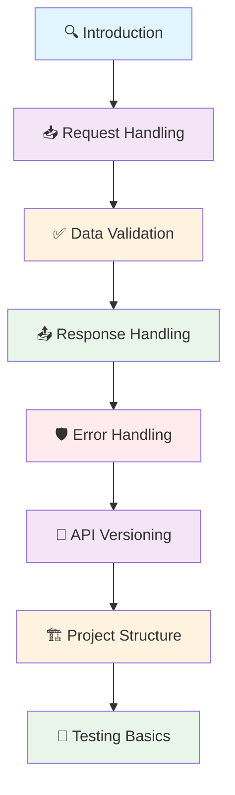

# 🏛️ Foundation

*Building robust, production-ready RESTful APIs with FastAPI*

Welcome to the Foundation section! This comprehensive guide builds upon the "Getting Started" section and introduces essential concepts for building production-ready RESTful APIs with FastAPI.

## 📋 Overview

This section provides a structured learning path covering the fundamental concepts you need to master for building robust, maintainable, and scalable APIs:

### 🔍 **Core Architecture Concepts**
Master the fundamental building blocks of professional API development with REST principles and FastAPI's powerful features.

### 🛠️ **Request & Response Handling**
Learn sophisticated techniques for processing client requests and crafting appropriate responses with proper validation and formatting.

### 🛡️ **Error Handling & Resilience**
Implement comprehensive error handling strategies that make your APIs robust and user-friendly in production environments.

### 🏗️ **Project Organization & Testing**
Structure your FastAPI projects for scalability and maintainability with proper testing strategies.

## 🛤️ Learning Path

### 🔍 **[1. Introduction to RESTful API Concepts](/docs/02_foundation/01-introduction)**
Understand the core principles of REST architecture and how FastAPI implements them effectively.

**Key Topics:**
- REST architectural constraints and principles
- FastAPI's approach to RESTful design
- Resource modeling best practices
- HTTP semantics and proper usage

[→ Master REST Principles](/docs/02_foundation/01-introduction)

---

### 📥 **[2. Request Handling](/docs/02_foundation/02-request-handling)**
Master path parameters, query parameters, request bodies, and headers to handle diverse client requests.

**Key Topics:**
- Path and query parameter handling
- Request body processing and validation
- Header management and extraction
- File upload handling

[→ Handle Requests Effectively](/docs/02_foundation/02-request-handling)

---

### ✅ **[3. Data Validation](/docs/02_foundation/03-data-validation)**
Learn how to leverage Pydantic models for automatic data validation, serialization, and documentation.

**Key Topics:**
- Pydantic model design patterns
- Advanced validation techniques
- Custom validators and serializers
- Automatic API documentation generation

[→ Implement Data Validation](/docs/02_foundation/03-data-validation)

---

### 📤 **[4. Response Handling](/docs/02_foundation/04-response-handling)**
Control your API responses with response models, status codes, and custom headers for predictable behavior.

**Key Topics:**
- Response model design
- HTTP status code selection
- Custom header management
- Content negotiation

[→ Design Response Handling](/docs/02_foundation/04-response-handling)

---

### 🛡️ **[5. Error Handling](/docs/02_foundation/05-error-handling)**
Implement comprehensive error handling strategies with custom exceptions and consistent error responses.

**Key Topics:**
- Custom exception classes
- Global error handlers
- Consistent error response formats
- Client-friendly error messages

[→ Build Error Handling](/docs/02_foundation/05-error-handling)

---

### 🔄 **[6. API Versioning](/docs/02_foundation/06-api-versioning)**
Explore different versioning strategies to maintain backward compatibility as your API evolves.

**Key Topics:**
- Versioning strategy comparison
- URL path vs. header versioning
- Backward compatibility planning
- Migration strategies

[→ Implement API Versioning](/docs/02_foundation/06-api-versioning)

---

### 🏗️ **[7. Project Structure](/docs/02_foundation/07-project-structure)**
Organize your FastAPI project for scalability with proper file structure and modular design patterns.

**Key Topics:**
- Modular application architecture
- Dependency injection patterns
- Configuration management
- Code organization best practices

[→ Structure Your Project](/docs/02_foundation/07-project-structure)

---

### 🧪 **[8. Testing Basics](/docs/02_foundation/08-testing-basics)**
Write tests for your API endpoints to ensure reliability and catch issues early in development.

**Key Topics:**
- Unit testing with pytest
- Integration testing strategies
- Test client usage
- Mocking external dependencies

[→ Learn Testing Fundamentals](/docs/02_foundation/08-testing-basics)

---

## 🎯 Prerequisites

Before starting this section, ensure you've completed the [Getting Started](/docs/01_getting-started) guide, which covers:

- ✅ **FastAPI installation and setup**
- ✅ **Basic HTTP methods** (GET, POST, PUT, DELETE)
- ✅ **RESTful URI design principles**
- ✅ **Creating your first API endpoints**

*Need to catch up? Start with our [Getting Started Guide](/docs/01_getting-started)*

## 🎓 Learning Objectives

By the end of this section, you'll be able to:

- ✅ **Design RESTful APIs** following industry best practices
- ✅ **Handle complex request scenarios** with path, query, and body parameters
- ✅ **Implement robust data validation** using Pydantic models
- ✅ **Create consistent and informative API responses**
- ✅ **Handle errors gracefully** with proper HTTP status codes
- ✅ **Version your APIs** for backward compatibility
- ✅ **Structure your FastAPI projects** for maintainability
- ✅ **Write basic tests** to ensure API reliability
- ✅ **Apply security best practices** in your API design

## 📈 Learning Approach

This section follows a progressive learning methodology:

### 🧠 **1. Conceptual Understanding**
Each topic starts with theory and best practices to build a solid foundation.

### 💻 **2. Practical Implementation**
Real-world examples and code snippets that you can use immediately in your projects.

### 🎯 **3. Common Patterns**
Industry-standard patterns and anti-patterns to avoid, based on real-world experience.

### 🛠️ **4. Hands-on Exercises**
Practice problems to reinforce your learning and build muscle memory.

## 🚀 Ready to Build Production APIs?

Choose your starting point based on your current needs:

- **📐 Start Systematically**: Begin with [Introduction](/docs/02_foundation/01-introduction) for a structured approach
- **🛠️ Focus on Implementation**: Jump to [Request Handling](/docs/02_foundation/02-request-handling) for hands-on coding
- **🛡️ Prioritize Reliability**: Start with [Error Handling](/docs/02_foundation/05-error-handling) for robust APIs
- **🧪 Ensure Quality**: Begin with [Testing Basics](/docs/02_foundation/08-testing-basics) for test-driven development

---

*💡 **Pro Tip**: Each section builds upon previous concepts while being self-contained. Consider working through the full sequence for maximum benefit.*

**Ready to build production-quality APIs? Let's dive in! 🎉**