# 🏛️ Foundation

*Building robust, production-ready RESTful APIs with FastAPI*

Welcome to the Foundation section! This comprehensive guide builds upon the "Getting Started" section and introduces essential concepts for building production-ready RESTful APIs with FastAPI.

## 📋 Overview

This section provides a structured learning path covering the fundamental concepts you need to master for building robust, maintainable, and scalable APIs. The topics are grouped into logical categories to guide you from core principles to advanced best practices.

### 🏛️ **Core Concepts & Communication**
Understand the foundational principles of RESTful APIs and the universal language of HTTP status codes that govern web communication.

### 🔄 **Data Flow & Interaction**
Master the complete data lifecycle in FastAPI, from handling incoming requests and validating data to crafting precise and secure responses.

### 🛡️ **API Management & Best Practices**
Learn to build resilient and maintainable APIs by implementing robust error handling, versioning strategies, and a well-organized project structure.

### ✅ **Quality & Reliability**
Ensure your API is production-ready by implementing comprehensive testing strategies to guarantee reliability and catch issues early.

## 🛤️ Learning Path

```mermaid
graph TD
    A[🔍 Introduction] --> B[📥 Request Handling]
    B --> C[✅ Data Validation]
    C --> D[📤 Response Handling]
    D --> E[🛡️ Error Handling]
    E --> I[🚦 HTTP Status Codes]
    I --> F[🔄 API Versioning]
    F --> G[🏗️ Project Structure]
    G --> H[🧪 Testing Basics]
    
    style A fill:#e1f5fe
    style B fill:#f3e5f5
    style C fill:#fff3e0
    style D fill:#e8f5e8
    style E fill:#ffebee
    style I fill:#c8e6c9
    style F fill:#f3e5f5
    style G fill:#fff3e0
    style H fill:#e8f5e8
```

### 🔍 **[1. Introduction to RESTful API Concepts](/docs/02_foundation/01-introduction)**
Understand the core principles of REST architecture, why APIs are essential, and how FastAPI simplifies building them with modern Python.

**Key Topics:**
- What is an API and why do we need them?
- Core REST architectural constraints (Client-Server, Statelessness, Uniform Interface)
- Resource modeling and URI design best practices
- How FastAPI implements REST principles with decorators and Pydantic

[→ Master REST Principles](/docs/02_foundation/01-introduction)

---

### 📥 **[2. Request Handling](/docs/02_foundation/02-request-handling)**
Master the four pillars of request handling in FastAPI: path parameters, query parameters, request bodies, and headers to process any client request.

**Key Topics:**
- Path parameters for identifying specific resources
- Query parameters for filtering, sorting, and pagination
- Request bodies for complex data submission with Pydantic
- Header and cookie parameters for metadata and authentication

[→ Handle Requests Effectively](/docs/02_foundation/02-request-handling)

---

### ✅ **[3. Data Validation](/docs/02_foundation/03-data-validation)**
Leverage Pydantic for robust, automatic data validation, ensuring data integrity and providing clear, actionable error messages.

**Key Topics:**
- Basic and advanced Pydantic models with `Field` validation
- Custom validators (`@validator`, `@root_validator`) for complex business logic
- Nested models for handling complex, structured data
- Using response models to separate input, database, and output schemas

[→ Implement Data Validation](/docs/02_foundation/03-data-validation)

---

### 📤 **[4. Response Handling](/docs/02_foundation/04-response-handling)**
Control and shape your API's output with response models, ensuring security, consistency, and clear documentation.

**Key Topics:**
- Using `response_model` to filter sensitive data and shape output
- Handling multiple response models for different user roles (e.g., public vs. admin)
- Creating generic response wrappers for consistent API responses
- Advanced patterns like `response_model_exclude_unset` and dynamic responses

[→ Design Response Handling](/docs/02_foundation/04-response-handling)

---

### 🛡️ **[5. Error Handling](/docs/02_foundation/05-error-handling)**
Implement comprehensive error handling strategies to make your API resilient, user-friendly, and easy to debug.

**Key Topics:**
- Basic error handling with `HTTPException`
- Creating custom exception classes for domain-specific errors
- Global exception handlers for consistent error responses (`@app.exception_handler`)
- Best practices for logging errors and providing helpful user feedback

[→ Build Error Handling](/docs/02_foundation/05-error-handling)

---

### 🔄 **[6. API Versioning](/docs/02_foundation/06-api-versioning)**
Explore different versioning strategies to evolve your API gracefully while maintaining backward compatibility for existing clients.

**Key Topics:**
- Why API versioning is critical for long-term maintenance
- URL-based versioning with `APIRouter` for clear separation
- Header-based versioning for cleaner URLs and dynamic responses
- Best practices for managing multiple API versions

[→ Implement API Versioning](/docs/02_foundation/06-api-versioning)

---

### 🏗️ **[7. Project Structure](/docs/02_foundation/07-project-structure)**
Organize your FastAPI project for scalability and maintainability with a modular, layered architecture.

**Key Topics:**
- Progressive project structures from startup to enterprise
- Layered architecture: API, Business Logic, and Data layers
- Centralized configuration management with Pydantic `BaseSettings`
- Using dependency injection for shared resources and clean code

[→ Structure Your Project](/docs/02_foundation/07-project-structure)

---

### 🧪 **[8. Testing Basics](/docs/02_foundation/08-testing-basics)**
Write effective tests for your API to ensure reliability, prevent regressions, and deploy with confidence.

**Key Topics:**
- Setting up a testing environment with `pytest` and `TestClient`
- Unit testing for individual functions and business logic
- Integration testing for component interactions
- API testing for end-to-end user scenarios and database interactions

[→ Learn Testing Fundamentals](/docs/02_foundation/08-testing-basics)

---

### 🚦 **[9. HTTP Status Codes](/docs/02_foundation/09-http-status-codes)**
Understand and effectively use HTTP status codes for clear and consistent API responses, acting as the universal language for web communication.

**Key Topics:**
- 2xx Success codes (OK, Created, No Content)
- 3xx Redirection codes (Moved Permanently, Found, Not Modified)
- 4xx Client error codes (Bad Request, Unauthorized, Forbidden, Not Found, Conflict, Too Many Requests)
- 5xx Server error codes (Internal Server Error, Bad Gateway, Service Unavailable)
- Best practices for status code usage and decision trees

[→ Master HTTP Status Codes](/docs/02_foundation/09-http-status-codes)

---

## 🎯 Prerequisites

Before starting this section, ensure you've completed the [Getting Started](/docs/01_getting-started) guide, which covers:

- ✅ **FastAPI installation and setup**
- ✅ **Basic HTTP methods** (GET, POST, PUT, DELETE)
- ✅ **RESTful URI design principles**
- ✅ **Creating your first API endpoints**

*Need to catch up? Start with our [Getting Started Guide](/docs/01_getting-started)*

## 🎓 Learning Objectives

By the end of this section, you'll be able to:

- ✅ **Design RESTful APIs** following industry best practices
- ✅ **Handle complex request scenarios** with path, query, and body parameters
- ✅ **Implement robust data validation** using Pydantic models
- ✅ **Create consistent and informative API responses**
- ✅ **Handle errors gracefully** with proper HTTP status codes
- ✅ **Version your APIs** for backward compatibility
- ✅ **Structure your FastAPI projects** for maintainability
- ✅ **Write basic tests** to ensure API reliability
- ✅ **Apply security best practices** in your API design

## 📈 Learning Approach

This section follows a progressive learning methodology:

### 🧠 **1. Conceptual Understanding**
Each topic starts with theory and best practices to build a solid foundation.

### 💻 **2. Practical Implementation**
Real-world examples and code snippets that you can use immediately in your projects.

### 🎯 **3. Common Patterns**
Industry-standard patterns and anti-patterns to avoid, based on real-world experience.

### 🛠️ **4. Hands-on Exercises**
Practice problems to reinforce your learning and build muscle memory.

## 🚀 Ready to Build Production APIs?

Choose your starting point based on your current needs:

- **📐 Start Systematically**: Begin with [Introduction](/docs/02_foundation/01-introduction) for a structured approach
- **🛠️ Focus on Implementation**: Jump to [Request Handling](/docs/02_foundation/02-request-handling) for hands-on coding
- **🛡️ Prioritize Reliability**: Start with [Error Handling](/docs/02_foundation/05-error-handling) for robust APIs
- **🧪 Ensure Quality**: Begin with [Testing Basics](/docs/02_foundation/08-testing-basics) for test-driven development

---

*💡 **Pro Tip**: Each section builds upon previous concepts while being self-contained. Consider working through the full sequence for maximum benefit.*

**Ready to build production-quality APIs? Let's dive in! 🎉**