# 🔍 Advanced Filtering, Searching & Querying Strategies

*Master enterprise-grade data retrieval patterns for complex business requirements*

## 🎯 Chapter Overview

Building upon the foundation of basic query parameters and request handling, this chapter explores sophisticated filtering and searching strategies that handle complex business scenarios, large datasets, and enterprise requirements.

## 📚 Prerequisites from Previous Chapters

From **Foundation** you should understand:
- Basic query parameter handling
- Request validation with Pydantic
- Response models and status codes

From **Intermediate** you should know:
- Advanced request format handling
- Complex validation patterns
- Performance optimization basics

## 🧠 Advanced Filtering Concepts

### Understanding Filter Complexity Levels

Think of filtering like a **restaurant search system** 🍽️:

```mermaid
graph TD
    A[🍽️ Basic Search] --> B[Name & Location]
    A --> C[📍 Intermediate Filters]
    C --> D[Cuisine, Price Range, Rating]
    C --> E[🔍 Advanced Querying]
    E --> F[Complex Combinations]
    E --> G[Semantic Search]
    E --> H[ML-Based Recommendations]
    
    style A fill:#e1f5fe
    style C fill:#fff3e0
    style E fill:#ffebee
```



**Enterprise filtering systems** must handle:
- **Dynamic query building** with type safety
- **Performance optimization** for large datasets
- **Security** against injection attacks
- **Caching strategies** for frequent queries
- **Real-time updates** without breaking pagination

## 🏗️ Enterprise Filter Architecture

### Dynamic Query Builder Pattern

```python
from fastapi import FastAPI, Query, Depends, HTTPException, Request
from pydantic import BaseModel, Field, validator
from typing import Optional, List, Dict, Any, Union, Literal
from datetime import datetime, date
from enum import Enum
import re
from dataclasses import dataclass

class FilterOperator(str, Enum):
    """Comprehensive operator set for enterprise filtering"""
    # Equality operators
    eq = "eq"          # Equal
    ne = "ne"          # Not equal
    
    # Comparison operators
    gt = "gt"          # Greater than
    gte = "gte"        # Greater than or equal
    lt = "lt"          # Less than
    lte = "lte"        # Less than or equal
    
    # Collection operators
    in_ = "in"         # In list
    nin = "nin"        # Not in list
    
    # Text operators
    like = "like"      # Pattern matching (case-sensitive)
    ilike = "ilike"    # Case-insensitive pattern matching
    regex = "regex"    # Regular expression
    fulltext = "fulltext"  # Full-text search
    
    # Range operators
    between = "between" # Range query
    
    # Null operators
    is_null = "is_null"     # IS NULL
    is_not_null = "is_not_null"  # IS NOT NULL
    
    # Geospatial operators (for location-based filtering)
    near = "near"      # Within distance
    within = "within"  # Within boundary

@dataclass
class FilterField:
    """Represents a single filter field with metadata"""
    name: str
    data_type: type
    operators: List[FilterOperator]
    description: str
    examples: List[str]
    searchable: bool = True
    indexable: bool = True

class FilterRegistry:
    """Central registry for managing filterable fields"""
    
    def __init__(self):
        self._fields: Dict[str, FilterField] = {}
        self._aliases: Dict[str, str] = {}
    
    def register_field(self, field: FilterField, aliases: List[str] = None):
        """Register a filterable field with optional aliases"""
        self._fields[field.name] = field
        
        # Register aliases
        if aliases:
            for alias in aliases:
                self._aliases[alias] = field.name
    
    def get_field(self, name: str) -> Optional[FilterField]:
        """Get field by name or alias"""
        # Check if it's an alias first
        actual_name = self._aliases.get(name, name)
        return self._fields.get(actual_name)
    
    def get_allowed_fields(self) -> Dict[str, FilterField]:
        """Get all registered fields"""
        return self._fields.copy()
    
    def validate_filter(self, field_name: str, operator: FilterOperator) -> bool:
        """Validate if operator is allowed for field"""
        field = self.get_field(field_name)
        return field is not None and operator in field.operators

# Initialize filter registry
filter_registry = FilterRegistry()

# Register user fields with rich metadata
filter_registry.register_field(
    FilterField(
        name="username",
        data_type=str,
        operators=[FilterOperator.eq, FilterOperator.ne, FilterOperator.like, FilterOperator.ilike, FilterOperator.regex],
        description="User's unique identifier",
        examples=["john_doe", "admin*", "user_[0-9]+"],
        searchable=True,
        indexable=True
    ),
    aliases=["user", "login"]
)

filter_registry.register_field(
    FilterField(
        name="email",
        data_type=str,
        operators=[FilterOperator.eq, FilterOperator.like, FilterOperator.ilike, FilterOperator.regex],
        description="User's email address",
        examples=["john@example.com", "*@gmail.com", ".*@company\\.(com|org)"],
        searchable=True,
        indexable=True
    )
)

filter_registry.register_field(
    FilterField(
        name="created_at",
        data_type=datetime,
        operators=[FilterOperator.eq, FilterOperator.gt, FilterOperator.gte, FilterOperator.lt, FilterOperator.lte, FilterOperator.between],
        description="Account creation timestamp",
        examples=["2024-01-01", "2024-01-01,2024-12-31", ">=2024-01-01"],
        searchable=False,
        indexable=True
    ),
    aliases=["created", "registration_date"]
)

filter_registry.register_field(
    FilterField(
        name="age",
        data_type=int,
        operators=[FilterOperator.eq, FilterOperator.ne, FilterOperator.gt, FilterOperator.gte, FilterOperator.lt, FilterOperator.lte, FilterOperator.between],
        description="User's age in years",
        examples=["25", "18,65", ">=21"],
        searchable=False,
        indexable=True
    )
)

class AdvancedFilterParams(BaseModel):
    """Enterprise-grade filter parameters with validation"""
    
    # Pagination (building on foundation knowledge)
    page: int = Field(1, ge=1, le=10000, description="Page number")
    limit: int = Field(10, ge=1, le=100, description="Items per page")
    
    # Sorting (detailed in next chapter)
    sort: Optional[str] = Field(None, description="Sort specification: field1:asc,field2:desc")
    
    # Field selection (sparse fieldsets)
    fields: Optional[str] = Field(None, description="Comma-separated list of fields to return")
    
    # Full-text search
    q: Optional[str] = Field(None, min_length=1, description="Full-text search query")
    
    # Search scope
    search_fields: Optional[str] = Field(None, description="Limit search to specific fields")
    
    # Query optimization hints
    use_cache: bool = Field(True, description="Enable result caching")
    explain: bool = Field(False, description="Return query execution plan")
    
    @validator('fields')
    def validate_fields(cls, v):
        """Validate requested fields against registry"""
        if not v:
            return v
        
        requested_fields = [f.strip() for f in v.split(',')]
        allowed_fields = set(filter_registry.get_allowed_fields().keys())
        
        invalid_fields = set(requested_fields) - allowed_fields
        if invalid_fields:
            raise ValueError(f"Invalid fields: {', '.join(invalid_fields)}")
        
        return v

def parse_filter_value(value: str, operator: FilterOperator, data_type: type) -> Any:
    """Advanced value parsing with type conversion and validation"""
    
    if operator in [FilterOperator.in_, FilterOperator.nin]:
        # Handle lists
        items = [item.strip() for item in value.split(",")]
        return [convert_type(item, data_type) for item in items]
    
    elif operator == FilterOperator.between:
        # Handle ranges
        parts = value.split(",")
        if len(parts) != 2:
            raise ValueError("Between operator requires exactly 2 values separated by comma")
        return [convert_type(parts[0].strip(), data_type), convert_type(parts[1].strip(), data_type)]
    
    elif operator in [FilterOperator.is_null, FilterOperator.is_not_null]:
        # Null checks don't need values
        return None
    
    else:
        # Single value
        return convert_type(value, data_type)

def convert_type(value: str, target_type: type) -> Any:
    """Smart type conversion with validation"""
    
    if target_type == bool:
        if value.lower() in ['true', '1', 'yes', 'on']:
            return True
        elif value.lower() in ['false', '0', 'no', 'off']:
            return False
        else:
            raise ValueError(f"Invalid boolean value: {value}")
    
    elif target_type == int:
        try:
            return int(value)
        except ValueError:
            raise ValueError(f"Invalid integer value: {value}")
    
    elif target_type == float:
        try:
            return float(value)
        except ValueError:
            raise ValueError(f"Invalid float value: {value}")
    
    elif target_type in [date, datetime]:
        try:
            # Support multiple date formats
            for fmt in ['%Y-%m-%d', '%Y-%m-%dT%H:%M:%S', '%Y-%m-%d %H:%M:%S']:
                try:
                    parsed = datetime.strptime(value, fmt)
                    return parsed.date() if target_type == date else parsed
                except ValueError:
                    continue
            raise ValueError("Invalid date format")
        except ValueError:
            raise ValueError(f"Invalid date value: {value}")
    
    else:
        # String type or unknown type
        return str(value)

class QueryBuilder:
    """Enterprise query builder with security and performance optimizations"""
    
    def __init__(self):
        self.filters = {}
        self.joins = set()
        self.performance_hints = {}
    
    def add_filter(self, field_name: str, operator: FilterOperator, value: Any):
        """Add a filter with validation"""
        
        # Get field metadata
        field = filter_registry.get_field(field_name)
        if not field:
            raise HTTPException(
                status_code=400,
                detail=f"Unknown filter field: {field_name}"
            )
        
        # Validate operator
        if not filter_registry.validate_filter(field_name, operator):
            raise HTTPException(
                status_code=400,
                detail=f"Operator '{operator}' not allowed for field '{field_name}'"
            )
        
        # Store filter
        if field_name not in self.filters:
            self.filters[field_name] = {}
        
        self.filters[field_name][operator.value] = value
        
        # Add performance hints
        if field.indexable:
            self.performance_hints[field_name] = "indexed"
    
    def build_sql_where(self) -> str:
        """Generate SQL WHERE clause (for demonstration)"""
        conditions = []
        
        for field_name, operators in self.filters.items():
            for op, value in operators.items():
                condition = self._build_condition(field_name, op, value)
                if condition:
                    conditions.append(condition)
        
        return " AND ".join(conditions) if conditions else "1=1"
    
    def _build_condition(self, field: str, op: str, value: Any) -> str:
        """Build individual SQL condition"""
        
        # This is a simplified example - in production, use parameterized queries
        if op == "eq":
            return f"{field} = '{value}'"
        elif op == "ne":
            return f"{field} != '{value}'"
        elif op == "gt":
            return f"{field} > '{value}'"
        elif op == "gte":
            return f"{field} >= '{value}'"
        elif op == "lt":
            return f"{field} < '{value}'"
        elif op == "lte":
            return f"{field} <= '{value}'"
        elif op == "like":
            return f"{field} LIKE '{value}'"
        elif op == "ilike":
            return f"LOWER({field}) LIKE LOWER('{value}')"
        elif op == "in":
            values = "', '".join(str(v) for v in value)
            return f"{field} IN ('{values}')"
        elif op == "nin":
            values = "', '".join(str(v) for v in value)
            return f"{field} NOT IN ('{values}')"
        elif op == "between":
            return f"{field} BETWEEN '{value[0]}' AND '{value[1]}'"
        elif op == "is_null":
            return f"{field} IS NULL"
        elif op == "is_not_null":
            return f"{field} IS NOT NULL"
        
        return ""

@app.get("/users/enterprise-filter")
async def get_users_enterprise_filter(
    request: Request,
    filters: AdvancedFilterParams = Depends(),
    
    # Dynamic filter parameters (the magic happens here)
    **dynamic_filters
):
    """
    🚀 Enterprise-grade filtering system with advanced capabilities
    
    Features:
    ✅ Type-safe filter registration and validation
    ✅ Dynamic query building with security protection
    ✅ Performance optimization hints
    ✅ Comprehensive operator support
    ✅ Field aliasing and metadata
    ✅ Query caching and explanation
    
    Example Usage:
    ```
    # Complex filtering with multiple operators
    GET /users/enterprise-filter?username__like=admin&age__between=25,65&created_at__gte=2024-01-01
    
    # Field selection and search
    GET /users/enterprise-filter?q=developer&fields=id,username,email&search_fields=username,bio
    
    # Performance analysis
    GET /users/enterprise-filter?username__eq=admin&explain=true
    ```
    """
    
    query_builder = QueryBuilder()
    
    # Process dynamic filter parameters
    for param_name, param_value in request.query_params.items():
        if "__" in param_name and param_value:
            try:
                field_name, operator = param_name.split("__", 1)
                
                # Validate operator
                try:
                    op_enum = FilterOperator(operator)
                except ValueError:
                    continue  # Skip invalid operators
                
                # Get field metadata for type conversion
                field = filter_registry.get_field(field_name)
                if field:
                    # Parse and convert value
                    parsed_value = parse_filter_value(param_value, op_enum, field.data_type)
                    query_builder.add_filter(field_name, op_enum, parsed_value)
                    
            except ValueError as e:
                raise HTTPException(status_code=400, detail=str(e))
    
    # Build query
    sql_where = query_builder.build_sql_where()
    
    # Simulate data retrieval with applied filters
    mock_users = [
        {
            "id": i,
            "username": f"user_{i:03d}",
            "email": f"user{i}@example.com",
            "age": 20 + (i % 50),
            "created_at": f"2024-{(i % 12) + 1:02d}-{(i % 28) + 1:02d}T10:30:00Z",
            "status": ["active", "inactive", "suspended"][i % 3]
        }
        for i in range(1, 101)
    ]
    
    # Apply field selection if requested
    selected_fields = None
    if filters.fields:
        selected_fields = [f.strip() for f in filters.fields.split(",")]
        mock_users = [
            {field: user[field] for field in selected_fields if field in user}
            for user in mock_users
        ]
    
    # Pagination
    start = (filters.page - 1) * filters.limit
    end = start + filters.limit
    paginated_users = mock_users[start:end]
    
    response = {
        "data": paginated_users,
        "pagination": {
            "page": filters.page,
            "limit": filters.limit,
            "total_items": len(mock_users),
            "total_pages": (len(mock_users) + filters.limit - 1) // filters.limit
        },
        "filters_applied": query_builder.filters,
        "query_metadata": {
            "sql_where": sql_where,
            "performance_hints": query_builder.performance_hints,
            "cache_enabled": filters.use_cache,
            "execution_time_ms": 23
        }
    }
    
    # Add query explanation if requested
    if filters.explain:
        response["query_explanation"] = {
            "estimated_cost": "LOW",
            "index_usage": ["username_idx", "created_at_idx"],
            "optimization_suggestions": [
                "Consider adding composite index on (age, status) for better performance",
                "Full-text search would benefit from dedicated search index"
            ]
        }
    
    return response
```

## 🔍 Advanced Search Implementation

### Semantic Search with Contextual Understanding

```python
from typing import Dict, List, Tuple
import re
from dataclasses import dataclass
from enum import Enum

class SearchMode(str, Enum):
    """Different search modes for various use cases"""
    EXACT = "exact"              # Exact phrase matching
    FUZZY = "fuzzy"              # Typo tolerance
    SEMANTIC = "semantic"        # Meaning-based search
    BOOLEAN = "boolean"          # AND/OR/NOT operations
    FACETED = "faceted"          # Category-based filtering
    AUTOCOMPLETE = "autocomplete" # Real-time suggestions

@dataclass
class SearchContext:
    """Context information for personalized search"""
    user_id: Optional[int] = None
    user_role: Optional[str] = None
    search_history: List[str] = None
    preferences: Dict[str, Any] = None
    location: Optional[str] = None

class AdvancedSearchParams(BaseModel):
    """Comprehensive search parameters"""
    
    # Core search
    q: str = Field(..., min_length=1, max_length=500, description="Search query")
    mode: SearchMode = Field(SearchMode.SEMANTIC, description="Search mode")
    
    # Field configuration
    search_fields: Optional[str] = Field(None, description="Fields to search in")
    boost_fields: Optional[Dict[str, float]] = Field(None, description="Field boost weights")
    
    # Search behavior
    fuzzy_distance: int = Field(2, ge=0, le=3, description="Maximum edit distance for fuzzy search")
    min_score: float = Field(0.1, ge=0, le=1, description="Minimum relevance score")
    
    # Results configuration
    highlight: bool = Field(True, description="Include highlighted snippets")
    highlight_fields: Optional[str] = Field(None, description="Fields to highlight")
    snippet_length: int = Field(150, ge=50, le=500, description="Highlight snippet length")
    
    # Faceted search
    facets: Optional[str] = Field(None, description="Comma-separated facet fields")
    
    # Personalization
    personalize: bool = Field(False, description="Enable personalized results")

def parse_advanced_query(query: str) -> Dict[str, Any]:
    """
    Parse sophisticated search queries with special syntax
    
    Supports:
    - Quoted phrases: "exact phrase"
    - Field searches: title:python, author:"John Doe"
    - Boolean operators: python AND (django OR flask) NOT tutorial
    - Wildcards: progr*mming, test?ng
    - Proximity: "machine learning"~5 (within 5 words)
    - Boost: python^2 django^0.5 (boost/penalty terms)
    - Date ranges: date:[2024-01-01 TO 2024-12-31]
    """
    
    # Initialize parser state
    parsed = {
        "terms": [],
        "phrases": [],
        "field_searches": {},
        "operators": {"and": [], "or": [], "not": []},
        "wildcards": [],
        "proximity": [],
        "boosts": {},
        "ranges": {}
    }
    
    # Step 1: Extract quoted phrases (including proximity)
    phrase_pattern = r'"([^"]*)"(?:~(\d+))?'
    for match in re.finditer(phrase_pattern, query):
        phrase = match.group(1)
        proximity = int(match.group(2)) if match.group(2) else None
        
        if proximity:
            parsed["proximity"].append({"phrase": phrase, "distance": proximity})
        else:
            parsed["phrases"].append(phrase)
        
        # Remove from query for further processing
        query = query.replace(match.group(0), ' ')
    
    # Step 2: Extract field searches (field:value or field:"phrase")
    field_pattern = r'(\w+):(?:"([^"]*)"|(\S+))'
    for match in re.finditer(field_pattern, query):
        field = match.group(1)
        value = match.group(2) or match.group(3)
        
        # Handle special range syntax [value TO value]
        if value.startswith('[') and ' TO ' in value and value.endswith(']'):
            range_content = value[1:-1]  # Remove brackets
            start, end = range_content.split(' TO ', 1)
            parsed["ranges"][field] = {"start": start.strip(), "end": end.strip()}
        else:
            parsed["field_searches"][field] = value
        
        # Remove from query
        query = query.replace(match.group(0), ' ')
    
    # Step 3: Extract boost indicators (term^boost)
    boost_pattern = r'(\w+)\^([0-9]*\.?[0-9]+)'
    for match in re.finditer(boost_pattern, query):
        term = match.group(1)
        boost = float(match.group(2))
        parsed["boosts"][term] = boost
        
        # Keep the term but remove boost syntax
        query = query.replace(match.group(0), term)
    
    # Step 4: Extract boolean operators
    # Convert to uppercase for processing
    query_upper = query.upper()
    
    # Find AND operations
    and_parts = re.split(r'\s+AND\s+', query_upper)
    if len(and_parts) > 1:
        parsed["operators"]["and"] = [part.strip() for part in and_parts]
    
    # Find OR operations (within AND groups)
    for i, part in enumerate(parsed["operators"]["and"]):
        or_parts = re.split(r'\s+OR\s+', part)
        if len(or_parts) > 1:
            parsed["operators"]["or"].extend(or_parts)
            parsed["operators"]["and"][i] = None
    
    # Clean up None values
    parsed["operators"]["and"] = [p for p in parsed["operators"]["and"] if p is not None]
    
    # Find NOT operations
    not_pattern = r'\s+NOT\s+(\w+)'
    for match in re.finditer(not_pattern, query_upper):
        parsed["operators"]["not"].append(match.group(1))
        query = query.replace(match.group(0), ' ')
    
    # Step 5: Extract wildcards
    wildcard_pattern = r'\b\w*[*?]\w*\b'
    for match in re.finditer(wildcard_pattern, query):
        parsed["wildcards"].append(match.group(0))
    
    # Step 6: Extract remaining terms
    # Clean up the query and extract simple terms
    query_cleaned = re.sub(r'\s+', ' ', query.strip())
    query_cleaned = re.sub(r'\b(AND|OR|NOT)\b', '', query_cleaned, flags=re.IGNORECASE)
    
    terms = [term.strip() for term in query_cleaned.split() if term.strip()]
    # Filter out terms already captured elsewhere
    existing_terms = set()
    existing_terms.update(parsed["phrases"])
    existing_terms.update(parsed["field_searches"].values())
    existing_terms.update(parsed["wildcards"])
    existing_terms.update(parsed["boosts"].keys())
    
    parsed["terms"] = [term for term in terms if term not in existing_terms]
    
    return parsed

@app.get("/search/advanced")
async def advanced_search(
    search_params: AdvancedSearchParams = Depends(),
    request: Request,
    
    # Context parameters
    user_id: Optional[int] = Query(None, description="User ID for personalization"),
    location: Optional[str] = Query(None, description="User location for geo-relevance")
):
    """
    🧠 Advanced search with semantic understanding and personalization
    
    Features:
    ✅ Complex query parsing with boolean logic
    ✅ Fuzzy matching with configurable tolerance
    ✅ Semantic search for meaning-based results
    ✅ Personalized ranking based on user context
    ✅ Faceted search for category filtering
    ✅ Real-time suggestions and autocomplete
    ✅ Performance monitoring and optimization
    
    Query Examples:
    ```
    # Boolean search
    q=python AND (django OR flask) NOT tutorial
    
    # Field-specific search with boost
    q=title:"machine learning"^2 author:andrew
    
    # Proximity search
    q="artificial intelligence"~3 python
    
    # Date range with wildcard
    q=AI date:[2024-01-01 TO 2024-12-31] author:*smith
    ```
    """
    
    # Parse the advanced query
    parsed_query = parse_advanced_query(search_params.q)
    
    # Build search context
    context = SearchContext(
        user_id=user_id,
        location=location,
        search_history=[],  # Would come from database
        preferences={}      # Would come from user profile
    )
    
    # Simulate search execution with different modes
    search_results = []
    
    if search_params.mode == SearchMode.SEMANTIC:
        # Semantic search simulation
        search_results = execute_semantic_search(parsed_query, context, search_params)
    elif search_params.mode == SearchMode.FUZZY:
        # Fuzzy search simulation
        search_results = execute_fuzzy_search(parsed_query, context, search_params)
    elif search_params.mode == SearchMode.BOOLEAN:
        # Boolean search simulation
        search_results = execute_boolean_search(parsed_query, context, search_params)
    
    # Apply personalization if enabled
    if search_params.personalize and context.user_id:
        search_results = apply_personalization(search_results, context)
    
    # Generate facets if requested
    facets = {}
    if search_params.facets:
        facet_fields = [f.strip() for f in search_params.facets.split(',')]
        facets = generate_facets(search_results, facet_fields)
    
    # Filter by minimum score
    filtered_results = [
        result for result in search_results 
        if result.get('score', 0) >= search_params.min_score
    ]
    
    return {
        "query": search_params.q,
        "parsed_query": parsed_query,
        "search_mode": search_params.mode,
        "results": filtered_results,
        "facets": facets,
        "metadata": {
            "total_results": len(filtered_results),
            "search_time_ms": 45,
            "personalized": search_params.personalize,
            "suggestions": generate_suggestions(search_params.q) if len(filtered_results) < 5 else []
        }
    }

def execute_semantic_search(parsed_query: Dict, context: SearchContext, params: AdvancedSearchParams) -> List[Dict]:
    """Execute semantic search with meaning understanding"""
    
    # Mock semantic search results
    # In production, this would use vector embeddings, NLP models, etc.
    mock_results = [
        {
            "id": 1,
            "title": "FastAPI Advanced Patterns",
            "content": "Deep dive into advanced FastAPI patterns including dependency injection...",
            "author": "Jane Developer",
            "category": "programming",
            "tags": ["python", "fastapi", "web", "api"],
            "published_date": "2024-01-15",
            "score": 0.95,
            "semantic_match": "high"
        },
        {
            "id": 2,
            "title": "Python Web Development Guide",
            "content": "Comprehensive guide to building web applications with Python...",
            "author": "John Coder",
            "category": "tutorial",
            "tags": ["python", "web", "django", "flask"],
            "published_date": "2024-01-10",
            "score": 0.78,
            "semantic_match": "medium"
        }
    ]
    
    # Apply highlighting if requested
    if params.highlight:
        for result in mock_results:
            result["highlights"] = generate_highlights(
                result, parsed_query, params.snippet_length
            )
    
    return mock_results

def execute_fuzzy_search(parsed_query: Dict, context: SearchContext, params: AdvancedSearchParams) -> List[Dict]:
    """Execute fuzzy search with typo tolerance"""
    # Implementation would use edit distance algorithms
    return []

def execute_boolean_search(parsed_query: Dict, context: SearchContext, params: AdvancedSearchParams) -> List[Dict]:
    """Execute boolean search with AND/OR/NOT logic"""
    # Implementation would build boolean query trees
    return []

def apply_personalization(results: List[Dict], context: SearchContext) -> List[Dict]:
    """Apply personalized ranking based on user context"""
    
    # Mock personalization - in production would use ML models
    for result in results:
        # Boost based on user's historical preferences
        if context.user_id:
            # Simulate user preference boost
            if "python" in result.get("tags", []):
                result["score"] = min(result["score"] * 1.2, 1.0)
        
        # Location-based relevance
        if context.location:
            # Would implement geo-relevance logic
            pass
    
    # Re-sort by updated scores
    results.sort(key=lambda x: x.get("score", 0), reverse=True)
    return results

def generate_facets(results: List[Dict], facet_fields: List[str]) -> Dict[str, Dict]:
    """Generate faceted search results for filtering"""
    
    facets = {}
    
    for field in facet_fields:
        facets[field] = {}
        
        # Count occurrences of each value in the field
        for result in results:
            if field in result:
                value = result[field]
                if isinstance(value, list):
                    # Handle array fields like tags
                    for item in value:
                        facets[field][item] = facets[field].get(item, 0) + 1
                else:
                    # Handle single value fields
                    facets[field][value] = facets[field].get(value, 0) + 1
    
    return facets

def generate_suggestions(query: str) -> List[str]:
    """Generate search suggestions for query improvement"""
    
    # Mock suggestions - in production would use ML/statistical models
    suggestions = [
        "Did you mean: FastAPI tutorial?",
        "Try: python web framework",
        "Related: REST API design patterns"
    ]
    
    return suggestions

def generate_highlights(result: Dict, parsed_query: Dict, max_length: int) -> List[str]:
    """Generate highlighted text snippets"""
    
    content = result.get("content", "")
    highlights = []
    
    # Find sentences containing search terms
    sentences = re.split(r'[.!?]+', content)
    
    for sentence in sentences[:3]:  # Limit to 3 highlights
        sentence = sentence.strip()
        if len(sentence) > max_length:
            sentence = sentence[:max_length] + "..."
        
        # Apply highlighting markup
        highlighted = sentence
        for term in parsed_query.get("terms", []):
            pattern = re.compile(f'\\b{re.escape(term)}\\b', re.IGNORECASE)
            highlighted = pattern.sub(f'<mark>{term}</mark>', highlighted)
        
        highlights.append(highlighted)
    
    return highlights
```

## 🎯 Performance Optimization Strategies

### Query Optimization and Caching

```mermaid
graph TD
    A[🔍 Search Request] --> B{Cache Hit?}
    B -->|Yes| C[📊 Return Cached Results]
    B -->|No| D[🏗️ Build Query]
    D --> E[⚡ Apply Optimizations]
    E --> F[🗄️ Execute Query]
    F --> G[💾 Cache Results]
    G --> H[📤 Return Results]
    
    E --> I[Index Hints]
    E --> J[Query Rewriting]
    E --> K[Parallel Execution]
    
    style A fill:#e1f5fe
    style C fill:#e8f5e8
    style F fill:#fff3e0
    style G fill:#f3e5f5
```



```python
import hashlib
import json
from typing import Optional
import time

class QueryOptimizer:
    """Advanced query optimization and caching system"""
    
    def __init__(self):
        self.cache = {}  # In production, use Redis or similar
        self.query_stats = {}
        self.optimization_rules = []
    
    def optimize_query(self, filters: Dict, search_params: Dict) -> Dict:
        """Apply query optimizations"""
        
        optimized = {
            "filters": filters.copy(),
            "search_params": search_params.copy(),
            "optimizations_applied": []
        }
        
        # Rule 1: Combine similar filters
        if self._has_similar_filters(filters):
            optimized["filters"] = self._combine_filters(filters)
            optimized["optimizations_applied"].append("filter_combination")
        
        # Rule 2: Reorder filters by selectivity
        optimized["filters"] = self._reorder_by_selectivity(optimized["filters"])
        optimized["optimizations_applied"].append("selectivity_ordering")
        
        # Rule 3: Add index hints for performance
        index_hints = self._suggest_indexes(optimized["filters"])
        if index_hints:
            optimized["index_hints"] = index_hints
            optimized["optimizations_applied"].append("index_hints")
        
        return optimized
    
    def _has_similar_filters(self, filters: Dict) -> bool:
        """Check if filters can be combined"""
        # Simplified logic - in production would be more sophisticated
        return len(filters) > 5
    
    def _combine_filters(self, filters: Dict) -> Dict:
        """Combine compatible filters for better performance"""
        # Implementation would merge range queries, combine IN clauses, etc.
        return filters
    
    def _reorder_by_selectivity(self, filters: Dict) -> Dict:
        """Reorder filters by expected selectivity (most selective first)"""
        
        # Mock selectivity scores (in production, use statistics)
        selectivity_scores = {
            "id": 1.0,           # Highest selectivity
            "email": 0.9,
            "username": 0.8,
            "status": 0.3,
            "role": 0.2,
            "created_at": 0.1    # Lowest selectivity
        }
        
        # Sort filters by selectivity
        sorted_items = sorted(
            filters.items(),
            key=lambda x: selectivity_scores.get(x[0], 0.5),
            reverse=True
        )
        
        return dict(sorted_items)
    
    def _suggest_indexes(self, filters: Dict) -> List[str]:
        """Suggest database indexes for optimal performance"""
        
        suggestions = []
        
        # Single field indexes
        for field in filters.keys():
            if field in ["id", "email", "username"]:
                suggestions.append(f"CREATE INDEX idx_{field} ON users({field})")
        
        # Composite indexes for multiple filters
        if len(filters) > 1:
            fields = list(filters.keys())[:3]  # Top 3 most selective
            suggestions.append(f"CREATE INDEX idx_composite ON users({', '.join(fields)})")
        
        return suggestions

class QueryCache:
    """Intelligent query result caching"""
    
    def __init__(self, ttl_seconds: int = 300):  # 5 minute default TTL
        self.cache = {}
        self.ttl = ttl_seconds
        self.hit_count = 0
        self.miss_count = 0
    
    def get_cache_key(self, query_params: Dict) -> str:
        """Generate consistent cache key from query parameters"""
        
        # Normalize parameters for consistent caching
        normalized = self._normalize_params(query_params)
        
        # Create hash from normalized parameters
        params_json = json.dumps(normalized, sort_keys=True)
        return hashlib.md5(params_json.encode()).hexdigest()
    
    def _normalize_params(self, params: Dict) -> Dict:
        """Normalize parameters for consistent caching"""
        
        normalized = {}
        
        for key, value in params.items():
            if isinstance(value, str):
                # Normalize string cases and whitespace
                normalized[key] = value.strip().lower()
            elif isinstance(value, list):
                # Sort lists for consistency
                normalized[key] = sorted(value)
            else:
                normalized[key] = value
        
        return normalized
    
    def get(self, cache_key: str) -> Optional[Dict]:
        """Get cached result if valid"""
        
        if cache_key in self.cache:
            cached_item = self.cache[cache_key]
            
            # Check if cache is still valid
            if time.time() - cached_item["timestamp"] < self.ttl:
                self.hit_count += 1
                return cached_item["data"]
            else:
                # Remove expired item
                del self.cache[cache_key]
        
        self.miss_count += 1
        return None
    
    def set(self, cache_key: str, data: Dict):
        """Cache query result"""
        
        self.cache[cache_key] = {
            "data": data,
            "timestamp": time.time()
        }
    
    def get_stats(self) -> Dict:
        """Get cache performance statistics"""
        
        total_requests = self.hit_count + self.miss_count
        hit_rate = self.hit_count / total_requests if total_requests > 0 else 0
        
        return {
            "hit_count": self.hit_count,
            "miss_count": self.miss_count,
            "hit_rate": round(hit_rate * 100, 2),
            "cached_items": len(self.cache)
        }

# Initialize global instances
query_optimizer = QueryOptimizer()
query_cache = QueryCache()

@app.get("/users/optimized-search")
async def optimized_search(
    request: Request,
    filters: AdvancedFilterParams = Depends(),
    use_cache: bool = Query(True, description="Enable result caching"),
    explain_plan: bool = Query(False, description="Return query execution plan")
):
    """
    ⚡ High-performance search with optimization and caching
    
    This endpoint demonstrates enterprise-grade performance optimization:
    ✅ Intelligent query optimization
    ✅ Multi-layer caching strategy
    ✅ Query plan analysis
    ✅ Performance monitoring
    ✅ Index suggestions
    """
    
    start_time = time.time()
    
    # Generate cache key
    query_params = dict(request.query_params)
    cache_key = query_cache.get_cache_key(query_params)
    
    # Try cache first
    if use_cache:
        cached_result = query_cache.get(cache_key)
        if cached_result:
            cached_result["metadata"]["cached"] = True
            cached_result["metadata"]["cache_hit"] = True
            return cached_result
    
    # Extract dynamic filters from query parameters
    dynamic_filters = {}
    for param_name, param_value in request.query_params.items():
        if "__" in param_name and param_value:
            dynamic_filters[param_name] = param_value
    
    # Optimize query
    optimization_result = query_optimizer.optimize_query(
        dynamic_filters, 
        filters.dict()
    )
    
    # Execute optimized query (mock implementation)
    search_results = [
        {
            "id": i,
            "username": f"user_{i:03d}",
            "email": f"user{i}@example.com",
            "score": 0.9 - (i * 0.01)
        }
        for i in range(1, 21)
    ]
    
    # Build response
    execution_time = round((time.time() - start_time) * 1000, 2)
    
    response = {
        "data": search_results,
        "metadata": {
            "execution_time_ms": execution_time,
            "cached": False,
            "cache_hit": False,
            "optimizations_applied": optimization_result["optimizations_applied"],
            "cache_stats": query_cache.get_stats()
        }
    }
    
    # Add query plan if requested
    if explain_plan:
        response["query_plan"] = {
            "original_filters": dynamic_filters,
            "optimized_filters": optimization_result["filters"],
            "index_hints": optimization_result.get("index_hints", []),
            "estimated_cost": "MEDIUM",
            "estimated_rows": len(search_results)
        }
    
    # Cache the result
    if use_cache:
        query_cache.set(cache_key, response)
    
    return response
```

## 🎓 Key Takeaways

This advanced filtering and searching chapter builds upon foundational concepts to provide:

1. **🏗️ Enterprise Architecture**: Dynamic filter registration with type safety and validation
2. **🔍 Advanced Query Parsing**: Support for complex search syntax with boolean logic
3. **⚡ Performance Optimization**: Query optimization, caching, and index suggestions
4. **🧠 Semantic Understanding**: Meaning-based search with personalization
5. **📊 Comprehensive Monitoring**: Performance metrics and query analysis

**Next Steps**: Move to [Pagination Strategies](/docs/04_advance/02-pagination-strategies) to learn how to efficiently handle large result sets with the filtering capabilities you've just mastered.