# 🔍 Filtering & Searching Like a Pro

*Building smarter APIs that help users find exactly what they need*

## 🎯 Learning Journey Overview

**What you'll master today:**
- 🏗️ Building intelligent filter systems that understand user intent  
- 🧠 Creating search APIs that think like human librarians
- ⚡ Optimizing performance for lightning-fast results
- 🔒 Implementing bulletproof security and validation
- 📊 Adding smart caching and personalization

**Time investment:** ~45 minutes | **Difficulty:** Intermediate | **Prerequisites:** Foundation chapters complete

## 🎯 What We'll Build Together

Think of this chapter as learning to build a **smart librarian system** 📚. Just like a helpful librarian who can find any book using different search methods - by title, author, year, or even "that book about dragons with a red cover" - we'll create APIs that understand and respond to complex user requests.

### 🧠 The Intelligence Ladder

```mermaid
graph LR
    A["🤖 Basic Bot<br/>Exact matches only"] --> B["📋 Smart Assistant<br/>Understands filters"]
    B --> C["🧠 Intelligent Helper<br/>Complex queries"]
    C --> D["🔮 Mind Reader<br/>Predicts needs"]
    
    style A fill:#ffcdd2
    style B fill:#fff3e0
    style C fill:#e8f5e8
    style D fill:#e1f5fe
```


## 📚 What You Should Know First

From **Foundation** chapters, you understand:
- Basic query parameters (`?name=john`)
- Request validation with Pydantic
- Response models and HTTP status codes

From **Intermediate** basics, you know:
- How to handle different request formats
- Basic validation patterns
- Why performance matters in APIs

## 🎯 The Big Picture: From Simple to Smart

### 🏗️ The Intelligent Librarian Evolution

Imagine you're building a digital librarian that evolves from basic to brilliant:

```mermaid
flowchart TD
    A["📚 Basic Librarian<br/>❌ Only exact matches<br/>⏱️ Manual catalog search<br/>🐌 5000ms response"] 
    B["🎯 Smart Librarian<br/>✅ Understands filters<br/>📂 Quick categorization<br/>🚗 500ms response"]
    C["🧠 Advanced Librarian<br/>✅ Complex boolean queries<br/>🔍 Context understanding<br/>🏎️ 50ms response"]
    D["🔮 Mind-Reading Librarian<br/>✅ Predicts user needs<br/>🎯 Personalized results<br/>🚀 5ms response"]
    
    A --> B
    B --> C
    C --> D
    
    A -.->|"Today's Goal"| C
    
    subgraph "Real-World Examples"
        E["🔍 'Find book 123'<br/>Direct ID lookup"]
        F["📊 'Fiction books under $20'<br/>Category + price filter"]
        G["🧠 'Sci-fi like Dune but newer'<br/>Semantic + temporal"]
        H["🎭 'Something you'd recommend'<br/>AI-powered suggestions"]
    end
    
    A -.-> E
    B -.-> F
    C -.-> G
    D -.-> H
    
    style A fill:#ffcdd2
    style B fill:#f8bbd9
    style C fill:#e1bee7
    style D fill:#d1c4e9
    style E fill:#fff3e0
    style F fill:#e8f5e8
    style G fill:#e3f2fd
    style H fill:#f3e5f5
```



**Today's Journey**: We'll build from basic search (Level 1) to advanced intelligent filtering (Level 3), with glimpses of Level 4!

## 💡 Understanding Filter Complexity: The Restaurant Evolution

Think of API filtering like **evolving dining experiences** that get smarter and more sophisticated:

```mermaid
graph LR
    A["🏃 Fast Food<br/>Basic Filtering<br/>?category=food<br/>⚡ Instant but limited"] 
    B["🍕 Pizza Place<br/>Multiple Options<br/>?size=large&toppings=pepperoni<br/>⚡ Customizable menu"]
    C["🍽️ Fine Dining<br/>Complex Criteria<br/>?category=seafood&spice_level__lt=3<br/>⚡ Sophisticated combinations"]
    D["👨‍🍳 Personal Chef<br/>Intent Understanding<br/>?mood=romantic&personalized=true<br/>⚡ Mind-reading service"]
    
    A --> B --> C --> D
    
    style A fill:#ffebee
    style B fill:#fff3e0
    style C fill:#e8f5e8
    style D fill:#e1f5fe
```



### 🏃 Level 1: Fast Food (Basic Filtering)
**The Experience:** Walk in, point at menu, get exactly that  
**User Says:** *"Give me a burger"* → Simple, one choice  
**API Pattern:** `?category=food`  
**Characteristics:**
- ✅ **Speed:** Instant response
- ✅ **Simplicity:** One parameter, clear result
- ❌ **Flexibility:** Limited customization
- **Best For:** Simple catalogs, quick lookups, mobile apps

**Real Example:**
```python
# Fast food filtering - simple and direct
GET /products?category=electronics
GET /users?status=active
GET /posts?published=true
```

### 🍕 Level 2: Pizza Place (Multiple Options)
**The Experience:** Choose size, toppings, crust type from clear options  
**User Says:** *"Large pepperoni pizza, extra cheese"* → Multiple clear options  
**API Pattern:** `?size=large&toppings=pepperoni&extra=cheese`  
**Characteristics:**
- ✅ **Control:** Multiple independent filters
- ✅ **Predictability:** Combine options as expected
- ✅ **User-Friendly:** Matches mental models
- **Best For:** E-commerce, standard filtering interfaces

**Real Example:**
```python
# Pizza place filtering - combinable options
GET /products?category=laptops&price_max=1500&brand=apple
GET /users?role=admin&created_after=2024-01-01&status=active
GET /articles?tags=python,fastapi&difficulty=beginner
```

### 🍽️ Level 3: Fine Dining (Complex Requests)
**The Experience:** Describe preferences, dietary needs, occasion - chef interprets  
**User Says:** *"Something seafood, not too spicy, under $30, wine-paired"* → Complex criteria  
**API Pattern:** `?category=seafood&spice_level__lt=3&price__lte=30&wine_pairing=true`  
**Characteristics:**
- ✅ **Sophistication:** Operators like `__lt`, `__gte`, `__in`
- ✅ **Precision:** Range queries, exclusions, comparisons
- ✅ **Power:** Handle complex business logic
- **Best For:** Advanced search interfaces, data analytics, power users

**Real Example:**
```python
# Fine dining filtering - sophisticated queries
GET /users?age__gte=18&age__lte=65&created_at__gte=2024-01-01&email__like=@gmail.com
GET /products?price__between=100,500&rating__gte=4.0&stock__gt=0&category__in=electronics,computers
GET /orders?total__gte=100&status__ne=cancelled&created_at__lt=2024-01-01
```

### 👨‍🍳 Level 4: Personal Chef (Understanding Intent)
**The Experience:** Describe mood/situation, chef knows your preferences and suggests perfectly  
**User Says:** *"Something light for a romantic dinner"* → Understanding context and preferences  
**API Pattern:** `?mood=romantic&dietary_preference=light&occasion=dinner&personalized=true`  
**Characteristics:**
- ✅ **Intelligence:** Semantic understanding
- ✅ **Personalization:** Uses user history and preferences
- ✅ **Context:** Considers time, location, past behavior
- **Best For:** AI-powered recommendations, personalized platforms, smart assistants

**Real Example:**
```python
# Personal chef filtering - intelligent and contextual
GET /recommendations?user_context=work_evening&mood=productive&personalized=true
GET /content?similar_to=article_123&user_interests=python,api&difficulty=auto
GET /products?occasion=birthday&recipient_age=25&budget=auto&surprise_factor=high
```

### 📊 Filter Complexity Comparison

| Level | Response Time | Learning Curve | User Satisfaction | Implementation Effort |
|-------|---------------|----------------|-------------------|----------------------|
| 🏃 Fast Food | ⚡ Instant | ✅ None | 😊 Good for simple needs | 🟢 Low |
| 🍕 Pizza Place | ⚡ Fast | 📚 Minimal | 😄 Great for most users | 🟡 Medium |
| 🍽️ Fine Dining | ⚡ Quick | 📖 Moderate | 🤩 Excellent for power users | 🟠 High |
| 👨‍🍳 Personal Chef | 🔮 Intelligent | 🧠 Intuitive | 🥰 Mind-blowing | 🔴 Very High |

## 🎓 Why This Matters for Your API

Real users don't just search for exact matches. They search like humans:
- **"Find all active users created last month"** (combining filters)
- **"Show me Python tutorials for beginners"** (semantic search)
- **"Articles similar to this one"** (intelligent recommendations)

## 🔧 Building Smart Filters: Step by Step

### Step 1: The Foundation - Smart Filter Registry

Think of this as **training your librarian** to understand what questions they can answer:

```python
# 🧠 Think of this as your librarian's comprehensive training manual
# Every import has a purpose - like different tools in a librarian's toolkit
from fastapi import FastAPI, Query, Depends, HTTPException, Request, status
from pydantic import BaseModel, Field, validator, ValidationError
from typing import Optional, List, Dict, Any, Union, Literal, TypeVar, Generic
from datetime import datetime, date, timezone
from enum import Enum
from dataclasses import dataclass, field
import logging
import re
from abc import ABC, abstractmethod

# Set up logging - like a librarian keeping a record of all searches
logger = logging.getLogger(__name__)

# 🎯 First, let's define what kinds of questions our intelligent librarian can understand
# Think of these as different conversation styles with your librarian
class FilterOperator(str, Enum):
    """
    Different ways to ask questions - like a librarian's conversation toolkit
    
    Each operator is like teaching your librarian a new way to understand requests:
    - Simple questions for basic needs
    - Complex questions for sophisticated searches
    - Smart questions that understand context
    """
    
    # 🎯 Simple questions: "Is this exactly what you want?"
    # Like asking "Do you have the book 'Python Programming'?"
    eq = "eq"          # Equal to (exact match) - "Show me users named 'john'"
    ne = "ne"          # Not equal to (exclude this) - "Show me everyone except admins"
    
    # 📊 Comparison questions: "More than? Less than?"
    # Like asking "Do you have books published after 2020?"
    gt = "gt"          # Greater than - "Users older than 25"
    gte = "gte"        # Greater than or equal - "Users aged 25 or older"
    lt = "lt"          # Less than - "Products under $100"
    lte = "lte"        # Less than or equal - "Products $100 or less"
    
    # 📝 List questions: "Is it one of these options?"
    # Like asking "Do you have books by Tolkien, Asimov, or Herbert?"
    in_ = "in"         # Is one of these options - "Users from NY, CA, or TX"
    nin = "nin"        # Is NOT one of these options - "Users not from these states"
    
    # 🔍 Text questions: "Sounds like? Contains?"
    # Like asking "Do you have anything about dragons?"
    like = "like"      # Contains this text (case-sensitive) - "Emails containing 'admin'"
    ilike = "ilike"    # Contains this text (ignore capitals) - "Names like 'john' or 'JOHN'"
    regex = "regex"    # Matches this pattern - "Usernames following pattern 'user_[0-9]+'"
    
    # 📏 Range questions: "Between these values?"
    # Like asking "Books published between 2020 and 2024"
    between = "between" # Between two values - "Ages between 18 and 65"
    
    # ❓ Existence questions: "Does this field have data?"
    # Like asking "Do you have books with ISBN numbers?"
    is_null = "is_null"         # Field is empty - "Users without profile pictures"
    is_not_null = "is_not_null" # Field has a value - "Users with email addresses"
    
    @classmethod
    def get_compatible_operators(cls, data_type: type) -> List['FilterOperator']:
        """
        Get operators that make sense for a specific data type
        Like a librarian knowing which questions work for which types of information
        """
        compatibility_map = {
            str: [cls.eq, cls.ne, cls.like, cls.ilike, cls.regex, cls.in_, cls.nin, cls.is_null, cls.is_not_null],
            int: [cls.eq, cls.ne, cls.gt, cls.gte, cls.lt, cls.lte, cls.between, cls.in_, cls.nin, cls.is_null, cls.is_not_null],
            float: [cls.eq, cls.ne, cls.gt, cls.gte, cls.lt, cls.lte, cls.between, cls.in_, cls.nin, cls.is_null, cls.is_not_null],
            bool: [cls.eq, cls.ne, cls.is_null, cls.is_not_null],
            datetime: [cls.eq, cls.ne, cls.gt, cls.gte, cls.lt, cls.lte, cls.between, cls.is_null, cls.is_not_null],
            date: [cls.eq, cls.ne, cls.gt, cls.gte, cls.lt, cls.lte, cls.between, cls.is_null, cls.is_not_null],
        }
        return compatibility_map.get(data_type, [cls.eq, cls.ne, cls.is_null, cls.is_not_null])
    
    def get_description(self) -> str:
        """Get human-readable description of what this operator does"""
        descriptions = {
            self.eq: "exactly matches",
            self.ne: "does not match", 
            self.gt: "is greater than",
            self.gte: "is greater than or equal to",
            self.lt: "is less than",
            self.lte: "is less than or equal to",
            self.in_: "is one of these values",
            self.nin: "is not one of these values",
            self.like: "contains this text (case-sensitive)",
            self.ilike: "contains this text (any case)",
            self.regex: "matches this pattern",
            self.between: "is between these two values",
            self.is_null: "is empty or null",
            self.is_not_null: "has a value"
        }
        return descriptions.get(self, f"performs {self.value} operation")

@dataclass
class FilterField:
    """
    📋 Information about what our intelligent librarian can search for
    
    Think of this as a comprehensive catalog card that not only tells you what's available,
    but also teaches the librarian HOW to search and what to expect.
    
    Like having a detailed instruction manual for each type of book information:
    - What the information looks like (data_type)
    - How to ask questions about it (operators)
    - What makes it special (constraints, validation)
    - How to help users use it (examples, descriptions)
    """
    name: str                               # What we call this field (the "title" on our catalog card)
    data_type: type                        # What kind of data (text, number, date) - like the "genre"
    operators: List[FilterOperator]        # What questions we can ask about it - like "search methods"
    description: str                       # Human-friendly explanation - like the "summary"
    examples: List[str]                   # Example searches - like "sample queries"
    searchable: bool = True               # Can we search the content? - like "full-text searchable"
    indexable: bool = True                # Is it fast to search? - like "indexed in catalog"
    
    # 🔧 Advanced features for smart librarians
    validation_pattern: Optional[str] = None      # Regex pattern for validation
    min_length: Optional[int] = None              # Minimum length for text fields
    max_length: Optional[int] = None              # Maximum length for text fields
    min_value: Optional[Union[int, float]] = None # Minimum value for numeric fields
    max_value: Optional[Union[int, float]] = None # Maximum value for numeric fields
    allowed_values: Optional[List[Any]] = None    # Predefined list of valid values
    case_sensitive: bool = False                  # Whether text searches should be case-sensitive
    performance_tier: str = "fast"               # Performance expectation: "instant", "fast", "medium", "slow"
    
    def __post_init__(self):
        """
        🧠 Smart validation after field creation - like a librarian double-checking the catalog card
        Ensures our field definition makes sense and catches common mistakes early
        """
        # Auto-generate compatible operators if none provided
        if not self.operators:
            self.operators = FilterOperator.get_compatible_operators(self.data_type)
            logger.info(f"Auto-generated operators for {self.name}: {[op.value for op in self.operators]}")
        
        # Validate that operators make sense for this data type
        compatible_operators = FilterOperator.get_compatible_operators(self.data_type)
        invalid_operators = [op for op in self.operators if op not in compatible_operators]
        
        if invalid_operators:
            logger.warning(f"Field '{self.name}' has incompatible operators: {invalid_operators}")
            # Remove incompatible operators instead of failing
            self.operators = [op for op in self.operators if op in compatible_operators]
    
    def validate_value(self, value: Any, operator: FilterOperator) -> tuple[bool, Optional[str]]:
        """
        🔍 Validate if a search value makes sense for this field
        Like a librarian checking if your question makes sense before searching
        
        Returns: (is_valid, error_message)
        """
        try:
            # Check null/existence operators (they don't need values)
            if operator in [FilterOperator.is_null, FilterOperator.is_not_null]:
                return True, None
            
            if value is None:
                return False, f"Value required for {operator.value} operation"
            
            # Validate data type compatibility
            if self.data_type == str:
                if not isinstance(value, (str, list)):
                    return False, f"Expected text value, got {type(value).__name__}"
                
                if isinstance(value, str):
                    # Check length constraints
                    if self.min_length and len(value) < self.min_length:
                        return False, f"Text too short (minimum {self.min_length} characters)"
                    if self.max_length and len(value) > self.max_length:
                        return False, f"Text too long (maximum {self.max_length} characters)"
                    
                    # Check validation pattern
                    if self.validation_pattern and not re.match(self.validation_pattern, value):
                        return False, f"Value doesn't match required pattern"
            
            elif self.data_type in [int, float]:
                if not isinstance(value, (int, float, list)):
                    return False, f"Expected number, got {type(value).__name__}"
                
                if isinstance(value, (int, float)):
                    # Check value constraints
                    if self.min_value is not None and value < self.min_value:
                        return False, f"Value too small (minimum {self.min_value})"
                    if self.max_value is not None and value > self.max_value:
                        return False, f"Value too large (maximum {self.max_value})"
            
            # Check allowed values constraint
            if self.allowed_values and value not in self.allowed_values:
                return False, f"Value must be one of: {self.allowed_values}"
            
            return True, None
            
        except Exception as e:
            logger.error(f"Validation error for field {self.name}: {e}")
            return False, f"Validation error: {str(e)}"
    
    def get_search_hints(self) -> Dict[str, Any]:
        """
        💡 Get helpful hints for users about how to search this field
        Like a librarian giving you tips on the best way to find what you need
        """
        hints = {
            "field_name": self.name,
            "description": self.description,
            "data_type": self.data_type.__name__,
            "available_operators": [op.value for op in self.operators],
            "examples": self.examples,
            "performance": self.performance_tier
        }
        
        # Add type-specific hints
        if self.data_type == str:
            hints["text_tips"] = [
                "Use 'like' for partial matches",
                "Use 'ilike' for case-insensitive searches",
                "Use 'regex' for pattern matching"
            ]
        elif self.data_type in [int, float]:
            hints["number_tips"] = [
                "Use 'between' for ranges (e.g., '18,65')",
                "Use 'gte' and 'lte' for minimum/maximum values"
            ]
        elif self.data_type in [datetime, date]:
            hints["date_tips"] = [
                "Use ISO format: YYYY-MM-DD",
                "Use 'between' for date ranges",
                "Use 'gte' for 'after date' searches"
            ]
        
        return hints

class FilterRegistry:
    """
    🗂️ The librarian's master catalog - keeps track of all searchable fields
    
    Think of this as the brain of our intelligent librarian system:
    - Knows every type of information available (fields)
    - Understands relationships and aliases (nicknames)
    - Validates requests before processing (quality control)
    - Provides helpful guidance to users (customer service)
    - Tracks performance and usage (analytics)
    """
    
    def __init__(self):
        self._fields: Dict[str, FilterField] = {}
        self._aliases: Dict[str, str] = {}           # Nicknames for fields
        self._usage_stats: Dict[str, int] = {}       # Track popular fields
        self._security_rules: List[str] = []         # Field access rules
        logger.info("Initialized FilterRegistry - librarian is ready for training!")
    
    def register_field(self, 
                      field: FilterField, 
                      aliases: Optional[List[str]] = None,
                      security_level: str = "public") -> None:
        """
        📚 Add a new type of search to our librarian's capabilities
        
        Like teaching your librarian about a new section of the library:
        - What information is available
        - How to search it effectively  
        - Who's allowed to access it
        - What makes it special or tricky
        """
        if not isinstance(field, FilterField):
            raise ValueError("Expected FilterField object")
        
        if field.name in self._fields:
            logger.warning(f"Overwriting existing field: {field.name}")
        
        # Register the main field
        self._fields[field.name] = field
        self._usage_stats[field.name] = 0
        
        # Register alternative names (aliases)
        # Like knowing "login", "user", and "username" all mean the same thing
        if aliases:
            for alias in aliases:
                if alias in self._aliases:
                    logger.warning(f"Alias '{alias}' already exists, overwriting")
                self._aliases[alias] = field.name
        
        # Apply security rules
        if security_level == "restricted":
            self._security_rules.append(f"field:{field.name}:restricted")
        
        logger.info(f"Registered field '{field.name}' with {len(aliases or [])} aliases")
    
    def get_field(self, name: str) -> Optional[FilterField]:
        """
        🔍 Find field information by name or nickname
        Like a librarian looking up information in their catalog
        """
        # Check if it's a nickname first, then use the real name
        actual_name = self._aliases.get(name, name)
        field = self._fields.get(actual_name)
        
        # Track usage for analytics
        if field:
            self._usage_stats[actual_name] = self._usage_stats.get(actual_name, 0) + 1
        
        return field
    
    def validate_filter(self, field_name: str, operator: FilterOperator, value: Any = None) -> tuple[bool, Optional[str]]:
        """
        ✅ Check if we can ask this type of question about this field
        Like a librarian checking if your request makes sense before starting the search
        
        Returns: (is_valid, error_message)
        """
        # Step 1: Check if field exists
        field = self.get_field(field_name)
        if not field:
            available_fields = list(self._fields.keys()) + list(self._aliases.keys())
            return False, f"Unknown field '{field_name}'. Available fields: {sorted(available_fields)}"
        
        # Step 2: Check if operator is supported
        if operator not in field.operators:
            available_ops = [op.value for op in field.operators]
            return False, f"Operator '{operator.value}' not supported for '{field_name}'. Available: {available_ops}"
        
        # Step 3: Validate the value if provided
        if value is not None:
            return field.validate_value(value, operator)
        
        return True, None
    
    def get_allowed_fields(self) -> Dict[str, FilterField]:
        """Get all fields available for filtering"""
        return self._fields.copy()
    
    def get_field_suggestions(self, partial_name: str, limit: int = 5) -> List[str]:
        """
        💡 Suggest field names based on partial input
        Like a librarian helping you when you can't remember the exact name
        """
        partial_lower = partial_name.lower()
        all_names = list(self._fields.keys()) + list(self._aliases.keys())
        
        # Find matches - exact first, then startswith, then contains
        exact_matches = [name for name in all_names if name.lower() == partial_lower]
        starts_matches = [name for name in all_names if name.lower().startswith(partial_lower)]
        contains_matches = [name for name in all_names if partial_lower in name.lower()]
        
        # Combine and deduplicate while preserving order
        suggestions = []
        for match_list in [exact_matches, starts_matches, contains_matches]:
            for name in match_list:
                if name not in suggestions:
                    suggestions.append(name)
        
        return suggestions[:limit]
    
    def get_usage_analytics(self) -> Dict[str, Any]:
        """
        📊 Get analytics about field usage
        Like a librarian's report on which sections are most popular
        """
        total_usage = sum(self._usage_stats.values())
        return {
            "total_fields": len(self._fields),
            "total_aliases": len(self._aliases),
            "total_queries": total_usage,
            "popular_fields": sorted(
                self._usage_stats.items(), 
                key=lambda x: x[1], 
                reverse=True
            )[:10],
            "field_details": {
                name: {
                    "usage_count": self._usage_stats.get(name, 0),
                    "operators": [op.value for op in field.operators],
                    "performance_tier": field.performance_tier
                }
                for name, field in self._fields.items()
            }
        }
    
    def export_openapi_schema(self) -> Dict[str, Any]:
        """
        📝 Export field definitions for OpenAPI documentation
        Like creating a user guide for the library catalog
        """
        schema = {
            "parameters": {},
            "examples": {},
            "descriptions": {}
        }
        
        for name, field in self._fields.items():
            # Create parameter definition
            param_def = {
                "name": name,
                "description": field.description,
                "type": field.data_type.__name__,
                "operators": [op.value for op in field.operators],
                "examples": field.examples
            }
            
            schema["parameters"][name] = param_def
            schema["examples"][name] = field.examples
            schema["descriptions"][name] = field.description
        
        return schema

# Create our smart librarian
filter_registry = FilterRegistry()

# Teach our librarian about different types of user information
filter_registry.register_field(
    FilterField(
        name="username",
        data_type=str,
        operators=[
            FilterOperator.eq,      # Exact username
            FilterOperator.ne,      # Not this username  
            FilterOperator.like,    # Contains text
            FilterOperator.ilike,   # Contains text (any case)
            FilterOperator.regex    # Pattern matching
        ],
        description="User's unique login name",
        examples=["john_doe", "admin*", "user_[0-9]+"],
        searchable=True,
        indexable=True
    ),
    aliases=["user", "login"]  # Alternative names
)

filter_registry.register_field(
    FilterField(
        name="email",
        data_type=str,
        operators=[
            FilterOperator.eq,
            FilterOperator.like,
            FilterOperator.ilike,
            FilterOperator.regex
        ],
        description="User's email address",
        examples=["john@example.com", "*@gmail.com", ".*@company\\.(com|org)"],
        searchable=True,
        indexable=True
    )
)

filter_registry.register_field(
    FilterField(
        name="created_at",
        data_type=datetime,
        operators=[
            FilterOperator.eq,
            FilterOperator.gt,
            FilterOperator.gte,
            FilterOperator.lt,
            FilterOperator.lte,
            FilterOperator.between
        ],
        description="When the user account was created",
        examples=["2024-01-01", "2024-01-01,2024-12-31", ">=2024-01-01"],
        searchable=False,  # Can't search text content of dates
        indexable=True     # But dates are great for filtering
    ),
    aliases=["created", "registration_date"]
)

filter_registry.register_field(
    FilterField(
        name="age",
        data_type=int,
        operators=[
            FilterOperator.eq,
            FilterOperator.ne,
            FilterOperator.gt,
            FilterOperator.gte,
            FilterOperator.lt,
            FilterOperator.lte,
            FilterOperator.between
        ],
        description="User's age in years",
        examples=["25", "18,65", ">=21"],
        searchable=False,
        indexable=True
    )
)
```

### 📊 Visual Overview of Our Filter System

```mermaid
graph LR
    A[User Request<br/>🧑‍💼 &quot;Find users...&quot;] --> B[Filter Registry<br/>📋 Check Valid Fields]
    B --> C[Query Builder<br/>🏗️ Build Safe Query]
    C --> D[Database<br/>🗄️ Execute Search]
    D --> E[Results<br/>📊 Return Data]
    
    B --> F[Validation<br/>✅ Check Permissions]
    C --> G[Optimization<br/>⚡ Make it Fast]
    C --> H[Security<br/>🔒 Prevent Attacks]
    
    style A fill:#e3f2fd
    style E fill:#c8e6c9
    style F fill:#fff3e0
    style G fill:#e8f5e8
    style H fill:#ffebee
```



### Step 2: Smart Parameter Handling

Now let's teach our librarian how to understand user requests:

```python
class SmartFilterParams(BaseModel):
    """
    Like a smart form that helps users make requests
    Think of this as the questions our librarian asks to help you find what you need
    """
    
    # Basic navigation - like "which page of results?"
    page: int = Field(
        1, 
        ge=1, 
        le=1000, 
        description="Which page of results to show"
    )
    limit: int = Field(
        10, 
        ge=1, 
        le=50, 
        description="How many items per page"
    )
    
    # Sorting - like "organize by name or date?"
    sort: Optional[str] = Field(
        None, 
        description="How to order results: field_name:asc or field_name:desc"
    )
    
    # Field selection - like "just show me names and emails"
    fields: Optional[str] = Field(
        None, 
        description="Which fields to include (comma-separated)"
    )
    
    # Text search - like "find anything containing this word"
    q: Optional[str] = Field(
        None, 
        min_length=1, 
        max_length=200,
        description="Search text across multiple fields"
    )
    
    # Performance options
    use_cache: bool = Field(
        True, 
        description="Use cached results for faster response"
    )
    explain: bool = Field(
        False, 
        description="Show how the search was performed (for debugging)"
    )
    
    @validator('fields')
    def validate_requested_fields(cls, v):
        """
        Make sure user is only asking for fields that exist
        Like a librarian checking if requested books are in our catalog
        """
        if not v:
            return v
        
        # Split the comma-separated field list
        requested_fields = [f.strip() for f in v.split(',')]
        
        # Check each field against our registry
        allowed_fields = set(filter_registry.get_allowed_fields().keys())
        invalid_fields = set(requested_fields) - allowed_fields
        
        if invalid_fields:
            raise ValueError(f"These fields don't exist: {', '.join(invalid_fields)}")
        
        return v

def convert_search_value(value: str, operator: FilterOperator, data_type: type) -> Any:
    """
    Convert user input to the right type for searching
    Like a translator that converts user language to computer language
    """
    
    # Handle list searches: "red,blue,green" becomes ["red", "blue", "green"]
    if operator in [FilterOperator.in_, FilterOperator.nin]:
        items = [item.strip() for item in value.split(",")]
        return [convert_single_value(item, data_type) for item in items]
    
    # Handle range searches: "18,65" becomes [18, 65]
    elif operator == FilterOperator.between:
        parts = value.split(",")
        if len(parts) != 2:
            raise ValueError("Range searches need exactly 2 values: start,end")
        return [
            convert_single_value(parts[0].strip(), data_type), 
            convert_single_value(parts[1].strip(), data_type)
        ]
    
    # Handle existence checks: these don't need values
    elif operator in [FilterOperator.is_null, FilterOperator.is_not_null]:
        return None
    
    # Handle single value searches
    else:
        return convert_single_value(value, data_type)

def convert_single_value(value: str, target_type: type) -> Any:
    """
    Smart conversion that understands different data types
    Like a multilingual librarian who understands different ways of expressing things
    """
    
    # Handle yes/no values
    if target_type == bool:
        if value.lower() in ['true', '1', 'yes', 'on']:
            return True
        elif value.lower() in ['false', '0', 'no', 'off']:
            return False
        else:
            raise ValueError(f"'{value}' isn't a valid yes/no value")
    
    # Handle whole numbers
    elif target_type == int:
        try:
            return int(value)
        except ValueError:
            raise ValueError(f"'{value}' isn't a valid number")
    
    # Handle decimal numbers
    elif target_type == float:
        try:
            return float(value)
        except ValueError:
            raise ValueError(f"'{value}' isn't a valid decimal number")
    
    # Handle dates
    elif target_type in [date, datetime]:
        # Try different date formats that users might enter
        date_formats = [
            '%Y-%m-%d',           # 2024-01-01
            '%Y-%m-%dT%H:%M:%S',  # 2024-01-01T10:30:00
            '%Y-%m-%d %H:%M:%S'   # 2024-01-01 10:30:00
        ]
        
        for fmt in date_formats:
            try:
                parsed = datetime.strptime(value, fmt)
                return parsed.date() if target_type == date else parsed
            except ValueError:
                continue
        
        raise ValueError(f"'{value}' isn't a valid date format")
    
    # Everything else becomes text
    else:
        return str(value)
```

### Step 3: The Smart Query Builder

This is like having a **security-conscious librarian** who builds safe, efficient searches:

```python
class SmartQueryBuilder:
    """
    Builds database queries safely and efficiently
    Like a librarian who knows exactly where to look and how to stay organized
    """
    
    def __init__(self):
        self.filters = {}           # The search criteria we're building
        self.performance_hints = {} # Tips for making searches faster
        self.security_checks = []   # Safety measures we've applied
    
    def add_filter(self, field_name: str, operator: FilterOperator, value: Any):
        """
        Add a search criterion safely
        Like adding one specific instruction to our librarian's search
        """
        
        # Step 1: Check if this is a field we know about
        field = filter_registry.get_field(field_name)
        if not field:
            raise HTTPException(
                status_code=400,
                detail=f"Sorry, we can't search by '{field_name}'. Try: {list(filter_registry.get_allowed_fields().keys())}"
            )
        
        # Step 2: Check if this type of search is allowed for this field
        if not filter_registry.validate_filter(field_name, operator):
            allowed_ops = [op.value for op in field.operators]
            raise HTTPException(
                status_code=400,
                detail=f"Can't use '{operator}' with '{field_name}'. Try: {allowed_ops}"
            )
        
        # Step 3: Store the filter safely
        if field_name not in self.filters:
            self.filters[field_name] = {}
        
        self.filters[field_name][operator.value] = value
        
        # Step 4: Add performance hints
        if field.indexable:
            self.performance_hints[field_name] = "This field is indexed for fast searching"
        
        # Step 5: Record security measures
        self.security_checks.append(f"Validated {field_name} with {operator.value}")
    
    def build_summary(self) -> Dict[str, Any]:
        """
        Explain what we're going to search for
        Like a librarian summarizing your request before they start looking
        """
        
        summary = {
            "search_criteria": {},
            "performance_notes": self.performance_hints,
            "security_applied": self.security_checks,
            "estimated_speed": "fast" if len(self.performance_hints) > 0 else "medium"
        }
        
        # Create human-readable descriptions of each filter
        for field_name, operators in self.filters.items():
            field_info = filter_registry.get_field(field_name)
            summary["search_criteria"][field_name] = {
                "description": field_info.description if field_info else "Unknown field",
                "filters": operators
            }
        
        return summary
```

```python
# Now let's create our main search endpoint
app = FastAPI(title="Smart Library API", version="1.0.0")

@app.get("/users/smart-search")
async def smart_user_search(
    request: Request,
    params: SmartFilterParams = Depends(),
) -> Dict[str, Any]:
    """
    🔍 Smart user search that understands complex requests
    
    Like having a super-intelligent librarian who can find users based on
    any combination of criteria you can think of!
    
    Examples:
    # Find users created last month
    GET /users/smart-search?created_at__gte=2024-01-01&created_at__lt=2024-02-01
    
    # Find active admin users
    GET /users/smart-search?role__eq=admin&status__eq=active
    
    # Find users with Gmail addresses
    GET /users/smart-search?email__like=@gmail.com
    
    # Find young adults (18-25 years old)
    GET /users/smart-search?age__between=18,25
    
    # Complex search with field selection
    GET /users/smart-search?status__eq=active&fields=id,username,email&limit=20
    
    
    The magic happens through dynamic parameters:
    - Use field__operator=value format (like created_at__gte=2024-01-01)
    - Combine any number of filters
    - System validates everything automatically
    - Gets performance hints and security protection
    """
    
    query_builder = SmartQueryBuilder()
    
    # Process each parameter from the user's request
    # Look for the special "field__operator" pattern
    for param_name, param_value in request.query_params.items():
        
        # Check if this looks like a filter parameter
        if "__" in param_name and param_value:
            try:
                # Split "username__like" into ["username", "like"]
                field_name, operator_name = param_name.split("__", 1)
                
                # Convert operator name to our enum
                try:
                    operator = FilterOperator(operator_name)
                except ValueError:
                    # Skip unknown operators silently (could log this)
                    continue
                
                # Get field information for type conversion
                field = filter_registry.get_field(field_name)
                if field:
                    # Convert the user's input to the right data type
                    converted_value = convert_search_value(
                        param_value, 
                        operator, 
                        field.data_type
                    )
                    
                    # Add this filter to our query
                    query_builder.add_filter(field_name, operator, converted_value)
                    
            except ValueError as e:
                # If something goes wrong, give a helpful error
                raise HTTPException(
                    status_code=400, 
                    detail=f"Problem with '{param_name}': {str(e)}"
                )
    
    # Create some example users for demonstration
    # In a real app, this would query your database
    sample_users = [
        {
            "id": i,
            "username": f"user_{i:03d}",
            "email": f"user{i}@{'gmail.com' if i % 3 == 0 else 'example.com'}",
            "age": 20 + (i % 50),
            "created_at": f"2024-{((i-1) % 12) + 1:02d}-{((i-1) % 28) + 1:02d}T10:30:00Z",
            "status": ["active", "inactive", "suspended"][i % 3],
            "role": ["user", "admin", "moderator"][i % 3]
        }
        for i in range(1, 101)
    ]
    
    # Apply field selection if user requested specific fields
    if params.fields:
        selected_fields = [f.strip() for f in params.fields.split(",")]
        sample_users = [
            {field: user[field] for field in selected_fields if field in user}
            for user in sample_users
        ]
    
    # Apply pagination
    start_index = (params.page - 1) * params.limit
    end_index = start_index + params.limit
    paginated_users = sample_users[start_index:end_index]
    
    # Build the response
    query_summary = query_builder.build_summary()
    
    response = {
        "data": paginated_users,
        "pagination": {
            "page": params.page,
            "limit": params.limit,
            "total_items": len(sample_users),
            "total_pages": (len(sample_users) + params.limit - 1) // params.limit
        },
        "search_summary": query_summary,
        "performance": {
            "execution_time_ms": 15,  # Mock timing
            "cached": params.use_cache,
            "optimization_tips": [
                "All your filters use indexed fields - great performance!",
                "Consider adding more specific filters to reduce result size"
            ]
        }
    }
    
    # Add technical details if requested
    if params.explain:
        response["technical_details"] = {
            "raw_filters": query_builder.filters,
            "query_optimization": "Filters reordered by selectivity",
            "index_usage": ["username_idx", "created_at_idx", "status_idx"],
            "estimated_database_cost": "LOW"
        }
    
    return response
```

### ✅ What We've Built So Far

Our smart librarian can now:

1. **🎯 Understand Complex Requests**: Users can combine multiple filters
2. **🔒 Stay Safe**: All inputs are validated and protected against attacks  
3. **⚡ Work Fast**: Uses performance hints and optimizations
4. **📝 Explain Itself**: Can show exactly what it's doing
5. **🎨 Be Flexible**: Supports field selection and pagination

### 💡 Real-World Usage Examples

```bash
# Find all active users created this year
GET /users/smart-search?status__eq=active&created_at__gte=2024-01-01

# Find admin users with Gmail addresses, show only names and emails
GET /users/smart-search?role__eq=admin&email__like=@gmail.com&fields=id,username,email

# Find users aged 25-35 who aren't suspended
GET /users/smart-search?age__between=25,35&status__ne=suspended

# Search for usernames starting with "admin"
GET /users/smart-search?username__like=admin*&limit=5
```

## 🚀 Next Steps

Now that you understand smart filtering, let's add even more intelligence! In the next sections, we'll learn:

- **🔍 Advanced Text Search**: Making your API understand natural language
- **⚡ Performance Optimization**: Making searches lightning-fast
- **📊 Smart Pagination**: Handling thousands of results gracefully

**Coming up next**: Advanced search implementation with semantic understanding!

---

## 🧠 Advanced Text Search: Teaching Your API to Understand Natural Language

### 🎯 The Search Evolution: From Keywords to Understanding

Think of advanced search like **evolving from a basic translator to a mind reader** 🧠:

```mermaid
graph TD
    A[🔤 Basic Search<br/>&quot;Find exact words&quot;] --> B[🎯 Smart Matching<br/>&quot;Find similar words&quot;]
    B --> C[🧠 Semantic Search<br/>&quot;Understand meaning&quot;]
    C --> D[🎭 Context Aware<br/>&quot;Know user intent&quot;]
    D --> E[🔮 Predictive<br/>&quot;Suggest what you need&quot;]
    
    style A fill:#ffcdd2
    style B fill:#f8bbd9
    style C fill:#e1bee7
    style D fill:#d1c4e9
    style E fill:#c5cae9
```



### Step 4: Building Intelligent Search

Let's add powerful text search capabilities to our smart librarian:

```python
from typing import Dict, List, Tuple
import re
from dataclasses import dataclass
from enum import Enum

class SearchMode(str, Enum):
    """Different ways our librarian can understand your request"""
    EXACT = "exact"              # Find exact words only
    FUZZY = "fuzzy"              # Handle typos and similar words
    SEMANTIC = "semantic"        # Understand meaning and context
    BOOLEAN = "boolean"          # Handle AND/OR/NOT logic
    AUTOCOMPLETE = "autocomplete" # Suggest as you type

@dataclass
class SearchContext:
    """Information about who's searching to personalize results"""
    user_id: Optional[int] = None
    user_role: Optional[str] = None
    search_history: List[str] = None
    preferences: Dict[str, Any] = None

class AdvancedSearchParams(BaseModel):
    """Enhanced search parameters that understand user intent"""
    
    # Core search query
    q: str = Field(
        ..., 
        min_length=1, 
        max_length=500, 
        description="What you're looking for"
    )
    
    # How to search
    mode: SearchMode = Field(
        SearchMode.SEMANTIC, 
        description="How smart should the search be?"
    )
    
    # Where to search
    search_fields: Optional[str] = Field(
        None, 
        description="Which fields to search in (comma-separated)"
    )
    
    # Search behavior
    fuzzy_distance: int = Field(
        2, 
        ge=0, 
        le=3, 
        description="How many typos to tolerate (0=none, 3=very forgiving)"
    )
    
    min_score: float = Field(
        0.1, 
        ge=0, 
        le=1, 
        description="Minimum relevance score (0=anything, 1=perfect match only)"
    )
    
    # Results enhancement
    highlight: bool = Field(
        True, 
        description="Highlight matching text in results"
    )
    
    snippet_length: int = Field(
        150, 
        ge=50, 
        le=500, 
        description="Length of highlighted snippets"
    )
    
    # Personalization
    personalize: bool = Field(
        False, 
        description="Use your preferences to improve results"
    )

def parse_smart_query(query: str) -> Dict[str, Any]:
    """
    Parse user queries that might contain special search syntax
    Like teaching our librarian to understand complex requests
    
    Supports:
    - Quoted phrases: "exact phrase"
    - Field searches: title:python, author:"John Doe"  
    - Boolean logic: python AND (django OR flask) NOT tutorial
    - Wildcards: progr*mming, test?ng
    - Proximity: "machine learning"~5 (within 5 words)
    - Boost terms: python^2 django^0.5 (make some terms more important)
    """
    
    # Start with empty parsing results
    parsed = {
        "simple_terms": [],        # Basic words
        "exact_phrases": [],       # "quoted phrases"
        "field_searches": {},      # title:something
        "boolean_logic": {"and": [], "or": [], "not": []},
        "wildcards": [],           # words with * or ?
        "proximity_searches": [],  # "phrase"~5
        "term_boosts": {},         # word^2.5
        "date_ranges": {}          # date:[2024-01-01 TO 2024-12-31]
    }
    
    # Step 1: Extract quoted phrases with proximity
    # "machine learning"~3 means find these words within 3 positions of each other
    phrase_pattern = r'"([^"]*)"(?:~(\d+))?'
    for match in re.finditer(phrase_pattern, query):
        phrase = match.group(1)
        proximity = int(match.group(2)) if match.group(2) else None
        
        if proximity:
            parsed["proximity_searches"].append({
                "phrase": phrase, 
                "distance": proximity
            })
        else:
            parsed["exact_phrases"].append(phrase)
        
        # Remove from query for further processing
        query = query.replace(match.group(0), ' ')
    
    # Step 2: Extract field-specific searches
    # field:value or field:"quoted value"
    field_pattern = r'(\w+):(?:"([^"]*)"|(\S+))'
    for match in re.finditer(field_pattern, query):
        field = match.group(1)
        value = match.group(2) or match.group(3)
        
        # Handle special date range syntax [start TO end]
        if value.startswith('[') and ' TO ' in value and value.endswith(']'):
            range_content = value[1:-1]  # Remove brackets
            start, end = range_content.split(' TO ', 1)
            parsed["date_ranges"][field] = {
                "start": start.strip(), 
                "end": end.strip()
            }
        else:
            parsed["field_searches"][field] = value
        
        # Remove from query
        query = query.replace(match.group(0), ' ')
    
    # Step 3: Extract term boosting (word^2.5)
    # This makes certain terms more important in ranking
    boost_pattern = r'(\w+)\^([0-9]*\.?[0-9]+)'
    for match in re.finditer(boost_pattern, query):
        term = match.group(1)
        boost = float(match.group(2))
        parsed["term_boosts"][term] = boost
        
        # Keep the term but remove boost syntax
        query = query.replace(match.group(0), term)
    
    # Step 4: Handle boolean logic (AND, OR, NOT)
    query_upper = query.upper()
    
    # Find NOT terms first (they're easier)
    not_pattern = r'\s+NOT\s+(\w+)'
    for match in re.finditer(not_pattern, query_upper):
        parsed["boolean_logic"]["not"].append(match.group(1).lower())
        query = query.replace(match.group(0), ' ')
    
    # Find AND groups
    and_parts = re.split(r'\s+AND\s+', query_upper)
    if len(and_parts) > 1:
        parsed["boolean_logic"]["and"] = [
            part.strip().lower() for part in and_parts if part.strip()
        ]
    
    # Find OR groups (can be within AND groups)
    for part in parsed["boolean_logic"]["and"]:
        or_parts = re.split(r'\s+OR\s+', part.upper())
        if len(or_parts) > 1:
            parsed["boolean_logic"]["or"].extend([
                p.strip().lower() for p in or_parts if p.strip()
            ])
    
    # Step 5: Extract wildcards (* and ?)
    wildcard_pattern = r'\b\w*[*?]\w*\b'
    for match in re.finditer(wildcard_pattern, query):
        parsed["wildcards"].append(match.group(0))
    
    # Step 6: Extract remaining simple terms
    # Clean up the query and get leftover words
    query_cleaned = re.sub(r'\s+', ' ', query.strip())
    query_cleaned = re.sub(r'\b(AND|OR|NOT)\b', '', query_cleaned, flags=re.IGNORECASE)
    
    simple_terms = [term.strip().lower() for term in query_cleaned.split() if term.strip()]
    
    # Filter out terms we've already captured
    already_captured = set()
    already_captured.update(parsed["exact_phrases"])
    already_captured.update(parsed["field_searches"].values())
    already_captured.update(parsed["wildcards"])
    already_captured.update(parsed["term_boosts"].keys())
    
    parsed["simple_terms"] = [
        term for term in simple_terms 
        if term not in already_captured
    ]
    
    return parsed

@app.get("/search/intelligent")
async def intelligent_search(
    search_params: AdvancedSearchParams = Depends(),
    request: Request,
    user_id: Optional[int] = Query(None, description="Your user ID for personalization"),
) -> Dict[str, Any]:
    """
    🧠 Intelligent search that understands what you really mean
    
    This is like having a librarian who not only finds what you ask for,
    but also understands what you probably meant to ask for!
    
    Query Examples:
    # Boolean logic
    q=python AND (django OR flask) NOT tutorial
    
    # Field-specific with importance boosting
    q=title:"machine learning"^2 author:andrew
    
    # Find related words within proximity
    q="artificial intelligence"~3 python
    
    # Date ranges with wildcards
    q=AI date:[2024-01-01 TO 2024-12-31] author:*smith
    
    # Typo-tolerant search
    q=machien lerning&mode=fuzzy&fuzzy_distance=2
    
    Features:
    ✅ Understands typos and similar words
    ✅ Parses complex search syntax automatically  
    ✅ Personalizes results based on your history
    ✅ Highlights relevant text in results
    ✅ Suggests improvements for better results
    """
    
    # Parse the user's query to understand their intent
    parsed_query = parse_smart_query(search_params.q)
    
    # Build search context for personalization
    context = SearchContext(
        user_id=user_id,
        # In a real app, these would come from your database
        search_history=["python tutorial", "web development", "API design"],
        preferences={"preferred_topics": ["programming", "technology"]}
    )
    
    # Execute search based on the mode
    search_results = []
    
    if search_params.mode == SearchMode.SEMANTIC:
        search_results = execute_semantic_search(parsed_query, context, search_params)
    elif search_params.mode == SearchMode.FUZZY:
        search_results = execute_fuzzy_search(parsed_query, context, search_params)
    elif search_params.mode == SearchMode.BOOLEAN:
        search_results = execute_boolean_search(parsed_query, context, search_params)
    elif search_params.mode == SearchMode.AUTOCOMPLETE:
        search_results = execute_autocomplete_search(parsed_query, context, search_params)
    else:
        # Default to exact search
        search_results = execute_exact_search(parsed_query, context, search_params)
    
    # Apply personalization if requested
    if search_params.personalize and context.user_id:
        search_results = apply_personalized_ranking(search_results, context)
    
    # Filter by minimum relevance score
    filtered_results = [
        result for result in search_results 
        if result.get('relevance_score', 0) >= search_params.min_score
    ]
    
    # Generate suggestions if results are sparse
    suggestions = []
    if len(filtered_results) < 5:
        suggestions = generate_search_suggestions(search_params.q, parsed_query)
    
    return {
        "query": search_params.q,
        "parsed_query": parsed_query,
        "search_mode": search_params.mode,
        "results": filtered_results,
        "metadata": {
            "total_results": len(filtered_results),
            "search_time_ms": 42,  # Mock timing
            "personalized": search_params.personalize,
            "suggestions": suggestions,
            "search_tips": [
                "Use quotes for exact phrases: \"machine learning\"",
                "Use field:value for specific searches: title:python",
                "Use wildcards for partial matches: progr*mming",
                "Boost important terms: python^2 tutorial^0.5"
            ]
        }
    }

def execute_semantic_search(parsed_query: Dict, context: SearchContext, params: AdvancedSearchParams) -> List[Dict]:
    """
    Execute semantic search that understands meaning
    Like a librarian who knows that "car" and "automobile" mean the same thing
    """
    
    # In a real application, this would use:
    # - Vector embeddings (like from OpenAI, Sentence Transformers)
    # - Similarity calculations
    # - Semantic understanding models
    
    # Mock semantic search results
    mock_results = [
        {
            "id": 1,
            "title": "FastAPI Advanced Patterns and Best Practices",
            "content": "Comprehensive guide to building production-ready APIs with FastAPI...",
            "author": "Jane Developer",
            "category": "programming",
            "tags": ["python", "fastapi", "web", "api", "backend"],
            "published_date": "2024-01-15",
            "relevance_score": 0.95,
            "match_type": "semantic",
            "match_explanation": "High semantic similarity to your search terms"
        },
        {
            "id": 2,
            "title": "Python Web Development Complete Guide",
            "content": "Learn to build scalable web applications using Python frameworks...",
            "author": "John Coder",
            "category": "tutorial",
            "tags": ["python", "web", "django", "flask", "development"],
            "published_date": "2024-01-10",
            "relevance_score": 0.78,
            "match_type": "semantic",
            "match_explanation": "Related concepts and technologies"
        },
        {
            "id": 3,
            "title": "API Design Principles for Modern Applications",
            "content": "Best practices for designing RESTful APIs that scale...",
            "author": "Sarah Architect",
            "category": "design",
            "tags": ["api", "rest", "design", "architecture", "microservices"],
            "published_date": "2024-01-05",
            "relevance_score": 0.65,
            "match_type": "semantic",
            "match_explanation": "Conceptually related to API development"
        }
    ]
    
    # Add highlighting if requested
    if params.highlight:
        for result in mock_results:
            result["highlights"] = generate_highlights(
                result, parsed_query, params.snippet_length
            )
    
    return mock_results

def execute_fuzzy_search(parsed_query: Dict, context: SearchContext, params: AdvancedSearchParams) -> List[Dict]:
    """
    Execute fuzzy search with typo tolerance
    Like a librarian who understands "machien learning" means "machine learning"
    """
    # In production, this would use algorithms like:
    # - Levenshtein distance for typo detection
    # - Phonetic matching (Soundex, Metaphone)
    # - N-gram analysis for similar words
    
    return [
        {
            "id": 1,
            "title": "Machine Learning Fundamentals",
            "content": "Introduction to machine learning concepts and algorithms...",
            "relevance_score": 0.88,
            "match_type": "fuzzy",
            "match_explanation": f"Corrected typos with distance {params.fuzzy_distance}"
        }
    ]

def execute_boolean_search(parsed_query: Dict, context: SearchContext, params: AdvancedSearchParams) -> List[Dict]:
    """Execute boolean search with precise AND/OR/NOT logic"""
    # Would implement actual boolean query logic
    return []

def execute_autocomplete_search(parsed_query: Dict, context: SearchContext, params: AdvancedSearchParams) -> List[Dict]:
    """Execute autocomplete search for real-time suggestions"""
    # Would implement prefix matching and popular completions
    return []

def execute_exact_search(parsed_query: Dict, context: SearchContext, params: AdvancedSearchParams) -> List[Dict]:
    """Execute exact search for precise matches"""
    # Would implement exact text matching
    return []

def apply_personalized_ranking(results: List[Dict], context: SearchContext) -> List[Dict]:
    """
    Apply personalized ranking based on user context
    Like a librarian who remembers what you usually like
    """
    
    for result in results:
        # Boost based on user's historical preferences
        if context.user_id:
            user_preferences = context.preferences.get("preferred_topics", [])
            
            # Boost results that match user's interests
            for tag in result.get("tags", []):
                if tag in user_preferences:
                    result["relevance_score"] = min(result["relevance_score"] * 1.15, 1.0)
            
            # Boost based on search history
            search_history_terms = " ".join(context.search_history or []).lower()
            result_text = (result.get("title", "") + " " + result.get("content", "")).lower()
            
            # Simple overlap check - in production, use more sophisticated methods
            common_words = set(search_history_terms.split()) & set(result_text.split())
            if len(common_words) > 2:
                result["relevance_score"] = min(result["relevance_score"] * 1.1, 1.0)
                result["personalization_note"] = f"Matches your interest in {', '.join(list(common_words)[:3])}"
    
    # Re-sort by updated scores
    results.sort(key=lambda x: x.get("relevance_score", 0), reverse=True)
    return results

def generate_search_suggestions(original_query: str, parsed_query: Dict) -> List[str]:
    """
    Generate helpful suggestions when search results are sparse
    Like a helpful librarian suggesting alternative approaches
    """
    
    suggestions = []
    
    # Suggest simpler queries if the original was complex
    if len(parsed_query.get("boolean_logic", {}).get("and", [])) > 2:
        suggestions.append("Try searching for fewer terms at once")
    
    # Suggest enabling fuzzy search for potential typos
    if len(parsed_query.get("simple_terms", [])) > 0:
        suggestions.append("Try fuzzy search if you're not sure about spelling")
    
    # Suggest field-specific searches
    if not parsed_query.get("field_searches"):
        suggestions.append("Try searching specific fields: title:your_term or author:name")
    
    # Suggest wildcard searches
    if not parsed_query.get("wildcards"):
        suggestions.append("Use wildcards for partial matches: program* or test?ng")
    
    # Suggest broader terms
    suggestions.append(f"Try broader terms related to: {original_query}")
    
    return suggestions[:3]  # Limit to top 3 suggestions

def generate_highlights(result: Dict, parsed_query: Dict, max_length: int) -> List[str]:
    """
    Generate highlighted text snippets showing where matches occurred
    Like a librarian putting sticky notes on relevant passages
    """
    
    content = result.get("content", "")
    title = result.get("title", "")
    highlights = []
    
    # Combine all search terms for highlighting
    all_terms = []
    all_terms.extend(parsed_query.get("simple_terms", []))
    all_terms.extend(parsed_query.get("exact_phrases", []))
    all_terms.extend(parsed_query.get("field_searches", {}).values())
    
    # Find sentences containing search terms
    sentences = re.split(r'[.!?]+', content)
    
    highlighted_count = 0
    for sentence in sentences:
        if highlighted_count >= 3:  # Limit to 3 highlights
            break
            
        sentence = sentence.strip()
        if not sentence:
            continue
            
        # Check if sentence contains any search terms
        sentence_lower = sentence.lower()
        contains_term = any(term.lower() in sentence_lower for term in all_terms)
        
        if contains_term:
            # Truncate if too long
            if len(sentence) > max_length:
                sentence = sentence[:max_length] + "..."
            
            # Apply highlighting markup
            highlighted = sentence
            for term in all_terms:
                if term:  # Skip empty terms
                    pattern = re.compile(f'\\b{re.escape(term)}\\b', re.IGNORECASE)
                    highlighted = pattern.sub(f'<mark>{term}</mark>', highlighted)
            
            highlights.append(highlighted)
            highlighted_count += 1
    
    return highlights
```

## ⚡ Performance Optimization: Making Search Lightning Fast

### 🏎️ The Speed Analogy: From Horse Cart to Formula 1

Think of optimizing search performance like **upgrading transportation** 🏎️:

```mermaid
graph LR
    A[🐎 Horse Cart<br/>Basic Search<br/>~5000ms] --> B[🚗 Car<br/>Indexed Search<br/>~500ms]
    B --> C[🏎️ Sports Car<br/>Cached Search<br/>~50ms]
    C --> D[🚀 Rocket<br/>Smart Caching<br/>~5ms]
    
    style A fill:#ffcdd2
    style B fill:#fff3e0
    style C fill:#e8f5e8
    style D fill:#e1f5fe
```



### Step 5: Building a Performance-Optimized Search System

```python
import hashlib
import json
from typing import Optional
import time
import asyncio
from functools import wraps

class SearchOptimizer:
    """
    Like having a GPS system that finds the fastest route to your data
    Automatically optimizes searches to be as fast as possible
    """
    
    def __init__(self):
        self.query_stats = {}  # Track which queries are slow/fast
        self.optimization_rules = []
        self.index_hints = {}
    
    def analyze_query(self, filters: Dict, search_params: Dict) -> Dict:
        """
        Analyze a search to suggest optimizations
        Like a racing engineer analyzing your car's performance
        """
        
        analysis = {
            "complexity_score": 0,
            "estimated_speed": "unknown",
            "optimizations": [],
            "warnings": [],
            "index_suggestions": []
        }
        
        # Analyze filter complexity
        filter_count = len(filters)
        if filter_count == 0:
            analysis["complexity_score"] = 1
            analysis["warnings"].append("No filters - might return too many results")
        elif filter_count <= 3:
            analysis["complexity_score"] = 2
            analysis["estimated_speed"] = "fast"
        elif filter_count <= 6:
            analysis["complexity_score"] = 3
            analysis["estimated_speed"] = "medium"
        else:
            analysis["complexity_score"] = 4
            analysis["estimated_speed"] = "slow"
            analysis["warnings"].append("Many filters might slow down search")
        
        # Suggest optimizations based on filters
        for field_name in filters.keys():
            # Check if field has good indexing potential
            field_info = filter_registry.get_field(field_name)
            if field_info and field_info.indexable:
                analysis["optimizations"].append(f"✅ {field_name} is well-indexed")
            else:
                analysis["warnings"].append(f"⚠️ {field_name} might be slow to search")
                analysis["index_suggestions"].append(f"Consider indexing {field_name}")
        
        # Suggest query structure improvements
        if "username" in filters and "email" in filters:
            analysis["optimizations"].append("✅ Using multiple unique fields - excellent!")
        
        if any("__like" in str(f) for f in filters.keys()):
            analysis["warnings"].append("⚠️ Text searches (LIKE) can be slow on large datasets")
            analysis["optimizations"].append("💡 Consider full-text search index for text queries")
        
        return analysis

class SmartCache:
    """
    Intelligent caching system that remembers popular searches
    Like a librarian who keeps frequently requested books on their desk
    """
    
    def __init__(self, default_ttl: int = 300):  # 5 minutes default
        self.cache = {}
        self.access_counts = {}  # Track how often each item is accessed
        self.default_ttl = default_ttl
        self.stats = {"hits": 0, "misses": 0, "evictions": 0}
    
    def _generate_cache_key(self, query_params: Dict) -> str:
        """
        Create a unique key for this search
        Like creating a filing system for search results
        """
        # Normalize parameters for consistent caching
        normalized = self._normalize_for_caching(query_params)
        params_json = json.dumps(normalized, sort_keys=True)
        return hashlib.md5(params_json.encode()).hexdigest()[:16]  # Short hash
    
    def _normalize_for_caching(self, params: Dict) -> Dict:
        """Normalize parameters so similar searches use the same cache"""
        normalized = {}
        
        for key, value in params.items():
            if isinstance(value, str):
                # Normalize case and whitespace for text
                normalized[key] = value.strip().lower()
            elif isinstance(value, list):
                # Sort lists for consistency
                normalized[key] = sorted([str(v).lower() for v in value])
            else:
                normalized[key] = value
        
        return normalized
    
    def get(self, cache_key: str) -> Optional[Dict]:
        """Try to get cached results"""
        if cache_key in self.cache:
            cached_item = self.cache[cache_key]
            
            # Check if cache entry is still valid
            if time.time() - cached_item["timestamp"] < cached_item["ttl"]:
                # Track access for popularity-based eviction
                self.access_counts[cache_key] = self.access_counts.get(cache_key, 0) + 1
                self.stats["hits"] += 1
                
                # Mark as cache hit in the data
                result = cached_item["data"].copy()
                result["metadata"]["cached"] = True
                result["metadata"]["cache_age_seconds"] = int(time.time() - cached_item["timestamp"])
                return result
            else:
                # Remove expired entry
                del self.cache[cache_key]
                if cache_key in self.access_counts:
                    del self.access_counts[cache_key]
        
        self.stats["misses"] += 1
        return None
    
    def set(self, cache_key: str, data: Dict, ttl: Optional[int] = None):
        """Cache search results with intelligent TTL"""
        
        # Use adaptive TTL based on data characteristics
        if ttl is None:
            ttl = self._calculate_adaptive_ttl(data)
        
        # Implement simple LRU eviction if cache gets too large
        if len(self.cache) > 1000:  # Max cache size
            self._evict_least_popular()
        
        self.cache[cache_key] = {
            "data": data,
            "timestamp": time.time(),
            "ttl": ttl
        }
        self.access_counts[cache_key] = 1
    
    def _calculate_adaptive_ttl(self, data: Dict) -> int:
        """Calculate how long to cache based on the data type"""
        
        # Longer cache for static-looking data
        result_count = len(data.get("data", []))
        
        if result_count == 0:
            return 60  # Cache "no results" for 1 minute
        elif result_count < 10:
            return 600  # Cache small results for 10 minutes
        elif result_count < 100:
            return 300  # Cache medium results for 5 minutes
        else:
            return 120  # Cache large results for 2 minutes (might change often)
    
    def _evict_least_popular(self):
        """Remove least popular cache entries when space is needed"""
        
        if not self.access_counts:
            return
        
        # Find the least accessed item
        least_popular = min(self.access_counts.items(), key=lambda x: x[1])
        cache_key = least_popular[0]
        
        # Remove it
        if cache_key in self.cache:
            del self.cache[cache_key]
        del self.access_counts[cache_key]
        self.stats["evictions"] += 1
    
    def get_cache_stats(self) -> Dict:
        """Get cache performance statistics"""
        total_requests = self.stats["hits"] + self.stats["misses"]
        hit_rate = (self.stats["hits"] / total_requests * 100) if total_requests > 0 else 0
        
        return {
            "hit_rate_percent": round(hit_rate, 2),
            "total_hits": self.stats["hits"],
            "total_misses": self.stats["misses"],
            "cached_items": len(self.cache),
            "total_evictions": self.stats["evictions"]
        }
```

```python
# Initialize our performance tools
search_optimizer = SearchOptimizer()
smart_cache = SmartCache()

@app.get("/search/turbo")
async def turbo_search(
    request: Request,
    params: SmartFilterParams = Depends(),
    use_cache: bool = Query(True, description="Use intelligent caching"),
    explain_performance: bool = Query(False, description="Show performance analysis")
) -> Dict[str, Any]:
    """
    ⚡ Turbo-charged search with intelligent optimization and caching
    
    Like having a Formula 1 pit crew optimizing your search for maximum speed!
    
    Performance Features:
    ✅ Intelligent query analysis and optimization
    ✅ Smart caching with adaptive TTL
    ✅ Performance monitoring and suggestions
    ✅ Automatic index recommendations
    ✅ Query complexity analysis
    
    This endpoint automatically:
    - Analyzes your query for optimization opportunities
    - Uses smart caching to return results instantly when possible
    - Provides performance tips to make future searches faster
    - Suggests database indexes for optimal performance
    """
    
    start_time = time.time()
    
    # Generate cache key for this search
    query_params = dict(request.query_params)
    cache_key = smart_cache._generate_cache_key(query_params)
    
    # Try to get cached results first
    if use_cache:
        cached_result = smart_cache.get(cache_key)
        if cached_result:
            return cached_result
    
    # Extract and analyze dynamic filters
    dynamic_filters = {}
    for param_name, param_value in request.query_params.items():
        if "__" in param_name and param_value:
            dynamic_filters[param_name] = param_value
    
    # Analyze query performance characteristics
    performance_analysis = search_optimizer.analyze_query(
        dynamic_filters, 
        params.dict()
    )
    
    # Build the query (reusing our smart query builder from before)
    query_builder = SmartQueryBuilder()
    
    # Process dynamic filters
    for param_name, param_value in dynamic_filters.items():
        try:
            field_name, operator_name = param_name.split("__", 1)
            operator = FilterOperator(operator_name)
            field = filter_registry.get_field(field_name)
            
            if field:
                converted_value = convert_search_value(param_value, operator, field.data_type)
                query_builder.add_filter(field_name, operator, converted_value)
                
        except (ValueError, KeyError):
            continue  # Skip invalid filters
    
    # Simulate optimized database query execution
    # In production, this would apply the actual optimizations
    await asyncio.sleep(0.01)  # Simulate some processing time
    
    # Generate mock results (in production, from optimized database query)
    search_results = [
        {
            "id": i,
            "username": f"user_{i:03d}",
            "email": f"user{i}@{'gmail.com' if i % 3 == 0 else 'example.com'}",
            "score": 0.95 - (i * 0.02),
            "match_quality": "high" if i <= 5 else "medium"
        }
        for i in range(1, 21)
    ]
    
    # Apply field selection
    if params.fields:
        selected_fields = [f.strip() for f in params.fields.split(",")]
        search_results = [
            {field: result[field] for field in selected_fields if field in result}
            for result in search_results
        ]
    
    # Calculate performance metrics
    execution_time = (time.time() - start_time) * 1000  # Convert to milliseconds
    
    # Build the response
    response = {
        "data": search_results,
        "pagination": {
            "page": params.page,
            "limit": params.limit,
            "total_items": len(search_results) * 5,  # Mock total
            "total_pages": 5
        },
        "metadata": {
            "execution_time_ms": round(execution_time, 2),
            "cached": False,
            "cache_stats": smart_cache.get_cache_stats(),
            "performance_score": 100 - (performance_analysis["complexity_score"] * 15),
            "query_complexity": performance_analysis["complexity_score"],
            "estimated_speed": performance_analysis["estimated_speed"]
        }
    }
    
    # Add detailed performance analysis if requested
    if explain_performance:
        response["performance_analysis"] = {
            "optimizations_applied": performance_analysis["optimizations"],
            "warnings": performance_analysis["warnings"],
            "index_suggestions": performance_analysis["index_suggestions"],
            "query_summary": query_builder.build_summary(),
            "cache_recommendation": "Consider caching this query" if execution_time > 100 else "Fast enough without caching",
            "optimization_tips": [
                "Use indexed fields (id, username, email) for fastest results",
                "Combine multiple specific filters rather than broad text searches",
                "Consider pagination to limit result set size",
                "Enable caching for frequently repeated searches"
            ]
        }
    
    # Cache the results for future requests
    if use_cache:
        smart_cache.set(cache_key, response)
        response["metadata"]["cache_stored"] = True
    
    return response
```

## 🎓 Key Takeaways & Best Practices

### ✅ What We Built

Our intelligent search system now includes:

1. **🔍 Smart Filtering**: Dynamic, type-safe filters with validation
2. **🧠 Natural Language Search**: Understands complex queries with boolean logic
3. **⚡ Performance Optimization**: Intelligent caching and query analysis
4. **🎯 Personalization**: Results tailored to user preferences and history
5. **🔒 Security**: All inputs validated and protected from injection attacks

### 💡 Production Tips

**Start Simple, Scale Smart**:
- Begin with basic filters (`field__eq`, `field__like`)
- Add complexity as users need it
- Monitor query performance and optimize bottlenecks

**Cache Intelligently**:
- Cache popular searches longer than unique ones
- Invalidate caches when underlying data changes
- Monitor cache hit rates to optimize TTL values

**Security First**:
- Always validate input parameters
- Use parameterized queries to prevent SQL injection
- Limit search result sizes to prevent resource exhaustion

## 🔧 Comprehensive Troubleshooting Guide

*When your smart librarian needs help - systematic approaches to common issues*

### 🎯 Quick Diagnosis: The FILTER Method

When something goes wrong, use this systematic approach:

**F** - **Field**: Is the field name correct and available?  
**I** - **Input**: Is the input value valid and properly formatted?  
**L** - **Logic**: Does the operator make sense for this data type?  
**T** - **Type**: Are data types compatible (string vs number vs date)?  
**E** - **Error**: What does the error message actually say?  
**R** - **Result**: What did you expect vs what did you get?

### 🚨 Common Issues & Solutions

#### Issue 1: "Unknown field" errors
```bash
❌ Error: Unknown field 'user_name'. Available fields: ['username', 'email', 'created_at']
```

**🎯 Root Causes:**
- Typo in field name
- Field not registered in FilterRegistry
- Using wrong alias

**✅ Solutions:**
```python
# Check available fields
GET /api/search/fields

# Use correct field names
❌ ?user_name__eq=john
✅ ?username__eq=john

# Register missing fields
filter_registry.register_field(
    FilterField(name="user_name", data_type=str, ...),
    aliases=["username", "login"]
)
```

**🔍 Debug Steps:**
1. Check field registry: `filter_registry.get_allowed_fields()`
2. Check for typos: `filter_registry.get_field_suggestions("user_nam")`
3. Verify aliases: Is there a nickname you should use?

#### Issue 2: "Operator not supported" errors
```bash
❌ Error: Operator 'regex' not supported for 'age'. Available: ['eq', 'gt', 'gte', 'lt', 'lte']
```

**🎯 Root Causes:**
- Using text operators on number fields
- Using number operators on text fields  
- Field configured with limited operators

**✅ Solutions:**
```python
# Use compatible operators for each data type
❌ ?age__regex=25        # Can't use regex on numbers
✅ ?age__eq=25           # Use equality for numbers

❌ ?username__gt=john    # Can't use greater-than on text
✅ ?username__like=john  # Use text operators for text

# Expand field operators if needed
filter_registry.register_field(
    FilterField(
        name="description", 
        data_type=str,
        operators=[FilterOperator.eq, FilterOperator.like, FilterOperator.regex]  # Add more operators
    )
)
```

#### Issue 3: Value format errors
```bash
❌ Error: Expected number, got string: 'twenty-five'
❌ Error: Invalid date format: '2024/01/01'
❌ Error: Value must be one of: ['active', 'inactive', 'suspended']
```

**🎯 Root Causes:**
- Wrong data type for field
- Incorrect date format
- Value not in allowed list

**✅ Solutions:**
```python
# Use correct data types
❌ ?age__eq=twenty-five
✅ ?age__eq=25

# Use ISO date format
❌ ?created_at__gte=2024/01/01
✅ ?created_at__gte=2024-01-01

# Check allowed values
❌ ?status__eq=enabled
✅ ?status__eq=active

# For range searches, use comma-separated values
❌ ?age__between=18-65
✅ ?age__between=18,65
```

#### Issue 4: Performance problems
```bash
⚠️ Warning: Search taking > 2 seconds
⚠️ Warning: No results found, but search was slow
```

**🎯 Root Causes:**
- No database indexes on searched fields
- Too many filters causing complex queries
- Large result sets without pagination
- Text searches on unindexed fields

**✅ Solutions:**
```python
# Add database indexes for commonly searched fields
CREATE INDEX idx_users_username ON users(username);
CREATE INDEX idx_users_created_at ON users(created_at);
CREATE INDEX idx_users_status ON users(status);

# Use indexed fields in filters
✅ ?username__eq=john&status__eq=active     # Both indexed - fast
❌ ?bio__like=engineer&notes__like=python   # Text search on large fields - slow

# Add pagination to limit results
✅ ?status__eq=active&limit=20&page=1

# Use performance analysis
GET /api/search/turbo?explain_performance=true
```

#### Issue 5: No results when expecting results
```bash
✅ Query executed successfully
❌ Results: [] (empty)
😕 Expected: Some results
```

**🎯 Root Causes:**
- Filters too restrictive
- Case sensitivity issues
- Typos in search values
- Wrong logical combination

**✅ Diagnostic Steps:**
```python
# Start broad, then narrow down
1️⃣ ?status__eq=active                    # Test basic filter
2️⃣ ?status__eq=active&limit=100          # Increase limit
3️⃣ ?status__eq=active&username__like=jo  # Add another filter
4️⃣ Check case sensitivity: John vs john vs JOHN

# Use case-insensitive search
❌ ?username__eq=John      # Exact case match
✅ ?username__ilike=john   # Case-insensitive

# Check logical combinations
❌ ?role__eq=admin&role__eq=user          # Impossible (AND logic)
✅ ?role__in=admin,user                   # Possible (OR logic)
```

#### Issue 6: Security/validation errors
```bash
❌ Error: SQL injection attempt detected
❌ Error: Field access denied
❌ Error: Rate limit exceeded
```

**🎯 Root Causes:**
- Malicious input attempts
- Accessing restricted fields
- Too many requests

**✅ Solutions:**
```python
# System automatically prevents these, but you can:

# Monitor suspicious patterns
if "'; DROP TABLE" in search_value:
    logger.warning(f"Potential SQL injection from {user_ip}")

# Implement rate limiting
@limiter.limit("100/minute")
async def search_endpoint():
    pass

# Check field permissions
def can_access_field(user_role: str, field_name: str) -> bool:
    restricted_fields = ["salary", "ssn", "password_hash"]
    return user_role == "admin" or field_name not in restricted_fields
```

### 🧪 Testing Your Search Implementation

#### Unit Tests for Filter Registry
```python
import pytest

def test_filter_field_validation():
    """Test that field validation works correctly"""
    field = FilterField(
        name="age",
        data_type=int,
        operators=[FilterOperator.eq, FilterOperator.gt],
        description="User age",
        examples=["25", ">18"]
    )
    
    # Test valid values
    assert field.validate_value(25, FilterOperator.eq) == (True, None)
    assert field.validate_value(18, FilterOperator.gt) == (True, None)
    
    # Test invalid values
    assert field.validate_value("twenty", FilterOperator.eq)[0] == False
    assert field.validate_value(25, FilterOperator.regex)[0] == False

def test_filter_registry():
    """Test registry functionality"""
    registry = FilterRegistry()
    
    # Test field registration
    field = FilterField(name="test", data_type=str, operators=[], description="Test field", examples=[])
    registry.register_field(field, aliases=["test_alias"])
    
    # Test field retrieval
    assert registry.get_field("test") is not None
    assert registry.get_field("test_alias") is not None
    assert registry.get_field("nonexistent") is None
    
    # Test validation
    assert registry.validate_filter("test", FilterOperator.eq)[0] == True
    assert registry.validate_filter("nonexistent", FilterOperator.eq)[0] == False
```

#### Integration Tests for Search Endpoints
```python
from fastapi.testclient import TestClient

def test_search_endpoint():
    """Test the actual search endpoint"""
    client = TestClient(app)
    
    # Test valid search
    response = client.get("/users/smart-search?username__eq=testuser")
    assert response.status_code == 200
    
    # Test invalid field
    response = client.get("/users/smart-search?invalid_field__eq=value")
    assert response.status_code == 400
    assert "Unknown field" in response.json()["detail"]
    
    # Test invalid operator
    response = client.get("/users/smart-search?age__regex=25")
    assert response.status_code == 400
    assert "not supported" in response.json()["detail"]
```

### 🔍 Advanced Debugging Techniques

#### Enable Debug Logging
```python
import logging

# Enable detailed logging
logging.basicConfig(level=logging.DEBUG)
logger = logging.getLogger("search_system")

# In your search function
logger.debug(f"Processing search: {filters}")
logger.debug(f"Query execution time: {execution_time}ms")
logger.debug(f"Results count: {len(results)}")
```

#### Performance Profiling
```python
import time
from functools import wraps

def profile_search(func):
    """Decorator to profile search performance"""
    @wraps(func)
    async def wrapper(*args, **kwargs):
        start_time = time.time()
        result = await func(*args, **kwargs)
        execution_time = (time.time() - start_time) * 1000
        
        logger.info(f"Search completed in {execution_time:.2f}ms")
        if execution_time > 1000:  # Warn if > 1 second
            logger.warning(f"Slow search detected: {execution_time:.2f}ms")
        
        return result
    return wrapper

@profile_search
async def smart_search_endpoint():
    # Your search logic here
    pass
```

#### Query Analysis Tools
```python
def analyze_search_query(filters: Dict, params: Dict) -> Dict:
    """Analyze search complexity and suggest optimizations"""
    analysis = {
        "complexity_score": 0,
        "warnings": [],
        "suggestions": [],
        "estimated_performance": "unknown"
    }
    
    # Analyze filter complexity
    filter_count = len(filters)
    text_filters = sum(1 for f in filters.values() if "__like" in str(f))
    
    if filter_count > 5:
        analysis["warnings"].append("Many filters may slow down search")
    
    if text_filters > 2:
        analysis["warnings"].append("Multiple text searches detected")
        analysis["suggestions"].append("Consider using full-text search index")
    
    return analysis
```

### 🎯 Best Practices for Robust Search

#### Input Validation
```python
from pydantic import validator

class SearchParams(BaseModel):
    q: Optional[str] = Field(None, max_length=200)
    
    @validator('q')
    def validate_search_query(cls, v):
        if v and len(v.strip()) < 2:
            raise ValueError("Search query too short (minimum 2 characters)")
        
        # Prevent potential injection attempts
        dangerous_patterns = ["--", "/*", "*/", "xp_", "sp_"]
        if v and any(pattern in v.lower() for pattern in dangerous_patterns):
            raise ValueError("Invalid characters in search query")
        
        return v
```

#### Error Handling
```python
async def safe_search_endpoint():
    try:
        # Your search logic
        results = await execute_search()
        return {"status": "success", "data": results}
        
    except ValidationError as e:
        logger.warning(f"Validation error: {e}")
        raise HTTPException(status_code=400, detail=str(e))
        
    except TimeoutError:
        logger.error("Search timeout")
        raise HTTPException(status_code=408, detail="Search timeout - try a more specific query")
        
    except Exception as e:
        logger.error(f"Unexpected search error: {e}")
        raise HTTPException(status_code=500, detail="Internal search error")
```

### 🚀 Next Steps

Now that you've mastered intelligent filtering and searching, you're ready for:

- **📊 Advanced Pagination**: Handling millions of results efficiently
- **🔄 Real-time Search**: Live updates and WebSocket integration
- **📈 Analytics**: Tracking search patterns and user behavior

---

💡 **Pro Tip**: The best search systems feel invisible to users - they just work exactly as expected, every time!