# 🏗️ Advanced URI Design & Architecture

*Building sophisticated and scalable URI patterns for complex APIs*

Now that you've mastered basic URI design from the foundation sections, let's explore advanced patterns that handle complex business scenarios, resource relationships, and enterprise-scale considerations.

## 🎯 Advanced Resource Modeling

Moving beyond simple CRUD operations, let's design URIs for complex business domains:

```mermaid
graph TD
    A[🏢 Organization] --> B[👥 Teams]
    A --> C[📊 Projects]
    B --> D[👤 Members]
    C --> E[📋 Tasks]
    C --> F[📁 Documents]
    E --> G[💬 Comments]
    E --> H[📎 Attachments]
    
    style A fill:#e1f5fe
    style B fill:#f3e5f5
    style C fill:#e8f5e8
```



### 🔄 Resource State Management

Handle resource states and transitions through URI design:

```python
from fastapi import FastAPI, Path, HTTPException, status
from enum import Enum
from typing import Optional
from pydantic import BaseModel

class ProjectStatus(str, Enum):
    DRAFT = "draft"
    ACTIVE = "active"
    ON_HOLD = "on-hold"
    COMPLETED = "completed"
    ARCHIVED = "archived"

class StatusTransition(BaseModel):
    from_status: ProjectStatus
    to_status: ProjectStatus
    reason: Optional[str] = None
    notify_stakeholders: bool = True

app = FastAPI()

# ✅ State-aware resource endpoints
@app.get("/projects/{project_id}/status")
async def get_project_status(project_id: int):
    """Get current project status with available transitions"""
    current_status = ProjectStatus.ACTIVE
    
    # Define valid transitions based on current state
    valid_transitions = {
        ProjectStatus.DRAFT: [ProjectStatus.ACTIVE, ProjectStatus.ARCHIVED],
        ProjectStatus.ACTIVE: [ProjectStatus.ON_HOLD, ProjectStatus.COMPLETED],
        ProjectStatus.ON_HOLD: [ProjectStatus.ACTIVE, ProjectStatus.ARCHIVED],
        ProjectStatus.COMPLETED: [ProjectStatus.ARCHIVED],
        ProjectStatus.ARCHIVED: []
    }
    
    return {
        "current_status": current_status,
        "available_transitions": valid_transitions[current_status],
        "_links": {
            "self": f"/projects/{project_id}/status",
            "transition": f"/projects/{project_id}/status/transition"
        }
    }

@app.post("/projects/{project_id}/status/transition")
async def transition_project_status(
    project_id: int,
    transition: StatusTransition
):
    """Transition project to new status"""
    return {
        "message": f"Project {project_id} transitioned from {transition.from_status} to {transition.to_status}",
        "new_status": transition.to_status
    }
```

## 🌟 Advanced Hierarchy Patterns

### 📊 Multi-Tenant Architecture

Design multi-tenant systems with clear tenant isolation:

```python
from fastapi import FastAPI, Path, Header, HTTPException, Depends
from typing import Optional
import re

app = FastAPI()

# 🏢 Tenant isolation patterns
@app.get("/tenants/{tenant_id}/projects/{project_id}")
async def get_tenant_project(
    tenant_id: str = Path(..., regex="^[a-z0-9-]+$", description="Tenant identifier"),
    project_id: int = Path(..., description="Project identifier"),
    x_tenant_id: Optional[str] = Header(None, alias="X-Tenant-ID")
):
    """
    Multi-tenant resource access with dual validation
    - Path-based tenant isolation
    - Header-based tenant verification
    """
    # Validate tenant access
    if x_tenant_id and x_tenant_id != tenant_id:
        raise HTTPException(
            status_code=403,
            detail="Tenant ID mismatch between path and header"
        )
    
    return {
        "tenant_id": tenant_id,
        "project": {"id": project_id, "name": "Sample Project"}
    }

# 🔗 Cross-tenant resource relationships
@app.get("/tenants/{tenant_id}/collaborations")
async def get_tenant_collaborations(tenant_id: str):
    """Handle cross-tenant relationships"""
    return {
        "tenant_id": tenant_id,
        "collaborations": [
            {
                "partner_tenant": "acme-corp",
                "shared_projects": ["/tenants/acme-corp/projects/101"],
                "permissions": ["read", "comment"]
            }
        ]
    }
```

### 🎭 Action-Based Resource Operations

Handle complex business operations that don't fit CRUD patterns:

```mermaid
graph LR
    A[📋 Order] --> B[💳 Payment Actions]
    A --> C[📦 Fulfillment Actions]
    A --> D[🔄 Lifecycle Actions]
    
    B --> B1[authorize]
    B --> B2[capture]
    B --> B3[refund]
    
    C --> C1[pick]
    C --> C2[pack]
    C --> C3[ship]
    
    D --> D1[cancel]
    D --> D2[hold]
    D --> D3[resume]
    
    style A fill:#e1f5fe
    style B fill:#fff3e0
    style C fill:#e8f5e8
    style D fill:#f3e5f5
```



```python
from fastapi import FastAPI, HTTPException, Body
from pydantic import BaseModel
from typing import Dict, Any, Optional

class PaymentAction(BaseModel):
    amount: Optional[float] = None
    reason: Optional[str] = None
    metadata: Dict[str, Any] = {}

# 💳 Payment-related actions
@app.post("/orders/{order_id}/payments/authorize")
async def authorize_payment(
    order_id: int,
    action: PaymentAction
):
    """Authorize payment for order (doesn't capture funds)"""
    return {
        "order_id": order_id,
        "action": "authorize",
        "amount": action.amount,
        "authorization_id": "auth_12345",
        "expires_at": "2024-02-15T10:30:00Z"
    }

@app.post("/orders/{order_id}/payments/capture")
async def capture_payment(
    order_id: int,
    action: PaymentAction
):
    """Capture previously authorized payment"""
    return {
        "order_id": order_id,
        "action": "capture",
        "amount": action.amount,
        "transaction_id": "txn_67890"
    }

# 📦 Fulfillment actions
@app.post("/orders/{order_id}/fulfillment/ship")
async def ship_order(
    order_id: int,
    shipping_details: Dict[str, Any] = Body(...)
):
    """Ship order with tracking information"""
    return {
        "order_id": order_id,
        "action": "ship",
        "tracking_number": "TRACK123456",
        "carrier": shipping_details.get("carrier"),
        "estimated_delivery": "2024-02-20"
    }

# 🔄 Bulk operations with clear semantics
@app.post("/orders/bulk/cancel")
async def bulk_cancel_orders(
    order_ids: list[int] = Body(...),
    reason: str = Body(...)
):
    """Cancel multiple orders in a single operation"""
    results = []
    for order_id in order_ids:
        # Process each cancellation
        results.append({
            "order_id": order_id,
            "status": "cancelled",
            "reason": reason
        })
    
    return {
        "action": "bulk_cancel",
        "processed": len(results),
        "results": results
    }
```

## 🎨 Advanced URI Patterns

### 🔍 Smart Search and Discovery

```python
from fastapi import FastAPI, Query, Depends
from typing import List, Optional, Dict, Any
from enum import Enum

class SearchScope(str, Enum):
    ALL = "all"
    PROJECTS = "projects"
    TASKS = "tasks"
    DOCUMENTS = "documents"
    PEOPLE = "people"

class SearchMode(str, Enum):
    FUZZY = "fuzzy"
    EXACT = "exact"
    SEMANTIC = "semantic"

# 🔍 Advanced search endpoints
@app.get("/search")
async def global_search(
    q: str = Query(..., min_length=2, description="Search query"),
    scope: SearchScope = Query(SearchScope.ALL, description="Search scope"),
    mode: SearchMode = Query(SearchMode.FUZZY, description="Search mode"),
    facets: List[str] = Query([], description="Faceted search filters"),
    boost: Optional[Dict[str, float]] = Query(None, description="Field boosting")
):
    """
    Global search with advanced filtering and relevance tuning
    
    Examples:
    - /search?q=machine learning&scope=documents&mode=semantic
    - /search?q=john&scope=people&facets=department:engineering&facets=location:remote
    """
    return {
        "query": q,
        "scope": scope,
        "mode": mode,
        "results": [],
        "facets": {
            "department": {"engineering": 45, "marketing": 12},
            "type": {"document": 30, "project": 15, "task": 12}
        },
        "suggestions": ["machine learning algorithms", "machine learning models"]
    }

# 📊 Faceted navigation
@app.get("/search/facets")
async def get_search_facets(
    q: Optional[str] = Query(None),
    scope: SearchScope = Query(SearchScope.ALL)
):
    """Get available facets for search refinement"""
    return {
        "available_facets": {
            "department": ["engineering", "marketing", "sales", "hr"],
            "project_status": ["active", "completed", "on-hold"],
            "priority": ["high", "medium", "low"],
            "tags": ["ai", "web", "mobile", "research"]
        }
    }
```

### 🧩 Resource Composition and Aggregation

```python
# 📊 Aggregated resource views
@app.get("/dashboards/project-summary/{project_id}")
async def get_project_dashboard(
    project_id: int,
    include: List[str] = Query(["tasks", "milestones", "team", "metrics"])
):
    """
    Composed view aggregating related resources
    
    Examples:
    - /dashboards/project-summary/123?include=tasks&include=metrics
    - /dashboards/project-summary/123?include=team&include=milestones
    """
    dashboard_data = {"project_id": project_id}
    
    if "tasks" in include:
        dashboard_data["tasks"] = {
            "total": 45,
            "completed": 32,
            "in_progress": 8,
            "pending": 5
        }
    
    if "metrics" in include:
        dashboard_data["metrics"] = {
            "completion_rate": 71.1,
            "velocity": 12.5,
            "burn_rate": 8500.0
        }
    
    if "team" in include:
        dashboard_data["team"] = {
            "size": 8,
            "roles": {"developer": 5, "designer": 2, "pm": 1}
        }
    
    return dashboard_data

# 🎯 Resource relationships with context
@app.get("/projects/{project_id}/related")
async def get_related_projects(
    project_id: int,
    relation_type: str = Query("similar", regex="^(similar|dependent|predecessor)$"),
    limit: int = Query(5, ge=1, le=20)
):
    """Find related projects based on various relationship types"""
    return {
        "project_id": project_id,
        "relation_type": relation_type,
        "related_projects": [
            {
                "id": 456,
                "name": "Related Project Alpha",
                "relationship": "shares 3 team members",
                "similarity_score": 0.85
            }
        ]
    }
```

## 🚀 Performance-Optimized URI Design

### 🎯 Smart Caching Patterns

```python
from fastapi import FastAPI, Response, Request, Header
from typing import Optional
import hashlib

@app.get("/projects/{project_id}/summary")
async def get_project_summary(
    project_id: int,
    response: Response,
    if_none_match: Optional[str] = Header(None, alias="If-None-Match")
):
    """Resource with intelligent caching"""
    
    # Generate ETag based on project state
    project_data = {"id": project_id, "updated_at": "2024-01-15T10:30:00Z"}
    etag = hashlib.md5(
        f"{project_id}:{project_data['updated_at']}".encode()
    ).hexdigest()
    
    # Check if client has current version
    if if_none_match == f'"{etag}"':
        return Response(status_code=304)  # Not Modified
    
    # Set caching headers
    response.headers["ETag"] = f'"{etag}"'
    response.headers["Cache-Control"] = "private, max-age=300"  # 5 minutes
    
    return {
        "project": project_data,
        "stats": {"tasks": 45, "completion": 71.1}
    }

# 📈 Progressive data loading
@app.get("/projects/{project_id}/timeline")
async def get_project_timeline(
    project_id: int,
    resolution: str = Query("month", regex="^(day|week|month|quarter)$"),
    lazy_load: bool = Query(True, description="Enable lazy loading for large datasets")
):
    """Timeline with progressive loading support"""
    
    timeline_data = {
        "project_id": project_id,
        "resolution": resolution,
        "periods": []
    }
    
    if lazy_load:
        # Return minimal data with pagination links
        timeline_data["_links"] = {
            "first_page": f"/projects/{project_id}/timeline/pages/1",
            "load_more": f"/projects/{project_id}/timeline/pages/2"
        }
        timeline_data["total_periods"] = 24
        timeline_data["loaded_periods"] = 6
    else:
        # Return full dataset
        timeline_data["periods"] = [
            {"period": "2024-01", "tasks_completed": 12, "milestones": 2},
            {"period": "2024-02", "tasks_completed": 18, "milestones": 1}
        ]
    
    return timeline_data
```

## ✨ Best Practices for Advanced URI Design

### 🎯 Consistency Patterns

```python
from fastapi import FastAPI, Path, HTTPException
from typing import Union
import re

# 🏷️ Consistent resource identification
class ResourceIdentifier:
    """Unified resource identification patterns"""
    
    @staticmethod
    def validate_id(resource_id: Union[int, str], resource_type: str) -> Union[int, str]:
        """Validate resource ID based on type"""
        if resource_type in ["user", "project", "task"]:
            # Numeric IDs for core entities
            if isinstance(resource_id, str) and not resource_id.isdigit():
                raise HTTPException(
                    status_code=400,
                    detail=f"Invalid {resource_type} ID format. Expected numeric ID."
                )
            return int(resource_id)
        
        elif resource_type in ["tenant", "organization"]:
            # Slug-based IDs for tenant resources
            if not re.match(r"^[a-z0-9-]+$", str(resource_id)):
                raise HTTPException(
                    status_code=400,
                    detail=f"Invalid {resource_type} ID format. Expected lowercase alphanumeric with hyphens."
                )
            return str(resource_id)
        
        return resource_id

@app.get("/organizations/{org_id}/projects/{project_id}")
async def get_organization_project(
    org_id: str = Path(..., regex="^[a-z0-9-]+$"),
    project_id: int = Path(..., ge=1)
):
    """Consistent ID validation across resource types"""
    validated_org_id = ResourceIdentifier.validate_id(org_id, "organization")
    validated_project_id = ResourceIdentifier.validate_id(project_id, "project")
    
    return {
        "organization": validated_org_id,
        "project": {"id": validated_project_id}
    }
```

### 🔗 Hypermedia-Driven Navigation

```mermaid
graph TD
    A[🏠 API Root] --> B[📊 Dashboards]
    A --> C[👥 Users]
    A --> D[📋 Projects]
    
    B --> B1[📈 Analytics Dashboard]
    B --> B2[📊 Project Dashboard]
    
    D --> D1[📝 Project Details]
    D1 --> D2[📋 Tasks]
    D1 --> D3[👥 Team Members]
    D1 --> D4[📁 Documents]
    
    style A fill:#e1f5fe
    style B1 fill:#fff3e0
    style D1 fill:#e8f5e8
```



## 🎓 Summary

Advanced URI design patterns enable you to:

- 🏗️ **Model Complex Domains**: Handle intricate business relationships and workflows
- 🎯 **Optimize Performance**: Implement smart caching and progressive loading
- 🔄 **Manage State**: Design stateful resource operations and transitions  
- 🌟 **Scale Architecture**: Support multi-tenancy and enterprise scenarios
- 🧩 **Compose Resources**: Create aggregated views and related resource discovery

### 📚 Key Takeaways

| Pattern | Use Case | Example |
|---------|----------|---------|
| **State Transitions** | Workflow management | `POST /orders/{id}/status/transition` |
| **Action Resources** | Business operations | `POST /orders/{id}/payments/capture` |
| **Tenant Isolation** | Multi-tenant systems | `/tenants/{tenant}/projects/{id}` |
| **Resource Composition** | Aggregated views | `/dashboards/project-summary/{id}` |
| **Smart Search** | Discovery systems | `/search?q=term&scope=projects&mode=semantic` |

Ready to implement these patterns? Let's move on to [Advanced HTTP Methods](/docs/03_intermediate/02-http-methods) where we'll explore sophisticated request handling techniques! 🚀