# 🚀 Advanced HTTP Methods & Semantic Mastery

*Leveraging HTTP methods for complex business operations and optimized API design*

Building on the foundation of basic HTTP methods, let's explore advanced patterns that handle complex business logic, performance optimization, and sophisticated client-server interactions.

## 🎭 Beyond CRUD: Advanced Method Semantics

```mermaid
graph TD
    A[🌐 HTTP Methods] --> B[📖 Safe Methods]
    A --> C[🔄 Idempotent Methods]
    A --> D[💥 Non-Idempotent Methods]
    
    B --> B1[GET 👁️]
    B --> B2[HEAD 🔍]
    B --> B3[OPTIONS ⚙️]
    
    C --> C1[PUT ✏️]
    C --> C2[DELETE 🗑️]
    C --> C3[PATCH 🔧]
    
    D --> D1[POST ➕]
    
    style A fill:#e1f5fe
    style B fill:#e8f5e8
    style C fill:#fff3e0
    style D fill:#ffebee
```



### 🔒 Method Safety and Idempotency Patterns

Advanced method implementations with safety and idempotency guarantees:

```python
from fastapi import FastAPI, HTTPException, Header, Request, Depends
from pydantic import BaseModel, Field
from typing import List, Optional, Dict, Any, Union
import uuid
import hashlib
from datetime import datetime, timedelta
from enum import Enum

app = FastAPI()

class OperationStatus(str, Enum):
    PENDING = "pending"
    IN_PROGRESS = "in_progress"
    COMPLETED = "completed"
    FAILED = "failed"

class IdempotencyManager:
    """Advanced idempotency handling for non-idempotent operations"""
    
    def __init__(self):
        self.operations: Dict[str, Dict] = {}
    
    async def get_or_create_operation(
        self, 
        idempotency_key: str, 
        operation_type: str,
        expiry_minutes: int = 60
    ) -> Dict[str, Any]:
        """Get existing operation or create new one"""
        
        if idempotency_key in self.operations:
            operation = self.operations[idempotency_key]
            
            # Check if operation has expired
            created_at = datetime.fromisoformat(operation["created_at"])
            if datetime.utcnow() - created_at > timedelta(minutes=expiry_minutes):
                del self.operations[idempotency_key]
            else:
                return operation
        
        # Create new operation
        operation = {
            "id": str(uuid.uuid4()),
            "type": operation_type,
            "status": OperationStatus.PENDING,
            "created_at": datetime.utcnow().isoformat(),
            "result": None,
            "error": None
        }
        
        self.operations[idempotency_key] = operation
        return operation

idempotency_manager = IdempotencyManager()

# 🔐 Advanced idempotent POST operations
@app.post("/orders")
async def create_order_idempotent(
    order_data: Dict[str, Any],
    idempotency_key: str = Header(..., alias="Idempotency-Key"),
    request: Request = None
):
    """
    POST operation with idempotency guarantees
    Prevents duplicate order creation while maintaining POST semantics
    """
    
    # Validate idempotency key format
    if not idempotency_key or len(idempotency_key) < 16:
        raise HTTPException(
            status_code=400,
            detail="Idempotency-Key header must be at least 16 characters"
        )
    
    operation = await idempotency_manager.get_or_create_operation(
        idempotency_key, "create_order"
    )
    
    if operation["status"] == OperationStatus.COMPLETED:
        # Return previous result
        return operation["result"]
    
    elif operation["status"] == OperationStatus.FAILED:
        # Return previous error
        raise HTTPException(
            status_code=operation["error"]["status_code"],
            detail=operation["error"]["detail"]
        )
    
    elif operation["status"] == OperationStatus.IN_PROGRESS:
        # Operation is being processed
        raise HTTPException(
            status_code=409,
            detail={
                "error": "OPERATION_IN_PROGRESS",
                "message": "Order creation is already in progress",
                "operation_id": operation["id"]
            }
        )
    
    try:
        # Mark as in progress
        operation["status"] = OperationStatus.IN_PROGRESS
        
        # Process order creation
        new_order = {
            "id": 12345,
            "customer_id": order_data.get("customer_id"),
            "items": order_data.get("items", []),
            "total": sum(item.get("price", 0) for item in order_data.get("items", [])),
            "status": "confirmed",
            "created_at": datetime.utcnow().isoformat()
        }
        
        # Mark as completed
        operation["status"] = OperationStatus.COMPLETED
        operation["result"] = new_order
        
        return new_order
        
    except Exception as e:
        # Mark as failed
        operation["status"] = OperationStatus.FAILED
        operation["error"] = {
            "status_code": 500,
            "detail": str(e)
        }
        raise HTTPException(status_code=500, detail=str(e))
```

### 🎯 Conditional Request Handling

Implement advanced conditional operations using HTTP headers:

```python
from fastapi import Response, HTTPException, Header
from typing import Optional
import hashlib
import json

# 🔄 Conditional updates with ETags
@app.put("/resources/{resource_id}")
async def update_resource_conditional(
    resource_id: int,
    resource_data: Dict[str, Any],
    response: Response,
    if_match: Optional[str] = Header(None, alias="If-Match"),
    if_unmodified_since: Optional[str] = Header(None, alias="If-Unmodified-Since")
):
    """
    Conditional update using ETags and Last-Modified headers
    Prevents lost updates in concurrent scenarios
    """
    
    # Simulate fetching current resource
    current_resource = {
        "id": resource_id,
        "data": {"name": "Current Resource"},
        "version": 1,
        "updated_at": "2024-01-15T10:30:00Z"
    }
    
    # Generate current ETag
    current_etag = hashlib.md5(
        json.dumps(current_resource, sort_keys=True).encode()
    ).hexdigest()
    
    # Check If-Match condition
    if if_match:
        if if_match.strip('"') != current_etag:
            raise HTTPException(
                status_code=412,  # Precondition Failed
                detail={
                    "error": "PRECONDITION_FAILED",
                    "message": "Resource has been modified by another request",
                    "current_etag": f'"{current_etag}"',
                    "provided_etag": if_match
                }
            )
    
    # Update resource
    updated_resource = {
        **current_resource,
        "data": resource_data,
        "version": current_resource["version"] + 1,
        "updated_at": datetime.utcnow().isoformat()
    }
    
    # Generate new ETag
    new_etag = hashlib.md5(
        json.dumps(updated_resource, sort_keys=True).encode()
    ).hexdigest()
    
    # Set response headers
    response.headers["ETag"] = f'"{new_etag}"'
    response.headers["Last-Modified"] = updated_resource["updated_at"]
    
    return updated_resource

# 🔍 Conditional GET with caching
@app.get("/resources/{resource_id}")
async def get_resource_conditional(
    resource_id: int,
    response: Response,
    if_none_match: Optional[str] = Header(None, alias="If-None-Match"),
    if_modified_since: Optional[str] = Header(None, alias="If-Modified-Since")
):
    """
    Conditional GET with cache validation
    Returns 304 Not Modified if resource hasn't changed
    """
    
    resource = {
        "id": resource_id,
        "name": "Sample Resource",
        "updated_at": "2024-01-15T10:30:00Z"
    }
    
    # Generate ETag
    etag = hashlib.md5(
        json.dumps(resource, sort_keys=True).encode()
    ).hexdigest()
    
    # Check If-None-Match
    if if_none_match and if_none_match.strip('"') == etag:
        return Response(status_code=304)  # Not Modified
    
    # Set caching headers
    response.headers["ETag"] = f'"{etag}"'
    response.headers["Last-Modified"] = resource["updated_at"]
    response.headers["Cache-Control"] = "private, max-age=300"
    
    return resource
```

## 🚀 Advanced Method Patterns

### 🎭 Method Override for Client Limitations

Handle clients with limited HTTP method support:

```python
from fastapi import FastAPI, Request, Header
from typing import Optional

@app.api_route("/{path:path}", methods=["POST"])
async def method_override_handler(
    request: Request,
    x_http_method_override: Optional[str] = Header(None, alias="X-HTTP-Method-Override")
):
    """
    Handle method override for clients that only support GET/POST
    
    Usage:
    POST /users/123 
    X-HTTP-Method-Override: DELETE
    -> Treated as DELETE /users/123
    """
    
    actual_method = x_http_method_override or request.method
    path = request.url.path
    
    # Route to appropriate handler based on overridden method
    if actual_method == "DELETE":
        return await handle_delete(path, request)
    elif actual_method == "PUT":
        return await handle_put(path, request)
    elif actual_method == "PATCH":
        return await handle_patch(path, request)
    else:
        raise HTTPException(
            status_code=405,
            detail=f"Method {actual_method} not allowed for this endpoint"
        )

async def handle_delete(path: str, request: Request):
    """Handle DELETE operations via method override"""
    return {"message": f"DELETE {path}", "status": "success"}

async def handle_put(path: str, request: Request):
    """Handle PUT operations via method override"""
    body = await request.json() if request.headers.get("content-type") == "application/json" else {}
    return {"message": f"PUT {path}", "data": body}

async def handle_patch(path: str, request: Request):
    """Handle PATCH operations via method override"""
    body = await request.json() if request.headers.get("content-type") == "application/json" else {}
    return {"message": f"PATCH {path}", "data": body}
```

### 🔄 Batch Operations with Transactional Semantics

Implement atomic batch operations that succeed or fail as a unit:

```python
from fastapi import FastAPI, HTTPException, status, BackgroundTasks
from pydantic import BaseModel, validator
from typing import List, Dict, Any, Union
from enum import Enum
import asyncio

class BatchOperationType(str, Enum):
    CREATE = "create"
    UPDATE = "update"
    DELETE = "delete"
    MIXED = "mixed"

class BatchOperation(BaseModel):
    operation: BatchOperationType
    resource_type: str
    data: Dict[str, Any]
    resource_id: Optional[int] = None

class BatchRequest(BaseModel):
    operations: List[BatchOperation] = Field(..., min_items=1, max_items=100)
    atomic: bool = Field(True, description="All operations must succeed or all fail")
    continue_on_error: bool = Field(False, description="Continue processing after errors (when atomic=False)")
    
    @validator('operations')
    def validate_operations(cls, v):
        """Ensure batch operations are valid"""
        if len(v) > 100:
            raise ValueError("Maximum 100 operations per batch")
        return v

class BatchResult(BaseModel):
    batch_id: str
    total_operations: int
    successful: int
    failed: int
    operations: List[Dict[str, Any]]
    execution_time_ms: float

# 📦 Atomic batch processing
@app.post("/batch", response_model=BatchResult)
async def process_batch(
    batch_request: BatchRequest,
    background_tasks: BackgroundTasks
):
    """
    Process batch operations with transactional semantics
    
    - atomic=True: All operations succeed or all fail (rollback)
    - atomic=False: Individual operations can fail independently
    """
    
    batch_id = str(uuid.uuid4())
    start_time = time.time()
    
    results = []
    successful_operations = []
    failed_operations = []
    
    try:
        # Process operations
        for i, operation in enumerate(batch_request.operations):
            try:
                if operation.operation == BatchOperationType.CREATE:
                    result = await process_create_operation(operation)
                elif operation.operation == BatchOperationType.UPDATE:
                    result = await process_update_operation(operation)
                elif operation.operation == BatchOperationType.DELETE:
                    result = await process_delete_operation(operation)
                
                successful_operations.append({
                    "index": i,
                    "operation": operation.operation,
                    "result": result,
                    "status": "success"
                })
                
            except Exception as e:
                error_detail = {
                    "index": i,
                    "operation": operation.operation,
                    "error": str(e),
                    "status": "failed"
                }
                
                failed_operations.append(error_detail)
                
                if batch_request.atomic:
                    # Rollback all successful operations
                    await rollback_operations(successful_operations)
                    raise HTTPException(
                        status_code=400,
                        detail={
                            "error": "BATCH_OPERATION_FAILED",
                            "message": "Batch operation failed, all changes rolled back",
                            "failed_operation": error_detail,
                            "batch_id": batch_id
                        }
                    )
                
                if not batch_request.continue_on_error:
                    break
        
        # Combine results
        all_operations = successful_operations + failed_operations
        all_operations.sort(key=lambda x: x["index"])
        
        execution_time = (time.time() - start_time) * 1000
        
        # Schedule cleanup in background if needed
        if failed_operations:
            background_tasks.add_task(cleanup_failed_operations, failed_operations)
        
        return BatchResult(
            batch_id=batch_id,
            total_operations=len(batch_request.operations),
            successful=len(successful_operations),
            failed=len(failed_operations),
            operations=all_operations,
            execution_time_ms=execution_time
        )
    
    except HTTPException:
        raise
    except Exception as e:
        raise HTTPException(
            status_code=500,
            detail=f"Batch processing failed: {str(e)}"
        )

async def process_create_operation(operation: BatchOperation) -> Dict[str, Any]:
    """Process CREATE operation"""
    # Simulate resource creation
    return {
        "id": 123,
        "type": operation.resource_type,
        "data": operation.data,
        "created_at": datetime.utcnow().isoformat()
    }

async def process_update_operation(operation: BatchOperation) -> Dict[str, Any]:
    """Process UPDATE operation"""
    if not operation.resource_id:
        raise ValueError("resource_id required for update operations")
    
    # Simulate resource update
    return {
        "id": operation.resource_id,
        "type": operation.resource_type,
        "data": operation.data,
        "updated_at": datetime.utcnow().isoformat()
    }

async def process_delete_operation(operation: BatchOperation) -> Dict[str, Any]:
    """Process DELETE operation"""
    if not operation.resource_id:
        raise ValueError("resource_id required for delete operations")
    
    # Simulate resource deletion
    return {
        "id": operation.resource_id,
        "deleted": True,
        "deleted_at": datetime.utcnow().isoformat()
    }

async def rollback_operations(successful_operations: List[Dict[str, Any]]):
    """Rollback successful operations in reverse order"""
    for operation in reversed(successful_operations):
        try:
            # Implement rollback logic based on operation type
            if operation["operation"] == "create":
                await rollback_create(operation["result"])
            elif operation["operation"] == "update":
                await rollback_update(operation["result"])
            # Delete operations don't need rollback (they're already gone)
        except Exception as e:
            # Log rollback failures but don't fail the entire rollback
            print(f"Rollback failed for operation {operation['index']}: {e}")

async def rollback_create(result: Dict[str, Any]):
    """Rollback a create operation by deleting the created resource"""
    pass  # Implementation would delete the created resource

async def rollback_update(result: Dict[str, Any]):
    """Rollback an update operation by restoring previous state"""
    pass  # Implementation would restore previous values

async def cleanup_failed_operations(failed_operations: List[Dict[str, Any]]):
    """Background cleanup of any partial state from failed operations"""
    pass  # Implementation for cleanup logic
```

## 🎯 Performance-Optimized HTTP Methods

### 🚄 Streaming and Asynchronous Operations

```python
from fastapi import FastAPI, Request, BackgroundTasks
from fastapi.responses import StreamingResponse, JSONResponse
import asyncio
import json

# 📡 Streaming responses for large datasets
@app.get("/large-dataset/stream")
async def stream_large_dataset(
    format: str = Query("json", regex="^(json|csv|xml)$"),
    chunk_size: int = Query(1000, ge=100, le=10000)
):
    """
    Stream large datasets with configurable format and chunk size
    Prevents memory overflow on large data exports
    """
    
    async def generate_data():
        """Generate data in chunks"""
        
        if format == "json":
            yield b'{"data":['
            
            for page in range(0, 100):  # Simulate 100 pages
                chunk_data = [
                    {"id": i, "value": f"item_{i}"}
                    for i in range(page * chunk_size, (page + 1) * chunk_size)
                ]
                
                chunk_json = json.dumps(chunk_data)[1:-1]  # Remove brackets
                if page > 0:
                    yield b','
                yield chunk_json.encode('utf-8')
                
                # Simulate processing delay
                await asyncio.sleep(0.01)
            
            yield b']}'
        
        elif format == "csv":
            yield b'id,value\n'
            for page in range(0, 100):
                for i in range(page * chunk_size, (page + 1) * chunk_size):
                    yield f"{i},item_{i}\n".encode('utf-8')
                await asyncio.sleep(0.01)
    
    media_type = {
        "json": "application/json",
        "csv": "text/csv",
        "xml": "application/xml"
    }[format]
    
    return StreamingResponse(
        generate_data(),
        media_type=media_type,
        headers={
            "Content-Disposition": f"attachment; filename=export.{format}",
            "X-Total-Records": "100000",
            "X-Chunk-Size": str(chunk_size)
        }
    )

# 🔄 Long-running operations with status tracking
class AsyncOperation:
    def __init__(self):
        self.operations: Dict[str, Dict] = {}
    
    async def start_operation(self, operation_id: str, operation_type: str) -> str:
        """Start a long-running operation"""
        self.operations[operation_id] = {
            "id": operation_id,
            "type": operation_type,
            "status": "running",
            "progress": 0,
            "started_at": datetime.utcnow().isoformat(),
            "result": None,
            "error": None
        }
        return operation_id
    
    async def get_operation_status(self, operation_id: str) -> Dict[str, Any]:
        """Get operation status"""
        return self.operations.get(operation_id)
    
    async def update_progress(self, operation_id: str, progress: int):
        """Update operation progress"""
        if operation_id in self.operations:
            self.operations[operation_id]["progress"] = progress
    
    async def complete_operation(self, operation_id: str, result: Any):
        """Mark operation as completed"""
        if operation_id in self.operations:
            self.operations[operation_id].update({
                "status": "completed",
                "progress": 100,
                "completed_at": datetime.utcnow().isoformat(),
                "result": result
            })

async_ops = AsyncOperation()

@app.post("/operations/data-import", status_code=202)
async def start_data_import(
    import_config: Dict[str, Any],
    background_tasks: BackgroundTasks
):
    """
    Start asynchronous data import operation
    Returns 202 Accepted with operation tracking URL
    """
    
    operation_id = str(uuid.uuid4())
    
    # Start background task
    background_tasks.add_task(
        perform_data_import,
        operation_id,
        import_config
    )
    
    await async_ops.start_operation(operation_id, "data_import")
    
    return JSONResponse(
        status_code=202,
        content={
            "operation_id": operation_id,
            "status": "accepted",
            "message": "Data import started",
            "status_url": f"/operations/{operation_id}/status",
            "estimated_duration": "5-10 minutes"
        },
        headers={
            "Location": f"/operations/{operation_id}",
            "Retry-After": "30"
        }
    )

@app.get("/operations/{operation_id}/status")
async def get_operation_status(operation_id: str):
    """Get status of long-running operation"""
    
    operation = await async_ops.get_operation_status(operation_id)
    
    if not operation:
        raise HTTPException(
            status_code=404,
            detail="Operation not found"
        )
    
    return operation

async def perform_data_import(operation_id: str, config: Dict[str, Any]):
    """Background task for data import"""
    try:
        total_records = config.get("total_records", 10000)
        
        for i in range(0, total_records, 100):
            # Simulate processing chunks
            await asyncio.sleep(0.1)
            
            # Update progress
            progress = min(100, int((i / total_records) * 100))
            await async_ops.update_progress(operation_id, progress)
        
        # Complete operation
        result = {
            "imported_records": total_records,
            "skipped_records": 0,
            "errors": []
        }
        
        await async_ops.complete_operation(operation_id, result)
        
    except Exception as e:
        # Handle operation failure
        if operation_id in async_ops.operations:
            async_ops.operations[operation_id].update({
                "status": "failed",
                "error": str(e),
                "failed_at": datetime.utcnow().isoformat()
            })
```

## 🎓 Advanced Method Best Practices

### 📋 Method Selection Decision Matrix

```mermaid
graph TD
    A{Operation Type?} --> B[Reading Data?]
    A --> C[Creating Data?]
    A --> D[Updating Data?]
    A --> E[Deleting Data?]
    A --> F[Action/Process?]
    
    B --> B1[GET 👁️]
    C --> C1[POST ➕]
    D --> D1{Full or Partial?}
    E --> E1[DELETE 🗑️]
    F --> F1[POST ⚡]
    
    D1 --> D2[PUT ✏️ - Full Replace]
    D1 --> D3[PATCH 🔧 - Partial Update]
    
    style B1 fill:#e8f5e8
    style C1 fill:#e1f5fe
    style D2 fill:#fff3e0
    style D3 fill:#f3e5f5
    style E1 fill:#ffebee
    style F1 fill:#e1f5fe
```



### 🛡️ Security Considerations for HTTP Methods

```python
from fastapi import FastAPI, Depends, HTTPException, Request
from functools import wraps

def require_admin(func):
    """Decorator to require admin access for destructive operations"""
    @wraps(func)
    async def wrapper(*args, **kwargs):
        # Check admin permissions
        current_user = kwargs.get('current_user')
        if not current_user or not current_user.is_admin:
            raise HTTPException(
                status_code=403,
                detail="Admin access required for this operation"
            )
        return await func(*args, **kwargs)
    return wrapper

def rate_limit_by_method(max_requests: Dict[str, int]):
    """Rate limiting based on HTTP method"""
    def decorator(func):
        @wraps(func)
        async def wrapper(request: Request, *args, **kwargs):
            method = request.method
            limit = max_requests.get(method, 100)
            
            # Implement rate limiting logic here
            # This is a simplified example
            
            return await func(request, *args, **kwargs)
        return wrapper
    return decorator

# 🔒 Security-aware method implementations
@app.delete("/admin/users/bulk")
@require_admin
@rate_limit_by_method({"DELETE": 10})  # Max 10 DELETE requests
async def bulk_delete_users_admin(
    user_ids: List[int],
    current_user = Depends(get_current_user)
):
    """Admin-only bulk deletion with strict rate limiting"""
    return {"deleted_users": user_ids, "deleted_by": current_user.id}

@app.post("/public/feedback")
@rate_limit_by_method({"POST": 100})  # Max 100 POST requests
async def submit_feedback(feedback_data: Dict[str, Any]):
    """Public feedback with POST rate limiting"""
    return {"message": "Feedback submitted", "id": str(uuid.uuid4())}
```

## 🎯 Summary

Advanced HTTP method patterns enable you to:

- 🔐 **Ensure Operation Safety**: Implement idempotency and prevent duplicate operations
- ⚡ **Optimize Performance**: Use conditional requests and streaming for efficiency
- 🔄 **Handle Complexity**: Support batch operations and long-running processes
- 🛡️ **Enhance Security**: Apply method-specific security and rate limiting
- 📊 **Support Legacy Clients**: Provide method override capabilities

### 🚀 Key Takeaways

| Pattern | Use Case | Example |
|---------|----------|---------|
| **Idempotent POST** | Prevent duplicates | `Idempotency-Key` header |
| **Conditional Updates** | Prevent conflicts | `If-Match` with ETags |
| **Batch Operations** | Atomic transactions | `/batch` endpoint |
| **Async Operations** | Long-running tasks | `202 Accepted` + status URL |
| **Streaming Responses** | Large datasets | `StreamingResponse` |

Ready to master API versioning? Let's explore [API Versioning Strategies](/docs/03_intermediate/03-api-versioning) next! 🎯