# 🎯 Mastering Pagination Strategies in FastAPI

*Transform your API from basic data browsing to enterprise-grade navigation systems*

## 🎯 The Library Analogy: Why Pagination Matters

Imagine you're the head librarian of the **world's largest digital library** with billions of books. When someone asks for "all books about programming," you can't just dump millions of results on their desk! 

**Traditional pagination** is like giving visitors a simple catalog with page numbers - it works for small collections but becomes painfully slow when someone wants to see page 50,000 of programming books.

**Advanced pagination** is like having different specialized navigation systems:
- 🚀 **Express elevators** (cursor-based) that jump directly to any floor
- ⏰ **Time-based sections** (temporal windows) for browsing by publication date
- 🏢 **Multi-branch coordination** (federated) across library locations
- 🔧 **Smart catalogs** (enhanced offset) with intelligent shortcuts

## 🌟 What You'll Master

By the end of this guide, you'll understand how to:
- **Choose the right pagination strategy** for your specific data patterns
- **Implement enterprise-grade solutions** that scale to billions of records
- **Optimize performance** at any pagination depth
- **Handle real-time data** without losing consistency
- **Secure and encrypt** pagination cursors for enterprise safety

## 📊 The Four Pillars of Advanced Pagination

Enterprise applications face unique challenges that basic pagination cannot solve:
- 📈 **Massive Scale**: Millions to billions of records
- ⚡ **Real-time Consistency**: Data changes while users browse  
- 🚀 **Performance**: Sub-millisecond responses at any depth
- 🛡️ **Security**: Protected access to sensitive data
- 🌐 **Multi-tenancy**: Fair distribution across multiple data sources

## 🗺️ Strategy Selection Roadmap

```mermaid
graph TD
    A["🎯 Choose Your Pagination Strategy<br/>🏛️ Like selecting the right library system"] --> B{"📊 What's Your Data Like?<br/>📚 Size, patterns, and usage"}
    
    B -->|"📖 Small Library<br/>< 100K records<br/>🏠 Traditional browsing"| C["📄 Enhanced Offset<br/>🔢 Page numbers with smart shortcuts"]
    B -->|"🏢 Massive Library<br/>> 100K records<br/>⚡ Real-time updates"| D["🔄 Cursor-Based<br/>🚀 Express navigation system"]
    B -->|"📅 Time-Organized<br/>📊 Analytics & logs<br/>⏰ Chronological browsing"| E["⏰ Time Windows<br/>📆 Browse by time periods"]
    B -->|"🌐 Multi-Location<br/>🏢 Multiple databases<br/>🤝 Fair distribution"| F["🏢 Federated<br/>🌍 Cross-system search"]
    
    C --> G["✨ Optimized User Experience<br/>🎯 Fast, consistent, secure"]
    D --> G
    E --> G
    F --> G
    
    %% Enhanced styling with library theme
    style A fill:#e1f5fe,stroke:#1976d2,stroke-width:3px
    style B fill:#fff3e0,stroke:#f57c00,stroke-width:2px
    style C fill:#e8f5e8,stroke:#388e3c,stroke-width:2px
    style D fill:#fce4ec,stroke:#c2185b,stroke-width:2px
    style E fill:#f3e5f5,stroke:#7b1fa2,stroke-width:2px
    style F fill:#e0f2f1,stroke:#00695c,stroke-width:2px
    style G fill:#fff9c4,stroke:#f57f17,stroke-width:3px
```



💡 **Quick Decision Guide**: Not sure which strategy to use? Each approach is like a different library organization system - choose based on how your visitors want to browse!

---

## 🏗️ Strategy 1: Enhanced Offset Pagination

### 🎯 Real-World Analogy: The Smart Phone Book

Imagine you're using a **traditional phone book** to find someone's number. With basic pagination, finding page 10,000 means literally flipping through 9,999 pages first - exhausting and slow!

**Enhanced offset pagination** is like upgrading to a **smart phone book** with:
- 📋 **Quick reference tabs** (intelligent indexing)
- 📊 **Page estimation** (approximate counts for massive books)
- 🔎 **Bookmark prefetching** (loading nearby pages in advance)
- ⚠️ **Deep page warnings** (alerting when performance will suffer)

### 🚀 When to Use Enhanced Offset

✅ **Perfect for:**
- Small to medium datasets (< 100K records)
- Users who need exact page numbers
- Applications requiring total count display
- Traditional web interfaces with numbered pages

❌ **Avoid when:**
- Dataset has millions of records
- Data changes frequently in real-time
- Users primarily scroll infinitely (mobile apps)
- Performance is critical for deep pagination

### 📊 Visual Overview: How Enhanced Offset Works

```mermaid
sequenceDiagram
    participant U as 👤 User
    participant A as 🏭 FastAPI
    participant D as 📊 Database
    participant C as 💾 Cache
    
    Note over U,C: 📖 Smart Phone Book Navigation
    
    U->>A: 🔍 Request page 50 (like asking for section M)
    A->>C: 🔎 Check if count is cached
    C-->>A: ✅ Return cached estimate (like quick lookup)
    A->>D: 🎯 Optimized query with LIMIT/OFFSET
    Note over D: 📈 Uses compound indexes<br/>for fast seeking
    D-->>A: 📊 Return records + performance metrics
    A->>C: 🔄 Prefetch next page in background
    A-->>U: 🎯 Fast response with navigation aids
    
```



### 🛠️ Implementation: Building Your Smart Phone Book

```python
# 📚 Building a Smart Phone Book System for FastAPI
# Think of this as creating an intelligent library catalog system

from fastapi import FastAPI, Query, Depends, HTTPException, BackgroundTasks, Request
from pydantic import BaseModel, Field, validator
from typing import Optional, List, Dict, Any, Union
from math import ceil
import asyncio
import time
from datetime import datetime, timedelta
from functools import lru_cache
import hashlib
import random  # For realistic data simulation

class AdvancedPaginationParams(BaseModel):
    """
    📋 Smart Phone Book Parameters
    
    Like setting up your intelligent catalog system with performance optimizations
    and user-friendly features.
    """
    page: int = Field(
        1, 
        ge=1, 
        description="Which page to open (like asking for section 'M' in phone book)"
    )
    limit: int = Field(
        10, 
        ge=1, 
        le=100, 
        description="How many entries per page (like how many names fit on one page)"
    )
    
    # 🎯 Performance optimization features - like smart phone book upgrades
    use_approximation: bool = Field(
        False, 
        description="Use quick estimates instead of exact counts (faster for huge datasets)"
    )
    enable_prefetch: bool = Field(
        True, 
        description="Prepare the next page while user reads current one"
    )
    cache_duration: int = Field(
        300, 
        ge=0, 
        le=3600, 
        description="How long to remember page counts (in seconds)"
    )
    
    @property
    def offset(self) -> int:
        """
        Calculate how many records to skip - like knowing how many pages
        to flip past to reach your target section.
        """
        return (self.page - 1) * self.limit
    
    @validator('page')
    def validate_deep_pagination(cls, v, values):
        """
        ⚠️ Deep Page Warning System
        
        Like a librarian warning you: "That section is really far back,
        maybe try our express catalog instead!"
        """
        limit = values.get('limit', 10)
        offset = (v - 1) * limit
        
        # 🚨 Performance warning for deep pagination
        if offset > 50000:
            raise ValueError(
                "Deep pagination detected! Like asking for page 5000 of a phone book - "
                "consider using cursor-based pagination for better performance beyond 50K items"
            )
        return v

class EnhancedPaginatedResponse(BaseModel):
    """
    📜 The Complete Phone Book Page Response
    
    Like getting a page from our smart phone book along with helpful
    navigation aids and performance information.
    """
    data: List[Dict[str, Any]]  # 📇 The actual entries on this page
    pagination: Dict[str, Any]  # 🧭 Navigation information (page numbers, etc.)
    metadata: Dict[str, Any] = {}  # 📊 Additional context about the search
    performance: Dict[str, Any] = {}  # ⏱️ How fast we found this page

@lru_cache(maxsize=128)
def get_cached_count_estimate(table_hash: str) -> int:
    """
    📊 Quick Phone Book Size Estimation
    
    Like quickly estimating "this phone book has about 1 million entries"
    without counting every single name. Much faster than exact counting!
    
    In production, this would use database statistics:
    SELECT reltuples::bigint FROM pg_class WHERE relname = 'your_table'
    """
    return 1000000  # Simulated large dataset - like a major city phone book

async def intelligent_count_strategy(
    use_approximation: bool, 
    exact_threshold: int = 10000
) -> tuple[int, bool, float]:
    """
    🧠 Smart Counting Strategy: Quick vs. Precise
    
    Like a librarian deciding whether to:
    - Give you a quick estimate: "About 1 million books"
    - Count exactly: "Precisely 999,847 books" (much slower!)
    
    For phone books with millions of entries, approximation is usually fine
    and dramatically faster.
    """
    start_time = time.time()
    
    if use_approximation:
        # 🚀 Fast approximation - like estimating by book thickness
        count = get_cached_count_estimate("users_table_v2")
        is_approximate = True
    else:
        # 🔍 Exact count - like counting every single entry (slow!)
        count = 250000  # Simulated exact count
        is_approximate = False
    
    query_time = (time.time() - start_time) * 1000
    return count, is_approximate, query_time

# 🏭 Create your FastAPI app instance (like opening your library)
app = FastAPI(title="Smart Phone Book API", version="2.0.0")

@app.get("/users/optimized", response_model=EnhancedPaginatedResponse)
async def get_users_optimized_pagination(
    pagination: AdvancedPaginationParams = Depends(),
    background_tasks: BackgroundTasks,
    request: Request
):
    """
    🚀 Smart Phone Book: Enhanced Offset Pagination
    
    Like having an intelligent librarian who can:
    - 📊 Quickly estimate book counts (approximation)
    - 🔎 Prepare nearby pages while you read (prefetching)
    - ⏱️ Monitor how fast they find things (performance tracking)
    - ⚠️ Warn when you're asking for something really far back
    - 🧭 Give you smart navigation hints (jump options)
    
    ✨ Enterprise Features:
    - Smart count approximation for massive datasets
    - Intelligent prefetching and caching
    - Performance monitoring and warnings
    - Graceful degradation strategies
    """
    # ⏱️ Start timing our library search (performance monitoring)
    start_time = time.time()
    
    # 📊 Step 1: Quick count estimation (like checking book thickness)
    # Our smart librarian decides: quick estimate or precise count?
    total_items, is_approximate, count_time = await intelligent_count_strategy(
        pagination.use_approximation
    )
    
    # 🎯 Step 2: Calculate which entries to fetch (like finding the right shelf)
    start_idx = pagination.offset  # How many entries to skip
    end_idx = start_idx + pagination.limit  # Where to stop reading
    
    # 📇 Step 3: Fetch data with enterprise-grade simulation
    # In production, this would be an optimized database query with proper indexing
    # Think of this as our librarian quickly finding the exact section you need
    users = [
        {
            "id": i,
            "username": f"user_{i:06d}",  # Zero-padded for consistent sorting
            "email": f"user_{i}@company.com",
            "created_at": f"2024-01-{(i % 28) + 1:02d}T{(i % 24):02d}:30:00Z",
            "profile_score": round(100 - (i * 0.001), 3),  # Realistic decreasing scores
            "department": ["engineering", "sales", "marketing", "hr"][i % 4],
            # Add more realistic enterprise fields
            "status": ["active", "inactive", "pending"][i % 3],
            "last_login": f"2024-06-{(i % 30) + 1:02d}T{(i % 24):02d}:15:00Z"
        }
        for i in range(start_idx + 1, min(end_idx + 1, total_items + 1))
    ]
    
    # 🔮 Step 4: Smart prefetching (like preparing the next book section)
    # While user reads current page, we quietly prepare the next one
    if pagination.enable_prefetch and pagination.page < ceil(total_items / pagination.limit):
        background_tasks.add_task(
            prefetch_next_page, 
            pagination.page + 1, 
            pagination.limit
        )
    
    # 📈 Generate enhanced pagination metadata
    total_pages = ceil(total_items / pagination.limit) if total_items > 0 else 0
    
    pagination_info = {
        "page": pagination.page,
        "limit": pagination.limit,
        "total_items": total_items,
        "total_pages": total_pages,
        "is_approximate_count": is_approximate,
        "has_next": pagination.page < total_pages,
        "has_prev": pagination.page > 1,
        "items_on_page": len(users),
        
        # 🎯 Advanced navigation hints
        "navigation": {
            "first_page": 1,
            "last_page": total_pages,
            "next_page": pagination.page + 1 if pagination.page < total_pages else None,
            "prev_page": pagination.page - 1 if pagination.page > 1 else None,
            
            # 🚀 Jump navigation for large datasets
            "jump_options": [
                1, 
                max(1, pagination.page - 10),
                max(1, pagination.page - 5), 
                pagination.page,
                min(total_pages, pagination.page + 5),
                min(total_pages, pagination.page + 10),
                total_pages
            ]
        }
    }
    
    query_time = (time.time() - start_time) * 1000
    
    return EnhancedPaginatedResponse(
        data=users,
        pagination=pagination_info,
        metadata={
            "timestamp": datetime.utcnow().isoformat() + "Z",
            "cache_strategy": "intelligent_prefetch" if pagination.enable_prefetch else "none",
            "optimization_flags": {
                "approximation_used": is_approximate,
                "prefetch_enabled": pagination.enable_prefetch
            }
        },
        performance={
            "total_query_time_ms": round(query_time, 2),
            "count_query_time_ms": round(count_time, 2),
            "data_query_time_ms": round(query_time - count_time, 2),
            "performance_grade": "excellent" if query_time < 100 else "good" if query_time < 500 else "needs_optimization"
        }
    )

async def prefetch_next_page(next_page: int, limit: int):
    """
    🔮 Background Page Preparation (The Smart Assistant)
    
    Like a library assistant who quietly goes and prepares the next
    section of books while you're still reading the current page.
    This improves the user's perceived performance!
    """
    # In production: warm up database cache, prepare queries, etc.
    await asyncio.sleep(0.1)  # Simulate intelligent background preparation
    # Real implementation might:
    # - Pre-warm query cache for next page
    # - Pre-fetch data into Redis cache  
    # - Prepare database connection pools
```

### ✅ What You Just Built

Congratulations! You've created a **smart phone book system** with:
- 📋 **Intelligent page estimation** for massive datasets
- 🔎 **Smart prefetching** for better user experience
- ⚠️ **Deep pagination warnings** to guide users
- ⏱️ **Performance monitoring** for optimization insights
- 🧭 **Advanced navigation** with jump options

### 🗨️ Example API Response

```json
{
  "data": [
    {"id": 1001, "username": "user_001001", "email": "user_1001@company.com"},
    {"id": 1002, "username": "user_001002", "email": "user_1002@company.com"}
  ],
  "pagination": {
    "page": 1,
    "limit": 10,
    "total_items": 1000000,
    "total_pages": 100000,
    "is_approximate_count": true,
    "navigation": {
      "jump_options": [1, 1, 1, 1, 6, 11, 100000]
    }
  },
  "performance": {
    "total_query_time_ms": 45.2,
    "performance_grade": "excellent"
  }
}
```

---

## 🔄 Strategy 2: Cursor-Based Pagination

### 🎯 Real-World Analogy: The Magical Bookmark

Imagine reading a **living, constantly-updating book** where new pages appear and existing pages change while you read. Traditional bookmarks become useless because "page 50" might contain completely different content than when you left!

**Cursor-based pagination** is like having a **magical bookmark** that:
- 🗖️ **Remembers exact content**, not just page numbers
- 🔄 **Adapts to changes** - new content doesn't break your place
- 🚀 **Jumps instantly** to any position without flipping through pages
- 🔐 **Encrypts your position** so others can't forge your bookmark
- ⚙️ **Never gets lost** even in infinite, real-time data streams

### 🚀 When to Use Cursor-Based Pagination

✅ **Perfect for:**
- Large datasets (> 100K records)
- Real-time data feeds (social media, notifications)
- Mobile infinite scroll interfaces
- Data that changes frequently
- When performance is critical at any depth

❌ **Avoid when:**
- Users need specific page numbers
- Small, static datasets
- Total count must be displayed
- Traditional web pagination UI is required

### 📊 Visual Overview: How Cursors Work

```mermaid
sequenceDiagram
    participant U as 👤 User
    participant A as 🏭 FastAPI
    participant C as 🔐 Cursor Manager
    participant D as 📊 Database
    
    Note over U,D: 🗖️ Magical Bookmark Navigation
    
    U->>A: 🔍 First request (no cursor)
    A->>D: 🎯 Query for first page
    D-->>A: 📇 Return records with position info
    A->>C: 🔐 Create encrypted cursor from last record
    A-->>U: 📜 Data + magical bookmark (cursor)
    
    Note over U,D: User continues reading...
    
    U->>A: 🔎 Next page request with cursor
    A->>C: 🔓 Decrypt and validate cursor
    C-->>A: ✅ Position info (timestamp, ID)
    A->>D: 🎯 Query starting from cursor position
    Note over D: ⚡ Lightning fast!<br/>No counting or skipping
    D-->>A: 📇 Next set of records
    A->>C: 🔐 Create new cursor
    A-->>U: 📜 More data + updated bookmark
    
```



### 🛠️ Implementation: Building Your Magical Bookmark System

```python
from fastapi import FastAPI, Query, HTTPException, Security
from pydantic import BaseModel, Field, validator
from typing import Optional, List, Dict, Any, Literal, Union
import base64
import json
from datetime import datetime, timezone
import hmac
import hashlib
from cryptography.fernet import Fernet
import uuid

class SecureCursorParams(BaseModel):
    limit: int = Field(10, ge=1, le=100, description="Items per page")
    cursor: Optional[str] = Field(None, description="Encrypted pagination cursor")
    direction: Literal["forward", "backward"] = Field("forward")
    
    # 🔐 Security and consistency features
    include_total_hint: bool = Field(False, description="Include approximate total count hint")
    consistency_level: Literal["eventual", "strong", "session"] = Field("eventual")

class AdvancedCursorResponse(BaseModel):
    data: List[Dict[str, Any]]
    pagination: Dict[str, Any]
    metadata: Dict[str, Any] = {}
    consistency: Dict[str, Any] = {}

class CursorManager:
    """🔐 Enterprise cursor management with encryption and integrity"""
    
    def __init__(self, secret_key: str):
        # 🔑 Initialize encryption for secure cursors
        self.fernet = Fernet(secret_key.encode().ljust(32)[:32])
        self.hmac_key = secret_key.encode()
    
    def encode_cursor(self, data: Dict[str, Any], user_id: Optional[str] = None) -> str:
        """🔐 Create tamper-proof, encrypted cursor"""
        cursor_payload = {
            **data,
            "timestamp": datetime.now(timezone.utc).isoformat(),
            "user_id": user_id,
            "version": "v2",  # Schema versioning for backward compatibility
            "nonce": str(uuid.uuid4())[:8]  # Prevent replay attacks
        }
        
        # 📝 Serialize and encrypt
        cursor_json = json.dumps(cursor_payload, default=str, sort_keys=True)
        encrypted_cursor = self.fernet.encrypt(cursor_json.encode())
        
        # 🛡️ Add integrity check
        signature = hmac.new(
            self.hmac_key, 
            encrypted_cursor, 
            hashlib.sha256
        ).hexdigest()[:16]
        
        # 🎯 Combine encrypted data + signature
        final_cursor = base64.urlsafe_b64encode(
            encrypted_cursor + b"|" + signature.encode()
        ).decode()
        
        return final_cursor
    
    def decode_cursor(self, cursor: str, user_id: Optional[str] = None) -> Dict[str, Any]:
        """🔍 Safely decode and validate cursor"""
        try:
            # 🔓 Decode base64 and split
            decoded = base64.urlsafe_b64decode(cursor.encode())
            encrypted_data, signature = decoded.rsplit(b"|", 1)
            
            # 🛡️ Verify integrity
            expected_signature = hmac.new(
                self.hmac_key, 
                encrypted_data, 
                hashlib.sha256
            ).hexdigest()[:16]
            
            if not hmac.compare_digest(signature.decode(), expected_signature):
                raise ValueError("Cursor integrity check failed")
            
            # 🔓 Decrypt and parse
            decrypted_json = self.fernet.decrypt(encrypted_data).decode()
            cursor_data = json.loads(decrypted_json)
            
            # ✅ Validate cursor metadata
            if cursor_data.get("user_id") != user_id:
                raise ValueError("Cursor user mismatch")
            
            # ⏰ Check cursor age (prevent very old cursors)
            cursor_time = datetime.fromisoformat(cursor_data["timestamp"])
            age_hours = (datetime.now(timezone.utc) - cursor_time).total_seconds() / 3600
            
            if age_hours > 24:  # Cursors expire after 24 hours
                raise ValueError("Cursor has expired")
            
            return cursor_data
            
        except Exception as e:
            raise HTTPException(
                status_code=400, 
                detail=f"Invalid cursor: {str(e)}"
            )

# 🔐 Initialize cursor manager (use environment variable in production)
cursor_manager = CursorManager("your-secret-key-here-32-chars")

@app.get("/users/enterprise-cursor", response_model=AdvancedCursorResponse)
async def get_users_enterprise_cursor(
    params: SecureCursorParams = Depends(),
    current_user: dict = Security(get_current_user),  # User authentication
    request: Request
):
    """
    🚀 Enterprise-grade cursor pagination with advanced features:
    
    ✨ Enterprise Features:
    - 🔐 Encrypted, tamper-proof cursors
    - 🎯 Consistency level control
    - 📊 Real-time data safety
    - ⚡ Sub-millisecond performance
    - 🛡️ Security and access control
    - 📈 Intelligent prefetching
    """
    start_time = time.time()
    user_id = current_user.get("user_id")
    
    # 🔍 Decode cursor securely
    cursor_data = None
    if params.cursor:
        cursor_data = cursor_manager.decode_cursor(params.cursor, user_id)
    
    # 🎯 Build optimized query based on consistency level
    if params.consistency_level == "strong":
        # 💪 Strong consistency: Use primary database
        query_hint = "/* STRONG_CONSISTENCY */ SELECT"
    elif params.consistency_level == "session":
        # 🔄 Session consistency: Use user's session state
        query_hint = "/* SESSION_CONSISTENCY */ SELECT"
    else:
        # ⚡ Eventual consistency: Use read replicas for performance
        query_hint = "/* EVENTUAL_CONSISTENCY */ SELECT"
    
    # 🏗️ Construct cursor-based WHERE clause
    where_conditions = []
    order_clause = "ORDER BY created_at DESC, id DESC"
    
    if cursor_data:
        cursor_timestamp = cursor_data.get("created_at")
        cursor_id = cursor_data.get("id")
        
        if params.direction == "forward":
            # 📍 Seek forward from cursor position
            where_conditions.append(
                f"(created_at < '{cursor_timestamp}' OR "
                f"(created_at = '{cursor_timestamp}' AND id < {cursor_id}))"
            )
        else:
            # 📍 Seek backward from cursor position  
            where_conditions.append(
                f"(created_at > '{cursor_timestamp}' OR "
                f"(created_at = '{cursor_timestamp}' AND id > {cursor_id}))"
            )
            order_clause = "ORDER BY created_at ASC, id ASC"
    
    # 🎭 Simulate advanced query execution
    users = [
        {
            "id": 1000000 - (i * 100),  # Larger ID space for realism
            "username": f"enterprise_user_{1000000 - (i * 100)}",
            "email": f"user.{1000000 - (i * 100)}@enterprise.com",
            "created_at": f"2024-{((i // 30) % 12) + 1:02d}-{(i % 30) + 1:02d}T{(i % 24):02d}:30:00Z",
            "last_active": f"2024-06-{(i % 30) + 1:02d}T{(i % 24):02d}:45:00Z",
            "department": ["engineering", "sales", "marketing", "hr", "legal"][i % 5],
            "access_level": ["basic", "premium", "enterprise"][i % 3],
            "profile_completeness": round(100 - (i * 0.5), 1)
        }
        for i in range(params.limit + 1)  # +1 to check for more items
    ]
    
    # 📊 Check for more data
    has_more = len(users) > params.limit
    if has_more:
        users = users[:-1]  # Remove the extra sentinel item
    
    # 🎯 Generate secure navigation cursors
    cursors = {}
    if users:
        # ➡️ Forward cursor
        if has_more:
            last_item = users[-1]
            cursors["next"] = cursor_manager.encode_cursor({
                "id": last_item["id"],
                "created_at": last_item["created_at"],
                "direction": "forward"
            }, user_id)
        
        # ⬅️ Backward cursor
        if cursor_data:  # Not the first page
            first_item = users[0]
            cursors["prev"] = cursor_manager.encode_cursor({
                "id": first_item["id"],
                "created_at": first_item["created_at"],
                "direction": "backward"
            }, user_id)
        
        # 🏠 Reset cursor (back to beginning)
        cursors["reset"] = cursor_manager.encode_cursor({
            "reset": True
        }, user_id)
    
    # 📈 Optional total count hint (expensive operation)
    total_hint = None
    if params.include_total_hint:
        # Use sampling/estimation for large datasets
        total_hint = {"estimated_total": 2500000, "is_estimate": True}
    
    query_time = (time.time() - start_time) * 1000
    
    return AdvancedCursorResponse(
        data=users,
        pagination={
            "limit": params.limit,
            "has_more": has_more,
            "cursors": cursors,
            "direction": params.direction,
            "total_hint": total_hint
        },
        metadata={
            "query_optimization": {
                "index_used": "idx_created_at_id_desc",
                "query_plan": "Index Scan Backward",
                "estimated_cost": 0.43
            },
            "cursor_security": {
                "encrypted": True,
                "signed": True,
                "user_bound": True,
                "expires_in_hours": 24
            }
        },
        consistency={
            "level": params.consistency_level,
            "query_timestamp": datetime.now(timezone.utc).isoformat(),
            "data_freshness_ms": 150 if params.consistency_level == "eventual" else 0,
            "read_replica_used": params.consistency_level == "eventual"
        }
    )

## ⏰ Time-Window Pagination for Analytics

### 📊 The Analytics Challenge
When dealing with **time-series data** (logs, metrics, events), traditional pagination fails. Think of it like trying to **count raindrops during a storm** - the data keeps flowing!

```python
from datetime import datetime, timedelta
from typing import Optional, List, Dict, Any

class TimeWindowParams(BaseModel):
    start_time: Optional[datetime] = Field(None, description="Window start time")
    end_time: Optional[datetime] = Field(None, description="Window end time") 
    window_size: int = Field(3600, description="Window size in seconds")
    limit: int = Field(1000, ge=1, le=10000, description="Max items per window")
    
    # 📊 Analytics-specific features
    aggregation_level: Literal["raw", "minute", "hour", "day"] = Field("raw")
    include_metrics: bool = Field(True, description="Include aggregated metrics")

@app.get("/analytics/events/windowed")
async def get_events_time_windowed(
    params: TimeWindowParams = Depends(),
    request: Request
):
    """
    ⏰ Time-window pagination for analytics and monitoring data
    
    🎯 Perfect for:
    - Application logs and metrics
    - User behavior analytics  
    - Real-time monitoring dashboards
    - IoT sensor data streams
    """
    
    # 🕐 Calculate time window boundaries
    if not params.end_time:
        params.end_time = datetime.utcnow()
    
    if not params.start_time:
        params.start_time = params.end_time - timedelta(seconds=params.window_size)
    
    # 📊 Simulate time-series data fetching
    events = []
    current_time = params.start_time
    event_id = 1000000
    
    while current_time < params.end_time and len(events) < params.limit:
        # Generate realistic event distribution
        if params.aggregation_level == "raw":
            # High-frequency raw events
            events.append({
                "id": event_id,
                "timestamp": current_time.isoformat() + "Z",
                "event_type": ["login", "click", "purchase", "error"][event_id % 4],
                "user_id": f"user_{(event_id % 10000) + 1}",
                "session_id": f"session_{(event_id % 1000) + 1}",
                "metadata": {
                    "ip": f"192.168.{(event_id % 255) + 1}.{(event_id % 255) + 1}",
                    "user_agent": "Mozilla/5.0...",
                    "duration_ms": (event_id % 5000) + 100
                }
            })
            current_time += timedelta(seconds=random.randint(1, 60))
        else:
            # Aggregated data points
            events.append({
                "window_start": current_time.isoformat() + "Z",
                "window_end": (current_time + timedelta(minutes=1)).isoformat() + "Z",
                "metrics": {
                    "total_events": random.randint(50, 500),
                    "unique_users": random.randint(10, 100),
                    "error_rate": round(random.uniform(0.01, 0.05), 4),
                    "avg_response_time_ms": round(random.uniform(100, 1000), 2)
                }
            })
            current_time += timedelta(minutes=1)
        
        event_id += 1
    
    # 🔮 Generate next/previous window navigation
    next_window = {
        "start_time": params.end_time.isoformat(),
        "end_time": (params.end_time + timedelta(seconds=params.window_size)).isoformat(),
        "window_size": params.window_size
    }
    
    prev_window = {
        "start_time": (params.start_time - timedelta(seconds=params.window_size)).isoformat(),
        "end_time": params.start_time.isoformat(),
        "window_size": params.window_size
    }
    
    # 📈 Calculate window metrics
    window_metrics = None
    if params.include_metrics:
        window_metrics = {
            "total_events": len(events),
            "events_per_second": round(len(events) / params.window_size, 2),
            "window_duration_sec": params.window_size,
            "data_completeness": 0.98,  # Percentage of expected data points
            "processing_lag_ms": 150
        }
    
    return {
        "data": events,
        "time_window": {
            "start_time": params.start_time.isoformat() + "Z",
            "end_time": params.end_time.isoformat() + "Z", 
            "window_size_sec": params.window_size,
            "aggregation_level": params.aggregation_level
        },
        "navigation": {
            "next_window": next_window,
            "prev_window": prev_window,
            "current_window_index": 1  # Could be calculated based on start_time
        },
        "metrics": window_metrics
    }

## 🏢 Federated Pagination for Multi-Tenant Systems

### 🌐 The Multi-Tenant Challenge  
Imagine managing a **shopping mall** where each store (tenant) has its own inventory, but customers want to search across **all stores simultaneously**!

```python
class FederatedPaginationParams(BaseModel):
    limit: int = Field(20, ge=1, le=100)
    tenant_weights: Optional[Dict[str, float]] = Field(
        None, 
        description="Custom weights per tenant for result distribution"
    )
    include_tenant_stats: bool = Field(False)
    fairness_algorithm: Literal["round_robin", "weighted", "priority"] = Field("round_robin")

@app.get("/multi-tenant/search")
async def federated_search_pagination(
    query: str = Query(..., description="Search query"),
    params: FederatedPaginationParams = Depends(),
    current_user: dict = Security(get_current_user)
):
    """
    🏢 Federated pagination across multiple tenant databases
    
    🎯 Features:
    - Fair result distribution across tenants
    - Tenant-specific access control
    - Load balancing and performance optimization
    - Consistent ranking across federated results
    """
    
    # 🔍 Get accessible tenants for current user
    accessible_tenants = get_user_accessible_tenants(current_user)
    
    # 🎯 Calculate per-tenant result limits based on fairness algorithm
    if params.fairness_algorithm == "round_robin":
        # Equal distribution
        per_tenant_limit = max(1, params.limit // len(accessible_tenants))
    elif params.fairness_algorithm == "weighted" and params.tenant_weights:
        # Weighted distribution based on tenant importance/size
        per_tenant_limit = {
            tenant: max(1, int(params.limit * weight))
            for tenant, weight in params.tenant_weights.items()
            if tenant in accessible_tenants
        }
    else:
        # Priority-based (enterprise tenants first)
        per_tenant_limit = calculate_priority_limits(accessible_tenants, params.limit)
    
    # 🚀 Execute federated search across all tenants
    federated_results = []
    tenant_stats = {}
    
    async def search_tenant(tenant_id: str, limit: int):
        """Search within a specific tenant's data"""
        # Simulate tenant-specific search
        results = [
            {
                "id": f"{tenant_id}_{i}",
                "tenant_id": tenant_id,
                "title": f"Result {i} from {tenant_id}",
                "content": f"Content matching '{query}' in tenant {tenant_id}",
                "relevance_score": round(random.uniform(0.5, 1.0), 3),
                "tenant_metadata": {
                    "subscription_tier": ["basic", "premium", "enterprise"][hash(tenant_id) % 3],
                    "region": ["us-east", "eu-west", "asia-pacific"][hash(tenant_id) % 3]
                }
            }
            for i in range(1, limit + 1)
        ]
        
        stats = {
            "total_matches": random.randint(limit, limit * 10),
            "query_time_ms": random.randint(10, 100),
            "cache_hit": random.choice([True, False])
        }
        
        return results, stats
    
    # 🔄 Parallel execution across tenants
    tasks = []
    for tenant_id in accessible_tenants:
        limit = per_tenant_limit.get(tenant_id, per_tenant_limit) if isinstance(per_tenant_limit, dict) else per_tenant_limit
        tasks.append(search_tenant(tenant_id, limit))
    
    tenant_results = await asyncio.gather(*tasks)
    
    # 🎯 Merge and rank results across tenants
    for i, (results, stats) in enumerate(tenant_results):
        tenant_id = accessible_tenants[i]
        federated_results.extend(results)
        if params.include_tenant_stats:
            tenant_stats[tenant_id] = stats
    
    # 📊 Global ranking and sorting
    federated_results.sort(key=lambda x: x["relevance_score"], reverse=True)
    federated_results = federated_results[:params.limit]  # Final limit enforcement
    
    return {
        "data": federated_results,
        "federation": {
            "total_tenants_searched": len(accessible_tenants),
            "fairness_algorithm": params.fairness_algorithm,
            "result_distribution": {
                tenant: len([r for r in federated_results if r["tenant_id"] == tenant])
                for tenant in accessible_tenants
            }
        },
        "tenant_stats": tenant_stats if params.include_tenant_stats else None,
        "metadata": {
            "query": query,
            "global_ranking_applied": True,
            "federation_time_ms": 145
        }
    }

def get_user_accessible_tenants(user: dict) -> List[str]:
    """Determine which tenants user has access to"""
    # Simulate access control logic
    if user.get("role") == "super_admin":
        return ["tenant_a", "tenant_b", "tenant_c", "tenant_d"]
    elif user.get("role") == "tenant_admin":
        return [user.get("primary_tenant", "tenant_a")]
    else:
        return [user.get("primary_tenant", "tenant_a")]
```

## 📊 Strategy Comparison: Choosing Your Library System

| 🏛️ Strategy | 🎯 Best Use Cases | ⚡ Performance | 🔄 Consistency | 🛠️ Complexity | 🚀 Real-time Safe |
|----------|----------|-------------|-------------|------------|----------------|
| **📋 Enhanced Offset**<br/>*Smart Phone Book* | • Small libraries (< 100K books)<br/>• Numbered page navigation<br/>• Total count display needed | ⚡⚡⚡ (early pages)<br/>❌ (page 10,000+) | ✅ **Excellent**<br/>Perfect total counts | ⭐⭐ **Moderate**<br/>Familiar patterns | ❌ **No**<br/>New items shift pages |
| **🗖️ Cursor-based**<br/>*Magical Bookmark* | • Massive libraries (> 100K)<br/>• Live updating content<br/>• Mobile infinite scroll | ⚡⚡⚡ **Excellent**<br/>Consistent at any depth | ✅ **Excellent**<br/>No duplicate reads | ⭐⭐⭐ **Complex**<br/>Encryption & validation | ✅ **Yes**<br/>Adapts to real-time changes |
| **📅 Time Windows**<br/>*Chronicle Navigation* | • Analytics dashboards<br/>• Log file browsing<br/>• Time-series data | ⚡⚡⚡ **Excellent**<br/>Natural time indexes | ✅ **Excellent**<br/>Window-based consistency | ⭐⭐ **Simple**<br/>Intuitive time logic | ✅ **Yes**<br/>Time-based boundaries |
| **🌍 Federated**<br/>*Multi-Library Search* | • Multi-tenant platforms<br/>• Cross-database queries<br/>• Fair result distribution | ⚡⚡ **Good**<br/>Network overhead | ✅ **Good**<br/>Cross-system challenges | ⭐⭐⭐⭐ **High**<br/>Complex coordination | ⚡ **Depends**<br/>Varies by implementation |

## 🎯 The Ultimate Decision Tree

### 🧐 Smart Strategy Selection

Like choosing the right library organization system, your pagination strategy should match your data patterns and user needs:

```mermaid
flowchart TD
    Start["🌟 Start Here: What Kind of Data Library Do You Have?"] --> DataSize{"📊 How Much Data?"}
    
    DataSize -->|"< 100K records<br/>📖 Small library"| Traditional["📋 Use Enhanced Offset<br/>🔢 Traditional page numbers work great!"]
    DataSize -->|"100K - 1M records<br/>🏢 Medium library"| Usage{"📱 How Do Users Browse?"}
    DataSize -->|"1M+ records<br/>🏛️ Massive library"| Cursor["🗖️ Use Cursor-Based<br/>⚡ Only fast option for huge data"]
    
    Usage -->|"Page numbers & totals<br/>📊 Need exact counts"| Enhanced["📋 Enhanced Offset<br/>⚙️ With smart optimizations"]
    Usage -->|"Infinite scroll<br/>📱 Mobile-first UX"| CursorMed["🗖️ Cursor-Based<br/>🚀 Perfect for infinite scroll"]
    
    Start --> TimeData{"⏰ Is This Time-Series Data?<br/>📈 Logs, metrics, events?"}
    TimeData -->|"Yes - chronological browsing"| TimeWindows["📅 Time Windows<br/>📈 Browse by time periods"]
    TimeData -->|"No - regular data"| DataSize
    
    Start --> MultiTenant{"🌍 Multi-Tenant System?<br/>🏢 Multiple databases?"}
    MultiTenant -->|"Yes - cross-tenant search"| Federated["🌍 Federated Pagination<br/>🤝 Fair result distribution"]
    MultiTenant -->|"No - single database"| DataSize
    
    %% Styling
    style Start fill:#e1f5fe,stroke:#1976d2,stroke-width:3px
    style Traditional fill:#e8f5e8,stroke:#388e3c,stroke-width:2px
    style Enhanced fill:#e8f5e8,stroke:#388e3c,stroke-width:2px
    style Cursor fill:#fce4ec,stroke:#c2185b,stroke-width:2px
    style CursorMed fill:#fce4ec,stroke:#c2185b,stroke-width:2px
    style TimeWindows fill:#f3e5f5,stroke:#7b1fa2,stroke-width:2px
    style Federated fill:#e0f2f1,stroke:#00695c,stroke-width:2px
```



### 📌 Quick Decision Guide

#### 📋 **Choose Enhanced Offset** when:
✅ Dataset < 100K records  
✅ Users need exact page numbers ("Page 15 of 200")  
✅ Total count must be displayed  
✅ Jump navigation required ("Go to page 50")  
✅ Traditional web interface with numbered pagination  

#### 🗖️ **Choose Cursor-Based** when:
✅ Dataset > 100K records  
✅ Real-time data updates frequently  
✅ Performance is critical at any depth  
✅ Mobile infinite scroll interface  
✅ Users rarely need exact page numbers  

#### 📅 **Choose Time Windows** when:
✅ Time-series/analytics data (logs, metrics, events)  
✅ Data continuously flows in  
✅ Users browse by time periods  
✅ Dashboard/monitoring interfaces  
✅ Aggregated metrics are valuable  

#### 🌍 **Choose Federated** when:
✅ Multi-tenant architecture  
✅ Cross-database searches needed  
✅ Fair result distribution required  
✅ Complex access control necessary  
✅ Enterprise SaaS platform  


## ⚡ Performance Best Practices: Library Optimization

### 🎯 Database Optimization: Smart Catalog Indexing

💡 **Think of database indexes like library catalog systems** - the better organized your catalogs, the faster people find books!

```sql
-- 🗂️ Essential indexes for cursor pagination (like organizing by date + ID)
-- This is your "chronological catalog with unique identifiers"
CREATE INDEX idx_created_at_id ON users (created_at DESC, id DESC);

-- 🎯 Partial indexes for filtered queries (like subject-specific catalogs)
-- Only indexes active users - smaller, faster catalog
CREATE INDEX idx_active_users_created_at ON users (created_at DESC) 
WHERE status = 'active';

-- 📇 Covering indexes to avoid table lookups (like detailed catalog cards)
-- Includes frequently accessed columns to avoid going back to main storage
CREATE INDEX idx_users_list_view ON users (created_at DESC, id DESC) 
INCLUDE (username, email, status, department);

-- 🔍 Full-text search indexes for complex queries
CREATE INDEX idx_users_search ON users USING GIN (
    to_tsvector('english', username || ' ' || email)
);
```

### 💾 Application-Level Caching: Smart Memory Systems

💡 **Caching is like having a librarian's quick-reference desk** - frequently needed information stays close at hand!

```python
from functools import lru_cache
from typing import Dict, Any
import redis
import json

# 🚀 Redis cache for expensive count operations
# Like keeping a "quick reference" of library section sizes
@cache(expire=300)  # 5-minute cache - fresh enough, not too stale
async def get_total_count_estimate(table: str, filters: Dict[str, Any]) -> int:
    """
    Smart count estimation with caching
    
    Like a librarian who remembers: "Science section has about 50,000 books"
    instead of counting every single book each time.
    """
    cache_key = f"count_estimate:{table}:{hash(json.dumps(filters, sort_keys=True))}"
    
    # Try cache first (like checking the quick-reference desk)
    cached_count = await redis_client.get(cache_key)
    if cached_count:
        return int(cached_count)
    
    # Fall back to database statistics (like checking catalog summaries)
    count = await estimate_count_from_stats(table, filters)
    
    # Cache for future requests (like updating the quick-reference desk)
    await redis_client.setex(cache_key, 300, count)
    return count

# 🔮 Intelligent prefetching for next page
# Like a librarian preparing the next book section while you read
@background_task
async def prefetch_next_cursor_page(cursor: str, limit: int, user_id: str):
    """
    Background prefetching for improved perceived performance
    
    While the user reads the current page, we quietly prepare the next one.
    It's like having an assistant gather the next set of books.
    """
    try:
        # Decode cursor to understand what comes next
        cursor_data = decode_cursor_safely(cursor)
        
        # Pre-warm query cache for next page
        next_page_query = build_next_page_query(cursor_data, limit)
        
        # Execute query and cache results
        next_page_data = await execute_and_cache_query(
            next_page_query, 
            cache_key=f"prefetch:{user_id}:{cursor}",
            ttl=60  # Short TTL since it's speculative
        )
        
        logger.info(f"Prefetched {len(next_page_data)} items for user {user_id}")
        
    except Exception as e:
        # Prefetching failures shouldn't break user experience
        logger.warning(f"Prefetch failed for user {user_id}: {e}")
```

## 🎆 Congratulations! You're Now a Pagination Expert

### 🏆 What You've Mastered

You've transformed from basic data browsing to **enterprise-grade navigation mastery**! You now understand:

✅ **Four powerful pagination strategies** and when to use each  
✅ **Real-world analogies** that make complex concepts intuitive  
✅ **Performance optimization** techniques for massive datasets  
✅ **Security considerations** including encrypted cursors  
✅ **Decision frameworks** for choosing the right approach  
✅ **Monitoring and observability** best practices  

### 📚 Strategy Recap: Your Library Toolkit

| 🏛️ Library System | 🎯 Perfect For | 💬 Real-World Analogy |
|---|---|---|
| **📋 Enhanced Offset** | Traditional web apps with page numbers | Smart phone book with quick-reference tabs |
| **🗂️ Cursor-Based** | Mobile apps & real-time data | Magical bookmark that adapts to content changes |
| **📅 Time Windows** | Analytics & monitoring | Chronicle browsing by time periods |
| **🌍 Federated** | Multi-tenant platforms | Multi-branch library coordination |

### 🚀 Next Steps: Your Learning Journey

#### 📚 **Immediate Actions (This Week)**
1. **Evaluate your current pagination** - which strategy are you using?
2. **Measure performance** - how fast are your deep pagination requests?
3. **Choose one strategy** from this guide to implement or improve
4. **Set up monitoring** - track pagination performance metrics

#### 🛠️ **Implementation Phase (Next Month)**  
1. **Implement your chosen strategy** following the code examples
2. **Add proper indexing** using the SQL examples provided
3. **Set up caching** for count operations and prefetching
4. **Add monitoring** to track performance improvements

### 🔧 Troubleshooting Common Issues

#### ❌ **"My offset pagination is too slow!"**
✅ **Solutions:**
- Check if you need cursor-based pagination instead
- Add proper compound indexes: `(sort_column DESC, id DESC)`
- Implement count approximation for large datasets
- Consider pagination depth limits (warn users at page 1000+)

#### ❌ **"Cursor pagination confuses my users!"**
✅ **Solutions:**
- Add UI hints: "Loading more..." instead of page numbers
- Implement "Load Previous" for backward navigation
- Consider hybrid approach: cursors + approximate page indicators
- Provide clear loading states and error messages

### 🎉 Final Thoughts: From Phone Books to Digital Libraries

You started this journey with a simple question: "How do I paginate my data effectively?" 

Now you understand that **pagination isn't just about splitting data** - it's about creating **intelligent navigation systems** that serve your users efficiently, scale to enterprise requirements, and adapt to real-world constraints.

Whether you're building the next social media platform, enterprise dashboard, or IoT monitoring system, you now have the tools to create pagination that **delights users** and **scales beautifully**.

**Remember**: The best pagination strategy is the one that **disappears from the user's mind** - it just works, feels fast, and gets out of the way of their real goals.

🚀 **Happy paginating!** Your users will thank you for the smooth, fast experience you're about to deliver.