# 📄 Advanced Pagination Strategies

*Enterprise-grade pagination for high-performance, large-scale data access*

## 🎯 Overview

Advanced pagination goes beyond basic offset/limit patterns to handle **enterprise-scale challenges** like:
- 📊 **Massive datasets** (millions/billions of records)
- ⚡ **Real-time data consistency** and concurrent modifications  
- 🚀 **Sub-millisecond response times** at any pagination depth
- 🔄 **Multi-dimensional sorting** across complex data relationships
- 🛡️ **Security and access control** for sensitive data pagination

```mermaid
graph TD
    A[🎯 Pagination Strategy Selection] --> B{Dataset Size & Access Pattern}
    B -->|Small-Medium < 100K| C[📄 Enhanced Offset]
    B -->|Large > 100K Real-time| D[🔄 Cursor-based]
    B -->|Ordered/Sorted| E[🔑 Keyset]
    B -->|Time-series| F[⏰ Temporal Windows]
    B -->|Multi-tenant| G[🏢 Federated]
    
    C --> H[🎯 Performance Optimized Response]
    D --> H
    E --> H  
    F --> H
    G --> H
    
    style A fill:#e1f5fe
    style B fill:#fff3e0
    style H fill:#e8f5e8
```



## 🏗️ Enterprise Offset Pagination with Performance Optimization

### 🧠 The Challenge
Traditional offset pagination becomes exponentially slower as you navigate deeper into large datasets. Think of it like **flipping through a massive phone book** - finding page 10,000 requires scanning through the first 9,999 pages every time!

### ⚡ Smart Optimization Strategies

```python
from fastapi import FastAPI, Query, Depends, HTTPException, BackgroundTasks
from pydantic import BaseModel, Field, validator
from typing import Optional, List, Dict, Any, Union
from math import ceil
import asyncio
import time
from datetime import datetime, timedelta
from functools import lru_cache
import hashlib

class AdvancedPaginationParams(BaseModel):
    page: int = Field(1, ge=1, description="Page number (1-based)")
    limit: int = Field(10, ge=1, le=100, description="Items per page")
    
    # 🎯 Performance optimization flags
    use_approximation: bool = Field(False, description="Use count approximation for massive datasets")
    enable_prefetch: bool = Field(True, description="Enable intelligent prefetching")
    cache_duration: int = Field(300, ge=0, le=3600, description="Cache duration in seconds")
    
    @property
    def offset(self) -> int:
        return (self.page - 1) * self.limit
    
    @validator('page')
    def validate_deep_pagination(cls, v, values):
        limit = values.get('limit', 10)
        offset = (v - 1) * limit
        
        # 🚨 Warn about deep pagination performance impact
        if offset > 50000:
            raise ValueError(
                "Deep pagination detected! Consider using cursor-based pagination "
                "for better performance beyond 50,000 items"
            )
        return v

class EnhancedPaginatedResponse(BaseModel):
    data: List[Dict[str, Any]]
    pagination: Dict[str, Any]
    metadata: Dict[str, Any] = {}
    performance: Dict[str, Any] = {}  # 📊 Performance metrics

@lru_cache(maxsize=128)
def get_cached_count_estimate(table_hash: str) -> int:
    """Cache expensive count operations using table statistics"""
    # In real implementation, use database table statistics
    # SELECT reltuples::bigint FROM pg_class WHERE relname = 'your_table'
    return 1000000  # Simulated large dataset

async def intelligent_count_strategy(
    use_approximation: bool, 
    exact_threshold: int = 10000
) -> tuple[int, bool]:
    """
    🧠 Intelligent counting strategy:
    - Fast approximation for large datasets
    - Exact count only when needed and feasible
    """
    start_time = time.time()
    
    if use_approximation:
        # 📊 Use database statistics for approximation
        count = get_cached_count_estimate("users_table_v2")
        is_approximate = True
    else:
        # 🎯 Get exact count (expensive for large tables)
        count = 250000  # Simulated exact count
        is_approximate = False
    
    query_time = (time.time() - start_time) * 1000
    return count, is_approximate, query_time

@app.get("/users/optimized", response_model=EnhancedPaginatedResponse)
async def get_users_optimized_pagination(
    pagination: AdvancedPaginationParams = Depends(),
    background_tasks: BackgroundTasks,
    request: Request
):
    """
    🚀 Enterprise-optimized offset pagination with intelligent features:
    
    ✨ Key Features:
    - Smart count approximation for massive datasets
    - Intelligent prefetching and caching
    - Performance monitoring and warnings
    - Graceful degradation strategies
    """
    start_time = time.time()
    
    # 📊 Intelligent count strategy
    total_items, is_approximate, count_time = await intelligent_count_strategy(
        pagination.use_approximation
    )
    
    # 🎯 Data fetching with optimization
    start_idx = pagination.offset
    end_idx = start_idx + pagination.limit
    
    # Simulate optimized database query with proper indexing
    users = [
        {
            "id": i,
            "username": f"user_{i:06d}",  # Zero-padded for better sorting
            "email": f"user_{i}@company.com",
            "created_at": f"2024-01-{(i % 28) + 1:02d}T{(i % 24):02d}:30:00Z",
            "profile_score": round(100 - (i * 0.001), 3),  # Decreasing score for sorting
            "department": ["engineering", "sales", "marketing", "hr"][i % 4]
        }
        for i in range(start_idx + 1, min(end_idx + 1, total_items + 1))
    ]
    
    # 🔮 Intelligent prefetching (background task)
    if pagination.enable_prefetch and pagination.page < ceil(total_items / pagination.limit):
        background_tasks.add_task(
            prefetch_next_page, 
            pagination.page + 1, 
            pagination.limit
        )
    
    # 📈 Generate enhanced pagination metadata
    total_pages = ceil(total_items / pagination.limit) if total_items > 0 else 0
    
    pagination_info = {
        "page": pagination.page,
        "limit": pagination.limit,
        "total_items": total_items,
        "total_pages": total_pages,
        "is_approximate_count": is_approximate,
        "has_next": pagination.page < total_pages,
        "has_prev": pagination.page > 1,
        "items_on_page": len(users),
        
        # 🎯 Advanced navigation hints
        "navigation": {
            "first_page": 1,
            "last_page": total_pages,
            "next_page": pagination.page + 1 if pagination.page < total_pages else None,
            "prev_page": pagination.page - 1 if pagination.page > 1 else None,
            
            # 🚀 Jump navigation for large datasets
            "jump_options": [
                1, 
                max(1, pagination.page - 10),
                max(1, pagination.page - 5), 
                pagination.page,
                min(total_pages, pagination.page + 5),
                min(total_pages, pagination.page + 10),
                total_pages
            ]
        }
    }
    
    query_time = (time.time() - start_time) * 1000
    
    return EnhancedPaginatedResponse(
        data=users,
        pagination=pagination_info,
        metadata={
            "timestamp": datetime.utcnow().isoformat() + "Z",
            "cache_strategy": "intelligent_prefetch" if pagination.enable_prefetch else "none",
            "optimization_flags": {
                "approximation_used": is_approximate,
                "prefetch_enabled": pagination.enable_prefetch
            }
        },
        performance={
            "total_query_time_ms": round(query_time, 2),
            "count_query_time_ms": round(count_time, 2),
            "data_query_time_ms": round(query_time - count_time, 2),
            "performance_grade": "excellent" if query_time < 100 else "good" if query_time < 500 else "needs_optimization"
        }
    )

async def prefetch_next_page(next_page: int, limit: int):
    """🔮 Background prefetching for improved perceived performance"""
    # In real implementation: warm up cache for next page
    await asyncio.sleep(0.1)  # Simulate background work
```

## 🔄 Advanced Cursor-Based Pagination

### 🎭 The Art of Stateless Navigation  
Imagine navigating a **streaming river of data** where new items constantly flow in. Cursor pagination is like having a **magical bookmark** that always knows exactly where you left off, regardless of how the river changes!

### 🚀 Enterprise Cursor Implementation

```python
from fastapi import FastAPI, Query, HTTPException, Security
from pydantic import BaseModel, Field, validator
from typing import Optional, List, Dict, Any, Literal, Union
import base64
import json
from datetime import datetime, timezone
import hmac
import hashlib
from cryptography.fernet import Fernet
import uuid

class SecureCursorParams(BaseModel):
    limit: int = Field(10, ge=1, le=100, description="Items per page")
    cursor: Optional[str] = Field(None, description="Encrypted pagination cursor")
    direction: Literal["forward", "backward"] = Field("forward")
    
    # 🔐 Security and consistency features
    include_total_hint: bool = Field(False, description="Include approximate total count hint")
    consistency_level: Literal["eventual", "strong", "session"] = Field("eventual")

class AdvancedCursorResponse(BaseModel):
    data: List[Dict[str, Any]]
    pagination: Dict[str, Any]
    metadata: Dict[str, Any] = {}
    consistency: Dict[str, Any] = {}

class CursorManager:
    """🔐 Enterprise cursor management with encryption and integrity"""
    
    def __init__(self, secret_key: str):
        # 🔑 Initialize encryption for secure cursors
        self.fernet = Fernet(secret_key.encode().ljust(32)[:32])
        self.hmac_key = secret_key.encode()
    
    def encode_cursor(self, data: Dict[str, Any], user_id: Optional[str] = None) -> str:
        """🔐 Create tamper-proof, encrypted cursor"""
        cursor_payload = {
            **data,
            "timestamp": datetime.now(timezone.utc).isoformat(),
            "user_id": user_id,
            "version": "v2",  # Schema versioning for backward compatibility
            "nonce": str(uuid.uuid4())[:8]  # Prevent replay attacks
        }
        
        # 📝 Serialize and encrypt
        cursor_json = json.dumps(cursor_payload, default=str, sort_keys=True)
        encrypted_cursor = self.fernet.encrypt(cursor_json.encode())
        
        # 🛡️ Add integrity check
        signature = hmac.new(
            self.hmac_key, 
            encrypted_cursor, 
            hashlib.sha256
        ).hexdigest()[:16]
        
        # 🎯 Combine encrypted data + signature
        final_cursor = base64.urlsafe_b64encode(
            encrypted_cursor + b"|" + signature.encode()
        ).decode()
        
        return final_cursor
    
    def decode_cursor(self, cursor: str, user_id: Optional[str] = None) -> Dict[str, Any]:
        """🔍 Safely decode and validate cursor"""
        try:
            # 🔓 Decode base64 and split
            decoded = base64.urlsafe_b64decode(cursor.encode())
            encrypted_data, signature = decoded.rsplit(b"|", 1)
            
            # 🛡️ Verify integrity
            expected_signature = hmac.new(
                self.hmac_key, 
                encrypted_data, 
                hashlib.sha256
            ).hexdigest()[:16]
            
            if not hmac.compare_digest(signature.decode(), expected_signature):
                raise ValueError("Cursor integrity check failed")
            
            # 🔓 Decrypt and parse
            decrypted_json = self.fernet.decrypt(encrypted_data).decode()
            cursor_data = json.loads(decrypted_json)
            
            # ✅ Validate cursor metadata
            if cursor_data.get("user_id") != user_id:
                raise ValueError("Cursor user mismatch")
            
            # ⏰ Check cursor age (prevent very old cursors)
            cursor_time = datetime.fromisoformat(cursor_data["timestamp"])
            age_hours = (datetime.now(timezone.utc) - cursor_time).total_seconds() / 3600
            
            if age_hours > 24:  # Cursors expire after 24 hours
                raise ValueError("Cursor has expired")
            
            return cursor_data
            
        except Exception as e:
            raise HTTPException(
                status_code=400, 
                detail=f"Invalid cursor: {str(e)}"
            )

# 🔐 Initialize cursor manager (use environment variable in production)
cursor_manager = CursorManager("your-secret-key-here-32-chars")

@app.get("/users/enterprise-cursor", response_model=AdvancedCursorResponse)
async def get_users_enterprise_cursor(
    params: SecureCursorParams = Depends(),
    current_user: dict = Security(get_current_user),  # User authentication
    request: Request
):
    """
    🚀 Enterprise-grade cursor pagination with advanced features:
    
    ✨ Enterprise Features:
    - 🔐 Encrypted, tamper-proof cursors
    - 🎯 Consistency level control
    - 📊 Real-time data safety
    - ⚡ Sub-millisecond performance
    - 🛡️ Security and access control
    - 📈 Intelligent prefetching
    """
    start_time = time.time()
    user_id = current_user.get("user_id")
    
    # 🔍 Decode cursor securely
    cursor_data = None
    if params.cursor:
        cursor_data = cursor_manager.decode_cursor(params.cursor, user_id)
    
    # 🎯 Build optimized query based on consistency level
    if params.consistency_level == "strong":
        # 💪 Strong consistency: Use primary database
        query_hint = "/* STRONG_CONSISTENCY */ SELECT"
    elif params.consistency_level == "session":
        # 🔄 Session consistency: Use user's session state
        query_hint = "/* SESSION_CONSISTENCY */ SELECT"
    else:
        # ⚡ Eventual consistency: Use read replicas for performance
        query_hint = "/* EVENTUAL_CONSISTENCY */ SELECT"
    
    # 🏗️ Construct cursor-based WHERE clause
    where_conditions = []
    order_clause = "ORDER BY created_at DESC, id DESC"
    
    if cursor_data:
        cursor_timestamp = cursor_data.get("created_at")
        cursor_id = cursor_data.get("id")
        
        if params.direction == "forward":
            # 📍 Seek forward from cursor position
            where_conditions.append(
                f"(created_at < '{cursor_timestamp}' OR "
                f"(created_at = '{cursor_timestamp}' AND id < {cursor_id}))"
            )
        else:
            # 📍 Seek backward from cursor position  
            where_conditions.append(
                f"(created_at > '{cursor_timestamp}' OR "
                f"(created_at = '{cursor_timestamp}' AND id > {cursor_id}))"
            )
            order_clause = "ORDER BY created_at ASC, id ASC"
    
    # 🎭 Simulate advanced query execution
    users = [
        {
            "id": 1000000 - (i * 100),  # Larger ID space for realism
            "username": f"enterprise_user_{1000000 - (i * 100)}",
            "email": f"user.{1000000 - (i * 100)}@enterprise.com",
            "created_at": f"2024-{((i // 30) % 12) + 1:02d}-{(i % 30) + 1:02d}T{(i % 24):02d}:30:00Z",
            "last_active": f"2024-06-{(i % 30) + 1:02d}T{(i % 24):02d}:45:00Z",
            "department": ["engineering", "sales", "marketing", "hr", "legal"][i % 5],
            "access_level": ["basic", "premium", "enterprise"][i % 3],
            "profile_completeness": round(100 - (i * 0.5), 1)
        }
        for i in range(params.limit + 1)  # +1 to check for more items
    ]
    
    # 📊 Check for more data
    has_more = len(users) > params.limit
    if has_more:
        users = users[:-1]  # Remove the extra sentinel item
    
    # 🎯 Generate secure navigation cursors
    cursors = {}
    if users:
        # ➡️ Forward cursor
        if has_more:
            last_item = users[-1]
            cursors["next"] = cursor_manager.encode_cursor({
                "id": last_item["id"],
                "created_at": last_item["created_at"],
                "direction": "forward"
            }, user_id)
        
        # ⬅️ Backward cursor
        if cursor_data:  # Not the first page
            first_item = users[0]
            cursors["prev"] = cursor_manager.encode_cursor({
                "id": first_item["id"],
                "created_at": first_item["created_at"],
                "direction": "backward"
            }, user_id)
        
        # 🏠 Reset cursor (back to beginning)
        cursors["reset"] = cursor_manager.encode_cursor({
            "reset": True
        }, user_id)
    
    # 📈 Optional total count hint (expensive operation)
    total_hint = None
    if params.include_total_hint:
        # Use sampling/estimation for large datasets
        total_hint = {"estimated_total": 2500000, "is_estimate": True}
    
    query_time = (time.time() - start_time) * 1000
    
    return AdvancedCursorResponse(
        data=users,
        pagination={
            "limit": params.limit,
            "has_more": has_more,
            "cursors": cursors,
            "direction": params.direction,
            "total_hint": total_hint
        },
        metadata={
            "query_optimization": {
                "index_used": "idx_created_at_id_desc",
                "query_plan": "Index Scan Backward",
                "estimated_cost": 0.43
            },
            "cursor_security": {
                "encrypted": True,
                "signed": True,
                "user_bound": True,
                "expires_in_hours": 24
            }
        },
        consistency={
            "level": params.consistency_level,
            "query_timestamp": datetime.now(timezone.utc).isoformat(),
            "data_freshness_ms": 150 if params.consistency_level == "eventual" else 0,
            "read_replica_used": params.consistency_level == "eventual"
        }
    )

## ⏰ Time-Window Pagination for Analytics

### 📊 The Analytics Challenge
When dealing with **time-series data** (logs, metrics, events), traditional pagination fails. Think of it like trying to **count raindrops during a storm** - the data keeps flowing!

```python
from datetime import datetime, timedelta
from typing import Optional, List, Dict, Any

class TimeWindowParams(BaseModel):
    start_time: Optional[datetime] = Field(None, description="Window start time")
    end_time: Optional[datetime] = Field(None, description="Window end time") 
    window_size: int = Field(3600, description="Window size in seconds")
    limit: int = Field(1000, ge=1, le=10000, description="Max items per window")
    
    # 📊 Analytics-specific features
    aggregation_level: Literal["raw", "minute", "hour", "day"] = Field("raw")
    include_metrics: bool = Field(True, description="Include aggregated metrics")

@app.get("/analytics/events/windowed")
async def get_events_time_windowed(
    params: TimeWindowParams = Depends(),
    request: Request
):
    """
    ⏰ Time-window pagination for analytics and monitoring data
    
    🎯 Perfect for:
    - Application logs and metrics
    - User behavior analytics  
    - Real-time monitoring dashboards
    - IoT sensor data streams
    """
    
    # 🕐 Calculate time window boundaries
    if not params.end_time:
        params.end_time = datetime.utcnow()
    
    if not params.start_time:
        params.start_time = params.end_time - timedelta(seconds=params.window_size)
    
    # 📊 Simulate time-series data fetching
    events = []
    current_time = params.start_time
    event_id = 1000000
    
    while current_time < params.end_time and len(events) < params.limit:
        # Generate realistic event distribution
        if params.aggregation_level == "raw":
            # High-frequency raw events
            events.append({
                "id": event_id,
                "timestamp": current_time.isoformat() + "Z",
                "event_type": ["login", "click", "purchase", "error"][event_id % 4],
                "user_id": f"user_{(event_id % 10000) + 1}",
                "session_id": f"session_{(event_id % 1000) + 1}",
                "metadata": {
                    "ip": f"192.168.{(event_id % 255) + 1}.{(event_id % 255) + 1}",
                    "user_agent": "Mozilla/5.0...",
                    "duration_ms": (event_id % 5000) + 100
                }
            })
            current_time += timedelta(seconds=random.randint(1, 60))
        else:
            # Aggregated data points
            events.append({
                "window_start": current_time.isoformat() + "Z",
                "window_end": (current_time + timedelta(minutes=1)).isoformat() + "Z",
                "metrics": {
                    "total_events": random.randint(50, 500),
                    "unique_users": random.randint(10, 100),
                    "error_rate": round(random.uniform(0.01, 0.05), 4),
                    "avg_response_time_ms": round(random.uniform(100, 1000), 2)
                }
            })
            current_time += timedelta(minutes=1)
        
        event_id += 1
    
    # 🔮 Generate next/previous window navigation
    next_window = {
        "start_time": params.end_time.isoformat(),
        "end_time": (params.end_time + timedelta(seconds=params.window_size)).isoformat(),
        "window_size": params.window_size
    }
    
    prev_window = {
        "start_time": (params.start_time - timedelta(seconds=params.window_size)).isoformat(),
        "end_time": params.start_time.isoformat(),
        "window_size": params.window_size
    }
    
    # 📈 Calculate window metrics
    window_metrics = None
    if params.include_metrics:
        window_metrics = {
            "total_events": len(events),
            "events_per_second": round(len(events) / params.window_size, 2),
            "window_duration_sec": params.window_size,
            "data_completeness": 0.98,  # Percentage of expected data points
            "processing_lag_ms": 150
        }
    
    return {
        "data": events,
        "time_window": {
            "start_time": params.start_time.isoformat() + "Z",
            "end_time": params.end_time.isoformat() + "Z", 
            "window_size_sec": params.window_size,
            "aggregation_level": params.aggregation_level
        },
        "navigation": {
            "next_window": next_window,
            "prev_window": prev_window,
            "current_window_index": 1  # Could be calculated based on start_time
        },
        "metrics": window_metrics
    }

## 🏢 Federated Pagination for Multi-Tenant Systems

### 🌐 The Multi-Tenant Challenge  
Imagine managing a **shopping mall** where each store (tenant) has its own inventory, but customers want to search across **all stores simultaneously**!

```python
class FederatedPaginationParams(BaseModel):
    limit: int = Field(20, ge=1, le=100)
    tenant_weights: Optional[Dict[str, float]] = Field(
        None, 
        description="Custom weights per tenant for result distribution"
    )
    include_tenant_stats: bool = Field(False)
    fairness_algorithm: Literal["round_robin", "weighted", "priority"] = Field("round_robin")

@app.get("/multi-tenant/search")
async def federated_search_pagination(
    query: str = Query(..., description="Search query"),
    params: FederatedPaginationParams = Depends(),
    current_user: dict = Security(get_current_user)
):
    """
    🏢 Federated pagination across multiple tenant databases
    
    🎯 Features:
    - Fair result distribution across tenants
    - Tenant-specific access control
    - Load balancing and performance optimization
    - Consistent ranking across federated results
    """
    
    # 🔍 Get accessible tenants for current user
    accessible_tenants = get_user_accessible_tenants(current_user)
    
    # 🎯 Calculate per-tenant result limits based on fairness algorithm
    if params.fairness_algorithm == "round_robin":
        # Equal distribution
        per_tenant_limit = max(1, params.limit // len(accessible_tenants))
    elif params.fairness_algorithm == "weighted" and params.tenant_weights:
        # Weighted distribution based on tenant importance/size
        per_tenant_limit = {
            tenant: max(1, int(params.limit * weight))
            for tenant, weight in params.tenant_weights.items()
            if tenant in accessible_tenants
        }
    else:
        # Priority-based (enterprise tenants first)
        per_tenant_limit = calculate_priority_limits(accessible_tenants, params.limit)
    
    # 🚀 Execute federated search across all tenants
    federated_results = []
    tenant_stats = {}
    
    async def search_tenant(tenant_id: str, limit: int):
        """Search within a specific tenant's data"""
        # Simulate tenant-specific search
        results = [
            {
                "id": f"{tenant_id}_{i}",
                "tenant_id": tenant_id,
                "title": f"Result {i} from {tenant_id}",
                "content": f"Content matching '{query}' in tenant {tenant_id}",
                "relevance_score": round(random.uniform(0.5, 1.0), 3),
                "tenant_metadata": {
                    "subscription_tier": ["basic", "premium", "enterprise"][hash(tenant_id) % 3],
                    "region": ["us-east", "eu-west", "asia-pacific"][hash(tenant_id) % 3]
                }
            }
            for i in range(1, limit + 1)
        ]
        
        stats = {
            "total_matches": random.randint(limit, limit * 10),
            "query_time_ms": random.randint(10, 100),
            "cache_hit": random.choice([True, False])
        }
        
        return results, stats
    
    # 🔄 Parallel execution across tenants
    tasks = []
    for tenant_id in accessible_tenants:
        limit = per_tenant_limit.get(tenant_id, per_tenant_limit) if isinstance(per_tenant_limit, dict) else per_tenant_limit
        tasks.append(search_tenant(tenant_id, limit))
    
    tenant_results = await asyncio.gather(*tasks)
    
    # 🎯 Merge and rank results across tenants
    for i, (results, stats) in enumerate(tenant_results):
        tenant_id = accessible_tenants[i]
        federated_results.extend(results)
        if params.include_tenant_stats:
            tenant_stats[tenant_id] = stats
    
    # 📊 Global ranking and sorting
    federated_results.sort(key=lambda x: x["relevance_score"], reverse=True)
    federated_results = federated_results[:params.limit]  # Final limit enforcement
    
    return {
        "data": federated_results,
        "federation": {
            "total_tenants_searched": len(accessible_tenants),
            "fairness_algorithm": params.fairness_algorithm,
            "result_distribution": {
                tenant: len([r for r in federated_results if r["tenant_id"] == tenant])
                for tenant in accessible_tenants
            }
        },
        "tenant_stats": tenant_stats if params.include_tenant_stats else None,
        "metadata": {
            "query": query,
            "global_ranking_applied": True,
            "federation_time_ms": 145
        }
    }

def get_user_accessible_tenants(user: dict) -> List[str]:
    """Determine which tenants user has access to"""
    # Simulate access control logic
    if user.get("role") == "super_admin":
        return ["tenant_a", "tenant_b", "tenant_c", "tenant_d"]
    elif user.get("role") == "tenant_admin":
        return [user.get("primary_tenant", "tenant_a")]
    else:
        return [user.get("primary_tenant", "tenant_a")]
```

## 📊 Pagination Strategy Comparison

| Strategy | Best For | Performance | Consistency | Complexity | Real-time Safe |
|----------|----------|-------------|-------------|------------|----------------|
| **🏗️ Enhanced Offset** | Small-medium datasets | ⚡⚡ (shallow), ❌ (deep) | ✅ Total counts | ⭐⭐ | ❌ |
| **🔄 Cursor-based** | Large, real-time data | ⚡⚡⚡ | ✅ No duplicates | ⭐⭐⭐ | ✅ |
| **⏰ Time Windows** | Analytics, time-series | ⚡⚡⚡ | ✅ Window-based | ⭐⭐ | ✅ |
| **🏢 Federated** | Multi-tenant systems | ⚡⚡ | ✅ Cross-tenant | ⭐⭐⭐⭐ | ⚡ |

## 🎯 Decision Framework

### 📈 **Choose Enhanced Offset** when:
- Dataset < 100K records
- Users need exact page numbers
- Total count is essential
- Jump navigation required

### 🚀 **Choose Cursor-based** when:  
- Dataset > 100K records
- Real-time data updates
- Performance is critical
- Mobile/infinite scroll UX

### ⏰ **Choose Time Windows** when:
- Time-series/analytics data
- Data continuously flows in
- Aggregated metrics needed
- Dashboard/monitoring UX

### 🏢 **Choose Federated** when:
- Multi-tenant architecture
- Cross-database searches
- Fair result distribution
- Complex access control

## ⚡ Performance Best Practices

### 🎯 Database Optimization
```sql
-- Compound indexes for cursor pagination
CREATE INDEX idx_created_at_id ON users (created_at DESC, id DESC);

-- Partial indexes for filtered queries  
CREATE INDEX idx_active_users_created_at ON users (created_at DESC) 
WHERE status = 'active';

-- Covering indexes to avoid table lookups
CREATE INDEX idx_users_list_view ON users (created_at DESC, id DESC) 
INCLUDE (username, email, status);
```

### 🔮 Application-Level Caching
```python
# Redis cache for expensive count operations
@cache(expire=300)  # 5-minute cache
async def get_total_count_estimate(table: str, filters: dict) -> int:
    # Use database statistics for fast approximation
    return await estimate_count_from_stats(table, filters)

# Prefetch next page in background
@background_task
async def prefetch_next_cursor_page(cursor: str, limit: int):
    # Warm up cache for next page
    await fetch_and_cache_page(cursor, limit)
```

## 🎉 Summary

Advanced pagination strategies transform your API from **basic data retrieval** to **enterprise-grade data navigation systems**. Each pattern serves specific use cases:

- 🏗️ **Enhanced Offset**: Traditional pagination with intelligent optimizations
- 🔄 **Secure Cursors**: High-performance streaming with encryption  
- ⏰ **Time Windows**: Analytics-focused temporal navigation
- 🏢 **Federated**: Multi-tenant search with fair distribution

The key is **choosing the right strategy** for your specific data patterns and user experience requirements!