# 🔄 Enterprise API Versioning & Evolution

*Managing complex API evolution in production environments*

Building on foundational versioning concepts, let's explore sophisticated strategies for managing API evolution at enterprise scale, handling breaking changes gracefully, and supporting multiple client ecosystems.

## 🎯 Advanced Versioning Architectures

```mermaid
graph TD
    A[🌐 API Gateway] --> B[🔀 Version Router]
    B --> C[📈 v1.0 - Legacy]
    B --> D[⚡ v2.0 - Current]
    B --> E[🚧 v3.0 - Beta]
    
    C --> C1[📊 Usage Analytics]
    D --> D1[🔍 Feature Flags]
    E --> E1[🧪 A/B Testing]
    
    F[📱 Mobile Apps] --> A
    G[🌐 Web Apps] --> A
    H[🔌 Third-party APIs] --> A
    
    style A fill:#e1f5fe
    style B fill:#f3e5f5
    style C fill:#ffebee
    style D fill:#e8f5e8
    style E fill:#fff3e0
```



### 🏗️ Semantic Versioning at Scale

Implement comprehensive semantic versioning with automated compatibility checks:

```python
from fastapi import FastAPI, APIRouter, Request, Header, HTTPException, Depends
from pydantic import BaseModel, Field
from typing import Optional, Dict, Any, List, Union
from enum import Enum
from datetime import datetime, timedelta
import re
from packaging import version

class APIVersion(BaseModel):
    """Structured API version information"""
    major: int
    minor: int
    patch: int
    pre_release: Optional[str] = None
    
    @classmethod
    def from_string(cls, version_str: str) -> "APIVersion":
        """Parse version string like '2.1.3-beta.1'"""
        try:
            parsed = version.parse(version_str)
            return cls(
                major=parsed.major,
                minor=parsed.minor,
                patch=parsed.micro,
                pre_release=str(parsed.pre) if parsed.pre else None
            )
        except Exception:
            raise ValueError(f"Invalid version format: {version_str}")
    
    def __str__(self) -> str:
        ver_str = f"{self.major}.{self.minor}.{self.patch}"
        if self.pre_release:
            ver_str += f"-{self.pre_release}"
        return ver_str
    
    def is_compatible_with(self, other: "APIVersion") -> bool:
        """Check backward compatibility"""
        # Major version changes break compatibility
        if self.major != other.major:
            return self.major > other.major
        
        # Minor version changes are backward compatible
        if self.minor != other.minor:
            return self.minor >= other.minor
        
        # Patch changes are always compatible
        return self.patch >= other.patch

class VersioningStrategy(str, Enum):
    URL_PATH = "url_path"
    HEADER = "header" 
    QUERY_PARAM = "query_param"
    CONTENT_TYPE = "content_type"
    MIXED = "mixed"

class APIVersionManager:
    """Advanced version management with compatibility matrix"""
    
    def __init__(self):
        self.supported_versions = {
            "1.0.0": {
                "status": "deprecated",
                "sunset_date": "2024-12-31",
                "replacement": "2.0.0"
            },
            "1.1.0": {
                "status": "maintenance",
                "sunset_date": "2025-06-30",
                "replacement": "2.1.0"
            },
            "2.0.0": {
                "status": "stable",
                "sunset_date": None,
                "replacement": None
            },
            "2.1.0": {
                "status": "stable",
                "sunset_date": None,
                "replacement": None
            },
            "3.0.0-beta.1": {
                "status": "preview",
                "sunset_date": None,
                "replacement": None
            }
        }
        
        self.breaking_changes = {
            "2.0.0": [
                "User.profile field restructured",
                "Authentication tokens now require 'Bearer' prefix",
                "Date formats changed to ISO 8601"
            ],
            "3.0.0-beta.1": [
                "GraphQL-style nested queries required",
                "All IDs changed from integers to UUIDs"
            ]
        }
    
    def get_version_info(self, version_str: str) -> Dict[str, Any]:
        """Get comprehensive version information"""
        if version_str not in self.supported_versions:
            raise HTTPException(
                status_code=400,
                detail=f"Unsupported API version: {version_str}"
            )
        
        info = self.supported_versions[version_str].copy()
        info["version"] = version_str
        info["breaking_changes"] = self.breaking_changes.get(version_str, [])
        
        # Add compatibility info
        current_version = APIVersion.from_string(version_str)
        latest_version = APIVersion.from_string("2.1.0")  # Current latest stable
        info["is_latest"] = version_str == "2.1.0"
        info["compatibility_score"] = self._calculate_compatibility_score(current_version, latest_version)
        
        return info
    
    def _calculate_compatibility_score(self, current: APIVersion, latest: APIVersion) -> float:
        """Calculate compatibility score (0.0 to 1.0)"""
        if current.major != latest.major:
            return 0.0  # Major version difference = no compatibility
        
        minor_diff = abs(current.minor - latest.minor)
        patch_diff = abs(current.patch - latest.patch)
        
        # Score based on version distance
        score = 1.0 - (minor_diff * 0.1) - (patch_diff * 0.01)
        return max(0.0, score)

version_manager = APIVersionManager()

# 🎯 Advanced version routing with compatibility checks
class VersionedAPIRouter:
    """Router that handles multiple versioning strategies"""
    
    def __init__(self, app: FastAPI):
        self.app = app
        self.version_handlers = {}
    
    def add_version(self, version: str, router: APIRouter):
        """Add a versioned router"""
        self.version_handlers[version] = router
        
        # URL-based versioning
        self.app.include_router(router, prefix=f"/api/v{version.split('.')[0]}")
        
        # Also support exact version in path
        self.app.include_router(router, prefix=f"/api/{version}")
    
    async def route_request(self, request: Request) -> str:
        """Determine which version to use based on request"""
        
        # 1. Check URL path
        path = request.url.path
        if "/api/v" in path:
            # Extract version from URL
            version_match = re.search(r'/api/v?(\d+\.?\d*\.?\d*)', path)
            if version_match:
                return self._normalize_version(version_match.group(1))
        
        # 2. Check API-Version header
        api_version = request.headers.get("API-Version")
        if api_version:
            return self._normalize_version(api_version)
        
        # 3. Check Accept header for content negotiation
        accept = request.headers.get("Accept", "")
        if "application/vnd.api" in accept:
            version_match = re.search(r'version=([0-9.]+)', accept)
            if version_match:
                return self._normalize_version(version_match.group(1))
        
        # 4. Check query parameter
        version_param = request.query_params.get("version")
        if version_param:
            return self._normalize_version(version_param)
        
        # Default to latest stable
        return "2.1.0"
    
    def _normalize_version(self, version_str: str) -> str:
        """Normalize version string to full semver"""
        parts = version_str.split('.')
        if len(parts) == 1:
            return f"{parts[0]}.0.0"
        elif len(parts) == 2:
            return f"{parts[0]}.{parts[1]}.0"
        return version_str

# 🏗️ Multi-strategy version detection
async def detect_api_version(request: Request) -> str:
    """Advanced version detection with fallback strategies"""
    
    strategies_tried = []
    
    # Strategy 1: URL path versioning
    path = request.url.path
    if "/api/v" in path:
        version_match = re.search(r'/api/v(\d+)', path)
        if version_match:
            major_version = version_match.group(1)
            strategies_tried.append("url_path")
            
            # Map major version to latest patch version
            version_map = {"1": "1.1.0", "2": "2.1.0", "3": "3.0.0-beta.1"}
            if major_version in version_map:
                return version_map[major_version]
    
    # Strategy 2: Header-based versioning
    api_version = request.headers.get("API-Version")
    if api_version:
        strategies_tried.append("header")
        return api_version
    
    # Strategy 3: Content negotiation
    accept = request.headers.get("Accept", "")
    if "application/vnd.api" in accept:
        version_match = re.search(r'version=([0-9.-]+)', accept)
        if version_match:
            strategies_tried.append("content_negotiation")
            return version_match.group(1)
    
    # Strategy 4: Query parameter
    version_param = request.query_params.get("api_version")
    if version_param:
        strategies_tried.append("query_param")
        return version_param
    
    # Default to latest stable with tracking
    request.state.version_detection_strategies = strategies_tried
    return "2.1.0"

# 📊 Version-aware endpoint with comprehensive metadata
@app.get("/users/{user_id}")
async def get_user_advanced(
    user_id: int,
    request: Request,
    api_version: str = Depends(detect_api_version)
):
    """
    Advanced versioned endpoint with automatic compatibility handling
    """
    
    # Get version information
    version_info = version_manager.get_version_info(api_version)
    
    # Version-specific logic
    if api_version.startswith("1."):
        # Legacy v1.x format
        user_data = {
            "id": user_id,
            "name": "John Doe",
            "email": "john@example.com"
        }
    
    elif api_version.startswith("2."):
        # Modern v2.x format with nested structure
        user_data = {
            "id": user_id,
            "profile": {
                "display_name": "John Doe",
                "contact": {
                    "email": "john@example.com",
                    "phone": "+1-555-0123"
                },
                "preferences": {
                    "theme": "dark",
                    "notifications": True,
                    "language": "en-US"
                }
            },
            "metadata": {
                "created_at": "2023-01-15T10:30:00Z",
                "last_login": "2024-01-15T08:45:00Z",
                "login_count": 42
            }
        }
        
        # v2.1+ includes additional fields
        if api_version >= "2.1.0":
            user_data["profile"]["subscription"] = {
                "tier": "premium",
                "expires_at": "2024-12-31T23:59:59Z"
            }
    
    elif api_version.startswith("3."):
        # Future v3.x format with GraphQL-style structure
        user_data = {
            "user": {
                "uuid": f"usr_{user_id:08d}",
                "identity": {
                    "displayName": "John Doe",
                    "contactMethods": [
                        {"type": "email", "value": "john@example.com", "verified": True},
                        {"type": "phone", "value": "+1-555-0123", "verified": False}
                    ]
                },
                "settings": {
                    "ui": {"theme": "dark", "locale": "en-US"},
                    "privacy": {"profileVisibility": "friends"}
                }
            }
        }
    
    # Add version metadata to response
    response_data = {
        "data": user_data,
        "_meta": {
            "api_version": api_version,
            "version_info": version_info,
            "compatibility_warnings": [],
            "deprecation_notice": None
        }
    }
    
    # Add warnings for deprecated versions
    if version_info["status"] == "deprecated":
        response_data["_meta"]["deprecation_notice"] = {
            "message": f"API version {api_version} is deprecated",
            "sunset_date": version_info["sunset_date"],
            "migration_guide": f"/docs/migration/{api_version}-to-{version_info['replacement']}"
        }
    
    # Add compatibility warnings
    if version_info["compatibility_score"] < 0.8:
        response_data["_meta"]["compatibility_warnings"].append(
            f"Using outdated API version. Consider upgrading to {version_info['replacement']}"
        )
    
    return response_data
```

## 🎭 Feature Flag Integration with Versioning

```python
from typing import Dict, Set
import json

class FeatureFlag:
    """Feature flag system integrated with API versioning"""
    
    def __init__(self):
        self.flags = {
            "user_profiles_v2": {
                "enabled_versions": ["2.0.0", "2.1.0"],
                "rollout_percentage": 100,
                "description": "Enhanced user profiles with nested structure"
            },
            "graphql_responses": {
                "enabled_versions": ["3.0.0-beta.1"],
                "rollout_percentage": 25,
                "description": "GraphQL-style response format"
            },
            "subscription_info": {
                "enabled_versions": ["2.1.0", "3.0.0-beta.1"],
                "rollout_percentage": 80,
                "description": "User subscription information"
            }
        }
    
    def is_enabled(self, flag_name: str, version: str, user_id: int = None) -> bool:
        """Check if feature flag is enabled for version/user"""
        if flag_name not in self.flags:
            return False
        
        flag = self.flags[flag_name]
        
        # Check version compatibility
        if version not in flag["enabled_versions"]:
            return False
        
        # Check rollout percentage
        if user_id:
            # Deterministic rollout based on user ID
            rollout_hash = hash(f"{flag_name}:{user_id}") % 100
            return rollout_hash < flag["rollout_percentage"]
        
        return flag["rollout_percentage"] == 100

feature_flags = FeatureFlag()

@app.get("/users/{user_id}/experimental")
async def get_user_with_feature_flags(
    user_id: int,
    api_version: str = Depends(detect_api_version)
):
    """Endpoint demonstrating feature flag integration"""
    
    base_response = {"id": user_id, "name": "John Doe"}
    
    # Feature-flagged enhancements based on version
    if feature_flags.is_enabled("user_profiles_v2", api_version, user_id):
        base_response["profile"] = {
            "bio": "Software Engineer",
            "avatar_url": "https://example.com/avatar.jpg"
        }
    
    if feature_flags.is_enabled("subscription_info", api_version, user_id):
        base_response["subscription"] = {
            "tier": "premium",
            "features": ["unlimited_api_calls", "priority_support"]
        }
    
    # Add feature flag metadata
    enabled_flags = [
        flag for flag in feature_flags.flags
        if feature_flags.is_enabled(flag, api_version, user_id)
    ]
    
    return {
        "data": base_response,
        "_meta": {
            "version": api_version,
            "enabled_features": enabled_flags
        }
    }
```

## 🔄 Automated Version Migration Support

Provide intelligent migration assistance and data transformation between versions:

```python
from typing import Callable, Dict, Any, List
from dataclasses import dataclass

@dataclass
class MigrationRule:
    """Rule for transforming data between API versions"""
    from_version: str
    to_version: str
    field_mappings: Dict[str, str]  # old_field -> new_field
    transformations: Dict[str, Callable]  # field -> transformation function
    deprecations: List[str]  # deprecated fields
    additions: Dict[str, Any]  # new fields with default values

class APIMigrator:
    """Automated data migration between API versions"""
    
    def __init__(self):
        self.migration_rules = {
            ("1.0.0", "2.0.0"): MigrationRule(
                from_version="1.0.0",
                to_version="2.0.0",
                field_mappings={
                    "name": "profile.display_name",
                    "email": "profile.contact.email"
                },
                transformations={
                    "created_at": lambda x: f"{x}T00:00:00Z" if not x.endswith("Z") else x
                },
                deprecations=["last_seen"],
                additions={
                    "profile.preferences": {"theme": "light", "notifications": True}
                }
            ),
            ("2.0.0", "3.0.0-beta.1"): MigrationRule(
                from_version="2.0.0",
                to_version="3.0.0-beta.1",
                field_mappings={
                    "id": "user.uuid",
                    "profile.display_name": "user.identity.displayName",
                    "profile.contact.email": "user.identity.contactMethods[0].value"
                },
                transformations={
                    "user.uuid": lambda x: f"usr_{x:08d}",
                    "user.identity.contactMethods": self._transform_contact_methods
                },
                deprecations=["metadata.login_count"],
                additions={
                    "user.settings.privacy": {"profileVisibility": "friends"}
                }
            )
        }
    
    def _transform_contact_methods(self, contact_data: Dict) -> List[Dict]:
        """Transform contact data to array format"""
        methods = []
        if "email" in contact_data:
            methods.append({
                "type": "email",
                "value": contact_data["email"],
                "verified": True
            })
        if "phone" in contact_data:
            methods.append({
                "type": "phone", 
                "value": contact_data["phone"],
                "verified": False
            })
        return methods
    
    def migrate_data(self, data: Dict[str, Any], from_version: str, to_version: str) -> Dict[str, Any]:
        """Migrate data between versions"""
        
        # Check if direct migration rule exists
        rule_key = (from_version, to_version)
        if rule_key in self.migration_rules:
            return self._apply_migration_rule(data, self.migration_rules[rule_key])
        
        # Check for multi-step migration path
        migration_path = self._find_migration_path(from_version, to_version)
        if migration_path:
            current_data = data
            for step in migration_path:
                current_data = self._apply_migration_rule(current_data, step)
            return current_data
        
        raise ValueError(f"No migration path from {from_version} to {to_version}")
    
    def _apply_migration_rule(self, data: Dict[str, Any], rule: MigrationRule) -> Dict[str, Any]:
        """Apply a single migration rule"""
        result = {}
        
        # Apply field mappings
        for old_field, new_field in rule.field_mappings.items():
            old_value = self._get_nested_value(data, old_field)
            if old_value is not None:
                # Apply transformation if exists
                if old_field in rule.transformations:
                    old_value = rule.transformations[old_field](old_value)
                
                self._set_nested_value(result, new_field, old_value)
        
        # Copy unmapped fields that aren't deprecated
        self._copy_unmapped_fields(data, result, rule)
        
        # Add new fields with defaults
        for field, default_value in rule.additions.items():
            if self._get_nested_value(result, field) is None:
                self._set_nested_value(result, field, default_value)
        
        return result
    
    def _get_nested_value(self, data: Dict, path: str) -> Any:
        """Get value from nested dictionary using dot notation"""
        parts = path.split('.')
        current = data
        for part in parts:
            if isinstance(current, dict) and part in current:
                current = current[part]
            else:
                return None
        return current
    
    def _set_nested_value(self, data: Dict, path: str, value: Any):
        """Set value in nested dictionary using dot notation"""
        parts = path.split('.')
        current = data
        for part in parts[:-1]:
            if part not in current:
                current[part] = {}
            current = current[part]
        current[parts[-1]] = value
    
    def _copy_unmapped_fields(self, source: Dict, target: Dict, rule: MigrationRule):
        """Copy fields that weren't explicitly mapped or deprecated"""
        mapped_fields = set(rule.field_mappings.keys())
        deprecated_fields = set(rule.deprecations)
        
        for key, value in source.items():
            if key not in mapped_fields and key not in deprecated_fields:
                target[key] = value
    
    def _find_migration_path(self, from_version: str, to_version: str) -> List[MigrationRule]:
        """Find multi-step migration path between versions"""
        # Simple implementation - in practice you'd use graph traversal
        rules = []
        current_version = from_version
        
        while current_version != to_version:
            next_rule = None
            for (from_v, to_v), rule in self.migration_rules.items():
                if from_v == current_version:
                    next_rule = rule
                    current_version = to_v
                    break
            
            if next_rule is None:
                return []  # No path found
            
            rules.append(next_rule)
        
        return rules

migrator = APIMigrator()

# 🔄 Migration endpoint
@app.post("/migrate")
async def migrate_api_data(
    data: Dict[str, Any],
    from_version: str,
    to_version: str
):
    """
    Migrate data between API versions
    Useful for helping clients upgrade their data formats
    """
    
    try:
        migrated_data = migrator.migrate_data(data, from_version, to_version)
        
        return {
            "migration": {
                "from_version": from_version,
                "to_version": to_version,
                "status": "success",
                "warnings": []
            },
            "original_data": data,
            "migrated_data": migrated_data
        }
    
    except Exception as e:
        return {
            "migration": {
                "from_version": from_version,
                "to_version": to_version,
                "status": "failed",
                "error": str(e)
            },
            "original_data": data,
            "migration_suggestions": [
                f"Check if migration path exists from {from_version} to {to_version}",
                "Review breaking changes documentation",
                "Consider incremental migration through intermediate versions"
            ]
        }

# 📋 Migration guide endpoint
@app.get("/migration-guide/{from_version}/to/{to_version}")
async def get_migration_guide(from_version: str, to_version: str):
    """
    Get detailed migration guide between API versions
    """
    
    try:
        # Check if migration path exists
        migration_path = migrator._find_migration_path(from_version, to_version)
        
        if not migration_path:
            raise HTTPException(
                status_code=404,
                detail=f"No migration path from {from_version} to {to_version}"
            )
        
        guide = {
            "migration_info": {
                "from_version": from_version,
                "to_version": to_version,
                "complexity": "simple" if len(migration_path) == 1 else "complex",
                "estimated_effort": "low" if len(migration_path) <= 2 else "high"
            },
            "steps": [],
            "breaking_changes": [],
            "code_examples": {}
        }
        
        # Build detailed guide for each migration step
        for i, rule in enumerate(migration_path):
            step = {
                "step": i + 1,
                "from_version": rule.from_version,
                "to_version": rule.to_version,
                "field_changes": {
                    "mappings": rule.field_mappings,
                    "deprecations": rule.deprecations,
                    "additions": list(rule.additions.keys())
                },
                "breaking_changes": version_manager.breaking_changes.get(rule.to_version, [])
            }
            guide["steps"].append(step)
            guide["breaking_changes"].extend(step["breaking_changes"])
        
        # Add code examples
        guide["code_examples"] = {
            "before": _generate_example_data(from_version),
            "after": _generate_example_data(to_version),
            "transformation": f"""
# Python example for migrating from {from_version} to {to_version}
from api_migrator import migrator

old_data = {_generate_example_data(from_version)}
new_data = migrator.migrate_data(old_data, "{from_version}", "{to_version}")
print(new_data)
"""
        }
        
        return guide
        
    except Exception as e:
        raise HTTPException(
            status_code=500,
            detail=f"Error generating migration guide: {str(e)}"
        )

def _generate_example_data(version: str) -> Dict[str, Any]:
    """Generate example data for a specific API version"""
    examples = {
        "1.0.0": {
            "id": 123,
            "name": "John Doe",
            "email": "john@example.com",
            "created_at": "2023-01-15"
        },
        "2.0.0": {
            "id": 123,
            "profile": {
                "display_name": "John Doe",
                "contact": {"email": "john@example.com"}
            },
            "metadata": {"created_at": "2023-01-15T00:00:00Z"}
        },
        "3.0.0-beta.1": {
            "user": {
                "uuid": "usr_00000123",
                "identity": {
                    "displayName": "John Doe",
                    "contactMethods": [
                        {"type": "email", "value": "john@example.com", "verified": True}
                    ]
                }
            }
        }
    }
    return examples.get(version, {})
```

## 📊 Version Analytics and Monitoring

```python
from collections import defaultdict
from datetime import datetime, timedelta
import asyncio

class VersionAnalytics:
    """Track API version usage and plan deprecation strategies"""
    
    def __init__(self):
        self.usage_stats = defaultdict(lambda: {
            "request_count": 0,
            "unique_clients": set(),
            "error_rate": 0.0,
            "last_used": None
        })
        self.client_versions = defaultdict(set)  # client_id -> versions used
    
    async def record_request(self, version: str, client_id: str, success: bool):
        """Record API version usage"""
        stats = self.usage_stats[version]
        stats["request_count"] += 1
        stats["unique_clients"].add(client_id)
        stats["last_used"] = datetime.utcnow()
        
        if not success:
            stats["error_rate"] = (stats["error_rate"] * (stats["request_count"] - 1) + 1) / stats["request_count"]
        
        self.client_versions[client_id].add(version)
    
    def get_version_health(self) -> Dict[str, Any]:
        """Get comprehensive version health metrics"""
        health_report = {}
        
        for version, stats in self.usage_stats.items():
            health_report[version] = {
                "request_count": stats["request_count"],
                "unique_clients": len(stats["unique_clients"]),
                "error_rate": round(stats["error_rate"], 3),
                "last_used": stats["last_used"].isoformat() if stats["last_used"] else None,
                "health_score": self._calculate_health_score(stats),
                "recommendation": self._get_version_recommendation(version, stats)
            }
        
        return health_report
    
    def _calculate_health_score(self, stats: Dict) -> float:
        """Calculate health score (0.0 to 1.0) based on usage metrics"""
        if stats["request_count"] == 0:
            return 0.0
        
        # Score based on usage and error rate
        usage_score = min(1.0, stats["request_count"] / 1000)  # Normalize request count
        error_score = max(0.0, 1.0 - stats["error_rate"])
        
        # Recency score
        if stats["last_used"]:
            days_since_use = (datetime.utcnow() - stats["last_used"]).days
            recency_score = max(0.0, 1.0 - (days_since_use / 30))  # 30-day window
        else:
            recency_score = 0.0
        
        return (usage_score * 0.4 + error_score * 0.4 + recency_score * 0.2)
    
    def _get_version_recommendation(self, version: str, stats: Dict) -> str:
        """Get recommendation for version management"""
        health_score = self._calculate_health_score(stats)
        version_info = version_manager.supported_versions.get(version, {})
        
        if version_info.get("status") == "deprecated" and health_score < 0.3:
            return "SUNSET_CANDIDATE"
        elif version_info.get("status") == "deprecated":
            return "ACCELERATE_MIGRATION"
        elif health_score > 0.8:
            return "HEALTHY"
        elif health_score > 0.5:
            return "MONITOR"
        else:
            return "INVESTIGATE"

analytics = VersionAnalytics()

# 📈 Analytics endpoint
@app.get("/analytics/versions")
async def get_version_analytics():
    """Get comprehensive version usage analytics"""
    
    health_report = analytics.get_version_health()
    
    # Add migration recommendations
    migration_recommendations = []
    for version, health in health_report.items():
        if health["recommendation"] in ["SUNSET_CANDIDATE", "ACCELERATE_MIGRATION"]:
            version_info = version_manager.supported_versions.get(version, {})
            if version_info.get("replacement"):
                migration_recommendations.append({
                    "from_version": version,
                    "to_version": version_info["replacement"],
                    "urgency": health["recommendation"],
                    "affected_clients": health["unique_clients"],
                    "migration_guide": f"/migration-guide/{version}/to/{version_info['replacement']}"
                })
    
    return {
        "version_health": health_report,
        "migration_recommendations": migration_recommendations,
        "summary": {
            "total_versions": len(health_report),
            "deprecated_versions": len([v for v, info in version_manager.supported_versions.items() if info["status"] == "deprecated"]),
            "healthy_versions": len([v for v, h in health_report.items() if h["recommendation"] == "HEALTHY"])
        }
    }
```

## 🎓 Summary

Enterprise API versioning patterns enable you to:

- 🏗️ **Manage Complex Evolution**: Handle multiple versions with semantic versioning and compatibility matrices
- 🎭 **Integrate Feature Flags**: Gradually roll out features across different API versions
- 🔄 **Automate Migrations**: Provide intelligent data transformation between versions
- 📊 **Monitor Version Health**: Track usage patterns and plan deprecation strategies  
- 🚀 **Support Multiple Strategies**: Combine URL, header, and content negotiation versioning

### 📚 Key Takeaways

| Pattern | Use Case | Example |
|---------|----------|---------|
| **Semantic Versioning** | Structured version management | `v2.1.3-beta.1` |
| **Version Detection** | Multi-strategy support | URL + Header + Content-Type |
| **Feature Flags** | Gradual rollouts | Version-specific feature enablement |
| **Automated Migration** | Client upgrade assistance | Data transformation between versions |
| **Analytics & Monitoring** | Deprecation planning | Usage tracking and health scores |

### 🎯 Version Strategy Decision Matrix


Ready to master request formats? Let's explore [Advanced Request Format Standards](/docs/03_intermediate/04-request-format) next! 🚀