# 🍕 Smart Sorting & Ordering: From Simple Lists to Intelligent Discovery

*Transform your API from a simple catalog to an intelligent discovery engine that adapts to every user*

## 🎯 The Big Picture: Why Smart Sorting Matters

### 🧠 The Problem We're Solving
Imagine your API returns thousands of products, but users can't find what they need. Without smart sorting, it's like having a library where books are thrown randomly on shelves - technically everything is there, but finding what you need is impossible.

**Smart sorting solves this by:**
- 📈 **Adapting to context** - Different users see different priority orders
- 🎯 **Learning from behavior** - Popular items rise to the top naturally  
- ⚡ **Balancing speed vs accuracy** - Fast results when needed, detailed when requested
- 🔒 **Respecting permissions** - Users only see sorting options they're allowed to use

### Real-World Analogy: The Perfect Pizza Restaurant
Imagine you're running a pizza restaurant. Different customers want different experiences:
- **Busy office workers** want the fastest, most popular pizzas
- **Food critics** want pizzas sorted by chef's rating and uniqueness
- **Budget families** want pizzas sorted by value and portion size
- **Health enthusiasts** want nutritional info prioritized

Your FastAPI sorting system works the same way - it should serve data tailored to each user's needs and context.

### 🎓 Learning Path: From Basic to Advanced

**📚 Prerequisites:** 
- Basic FastAPI endpoints (`@app.get("/items")`)
- Understanding of Pydantic models
- Familiarity with Python types and enums

**🎯 What You'll Master:**
1. **🌱 Foundation Level**: Simple field-based sorting with direction control
2. **🔧 Intermediate Level**: Multi-field sorting with weights and null handling  
3. **🚀 Advanced Level**: Context-aware sorting with boost functions and personalization
4. **⚡ Expert Level**: Performance optimization for large datasets

**💡 By the End, You'll Build:**
- 🎯 **Smart sorting that adapts** to different user types (like our pizza customers)
- 📊 **Multi-factor ranking** that combines price, rating, freshness intelligently
- ⚡ **High-performance systems** that handle thousands of items with fast responses
- 🔒 **Secure sorting** that respects user permissions and data access levels

### 📊 Visual Overview: The Sorting Decision Tree
```mermaid
graph TD
    A[🍕 Customer Orders Menu<br/>"Show me the best pizzas"] --> B{What kind of customer?}
    B -->|🏃 Busy Worker| C[⚡ Quick & Popular<br/>"Fastest preparation + highest ratings"]
    B -->|👨‍🍳 Food Expert| D[🎯 Quality Focus<br/>"Chef's specials + unique ingredients"]
    B -->|👨‍👩‍👧‍👦 Family| E[💰 Value Sorting<br/>"Best price per person + kid-friendly"]
    B -->|🥗 Health Conscious| F[🌱 Nutrition First<br/>"Calories + healthy ingredients"]
    B -->|🎯 Regular Customer| G[📚 Personal Favorites<br/>"Based on order history"]
    
    C --> H[🎉 Perfect Menu Order<br/>Customer gets exactly what they need]
    D --> H
    E --> H
    F --> H  
    G --> H
    
    style A fill:#e1f5fe
    style B fill:#fff3e0
    style H fill:#c8e6c9
```

💡 **The Key Insight**: Just like a great restaurant adapts its menu presentation to different customers, your API should present data differently based on who's asking and what they need.

---

## 🌱 Level 1: Foundation - Your First Smart Sort

### 🎯 Start Simple: Single-Field Sorting

Before we build complex sorting systems, let's start with the basics that work like ordering books: **one way at a time**.

```python
from fastapi import FastAPI, Query
from enum import Enum
from typing import List, Dict, Any

# 🧭 Like choosing "A to Z" or "Z to A" when organizing books
class SortDirection(str, Enum):
    asc = "asc"   # 📈 Low to high (cheapest first, oldest first)
    desc = "desc" # 📉 High to low (expensive first, newest first)

app = FastAPI()

# 🍕 Simple pizza data for our restaurant
sample_pizzas = [
    {"id": 1, "name": "Margherita", "price": 12.99, "rating": 4.5, "prep_time": 10},
    {"id": 2, "name": "Pepperoni", "price": 15.99, "rating": 4.8, "prep_time": 12},
    {"id": 3, "name": "Hawaiian", "price": 16.99, "rating": 3.9, "prep_time": 15},
    {"id": 4, "name": "Veggie Supreme", "price": 18.99, "rating": 4.2, "prep_time": 18},
    {"id": 5, "name": "Meat Lovers", "price": 22.99, "rating": 4.7, "prep_time": 20}
]

@app.get("/pizzas/simple-sort")
async def get_pizzas_simple_sort(
    sort_by: str = Query("price", description="Field to sort by: price, rating, prep_time"),
    direction: SortDirection = Query(SortDirection.asc, description="Sort direction")
):
    """
    🍕 Basic pizza sorting - like arranging menu items one way at a time
    
    Real-world example: Customer says "Show me pizzas from cheapest to most expensive"
    """
    
    # 🔍 Check if the field exists in our data
    if sample_pizzas and sort_by not in sample_pizzas[0]:
        return {
            "error": f"Can't sort by '{sort_by}'. Available fields: {list(sample_pizzas[0].keys())}",
            "data": []
        }
    
    # 🎯 Sort the pizzas like organizing books on a shelf
    sorted_pizzas = sorted(
        sample_pizzas,
        key=lambda pizza: pizza.get(sort_by, 0),  # Get the field value, default to 0
        reverse=(direction == SortDirection.desc)  # True for desc (high to low)
    )
    
    return {
        "data": sorted_pizzas,
        "sorting": {
            "field": sort_by,
            "direction": direction.value,
            "explanation": f"Pizzas sorted by {sort_by} from {'highest to lowest' if direction == SortDirection.desc else 'lowest to highest'}"
        }
    }
```

### ✅ Test Your First Sort

Try these examples to see how basic sorting works:

```bash
# 💰 Cheapest pizzas first (good for budget customers)
curl "localhost:8000/pizzas/simple-sort?sort_by=price&direction=asc"

# 🌟 Highest rated pizzas first (good for quality-focused customers)  
curl "localhost:8000/pizzas/simple-sort?sort_by=rating&direction=desc"

# ⚡ Fastest preparation first (good for hungry customers)
curl "localhost:8000/pizzas/simple-sort?sort_by=prep_time&direction=asc"
```

### 🎭 What You Just Built

**Analogy**: You've created a basic **menu organizer** that can arrange pizzas in any single way - like having different physical menus for different customer priorities.

**Key Concepts Learned:**
- 📊 **Field-based sorting**: Pick what matters (price, rating, time)
- 🧭 **Direction control**: Choose ascending (low-to-high) or descending (high-to-low)
- 🔍 **Field validation**: Make sure the sorting field exists in your data
- 📝 **Clear responses**: Return not just data, but explanation of what happened

### 🚀 Next Level Preview

Single-field sorting is great, but what if customers want "good pizza that's also affordable"? That requires **multi-field sorting**, which we'll build next!

---

## 🔧 Level 2: Intermediate - Multi-Field Smart Sorting

### 🧠 The Multi-Criteria Challenge

**The Problem**: What if a customer says *"I want good pizza that's also affordable and quick"*? 

Single-field sorting can't handle this because it involves **three priorities**:
1. 🌟 **Quality** (high rating)  
2. 💰 **Price** (affordable)
3. ⚡ **Speed** (quick preparation)

**The Solution**: Multi-field sorting that can balance multiple factors, just like how you naturally make decisions in real life.

### 🎯 Real-World Examples

Different customer scenarios require different **priority combinations**:

```mermaid
graph TD
    A[👨‍👩‍👧‍👦 Family Customer<br/>"Good value for money"] --> B[Priority: Price 60% + Rating 40%]
    C[🍽️ Food Blogger<br/>"Unique & high quality"] --> D[Priority: Rating 70% + Uniqueness 30%]
    E[🚗 Delivery Customer<br/>"Fast & travels well"] --> F[Priority: Prep Time 50% + Travel Rating 50%]
    G[👤 Regular Customer<br/>"Personal favorites"] --> H[Priority: Personal History 80% + Rating 20%]
    
    style A fill:#e3f2fd
    style C fill:#f3e5f5  
    style E fill:#e8f5e8
    style G fill:#fff3e0
```

### 🔧 Step 1: Building Multi-Field Sorting (Intermediate Level)

Instead of jumping into complex code, let's build this step by step, starting with the concepts you already know.

#### 🎯 Concept: Weighted Priorities

Think of multi-field sorting like **choosing a restaurant** in real life:
- You care about **food quality** (80% important)
- You care about **price** (15% important) 
- You care about **distance** (5% important)

In your head, you naturally **weight** these factors and pick the restaurant with the best overall score.

#### 🔧 Step-by-Step Implementation

Let's build this progressively, starting with simple concepts:

```python
from fastapi import FastAPI, Query, HTTPException
from pydantic import BaseModel, Field
from typing import List, Optional, Dict, Any
from enum import Enum

# 🧭 Direction options we already know
class SortDirection(str, Enum):
    asc = "asc"   # 📈 Low to high (cheapest first)
    desc = "desc" # 📉 High to low (most expensive first)

# 🍕 One sorting rule - like "I care about price, ascending direction, with high importance"
class SortField(BaseModel):
    """🎯 One factor in our multi-factor decision"""
    
    field: str  # What to sort by ("price", "rating", "prep_time")
    direction: SortDirection = SortDirection.asc  # Which way to sort
    
    # 🏆 Weight: How much do we care about this factor?
    # 1.0 = normal importance, 2.0 = twice as important, 0.5 = half as important
    weight: float = Field(
        1.0, 
        ge=0.1, le=5.0,  # Keep it simple: between 0.1 and 5.0
        description="How important this factor is (1.0 = normal, 2.0 = twice as important)"
    )

# 🏪 Complete sorting request - like a customer's full preferences
class MultiFieldSort(BaseModel):
    """📋 A customer's complete sorting preferences"""
    
    # 📝 List of all the factors they care about
    fields: List[SortField] = Field(
        default_factory=list,
        description="All the sorting factors, in order of priority"
    )
    
    # 🛡️ Keep it manageable - max 3 fields for intermediate users
    max_fields: int = Field(
        3, ge=1, le=3,
        description="Maximum sorting factors to prevent overwhelming complexity"
    )
    
    def __init__(self, **data):
        super().__init__(**data)
        # ✅ Validate that we don't have too many fields
        if len(self.fields) > self.max_fields:
            raise ValueError(f"Too many sorting factors! Maximum: {self.max_fields}")

# 🍕 Enhanced pizza data with more realistic fields
enhanced_pizzas = [
    {"id": 1, "name": "Margherita", "price": 12.99, "rating": 4.5, "prep_time": 10, "calories": 250},
    {"id": 2, "name": "Pepperoni", "price": 15.99, "rating": 4.8, "prep_time": 12, "calories": 300},
    {"id": 3, "name": "Hawaiian", "price": 16.99, "rating": 3.9, "prep_time": 15, "calories": 280},
    {"id": 4, "name": "Veggie Supreme", "price": 18.99, "rating": 4.2, "prep_time": 18, "calories": 220},
    {"id": 5, "name": "Meat Lovers", "price": 22.99, "rating": 4.7, "prep_time": 20, "calories": 450},
    {"id": 6, "name": "BBQ Chicken", "price": 19.99, "rating": 4.6, "prep_time": 16, "calories": 320},
    {"id": 7, "name": "Mediterranean", "price": 17.99, "rating": 4.3, "prep_time": 14, "calories": 240}
]

@app.get("/pizzas/multi-field-sort")
async def get_pizzas_multi_sort(
    # 🎯 Simple way to request multi-field sorting
    primary_field: str = Query("rating", description="Most important sorting factor"),
    primary_direction: SortDirection = Query(SortDirection.desc, description="Direction for primary field"),
    primary_weight: float = Query(2.0, description="Importance of primary field (1.0-5.0)"),
    
    secondary_field: Optional[str] = Query(None, description="Second most important factor"),
    secondary_direction: SortDirection = Query(SortDirection.asc, description="Direction for secondary field"), 
    secondary_weight: float = Query(1.0, description="Importance of secondary field")
):
    """
    🍕 Multi-field pizza sorting - like making real-world decisions with multiple factors
    
    Example: "I want high-rated pizzas (most important), but also consider price (less important)"
    
    Try this: primary_field=rating&primary_direction=desc&primary_weight=2.0&secondary_field=price&secondary_direction=asc&secondary_weight=1.0
    """
    
    # 📋 Build sorting configuration from simple parameters
    sort_fields = [
        SortField(field=primary_field, direction=primary_direction, weight=primary_weight)
    ]
    
    # 🔧 Add secondary field if provided
    if secondary_field:
        sort_fields.append(
            SortField(field=secondary_field, direction=secondary_direction, weight=secondary_weight)
        )
    
    # ✅ Validate fields exist in our data
    available_fields = list(enhanced_pizzas[0].keys())
    for sort_field in sort_fields:
        if sort_field.field not in available_fields:
            raise HTTPException(
                status_code=400,
                detail=f"Field '{sort_field.field}' doesn't exist. Available: {available_fields}"
            )
    
    # 🧮 Calculate composite scores for each pizza
    scored_pizzas = []
    
    for pizza in enhanced_pizzas:
        total_score = 0.0
        field_scores = {}  # For debugging/explanation
        
        for sort_field in sort_fields:
            # 📊 Get the raw value for this field
            raw_value = pizza.get(sort_field.field, 0)
            
            # 🔢 Normalize to 0-1 scale (needed for fair comparison)
            # For price: lower is better, so we invert it
            # For rating: higher is better, so we use it directly
            if sort_field.field == "price":
                # 💰 Price: normalize and invert (lower price = higher score)
                max_price = max(p["price"] for p in enhanced_pizzas)
                min_price = min(p["price"] for p in enhanced_pizzas)
                normalized = 1.0 - ((raw_value - min_price) / (max_price - min_price))
            elif sort_field.field in ["rating"]:
                # 🌟 Rating: normalize directly (higher rating = higher score)
                max_rating = max(p["rating"] for p in enhanced_pizzas)
                min_rating = min(p["rating"] for p in enhanced_pizzas)
                normalized = (raw_value - min_rating) / (max_rating - min_rating)
            elif sort_field.field == "prep_time":
                # ⚡ Prep time: invert (faster = higher score)
                max_time = max(p["prep_time"] for p in enhanced_pizzas)
                min_time = min(p["prep_time"] for p in enhanced_pizzas)
                normalized = 1.0 - ((raw_value - min_time) / (max_time - min_time))
            else:
                # 📊 Generic numeric field: assume higher is better
                field_values = [p.get(sort_field.field, 0) for p in enhanced_pizzas]
                max_val = max(field_values)
                min_val = min(field_values)
                if max_val == min_val:
                    normalized = 0.5  # All same, neutral score
                else:
                    normalized = (raw_value - min_val) / (max_val - min_val)
            
            # 🎯 Apply direction (desc means we want it "as is", asc means we invert)
            if sort_field.direction == SortDirection.asc:
                # For ascending, we actually want lower values to score higher
                # But our normalization already handles this appropriately per field type
                pass  # Keep normalized score as is for most fields
            
            # 🏆 Apply weight and add to total
            weighted_score = normalized * sort_field.weight
            total_score += weighted_score
            
            # 📝 Store for explanation
            field_scores[sort_field.field] = {
                "raw_value": raw_value,
                "normalized": round(normalized, 3),
                "weight": sort_field.weight,
                "weighted_score": round(weighted_score, 3)
            }
        
        # 📊 Store pizza with its calculated score
        scored_pizzas.append({
            **pizza,
            "_total_score": round(total_score, 3),
            "_field_scores": field_scores
        })
    
    # 🎯 Sort by total score (highest first)
    scored_pizzas.sort(key=lambda x: x["_total_score"], reverse=True)
    
    return {
        "data": scored_pizzas,
        "sorting": {
            "explanation": f"Sorted by: {primary_field} (weight: {primary_weight})" + 
                          (f" then {secondary_field} (weight: {secondary_weight})" if secondary_field else ""),
            "fields_used": [
                {
                    "field": sf.field,
                    "direction": sf.direction.value,
                    "weight": sf.weight
                } for sf in sort_fields
            ]
        },
        "tips": {
            "understanding_scores": "Higher _total_score means better match to your preferences",
            "weight_examples": "weight=2.0 means twice as important, weight=0.5 means half as important",
            "trying_different_combos": "Try different field combinations to see how results change"
        }
    }
```

### 🎯 Understanding Multi-Field Scoring

**Visual Example**: How scoring works for "High rating + Low price"


### ✅ Test Your Multi-Field Sorting

Try these real-world scenarios to see how multi-field sorting works:

```bash
# 👨‍👩‍👧‍👦 Family scenario: "Good ratings, but keep price reasonable"
curl "localhost:8000/pizzas/multi-field-sort?primary_field=rating&primary_direction=desc&primary_weight=2.0&secondary_field=price&secondary_direction=asc&secondary_weight=1.5"

# 🏃‍♂️ Busy worker: "Fast prep time is most important, then quality"
curl "localhost:8000/pizzas/multi-field-sort?primary_field=prep_time&primary_direction=asc&primary_weight=3.0&secondary_field=rating&secondary_direction=desc&secondary_weight=1.0"

# 🥗 Health conscious: "Low calories, but still tasty"
curl "localhost:8000/pizzas/multi-field-sort?primary_field=calories&primary_direction=asc&primary_weight=2.5&secondary_field=rating&secondary_direction=desc&secondary_weight=1.0"
```

### 🎭 What You Just Built

**Analogy**: You've created a **smart decision engine** that works like your brain when choosing between options - it weighs multiple factors and picks the best overall choice.

**Key Concepts Mastered:**
- 🏆 **Weighted scoring**: Different factors can have different importance levels
- 📊 **Normalization**: Converting different scales (1-5 stars, $10-30 prices) to comparable 0-1 scores
- 🧮 **Composite scoring**: Combining multiple factors into one overall score
- 📝 **Transparent explanations**: Showing users how the scoring worked

### 💡 Pro Tips for Multi-Field Sorting

**⚠️ Common Gotchas:**
- **Weight balance**: If one weight is much higher than others, it dominates the results
- **Field types**: Price (lower=better) vs Rating (higher=better) need different normalization
- **Scale differences**: A 1-5 rating scale vs 10-30 price range need normalization to compare fairly

**🎯 Best Practices:**
- Keep weights between 0.5-3.0 for balanced results
- Always provide explanations in your API responses
- Test with real user scenarios to validate the ranking feels right

### 🚀 Level 3 Preview: Context-Aware Personalization

Multi-field sorting is powerful, but what if the API could **automatically choose the right weights** based on who's asking? A busy office worker vs a food critic would want completely different default sorting!

That's **context-aware sorting** - coming up next.

---

## 🚀 Level 3: Advanced - Context-Aware Personalized Sorting

### 🧠 The Personalization Challenge

**The Next Problem**: You've built great multi-field sorting, but now you have different **types of users** who want different **default behaviors**:

- 👨‍💼 **Sales managers** want to see high-revenue items first
- 📊 **Data analysts** want to see recently updated items first  
- 👥 **Regular customers** want to see items similar to their past purchases
- 🎯 **VIP customers** want to see exclusive items first

Instead of making every user manually configure weights, what if your API was **smart enough to adapt automatically**?

### 🎯 Solution: Context-Aware Defaults

**Analogy**: Think of a **smart restaurant host** who recognizes different types of customers:
- 👨‍💼 **Business customers** get the lunch menu with quick, professional options
- 👨‍👩‍👧‍👦 **Families** get the family menu with kid-friendly options and sharing plates
- 💑 **Date night couples** get the romantic menu with wine pairings
- 🎂 **Birthday parties** get the celebration menu with desserts featured

Your API can work the same way - **recognize the user context** and **automatically provide relevant defaults**.

### 🔧 Building Context-Aware Sorting (Intermediate-Friendly)

Let's enhance our pizza API to recognize different user types and adapt accordingly:

```python
from fastapi import FastAPI, Query, Depends, Security
from pydantic import BaseModel, Field
from typing import List, Optional, Dict, Any
from enum import Enum
import time

# 👤 User context: What type of user is making the request?
class UserRole(str, Enum):
    customer = "customer"           # 👥 Regular pizza customers
    business_user = "business_user" # 👨‍💼 Office workers ordering for meetings  
    food_critic = "food_critic"     # 🍽️ Professional food reviewers
    family = "family"               # 👨‍👩‍👧‍👦 Families with kids
    health_conscious = "health_conscious" # 🥗 People focused on nutrition

# 🎯 User profile with preferences and context
class UserProfile(BaseModel):
    """👤 Everything we know about this user to personalize their experience"""
    
    user_id: str
    role: UserRole
    
    # 📊 Behavioral insights (what they usually care about)
    preferred_price_range: tuple[float, float] = Field((10.0, 25.0), description="Min and max price they usually order")
    preferred_prep_time: int = Field(15, description="Max prep time they usually accept (minutes)")
    dietary_restrictions: List[str] = Field(default_factory=list, description="vegetarian, vegan, gluten-free, etc.")
    
    # 🕒 Context clues
    time_of_day: str = Field("lunch", description="breakfast, lunch, dinner, late_night")
    ordering_frequency: str = Field("occasional", description="frequent, occasional, first_time")

# 🏗️ Smart defaults generator based on user context
class SmartDefaultsEngine:
    """🧠 Generates personalized default sorting based on user context"""
    
    def __init__(self):
        # 🎯 Pre-configured sorting profiles for different user types
        self.role_defaults = {
            UserRole.customer: {
                "primary": {"field": "rating", "direction": "desc", "weight": 2.0},
                "secondary": {"field": "price", "direction": "asc", "weight": 1.0},
                "explanation": "Popular choices at good prices"
            },
            UserRole.business_user: {
                "primary": {"field": "prep_time", "direction": "asc", "weight": 2.5},
                "secondary": {"field": "rating", "direction": "desc", "weight": 1.5},
                "explanation": "Fast service for busy schedules"
            },
            UserRole.food_critic: {
                "primary": {"field": "rating", "direction": "desc", "weight": 3.0},
                "secondary": {"field": "price", "direction": "desc", "weight": 0.5},
                "explanation": "Highest quality, price is secondary"
            },
            UserRole.family: {
                "primary": {"field": "price", "direction": "asc", "weight": 2.0},
                "secondary": {"field": "rating", "direction": "desc", "weight": 1.5},
                "explanation": "Great value for families"
            },
            UserRole.health_conscious: {
                "primary": {"field": "calories", "direction": "asc", "weight": 2.5},
                "secondary": {"field": "rating", "direction": "desc", "weight": 1.0},
                "explanation": "Healthiest options that still taste good"
            }
        }
    
    def generate_defaults(self, user_profile: UserProfile) -> Dict[str, Any]:
        """🎯 Generate personalized sorting defaults for this user"""
        
        # 📋 Start with role-based defaults
        base_defaults = self.role_defaults.get(user_profile.role, self.role_defaults[UserRole.customer])
        
        # 🔧 Apply context modifications
        defaults = base_defaults.copy()
        
        # ⏰ Time-based adjustments
        if user_profile.time_of_day == "lunch" and user_profile.role == UserRole.business_user:
            # Business lunch = speed is even more important
            defaults["primary"]["weight"] = 3.0
            defaults["explanation"] = "Lightning-fast service for business lunch"
        
        elif user_profile.time_of_day == "dinner" and user_profile.role == UserRole.family:
            # Family dinner = balance quality and value
            defaults["primary"]["weight"] = 1.5  # Less price-focused
            defaults["secondary"]["weight"] = 2.0  # More quality-focused
            defaults["explanation"] = "Quality family dinner options"
        
        # 💰 Price range adjustments
        avg_price = sum(user_profile.preferred_price_range) / 2
        if avg_price > 20.0 and user_profile.role == UserRole.customer:
            # High-spending customer = quality over price
            defaults["primary"] = {"field": "rating", "direction": "desc", "weight": 2.5}
            defaults["secondary"] = {"field": "price", "direction": "asc", "weight": 0.8}
            defaults["explanation"] = "Premium options for quality-focused customer"
        
        return defaults

# 🛡️ Mock authentication/user detection (in real app, this would be JWT, OAuth, etc.)
async def get_current_user() -> Dict[str, Any]:
    """👤 Simulate getting current user info (normally from JWT token, etc.)"""
    # In a real app, this would decode JWT tokens, check sessions, etc.
    return {
        "user_id": "user_123",
        "role": "business_user",  # Could be determined from JWT claims
        "preferences": {
            "preferred_price_range": (12.0, 20.0),
            "preferred_prep_time": 10,
            "time_of_day": "lunch"
        }
    }

async def get_user_profile(current_user: Dict = Depends(get_current_user)) -> UserProfile:
    """🎯 Build full user profile from authentication and preferences"""
    prefs = current_user.get("preferences", {})
    
    return UserProfile(
        user_id=current_user["user_id"],
        role=UserRole(current_user.get("role", "customer")),
        preferred_price_range=prefs.get("preferred_price_range", (10.0, 25.0)),
        preferred_prep_time=prefs.get("preferred_prep_time", 15),
        time_of_day=prefs.get("time_of_day", "lunch")
    )

@app.get("/pizzas/smart-personalized")
async def get_pizzas_smart_personalized(
    user_profile: UserProfile = Depends(get_user_profile),
    override_field: Optional[str] = Query(None, description="Override the smart default primary field"),
    override_weight: Optional[float] = Query(None, description="Override the smart default weight")
):
    """
    🧠 Smart personalized pizza sorting that adapts to user context
    
    ✨ Features:
    - Automatically chooses sorting that makes sense for the user type
    - Adapts based on time of day, user history, and preferences  
    - Still allows manual overrides when needed
    - Explains why it chose specific sorting
    """
    start_time = time.time()
    
    # 🎯 Generate smart defaults for this user
    defaults_engine = SmartDefaultsEngine()
    smart_defaults = defaults_engine.generate_defaults(user_profile)
    
    # 🔧 Apply any manual overrides
    primary_field = override_field or smart_defaults["primary"]["field"]
    primary_weight = override_weight or smart_defaults["primary"]["weight"]
    primary_direction = smart_defaults["primary"]["direction"]
    
    secondary_field = smart_defaults["secondary"]["field"]
    secondary_weight = smart_defaults["secondary"]["weight"] 
    secondary_direction = smart_defaults["secondary"]["direction"]
    
    # 🧮 Apply the same multi-field scoring logic from Level 2
    scored_pizzas = []
    
    for pizza in enhanced_pizzas:
        total_score = 0.0
        
        # Primary field scoring
        raw_value = pizza.get(primary_field, 0)
        if primary_field == "price":
            max_price = max(p["price"] for p in enhanced_pizzas)
            min_price = min(p["price"] for p in enhanced_pizzas)
            normalized = 1.0 - ((raw_value - min_price) / (max_price - min_price))
        elif primary_field in ["rating"]:
            max_rating = max(p["rating"] for p in enhanced_pizzas)
            min_rating = min(p["rating"] for p in enhanced_pizzas)
            normalized = (raw_value - min_rating) / (max_rating - min_rating)
        elif primary_field in ["prep_time", "calories"]:
            field_values = [p.get(primary_field, 0) for p in enhanced_pizzas]
            max_val = max(field_values)
            min_val = min(field_values)
            normalized = 1.0 - ((raw_value - min_val) / (max_val - min_val))
        else:
            field_values = [p.get(primary_field, 0) for p in enhanced_pizzas]
            max_val = max(field_values)
            min_val = min(field_values)
            normalized = (raw_value - min_val) / (max_val - min_val) if max_val != min_val else 0.5
        
        total_score += normalized * primary_weight
        
        # Secondary field scoring (similar logic)
        raw_value = pizza.get(secondary_field, 0)
        if secondary_field == "price":
            max_price = max(p["price"] for p in enhanced_pizzas)
            min_price = min(p["price"] for p in enhanced_pizzas)
            normalized = 1.0 - ((raw_value - min_price) / (max_price - min_price))
        elif secondary_field in ["rating"]:
            max_rating = max(p["rating"] for p in enhanced_pizzas)
            min_rating = min(p["rating"] for p in enhanced_pizzas)
            normalized = (raw_value - min_rating) / (max_rating - min_rating)
        elif secondary_field in ["prep_time", "calories"]:
            field_values = [p.get(secondary_field, 0) for p in enhanced_pizzas]
            max_val = max(field_values)
            min_val = min(field_values)
            normalized = 1.0 - ((raw_value - min_val) / (max_val - min_val))
        else:
            field_values = [p.get(secondary_field, 0) for p in enhanced_pizzas]
            max_val = max(field_values)
            min_val = min(field_values)
            normalized = (raw_value - min_val) / (max_val - min_val) if max_val != min_val else 0.5
        
        total_score += normalized * secondary_weight
        
        scored_pizzas.append({
            **pizza,
            "_total_score": round(total_score, 3)
        })
    
    # 🎯 Sort by total score
    scored_pizzas.sort(key=lambda x: x["_total_score"], reverse=True)
    
    query_time = (time.time() - start_time) * 1000
    
    return {
        "data": scored_pizzas,
        "personalization": {
            "user_role": user_profile.role.value,
            "explanation": smart_defaults["explanation"],
            "auto_selected_sorting": {
                "primary": {"field": primary_field, "weight": primary_weight},
                "secondary": {"field": secondary_field, "weight": secondary_weight}
            },
            "why_this_sorting": f"Based on your role ({user_profile.role.value}) and context ({user_profile.time_of_day})"
        },
        "performance": {
            "query_time_ms": round(query_time, 2),
            "smart_defaults_used": override_field is None
        },
        "tips": {
            "personalization": "This sorting was automatically chosen based on your user profile",
            "overrides": "Use override_field and override_weight to customize if needed",
            "learning": "The system learns from successful user types to improve defaults"
        }
    }
```

### 📊 Context-Aware Personalization in Action

Here's how different user types get different automatic sorting:


### ✅ Test Context-Aware Sorting

Try these scenarios to see how personalization works:

```bash
# 👨‍💼 Business user at lunch time (will prioritize speed)
curl "localhost:8000/pizzas/smart-personalized" \
  -H "Authorization: Bearer business_user_token"

# 👨‍👩‍👧‍👦 Family user at dinner time (will prioritize value)  
curl "localhost:8000/pizzas/smart-personalized" \
  -H "Authorization: Bearer family_user_token"

# 🍽️ Food critic (will prioritize quality regardless of price)
curl "localhost:8000/pizzas/smart-personalized" \
  -H "Authorization: Bearer critic_user_token"

# Override smart defaults when needed
curl "localhost:8000/pizzas/smart-personalized?override_field=calories&override_weight=3.0" \
  -H "Authorization: Bearer any_user_token"
```

### 🎭 What You Just Built

**Analogy**: You've created a **smart restaurant host AI** that recognizes different customer types and automatically provides the perfect menu presentation for each one.

**Advanced Concepts Mastered:**
- 👤 **User profiling**: Capturing user context and preferences
- 🧠 **Smart defaults**: Automatically choosing appropriate sorting based on context
- 🔧 **Context adaptation**: Adjusting behavior based on time, role, and history
- 🎯 **Personalization**: Different users get different experiences automatically
- 🛡️ **Override capability**: Users can still customize when the defaults aren't perfect

### 💡 Pro Tips for Context-Aware Sorting

**🎯 Personalization Best Practices:**
- **Start simple**: Begin with 3-5 user roles, expand gradually
- **Allow overrides**: Smart defaults should help, not restrict users
- **Explain decisions**: Always tell users why you chose specific sorting
- **Learn and adapt**: Track which defaults work best for each user type

**⚠️ Common Pitfalls:**
- **Over-personalization**: Don't make assumptions that are too specific
- **No escape hatch**: Always allow manual overrides
- **Black box sorting**: Users should understand why they got specific results
- **Static profiles**: User preferences change, update profiles regularly

### 🚀 Level 4 Preview: Performance Optimization

Context-aware sorting is powerful, but what happens when you have **millions of records** to sort? Performance becomes critical.

**Coming up**: Techniques for **high-performance sorting** with parallel processing, intelligent caching, and database optimization.

---

## ⚡ Level 4: Expert - Performance Optimization for Large Datasets

### 🏎️ The Scale Challenge

**The Final Problem**: Your intelligent sorting works great for hundreds of pizzas, but what about **enterprise applications** with:
- 📊 **Millions of products** to sort through
- 🕒 **Sub-second response requirements** 
- 👥 **Thousands of concurrent users** each with different sorting needs
- 📈 **Real-time data** that changes constantly

**The Solution**: Performance optimization techniques that maintain sorting intelligence while achieving enterprise-scale speed.

### 🎯 Performance Strategy Overview

```mermaid
graph TD
    A[⚡ Large Dataset Request<br/>1M+ records] --> B{Performance Strategy}
    
    B -->|🚀 Speed Critical| C[Parallel Processing<br/>+ Approximation]
    B -->|🎯 Accuracy Critical| D[Optimized Database<br/>+ Smart Indexing]
    B -->|🔄 Balanced| E[Hybrid Approach<br/>+ Intelligent Caching]
    
    C --> F[📊 Sample Sorting<br/>Extrapolate Pattern<br/>⚡ <100ms response]
    D --> G[🎯 Full Sorting<br/>Database Level<br/>📈 500ms-2s response]
    E --> H[💡 Smart Caching<br/>Pre-computed Common Sorts<br/>⚡ <50ms for cached]
    
    F --> I[✅ Ultra-Fast Results<br/>Good for exploration]
    G --> I 
    H --> I
    
    style A fill:#ffebee
    style I fill:#c8e6c9
```



### 🔧 Performance Optimization Techniques (Intermediate-Friendly)

For large-scale applications, you can apply these techniques progressively:

#### 📊 1. Smart Sampling for Approximation
```python
async def get_fast_approximate_sort(limit: int = 50):
    """⚡ Ultra-fast sorting using statistical sampling"""
    # Take a representative sample (1-5% of total data)
    sample_size = min(1000, total_records // 20)  
    sample_data = database.get_random_sample(sample_size)
    
    # Apply full sorting logic to sample
    sorted_sample = apply_smart_sorting(sample_data)
    
    # Return top results (they're statistically representative)
    return sorted_sample[:limit]
```

#### 🏗️ 2. Database-Level Optimization 
```sql
-- Create indexes for common sorting patterns
CREATE INDEX idx_rating_price ON pizzas (rating DESC, price ASC);
CREATE INDEX idx_prep_time_rating ON pizzas (prep_time ASC, rating DESC);

-- Use database sorting instead of application-level sorting
SELECT * FROM pizzas 
ORDER BY rating DESC, price ASC 
LIMIT 50;
```

#### ⚡ 3. Intelligent Caching
```python
from functools import lru_cache
import hashlib

@lru_cache(maxsize=1000)
async def get_cached_sort_results(sort_key: str, user_role: str):
    """💾 Cache common sorting patterns for instant retrieval"""
    # Cache key combines sorting criteria and user type
    cache_key = f"{sort_key}:{user_role}"
    
    # Check cache first, compute only if needed
    if cache_key in cache:
        return cache[cache_key]
    
    # Compute and cache result
    result = compute_expensive_sort(sort_key, user_role)
    cache[cache_key] = result
    return result
```

---

## 🎉 Putting It All Together: Your Complete Smart Sorting System

### 📚 What You've Built: From Simple to Intelligent

You've progressed through four levels of sorting sophistication:

1. **🌱 Foundation**: Simple single-field sorting (`/pizzas/simple-sort`)
2. **🔧 Intermediate**: Multi-field weighted sorting (`/pizzas/multi-field-sort`)  
3. **🚀 Advanced**: Context-aware personalized sorting (`/pizzas/smart-personalized`)
4. **⚡ Expert**: Performance-optimized for scale (sampling, caching, database optimization)

### 🎯 Quick Reference: When to Use Each Approach

| Use Case | Approach | Best For | Complexity | Performance |
|----------|----------|----------|------------|-------------|
| **Simple lists** | Level 1: Single-field | Basic catalogs, admin panels | ⭐ | ⚡⚡⚡ |
| **Search results** | Level 2: Multi-field | E-commerce, content discovery | ⭐⭐ | ⚡⚡ |
| **User-facing apps** | Level 3: Context-aware | Social media, personalized feeds | ⭐⭐⭐ | ⚡⚡ |
| **Enterprise scale** | Level 4: Performance | Analytics, big data, real-time | ⭐⭐⭐⭐ | ⚡⚡⚡ |

### 💡 Essential Principles for Smart Sorting

**🎯 Always Remember:**
- **Start simple**: Begin with single-field, add complexity gradually
- **Explain decisions**: Users should understand why they got specific results  
- **Allow overrides**: Smart defaults help, but users need control
- **Test with real data**: Validate that your sorting "feels right" to actual users
- **Monitor performance**: Watch query times and optimize bottlenecks

**⚠️ Avoid These Mistakes:**
- **Over-engineering**: Don't build Level 4 performance if Level 2 meets your needs
- **Black box sorting**: Users must understand and trust your sorting decisions
- **Ignoring edge cases**: Handle missing data, equal scores, and empty results gracefully
- **Static assumptions**: User preferences and data patterns change over time

### 🚀 Next Steps: From Theory to Production

**🔧 Immediate Actions:**
1. **Start with Level 1**: Implement basic sorting for your most important endpoints
2. **Add Level 2**: Identify where multi-field sorting would improve user experience
3. **Plan Level 3**: Define your user roles and context for personalization
4. **Monitor and optimize**: Use Level 4 techniques only when performance requires it

**📈 Advanced Features to Explore:**
- **A/B testing**: Compare different sorting strategies with real users
- **Machine learning**: Let algorithms learn optimal weights from user behavior
- **Real-time updates**: Handle live data changes without breaking sort consistency
- **Cross-platform consistency**: Ensure mobile and web apps sort identically

### 🎭 Final Analogy: Your API as a Master Chef

You've transformed your API from a **simple cafeteria** (basic lists) into a **master chef's restaurant** (intelligent discovery):

- 🍽️ **Understands each diner** (user context and preferences)
- 🎯 **Adapts the menu** (smart defaults based on customer type)  
- ⚡ **Serves quickly** (performance optimization for scale)
- 📝 **Explains each dish** (transparent sorting explanations)
- 🔧 **Takes special requests** (manual overrides when needed)

Your users now get **exactly what they need**, **when they need it**, **in the way that makes most sense for them**.

**Congratulations! You've mastered intelligent API sorting!** 🎉