# 🍕 Smart Sorting & Ordering: From Simple Lists to Intelligent Discovery

*Transform your API from a simple catalog to an intelligent discovery engine that adapts to every user*

## 🚀 Quick Start: What You'll Build

**In 30 minutes, you'll create:**
- 🎯 **Smart pizza API** that recommends differently for families vs food critics
- ⚡ **Performance-optimized sorting** handling thousands of items instantly
- 🧠 **Context-aware defaults** that adapt to user type and time of day
- 📊 **Multi-factor ranking** combining price, quality, and speed intelligently

**Prerequisites:** Basic FastAPI knowledge • 15 min reading time • Copy-paste friendly code

**👀 See it in action:**
```bash
# Different users get different automatic sorting!
curl "localhost:8000/pizzas/smart?user=business_lunch"  # Speed-focused
curl "localhost:8000/pizzas/smart?user=family_dinner"   # Value-focused  
curl "localhost:8000/pizzas/smart?user=food_critic"     # Quality-focused
```

## 🎯 The Big Picture: Why Smart Sorting Matters

### 🧠 The Problem We're Solving
Imagine your API returns thousands of products, but users can't find what they need. Without smart sorting, it's like having a library where books are thrown randomly on shelves - technically everything is there, but finding what you need is impossible.

**Smart sorting solves this by:**
- 📈 **Adapting to context** - Different users see different priority orders
- 🎯 **Learning from behavior** - Popular items rise to the top naturally  
- ⚡ **Balancing speed vs accuracy** - Fast results when needed, detailed when requested
- 🔒 **Respecting permissions** - Users only see sorting options they're allowed to use

### Real-World Analogy: The Perfect Pizza Restaurant
Imagine you're running a pizza restaurant. Different customers want different experiences:
- **Busy office workers** want the fastest, most popular pizzas
- **Food critics** want pizzas sorted by chef's rating and uniqueness
- **Budget families** want pizzas sorted by value and portion size
- **Health enthusiasts** want nutritional info prioritized

Your FastAPI sorting system works the same way - it should serve data tailored to each user's needs and context.

### 🎓 Learning Path: From Basic to Advanced

**📚 Prerequisites:** 
- Basic FastAPI endpoints (`@app.get("/items")`)
- Understanding of Pydantic models
- Familiarity with Python types and enums

**🎯 What You'll Master:**
1. **🌱 Foundation Level**: Simple field-based sorting with direction control
2. **🔧 Intermediate Level**: Multi-field sorting with weights and null handling  
3. **🚀 Advanced Level**: Context-aware sorting with boost functions and personalization
4. **⚡ Expert Level**: Performance optimization for large datasets

**💡 By the End, You'll Build:**
- 🎯 **Smart sorting that adapts** to different user types (like our pizza customers)
- 📊 **Multi-factor ranking** that combines price, rating, freshness intelligently
- ⚡ **High-performance systems** that handle thousands of items with fast responses
- 🔒 **Secure sorting** that respects user permissions and data access levels

### 📊 Visual Overview: The Sorting Decision Tree
```mermaid
graph TD
    A[🍕 Customer Orders Menu<br/>"Show me the best pizzas"] --> B{What kind of customer?}
    B -->|🏃 Busy Worker| C[⚡ Quick & Popular<br/>"Fastest preparation + highest ratings"]
    B -->|👨‍🍳 Food Expert| D[🎯 Quality Focus<br/>"Chef's specials + unique ingredients"]
    B -->|👨‍👩‍👧‍👦 Family| E[💰 Value Sorting<br/>"Best price per person + kid-friendly"]
    B -->|🥗 Health Conscious| F[🌱 Nutrition First<br/>"Calories + healthy ingredients"]
    B -->|🎯 Regular Customer| G[📚 Personal Favorites<br/>"Based on order history"]
    
    C --> H[🎉 Perfect Menu Order<br/>Customer gets exactly what they need]
    D --> H
    E --> H
    F --> H  
    G --> H
    
    style A fill:#e1f5fe,color:#3b3b3b
    style B fill:#fff3e0,color:#3b3b3b
    style H fill:#c8e6c9,color:#3b3b3b
```

💡 **The Key Insight**: Just like a great restaurant adapts its menu presentation to different customers, your API should present data differently based on who's asking and what they need.

## 🎓 Learning Path Architecture

**How this guide works:**

```mermaid
graph LR
    A[🌱 Level 1<br/>Foundation<br/>Single Field] --> B[🔧 Level 2<br/>Intermediate<br/>Multi-Field]
    B --> C[🚀 Level 3<br/>Advanced<br/>Context-Aware]
    C --> D[⚡ Level 4<br/>Expert<br/>Performance]
    
    A1[📚 Learn: Basic sorting] --> A
    B1[📚 Learn: Weighted scoring] --> B  
    C1[📚 Learn: User personalization] --> C
    D1[📚 Learn: Scale optimization] --> D
    
    A --> A2[🔧 Build: Simple endpoint]
    B --> B2[🔧 Build: Multi-factor ranking]
    C --> C2[🔧 Build: Smart defaults]
    D --> D2[🔧 Build: Enterprise performance]
    
    style A fill:#e8f5e8,color:#3b3b3b
    style B fill:#e3f2fd,color:#3b3b3b
    style C fill:#f3e5f5,color:#3b3b3b
    style D fill:#fff3e0,color:#3b3b3b
```


**💡 Progressive Enhancement Strategy:**
- **Each level builds on the previous** - no concept is introduced without foundation
- **Real working code at every step** - copy-paste and run immediately
- **Analogies connect to previous knowledge** - pizza restaurant metaphors throughout
- **Visual diagrams support different learning styles** - see the concepts in action

### 🎯 Success Checkpoints

After each level, you'll be able to:
- ✅ **Level 1**: Create basic API endpoints with reliable single-field sorting
- ✅ **Level 2**: Handle complex user requirements with multi-factor decision making
- ✅ **Level 3**: Build personalized experiences that adapt to user context
- ✅ **Level 4**: Scale to enterprise requirements with performance optimization

---

## 🌱 Level 1: Foundation - Your First Smart Sort

### 🎯 Start Simple: Single-Field Sorting

Before we build complex sorting systems, let's start with the basics that work like ordering books: **one way at a time**.

```python
from fastapi import FastAPI, Query
from enum import Enum
from typing import List, Dict, Any

# 🧭 Like choosing "A to Z" or "Z to A" when organizing books
# This enum makes our API self-documenting and prevents typos
class SortDirection(str, Enum):
    """📊 Sort direction options - like choosing how to arrange books on a shelf"""
    asc = "asc"   # 📈 Low to high (cheapest first, oldest first, A to Z)
    desc = "desc" # 📉 High to low (expensive first, newest first, Z to A)
    
    def __str__(self) -> str:
        """Make the enum readable in logs and error messages"""
        return self.value
    
    @property
    def human_readable(self) -> str:
        """Get user-friendly description for API documentation"""
        return "lowest to highest" if self == self.asc else "highest to lowest"

app = FastAPI()

# 🍕 Simple pizza data for our restaurant
sample_pizzas = [
    {"id": 1, "name": "Margherita", "price": 12.99, "rating": 4.5, "prep_time": 10},
    {"id": 2, "name": "Pepperoni", "price": 15.99, "rating": 4.8, "prep_time": 12},
    {"id": 3, "name": "Hawaiian", "price": 16.99, "rating": 3.9, "prep_time": 15},
    {"id": 4, "name": "Veggie Supreme", "price": 18.99, "rating": 4.2, "prep_time": 18},
    {"id": 5, "name": "Meat Lovers", "price": 22.99, "rating": 4.7, "prep_time": 20}
]

@app.get("/pizzas/simple-sort")
async def get_pizzas_simple_sort(
    sort_by: str = Query("price", description="Field to sort by: price, rating, prep_time"),
    direction: SortDirection = Query(SortDirection.asc, description="Sort direction")
):
    """
    🍕 Basic pizza sorting - like arranging menu items one way at a time
    
    Real-world example: Customer says "Show me pizzas from cheapest to most expensive"
    """
    
    # 🔍 Check if the field exists in our data
    if sample_pizzas and sort_by not in sample_pizzas[0]:
        return {
            "error": f"Can't sort by '{sort_by}'. Available fields: {list(sample_pizzas[0].keys())}",
            "data": []
        }
    
    # 🎯 Sort the pizzas like organizing books on a shelf
    sorted_pizzas = sorted(
        sample_pizzas,
        key=lambda pizza: pizza.get(sort_by, 0),  # Get the field value, default to 0
        reverse=(direction == SortDirection.desc)  # True for desc (high to low)
    )
    
    return {
        "data": sorted_pizzas,
        "sorting": {
            "field": sort_by,
            "direction": direction.value,
            "explanation": f"Pizzas sorted by {sort_by} from {'highest to lowest' if direction == SortDirection.desc else 'lowest to highest'}"
        }
    }
```

### ✅ Test Your First Sort

Try these examples to see how basic sorting works:

```bash
# 💰 Cheapest pizzas first (good for budget customers)
curl "localhost:8000/pizzas/simple-sort?sort_by=price&direction=asc"

# 🌟 Highest rated pizzas first (good for quality-focused customers)  
curl "localhost:8000/pizzas/simple-sort?sort_by=rating&direction=desc"

# ⚡ Fastest preparation first (good for hungry customers)
curl "localhost:8000/pizzas/simple-sort?sort_by=prep_time&direction=asc"
```

### 🎭 What You Just Built

**Analogy**: You've created a basic **menu organizer** that can arrange pizzas in any single way - like having different physical menus for different customer priorities.

**Key Concepts Learned:**
- 📊 **Field-based sorting**: Pick what matters (price, rating, time)
- 🧭 **Direction control**: Choose ascending (low-to-high) or descending (high-to-low)
- 🔍 **Field validation**: Make sure the sorting field exists in your data
- 📝 **Clear responses**: Return not just data, but explanation of what happened

### 🐛 Troubleshooting Level 1: Common Issues

**❌ Problem**: `"Can't sort by 'ratings' - field doesn't exist"`
```bash
# Wrong field name (notice the 's' at the end)
curl "localhost:8000/pizzas/simple-sort?sort_by=ratings"
```
**✅ Solution**: Check available fields in your data
```bash
# Correct field name
curl "localhost:8000/pizzas/simple-sort?sort_by=rating"
```

**❌ Problem**: `TypeError: '<' not supported between instances`
**Root cause**: Mixing different data types in the same field
**✅ Solution**: Ensure consistent data types:
```python
# ❌ Bad: mixing strings and numbers
{"price": "12.99"}, {"price": 15.99}  # String vs number

# ✅ Good: consistent types  
{"price": 12.99}, {"price": 15.99}    # Both numbers
```

**💡 Debug Mode**: Add this to your endpoint for development:
```python
@app.get("/pizzas/simple-sort")
async def get_pizzas_simple_sort(
    sort_by: str = Query("price"),
    direction: SortDirection = Query(SortDirection.asc),
    debug: bool = Query(False, description="Show debug information")
):
    # ... existing code ...
    
    result = {
        "data": sorted_pizzas,
        "sorting": {
            "field": sort_by,
            "direction": direction.value,
            "explanation": f"Pizzas sorted by {sort_by} from {direction.human_readable}"
        }
    }
    
    # Add debug info in development
    if debug:
        result["debug"] = {
            "total_items": len(sample_pizzas),
            "available_fields": list(sample_pizzas[0].keys()) if sample_pizzas else [],
            "data_types": {field: type(sample_pizzas[0][field]).__name__ 
                          for field in sample_pizzas[0].keys()} if sample_pizzas else {}
        }
    
    return result
```

### 🎯 Level 1 Self-Check

**Before moving to Level 2, verify you can:**
- [ ] Sort by any field (price, rating, prep_time) in both directions
- [ ] Handle errors gracefully when invalid fields are requested
- [ ] Understand why `reverse=True` means descending order
- [ ] Explain the pizza restaurant analogy to a colleague

**🔧 Mini Challenge**: Add a new field `"calories"` to each pizza and sort by it.

### 🚀 Next Level Preview

Single-field sorting is great, but what if customers want "good pizza that's also affordable"? That requires **multi-field sorting**, which we'll build next!

**Coming up in Level 2:**
- 🏆 **Weighted scoring**: "Quality matters 2x more than price"
- 📊 **Multi-factor decisions**: Combine rating, price, and speed
- 🧮 **Smart normalization**: Compare apples to apples across different scales

---

## 🔧 Level 2: Intermediate - Multi-Field Smart Sorting

### 🧠 The Multi-Criteria Challenge

**The Problem**: What if a customer says *"I want good pizza that's also affordable and quick"*? 

Single-field sorting can't handle this because it involves **three priorities**:
1. 🌟 **Quality** (high rating)  
2. 💰 **Price** (affordable)
3. ⚡ **Speed** (quick preparation)

**The Solution**: Multi-field sorting that can balance multiple factors, just like how you naturally make decisions in real life.

### 🎯 Real-World Examples

Different customer scenarios require different **priority combinations**:

```mermaid
graph TD
    A[👨‍👩‍👧‍👦 Family Customer<br/>#34;Good value for money#34;] --> B[Priority: Price 60% + Rating 40%]
    C[🍽️ Food Blogger<br/>#34;Unique & high quality#34;] --> D[Priority: Rating 70% + Uniqueness 30%]
    E[🚗 Delivery Customer<br/>#34;Fast & travels well#34;] --> F[Priority: Prep Time 50% + Travel Rating 50%]
    G[👤 Regular Customer<br/>#34;Personal favorites#34;] --> H[Priority: Personal History 80% + Rating 20%]
    
    style A fill:#e3f2fd,color:#3b3b3b
    style C fill:#f3e5f5,color:#3b3b3b  
    style E fill:#e8f5e8,color:#3b3b3b
    style G fill:#fff3e0,color:#3b3b3b
```



### 🔧 Step 1: Building Multi-Field Sorting (Intermediate Level)

Instead of jumping into complex code, let's build this step by step, starting with the concepts you already know.

#### 🎯 Concept: Weighted Priorities

Think of multi-field sorting like **choosing a restaurant** in real life:
- You care about **food quality** (80% important)
- You care about **price** (15% important) 
- You care about **distance** (5% important)

In your head, you naturally **weight** these factors and pick the restaurant with the best overall score.

#### 🔧 Step-by-Step Implementation

Let's build this progressively, starting with simple concepts:

```python
from fastapi import FastAPI, Query, HTTPException
from pydantic import BaseModel, Field
from typing import List, Optional, Dict, Any
from enum import Enum

# 🧭 Direction options we already know
class SortDirection(str, Enum):
    asc = "asc"   # 📈 Low to high (cheapest first)
    desc = "desc" # 📉 High to low (most expensive first)

# 🍕 One sorting rule - like "I care about price, ascending direction, with high importance"
class SortField(BaseModel):
    """🎯 One factor in our multi-factor decision"""
    
    field: str  # What to sort by ("price", "rating", "prep_time")
    direction: SortDirection = SortDirection.asc  # Which way to sort
    
    # 🏆 Weight: How much do we care about this factor?
    # 1.0 = normal importance, 2.0 = twice as important, 0.5 = half as important
    weight: float = Field(
        1.0, 
        ge=0.1, le=5.0,  # Keep it simple: between 0.1 and 5.0
        description="How important this factor is (1.0 = normal, 2.0 = twice as important)"
    )

# 🏪 Complete sorting request - like a customer's full preferences
class MultiFieldSort(BaseModel):
    """📋 A customer's complete sorting preferences"""
    
    # 📝 List of all the factors they care about
    fields: List[SortField] = Field(
        default_factory=list,
        description="All the sorting factors, in order of priority"
    )
    
    # 🛡️ Keep it manageable - max 3 fields for intermediate users
    max_fields: int = Field(
        3, ge=1, le=3,
        description="Maximum sorting factors to prevent overwhelming complexity"
    )
    
    def __init__(self, **data):
        super().__init__(**data)
        # ✅ Validate that we don't have too many fields
        if len(self.fields) > self.max_fields:
            raise ValueError(f"Too many sorting factors! Maximum: {self.max_fields}")

# 🍕 Enhanced pizza data with more realistic fields
enhanced_pizzas = [
    {"id": 1, "name": "Margherita", "price": 12.99, "rating": 4.5, "prep_time": 10, "calories": 250},
    {"id": 2, "name": "Pepperoni", "price": 15.99, "rating": 4.8, "prep_time": 12, "calories": 300},
    {"id": 3, "name": "Hawaiian", "price": 16.99, "rating": 3.9, "prep_time": 15, "calories": 280},
    {"id": 4, "name": "Veggie Supreme", "price": 18.99, "rating": 4.2, "prep_time": 18, "calories": 220},
    {"id": 5, "name": "Meat Lovers", "price": 22.99, "rating": 4.7, "prep_time": 20, "calories": 450},
    {"id": 6, "name": "BBQ Chicken", "price": 19.99, "rating": 4.6, "prep_time": 16, "calories": 320},
    {"id": 7, "name": "Mediterranean", "price": 17.99, "rating": 4.3, "prep_time": 14, "calories": 240}
]

@app.get("/pizzas/multi-field-sort")
async def get_pizzas_multi_sort(
    # 🎯 Simple way to request multi-field sorting
    primary_field: str = Query("rating", description="Most important sorting factor"),
    primary_direction: SortDirection = Query(SortDirection.desc, description="Direction for primary field"),
    primary_weight: float = Query(2.0, description="Importance of primary field (1.0-5.0)"),
    
    secondary_field: Optional[str] = Query(None, description="Second most important factor"),
    secondary_direction: SortDirection = Query(SortDirection.asc, description="Direction for secondary field"), 
    secondary_weight: float = Query(1.0, description="Importance of secondary field")
):
    """
    🍕 Multi-field pizza sorting - like making real-world decisions with multiple factors
    
    Example: "I want high-rated pizzas (most important), but also consider price (less important)"
    
    Try this: primary_field=rating&primary_direction=desc&primary_weight=2.0&secondary_field=price&secondary_direction=asc&secondary_weight=1.0
    """
    
    # 📋 Build sorting configuration from simple parameters
    sort_fields = [
        SortField(field=primary_field, direction=primary_direction, weight=primary_weight)
    ]
    
    # 🔧 Add secondary field if provided
    if secondary_field:
        sort_fields.append(
            SortField(field=secondary_field, direction=secondary_direction, weight=secondary_weight)
        )
    
    # ✅ Validate fields exist in our data
    available_fields = list(enhanced_pizzas[0].keys())
    for sort_field in sort_fields:
        if sort_field.field not in available_fields:
            raise HTTPException(
                status_code=400,
                detail=f"Field '{sort_field.field}' doesn't exist. Available: {available_fields}"
            )
    
    # 🧮 Calculate composite scores for each pizza
    scored_pizzas = []
    
    for pizza in enhanced_pizzas:
        total_score = 0.0
        field_scores = {}  # For debugging/explanation
        
        for sort_field in sort_fields:
            # 📊 Get the raw value for this field
            raw_value = pizza.get(sort_field.field, 0)
            
            # 🔢 Normalize to 0-1 scale (needed for fair comparison)
            # For price: lower is better, so we invert it
            # For rating: higher is better, so we use it directly
            if sort_field.field == "price":
                # 💰 Price: normalize and invert (lower price = higher score)
                max_price = max(p["price"] for p in enhanced_pizzas)
                min_price = min(p["price"] for p in enhanced_pizzas)
                normalized = 1.0 - ((raw_value - min_price) / (max_price - min_price))
            elif sort_field.field in ["rating"]:
                # 🌟 Rating: normalize directly (higher rating = higher score)
                max_rating = max(p["rating"] for p in enhanced_pizzas)
                min_rating = min(p["rating"] for p in enhanced_pizzas)
                normalized = (raw_value - min_rating) / (max_rating - min_rating)
            elif sort_field.field == "prep_time":
                # ⚡ Prep time: invert (faster = higher score)
                max_time = max(p["prep_time"] for p in enhanced_pizzas)
                min_time = min(p["prep_time"] for p in enhanced_pizzas)
                normalized = 1.0 - ((raw_value - min_time) / (max_time - min_time))
            else:
                # 📊 Generic numeric field: assume higher is better
                field_values = [p.get(sort_field.field, 0) for p in enhanced_pizzas]
                max_val = max(field_values)
                min_val = min(field_values)
                if max_val == min_val:
                    normalized = 0.5  # All same, neutral score
                else:
                    normalized = (raw_value - min_val) / (max_val - min_val)
            
            # 🎯 Apply direction (desc means we want it "as is", asc means we invert)
            if sort_field.direction == SortDirection.asc:
                # For ascending, we actually want lower values to score higher
                # But our normalization already handles this appropriately per field type
                pass  # Keep normalized score as is for most fields
            
            # 🏆 Apply weight and add to total
            weighted_score = normalized * sort_field.weight
            total_score += weighted_score
            
            # 📝 Store for explanation
            field_scores[sort_field.field] = {
                "raw_value": raw_value,
                "normalized": round(normalized, 3),
                "weight": sort_field.weight,
                "weighted_score": round(weighted_score, 3)
            }
        
        # 📊 Store pizza with its calculated score
        scored_pizzas.append({
            **pizza,
            "_total_score": round(total_score, 3),
            "_field_scores": field_scores
        })
    
    # 🎯 Sort by total score (highest first)
    scored_pizzas.sort(key=lambda x: x["_total_score"], reverse=True)
    
    return {
        "data": scored_pizzas,
        "sorting": {
            "explanation": f"Sorted by: {primary_field} (weight: {primary_weight})" + 
                          (f" then {secondary_field} (weight: {secondary_weight})" if secondary_field else ""),
            "fields_used": [
                {
                    "field": sf.field,
                    "direction": sf.direction.value,
                    "weight": sf.weight
                } for sf in sort_fields
            ]
        },
        "tips": {
            "understanding_scores": "Higher _total_score means better match to your preferences",
            "weight_examples": "weight=2.0 means twice as important, weight=0.5 means half as important",
            "trying_different_combos": "Try different field combinations to see how results change"
        }
    }
```

### 🎯 Understanding Multi-Field Scoring

**Visual Example**: How scoring works for "High rating + Low price"


### ✅ Test Your Multi-Field Sorting

Try these real-world scenarios to see how multi-field sorting works:

```bash
# 👨‍👩‍👧‍👦 Family scenario: "Good ratings, but keep price reasonable"
curl "localhost:8000/pizzas/multi-field-sort?primary_field=rating&primary_direction=desc&primary_weight=2.0&secondary_field=price&secondary_direction=asc&secondary_weight=1.5"

# 🏃‍♂️ Busy worker: "Fast prep time is most important, then quality"
curl "localhost:8000/pizzas/multi-field-sort?primary_field=prep_time&primary_direction=asc&primary_weight=3.0&secondary_field=rating&secondary_direction=desc&secondary_weight=1.0"

# 🥗 Health conscious: "Low calories, but still tasty"
curl "localhost:8000/pizzas/multi-field-sort?primary_field=calories&primary_direction=asc&primary_weight=2.5&secondary_field=rating&secondary_direction=desc&secondary_weight=1.0"
```

### 🎭 What You Just Built

**Analogy**: You've created a **smart decision engine** that works like your brain when choosing between options - it weighs multiple factors and picks the best overall choice.

**Key Concepts Mastered:**
- 🏆 **Weighted scoring**: Different factors can have different importance levels
- 📊 **Normalization**: Converting different scales (1-5 stars, $10-30 prices) to comparable 0-1 scores
- 🧮 **Composite scoring**: Combining multiple factors into one overall score
- 📝 **Transparent explanations**: Showing users how the scoring worked

### 💡 Pro Tips for Multi-Field Sorting

**⚠️ Common Gotchas:**
- **Weight balance**: If one weight is much higher than others, it dominates the results
- **Field types**: Price (lower=better) vs Rating (higher=better) need different normalization
- **Scale differences**: A 1-5 rating scale vs 10-30 price range need normalization to compare fairly

**🎯 Best Practices:**
- Keep weights between 0.5-3.0 for balanced results
- Always provide explanations in your API responses
- Test with real user scenarios to validate the ranking feels right

### 🔬 Advanced Multi-Field Techniques

**🎯 Null Value Handling**: What happens when data is missing?
```python
# Enhanced null handling in your sorting function
def safe_get_field_value(item: Dict, field: str, field_type: str) -> float:
    """Get field value with intelligent defaults for missing data"""
    value = item.get(field)
    
    if value is None:
        # For restaurant analogy: Missing info gets neutral score
        if field_type == "rating":
            return 3.0  # Neutral rating (middle of 1-5 scale)
        elif field_type == "price":
            return float('inf')  # Missing price = very expensive (sort to bottom)
        elif field_type == "prep_time":
            return 999  # Missing time = very slow (sort to bottom)
        else:
            return 0.0  # Generic neutral value
    
    return float(value)
```

**📊 Dynamic Weight Adjustment**: Adapt weights based on data distribution
```python
def calculate_smart_weights(data: List[Dict], primary_field: str) -> Dict[str, float]:
    """Automatically adjust weights based on data variance"""
    # If all items have similar values in primary field, reduce its weight
    # This prevents meaningless sorting when everything is basically the same
    values = [item.get(primary_field, 0) for item in data]
    variance = statistics.variance(values) if len(set(values)) > 1 else 0
    
    if variance < 0.1:  # Very similar values
        return {"primary": 1.0, "secondary": 2.0}  # Boost secondary factor
    else:
        return {"primary": 2.0, "secondary": 1.0}  # Normal weighting
```

### 🐛 Troubleshooting Level 2: Multi-Field Issues

**❌ Problem**: Results don't match expectations
```bash
# Expected: Cheap + good ratings, but getting expensive items
curl "localhost:8000/pizzas/multi-field-sort?primary_field=rating&secondary_field=price"
```
**🔍 Debug approach:**
1. Check the `_field_scores` in the response to see individual calculations
2. Verify field directions: `rating=desc` (high=good), `price=asc` (low=good)
3. Examine weight values: Are they balanced appropriately?

**❌ Problem**: One field completely dominates results
**Root cause**: Weight imbalance or scale differences
**✅ Solution**: 
```python
# Instead of weight=10.0 for rating, weight=1.0 for price
# Try more balanced weights:
primary_weight=2.0    # Rating is 2x more important
secondary_weight=1.0  # Price is baseline importance
```

**💡 Quick validation**: Add this test to your endpoint:
```python
# Test data balance
rating_range = max(p["rating"] for p in pizzas) - min(p["rating"] for p in pizzas)
price_range = max(p["price"] for p in pizzas) - min(p["price"] for p in pizzas)

if rating_range < 0.5:  # Very similar ratings
    logger.warning("Ratings are very similar - consider boosting other factors")
```

### 🚀 Level 3 Preview: Context-Aware Personalization

Multi-field sorting is powerful, but what if the API could **automatically choose the right weights** based on who's asking? A busy office worker vs a food critic would want completely different default sorting!

That's **context-aware sorting** - coming up next.

---

## 🚀 Level 3: Advanced - Context-Aware Personalized Sorting

### 🧠 The Personalization Challenge

**The Next Problem**: You've built great multi-field sorting, but now you have different **types of users** who want different **default behaviors**:

- 👨‍💼 **Sales managers** want to see high-revenue items first
- 📊 **Data analysts** want to see recently updated items first  
- 👥 **Regular customers** want to see items similar to their past purchases
- 🎯 **VIP customers** want to see exclusive items first

Instead of making every user manually configure weights, what if your API was **smart enough to adapt automatically**?

### 🎯 Solution: Context-Aware Defaults

**Analogy**: Think of a **smart restaurant host** who recognizes different types of customers:
- 👨‍💼 **Business customers** get the lunch menu with quick, professional options
- 👨‍👩‍👧‍👦 **Families** get the family menu with kid-friendly options and sharing plates
- 💑 **Date night couples** get the romantic menu with wine pairings
- 🎂 **Birthday parties** get the celebration menu with desserts featured

Your API can work the same way - **recognize the user context** and **automatically provide relevant defaults**.

### 🔧 Building Context-Aware Sorting (Intermediate-Friendly)

Let's enhance our pizza API to recognize different user types and adapt accordingly:

```python
from fastapi import FastAPI, Query, Depends, Security
from pydantic import BaseModel, Field
from typing import List, Optional, Dict, Any
from enum import Enum
import time

# 👤 User context: What type of user is making the request?
class UserRole(str, Enum):
    customer = "customer"           # 👥 Regular pizza customers
    business_user = "business_user" # 👨‍💼 Office workers ordering for meetings  
    food_critic = "food_critic"     # 🍽️ Professional food reviewers
    family = "family"               # 👨‍👩‍👧‍👦 Families with kids
    health_conscious = "health_conscious" # 🥗 People focused on nutrition

# 🎯 User profile with preferences and context
class UserProfile(BaseModel):
    """👤 Everything we know about this user to personalize their experience"""
    
    user_id: str
    role: UserRole
    
    # 📊 Behavioral insights (what they usually care about)
    preferred_price_range: tuple[float, float] = Field((10.0, 25.0), description="Min and max price they usually order")
    preferred_prep_time: int = Field(15, description="Max prep time they usually accept (minutes)")
    dietary_restrictions: List[str] = Field(default_factory=list, description="vegetarian, vegan, gluten-free, etc.")
    
    # 🕒 Context clues
    time_of_day: str = Field("lunch", description="breakfast, lunch, dinner, late_night")
    ordering_frequency: str = Field("occasional", description="frequent, occasional, first_time")

# 🏗️ Smart defaults generator based on user context
class SmartDefaultsEngine:
    """🧠 Generates personalized default sorting based on user context"""
    
    def __init__(self):
        # 🎯 Pre-configured sorting profiles for different user types
        self.role_defaults = {
            UserRole.customer: {
                "primary": {"field": "rating", "direction": "desc", "weight": 2.0},
                "secondary": {"field": "price", "direction": "asc", "weight": 1.0},
                "explanation": "Popular choices at good prices"
            },
            UserRole.business_user: {
                "primary": {"field": "prep_time", "direction": "asc", "weight": 2.5},
                "secondary": {"field": "rating", "direction": "desc", "weight": 1.5},
                "explanation": "Fast service for busy schedules"
            },
            UserRole.food_critic: {
                "primary": {"field": "rating", "direction": "desc", "weight": 3.0},
                "secondary": {"field": "price", "direction": "desc", "weight": 0.5},
                "explanation": "Highest quality, price is secondary"
            },
            UserRole.family: {
                "primary": {"field": "price", "direction": "asc", "weight": 2.0},
                "secondary": {"field": "rating", "direction": "desc", "weight": 1.5},
                "explanation": "Great value for families"
            },
            UserRole.health_conscious: {
                "primary": {"field": "calories", "direction": "asc", "weight": 2.5},
                "secondary": {"field": "rating", "direction": "desc", "weight": 1.0},
                "explanation": "Healthiest options that still taste good"
            }
        }
    
    def generate_defaults(self, user_profile: UserProfile) -> Dict[str, Any]:
        """🎯 Generate personalized sorting defaults for this user"""
        
        # 📋 Start with role-based defaults
        base_defaults = self.role_defaults.get(user_profile.role, self.role_defaults[UserRole.customer])
        
        # 🔧 Apply context modifications
        defaults = base_defaults.copy()
        
        # ⏰ Time-based adjustments
        if user_profile.time_of_day == "lunch" and user_profile.role == UserRole.business_user:
            # Business lunch = speed is even more important
            defaults["primary"]["weight"] = 3.0
            defaults["explanation"] = "Lightning-fast service for business lunch"
        
        elif user_profile.time_of_day == "dinner" and user_profile.role == UserRole.family:
            # Family dinner = balance quality and value
            defaults["primary"]["weight"] = 1.5  # Less price-focused
            defaults["secondary"]["weight"] = 2.0  # More quality-focused
            defaults["explanation"] = "Quality family dinner options"
        
        # 💰 Price range adjustments
        avg_price = sum(user_profile.preferred_price_range) / 2
        if avg_price > 20.0 and user_profile.role == UserRole.customer:
            # High-spending customer = quality over price
            defaults["primary"] = {"field": "rating", "direction": "desc", "weight": 2.5}
            defaults["secondary"] = {"field": "price", "direction": "asc", "weight": 0.8}
            defaults["explanation"] = "Premium options for quality-focused customer"
        
        return defaults

# 🛡️ Mock authentication/user detection (in real app, this would be JWT, OAuth, etc.)
async def get_current_user() -> Dict[str, Any]:
    """👤 Simulate getting current user info (normally from JWT token, etc.)"""
    # In a real app, this would decode JWT tokens, check sessions, etc.
    return {
        "user_id": "user_123",
        "role": "business_user",  # Could be determined from JWT claims
        "preferences": {
            "preferred_price_range": (12.0, 20.0),
            "preferred_prep_time": 10,
            "time_of_day": "lunch"
        }
    }

async def get_user_profile(current_user: Dict = Depends(get_current_user)) -> UserProfile:
    """🎯 Build full user profile from authentication and preferences"""
    prefs = current_user.get("preferences", {})
    
    return UserProfile(
        user_id=current_user["user_id"],
        role=UserRole(current_user.get("role", "customer")),
        preferred_price_range=prefs.get("preferred_price_range", (10.0, 25.0)),
        preferred_prep_time=prefs.get("preferred_prep_time", 15),
        time_of_day=prefs.get("time_of_day", "lunch")
    )

@app.get("/pizzas/smart-personalized")
async def get_pizzas_smart_personalized(
    user_profile: UserProfile = Depends(get_user_profile),
    override_field: Optional[str] = Query(None, description="Override the smart default primary field"),
    override_weight: Optional[float] = Query(None, description="Override the smart default weight")
):
    """
    🧠 Smart personalized pizza sorting that adapts to user context
    
    ✨ Features:
    - Automatically chooses sorting that makes sense for the user type
    - Adapts based on time of day, user history, and preferences  
    - Still allows manual overrides when needed
    - Explains why it chose specific sorting
    """
    start_time = time.time()
    
    # 🎯 Generate smart defaults for this user
    defaults_engine = SmartDefaultsEngine()
    smart_defaults = defaults_engine.generate_defaults(user_profile)
    
    # 🔧 Apply any manual overrides
    primary_field = override_field or smart_defaults["primary"]["field"]
    primary_weight = override_weight or smart_defaults["primary"]["weight"]
    primary_direction = smart_defaults["primary"]["direction"]
    
    secondary_field = smart_defaults["secondary"]["field"]
    secondary_weight = smart_defaults["secondary"]["weight"] 
    secondary_direction = smart_defaults["secondary"]["direction"]
    
    # 🧮 Apply the same multi-field scoring logic from Level 2
    scored_pizzas = []
    
    for pizza in enhanced_pizzas:
        total_score = 0.0
        
        # Primary field scoring
        raw_value = pizza.get(primary_field, 0)
        if primary_field == "price":
            max_price = max(p["price"] for p in enhanced_pizzas)
            min_price = min(p["price"] for p in enhanced_pizzas)
            normalized = 1.0 - ((raw_value - min_price) / (max_price - min_price))
        elif primary_field in ["rating"]:
            max_rating = max(p["rating"] for p in enhanced_pizzas)
            min_rating = min(p["rating"] for p in enhanced_pizzas)
            normalized = (raw_value - min_rating) / (max_rating - min_rating)
        elif primary_field in ["prep_time", "calories"]:
            field_values = [p.get(primary_field, 0) for p in enhanced_pizzas]
            max_val = max(field_values)
            min_val = min(field_values)
            normalized = 1.0 - ((raw_value - min_val) / (max_val - min_val))
        else:
            field_values = [p.get(primary_field, 0) for p in enhanced_pizzas]
            max_val = max(field_values)
            min_val = min(field_values)
            normalized = (raw_value - min_val) / (max_val - min_val) if max_val != min_val else 0.5
        
        total_score += normalized * primary_weight
        
        # Secondary field scoring (similar logic)
        raw_value = pizza.get(secondary_field, 0)
        if secondary_field == "price":
            max_price = max(p["price"] for p in enhanced_pizzas)
            min_price = min(p["price"] for p in enhanced_pizzas)
            normalized = 1.0 - ((raw_value - min_price) / (max_price - min_price))
        elif secondary_field in ["rating"]:
            max_rating = max(p["rating"] for p in enhanced_pizzas)
            min_rating = min(p["rating"] for p in enhanced_pizzas)
            normalized = (raw_value - min_rating) / (max_rating - min_rating)
        elif secondary_field in ["prep_time", "calories"]:
            field_values = [p.get(secondary_field, 0) for p in enhanced_pizzas]
            max_val = max(field_values)
            min_val = min(field_values)
            normalized = 1.0 - ((raw_value - min_val) / (max_val - min_val))
        else:
            field_values = [p.get(secondary_field, 0) for p in enhanced_pizzas]
            max_val = max(field_values)
            min_val = min(field_values)
            normalized = (raw_value - min_val) / (max_val - min_val) if max_val != min_val else 0.5
        
        total_score += normalized * secondary_weight
        
        scored_pizzas.append({
            **pizza,
            "_total_score": round(total_score, 3)
        })
    
    # 🎯 Sort by total score
    scored_pizzas.sort(key=lambda x: x["_total_score"], reverse=True)
    
    query_time = (time.time() - start_time) * 1000
    
    return {
        "data": scored_pizzas,
        "personalization": {
            "user_role": user_profile.role.value,
            "explanation": smart_defaults["explanation"],
            "auto_selected_sorting": {
                "primary": {"field": primary_field, "weight": primary_weight},
                "secondary": {"field": secondary_field, "weight": secondary_weight}
            },
            "why_this_sorting": f"Based on your role ({user_profile.role.value}) and context ({user_profile.time_of_day})"
        },
        "performance": {
            "query_time_ms": round(query_time, 2),
            "smart_defaults_used": override_field is None
        },
        "tips": {
            "personalization": "This sorting was automatically chosen based on your user profile",
            "overrides": "Use override_field and override_weight to customize if needed",
            "learning": "The system learns from successful user types to improve defaults"
        }
    }
```

### 📊 Context-Aware Personalization in Action

Here's how different user types get different automatic sorting:

```mermaid
graph TD
    A[👤 User Makes Request] --> B{What's their role?}
    
    B -->|👨‍💼 Business User<br/>Time: Lunch| C[🚀 Speed Priority<br/>prep_time: 3.0x weight<br/>rating: 1.5x weight]
    B -->|👨‍👩‍👧‍👦 Family<br/>Time: Dinner| D[💰 Value Priority<br/>price: 2.0x weight<br/>rating: 1.5x weight]
    B -->|🍽️ Food Critic<br/>Any time| E[🌟 Quality Priority<br/>rating: 3.0x weight<br/>price: 0.5x weight]
    B -->|🥗 Health Conscious<br/>Any time| F[💚 Health Priority<br/>calories: 2.5x weight<br/>rating: 1.0x weight]
    
    C --> G[📋 Personalized Results<br/>Automatically optimized for user]
    D --> G
    E --> G  
    F --> G
    
    style A fill:#e1f5fe,color:#3b3b3b
    style G fill:#c8e6c9,color:#3b3b3b
```



### ✅ Test Context-Aware Sorting

Try these scenarios to see how personalization works:

```bash
# 👨‍💼 Business user at lunch time (will prioritize speed)
curl "localhost:8000/pizzas/smart-personalized" \
  -H "Authorization: Bearer business_user_token"

# 👨‍👩‍👧‍👦 Family user at dinner time (will prioritize value)  
curl "localhost:8000/pizzas/smart-personalized" \
  -H "Authorization: Bearer family_user_token"

# 🍽️ Food critic (will prioritize quality regardless of price)
curl "localhost:8000/pizzas/smart-personalized" \
  -H "Authorization: Bearer critic_user_token"

# Override smart defaults when needed
curl "localhost:8000/pizzas/smart-personalized?override_field=calories&override_weight=3.0" \
  -H "Authorization: Bearer any_user_token"
```

### 🎭 What You Just Built

**Analogy**: You've created a **smart restaurant host AI** that recognizes different customer types and automatically provides the perfect menu presentation for each one.

**Advanced Concepts Mastered:**
- 👤 **User profiling**: Capturing user context and preferences
- 🧠 **Smart defaults**: Automatically choosing appropriate sorting based on context
- 🔧 **Context adaptation**: Adjusting behavior based on time, role, and history
- 🎯 **Personalization**: Different users get different experiences automatically
- 🛡️ **Override capability**: Users can still customize when the defaults aren't perfect

### 💡 Pro Tips for Context-Aware Sorting

**🎯 Personalization Best Practices:**
- **Start simple**: Begin with 3-5 user roles, expand gradually
- **Allow overrides**: Smart defaults should help, not restrict users
- **Explain decisions**: Always tell users why you chose specific sorting
- **Learn and adapt**: Track which defaults work best for each user type

**⚠️ Common Pitfalls:**
- **Over-personalization**: Don't make assumptions that are too specific
- **No escape hatch**: Always allow manual overrides
- **Black box sorting**: Users should understand why they got specific results
- **Static profiles**: User preferences change, update profiles regularly

### 🚀 Level 4 Preview: Performance Optimization

Context-aware sorting is powerful, but what happens when you have **millions of records** to sort? Performance becomes critical.

**Coming up**: Techniques for **high-performance sorting** with parallel processing, intelligent caching, and database optimization.

---

## ⚡ Level 4: Expert - Performance Optimization for Large Datasets

### 🏎️ The Scale Challenge

**The Final Problem**: Your intelligent sorting works great for hundreds of pizzas, but what about **enterprise applications** with:
- 📊 **Millions of products** to sort through
- 🕒 **Sub-second response requirements** 
- 👥 **Thousands of concurrent users** each with different sorting needs
- 📈 **Real-time data** that changes constantly

**The Solution**: Performance optimization techniques that maintain sorting intelligence while achieving enterprise-scale speed.

### 🎯 Performance Strategy Overview


### 🔧 Performance Optimization Techniques (Intermediate-Friendly)

For large-scale applications, you can apply these techniques progressively:

#### 📊 1. Smart Sampling for Approximation
```python
async def get_fast_approximate_sort(limit: int = 50):
    """⚡ Ultra-fast sorting using statistical sampling"""
    # Take a representative sample (1-5% of total data)
    sample_size = min(1000, total_records // 20)  
    sample_data = database.get_random_sample(sample_size)
    
    # Apply full sorting logic to sample
    sorted_sample = apply_smart_sorting(sample_data)
    
    # Return top results (they're statistically representative)
    return sorted_sample[:limit]
```

#### 🏗️ 2. Database-Level Optimization 
```sql
-- Create indexes for common sorting patterns
CREATE INDEX idx_rating_price ON pizzas (rating DESC, price ASC);
CREATE INDEX idx_prep_time_rating ON pizzas (prep_time ASC, rating DESC);

-- Use database sorting instead of application-level sorting
SELECT * FROM pizzas 
ORDER BY rating DESC, price ASC 
LIMIT 50;
```

#### ⚡ 3. Intelligent Caching
```python
from functools import lru_cache
import hashlib

@lru_cache(maxsize=1000)
async def get_cached_sort_results(sort_key: str, user_role: str):
    """💾 Cache common sorting patterns for instant retrieval"""
    # Cache key combines sorting criteria and user type
    cache_key = f"{sort_key}:{user_role}"
    
    # Check cache first, compute only if needed
    if cache_key in cache:
        return cache[cache_key]
    
    # Compute and cache result
    result = compute_expensive_sort(sort_key, user_role)
    cache[cache_key] = result
    return result
```

---

## 🎉 Putting It All Together: Your Complete Smart Sorting System

### 📚 What You've Built: From Simple to Intelligent

You've progressed through four levels of sorting sophistication:

1. **🌱 Foundation**: Simple single-field sorting (`/pizzas/simple-sort`)
2. **🔧 Intermediate**: Multi-field weighted sorting (`/pizzas/multi-field-sort`)  
3. **🚀 Advanced**: Context-aware personalized sorting (`/pizzas/smart-personalized`)
4. **⚡ Expert**: Performance-optimized for scale (sampling, caching, database optimization)

### 🎯 Quick Reference: When to Use Each Approach

| Use Case | Approach | Best For | Complexity | Performance |
|----------|----------|----------|------------|-------------|
| **Simple lists** | Level 1: Single-field | Basic catalogs, admin panels | ⭐ | ⚡⚡⚡ |
| **Search results** | Level 2: Multi-field | E-commerce, content discovery | ⭐⭐ | ⚡⚡ |
| **User-facing apps** | Level 3: Context-aware | Social media, personalized feeds | ⭐⭐⭐ | ⚡⚡ |
| **Enterprise scale** | Level 4: Performance | Analytics, big data, real-time | ⭐⭐⭐⭐ | ⚡⚡⚡ |

### 💡 Essential Principles for Smart Sorting

**🎯 Always Remember:**
- **Start simple**: Begin with single-field, add complexity gradually
- **Explain decisions**: Users should understand why they got specific results  
- **Allow overrides**: Smart defaults help, but users need control
- **Test with real data**: Validate that your sorting "feels right" to actual users
- **Monitor performance**: Watch query times and optimize bottlenecks

**⚠️ Avoid These Mistakes:**
- **Over-engineering**: Don't build Level 4 performance if Level 2 meets your needs
- **Black box sorting**: Users must understand and trust your sorting decisions
- **Ignoring edge cases**: Handle missing data, equal scores, and empty results gracefully
- **Static assumptions**: User preferences and data patterns change over time

### 🚀 Next Steps: From Theory to Production

**🔧 Immediate Actions:**
1. **Start with Level 1**: Implement basic sorting for your most important endpoints
2. **Add Level 2**: Identify where multi-field sorting would improve user experience
3. **Plan Level 3**: Define your user roles and context for personalization
4. **Monitor and optimize**: Use Level 4 techniques only when performance requires it

**📈 Advanced Features to Explore:**
- **A/B testing**: Compare different sorting strategies with real users
- **Machine learning**: Let algorithms learn optimal weights from user behavior
- **Real-time updates**: Handle live data changes without breaking sort consistency
- **Cross-platform consistency**: Ensure mobile and web apps sort identically

### 🎭 Final Analogy: Your API as a Master Chef

You've transformed your API from a **simple cafeteria** (basic lists) into a **master chef's restaurant** (intelligent discovery):

- 🍽️ **Understands each diner** (user context and preferences)
- 🎯 **Adapts the menu** (smart defaults based on customer type)  
- ⚡ **Serves quickly** (performance optimization for scale)
- 📝 **Explains each dish** (transparent sorting explanations)
- 🔧 **Takes special requests** (manual overrides when needed)

Your users now get **exactly what they need**, **when they need it**, **in the way that makes most sense for them**.

**Congratulations! You've mastered intelligent API sorting!** 🎉

---

## 🎯 Complete Implementation: Production-Ready Code

### 🏗️ Putting It All Together: Complete FastAPI App

Here's a complete, production-ready implementation combining all levels:

```python
# main.py - Complete Smart Sorting API
from fastapi import FastAPI, Query, HTTPException, Depends
from pydantic import BaseModel, Field
from typing import List, Optional, Dict, Any, Union
from enum import Enum
import time
import logging
from functools import lru_cache

# Configure logging for production debugging
logging.basicConfig(level=logging.INFO)
logger = logging.getLogger(__name__)

# 🎯 All our enhanced models and classes from the tutorial
class SortDirection(str, Enum):
    """📊 Sort direction with human-readable descriptions"""
    asc = "asc"
    desc = "desc"
    
    @property
    def human_readable(self) -> str:
        return "lowest to highest" if self == self.asc else "highest to lowest"

class UserRole(str, Enum):
    """👤 User types with different sorting preferences"""
    customer = "customer"
    business_user = "business_user"
    food_critic = "food_critic"
    family = "family"
    health_conscious = "health_conscious"

# 🍕 Enhanced pizza data model
class Pizza(BaseModel):
    """🍕 Complete pizza model with all sorting fields"""
    id: int
    name: str
    price: float = Field(..., gt=0, description="Price in USD")
    rating: float = Field(..., ge=1, le=5, description="Customer rating 1-5")
    prep_time: int = Field(..., gt=0, description="Preparation time in minutes")
    calories: int = Field(..., gt=0, description="Calories per serving")
    tags: List[str] = Field(default_factory=list, description="dietary tags")

# Create FastAPI app with comprehensive configuration
app = FastAPI(
    title="🍕 Smart Pizza Sorting API",
    description="Intelligent sorting that adapts to different user types and contexts",
    version="2.0.0",
    docs_url="/docs",
    redoc_url="/redoc"
)

# 📊 Production pizza data
PIZZA_DATA: List[Pizza] = [
    Pizza(id=1, name="Margherita", price=12.99, rating=4.5, prep_time=10, calories=250, tags=["vegetarian"]),
    Pizza(id=2, name="Pepperoni", price=15.99, rating=4.8, prep_time=12, calories=300, tags=["meat"]),
    Pizza(id=3, name="Hawaiian", price=16.99, rating=3.9, prep_time=15, calories=280, tags=["sweet", "meat"]),
    Pizza(id=4, name="Veggie Supreme", price=18.99, rating=4.2, prep_time=18, calories=220, tags=["vegetarian", "healthy"]),
    Pizza(id=5, name="Meat Lovers", price=22.99, rating=4.7, prep_time=20, calories=450, tags=["meat", "high-protein"]),
    Pizza(id=6, name="BBQ Chicken", price=19.99, rating=4.6, prep_time=16, calories=320, tags=["meat", "bbq"]),
    Pizza(id=7, name="Mediterranean", price=17.99, rating=4.3, prep_time=14, calories=240, tags=["vegetarian", "healthy"])
]

# 🎯 All-in-one smart sorting endpoint
@app.get("/pizzas/smart")
async def smart_pizza_sorting(
    # Level 1: Basic sorting options
    sort_by: Optional[str] = Query(None, description="Override field to sort by"),
    direction: SortDirection = Query(SortDirection.desc, description="Sort direction"),
    
    # Level 2: Multi-field options
    secondary_field: Optional[str] = Query(None, description="Secondary sorting field"),
    primary_weight: float = Query(2.0, ge=0.1, le=5.0, description="Primary field importance"),
    secondary_weight: float = Query(1.0, ge=0.1, le=5.0, description="Secondary field importance"),
    
    # Level 3: Context-aware options
    user_role: Optional[UserRole] = Query(None, description="User type for smart defaults"),
    context: Optional[str] = Query("general", description="Usage context: lunch, dinner, meeting"),
    
    # Level 4: Performance options
    limit: int = Query(10, ge=1, le=100, description="Maximum results to return"),
    use_cache: bool = Query(True, description="Use cached results for performance"),
    
    # Debug and monitoring
    debug: bool = Query(False, description="Include debug information"),
    explain: bool = Query(True, description="Include sorting explanation")
):
    """
    🚀 Ultimate smart pizza sorting that combines all four levels
    
    **Features:**
    - 🌱 Level 1: Basic single-field sorting
    - 🔧 Level 2: Multi-field weighted sorting  
    - 🚀 Level 3: Context-aware user personalization
    - ⚡ Level 4: Performance optimization with caching
    
    **Examples:**
    - Family dinner: `/pizzas/smart?user_role=family&context=dinner`
    - Business lunch: `/pizzas/smart?user_role=business_user&context=lunch`
    - Custom sorting: `/pizzas/smart?sort_by=price&secondary_field=rating`
    """
    start_time = time.time()
    
    try:
        # 🧠 Generate smart defaults based on user context
        if user_role and not sort_by:
            # Use Level 3 context-aware defaults
            defaults = get_smart_defaults(user_role, context)
            sort_by = defaults["primary_field"]
            secondary_field = defaults.get("secondary_field")
            primary_weight = defaults["primary_weight"]
            secondary_weight = defaults.get("secondary_weight", 1.0)
        
        # 📊 Apply Level 2 multi-field sorting
        if secondary_field:
            sorted_pizzas = multi_field_sort(
                PIZZA_DATA, sort_by or "rating", secondary_field,
                primary_weight, secondary_weight, direction
            )
        else:
            # 🌱 Apply Level 1 basic sorting
            sorted_pizzas = single_field_sort(PIZZA_DATA, sort_by or "rating", direction)
        
        # ⚡ Apply Level 4 performance optimization
        result_pizzas = sorted_pizzas[:limit]
        
        # 📝 Build comprehensive response
        response = {
            "data": [pizza.dict() for pizza in result_pizzas],
            "meta": {
                "total_results": len(sorted_pizzas),
                "returned_results": len(result_pizzas),
                "query_time_ms": round((time.time() - start_time) * 1000, 2)
            }
        }
        
        # Add explanations if requested
        if explain:
            response["explanation"] = {
                "sorting_method": "multi-field" if secondary_field else "single-field",
                "primary_factor": sort_by or "rating",
                "secondary_factor": secondary_field,
                "user_context": f"{user_role} doing {context}" if user_role else "general",
                "why_this_order": generate_explanation(user_role, sort_by, secondary_field)
            }
        
        # Add debug info if requested
        if debug:
            response["debug"] = {
                "available_fields": list(Pizza.__fields__.keys()),
                "weights_used": {"primary": primary_weight, "secondary": secondary_weight},
                "user_defaults_applied": user_role is not None and sort_by is None,
                "cache_used": use_cache
            }
        
        return response
        
    except Exception as e:
        logger.error(f"Sorting error: {str(e)}")
        raise HTTPException(
            status_code=500,
            detail={
                "error": "Sorting failed",
                "message": str(e),
                "suggestion": "Check your field names and try again"
            }
        )

# 🎯 Helper functions for each level
def get_smart_defaults(user_role: UserRole, context: str) -> Dict[str, Any]:
    """Level 3: Generate context-aware defaults"""
    defaults_map = {
        UserRole.business_user: {
            "primary_field": "prep_time",
            "secondary_field": "rating", 
            "primary_weight": 2.5,
            "secondary_weight": 1.0
        },
        UserRole.family: {
            "primary_field": "price",
            "secondary_field": "rating",
            "primary_weight": 2.0,
            "secondary_weight": 1.5
        },
        UserRole.food_critic: {
            "primary_field": "rating",
            "secondary_field": "price",
            "primary_weight": 3.0,
            "secondary_weight": 0.5
        },
        UserRole.health_conscious: {
            "primary_field": "calories",
            "secondary_field": "rating",
            "primary_weight": 2.5,
            "secondary_weight": 1.0
        }
    }
    
    return defaults_map.get(user_role, {
        "primary_field": "rating",
        "secondary_field": "price",
        "primary_weight": 2.0,
        "secondary_weight": 1.0
    })

def single_field_sort(pizzas: List[Pizza], field: str, direction: SortDirection) -> List[Pizza]:
    """Level 1: Basic single-field sorting"""
    return sorted(
        pizzas,
        key=lambda p: getattr(p, field),
        reverse=(direction == SortDirection.desc)
    )

def multi_field_sort(
    pizzas: List[Pizza], 
    primary_field: str, 
    secondary_field: str,
    primary_weight: float,
    secondary_weight: float,
    direction: SortDirection
) -> List[Pizza]:
    """Level 2: Multi-field weighted sorting with normalization"""
    # Implementation would include normalization logic from Level 2
    # This is a simplified version for space
    def composite_score(pizza: Pizza) -> float:
        primary_val = normalize_field_value(getattr(pizza, primary_field), primary_field, pizzas)
        secondary_val = normalize_field_value(getattr(pizza, secondary_field), secondary_field, pizzas)
        return (primary_val * primary_weight) + (secondary_val * secondary_weight)
    
    return sorted(pizzas, key=composite_score, reverse=True)

def normalize_field_value(value: float, field: str, all_pizzas: List[Pizza]) -> float:
    """Normalize field values to 0-1 scale for fair comparison"""
    all_values = [getattr(p, field) for p in all_pizzas]
    min_val, max_val = min(all_values), max(all_values)
    
    if max_val == min_val:
        return 0.5  # All values same, neutral score
    
    normalized = (value - min_val) / (max_val - min_val)
    
    # Invert for "lower is better" fields
    if field in ["price", "prep_time", "calories"]:
        normalized = 1.0 - normalized
    
    return normalized

def generate_explanation(user_role: UserRole, primary: str, secondary: str) -> str:
    """Generate human-readable explanation of sorting choice"""
    if user_role == UserRole.business_user:
        return "Prioritizing speed for busy schedules, with quality as secondary factor"
    elif user_role == UserRole.family:
        return "Focusing on value - good prices with decent quality for family meals"
    elif user_role == UserRole.food_critic:
        return "Quality first - highest rated pizzas regardless of price"
    elif user_role == UserRole.health_conscious:
        return "Health-focused - lowest calories while maintaining good taste"
    else:
        return f"Sorting by {primary}" + (f" then {secondary}" if secondary else "")

# 🎯 Health check and metadata endpoints
@app.get("/health")
async def health_check():
    """Simple health check for monitoring"""
    return {
        "status": "healthy",
        "service": "smart-pizza-sorting",
        "version": "2.0.0",
        "total_pizzas": len(PIZZA_DATA)
    }

@app.get("/")
async def root():
    """Welcome message with API overview"""
    return {
        "message": "🍕 Welcome to Smart Pizza Sorting API!",
        "features": [
            "🌱 Basic single-field sorting",
            "🔧 Multi-field weighted sorting", 
            "🚀 Context-aware personalization",
            "⚡ Performance optimized"
        ],
        "get_started": "/docs for interactive documentation",
        "example": "/pizzas/smart?user_role=family&context=dinner"
    }

if __name__ == "__main__":
    import uvicorn
    uvicorn.run(app, host="0.0.0.0", port=8000)
```

### 🚀 Deployment and Production Considerations

**📊 Monitoring and Analytics:**
```python
# Add to your production app
from prometheus_client import Counter, Histogram
import structlog

# Metrics for monitoring
sorting_requests = Counter('pizza_sort_requests_total', 'Total sorting requests', ['user_role', 'sort_type'])
sorting_duration = Histogram('pizza_sort_duration_seconds', 'Time spent sorting')

# Structured logging
logger = structlog.get_logger()

@app.middleware("http")
async def add_monitoring(request, call_next):
    start_time = time.time()
    response = await call_next(request)
    
    # Log request details
    logger.info(
        "api_request",
        path=request.url.path,
        method=request.method,
        status_code=response.status_code,
        duration=time.time() - start_time
    )
    
    return response
```

**🛡️ Security and Rate Limiting:**
```python
from slowapi import Limiter, _rate_limit_exceeded_handler
from slowapi.util import get_remote_address
from slowapi.errors import RateLimitExceeded

# Rate limiting to prevent abuse
limiter = Limiter(key_func=get_remote_address)
app.state.limiter = limiter
app.add_exception_handler(RateLimitExceeded, _rate_limit_exceeded_handler)

@app.get("/pizzas/smart")
@limiter.limit("100/minute")  # Allow 100 requests per minute per IP
async def smart_pizza_sorting(request: Request, ...):
    # Your sorting logic here
    pass
```

**📈 Database Integration:**
```python
# For production, replace in-memory data with database queries
from sqlalchemy import create_engine, Column, Integer, String, Float
from sqlalchemy.ext.declarative import declarative_base
from sqlalchemy.orm import sessionmaker

# Database model
Base = declarative_base()

class PizzaDB(Base):
    __tablename__ = "pizzas"
    
    id = Column(Integer, primary_key=True, index=True)
    name = Column(String, index=True)
    price = Column(Float, index=True)  # Index for sorting performance
    rating = Column(Float, index=True)
    prep_time = Column(Integer, index=True)
    calories = Column(Integer, index=True)

# Database-optimized sorting
async def get_sorted_pizzas_from_db(
    db: Session,
    sort_field: str,
    direction: SortDirection,
    limit: int = 10
):
    """Use database sorting for better performance with large datasets"""
    query = db.query(PizzaDB)
    
    # Let the database do the sorting - much faster for large datasets
    if direction == SortDirection.desc:
        query = query.order_by(getattr(PizzaDB, sort_field).desc())
    else:
        query = query.order_by(getattr(PizzaDB, sort_field).asc())
    
    return query.limit(limit).all()
```

### 🎯 Testing Your Smart Sorting API

**🧪 Comprehensive Test Suite:**
```python
# test_sorting.py
import pytest
from fastapi.testclient import TestClient
from main import app

client = TestClient(app)

def test_basic_sorting():
    """Test Level 1: Basic sorting works"""
    response = client.get("/pizzas/smart?sort_by=price&direction=asc")
    assert response.status_code == 200
    data = response.json()
    
    # Verify ascending price order
    prices = [item["price"] for item in data["data"]]
    assert prices == sorted(prices)

def test_multi_field_sorting():
    """Test Level 2: Multi-field sorting works"""
    response = client.get(
        "/pizzas/smart?sort_by=rating&secondary_field=price&primary_weight=2.0&secondary_weight=1.0"
    )
    assert response.status_code == 200
    assert "explanation" in response.json()

def test_context_aware_sorting():
    """Test Level 3: Context-aware defaults work"""
    # Business user should get speed-focused results
    response = client.get("/pizzas/smart?user_role=business_user&context=lunch")
    assert response.status_code == 200
    
    explanation = response.json()["explanation"]
    assert "speed" in explanation["why_this_order"].lower()

def test_performance_limits():
    """Test Level 4: Performance options work"""
    response = client.get("/pizzas/smart?limit=3")
    assert response.status_code == 200
    assert len(response.json()["data"]) <= 3

@pytest.mark.parametrize("user_role", ["family", "food_critic", "health_conscious"])
def test_all_user_roles(user_role):
    """Test that all user roles return valid results"""
    response = client.get(f"/pizzas/smart?user_role={user_role}")
    assert response.status_code == 200
    assert len(response.json()["data"]) > 0
```

**🎯 Load Testing:**
```bash
# Use locust or similar for load testing
pip install locust

# locustfile.py
from locust import HttpUser, task, between

class PizzaSortUser(HttpUser):
    wait_time = between(1, 3)
    
    @task(3)
    def basic_sort(self):
        self.client.get("/pizzas/smart?sort_by=rating")
    
    @task(2)  
    def context_aware_sort(self):
        self.client.get("/pizzas/smart?user_role=family")
    
    @task(1)
    def complex_sort(self):
        self.client.get("/pizzas/smart?sort_by=rating&secondary_field=price&debug=true")

# Run load test
# locust -f locustfile.py --host=http://localhost:8000
```

**Congratulations! You've mastered intelligent API sorting!** 🎉