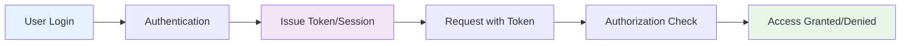
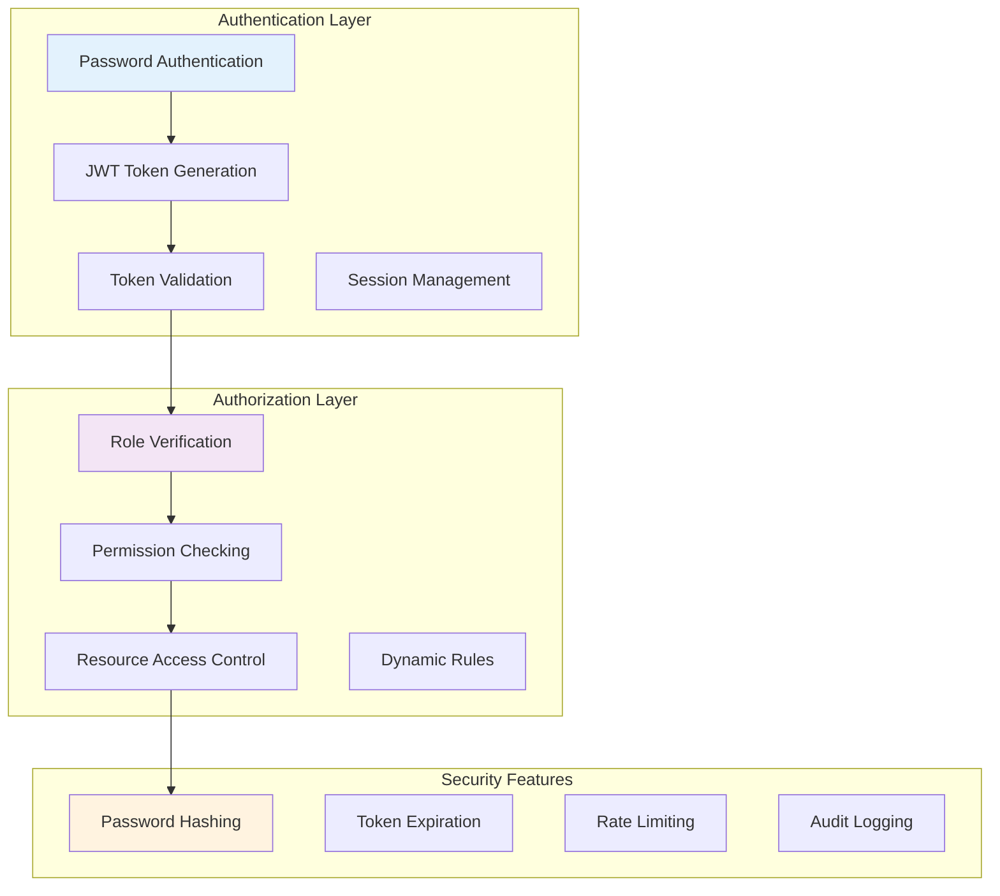
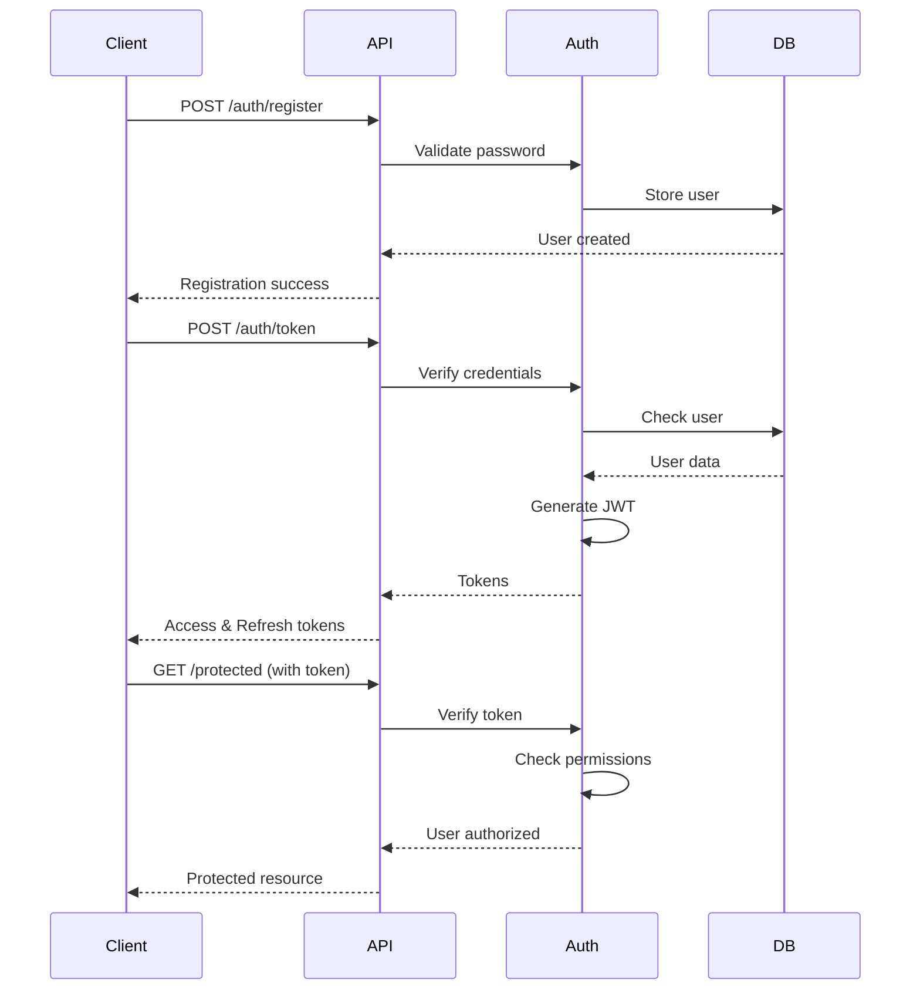

# 🔐 Authentication and Authorization with FastAPI

*Implementing secure access control patterns for production-ready APIs*

## 🎯 Real-World Analogy

Think of authentication and authorization like a modern office building security system:

- **Authentication** (Who are you?): Like showing your ID at the front desk
- **Authorization** (What can you do?): Like your keycard only working on certain floors
- **Session Management**: Like your visitor badge expiring after a few hours
- **Role-Based Access**: Like executives having access to all floors, while employees can only access their department

This guide shows you how to implement enterprise-grade security for your FastAPI applications!

## 📊 What You'll Learn



### 🔑 **Authentication Methods**
**Real-world parallel:** Different ways to prove your identity at building security
- JWT tokens for stateless authentication
- Session-based authentication with cookies
- API keys for service-to-service communication
- OAuth2 integration for third-party authentication

### 🛡️ **Authorization Patterns**
**Real-world parallel:** Different access levels and permissions within the building
- Role-Based Access Control (RBAC)
- Permission-based authorization
- Resource-level permissions
- Dynamic authorization based on context

### 🔒 **Security Best Practices**
**Real-world parallel:** Security protocols and procedures
- Password hashing and security
- Token management and expiration
- Security headers and CORS
- Rate limiting and brute force protection

## 🏗️ Building a Complete Authentication System

### 🎯 System Architecture Overview



### 🔐 Step 1: Authentication Foundation

#### Setting Up Dependencies

```python
from fastapi import FastAPI, Depends, HTTPException, status, Security
from fastapi.security import (
    HTTPBearer,
    HTTPAuthorizationCredentials,
    APIKeyHeader,
    OAuth2PasswordBearer,
    OAuth2PasswordRequestForm
)
from pydantic import BaseModel, EmailStr
from passlib.context import CryptContext
from jose import JWTError, jwt
from datetime import datetime, timedelta
from typing import Optional, List, Dict, Any
import secrets
import os

# Security Configuration
SECRET_KEY = os.getenv("SECRET_KEY", "your-secret-key-change-in-production")
ALGORITHM = "HS256"
ACCESS_TOKEN_EXPIRE_MINUTES = 30
REFRESH_TOKEN_EXPIRE_DAYS = 7

# Security schemes
bearer_scheme = HTTPBearer()
api_key_scheme = APIKeyHeader(name="X-API-Key")
oauth2_scheme = OAuth2PasswordBearer(tokenUrl="auth/token")

# Password hashing
pwd_context = CryptContext(schemes=["bcrypt"], deprecated="auto")
```

#### User and Token Models

```python
class User(BaseModel):
    id: int
    username: str
    email: EmailStr
    full_name: Optional[str] = None
    roles: List[str] = []
    permissions: List[str] = []
    is_active: bool = True
    is_verified: bool = False

class UserCreate(BaseModel):
    username: str
    email: EmailStr
    password: str
    full_name: Optional[str] = None

class UserLogin(BaseModel):
    username: str
    password: str

class Token(BaseModel):
    access_token: str
    refresh_token: str
    token_type: str = "bearer"
    expires_in: int

class TokenData(BaseModel):
    user_id: Optional[int] = None
    username: Optional[str] = None
    roles: List[str] = []
    permissions: List[str] = []
```

### 🔒 Step 2: Password Security

#### Secure Password Handling

```python
def verify_password(plain_password: str, hashed_password: str) -> bool:
    """Verify password against bcrypt hash"""
    return pwd_context.verify(plain_password, hashed_password)

def get_password_hash(password: str) -> str:
    """Generate bcrypt hash with salt"""
    return pwd_context.hash(password)

def validate_password_strength(password: str) -> bool:
    """
    Validate password meets security requirements
    - At least 8 characters
    - Contains uppercase and lowercase
    - Contains numbers
    - Contains special characters
    """
    import re
    
    if len(password) < 8:
        raise HTTPException(
            status_code=400,
            detail="Password must be at least 8 characters long"
        )
    
    if not re.search(r"[A-Z]", password):
        raise HTTPException(
            status_code=400,
            detail="Password must contain at least one uppercase letter"
        )
    
    if not re.search(r"[a-z]", password):
        raise HTTPException(
            status_code=400,
            detail="Password must contain at least one lowercase letter"
        )
    
    if not re.search(r"\d", password):
        raise HTTPException(
            status_code=400,
            detail="Password must contain at least one number"
        )
    
    if not re.search(r"[!@#$%^&*(),.?\":{}|<>]", password):
        raise HTTPException(
            status_code=400,
            detail="Password must contain at least one special character"
        )
    
    return True
```

### 🎫 Step 3: JWT Token Management

#### Token Creation and Validation

```python
def create_access_token(data: dict, expires_delta: Optional[timedelta] = None):
    """Create JWT access token"""
    to_encode = data.copy()
    if expires_delta:
        expire = datetime.utcnow() + expires_delta
    else:
        expire = datetime.utcnow() + timedelta(minutes=15)
    
    to_encode.update({"exp": expire, "type": "access"})
    encoded_jwt = jwt.encode(to_encode, SECRET_KEY, algorithm=ALGORITHM)
    return encoded_jwt

def create_refresh_token(data: dict):
    """Create JWT refresh token"""
    to_encode = data.copy()
    expire = datetime.utcnow() + timedelta(days=REFRESH_TOKEN_EXPIRE_DAYS)
    to_encode.update({"exp": expire, "type": "refresh"})
    encoded_jwt = jwt.encode(to_encode, SECRET_KEY, algorithm=ALGORITHM)
    return encoded_jwt

def verify_token(token: str, token_type: str = "access") -> TokenData:
    """Verify and decode JWT token"""
    try:
        payload = jwt.decode(token, SECRET_KEY, algorithms=[ALGORITHM])
        
        # Verify token type
        if payload.get("type") != token_type:
            raise HTTPException(
                status_code=status.HTTP_401_UNAUTHORIZED,
                detail="Invalid token type"
            )
        
        user_id: int = payload.get("user_id")
        username: str = payload.get("sub")
        roles: List[str] = payload.get("roles", [])
        permissions: List[str] = payload.get("permissions", [])
        
        if username is None or user_id is None:
            raise HTTPException(
                status_code=status.HTTP_401_UNAUTHORIZED,
                detail="Invalid token payload"
            )
        
        return TokenData(
            user_id=user_id,
            username=username,
            roles=roles,
            permissions=permissions
        )
    except JWTError:
        raise HTTPException(
            status_code=status.HTTP_401_UNAUTHORIZED,
            detail="Could not validate credentials",
            headers={"WWW-Authenticate": "Bearer"},
        )
```

### 👤 Step 4: User Authentication

#### Authentication Dependencies

```python
# Mock database (replace with real database)
fake_users_db = {
    "admin": {
        "id": 1,
        "username": "admin",
        "email": "admin@example.com",
        "full_name": "Administrator",
        "hashed_password": pwd_context.hash("admin123!"),
        "roles": ["admin", "user"],
        "permissions": ["read", "write", "delete", "manage_users"],
        "is_active": True,
        "is_verified": True
    },
    "user": {
        "id": 2,
        "username": "user",
        "email": "user@example.com",
        "full_name": "Regular User",
        "hashed_password": pwd_context.hash("user123!"),
        "roles": ["user"],
        "permissions": ["read", "write"],
        "is_active": True,
        "is_verified": True
    }
}

def authenticate_user(username: str, password: str) -> Optional[User]:
    """Authenticate user with username and password"""
    user_data = fake_users_db.get(username)
    if not user_data:
        return None
    if not verify_password(password, user_data["hashed_password"]):
        return None
    return User(**user_data)

async def get_current_user(token: str = Depends(oauth2_scheme)) -> User:
    """Get current authenticated user from JWT token"""
    token_data = verify_token(token)
    user_data = fake_users_db.get(token_data.username)
    
    if user_data is None:
        raise HTTPException(
            status_code=status.HTTP_401_UNAUTHORIZED,
            detail="User not found"
        )
    
    if not user_data["is_active"]:
        raise HTTPException(
            status_code=status.HTTP_401_UNAUTHORIZED,
            detail="Inactive user"
        )
    
    return User(**user_data)

async def get_current_active_user(current_user: User = Depends(get_current_user)) -> User:
    """Ensure user is active and verified"""
    if not current_user.is_active:
        raise HTTPException(
            status_code=status.HTTP_400_BAD_REQUEST,
            detail="Inactive user"
        )
    return current_user
```

### 🛡️ Step 5: Authorization Patterns

#### Role-Based Access Control (RBAC)

```python
def require_roles(*required_roles: str):
    """Dependency to check if user has required roles"""
    def role_checker(current_user: User = Depends(get_current_active_user)) -> User:
        if not any(role in current_user.roles for role in required_roles):
            raise HTTPException(
                status_code=status.HTTP_403_FORBIDDEN,
                detail=f"Insufficient permissions. Required roles: {', '.join(required_roles)}"
            )
        return current_user
    return role_checker

def require_permissions(*required_permissions: str):
    """Dependency to check if user has required permissions"""
    def permission_checker(current_user: User = Depends(get_current_active_user)) -> User:
        missing_perms = [p for p in required_permissions if p not in current_user.permissions]
        if missing_perms:
            raise HTTPException(
                status_code=status.HTTP_403_FORBIDDEN,
                detail=f"Missing required permissions: {', '.join(missing_perms)}"
            )
        return current_user
    return permission_checker

def require_admin(current_user: User = Depends(get_current_active_user)) -> User:
    """Shortcut dependency for admin-only access"""
    if "admin" not in current_user.roles:
        raise HTTPException(
            status_code=status.HTTP_403_FORBIDDEN,
            detail="Admin access required"
        )
    return current_user
```

#### Resource-Level Authorization

```python
def can_access_resource(user: User, resource_id: int, action: str) -> bool:
    """Check if user can perform action on specific resource"""
    # Example logic - adapt to your needs
    if "admin" in user.roles:
        return True  # Admins can do anything
    
    if action == "read" and "read" in user.permissions:
        return True
    
    if action in ["create", "update", "delete"] and "write" in user.permissions:
        # Additional checks for resource ownership could go here
        return True
    
    return False

def require_resource_access(resource_id: int, action: str):
    """Dependency for resource-level authorization"""
    def resource_checker(current_user: User = Depends(get_current_active_user)) -> User:
        if not can_access_resource(current_user, resource_id, action):
            raise HTTPException(
                status_code=status.HTTP_403_FORBIDDEN,
                detail=f"Cannot {action} resource {resource_id}"
            )
        return current_user
    return resource_checker
```

### 🚀 Step 6: Authentication Endpoints

#### FastAPI Application Setup

```python
app = FastAPI(
    title="Secure Authentication API",
    description="Production-ready authentication and authorization",
    version="1.0.0"
)

# Rate limiting storage (use Redis in production)
login_attempts = {}

@app.post("/auth/register", response_model=dict)
async def register_user(user_data: UserCreate):
    """Register a new user"""
    # Check if user already exists
    if user_data.username in fake_users_db:
        raise HTTPException(
            status_code=status.HTTP_400_BAD_REQUEST,
            detail="Username already registered"
        )
    
    # Validate password strength
    validate_password_strength(user_data.password)
    
    # Create new user
    hashed_password = get_password_hash(user_data.password)
    new_user = {
        "id": len(fake_users_db) + 1,
        "username": user_data.username,
        "email": user_data.email,
        "full_name": user_data.full_name,
        "hashed_password": hashed_password,
        "roles": ["user"],  # Default role
        "permissions": ["read"],  # Default permissions
        "is_active": True,
        "is_verified": False  # Require email verification
    }
    
    fake_users_db[user_data.username] = new_user
    
    return {
        "message": "User registered successfully",
        "username": user_data.username,
        "email": user_data.email
    }

@app.post("/auth/token", response_model=Token)
async def login_for_access_token(form_data: OAuth2PasswordRequestForm = Depends()):
    """Authenticate user and return access token"""
    # Rate limiting check
    client_ip = "127.0.0.1"  # In production, get real IP
    current_time = datetime.utcnow()
    
    if client_ip in login_attempts:
        attempts = login_attempts[client_ip]
        # Remove old attempts (older than 15 minutes)
        attempts = [attempt for attempt in attempts if current_time - attempt < timedelta(minutes=15)]
        
        if len(attempts) >= 5:  # Max 5 attempts per 15 minutes
            raise HTTPException(
                status_code=status.HTTP_429_TOO_MANY_REQUESTS,
                detail="Too many login attempts. Try again later."
            )
        
        login_attempts[client_ip] = attempts
    else:
        login_attempts[client_ip] = []
    
    # Authenticate user
    user = authenticate_user(form_data.username, form_data.password)
    if not user:
        # Record failed attempt
        login_attempts[client_ip].append(current_time)
        
        raise HTTPException(
            status_code=status.HTTP_401_UNAUTHORIZED,
            detail="Incorrect username or password",
            headers={"WWW-Authenticate": "Bearer"},
        )
    
    # Clear failed attempts on successful login
    if client_ip in login_attempts:
        del login_attempts[client_ip]
    
    # Create tokens
    access_token_expires = timedelta(minutes=ACCESS_TOKEN_EXPIRE_MINUTES)
    access_token = create_access_token(
        data={
            "sub": user.username,
            "user_id": user.id,
            "roles": user.roles,
            "permissions": user.permissions
        },
        expires_delta=access_token_expires
    )
    
    refresh_token = create_refresh_token(
        data={"sub": user.username, "user_id": user.id}
    )
    
    return Token(
        access_token=access_token,
        refresh_token=refresh_token,
        token_type="bearer",
        expires_in=ACCESS_TOKEN_EXPIRE_MINUTES * 60
    )

@app.post("/auth/refresh", response_model=dict)
async def refresh_access_token(refresh_token: str):
    """Refresh access token using refresh token"""
    token_data = verify_token(refresh_token, "refresh")
    
    user_data = fake_users_db.get(token_data.username)
    if not user_data or not user_data["is_active"]:
        raise HTTPException(
            status_code=status.HTTP_401_UNAUTHORIZED,
            detail="Invalid refresh token"
        )
    
    # Create new access token
    access_token_expires = timedelta(minutes=ACCESS_TOKEN_EXPIRE_MINUTES)
    access_token = create_access_token(
        data={
            "sub": user_data["username"],
            "user_id": user_data["id"],
            "roles": user_data["roles"],
            "permissions": user_data["permissions"]
        },
        expires_delta=access_token_expires
    )
    
    return {
        "access_token": access_token,
        "token_type": "bearer",
        "expires_in": ACCESS_TOKEN_EXPIRE_MINUTES * 60
    }
```

### 🔐 Step 7: Protected Endpoints

#### Different Authorization Levels

```python
@app.get("/auth/me", response_model=User)
async def get_current_user_info(current_user: User = Depends(get_current_active_user)):
    """Get current user information"""
    return current_user

@app.get("/users", response_model=List[dict])
async def get_users(current_user: User = Depends(require_permissions("read"))):
    """Get list of users - requires read permission"""
    return [
        {
            "id": user["id"],
            "username": user["username"],
            "email": user["email"],
            "full_name": user["full_name"],
            "roles": user["roles"],
            "is_active": user["is_active"]
        }
        for user in fake_users_db.values()
    ]

@app.post("/admin/users/{user_id}/roles")
async def assign_user_role(
    user_id: int,
    roles: List[str],
    current_user: User = Depends(require_admin)
):
    """Assign roles to user - admin only"""
    # Find user by ID
    target_user = None
    for user_data in fake_users_db.values():
        if user_data["id"] == user_id:
            target_user = user_data
            break
    
    if not target_user:
        raise HTTPException(
            status_code=status.HTTP_404_NOT_FOUND,
            detail="User not found"
        )
    
    # Update roles
    target_user["roles"] = roles
    
    return {
        "message": f"Roles updated for user {user_id}",
        "new_roles": roles
    }

@app.delete("/admin/users/{user_id}")
async def delete_user(
    user_id: int,
    current_user: User = Depends(require_roles("admin"))
):
    """Delete user - admin only"""
    # Prevent self-deletion
    if current_user.id == user_id:
        raise HTTPException(
            status_code=status.HTTP_400_BAD_REQUEST,
            detail="Cannot delete your own account"
        )
    
    # Find and remove user
    username_to_delete = None
    for username, user_data in fake_users_db.items():
        if user_data["id"] == user_id:
            username_to_delete = username
            break
    
    if not username_to_delete:
        raise HTTPException(
            status_code=status.HTTP_404_NOT_FOUND,
            detail="User not found"
        )
    
    del fake_users_db[username_to_delete]
    
    return {"message": f"User {user_id} deleted successfully"}
```

### 🛡️ Step 8: Security Middleware

#### Security Headers and CORS

```python
from fastapi.middleware.cors import CORSMiddleware
from fastapi.middleware.base import BaseHTTPMiddleware

class SecurityHeadersMiddleware(BaseHTTPMiddleware):
    """Add security headers to all responses"""
    
    async def dispatch(self, request, call_next):
        response = await call_next(request)
        
        # Security headers
        response.headers["X-Content-Type-Options"] = "nosniff"
        response.headers["X-Frame-Options"] = "DENY"
        response.headers["X-XSS-Protection"] = "1; mode=block"
        response.headers["Strict-Transport-Security"] = "max-age=31536000; includeSubDomains"
        response.headers["Referrer-Policy"] = "strict-origin-when-cross-origin"
        
        return response

# Add middleware
app.add_middleware(SecurityHeadersMiddleware)

app.add_middleware(
    CORSMiddleware,
    allow_origins=["https://yourdomain.com"],  # Specify allowed origins
    allow_credentials=True,
    allow_methods=["GET", "POST", "PUT", "DELETE"],
    allow_headers=["*"],
)
```

## 🎯 Authentication Flow Summary

### Complete Authentication Process



### 📊 Security Features Implemented

| Feature | Purpose | Implementation |
|---------|---------|----------------|
| **Password Hashing** | Secure password storage | bcrypt with salt |
| **JWT Tokens** | Stateless authentication | HS256 algorithm |
| **Refresh Tokens** | Long-term sessions | Separate token type |
| **Role-Based Access** | Hierarchical permissions | Role checking dependencies |
| **Permission System** | Granular access control | Permission-based authorization |
| **Rate Limiting** | Brute force protection | Login attempt tracking |
| **Security Headers** | Web security | XSS, CSRF protection |
| **Password Validation** | Strong passwords | Pattern matching |

### 🚀 Production Considerations

#### ✅ Security Checklist
- [ ] Use environment variables for secrets
- [ ] Implement proper session management
- [ ] Add two-factor authentication
- [ ] Use HTTPS in production
- [ ] Implement proper logging and monitoring
- [ ] Add password reset functionality
- [ ] Implement account lockout policies
- [ ] Add email verification

#### ✅ Performance Optimizations
- [ ] Use Redis for session storage
- [ ] Implement token blacklisting
- [ ] Add database connection pooling
- [ ] Use caching for role/permission lookups
- [ ] Implement proper database indexing

### 🔍 Testing Your Authentication

```bash
# Register a new user
curl -X POST "http://localhost:8000/auth/register" \
  -H "Content-Type: application/json" \
  -d '{
    "username": "testuser",
    "email": "test@example.com",
    "password": "Test123!",
    "full_name": "Test User"
  }'

# Login to get tokens
curl -X POST "http://localhost:8000/auth/token" \
  -H "Content-Type: application/x-www-form-urlencoded" \
  -d "username=testuser&password=Test123!"

# Access protected endpoint
curl -X GET "http://localhost:8000/auth/me" \
  -H "Authorization: Bearer <your-access-token>"

# Admin endpoint
curl -X GET "http://localhost:8000/users" \
  -H "Authorization: Bearer <admin-token>"
```

---

> 🎉 **Congratulations!** You've implemented a comprehensive authentication and authorization system with FastAPI. This system includes secure password handling, JWT tokens, role-based access control, and production-ready security features.

**Next**: Explore [Security Considerations](/docs/03_intermediate/05-security-considerations) to further harden your API security! 🛡️