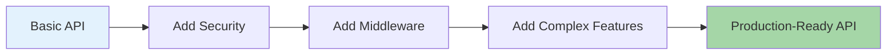
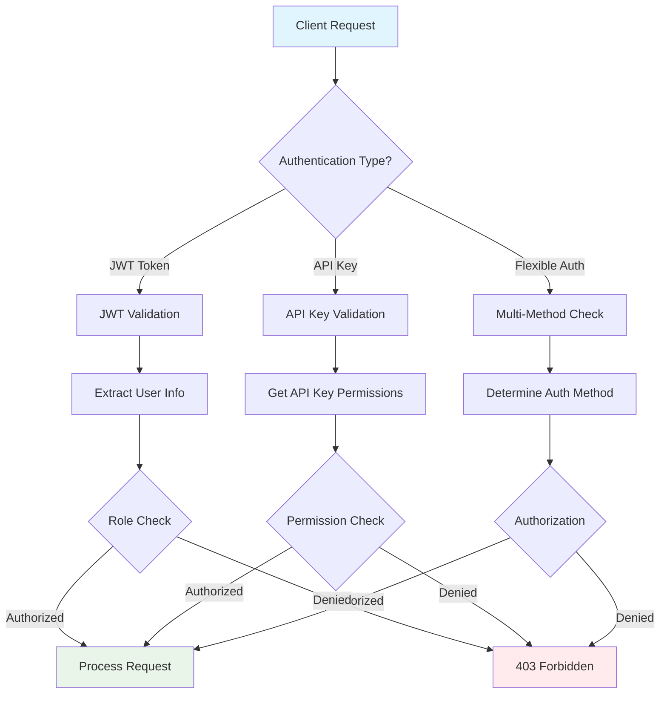
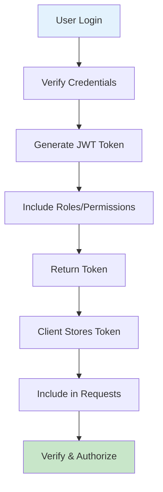
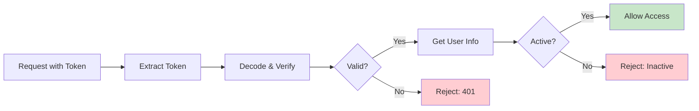
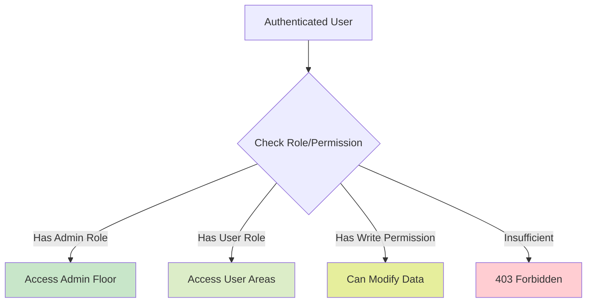
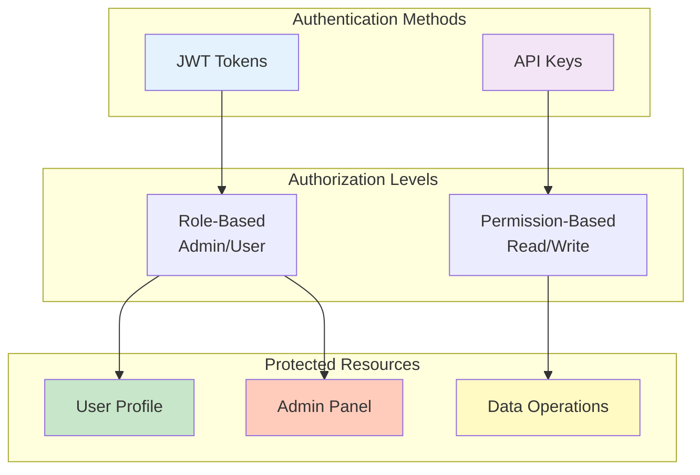
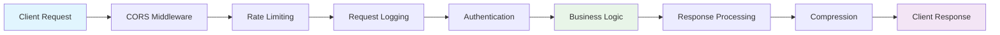
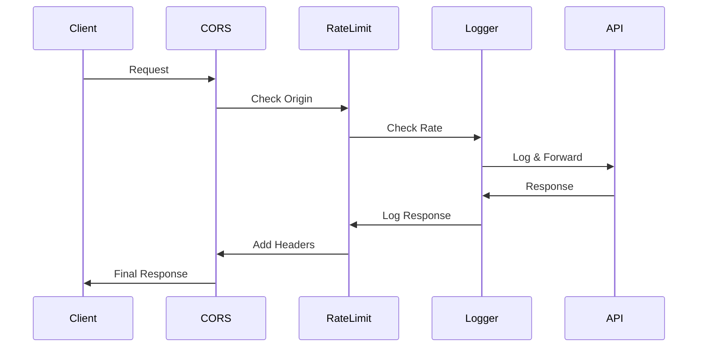
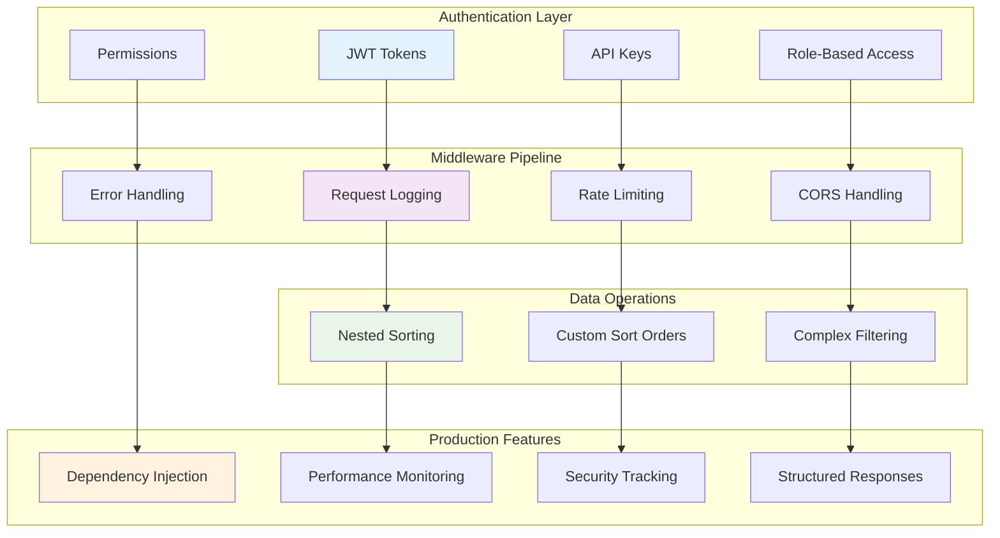

# 🛠️ Real-World Implementation Examples

*Building production-ready APIs with practical patterns and best practices*

## 🎯 Real-World Analogy

Think of building a FastAPI application like constructing a modern office building:
- **Foundation** (Basic API): Simple doors and rooms
- **Security System** (Authentication): Keycard access and visitor management
- **Building Management** (Middleware): HVAC, lighting, and monitoring systems
- **Advanced Features** (Complex Operations): Smart elevators, conference room booking, and integrated services

This guide shows you how to add these "building systems" to your API, making it robust and production-ready!

## 📊 What You'll Learn



We'll build three essential systems step by step:

### 🔐 **Authentication & Authorization System**
**Real-world parallel:** Like a building's security system with keycards, visitor badges, and access levels
- JWT tokens for web applications
- API keys for service-to-service communication
- Role-based permissions (who can access which floors)
- Flexible authentication methods

### 🛠️ **Request Processing Pipeline**
**Real-world parallel:** Like a building's management systems that monitor and control everything
- Request logging (security cameras)
- Rate limiting (elevator capacity)
- CORS handling (visitor access rules)
- Performance monitoring (building analytics)

### 📊 **Smart Data Operations**
**Real-world parallel:** Like a smart filing system that can sort by custom rules
- Nested field sorting (organizing by department → team → person)
- Custom business sorting (VIP customers first)
- Complex filtering patterns
- Efficient data retrieval

## 🏗️ Building a Complete Authentication System

### 🎯 Analogy: The Modern Office Building Security

Imagine you're designing security for a modern office building:

1. **Simple Key** (Basic Auth): Works but easy to copy
2. **Keycard** (JWT Token): Expires, trackable, can be revoked
3. **Visitor Badge** (API Key): Temporary access with limited permissions
4. **Access Levels** (Roles): Different people can access different floors
5. **Security Desk** (Auth Middleware): Checks everyone entering the building

### Why Multiple Authentication Methods?

- **Web Apps** need JWT tokens (like employee keycards)
- **Mobile Apps** might use refresh tokens (like temporary passes)
- **Third-party Services** need API keys (like contractor badges)
- **Internal Services** might use service accounts (like maintenance access)



### 🔑 Step-by-Step Authentication Implementation

#### What We're Building
A flexible authentication system that:
- ✅ Supports multiple authentication methods
- ✅ Implements role-based access control
- ✅ Handles token expiration and refresh
- ✅ Provides granular permissions
- ✅ Tracks API key usage

#### Prerequisites
- Understanding of HTTP headers
- Basic knowledge of JSON Web Tokens (JWT)
- Familiarity with password hashing

#### Implementation Overview



### Step 1: Setting Up Security Foundations

**Real-world parallel:** Like installing the security infrastructure in our building - cameras, card readers, and the main security desk.

**What we're doing:** Importing necessary tools and setting up basic security configurations.

**Why this matters:** These are the building blocks for our entire authentication system.

```python
# Think of these imports as ordering security equipment for our building
from fastapi import FastAPI, Depends, HTTPException, status, Security
from fastapi.security import (
    HTTPBearer,  # For JWT tokens (like keycard readers)
    HTTPAuthorizationCredentials,  # The actual keycard data
    APIKeyHeader,  # For API keys (like visitor badge scanner)
    OAuth2PasswordBearer  # Standard OAuth2 flow (like employee login system)
)
from pydantic import BaseModel  # For data validation (like ID verification)
from typing import Optional, List, Dict, Any  # Type hints for better code clarity
import jwt  # The library that creates our "keycards" (tokens)
from datetime import datetime, timedelta  # For token expiration (keycards expire!)
from passlib.context import CryptContext  # For password encryption (like a safe)
import secrets  # For generating secure random strings
import os  # For environment variables (never hardcode secrets!)

# 🔒 Security Configuration Center
# In production, ALWAYS use environment variables for sensitive data
SECRET_KEY = os.getenv("SECRET_KEY", "your-development-key-change-in-production")
ALGORITHM = "HS256"  # The method we use to sign tokens (like the keycard encoding)
ACCESS_TOKEN_EXPIRE_MINUTES = 30  # How long before a keycard expires

# 🛡️ Setting Up Our Security Checkpoints
# Each of these is like a different entrance to our building
bearer_scheme = HTTPBearer()  # Main entrance with keycard reader
api_key_scheme = APIKeyHeader(name="X-API-Key")  # Service entrance with badge scanner
oauth2_scheme = OAuth2PasswordBearer(tokenUrl="auth/token")  # Employee login kiosk

# 🔐 Password Encryption Setup
# This is like our safe where we store employee credentials
# bcrypt adds "salt" to passwords - like adding a unique serial number to each key
pwd_context = CryptContext(
    schemes=["bcrypt"],  # The encryption algorithm (our safe's locking mechanism)
    deprecated="auto"  # Automatically handle algorithm updates
)

# 📋 Data models for authentication system
class User(BaseModel):
    """User model with role-based access control"""
    id: int
    username: str
    email: str
    roles: List[str]  # e.g., ["admin", "user", "moderator"]
    is_active: bool

class TokenData(BaseModel):
    """JWT token payload structure"""
    user_id: int
    username: str
    roles: List[str]  # Embedded roles for efficient authorization
    exp: datetime  # Token expiration timestamp

class APIKey(BaseModel):
    """API key model with fine-grained permissions"""
    key_id: str  # Unique identifier for the API key
    name: str  # Human-readable name for management
    user_id: int  # Associated user
    permissions: List[str]  # Specific permissions (read, write, admin, etc.)
    created_at: datetime
    last_used: Optional[datetime] = None  # Track usage for security monitoring

# 🗄️ Mock databases (In production: use PostgreSQL, MongoDB, etc.)
fake_users_db = {
    "admin": {
        "id": 1,
        "username": "admin",
        "email": "admin@example.com",
        "hashed_password": pwd_context.hash("adminpass"),  # Securely hashed password
        "roles": ["admin", "user"],  # Multiple roles for hierarchical permissions
        "is_active": True
    },
    "user": {
        "id": 2,
        "username": "user",
        "email": "user@example.com",
        "hashed_password": pwd_context.hash("userpass"),
        "roles": ["user"],  # Basic user role
        "is_active": True
    }
}

fake_api_keys_db = {
    "ak_test123": {
        "key_id": "ak_test123",
        "name": "Test API Key",  # Descriptive name for management
        "user_id": 1,  # Links API key to specific user
        "permissions": ["read", "write"],  # Granular permissions
        "created_at": datetime.utcnow(),
        "last_used": None  # Security tracking
    }
}

# 🔧 Core authentication functions
def verify_password(plain_password: str, hashed_password: str) -> bool:
    """Verify password against bcrypt hash - constant-time comparison"""
    return pwd_context.verify(plain_password, hashed_password)

def get_password_hash(password: str) -> str:
    """Generate bcrypt hash with random salt for secure storage"""
    return pwd_context.hash(password)

def create_access_token(data: dict, expires_delta: Optional[timedelta] = None):
    """
    Create JWT access token with embedded user data
    
    🔑 Security Notes:
    - Uses HS256 algorithm for signing
    - Includes expiration timestamp to prevent replay attacks
    - Embeds user roles for efficient authorization
    """
    to_encode = data.copy()
    if expires_delta:
        expire = datetime.utcnow() + expires_delta
    else:
        expire = datetime.utcnow() + timedelta(minutes=15)  # Default short expiration
    
    to_encode.update({"exp": expire})
    encoded_jwt = jwt.encode(to_encode, SECRET_KEY, algorithm=ALGORITHM)
    return encoded_jwt

def decode_token(token: str) -> TokenData:
    try:
        payload = jwt.decode(token, SECRET_KEY, algorithms=[ALGORITHM])
        user_id: int = payload.get("user_id")
        username: str = payload.get("sub")
        roles: List[str] = payload.get("roles", [])
        exp: datetime = datetime.fromtimestamp(payload.get("exp"))
        
        if username is None or user_id is None:
            raise HTTPException(
                status_code=status.HTTP_401_UNAUTHORIZED,
                detail="Invalid authentication credentials",
                headers={"WWW-Authenticate": "Bearer"},
            )
        
        return TokenData(user_id=user_id, username=username, roles=roles, exp=exp)
    except jwt.PyJWTError:
        raise HTTPException(
            status_code=status.HTTP_401_UNAUTHORIZED,
            detail="Invalid authentication credentials",
            headers={"WWW-Authenticate": "Bearer"},
        )

### Step 5: Authentication Dependencies

**Real-world parallel:** The security guards who check keycards and badges at different checkpoints.

**Visual Flow:**


```python
# 🔍 Authentication Dependencies - Our Security Guards

async def get_current_user_jwt(credentials: HTTPAuthorizationCredentials = Security(bearer_scheme)) -> User:
    """
    Authenticate user via JWT token - Main entrance security check
    
    Process (like checking an employee keycard):
    1. Extract the token from the Authorization header
    2. Decode and verify the token
    3. Look up the user in our database
    4. Check if their access is still active
    5. Return the authenticated user
    """
    # Decode the keycard (token) to get user information
    token_data = decode_token(credentials.credentials)
    
    # Look up the employee in our directory
    user = fake_users_db.get(token_data.username)
    if user is None:
        # Unknown employee - keycard doesn't match any record
        raise HTTPException(
            status_code=status.HTTP_401_UNAUTHORIZED,
            detail="User not found"
        )
    
    # Check if the employee's access is still active
    if not user["is_active"]:
        # Employee suspended or terminated - keycard deactivated
        raise HTTPException(
            status_code=status.HTTP_401_UNAUTHORIZED,
            detail="Inactive user"
        )
    
    # Valid employee - grant access
    return User(**user)

async def get_current_user_api_key(api_key: str = Security(api_key_scheme)) -> User:
    """
    Authenticate user via API key - Service entrance security check
    
    Process (like checking a contractor badge):
    1. Extract API key from X-API-Key header
    2. Look up the key in our registry
    3. Update usage tracking (security audit)
    4. Find the associated user account
    5. Verify the account is active
    """
    # Look up the service badge in our registry
    key_data = fake_api_keys_db.get(api_key)
    if not key_data:
        # Unknown badge - not in our system
        raise HTTPException(
            status_code=status.HTTP_401_UNAUTHORIZED,
            detail="Invalid API key"
        )
    
    # Track when this badge was last used (security audit trail)
    key_data["last_used"] = datetime.utcnow()
    
    # Find which employee/account owns this service key
    user = None
    for username, user_data in fake_users_db.items():
        if user_data["id"] == key_data["user_id"]:
            user = user_data
            break
    
    # Verify the owner's account is still active
    if not user or not user["is_active"]:
        # Either the badge owner doesn't exist or their access was revoked
        raise HTTPException(
            status_code=status.HTTP_401_UNAUTHORIZED,
            detail="Invalid API key or inactive user"
        )
    
    # Valid service badge - grant access
    return User(**user)

### Step 6: Flexible Authentication

**Real-world parallel:** Like having multiple entrances to a building - employees use the main door (JWT), while delivery services use the loading dock (API key).

```python
# 🔄 Flexible Authentication - Multiple Ways to Enter the Building
async def get_current_user_flexible(
    jwt_credentials: Optional[HTTPAuthorizationCredentials] = Security(bearer_scheme, auto_error=False),
    api_key: Optional[str] = Security(api_key_scheme, auto_error=False)
) -> User:
    """
    Accept either JWT token or API key authentication
    
    This is like having a smart security system that can:
    1. Read employee keycards (JWT)
    2. Scan contractor badges (API keys)
    3. Reject anyone without proper credentials
    
    Use cases:
    - Web apps send JWT tokens after login
    - Automated services use API keys
    - Mobile apps might use either
    """
    
    # Check if they're using the main entrance (JWT token)
    if jwt_credentials:
        return await get_current_user_jwt(jwt_credentials)
    
    # Check if they're using the service entrance (API key)
    elif api_key:
        return await get_current_user_api_key(api_key)
    
    # No valid credentials provided - turn them away
    else:
        raise HTTPException(
            status_code=status.HTTP_401_UNAUTHORIZED,
            detail="Authentication required. Provide JWT token or API key",
            headers={"WWW-Authenticate": "Bearer"}  # Hint about authentication method
        )

### Step 7: Authorization - Access Control

**Real-world parallel:** After entering the building, you still need the right access level for specific floors or rooms.

**Visual Concept:**


```python
# 🎯 Authorization Dependencies - Floor Access Control

def require_roles(*required_roles: str):
    """
    Role-based authorization - Like requiring executive keycard for top floors
    
    How it works:
    1. Creates a reusable dependency function
    2. Checks if user has ANY of the required roles
    3. Allows access if yes, denies if no
    
    Example usage:
    @app.get("/admin", dependencies=[Depends(require_roles("admin"))])
    """
    def role_checker(current_user: User = Depends(get_current_user_flexible)) -> User:
        # Check if the user has at least one required role
        # Like checking if their keycard has access to any of the restricted floors
        if not any(role in current_user.roles for role in required_roles):
            # Access denied - they don't have the right clearance
            raise HTTPException(
                status_code=status.HTTP_403_FORBIDDEN,  # 403 = Authenticated but not authorized
                detail=f"Insufficient permissions. Required roles: {', '.join(required_roles)}"
            )
        # Access granted
        return current_user
    return role_checker

def require_permissions(*required_permissions: str):
    """
    Permission-based authorization - Like requiring specific room access
    
    More granular than roles:
    - Role = Department (Admin, User)
    - Permission = Specific action (read, write, delete)
    
    API keys often use permissions instead of roles for fine-grained control
    """
    def permission_checker(
        current_user: User = Depends(get_current_user_flexible),
        api_key: Optional[str] = Security(api_key_scheme, auto_error=False)
    ) -> User:
        # Special handling for API key permissions
        # API keys have their own permission list
        if api_key:
            key_data = fake_api_keys_db.get(api_key)
            if key_data:
                # Check if the API key has ALL required permissions
                missing_perms = [p for p in required_permissions if p not in key_data["permissions"]]
                if missing_perms:
                    # This service key doesn't have enough permissions
                    raise HTTPException(
                        status_code=status.HTTP_403_FORBIDDEN,
                        detail=f"API key lacks required permissions: {', '.join(missing_perms)}"
                    )
        
        # For JWT users, you might check permissions differently
        # For example, mapping roles to permissions:
        # admin role = all permissions
        # user role = read permission only
        # This is simplified - in production, use a proper permission system
        
        return current_user
    return permission_checker

### Step 8: Authentication Endpoints

**Real-world parallel:** The actual login desk and badge creation office in our building.

#### Login Endpoint - Getting Your Keycard

```python
# 🚀 Create the FastAPI app
app = FastAPI(
    title="Secure Building API",
    description="A comprehensive authentication system example",
    version="1.0.0"
)

# 🔓 Login Endpoint - The Reception Desk
@app.post("/auth/token")
async def login_for_access_token(username: str, password: str):
    """
    User login endpoint - Exchange credentials for access token
    
    Process (like getting your keycard at reception):
    1. Verify identity (username/password)
    2. Create a temporary access card (JWT token)
    3. Set expiration time (cards expire for security)
    4. Return the card and user info
    
    Request:
        username: Your employee ID
        password: Your secret password
    
    Response:
        access_token: Your temporary keycard (JWT)
        token_type: How to use it (always "bearer")
        expires_in: Seconds until renewal needed
        user: Your profile information
    """
    # Look up the user in our employee directory
    user = fake_users_db.get(username)
    
    # Verify their identity (check password)
    if not user or not verify_password(password, user["hashed_password"]):
        # Wrong credentials - like showing fake ID at reception
        raise HTTPException(
            status_code=status.HTTP_401_UNAUTHORIZED,
            detail="Incorrect username or password",
            headers={"WWW-Authenticate": "Bearer"},  # Tell client to use Bearer auth
        )
    
    # Create their temporary keycard with expiration
    access_token_expires = timedelta(minutes=ACCESS_TOKEN_EXPIRE_MINUTES)
    access_token = create_access_token(
        data={
            "sub": user["username"],  # Standard JWT field for subject
            "user_id": user["id"],  # Our custom field
            "roles": user["roles"]  # Embed roles for quick authorization
        },
        expires_delta=access_token_expires
    )
    
    # Return the keycard and user information
    return {
        "access_token": access_token,  # The actual token to use
        "token_type": "bearer",  # How to send it (Authorization: Bearer <token>)
        "expires_in": ACCESS_TOKEN_EXPIRE_MINUTES * 60,  # Seconds until expiry
        "user": {
            "id": user["id"],
            "username": user["username"],
            "roles": user["roles"]
        }
    }

#### API Key Creation - Service Badges

```python
# 🔑 API Key Creation - The Badge Office
@app.post("/auth/api-keys")
async def create_api_key(
    name: str,
    permissions: List[str],
    current_user: User = Depends(require_roles("admin"))  # Only admins can create keys
):
    """
    Create new API key - Issue a service badge
    
    Process (like creating a contractor badge):
    1. Only building management (admins) can create badges
    2. Generate a unique, secure badge number
    3. Assign specific permissions (which doors can open)
    4. Register in our system
    5. Return the badge (only shown once!)
    
    Request:
        name: Description like "Delivery Service Key"
        permissions: List like ["read", "write"]
    
    Response:
        api_key: The actual key (save this!)
        warning: Security reminder
    """
    # Generate a secure, random API key
    # Format: ak_<random_string> (like badge number: BADGE_12345)
    key_id = f"ak_{secrets.token_urlsafe(16)}"
    
    # Create the key record
    new_key = {
        "key_id": key_id,
        "name": name,  # Human-readable description
        "user_id": current_user.id,  # Who created this key
        "permissions": permissions,  # What this key can do
        "created_at": datetime.utcnow(),  # Audit trail
        "last_used": None  # Will track usage
    }
    
    # Register the key in our system
    fake_api_keys_db[key_id] = new_key
    
    # Return the key - IMPORTANT: Only shown once!
    return {
        "api_key": key_id,
        "name": name,
        "permissions": permissions,
        "created_at": new_key["created_at"],
        "warning": "Store this API key securely. It won't be shown again."
    }

### Step 9: Protected Endpoints - Putting It All Together

**Real-world parallel:** Different areas of the building with different access requirements.

```python
# 📦 Protected Endpoints - Areas with Access Control

# 👤 Basic Protected Area - Any Authenticated User
@app.get("/users/me")
async def get_current_user_info(
    current_user: User = Depends(get_current_user_flexible)
):
    """
    Get current user information - Like checking your employee profile
    
    Access: Any authenticated user (JWT or API key)
    Returns: Your own user information
    """
    return current_user

# 👥 Admin-Only Area - Executive Floor
@app.get("/admin/users")
async def get_all_users(
    current_user: User = Depends(require_roles("admin"))
):
    """
    Get all users - Like accessing the employee directory
    
    Access: Admin role required (executives only)
    Returns: List of all users in the system
    """
    return {"users": list(fake_users_db.values())}

# 퉰f️ Permission-Based Area - Data Modification
@app.post("/data/write")
async def write_data(
    data: dict,
    current_user: User = Depends(require_permissions("write"))
):
    """
    Write data - Like having access to modify records
    
    Access: Requires 'write' permission
    Perfect for: API keys with limited permissions
    """
    return {
        "message": "Data written successfully",
        "data": data,
        "written_by": current_user.username
    }

# 📖 Read-Only Area - View Sensitive Data
@app.get("/data/read")
async def read_data(
    current_user: User = Depends(require_permissions("read"))
):
    """
    Read sensitive data - Like viewing confidential files
    
    Access: Requires 'read' permission
    Returns: Protected information
    """
    return {
        "data": "sensitive information",
        "accessed_by": current_user.username,
        "timestamp": datetime.utcnow()
    }

# 🚮 Dangerous Operations - Maximum Security
@app.delete("/admin/users/{user_id}")
async def delete_user(
    user_id: int,
    current_user: User = Depends(require_roles("admin"))
):
    """
    Delete user - Like revoking someone's building access
    
    Access: Admin only (high-risk operation)
    Audit: Tracks who performed the deletion
    """
    # In production: Add confirmation, soft delete, audit logging
    return {
        "message": f"User {user_id} deleted",
        "deleted_by": current_user.username,
        "timestamp": datetime.utcnow(),
        "warning": "This action cannot be undone"
    }
```

### 🎯 Authentication System Summary

#### What We Built



#### Key Patterns and Their Benefits

| Pattern | What It Does | Real-World Use Case | Benefits |
|---------|--------------|---------------------|----------|
| **Multi-Method Auth** | JWT + API keys | Web apps use JWT, services use API keys | Flexibility for different clients |
| **Role-Based Access** | Admin/User/etc. | Company hierarchy (CEO vs Employee) | Simple, intuitive permissions |
| **Permission Granularity** | read/write/delete | Service with limited access | Fine-grained control |
| **Flexible Dependencies** | Reusable decorators | Apply to any endpoint | Consistent security |
| **Security Tracking** | Usage monitoring | Audit who accessed what | Compliance & debugging |

#### ⚠️ Production Considerations

1. **Store Secrets Securely**
   - Use environment variables
   - Never commit secrets to Git
   - Rotate keys regularly

2. **Use Real Databases**
   - Replace dictionaries with PostgreSQL/MongoDB
   - Add connection pooling
   - Implement proper indexing

3. **Add Security Features**
   - Token refresh mechanisms
   - Password reset flows
   - Two-factor authentication
   - Rate limiting per user

4. **Implement Monitoring**
   - Log all authentication attempts
   - Alert on suspicious activity
   - Track API key usage patterns

## 🚀 Building a Request Processing Pipeline

### 🎯 Analogy: Airport Security Checkpoints

Imagine flying on an airplane. You don't just walk onto the plane - you go through multiple checkpoints:

1. **Check-in Counter** (CORS) - Verify you're allowed to fly
2. **Security Line** (Rate Limiting) - Control flow of passengers
3. **ID Check** (Authentication) - Verify who you are
4. **X-ray Scanner** (Request Logging) - Track what's happening
5. **Gate Agent** (Business Logic) - Final destination check
6. **Boarding** (Response Processing) - Prepare for departure

Middleware in FastAPI works the same way - each layer handles a specific concern!



### 🛠️ Step-by-Step Middleware Implementation

#### What We're Building
A comprehensive request processing pipeline that:
- ✅ Logs every request for debugging
- ✅ Limits request rates to prevent abuse
- ✅ Handles cross-origin requests (CORS)
- ✅ Tracks performance metrics
- ✅ Provides detailed error information

#### Visual Flow


### Step 1: Setting Up Logging Infrastructure

**Real-world parallel:** Like installing security cameras and tracking systems in our building.

```python
# Import necessary tools for our middleware pipeline
from fastapi import FastAPI, Request, Response, HTTPException
from fastapi.middleware.base import BaseHTTPMiddleware
from fastapi.responses import JSONResponse
import time
import logging
import uuid  # For generating unique IDs
from typing import Callable, List
import traceback

# 📝 Set up logging - Like our building's security camera system
logging.basicConfig(
    level=logging.INFO,
    format='%(asctime)s - %(name)s - %(levelname)s - %(message)s'
)
logger = logging.getLogger(__name__)

### Step 2: Request Logging Middleware

**Real-world parallel:** Like security cameras that record everyone entering and leaving the building.

```python
# 📊 Request Logging Middleware - Our Security Camera System
class RequestLoggingMiddleware(BaseHTTPMiddleware):
    """
    Logs all requests and responses for monitoring and debugging
    
    Like a security camera system that:
    - Records who enters (request details)
    - Tracks how long they stay (processing time)
    - Notes what they did (response status)
    - Assigns a tracking number (request ID)
    """
    
    async def dispatch(self, request: Request, call_next: Callable) -> Response:
        """
        Process each request through our logging system
        
        Steps:
        1. Assign a tracking ID (like a visitor badge number)
        2. Record entry time and details
        3. Process the request
        4. Record exit time and results
        5. Add tracking headers to response
        """
        # 🔍 Generate unique request ID - Like assigning a visitor badge number
        request_id = str(uuid.uuid4())  # e.g., "a1b2c3d4-e5f6-g7h8-i9j0-k1l2m3n4o5p6"
        request.state.request_id = request_id  # Store for later use
        
        # ⏱️ Record entry time - When did they arrive?
        start_time = time.time()
        client_ip = request.client.host if request.client else "unknown"
        
        # 📸 Log the incoming request - Security camera snapshot
        logger.info(f"Request started", extra={
            "request_id": request_id,
            "method": request.method,  # GET, POST, etc.
            "url": str(request.url),  # Where are they going?
            "client_ip": client_ip,  # Who are they?
            "user_agent": request.headers.get("user-agent"),  # What browser/tool?
            "content_length": request.headers.get("content-length")  # How much data?
        })
        
        # 🔄 Process the request - Let them into the building
        try:
            response = await call_next(request)  # Continue to next middleware/endpoint
        except Exception as e:
            # 🚨 Something went wrong - Security incident!
            logger.error(f"Unhandled exception", extra={
                "request_id": request_id,
                "exception": str(e),
                "traceback": traceback.format_exc()  # Full error details for debugging
            })
            raise  # Re-raise the exception
        
        # 📊 Calculate how long they were in the building
        process_time = time.time() - start_time
        
        # 🏷️ Add tracking information to the response
        response.headers["X-Request-ID"] = request_id  # Tracking number
        response.headers["X-Process-Time"] = f"{process_time:.4f}"  # Processing duration
        
        # 📸 Log the exit - Security camera snapshot
        logger.info(f"Request completed", extra={
            "request_id": request_id,
            "status_code": response.status_code,  # Success or error?
            "process_time": process_time,  # How long did it take?
            "response_size": response.headers.get("content-length")  # Response size
        })
        
        return response

### Step 3: Rate Limiting Middleware

**Real-world parallel:** Like controlling how many people can enter a store at once to prevent overcrowding.

```python
# 🚀 Rate Limiting Middleware - Crowd Control System
class RateLimitingMiddleware(BaseHTTPMiddleware):
    """
    Limits how many requests each client can make per minute
    
    Like a store that only allows 60 customers per hour:
    - Track who enters and when
    - Count entries per person
    - Block if they exceed the limit
    - Tell them when they can try again
    """
    
    def __init__(self, app, requests_per_minute: int = 60):
        super().__init__(app)
        self.requests_per_minute = requests_per_minute  # Max allowed requests
        self.client_requests = {}  # Track requests per IP
        # Note: In production, use Redis for distributed systems
    
    async def dispatch(self, request: Request, call_next: Callable) -> Response:
        """
        Check if this client has exceeded their request limit
        """
        # Identify the client by their IP address
        client_ip = request.client.host if request.client else "unknown"
        current_time = time.time()
        
        # 🧹 Clean up old request records (older than 1 minute)
        # Like removing old visitor logs from the guest book
        cutoff_time = current_time - 60
        self.client_requests = {
            ip: [req_time for req_time in times if req_time > cutoff_time]
            for ip, times in self.client_requests.items()
        }
        
        # 📋 Check how many requests this client has made recently
        client_requests = self.client_requests.get(client_ip, [])
        if len(client_requests) >= self.requests_per_minute:
            # 🚫 Too many requests - turn them away politely
            return JSONResponse(
                status_code=429,  # 429 = Too Many Requests
                content={
                    "error": "RATE_LIMIT_EXCEEDED",
                    "message": f"Rate limit exceeded. Maximum {self.requests_per_minute} requests per minute.",
                    "retry_after": 60  # Try again in 60 seconds
                },
                headers={"Retry-After": "60"}  # Standard HTTP header
            )
        
        # ✅ Under the limit - record this visit
        client_requests.append(current_time)
        self.client_requests[client_ip] = client_requests
        
        # Process the request normally
        response = await call_next(request)
        
        # 📋 Add helpful headers so clients know their limits
        remaining = max(0, self.requests_per_minute - len(client_requests))
        response.headers["X-RateLimit-Limit"] = str(self.requests_per_minute)  # Max allowed
        response.headers["X-RateLimit-Remaining"] = str(remaining)  # Requests left
        response.headers["X-RateLimit-Reset"] = str(int(current_time + 60))  # When it resets
        
        return response

### Step 4: CORS Middleware

**Real-world parallel:** Like a bouncer checking if visitors from other buildings are allowed to enter.

```python
# 🌐 CORS Middleware - Cross-Building Access Control
class CORSMiddleware(BaseHTTPMiddleware):
    """
    Handles Cross-Origin Resource Sharing (CORS)
    
    CORS is like building access rules:
    - Which other buildings can visit (origins)
    - What they can do (methods)
    - What they can bring (headers)
    - How long their pass is valid (max_age)
    """
    
    def __init__(
        self,
        app,
        allow_origins: List[str] = ["*"],  # Which websites can access
        allow_methods: List[str] = ["*"],  # Which HTTP methods allowed
        allow_headers: List[str] = ["*"],  # Which headers accepted
        expose_headers: List[str] = [],  # Headers client can read
        allow_credentials: bool = False,  # Can send cookies?
        max_age: int = 86400  # How long to cache this info (24 hours)
    ):
        super().__init__(app)
        self.allow_origins = allow_origins  # List of allowed websites
        self.allow_methods = allow_methods  # GET, POST, etc.
        self.allow_headers = allow_headers  # Custom headers
        self.expose_headers = expose_headers  # Headers visible to client
        self.allow_credentials = allow_credentials  # Cookie support
        self.max_age = max_age  # Cache duration
    
    async def dispatch(self, request: Request, call_next: Callable) -> Response:
        """
        Check if this request is allowed from another origin
        """
        # Get where the request is coming from
        origin = request.headers.get("origin")  # e.g., "https://example.com"
        
        # 🔍 Handle preflight requests (browser asking "can I send this?")
        if request.method == "OPTIONS":
            # This is like the browser knocking on the door asking permission
            response = Response()
            self._add_cors_headers(response, origin)
            return response  # Just return headers, no content
        
        # ✅ Process normal request
        response = await call_next(request)
        self._add_cors_headers(response, origin)
        return response
    
    def _add_cors_headers(self, response: Response, origin: str):
        """
        Add the appropriate CORS headers - Like stamping a visitor pass
        """
        # Check if this origin (website) is allowed
        if self.allow_origins == ["*"] or origin in self.allow_origins:
            # Stamp their pass with approval
            response.headers["Access-Control-Allow-Origin"] = origin or "*"
        
        # Can they send cookies? (like bringing their employee badge)
        if self.allow_credentials:
            response.headers["Access-Control-Allow-Credentials"] = "true"
        
        # What actions can they perform? (GET, POST, DELETE, etc.)
        if self.allow_methods != ["*"]:
            response.headers["Access-Control-Allow-Methods"] = ", ".join(self.allow_methods)
        else:
            response.headers["Access-Control-Allow-Methods"] = "*"
        
        # What headers can they send? (like what forms they can fill out)
        if self.allow_headers != ["*"]:
            response.headers["Access-Control-Allow-Headers"] = ", ".join(self.allow_headers)
        else:
            response.headers["Access-Control-Allow-Headers"] = "*"
        
        # Which of our headers can they see? (like what info on their visitor pass)
        if self.expose_headers:
            response.headers["Access-Control-Expose-Headers"] = ", ".join(self.expose_headers)
        
        # How long should browser remember these rules? (pass validity)
        response.headers["Access-Control-Max-Age"] = str(self.max_age)

### Step 5: Assembling the Middleware Pipeline

**Real-world parallel:** Like setting up all the security checkpoints in the right order at the building entrance.

```python
# 🏗️ Build our FastAPI application with middleware
app = FastAPI(
    title="Secure API with Middleware",
    description="Demonstrating comprehensive middleware patterns",
    version="1.0.0"
)

# ⚙️ Add middleware layers in order (like security checkpoints)
# Order matters! They execute top-to-bottom for requests, bottom-to-top for responses

# 1️⃣ Logging - Track all activity (security cameras)
app.add_middleware(RequestLoggingMiddleware)

# 2️⃣ Rate Limiting - Prevent overload (crowd control)
app.add_middleware(RateLimitingMiddleware, requests_per_minute=100)

# 3️⃣ CORS - Handle cross-origin requests (visitor from other buildings)
app.add_middleware(
    CORSMiddleware,
    allow_origins=["https://example.com", "https://app.example.com"],  # Allowed websites
    allow_credentials=True,  # Can send cookies
    expose_headers=["X-Request-ID", "X-Process-Time"]  # Custom headers client can read
)

### Step 6: Custom Error Handlers

**Real-world parallel:** Like having specific procedures for different types of emergencies.

```python
# 🚨 Custom Error Handlers - Emergency Response Procedures

@app.exception_handler(ValueError)
async def value_error_handler(request: Request, exc: ValueError):
    """
    Handle ValueError exceptions - Like handling invalid visitor information
    
    When someone provides wrong type of data (e.g., text instead of number)
    """
    return JSONResponse(
        status_code=400,  # Bad Request
        content={
            "error": "VALUE_ERROR",
            "message": str(exc),  # What went wrong
            "request_id": getattr(request.state, "request_id", None),  # Tracking ID
            "timestamp": datetime.utcnow().isoformat() + "Z"  # When it happened
        }
    )

@app.exception_handler(404)
async def not_found_handler(request: Request, exc: HTTPException):
    """
    Custom 404 handler - Like helping lost visitors find their way
    
    Provides helpful information when someone requests non-existent endpoint
    """
    return JSONResponse(
        status_code=404,
        content={
            "error": "RESOURCE_NOT_FOUND",
            "message": "The requested resource was not found",
            "path": str(request.url.path),  # Where they tried to go
            "method": request.method,  # How they tried to access it
            "request_id": getattr(request.state, "request_id", None),
            "suggestions": [  # Helpful tips
                "Check the URL for typos",
                "Verify the resource exists",
                "Check API documentation for correct endpoints"
            ],
            "api_docs": "/docs"  # Where to find help
        }
    )

### Step 7: Dependency Injection Patterns

**Real-world parallel:** Like having specialized service providers (janitor, IT support, cafeteria) that any department can request.

```python
from fastapi import Query

# 🗺️ Database Dependency - Like the Building's Record System
async def get_database():
    """
    Provides database connection to any endpoint that needs it
    
    Like having a central filing system that any department can access
    """
    # In production: Create real database connection
    db = {"connection": "mock_db_connection"}
    try:
        yield db  # Provide the connection
    finally:
        # Cleanup when done (like closing file cabinets)
        pass

# 🚀 Cache Dependency - Like the Building's Quick-Access Storage
async def get_cache():
    """
    Provides cache connection for fast data access
    
    Like having a bulletin board for frequently needed information
    """
    cache = {"connection": "mock_redis_connection"}
    try:
        yield cache
    finally:
        # Cleanup cache connection
        pass

# 📋 Pagination Dependency - Like a Filing System Organizer
class PaginationDep:
    """
    Reusable pagination logic for any endpoint
    
    Like having a standard way to organize files:
    - Which drawer (page) to look in
    - How many files per drawer (limit)
    - Where to start looking (offset)
    """
    def __init__(self, default_limit: int = 10, max_limit: int = 100):
        self.default_limit = default_limit  # Standard drawer size
        self.max_limit = max_limit  # Maximum drawer size
    
    def __call__(
        self,
        page: int = Query(1, ge=1, description="Page number"),
        limit: int = Query(None, ge=1, description="Items per page")
    ):
        # Apply defaults and limits
        if limit is None:
            limit = self.default_limit
        if limit > self.max_limit:
            limit = self.max_limit  # Prevent requesting too much
        
        return {
            "page": page,
            "limit": limit,
            "offset": (page - 1) * limit  # Calculate starting position
        }

# 🏭 Create reusable pagination instance
pagination_dep = PaginationDep(default_limit=20, max_limit=100)

# 📦 Example: Using Multiple Dependencies
@app.get("/posts")
async def get_posts(
    pagination: dict = Depends(pagination_dep),  # Pagination service
    db = Depends(get_database),  # Database service
    cache = Depends(get_cache)  # Cache service
):
    """
    Example endpoint using dependency injection
    
    Like a department requesting multiple services:
    - Filing system (pagination)
    - Central records (database)
    - Quick access board (cache)
    """
    return {
        "message": "Posts retrieved successfully",
        "pagination": pagination,
        "db_info": db,
        "cache_info": cache
    }
```

## 📊 Smart Data Operations

### 🎯 Analogy: Advanced Filing Systems

Imagine organizing a company's records where:
- Files are in **nested folders** (customer → orders → items)
- You need **custom sorting** (VIP customers first, regardless of name)
- Some sorting is **complex** (by department, then by priority, then by date)

This section shows how to handle these real-world data challenges!

### Step 1: Nested Field Sorting

**Real-world parallel:** Like sorting employee records by department.team.member_name

```python
from enum import Enum
from typing import Optional

# 📦 Define sort direction
class SortDirection(Enum):
    asc = "asc"  # A to Z, lowest to highest
    desc = "desc"  # Z to A, highest to lowest

# 🎯 Sort field structure
class SortField:
    def __init__(self, field: str, direction: SortDirection):
        self.field = field
        self.direction = direction

def parse_sort_string(sort_string: str, allowed_fields: set) -> List[SortField]:
    """
    Parse sort string like "customer.name:asc,total:desc"
    """
    sort_fields = []
    for part in sort_string.split(','):
        if ':' in part:
            field, direction = part.split(':')
            if field in allowed_fields:
                sort_fields.append(
                    SortField(field, SortDirection(direction))
                )
    return sort_fields

# 📂 Nested Sorting Endpoint
@app.get("/orders/sorted-nested")
async def get_orders_sorted_nested(
    sort: Optional[str] = Query(
        None,
        description="Sort by nested fields: customer.name:asc,total:desc,items.count:asc"
    )
):
    """
    Advanced sorting with nested object fields
    
    Like organizing a filing cabinet by:
    - Customer folder → Name subfolder (customer.name)
    - Shipping section → Cost page (shipping.cost)
    - Items drawer → Count tab (items.count)
    
    Examples:
    - ?sort=customer.name:asc - Sort by customer name A-Z
    - ?sort=shipping.cost:desc,total:asc - Expensive shipping first, then by total
    - ?sort=customer.address.city:asc - Sort by customer's city
    """
    
    # 📦 Define which nested fields can be sorted
    # Like defining which filing cabinet sections are organized
    allowed_nested_fields = {
        # Top-level fields
        'id', 'created_at', 'status', 'total',
        # Customer information (nested one level)
        'customer.id', 'customer.name', 'customer.email',
        # Customer address (nested two levels)
        'customer.address.city', 'customer.address.country',
        # Shipping details
        'shipping.method', 'shipping.cost',
        # Item aggregations
        'items.count', 'items.total_weight'
    }
    
    # 🔍 Parse the sort parameter
    sort_fields = []
    if sort:
        sort_fields = parse_sort_string(sort, allowed_nested_fields)
    else:
        # Default: newest orders first
        sort_fields = [SortField(field='created_at', direction=SortDirection.desc)]
    
    # 📋 Generate sample nested data
    # In production, this would come from your database
    orders = [
        {
            "id": i,
            "created_at": f"2024-01-{(i % 28) + 1:02d}T10:30:00Z",
            "status": ["pending", "processing", "shipped", "delivered"][i % 4],
            "total": 50.00 + (i * 10.5),
            "customer": {  # Nested object
                "id": 100 + i,
                "name": f"Customer {chr(65 + (i % 26))}",  # Customer A, B, C...
                "email": f"customer{i}@example.com",
                "address": {  # Deeply nested object
                    "city": ["New York", "Los Angeles", "Chicago", "Houston"][i % 4],
                    "country": "USA"
                }
            },
            "shipping": {
                "method": ["standard", "express", "overnight"][i % 3],
                "cost": 5.00 + (i % 3) * 5.00
            },
            "items": {  # Aggregated data
                "count": 1 + (i % 5),  # Number of items
                "total_weight": 0.5 + (i % 10) * 0.2  # Weight in kg
            }
        }
        for i in range(1, 16)  # Generate 15 sample orders
    ]
    
    # 🔄 Helper function to navigate nested data
    def get_nested_value(obj: dict, field_path: str):
        """
        Extract value from nested object using dot notation
        
        Like following a path through folders:
        'customer.address.city' means:
        1. Open 'customer' folder
        2. Open 'address' subfolder  
        3. Find 'city' file
        """
        keys = field_path.split('.')  # Split the path
        value = obj
        
        # Navigate through each level
        for key in keys:
            if isinstance(value, dict) and key in value:
                value = value[key]  # Go deeper
            else:
                return None  # Path not found
        return value
    
    # 🔄 Apply sorting (multiple passes for multiple fields)
    for sort_field in reversed(sort_fields):
        reverse = sort_field.direction == SortDirection.desc
        
        # Sort using the nested value extractor
        orders.sort(
            key=lambda x: get_nested_value(x, sort_field.field) or "",
            reverse=reverse
        )
    
    return {
        "data": orders,
        "sort_applied": [
            {"field": sf.field, "direction": sf.direction.value}
            for sf in sort_fields
        ],
        "metadata": {
            "allowed_nested_fields": sorted(allowed_nested_fields),
            "nested_sort_examples": [
                "?sort=customer.name:asc",  # Simple nested
                "?sort=customer.address.city:asc,total:desc",  # Deep nested + regular
                "?sort=items.count:desc,shipping.cost:asc"  # Multiple nested
            ],
            "explanation": "Use dot notation to access nested fields"
        }
    }

### Step 2: Custom Business Logic Sorting

**Real-world parallel:** Like sorting emergency room patients by severity, not alphabetically.

```python
# 🎯 Custom Sort Orders - Business Rules Trump Alphabetical
@app.get("/tasks/custom-sort")
async def get_tasks_custom_sort(
    sort: Optional[str] = Query("priority:desc,due_date:asc", 
                                description="Sort tasks by custom priority")
):
    """
    Custom sorting based on business logic, not alphabetical order
    
    Real-world example: Hospital emergency room
    - Critical patients first (even if their name is Zachary)
    - Then high priority (even if their name is Victor)
    - Then medium priority (even if their name is Alice)
    - Finally low priority
    
    This overrides normal alphabetical sorting!
    """
    
    # 📋 Define custom sort orders - Business rules
    custom_sort_orders = {
        # Priority: Most important to least (not A-Z!)
        'priority': ['critical', 'high', 'medium', 'low'],
        
        # Status: Workflow order (not alphabetical)
        'status': ['todo', 'in_progress', 'review', 'done'],
        
        # Urgency: Business importance
        'urgency': ['urgent', 'normal', 'low']
    }
    
    # 📊 Generate sample tasks
    tasks = [
        {
            "id": i,
            "title": f"Task {i}",
            "priority": ["low", "medium", "high", "critical"][i % 4],
            "status": ["todo", "in_progress", "review", "done"][i % 4],
            "due_date": f"2024-02-{(i % 28) + 1:02d}",
            "urgency": ["low", "normal", "urgent"][i % 3]
        }
        for i in range(1, 13)
    ]
    
    # 🔍 Parse sort parameters
    allowed_fields = {'id', 'title', 'priority', 'status', 'due_date', 'urgency'}
    sort_fields = parse_sort_string(sort, allowed_fields)
    
    # 🔄 Apply custom sorting logic
    for sort_field in reversed(sort_fields):
        reverse = sort_field.direction == SortDirection.desc
        
        if sort_field.field in custom_sort_orders:
            # 🎯 Use custom business logic order
            custom_order = custom_sort_orders[sort_field.field]
            if reverse:
                custom_order = list(reversed(custom_order))
            
            def custom_sort_key(item):
                """
                Convert value to its position in custom order
                
                Example: 'critical' becomes 0 (first position)
                         'high' becomes 1 (second position)
                         etc.
                """
                value = item[sort_field.field]
                try:
                    return custom_order.index(value)  # Position in our custom order
                except ValueError:
                    return len(custom_order)  # Unknown values go to end
            
            tasks.sort(key=custom_sort_key)
        else:
            # 🔤 Standard alphabetical/numerical sorting
            tasks.sort(key=lambda x: x[sort_field.field], reverse=reverse)
    
    return {
        "data": tasks,
        "sort_applied": [
            {"field": sf.field, "direction": sf.direction.value}
            for sf in sort_fields
        ],
        "metadata": {
            "custom_sort_orders": custom_sort_orders,
            "custom_sort_explanation": {
                "priority": "critical > high > medium > low (business importance)",
                "status": "todo > in_progress > review > done (workflow order)",
                "urgency": "urgent > normal > low (time sensitivity)"
            },
            "examples": [
                "?sort=priority:desc - Critical tasks first",
                "?sort=status:asc,priority:desc - By workflow, then priority",
                "?sort=urgency:desc,due_date:asc - Urgent first, then by date"
            ]
        }
    }
```

## 🎆 Implementation Summary

### What We've Built: A Complete Production System



### 🎯 Key Patterns for Production APIs

| Pattern | When to Use | Benefits | Example |
|---------|-------------|----------|----------|
| **Multiple Auth Methods** | Different client types | Flexibility & security | Web apps use JWT, services use API keys |
| **Request Tracing** | Debugging distributed systems | Easy troubleshooting | Track requests across microservices |
| **Rate Limiting** | Prevent API abuse | Stability & fairness | Limit users to 100 requests/minute |
| **Nested Field Sorting** | Complex data structures | User-friendly queries | Sort by customer.address.city |
| **Custom Sort Orders** | Business logic priorities | Logical organization | VIP customers first, then alphabetical |
| **Dependency Injection** | Reusable components | Clean, testable code | Database connection shared across endpoints |
| **Structured Error Handling** | Better debugging | Consistent error format | Include request ID, timestamp, suggestions |

### 🚀 Production Readiness Checklist

#### ✅ Security
- [ ] Environment variables for secrets
- [ ] Strong password hashing (bcrypt)
- [ ] Token expiration handling
- [ ] API key rotation capability
- [ ] Rate limiting per user/IP
- [ ] CORS properly configured

#### ✅ Monitoring
- [ ] Request/response logging
- [ ] Performance timing
- [ ] Error tracking with context
- [ ] API usage analytics
- [ ] Health check endpoints

#### ✅ Scalability
- [ ] Database connection pooling
- [ ] Caching strategy (Redis)
- [ ] Async/await patterns
- [ ] Proper pagination
- [ ] Background task processing

#### ✅ User Experience
- [ ] Clear error messages
- [ ] API documentation (/docs)
- [ ] Consistent response format
- [ ] Helpful validation messages
- [ ] Examples in documentation

### 🔍 Testing Your Implementation

```bash
# Test authentication
curl -X POST "http://localhost:8000/auth/token" \
  -d "username=admin&password=adminpass"

# Test protected endpoint
curl -H "Authorization: Bearer <your-token>" \
  "http://localhost:8000/users/me"

# Test nested sorting
curl "http://localhost:8000/orders/sorted-nested?sort=customer.name:asc,total:desc"

# Test custom sorting
curl "http://localhost:8000/tasks/custom-sort?sort=priority:desc,due_date:asc"
```

### 📚 Further Learning

Now that you've implemented these intermediate patterns, you're ready for:

1. **Advanced Security** - OAuth2, JWT refresh tokens, 2FA
2. **Performance Optimization** - Database indexing, query optimization, caching
3. **Microservices** - Service discovery, load balancing, circuit breakers
4. **Deployment** - Docker containers, Kubernetes, CI/CD pipelines

---

> 🎉 **Congratulations!** You've built a production-ready API with enterprise-grade patterns. These implementations handle real-world complexity and can scale with your application needs.

**Next**: Explore [Security Best Practices](/docs/03_intermediate/05-security-considerations) to harden your API further! 🛡️