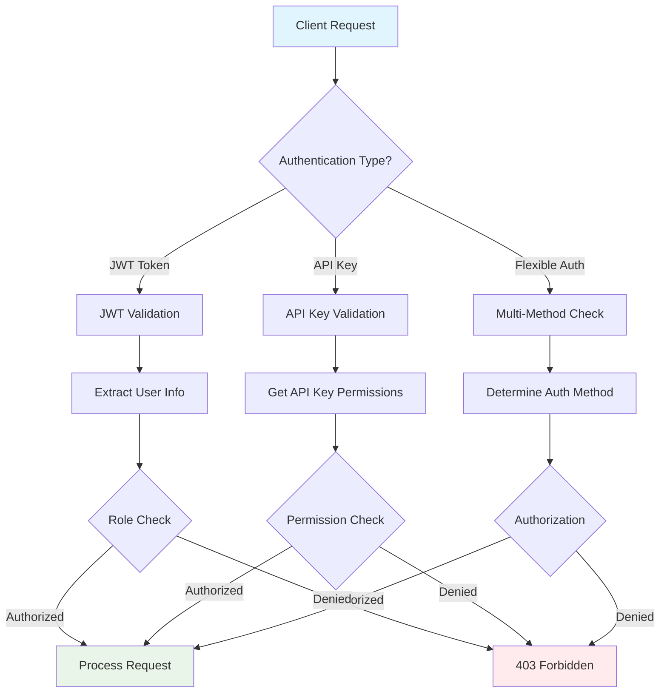
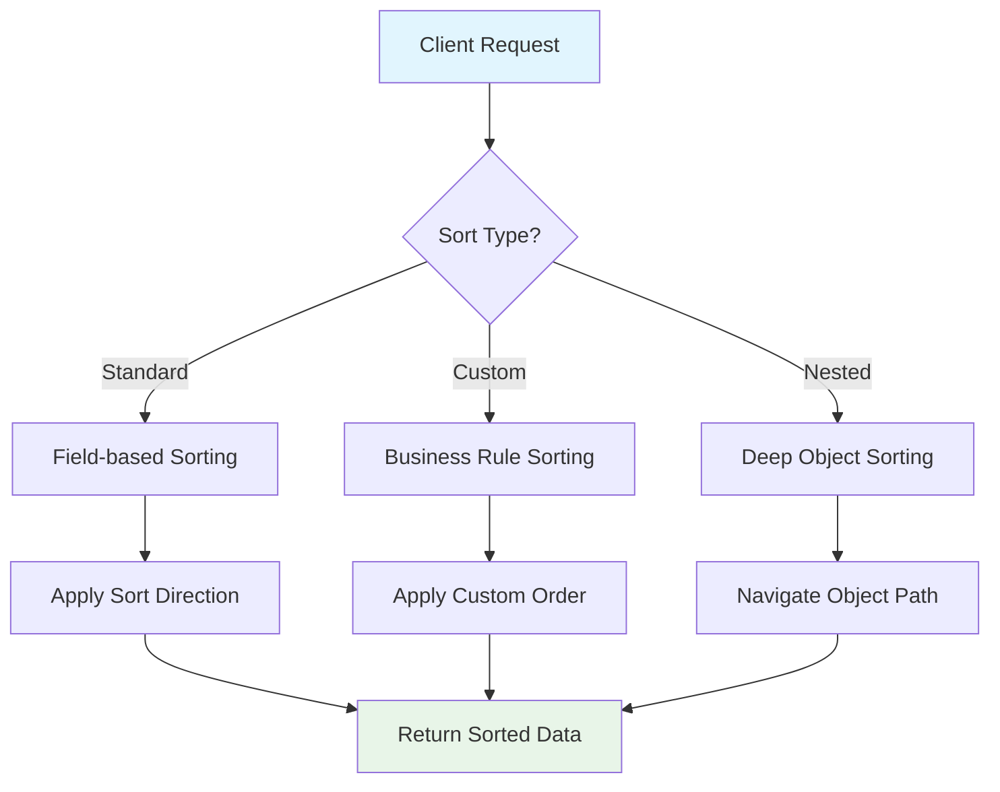

# 🛠️ Advanced Implementation Examples

*Real-world enterprise patterns and comprehensive system integrations*

Welcome to advanced FastAPI implementation examples! This section demonstrates sophisticated patterns that go beyond basic CRUD operations, showcasing enterprise-grade solutions for complex business scenarios.

## 🎯 What You'll Build

This guide presents production-ready implementations that address real-world challenges:

### 🔐 **Multi-Layer Authentication System**
Enterprise-grade authentication supporting JWT tokens, API keys, role-based access control, and flexible authorization patterns for complex organizational structures.

### 🛠️ **Advanced Middleware Pipeline**
Sophisticated request/response processing with logging, rate limiting, CORS handling, and performance monitoring for production environments.

### 📊 **Complex Data Operations**
Advanced sorting, filtering, and pagination patterns for nested data structures, custom business logic, and high-performance data retrieval.

## 🏗️ Enterprise Authentication & Authorization

> 💡 **Think of authentication like a high-security building**: Basic authentication is like a simple door key, but enterprise systems need keycards, biometrics, visitor badges, and different access levels for different floors - all working together seamlessly.



### 🔑 Complete Authentication Implementation

This implementation showcases enterprise patterns that handle multiple authentication methods, sophisticated authorization, and secure token management:

```python
from fastapi import FastAPI, Depends, HTTPException, status, Security
from fastapi.security import HTTPBearer, HTTPAuthorizationCredentials, APIKeyHeader, OAuth2PasswordBearer
from pydantic import BaseModel
from typing import Optional, List, Dict, Any
import jwt
from datetime import datetime, timedelta
from passlib.context import CryptContext
import secrets

# 🔒 Security configurations - CRITICAL: Use environment variables in production
SECRET_KEY = "your-secret-key-change-in-production"  # Use os.getenv("SECRET_KEY") in production
ALGORITHM = "HS256"  # JWT signing algorithm
ACCESS_TOKEN_EXPIRE_MINUTES = 30  # Token expiration time

# 🛡️ Security schemes - Multiple authentication methods
bearer_scheme = HTTPBearer()  # For JWT token authentication
api_key_scheme = APIKeyHeader(name="X-API-Key")  # For API key authentication
oauth2_scheme = OAuth2PasswordBearer(tokenUrl="auth/token")  # OAuth2 compatible scheme

# 🔐 Password hashing using bcrypt for secure password storage
pwd_context = CryptContext(schemes=["bcrypt"], deprecated="auto")

# 📋 Data models for authentication system
class User(BaseModel):
    """User model with role-based access control"""
    id: int
    username: str
    email: str
    roles: List[str]  # e.g., ["admin", "user", "moderator"]
    is_active: bool

class TokenData(BaseModel):
    """JWT token payload structure"""
    user_id: int
    username: str
    roles: List[str]  # Embedded roles for efficient authorization
    exp: datetime  # Token expiration timestamp

class APIKey(BaseModel):
    """API key model with fine-grained permissions"""
    key_id: str  # Unique identifier for the API key
    name: str  # Human-readable name for management
    user_id: int  # Associated user
    permissions: List[str]  # Specific permissions (read, write, admin, etc.)
    created_at: datetime
    last_used: Optional[datetime] = None  # Track usage for security monitoring

# 🗄️ Mock databases (In production: use PostgreSQL, MongoDB, etc.)
fake_users_db = {
    "admin": {
        "id": 1,
        "username": "admin",
        "email": "admin@example.com",
        "hashed_password": pwd_context.hash("adminpass"),  # Securely hashed password
        "roles": ["admin", "user"],  # Multiple roles for hierarchical permissions
        "is_active": True
    },
    "user": {
        "id": 2,
        "username": "user",
        "email": "user@example.com",
        "hashed_password": pwd_context.hash("userpass"),
        "roles": ["user"],  # Basic user role
        "is_active": True
    }
}

fake_api_keys_db = {
    "ak_test123": {
        "key_id": "ak_test123",
        "name": "Test API Key",  # Descriptive name for management
        "user_id": 1,  # Links API key to specific user
        "permissions": ["read", "write"],  # Granular permissions
        "created_at": datetime.utcnow(),
        "last_used": None  # Security tracking
    }
}

# 🔧 Core authentication functions
def verify_password(plain_password: str, hashed_password: str) -> bool:
    """Verify password against bcrypt hash - constant-time comparison"""
    return pwd_context.verify(plain_password, hashed_password)

def get_password_hash(password: str) -> str:
    """Generate bcrypt hash with random salt for secure storage"""
    return pwd_context.hash(password)

def create_access_token(data: dict, expires_delta: Optional[timedelta] = None):
    """
    Create JWT access token with embedded user data
    
    🔑 Security Notes:
    - Uses HS256 algorithm for signing
    - Includes expiration timestamp to prevent replay attacks
    - Embeds user roles for efficient authorization
    """
    to_encode = data.copy()
    if expires_delta:
        expire = datetime.utcnow() + expires_delta
    else:
        expire = datetime.utcnow() + timedelta(minutes=15)  # Default short expiration
    
    to_encode.update({"exp": expire})
    encoded_jwt = jwt.encode(to_encode, SECRET_KEY, algorithm=ALGORITHM)
    return encoded_jwt

def decode_token(token: str) -> TokenData:
    try:
        payload = jwt.decode(token, SECRET_KEY, algorithms=[ALGORITHM])
        user_id: int = payload.get("user_id")
        username: str = payload.get("sub")
        roles: List[str] = payload.get("roles", [])
        exp: datetime = datetime.fromtimestamp(payload.get("exp"))
        
        if username is None or user_id is None:
            raise HTTPException(
                status_code=status.HTTP_401_UNAUTHORIZED,
                detail="Invalid authentication credentials",
                headers={"WWW-Authenticate": "Bearer"},
            )
        
        return TokenData(user_id=user_id, username=username, roles=roles, exp=exp)
    except jwt.PyJWTError:
        raise HTTPException(
            status_code=status.HTTP_401_UNAUTHORIZED,
            detail="Invalid authentication credentials",
            headers={"WWW-Authenticate": "Bearer"},
        )

# Authentication dependencies
async def get_current_user_jwt(credentials: HTTPAuthorizationCredentials = Security(bearer_scheme)) -> User:
    """Authenticate user via JWT token"""
    token_data = decode_token(credentials.credentials)
    
    user = fake_users_db.get(token_data.username)
    if user is None:
        raise HTTPException(
            status_code=status.HTTP_401_UNAUTHORIZED,
            detail="User not found"
        )
    
    if not user["is_active"]:
        raise HTTPException(
            status_code=status.HTTP_401_UNAUTHORIZED,
            detail="Inactive user"
        )
    
    return User(**user)

async def get_current_user_api_key(api_key: str = Security(api_key_scheme)) -> User:
    """Authenticate user via API key"""
    key_data = fake_api_keys_db.get(api_key)
    if not key_data:
        raise HTTPException(
            status_code=status.HTTP_401_UNAUTHORIZED,
            detail="Invalid API key"
        )
    
    # Update last used timestamp
    key_data["last_used"] = datetime.utcnow()
    
    # Get user associated with API key
    user = None
    for username, user_data in fake_users_db.items():
        if user_data["id"] == key_data["user_id"]:
            user = user_data
            break
    
    if not user or not user["is_active"]:
        raise HTTPException(
            status_code=status.HTTP_401_UNAUTHORIZED,
            detail="Invalid API key or inactive user"
        )
    
    return User(**user)

# Flexible authentication that accepts both JWT and API key
async def get_current_user_flexible(
    jwt_credentials: Optional[HTTPAuthorizationCredentials] = Security(bearer_scheme, auto_error=False),
    api_key: Optional[str] = Security(api_key_scheme, auto_error=False)
) -> User:
    """Accept either JWT token or API key authentication"""
    
    if jwt_credentials:
        return await get_current_user_jwt(jwt_credentials)
    elif api_key:
        return await get_current_user_api_key(api_key)
    else:
        raise HTTPException(
            status_code=status.HTTP_401_UNAUTHORIZED,
            detail="Authentication required. Provide JWT token or API key",
            headers={"WWW-Authenticate": "Bearer"}
        )

# Authorization dependencies
def require_roles(*required_roles: str):
    """Dependency factory for role-based authorization"""
    def role_checker(current_user: User = Depends(get_current_user_flexible)) -> User:
        if not any(role in current_user.roles for role in required_roles):
            raise HTTPException(
                status_code=status.HTTP_403_FORBIDDEN,
                detail=f"Insufficient permissions. Required roles: {', '.join(required_roles)}"
            )
        return current_user
    return role_checker

def require_permissions(*required_permissions: str):
    """Dependency factory for permission-based authorization"""
    def permission_checker(
        current_user: User = Depends(get_current_user_flexible),
        api_key: Optional[str] = Security(api_key_scheme, auto_error=False)
    ) -> User:
        # Check permissions for API key authentication
        if api_key:
            key_data = fake_api_keys_db.get(api_key)
            if key_data:
                if not all(perm in key_data["permissions"] for perm in required_permissions):
                    raise HTTPException(
                        status_code=status.HTTP_403_FORBIDDEN,
                        detail=f"API key lacks required permissions: {', '.join(required_permissions)}"
                    )
        
        # For JWT, you might have different permission logic
        # This is a simplified example
        return current_user
    return permission_checker

# Authentication endpoints
@app.post("/auth/token")
async def login_for_access_token(username: str, password: str):
    """Obtain JWT access token"""
    user = fake_users_db.get(username)
    if not user or not verify_password(password, user["hashed_password"]):
        raise HTTPException(
            status_code=status.HTTP_401_UNAUTHORIZED,
            detail="Incorrect username or password",
            headers={"WWW-Authenticate": "Bearer"},
        )
    
    access_token_expires = timedelta(minutes=ACCESS_TOKEN_EXPIRE_MINUTES)
    access_token = create_access_token(
        data={
            "sub": user["username"],
            "user_id": user["id"],
            "roles": user["roles"]
        },
        expires_delta=access_token_expires
    )
    
    return {
        "access_token": access_token,
        "token_type": "bearer",
        "expires_in": ACCESS_TOKEN_EXPIRE_MINUTES * 60,
        "user": {
            "id": user["id"],
            "username": user["username"],
            "roles": user["roles"]
        }
    }

@app.post("/auth/api-keys")
async def create_api_key(
    name: str,
    permissions: List[str],
    current_user: User = Depends(require_roles("admin"))
):
    """Create new API key (admin only)"""
    key_id = f"ak_{secrets.token_urlsafe(16)}"
    
    new_key = {
        "key_id": key_id,
        "name": name,
        "user_id": current_user.id,
        "permissions": permissions,
        "created_at": datetime.utcnow(),
        "last_used": None
    }
    
    fake_api_keys_db[key_id] = new_key
    
    return {
        "api_key": key_id,
        "name": name,
        "permissions": permissions,
        "created_at": new_key["created_at"],
        "warning": "Store this API key securely. It won't be shown again."
    }

# Protected endpoints examples
@app.get("/users/me")
async def get_current_user_info(current_user: User = Depends(get_current_user_flexible)):
    """Get current user information (any authenticated user)"""
    return current_user

@app.get("/admin/users")
async def get_all_users(current_user: User = Depends(require_roles("admin"))):
    """Get all users (admin only)"""
    return {"users": list(fake_users_db.values())}

@app.post("/data/write")
async def write_data(
    data: dict,
    current_user: User = Depends(require_permissions("write"))
):
    """Write data (requires write permission)"""
    return {"message": "Data written successfully", "data": data}

@app.get("/data/read")
async def read_data(
    current_user: User = Depends(require_permissions("read"))
):
    """Read data (requires read permission)"""
    return {"data": "sensitive information"}

@app.delete("/admin/users/{user_id}")
async def delete_user(
    user_id: int,
    current_user: User = Depends(require_roles("admin"))
):
    """Delete user (admin only)"""
    return {"message": f"User {user_id} deleted by {current_user.username}"}
```

```

### 🎯 Key Authentication Patterns Demonstrated

| Pattern | Description | Use Case |
|---------|-------------|----------|
| **Multi-Method Auth** | Supports both JWT and API keys | Different client types (web apps vs. services) |
| **Role-Based Access** | Hierarchical permission system | Enterprise organizational structures |
| **Permission Granularity** | Fine-grained API key permissions | Third-party integrations with limited access |
| **Flexible Dependencies** | Reusable authorization decorators | Consistent security across endpoints |
| **Security Tracking** | API key usage monitoring | Audit trails and security analysis |

## 🚀 Advanced Middleware Pipeline

> 💡 **Think of middleware like airport security layers**: Each layer (check-in, security screening, boarding) handles specific concerns while maintaining the overall flow - just like request logging, rate limiting, and CORS work together.


### 🛠️ Production-Ready Middleware Implementation

This middleware stack demonstrates enterprise patterns for observability, security, and performance:

```python
from fastapi import FastAPI, Request, Response, HTTPException
from fastapi.middleware.base import BaseHTTPMiddleware
from fastapi.responses import JSONResponse
import time
import logging
import uuid
from typing import Callable
import traceback

# 📊 Advanced middleware for enterprise observability
class RequestLoggingMiddleware(BaseHTTPMiddleware):
    """
    Comprehensive request/response logging middleware
    
    Features:
    - Unique request ID generation for tracing
    - Performance timing measurement
    - Structured logging for monitoring systems
    - Error context preservation
    """
    
    async def dispatch(self, request: Request, call_next: Callable) -> Response:
        # 🔍 Generate unique request ID for distributed tracing
        request_id = str(uuid.uuid4())
        request.state.request_id = request_id
        
        # ⏱️ Start performance timing
        start_time = time.time()
        client_ip = request.client.host if request.client else "unknown"
        
        logger.info(f"Request started", extra={
            "request_id": request_id,
            "method": request.method,
            "url": str(request.url),
            "client_ip": client_ip,
            "user_agent": request.headers.get("user-agent"),
            "content_length": request.headers.get("content-length")
        })
        
        # 🔄 Process request through middleware chain
        try:
            response = await call_next(request)
        except Exception as e:
            # 🚨 Log unhandled exceptions with full context
            logger.error(f"Unhandled exception", extra={
                "request_id": request_id,
                "exception": str(e),
                "traceback": traceback.format_exc()
            })
            raise
        
        # 📊 Calculate processing time for performance monitoring
        process_time = time.time() - start_time
        
        # 🏷️ Add custom headers for debugging and monitoring
        response.headers["X-Request-ID"] = request_id  # For request tracing
        response.headers["X-Process-Time"] = f"{process_time:.4f}"  # Performance metrics
        
        # Log response
        logger.info(f"Request completed", extra={
            "request_id": request_id,
            "status_code": response.status_code,
            "process_time": process_time,
            "response_size": response.headers.get("content-length")
        })
        
        return response

class RateLimitingMiddleware(BaseHTTPMiddleware):
    """Simple rate limiting middleware"""
    
    def __init__(self, app, requests_per_minute: int = 60):
        super().__init__(app)
        self.requests_per_minute = requests_per_minute
        self.client_requests = {}  # In production, use Redis
    
    async def dispatch(self, request: Request, call_next: Callable) -> Response:
        client_ip = request.client.host if request.client else "unknown"
        current_time = time.time()
        
        # Clean old entries (older than 1 minute)
        cutoff_time = current_time - 60
        self.client_requests = {
            ip: [req_time for req_time in times if req_time > cutoff_time]
            for ip, times in self.client_requests.items()
        }
        
        # Check rate limit
        client_requests = self.client_requests.get(client_ip, [])
        if len(client_requests) >= self.requests_per_minute:
            return JSONResponse(
                status_code=429,
                content={
                    "error": "RATE_LIMIT_EXCEEDED",
                    "message": f"Rate limit exceeded. Maximum {self.requests_per_minute} requests per minute.",
                    "retry_after": 60
                },
                headers={"Retry-After": "60"}
            )
        
        # Record this request
        client_requests.append(current_time)
        self.client_requests[client_ip] = client_requests
        
        response = await call_next(request)
        
        # Add rate limit headers
        remaining = max(0, self.requests_per_minute - len(client_requests))
        response.headers["X-RateLimit-Limit"] = str(self.requests_per_minute)
        response.headers["X-RateLimit-Remaining"] = str(remaining)
        response.headers["X-RateLimit-Reset"] = str(int(current_time + 60))
        
        return response

class CORSMiddleware(BaseHTTPMiddleware):
    """Custom CORS middleware with advanced options"""
    
    def __init__(
        self,
        app,
        allow_origins: List[str] = ["*"],
        allow_methods: List[str] = ["*"],
        allow_headers: List[str] = ["*"],
        expose_headers: List[str] = [],
        allow_credentials: bool = False,
        max_age: int = 86400
    ):
        super().__init__(app)
        self.allow_origins = allow_origins
        self.allow_methods = allow_methods
        self.allow_headers = allow_headers
        self.expose_headers = expose_headers
        self.allow_credentials = allow_credentials
        self.max_age = max_age
    
    async def dispatch(self, request: Request, call_next: Callable) -> Response:
        origin = request.headers.get("origin")
        
        # Handle preflight requests
        if request.method == "OPTIONS":
            response = Response()
            self._add_cors_headers(response, origin)
            return response
        
        # Process normal request
        response = await call_next(request)
        self._add_cors_headers(response, origin)
        return response
    
    def _add_cors_headers(self, response: Response, origin: str):
        """Add CORS headers to response"""
        # Check if origin is allowed
        if self.allow_origins == ["*"] or origin in self.allow_origins:
            response.headers["Access-Control-Allow-Origin"] = origin or "*"
        
        if self.allow_credentials:
            response.headers["Access-Control-Allow-Credentials"] = "true"
        
        if self.allow_methods != ["*"]:
            response.headers["Access-Control-Allow-Methods"] = ", ".join(self.allow_methods)
        else:
            response.headers["Access-Control-Allow-Methods"] = "*"
        
        if self.allow_headers != ["*"]:
            response.headers["Access-Control-Allow-Headers"] = ", ".join(self.allow_headers)
        else:
            response.headers["Access-Control-Allow-Headers"] = "*"
        
        if self.expose_headers:
            response.headers["Access-Control-Expose-Headers"] = ", ".join(self.expose_headers)
        
        response.headers["Access-Control-Max-Age"] = str(self.max_age)

# Add middleware to app
app.add_middleware(RequestLoggingMiddleware)
app.add_middleware(RateLimitingMiddleware, requests_per_minute=100)
app.add_middleware(
    CORSMiddleware,
    allow_origins=["https://example.com", "https://app.example.com"],
    allow_credentials=True,
    expose_headers=["X-Request-ID", "X-Process-Time"]
)

# Enhanced exception handlers
@app.exception_handler(ValueError)
async def value_error_handler(request: Request, exc: ValueError):
    """Handle ValueError exceptions"""
    return JSONResponse(
        status_code=400,
        content={
            "error": "VALUE_ERROR",
            "message": str(exc),
            "request_id": getattr(request.state, "request_id", None),
            "timestamp": datetime.utcnow().isoformat() + "Z"
        }
    )

@app.exception_handler(404)
async def not_found_handler(request: Request, exc: HTTPException):
    """Custom 404 handler with helpful information"""
    return JSONResponse(
        status_code=404,
        content={
            "error": "RESOURCE_NOT_FOUND",
            "message": "The requested resource was not found",
            "path": str(request.url.path),
            "method": request.method,
            "request_id": getattr(request.state, "request_id", None),
            "suggestions": [
                "Check the URL for typos",
                "Verify the resource exists",
                "Check API documentation for correct endpoints"
            ],
            "api_docs": "/docs"
        }
    )

# Dependency injection examples
async def get_database():
    """Database dependency (mock)"""
    # In production, this would return actual database connection
    db = {"connection": "mock_db_connection"}
    try:
        yield db
    finally:
        # Cleanup database connection
        pass

async def get_cache():
    """Cache dependency (mock)"""
    cache = {"connection": "mock_redis_connection"}
    try:
        yield cache
    finally:
        pass

class PaginationDep:
    """Reusable pagination dependency"""
    def __init__(self, default_limit: int = 10, max_limit: int = 100):
        self.default_limit = default_limit
        self.max_limit = max_limit
    
    def __call__(
        self,
        page: int = Query(1, ge=1, description="Page number"),
        limit: int = Query(None, ge=1, description="Items per page")
    ):
        if limit is None:
            limit = self.default_limit
        if limit > self.max_limit:
            limit = self.max_limit
        
        return {
            "page": page,
            "limit": limit,
            "offset": (page - 1) * limit
        }

# Usage examples
pagination_dep = PaginationDep(default_limit=20, max_limit=100)

@app.get("/posts")
async def get_posts(
    pagination: dict = Depends(pagination_dep),
    db = Depends(get_database),
    cache = Depends(get_cache)
):
    """Example endpoint using dependency injection"""
    return {
        "message": "Posts retrieved successfully",
        "pagination": pagination,
        "db_info": db,
        "cache_info": cache
    }

# Nested field sorting
@app.get("/orders/sorted-nested")
async def get_orders_sorted_nested(
    sort: Optional[str] = Query(
        None,
        description="Sort by nested fields: customer.name:asc,total:desc,items.count:asc"
    )
):
    """
    Sorting with nested object fields
    
    Supports:
    - customer.name:asc (nested object field)
    - items.count:desc (computed/aggregated field)
    - shipping.address.city:asc (deeply nested field)
    """
    
    allowed_nested_fields = {
        'id', 'created_at', 'status', 'total',
        'customer.id', 'customer.name', 'customer.email',
        'customer.address.city', 'customer.address.country',
        'shipping.method', 'shipping.cost',
        'items.count', 'items.total_weight'
    }
    
    # Parse nested sort fields
    sort_fields = []
    if sort:
        sort_fields = parse_sort_string(sort, allowed_nested_fields)
    else:
        sort_fields = [SortField(field='created_at', direction=SortDirection.desc)]
    
    # Mock orders with nested data
    orders = [
        {
            "id": i,
            "created_at": f"2024-01-{(i % 28) + 1:02d}T10:30:00Z",
            "status": ["pending", "processing", "shipped", "delivered"][i % 4],
            "total": 50.00 + (i * 10.5),
            "customer": {
                "id": 100 + i,
                "name": f"Customer {chr(65 + (i % 26))}",
                "email": f"customer{i}@example.com",
                "address": {
                    "city": ["New York", "Los Angeles", "Chicago", "Houston"][i % 4],
                    "country": "USA"
                }
            },
            "shipping": {
                "method": ["standard", "express", "overnight"][i % 3],
                "cost": 5.00 + (i % 3) * 5.00
            },
            "items": {
                "count": 1 + (i % 5),
                "total_weight": 0.5 + (i % 10) * 0.2
            }
        }
        for i in range(1, 16)
    ]
    
    # Apply nested sorting
    for sort_field in reversed(sort_fields):
        reverse = sort_field.direction == SortDirection.desc
        
        def get_nested_value(obj: dict, field_path: str):
            """Extract value from nested object using dot notation"""
            keys = field_path.split('.')
            value = obj
            for key in keys:
                if isinstance(value, dict) and key in value:
                    value = value[key]
                else:
                    return None
            return value
        
        orders.sort(
            key=lambda x: get_nested_value(x, sort_field.field) or "",
            reverse=reverse
        )
    
    return {
        "data": orders,
        "sort_applied": [
            {"field": sf.field, "direction": sf.direction.value}
            for sf in sort_fields
        ],
        "metadata": {
            "allowed_nested_fields": sorted(allowed_nested_fields),
            "nested_sort_examples": [
                "?sort=customer.name:asc",
                "?sort=customer.address.city:asc,total:desc",
                "?sort=items.count:desc,shipping.cost:asc"
            ]
        }
    }

# Custom sort orders
@app.get("/tasks/custom-sort")
async def get_tasks_custom_sort(
    sort: Optional[str] = Query("priority:custom,due_date:asc")
):
    """
    Custom sort orders for business-specific sorting requirements
    
    Example: Priority sorting (high > medium > low) regardless of alphabetical order
    """
    
    # Define custom sort orders
    custom_sort_orders = {
        'priority': ['critical', 'high', 'medium', 'low'],
        'status': ['todo', 'in_progress', 'review', 'done'],
        'urgency': ['urgent', 'normal', 'low']
    }
    
    tasks = [
        {
            "id": i,
            "title": f"Task {i}",
            "priority": ["low", "medium", "high", "critical"][i % 4],
            "status": ["todo", "in_progress", "review", "done"][i % 4],
            "due_date": f"2024-02-{(i % 28) + 1:02d}",
            "urgency": ["low", "normal", "urgent"][i % 3]
        }
        for i in range(1, 13)
    ]
    
    # Parse and apply custom sorting
    allowed_fields = {'id', 'title', 'priority', 'status', 'due_date', 'urgency'}
    sort_fields = parse_sort_string(sort, allowed_fields)
    
    for sort_field in reversed(sort_fields):
        reverse = sort_field.direction == SortDirection.desc
        
        if sort_field.field in custom_sort_orders:
            # Use custom sort order
            custom_order = custom_sort_orders[sort_field.field]
            if reverse:
                custom_order = list(reversed(custom_order))
            
            def custom_sort_key(item):
                value = item[sort_field.field]
                try:
                    return custom_order.index(value)
                except ValueError:
                    return len(custom_order)  # Unknown values go to end
            
            tasks.sort(key=custom_sort_key)
        else:
            # Standard sorting
            tasks.sort(key=lambda x: x[sort_field.field], reverse=reverse)
    
    return {
        "data": tasks,
        "sort_applied": [
            {"field": sf.field, "direction": sf.direction.value}
            for sf in sort_fields
        ],
        "metadata": {
            "custom_sort_orders": custom_sort_orders,
            "custom_sort_explanation": {
                "priority": "critical > high > medium > low",
                "status": "todo > in_progress > review > done",
                "urgency": "urgent > normal > low"
            }
        }
    }
```

## 🎯 Advanced Data Operations & Business Logic

### 🔍 Complex Sorting and Filtering Patterns

> 💡 **Think of advanced sorting like a sophisticated filing system**: While basic sorting is like organizing books alphabetically, enterprise systems need custom rules (priority over date), nested organization (department → team → individual), and business-specific logic (VIP customers first).



The nested field sorting and custom sort order examples demonstrate enterprise-grade data handling patterns that go beyond simple database queries. These patterns are essential for:

- **Multi-tenant applications** where data relationships are complex
- **Business process management** where custom priorities override natural ordering  
- **Reporting systems** that need flexible data presentation
- **API gateways** that aggregate data from multiple sources

### 🏆 Enterprise Implementation Highlights

| Pattern | Complexity Level | Production Benefits |
|---------|-----------------|-------------------|
| **Multi-Auth System** | 🔥🔥🔥 | Supports diverse client ecosystems |
| **Request Tracing** | 🔥🔥 | Essential for distributed debugging |
| **Rate Limiting** | 🔥🔥 | Prevents abuse and ensures stability |
| **Custom Sorting** | 🔥🔥🔥 | Handles complex business requirements |
| **Dependency Injection** | 🔥🔥 | Promotes testable, modular code |

### 🚀 Next Steps for Production Deployment

After implementing these patterns, consider these advanced topics:

1. **🔐 Security Hardening**
   - Implement OAuth2 with PKCE for web clients
   - Add API rate limiting per user/IP
   - Set up security headers middleware

2. **📊 Observability Enhancement**
   - Integrate with OpenTelemetry for distributed tracing
   - Add metrics collection (Prometheus/DataDog)
   - Implement structured logging with correlation IDs

3. **⚡ Performance Optimization**
   - Add response caching with Redis
   - Implement database connection pooling
   - Use async database drivers (asyncpg, motor)

4. **🛡️ Resilience Patterns**
   - Circuit breakers for external services
   - Retry logic with exponential backoff
   - Health checks and graceful shutdown

---

> 💡 **Remember**: These patterns represent production-ready implementations that handle real-world complexity. Start with the patterns most relevant to your use case, then gradually adopt others as your system scales.

Ready to dive deeper into security considerations? Continue to the [Security Considerations](/docs/04_advance/05-security-considerations) section! 🛡️