# 🎨 Advanced Request Format Standards & Patterns

*Mastering complex request handling, content negotiation, and enterprise-grade validation*

Building on the foundation of basic request handling, let's explore sophisticated patterns for handling complex business requirements, multi-format content negotiation, and advanced validation scenarios.

## 🌐 Advanced Content Negotiation

```mermaid
graph TD
    A[🌐 Client Request] --> B{Content-Type?}
    B --> C[📄 JSON]
    B --> D[📊 XML]
    B --> E[📝 Form Data]
    B --> F[🔤 Plain Text]
    B --> G[🎯 Custom Format]
    
    C --> H[Schema Validation]
    D --> I[XSD Validation]
    E --> J[Field Mapping]
    F --> K[Parse Logic]
    G --> L[Custom Parser]
    
    H --> M[✅ Process Request]
    I --> M
    J --> M
    K --> M
    L --> M
    
    style A fill:#e1f5fe
    style M fill:#e8f5e8
```



### 🔄 Multi-Format Request Handling

Implement sophisticated content negotiation supporting multiple formats:

```python
from fastapi import FastAPI, Request, HTTPException, Depends, Header
from fastapi.responses import JSONResponse
from pydantic import BaseModel, Field, validator
from typing import Optional, Dict, Any, Union, Type
from xml.etree import ElementTree as ET
import yaml
import csv
import io
from abc import ABC, abstractmethod

class RequestParser(ABC):
    """Abstract base class for request parsers"""
    
    @abstractmethod
    async def parse(self, content: bytes) -> Dict[str, Any]:
        pass
    
    @abstractmethod
    def validate(self, data: Dict[str, Any]) -> bool:
        pass

class JSONParser(RequestParser):
    """JSON request parser with schema validation"""
    
    def __init__(self, schema: Optional[Type[BaseModel]] = None):
        self.schema = schema
    
    async def parse(self, content: bytes) -> Dict[str, Any]:
        try:
            data = json.loads(content.decode('utf-8'))
            if self.schema:
                validated = self.schema(**data)
                return validated.dict()
            return data
        except json.JSONDecodeError as e:
            raise HTTPException(
                status_code=400,
                detail={"error": "INVALID_JSON", "message": str(e)}
            )
    
    def validate(self, data: Dict[str, Any]) -> bool:
        if self.schema:
            try:
                self.schema(**data)
                return True
            except Exception:
                return False
        return True

class XMLParser(RequestParser):
    """XML request parser with XSD validation"""
    
    def __init__(self, xsd_schema: Optional[str] = None):
        self.xsd_schema = xsd_schema
    
    async def parse(self, content: bytes) -> Dict[str, Any]:
        try:
            root = ET.fromstring(content.decode('utf-8'))
            return self._xml_to_dict(root)
        except ET.ParseError as e:
            raise HTTPException(
                status_code=400,
                detail={"error": "INVALID_XML", "message": str(e)}
            )
    
    def _xml_to_dict(self, element) -> Dict[str, Any]:
        """Convert XML element to dictionary"""
        result = {}
        
        # Handle attributes
        if element.attrib:
            result['@attributes'] = element.attrib
        
        # Handle text content
        if element.text and element.text.strip():
            if len(element) == 0:  # Leaf node
                return element.text.strip()
            else:
                result['#text'] = element.text.strip()
        
        # Handle child elements
        for child in element:
            child_data = self._xml_to_dict(child)
            if child.tag in result:
                # Convert to list if multiple children with same tag
                if not isinstance(result[child.tag], list):
                    result[child.tag] = [result[child.tag]]
                result[child.tag].append(child_data)
            else:
                result[child.tag] = child_data
        
        return result or element.text
    
    def validate(self, data: Dict[str, Any]) -> bool:
        # Implement XSD validation if schema provided
        return True

class YAMLParser(RequestParser):
    """YAML request parser"""
    
    async def parse(self, content: bytes) -> Dict[str, Any]:
        try:
            return yaml.safe_load(content.decode('utf-8'))
        except yaml.YAMLError as e:
            raise HTTPException(
                status_code=400,
                detail={"error": "INVALID_YAML", "message": str(e)}
            )
    
    def validate(self, data: Dict[str, Any]) -> bool:
        return True

class CSVParser(RequestParser):
    """CSV request parser for bulk operations"""
    
    def __init__(self, expected_headers: Optional[list] = None):
        self.expected_headers = expected_headers
    
    async def parse(self, content: bytes) -> Dict[str, Any]:
        try:
            csv_file = io.StringIO(content.decode('utf-8'))
            reader = csv.DictReader(csv_file)
            
            rows = list(reader)
            if not rows:
                raise ValueError("Empty CSV file")
            
            if self.expected_headers:
                actual_headers = reader.fieldnames
                missing = set(self.expected_headers) - set(actual_headers)
                if missing:
                    raise ValueError(f"Missing headers: {missing}")
            
            return {"rows": rows, "count": len(rows)}
        except Exception as e:
            raise HTTPException(
                status_code=400,
                detail={"error": "INVALID_CSV", "message": str(e)}
            )
    
    def validate(self, data: Dict[str, Any]) -> bool:
        return True

class ContentNegotiator:
    """Advanced content negotiation handler"""
    
    def __init__(self):
        self.parsers: Dict[str, RequestParser] = {
            "application/json": JSONParser(),
            "application/xml": XMLParser(),
            "application/x-yaml": YAMLParser(),
            "text/csv": CSVParser()
        }
    
    def register_parser(self, content_type: str, parser: RequestParser):
        """Register custom parser for content type"""
        self.parsers[content_type] = parser
    
    async def parse_request(self, request: Request) -> Dict[str, Any]:
        """Parse request based on Content-Type"""
        content_type = request.headers.get("Content-Type", "application/json")
        
        # Extract base content type (ignore charset, etc.)
        base_content_type = content_type.split(";")[0].strip()
        
        if base_content_type not in self.parsers:
            raise HTTPException(
                status_code=415,
                detail={
                    "error": "UNSUPPORTED_MEDIA_TYPE",
                    "message": f"Content-Type '{base_content_type}' not supported",
                    "supported_types": list(self.parsers.keys())
                }
            )
        
        parser = self.parsers[base_content_type]
        body = await request.body()
        
        if not body:
            raise HTTPException(
                status_code=400,
                detail={"error": "EMPTY_BODY", "message": "Request body is empty"}
            )
        
        return await parser.parse(body)

# Global content negotiator
negotiator = ContentNegotiator()

# 🎯 Advanced endpoint with content negotiation
@app.post("/api/v1/data/import")
async def import_data_multiformat(
    request: Request,
    data: Dict[str, Any] = Depends(negotiator.parse_request),
    x_validation_strict: bool = Header(False, description="Enable strict validation")
):
    """
    Import data in multiple formats
    
    Supported formats:
    - JSON: application/json
    - XML: application/xml  
    - YAML: application/x-yaml
    - CSV: text/csv
    """
    
    content_type = request.headers.get("Content-Type", "").split(";")[0]
    
    # Format-specific processing
    if content_type == "text/csv":
        # Bulk import from CSV
        rows = data.get("rows", [])
        return {
            "status": "success",
            "format": "csv",
            "imported": len(rows),
            "summary": f"Imported {len(rows)} records from CSV"
        }
    
    # Standard processing for structured formats
    return {
        "status": "success",
        "format": content_type,
        "data_received": data,
        "validation_mode": "strict" if x_validation_strict else "lenient"
    }
```

## 🛡️ Advanced Validation Patterns

### 🔍 Complex Field Dependencies and Cross-Validation

```python
from pydantic import BaseModel, Field, validator, root_validator
from typing import Optional, List, Dict, Any, Union
from datetime import datetime, date
from decimal import Decimal
import re

class AddressModel(BaseModel):
    """Address with country-specific validation"""
    street: str
    city: str
    state_province: Optional[str] = None
    postal_code: str
    country: str
    
    @root_validator
    def validate_address_by_country(cls, values):
        """Country-specific address validation"""
        country = values.get('country', '').upper()
        postal_code = values.get('postal_code', '')
        state_province = values.get('state_province')
        
        # US validation
        if country == 'US':
            if not state_province:
                raise ValueError("State is required for US addresses")
            
            if not re.match(r'^\d{5}(-\d{4})?$', postal_code):
                raise ValueError("US postal code must be in format 12345 or 12345-6789")
            
            valid_states = ['AL', 'AK', 'AZ', 'AR', 'CA', 'CO', 'CT', 'DE', 'FL', 'GA',
                          'HI', 'ID', 'IL', 'IN', 'IA', 'KS', 'KY', 'LA', 'ME', 'MD',
                          'MA', 'MI', 'MN', 'MS', 'MO', 'MT', 'NE', 'NV', 'NH', 'NJ',
                          'NM', 'NY', 'NC', 'ND', 'OH', 'OK', 'OR', 'PA', 'RI', 'SC',
                          'SD', 'TN', 'TX', 'UT', 'VT', 'VA', 'WA', 'WV', 'WI', 'WY']
            
            if state_province.upper() not in valid_states:
                raise ValueError(f"Invalid US state: {state_province}")
        
        # Canada validation
        elif country == 'CA':
            if not state_province:
                raise ValueError("Province is required for Canadian addresses")
            
            if not re.match(r'^[A-Z]\d[A-Z]\s?\d[A-Z]\d$', postal_code.upper()):
                raise ValueError("Canadian postal code must be in format A1A 1A1")
        
        # UK validation
        elif country == 'UK' or country == 'GB':
            if not re.match(r'^[A-Z]{1,2}\d[A-Z\d]?\s?\d[A-Z]{2}$', postal_code.upper()):
                raise ValueError("Invalid UK postcode format")
        
        return values

class FinancialTransaction(BaseModel):
    """Complex financial transaction with multi-level validation"""
    
    transaction_type: str = Field(..., regex="^(PURCHASE|REFUND|TRANSFER|WITHDRAWAL)$")
    amount: Decimal = Field(..., gt=0, decimal_places=2)
    currency: str = Field(..., regex="^[A-Z]{3}$")
    
    source_account: str
    destination_account: Optional[str] = None
    
    scheduled_date: Optional[date] = None
    recurring: bool = False
    recurring_frequency: Optional[str] = None
    recurring_end_date: Optional[date] = None
    
    metadata: Dict[str, Any] = Field(default_factory=dict)
    compliance_checks: List[str] = Field(default_factory=list)
    
    @validator('amount')
    def validate_amount_limits(cls, v, values):
        """Validate amount based on transaction type"""
        if 'transaction_type' in values:
            tx_type = values['transaction_type']
            
            # Type-specific limits
            limits = {
                'PURCHASE': (0.01, 10000),
                'REFUND': (0.01, 5000),
                'TRANSFER': (0.01, 50000),
                'WITHDRAWAL': (10, 5000)
            }
            
            min_amount, max_amount = limits.get(tx_type, (0.01, 100000))
            
            if v < min_amount or v > max_amount:
                raise ValueError(
                    f"{tx_type} amount must be between {min_amount} and {max_amount}"
                )
        
        return v
    
    @validator('destination_account')
    def validate_destination_account(cls, v, values):
        """Validate destination account based on transaction type"""
        tx_type = values.get('transaction_type')
        
        if tx_type in ['TRANSFER', 'PURCHASE'] and not v:
            raise ValueError(f"Destination account required for {tx_type}")
        
        if tx_type in ['WITHDRAWAL', 'REFUND'] and v:
            raise ValueError(f"Destination account not allowed for {tx_type}")
        
        # Validate account format
        if v and not re.match(r'^ACC-\d{10}$', v):
            raise ValueError("Invalid account format. Expected: ACC-XXXXXXXXXX")
        
        # Prevent self-transfer
        if v and v == values.get('source_account'):
            raise ValueError("Cannot transfer to the same account")
        
        return v
    
    @root_validator
    def validate_recurring_fields(cls, values):
        """Validate recurring transaction fields"""
        if values.get('recurring'):
            if not values.get('recurring_frequency'):
                raise ValueError("Recurring frequency required for recurring transactions")
            
            valid_frequencies = ['DAILY', 'WEEKLY', 'BIWEEKLY', 'MONTHLY', 'QUARTERLY', 'YEARLY']
            if values['recurring_frequency'] not in valid_frequencies:
                raise ValueError(f"Invalid frequency. Must be one of: {valid_frequencies}")
            
            if not values.get('recurring_end_date'):
                raise ValueError("End date required for recurring transactions")
            
            # Validate date logic
            scheduled = values.get('scheduled_date') or date.today()
            end_date = values['recurring_end_date']
            
            if end_date <= scheduled:
                raise ValueError("End date must be after scheduled date")
            
            # Maximum recurring period
            max_days = 365 * 2  # 2 years
            if (end_date - scheduled).days > max_days:
                raise ValueError(f"Recurring period cannot exceed {max_days} days")
        
        return values
    
    @root_validator
    def run_compliance_checks(cls, values):
        """Run compliance and risk checks"""
        checks = []
        amount = values.get('amount', 0)
        tx_type = values.get('transaction_type')
        
        # Large transaction check
        if amount > 5000:
            checks.append("LARGE_TRANSACTION_REVIEW")
        
        # International transfer check
        source_country = values.get('metadata', {}).get('source_country')
        dest_country = values.get('metadata', {}).get('destination_country')
        
        if source_country and dest_country and source_country != dest_country:
            checks.append("INTERNATIONAL_TRANSFER_CHECK")
            
            # OFAC sanctions check
            sanctioned_countries = ['IR', 'KP', 'SY']  # Example list
            if dest_country in sanctioned_countries:
                raise ValueError(f"Transfers to {dest_country} are not permitted")
        
        # Velocity check
        daily_limit = values.get('metadata', {}).get('daily_limit', 10000)
        daily_total = values.get('metadata', {}).get('daily_total', 0)
        
        if daily_total + amount > daily_limit:
            checks.append("VELOCITY_LIMIT_CHECK")
            raise ValueError(f"Daily transaction limit exceeded")
        
        values['compliance_checks'] = checks
        return values

# 🎭 Dynamic validation with business rules
class BusinessRuleValidator:
    """Dynamic validation based on configurable business rules"""
    
    def __init__(self):
        self.rules = {}
    
    def register_rule(self, name: str, condition: callable, error_message: str):
        """Register a business rule"""
        self.rules[name] = {
            "condition": condition,
            "error_message": error_message
        }
    
    async def validate(self, data: Dict[str, Any], context: Dict[str, Any] = None) -> List[str]:
        """Validate data against all rules"""
        errors = []
        
        for rule_name, rule in self.rules.items():
            try:
                if not await rule["condition"](data, context or {}):
                    errors.append(f"{rule_name}: {rule['error_message']}")
            except Exception as e:
                errors.append(f"{rule_name}: Error evaluating rule - {str(e)}")
        
        return errors

# Initialize validator
business_validator = BusinessRuleValidator()

# Register business rules
business_validator.register_rule(
    "working_hours",
    lambda data, ctx: 9 <= datetime.now().hour < 17 or data.get("override_hours", False),
    "Transactions only allowed during business hours (9 AM - 5 PM)"
)

business_validator.register_rule(
    "merchant_active",
    lambda data, ctx: ctx.get("merchant_status") == "ACTIVE",
    "Merchant must be active to process transactions"
)

@app.post("/transactions/create")
async def create_transaction_with_validation(
    transaction: FinancialTransaction,
    x_merchant_id: str = Header(...),
    x_override_hours: bool = Header(False)
):
    """Create transaction with complex validation"""
    
    # Prepare context for business rules
    context = {
        "merchant_id": x_merchant_id,
        "merchant_status": "ACTIVE",  # Would fetch from database
        "override_hours": x_override_hours
    }
    
    # Run business rule validation
    business_errors = await business_validator.validate(
        transaction.dict(),
        context
    )
    
    if business_errors:
        raise HTTPException(
            status_code=422,
            detail={
                "error": "BUSINESS_RULE_VIOLATION",
                "violations": business_errors
            }
        )
    
    # Process transaction
    return {
        "transaction_id": f"TXN-{uuid.uuid4()}",
        "status": "PENDING",
        "compliance_checks": transaction.compliance_checks,
        "created_at": datetime.utcnow().isoformat()
    }
```

## 🔄 Request Transformation Patterns

### 🎨 Request Enrichment and Normalization

```mermaid
graph TD
    A[📥 Raw Request] --> B[🔍 Parse & Validate]
    B --> C{Transform?}
    
    C -->|Enrich| D[➕ Add Metadata]
    C -->|Normalize| E[🔧 Standardize Format]
    C -->|Sanitize| F[🧹 Clean Data]
    
    D --> G[📊 Enriched Request]
    E --> G
    F --> G
    
    G --> H[💼 Business Logic]
    
    style A fill:#e1f5fe
    style G fill:#e8f5e8
    style H fill:#f3e5f5
```



```python
from typing import Protocol, TypeVar, Generic
import unicodedata
import html
from datetime import timezone

T = TypeVar('T')

class RequestTransformer(Protocol[T]):
    """Protocol for request transformers"""
    
    async def transform(self, data: T) -> T:
        ...

class SanitizationTransformer(RequestTransformer[Dict[str, Any]]):
    """Sanitize and clean request data"""
    
    def __init__(self, config: Dict[str, Any] = None):
        self.config = config or {
            "strip_html": True,
            "normalize_unicode": True,
            "trim_whitespace": True,
            "lowercase_emails": True
        }
    
    async def transform(self, data: Dict[str, Any]) -> Dict[str, Any]:
        """Apply sanitization transformations"""
        return self._sanitize_dict(data)
    
    def _sanitize_dict(self, data: Dict[str, Any]) -> Dict[str, Any]:
        """Recursively sanitize dictionary"""
        sanitized = {}
        
        for key, value in data.items():
            if isinstance(value, str):
                sanitized[key] = self._sanitize_string(value, key)
            elif isinstance(value, dict):
                sanitized[key] = self._sanitize_dict(value)
            elif isinstance(value, list):
                sanitized[key] = [
                    self._sanitize_dict(item) if isinstance(item, dict)
                    else self._sanitize_string(item, key) if isinstance(item, str)
                    else item
                    for item in value
                ]
            else:
                sanitized[key] = value
        
        return sanitized
    
    def _sanitize_string(self, value: str, field_name: str) -> str:
        """Sanitize string value based on field type"""
        if not value:
            return value
        
        # Trim whitespace
        if self.config.get("trim_whitespace"):
            value = value.strip()
        
        # Strip HTML tags
        if self.config.get("strip_html") and field_name not in ["description", "content"]:
            value = html.escape(value)
        
        # Normalize unicode
        if self.config.get("normalize_unicode"):
            value = unicodedata.normalize('NFKC', value)
        
        # Lowercase emails
        if self.config.get("lowercase_emails") and "email" in field_name.lower():
            value = value.lower()
        
        return value

class EnrichmentTransformer(RequestTransformer[Dict[str, Any]]):
    """Enrich requests with additional context"""
    
    def __init__(self, request: Request):
        self.request = request
    
    async def transform(self, data: Dict[str, Any]) -> Dict[str, Any]:
        """Add request metadata and context"""
        
        # Add request metadata
        data["_metadata"] = {
            "request_id": self.request.headers.get("X-Request-ID", str(uuid.uuid4())),
            "client_ip": self.request.client.host if self.request.client else None,
            "user_agent": self.request.headers.get("User-Agent"),
            "timestamp": datetime.utcnow().isoformat(),
            "api_version": self.request.url.path.split("/")[2] if len(self.request.url.path.split("/")) > 2 else "v1"
        }
        
        # Add geolocation from IP (mock implementation)
        if data["_metadata"]["client_ip"]:
            data["_metadata"]["geo"] = {
                "country": "US",
                "region": "CA",
                "city": "San Francisco",
                "timezone": "America/Los_Angeles"
            }
        
        # Add rate limit info
        data["_metadata"]["rate_limit"] = {
            "limit": 1000,
            "remaining": 950,
            "reset": datetime.utcnow().replace(minute=0, second=0, microsecond=0).timestamp()
        }
        
        return data

class NormalizationTransformer(RequestTransformer[Dict[str, Any]]):
    """Normalize data formats and structures"""
    
    async def transform(self, data: Dict[str, Any]) -> Dict[str, Any]:
        """Normalize various data formats"""
        
        normalized = {}
        
        for key, value in data.items():
            # Normalize phone numbers
            if "phone" in key.lower() and isinstance(value, str):
                normalized[key] = self._normalize_phone(value)
            
            # Normalize dates
            elif "date" in key.lower() and isinstance(value, str):
                normalized[key] = self._normalize_date(value)
            
            # Normalize currency amounts
            elif "amount" in key.lower() or "price" in key.lower():
                normalized[key] = self._normalize_amount(value)
            
            # Recursively normalize nested structures
            elif isinstance(value, dict):
                normalized[key] = await self.transform(value)
            
            elif isinstance(value, list) and value and isinstance(value[0], dict):
                normalized[key] = [await self.transform(item) for item in value]
            
            else:
                normalized[key] = value
        
        return normalized
    
    def _normalize_phone(self, phone: str) -> str:
        """Normalize phone number to E.164 format"""
        # Remove all non-numeric characters
        digits = re.sub(r'\D', '', phone)
        
        # Add country code if missing (assuming US)
        if len(digits) == 10:
            digits = '1' + digits
        
        # Format as +X-XXX-XXX-XXXX
        if len(digits) == 11:
            return f"+{digits[0]}-{digits[1:4]}-{digits[4:7]}-{digits[7:]}"
        
        return phone  # Return original if can't normalize
    
    def _normalize_date(self, date_str: str) -> str:
        """Normalize date to ISO 8601 format"""
        formats = [
            "%Y-%m-%d",
            "%m/%d/%Y",
            "%d/%m/%Y",
            "%Y/%m/%d",
            "%d-%m-%Y",
            "%m-%d-%Y"
        ]
        
        for fmt in formats:
            try:
                dt = datetime.strptime(date_str, fmt)
                return dt.date().isoformat()
            except ValueError:
                continue
        
        return date_str  # Return original if can't parse
    
    def _normalize_amount(self, value: Any) -> Decimal:
        """Normalize currency amounts"""
        if isinstance(value, (int, float)):
            return Decimal(str(value)).quantize(Decimal('0.01'))
        
        if isinstance(value, str):
            # Remove currency symbols and commas
            cleaned = re.sub(r'[^\d.-]', '', value)
            try:
                return Decimal(cleaned).quantize(Decimal('0.01'))
            except:
                pass
        
        return value

# 🔄 Transform pipeline
class TransformationPipeline:
    """Chain multiple transformers"""
    
    def __init__(self):
        self.transformers: List[RequestTransformer] = []
    
    def add_transformer(self, transformer: RequestTransformer):
        """Add transformer to pipeline"""
        self.transformers.append(transformer)
        return self
    
    async def execute(self, data: Dict[str, Any]) -> Dict[str, Any]:
        """Execute all transformers in sequence"""
        result = data
        
        for transformer in self.transformers:
            result = await transformer.transform(result)
        
        return result

# 🎯 Advanced endpoint with transformation pipeline
@app.post("/api/v1/orders/create")
async def create_order_with_transformation(
    request: Request,
    raw_data: Dict[str, Any] = Depends(negotiator.parse_request)
):
    """Create order with request transformation pipeline"""
    
    # Build transformation pipeline
    pipeline = TransformationPipeline()
    pipeline.add_transformer(SanitizationTransformer())
    pipeline.add_transformer(NormalizationTransformer())
    pipeline.add_transformer(EnrichmentTransformer(request))
    
    # Transform request
    transformed_data = await pipeline.execute(raw_data)
    
    # Validate transformed data
    try:
        # Would validate against Pydantic model here
        validated_data = transformed_data
    except Exception as e:
        raise HTTPException(
            status_code=422,
            detail={"error": "VALIDATION_ERROR", "message": str(e)}
        )
    
    # Process order
    order_id = f"ORD-{uuid.uuid4()}"
    
    return {
        "order_id": order_id,
        "status": "CREATED",
        "original_data": raw_data,
        "transformed_data": transformed_data,
        "metadata": transformed_data.get("_metadata", {})
    }
```

## 🎓 Summary

Advanced request format patterns enable you to:

- 🌐 **Handle Multiple Formats**: Support JSON, XML, YAML, CSV and custom formats with unified parsing
- 🛡️ **Implement Complex Validation**: Cross-field validation, business rules, and compliance checks
- 🔄 **Transform Requests**: Sanitize, normalize, and enrich requests with consistent pipelines
- 🎯 **Ensure Data Quality**: Apply format-specific validation and transformation rules
- 📊 **Support Bulk Operations**: Handle CSV imports and batch processing efficiently

### 📚 Key Takeaways

| Pattern | Use Case | Example |
|---------|----------|---------|
| **Content Negotiation** | Multi-format APIs | JSON, XML, YAML, CSV support |
| **Complex Validation** | Business rule enforcement | Financial transaction validation |
| **Request Transformation** | Data normalization | Phone numbers, dates, amounts |
| **Pipeline Processing** | Chained transformations | Sanitize → Normalize → Enrich |
| **Dynamic Rules** | Configurable validation | Business hours, limits, compliance |

Ready to master response formats? Let's explore [Advanced Response Format Standards](/docs/03_intermediate/05-response-format) next! 🚀