# 🎯 Advanced Response Format Standards & Patterns

*Implementing sophisticated response structures, content negotiation, and adaptive formats*

Building upon the foundation of basic response handling, let's explore enterprise-grade patterns for complex response scenarios, advanced content negotiation, and adaptive response formats.

## 🏗️ Response Architecture Patterns

```mermaid
graph TD
    A[💼 Business Logic] --> B{Response Strategy}
    
    B --> C[📊 Data Response]
    B --> D[📁 File Response]
    B --> E[🔄 Stream Response]
    B --> F[🎭 Hybrid Response]
    
    C --> G[Transform]
    C --> H[Paginate]
    C --> I[Filter]
    
    G --> J[🎯 Format Selection]
    H --> J
    I --> J
    
    J --> K[JSON]
    J --> L[XML]
    J --> M[CSV]
    J --> N[Protocol Buffers]
    
    K --> O[📤 Client]
    L --> O
    M --> O
    N --> O
    
    style A fill:#e1f5fe
    style J fill:#f3e5f5
    style O fill:#e8f5e8
```



### 🔄 Advanced Content Negotiation

Implement sophisticated content negotiation supporting multiple response formats:

```python
from fastapi import FastAPI, Request, Header, HTTPException
from fastapi.responses import Response, JSONResponse, StreamingResponse
from pydantic import BaseModel
from typing import Dict, Any, List, Optional, Protocol, Type
from abc import ABC, abstractmethod
import xml.etree.ElementTree as ET
import csv
import io
import yaml
from datetime import datetime
import orjson  # Fast JSON serialization

class ResponseFormatter(ABC):
    """Abstract base class for response formatters"""
    
    @abstractmethod
    def format(self, data: Any) -> bytes:
        """Format data into bytes"""
        pass
    
    @abstractmethod
    def get_media_type(self) -> str:
        """Get the media type for this formatter"""
        pass

class JSONFormatter(ResponseFormatter):
    """High-performance JSON formatter with options"""
    
    def __init__(self, pretty: bool = False, sort_keys: bool = False):
        self.pretty = pretty
        self.sort_keys = sort_keys
    
    def format(self, data: Any) -> bytes:
        """Format data as JSON using orjson for performance"""
        options = 0
        if self.pretty:
            options |= orjson.OPT_INDENT_2
        if self.sort_keys:
            options |= orjson.OPT_SORT_KEYS
        
        return orjson.dumps(data, option=options)
    
    def get_media_type(self) -> str:
        return "application/json"

class XMLFormatter(ResponseFormatter):
    """XML formatter with namespace support"""
    
    def __init__(self, root_name: str = "response", namespace: Optional[str] = None):
        self.root_name = root_name
        self.namespace = namespace
    
    def format(self, data: Any) -> bytes:
        """Convert data to XML format"""
        root = self._dict_to_xml(self.root_name, data)
        
        if self.namespace:
            root.set('xmlns', self.namespace)
        
        return ET.tostring(root, encoding='utf-8', xml_declaration=True)
    
    def _dict_to_xml(self, tag: str, data: Any) -> ET.Element:
        """Recursively convert dictionary to XML"""
        elem = ET.Element(tag)
        
        if isinstance(data, dict):
            for key, value in data.items():
                if key.startswith('@'):  # Attribute
                    elem.set(key[1:], str(value))
                elif key == '#text':  # Text content
                    elem.text = str(value)
                else:
                    if isinstance(value, list):
                        for item in value:
                            elem.append(self._dict_to_xml(key, item))
                    else:
                        elem.append(self._dict_to_xml(key, value))
        elif isinstance(data, list):
            for item in data:
                elem.append(self._dict_to_xml('item', item))
        else:
            elem.text = str(data)
        
        return elem
    
    def get_media_type(self) -> str:
        return "application/xml"

class CSVFormatter(ResponseFormatter):
    """CSV formatter for tabular data"""
    
    def __init__(self, delimiter: str = ',', include_headers: bool = True):
        self.delimiter = delimiter
        self.include_headers = include_headers
    
    def format(self, data: Any) -> bytes:
        """Format data as CSV"""
        if not isinstance(data, list) or not data:
            raise ValueError("CSV formatting requires a non-empty list of dictionaries")
        
        output = io.StringIO()
        
        # Extract headers from first item
        headers = list(data[0].keys()) if isinstance(data[0], dict) else []
        
        writer = csv.DictWriter(
            output, 
            fieldnames=headers, 
            delimiter=self.delimiter
        )
        
        if self.include_headers:
            writer.writeheader()
        
        writer.writerows(data)
        
        return output.getvalue().encode('utf-8')
    
    def get_media_type(self) -> str:
        return "text/csv"

class YAMLFormatter(ResponseFormatter):
    """YAML formatter"""
    
    def format(self, data: Any) -> bytes:
        """Format data as YAML"""
        return yaml.dump(
            data, 
            default_flow_style=False, 
            allow_unicode=True
        ).encode('utf-8')
    
    def get_media_type(self) -> str:
        return "application/x-yaml"

class ContentNegotiator:
    """Advanced content negotiation with quality factors"""
    
    def __init__(self):
        self.formatters: Dict[str, ResponseFormatter] = {
            "application/json": JSONFormatter(),
            "application/xml": XMLFormatter(),
            "text/csv": CSVFormatter(),
            "application/x-yaml": YAMLFormatter()
        }
        
        # Quality factor preferences
        self.default_quality = {
            "application/json": 1.0,
            "application/xml": 0.9,
            "text/csv": 0.8,
            "application/x-yaml": 0.7
        }
    
    def register_formatter(self, media_type: str, formatter: ResponseFormatter):
        """Register custom formatter"""
        self.formatters[media_type] = formatter
    
    def negotiate(self, accept_header: str) -> tuple[str, ResponseFormatter]:
        """Negotiate best response format based on Accept header"""
        if not accept_header or accept_header == "*/*":
            return "application/json", self.formatters["application/json"]
        
        # Parse Accept header with quality factors
        accept_types = self._parse_accept_header(accept_header)
        
        # Find best match
        best_match = None
        best_quality = 0.0
        
        for media_type, quality in accept_types:
            if media_type in self.formatters and quality > best_quality:
                best_match = media_type
                best_quality = quality
            elif media_type == "*/*":
                # Wildcard - use default with reduced quality
                for mt, formatter in self.formatters.items():
                    default_q = self.default_quality.get(mt, 0.5) * quality
                    if default_q > best_quality:
                        best_match = mt
                        best_quality = default_q
        
        if best_match:
            return best_match, self.formatters[best_match]
        
        # No acceptable format found
        available = list(self.formatters.keys())
        raise HTTPException(
            status_code=406,
            detail={
                "error": "NOT_ACCEPTABLE",
                "message": f"Cannot produce response matching Accept header: {accept_header}",
                "available_formats": available
            }
        )
    
    def _parse_accept_header(self, accept_header: str) -> List[tuple[str, float]]:
        """Parse Accept header with quality factors"""
        types = []
        
        for part in accept_header.split(','):
            part = part.strip()
            if ';' in part:
                media_type, params = part.split(';', 1)
                media_type = media_type.strip()
                
                # Extract quality factor
                quality = 1.0
                for param in params.split(';'):
                    param = param.strip()
                    if param.startswith('q='):
                        try:
                            quality = float(param[2:])
                        except ValueError:
                            quality = 1.0
                
                types.append((media_type, quality))
            else:
                types.append((part, 1.0))
        
        # Sort by quality (descending)
        types.sort(key=lambda x: x[1], reverse=True)
        
        return types

# Global content negotiator
negotiator = ContentNegotiator()

# 🎨 Response transformation pipeline
class ResponseTransformer(Protocol):
    """Protocol for response transformers"""
    
    def transform(self, data: Any, context: Dict[str, Any]) -> Any:
        ...

class FieldFilterTransformer:
    """Filter response fields based on client request"""
    
    def transform(self, data: Any, context: Dict[str, Any]) -> Any:
        """Apply field filtering"""
        fields = context.get('fields', [])
        exclude = context.get('exclude', [])
        
        if not fields and not exclude:
            return data
        
        if isinstance(data, dict):
            return self._filter_dict(data, fields, exclude)
        elif isinstance(data, list):
            return [self._filter_dict(item, fields, exclude) if isinstance(item, dict) else item for item in data]
        
        return data
    
    def _filter_dict(self, data: dict, fields: List[str], exclude: List[str]) -> dict:
        """Filter dictionary fields"""
        result = {}
        
        # If fields specified, only include those
        if fields:
            for field in fields:
                if '.' in field:  # Nested field
                    parts = field.split('.')
                    if parts[0] in data:
                        nested_fields = ['.'.join(parts[1:])]
                        if isinstance(data[parts[0]], dict):
                            result[parts[0]] = self._filter_dict(
                                data[parts[0]], 
                                nested_fields, 
                                []
                            )
                        else:
                            result[parts[0]] = data[parts[0]]
                elif field in data:
                    result[field] = data[field]
        else:
            # Include all except excluded
            result = data.copy()
            for field in exclude:
                if '.' in field:  # Nested exclusion
                    parts = field.split('.')
                    if parts[0] in result and isinstance(result[parts[0]], dict):
                        nested_exclude = ['.'.join(parts[1:])]
                        result[parts[0]] = self._filter_dict(
                            result[parts[0]], 
                            [], 
                            nested_exclude
                        )
                else:
                    result.pop(field, None)
        
        return result

class LocalizationTransformer:
    """Localize response content based on client preferences"""
    
    def __init__(self):
        # Mock translations
        self.translations = {
            "en": {},
            "es": {
                "status": "estado",
                "message": "mensaje",
                "error": "error",
                "success": "éxito",
                "created": "creado",
                "updated": "actualizado"
            },
            "fr": {
                "status": "statut",
                "message": "message",
                "error": "erreur",
                "success": "succès",
                "created": "créé",
                "updated": "mis à jour"
            }
        }
    
    def transform(self, data: Any, context: Dict[str, Any]) -> Any:
        """Apply localization transformations"""
        locale = context.get('locale', 'en')
        
        if locale not in self.translations:
            return data
        
        translations = self.translations[locale]
        
        if isinstance(data, dict):
            return self._localize_dict(data, translations)
        elif isinstance(data, list):
            return [self._localize_dict(item, translations) if isinstance(item, dict) else item for item in data]
        
        return data
    
    def _localize_dict(self, data: dict, translations: dict) -> dict:
        """Localize dictionary keys and values"""
        result = {}
        
        for key, value in data.items():
            # Translate key if available
            localized_key = translations.get(key, key)
            
            # Recursively localize nested structures
            if isinstance(value, dict):
                result[localized_key] = self._localize_dict(value, translations)
            elif isinstance(value, str) and value.lower() in translations:
                # Translate known string values
                result[localized_key] = translations[value.lower()]
            else:
                result[localized_key] = value
        
        return result

# 🎯 Advanced response endpoint
@app.get("/api/v1/users/{user_id}")
async def get_user_advanced_response(
    user_id: int,
    request: Request,
    accept: Optional[str] = Header(None),
    accept_language: Optional[str] = Header("en"),
    fields: Optional[str] = Query(None, description="Comma-separated list of fields to include"),
    exclude: Optional[str] = Query(None, description="Comma-separated list of fields to exclude"),
    x_response_format: Optional[str] = Header(None, description="Override Accept header")
):
    """
    Advanced user endpoint with:
    - Content negotiation
    - Field filtering
    - Localization
    - Multiple response formats
    """
    
    # Mock user data
    user_data = {
        "id": user_id,
        "username": f"user_{user_id}",
        "email": f"user_{user_id}@example.com",
        "profile": {
            "first_name": "John",
            "last_name": "Doe",
            "avatar_url": f"https://api.example.com/avatars/{user_id}.jpg",
            "bio": "Software developer passionate about APIs",
            "location": {
                "city": "San Francisco",
                "country": "USA",
                "timezone": "America/Los_Angeles"
            }
        },
        "stats": {
            "posts_count": 42,
            "followers_count": 123,
            "following_count": 56
        },
        "status": "active",
        "created": datetime.utcnow().isoformat(),
        "updated": datetime.utcnow().isoformat()
    }
    
    # Prepare transformation context
    context = {
        "locale": accept_language.split(',')[0].split('-')[0],  # Extract primary language
        "fields": fields.split(',') if fields else [],
        "exclude": exclude.split(',') if exclude else []
    }
    
    # Apply transformations
    transformers = [
        FieldFilterTransformer(),
        LocalizationTransformer()
    ]
    
    transformed_data = user_data
    for transformer in transformers:
        transformed_data = transformer.transform(transformed_data, context)
    
    # Determine response format
    format_header = x_response_format or accept or "application/json"
    
    try:
        media_type, formatter = negotiator.negotiate(format_header)
    except HTTPException:
        # Fallback to JSON
        media_type, formatter = "application/json", negotiator.formatters["application/json"]
    
    # Format response
    formatted_content = formatter.format(transformed_data)
    
    return Response(
        content=formatted_content,
        media_type=media_type,
        headers={
            "Content-Language": accept_language or "en",
            "Vary": "Accept, Accept-Language",
            "X-Response-Format": media_type
        }
    )
```

## 🔄 Streaming and Progressive Responses

### 📊 Server-Sent Events (SSE) and Real-time Updates

```python
from fastapi import FastAPI
from fastapi.responses import StreamingResponse
import asyncio
import json
from typing import AsyncGenerator
from datetime import datetime
import aioredis

class EventStream:
    """Server-Sent Events stream manager"""
    
    def __init__(self):
        self.clients: Dict[str, asyncio.Queue] = {}
    
    async def subscribe(self, client_id: str) -> AsyncGenerator[str, None]:
        """Subscribe to event stream"""
        queue = asyncio.Queue()
        self.clients[client_id] = queue
        
        try:
            # Send initial connection event
            yield self._format_sse({
                "event": "connected",
                "data": {"client_id": client_id, "timestamp": datetime.utcnow().isoformat()}
            })
            
            # Send heartbeat and events
            while True:
                try:
                    # Wait for event with timeout for heartbeat
                    event = await asyncio.wait_for(queue.get(), timeout=30.0)
                    yield self._format_sse(event)
                except asyncio.TimeoutError:
                    # Send heartbeat
                    yield self._format_sse({
                        "event": "heartbeat",
                        "data": {"timestamp": datetime.utcnow().isoformat()}
                    })
                    
        except asyncio.CancelledError:
            pass
        finally:
            # Clean up on disconnect
            self.clients.pop(client_id, None)
    
    async def publish(self, event: Dict[str, Any], client_ids: Optional[List[str]] = None):
        """Publish event to specific clients or all"""
        target_clients = client_ids or list(self.clients.keys())
        
        for client_id in target_clients:
            if client_id in self.clients:
                await self.clients[client_id].put(event)
    
    def _format_sse(self, event: Dict[str, Any]) -> str:
        """Format event as SSE"""
        lines = []
        
        if "id" in event:
            lines.append(f"id: {event['id']}")
        
        if "event" in event:
            lines.append(f"event: {event['event']}")
        
        if "retry" in event:
            lines.append(f"retry: {event['retry']}")
        
        data = event.get("data", {})
        if isinstance(data, dict):
            data = json.dumps(data)
        
        lines.append(f"data: {data}")
        lines.append("")  # Empty line to end event
        
        return "\n".join(lines) + "\n"

# Global event stream
event_stream = EventStream()

@app.get("/api/v1/events/stream")
async def stream_events(
    client_id: Optional[str] = Query(None),
    topics: Optional[str] = Query("all", description="Comma-separated event topics")
):
    """
    Stream real-time events using Server-Sent Events
    
    Topics:
    - all: All events
    - users: User-related events
    - orders: Order-related events
    - system: System events
    """
    
    if not client_id:
        client_id = str(uuid.uuid4())
    
    async def event_generator():
        """Generate SSE stream"""
        async for event in event_stream.subscribe(client_id):
            yield event
    
    return StreamingResponse(
        event_generator(),
        media_type="text/event-stream",
        headers={
            "Cache-Control": "no-cache",
            "Connection": "keep-alive",
            "X-Accel-Buffering": "no",  # Disable proxy buffering
            "Access-Control-Allow-Origin": "*"
        }
    )

# 📈 Progressive data loading
class ProgressiveResponse:
    """Handle progressive/chunked responses for large datasets"""
    
    def __init__(self, total_items: int, chunk_size: int = 100):
        self.total_items = total_items
        self.chunk_size = chunk_size
        self.processed = 0
    
    async def generate_chunks(self) -> AsyncGenerator[bytes, None]:
        """Generate response chunks with progress updates"""
        
        # Initial response with metadata
        yield self._format_chunk({
            "type": "metadata",
            "total_items": self.total_items,
            "chunk_size": self.chunk_size,
            "estimated_chunks": (self.total_items + self.chunk_size - 1) // self.chunk_size
        })
        
        # Process data in chunks
        while self.processed < self.total_items:
            chunk_start = self.processed
            chunk_end = min(self.processed + self.chunk_size, self.total_items)
            
            # Simulate data processing
            chunk_data = []
            for i in range(chunk_start, chunk_end):
                chunk_data.append({
                    "id": i + 1,
                    "value": f"item_{i + 1}",
                    "processed_at": datetime.utcnow().isoformat()
                })
            
            # Send chunk
            yield self._format_chunk({
                "type": "data",
                "chunk_index": chunk_start // self.chunk_size,
                "items": chunk_data,
                "progress": {
                    "processed": chunk_end,
                    "total": self.total_items,
                    "percentage": round((chunk_end / self.total_items) * 100, 2)
                }
            })
            
            self.processed = chunk_end
            
            # Simulate processing delay
            await asyncio.sleep(0.1)
        
        # Send completion event
        yield self._format_chunk({
            "type": "complete",
            "total_processed": self.processed,
            "timestamp": datetime.utcnow().isoformat()
        })
    
    def _format_chunk(self, data: Dict[str, Any]) -> bytes:
        """Format chunk as NDJSON (Newline Delimited JSON)"""
        return (json.dumps(data) + "\n").encode('utf-8')

@app.get("/api/v1/data/export/progressive")
async def export_data_progressive(
    format: str = Query("ndjson", regex="^(ndjson|json-stream)$"),
    total_items: int = Query(1000, description="Total items to export"),
    chunk_size: int = Query(100, ge=10, le=1000)
):
    """Export large dataset with progressive loading"""
    
    progressive = ProgressiveResponse(total_items, chunk_size)
    
    return StreamingResponse(
        progressive.generate_chunks(),
        media_type="application/x-ndjson",
        headers={
            "X-Total-Items": str(total_items),
            "X-Chunk-Size": str(chunk_size),
            "Cache-Control": "no-cache"
        }
    )
```

## 🎭 Adaptive Response Patterns

### 🔍 Context-Aware Responses

```mermaid
graph TD
    A[📱 Client Request] --> B{Client Context}
    
    B --> C[Mobile App]
    B --> D[Web Browser]
    B --> E[API Client]
    B --> F[IoT Device]
    
    C --> G[Compact Response]
    D --> H[Full Response]
    E --> I[Developer Response]
    F --> J[Minimal Response]
    
    G --> K[🎯 Optimized Output]
    H --> K
    I --> K
    J --> K
    
    style A fill:#e1f5fe
    style B fill:#f3e5f5
    style K fill:#e8f5e8
```



```python
from enum import Enum
from typing import Optional, Dict, Any
import re

class ClientType(str, Enum):
    MOBILE = "mobile"
    WEB = "web"
    API = "api"
    IOT = "iot"
    UNKNOWN = "unknown"

class ResponseAdapter:
    """Adapt responses based on client context"""
    
    def __init__(self):
        self.adapters = {
            ClientType.MOBILE: self._adapt_mobile,
            ClientType.WEB: self._adapt_web,
            ClientType.API: self._adapt_api,
            ClientType.IOT: self._adapt_iot
        }
    
    def detect_client_type(self, user_agent: str, headers: Dict[str, str]) -> ClientType:
        """Detect client type from request headers"""
        if not user_agent:
            return ClientType.UNKNOWN
        
        user_agent_lower = user_agent.lower()
        
        # Mobile detection
        mobile_patterns = ['android', 'iphone', 'ipad', 'mobile', 'blackberry']
        if any(pattern in user_agent_lower for pattern in mobile_patterns):
            return ClientType.MOBILE
        
        # API client detection
        api_patterns = ['curl', 'wget', 'postman', 'insomnia', 'python-requests']
        if any(pattern in user_agent_lower for pattern in api_patterns):
            return ClientType.API
        
        # IoT device detection
        if 'x-device-type' in headers and headers['x-device-type'] == 'iot':
            return ClientType.IOT
        
        # Default to web
        return ClientType.WEB
    
    def adapt_response(self, data: Dict[str, Any], client_type: ClientType) -> Dict[str, Any]:
        """Adapt response based on client type"""
        adapter = self.adapters.get(client_type, self._adapt_default)
        return adapter(data)
    
    def _adapt_mobile(self, data: Dict[str, Any]) -> Dict[str, Any]:
        """Optimize response for mobile clients"""
        # Remove large fields
        mobile_exclude = ['description', 'metadata', 'debug_info']
        
        # Compact image URLs
        if 'images' in data:
            data['images'] = self._optimize_images(data['images'], 'mobile')
        
        # Remove excluded fields
        for field in mobile_exclude:
            data.pop(field, None)
        
        # Add mobile-specific fields
        data['_mobile'] = {
            'optimized': True,
            'version': 'compact'
        }
        
        return data
    
    def _adapt_web(self, data: Dict[str, Any]) -> Dict[str, Any]:
        """Full response for web browsers"""
        # Add web-specific enhancements
        if 'images' in data:
            data['images'] = self._optimize_images(data['images'], 'web')
        
        data['_web'] = {
            'render_hints': {
                'use_lazy_loading': True,
                'enable_animations': True
            }
        }
        
        return data
    
    def _adapt_api(self, data: Dict[str, Any]) -> Dict[str, Any]:
        """Developer-friendly response for API clients"""
        # Add technical metadata
        data['_api'] = {
            'version': '2.1.0',
            'documentation': 'https://api.example.com/docs',
            'rate_limit': {
                'limit': 1000,
                'remaining': 950,
                'reset': datetime.utcnow().replace(hour=0, minute=0, second=0).timestamp()
            }
        }
        
        # Include debug information for development
        if 'debug' in data:
            data['_debug'] = data.pop('debug')
        
        return data
    
    def _adapt_iot(self, data: Dict[str, Any]) -> Dict[str, Any]:
        """Minimal response for IoT devices"""
        # Extract only essential fields
        essential_fields = ['id', 'status', 'value', 'timestamp']
        
        minimal_data = {}
        for field in essential_fields:
            if field in data:
                minimal_data[field] = data[field]
        
        return minimal_data
    
    def _adapt_default(self, data: Dict[str, Any]) -> Dict[str, Any]:
        """Default adaptation"""
        return data
    
    def _optimize_images(self, images: Any, platform: str) -> Any:
        """Optimize image URLs based on platform"""
        sizes = {
            'mobile': {'width': 480, 'quality': 85},
            'web': {'width': 1200, 'quality': 90},
            'api': {'width': 'original', 'quality': 100}
        }
        
        platform_size = sizes.get(platform, sizes['web'])
        
        if isinstance(images, list):
            return [self._transform_image_url(img, platform_size) for img in images]
        elif isinstance(images, str):
            return self._transform_image_url(images, platform_size)
        
        return images
    
    def _transform_image_url(self, url: str, size: Dict[str, Any]) -> str:
        """Transform image URL with size parameters"""
        if size['width'] == 'original':
            return url
        
        # Add image transformation parameters
        separator = '&' if '?' in url else '?'
        return f"{url}{separator}w={size['width']}&q={size['quality']}"

# Global response adapter
response_adapter = ResponseAdapter()

# 🎯 Adaptive response endpoint
@app.get("/api/v1/products/{product_id}")
async def get_product_adaptive(
    product_id: int,
    request: Request,
    user_agent: Optional[str] = Header(None),
    x_device_type: Optional[str] = Header(None),
    x_response_detail: Optional[str] = Header("auto", description="Response detail level: min|standard|full|auto")
):
    """
    Product endpoint with adaptive response based on client type
    """
    
    # Detect client type
    headers = dict(request.headers)
    client_type = response_adapter.detect_client_type(user_agent or "", headers)
    
    # Base product data
    product_data = {
        "id": product_id,
        "name": f"Product {product_id}",
        "price": 99.99,
        "status": "available",
        "category": "electronics",
        "description": "This is a detailed product description with lots of information about features and benefits.",
        "images": [
            f"https://cdn.example.com/products/{product_id}/image1.jpg",
            f"https://cdn.example.com/products/{product_id}/image2.jpg"
        ],
        "specifications": {
            "weight": "500g",
            "dimensions": "10x10x5cm",
            "color": "black",
            "material": "plastic"
        },
        "metadata": {
            "created_at": datetime.utcnow().isoformat(),
            "updated_at": datetime.utcnow().isoformat(),
            "views": 1234,
            "likes": 56
        },
        "inventory": {
            "in_stock": True,
            "quantity": 42,
            "warehouse_locations": ["US-WEST-1", "US-EAST-2"]
        }
    }
    
    # Apply response detail level
    if x_response_detail != "auto":
        if x_response_detail == "min":
            product_data = {
                "id": product_data["id"],
                "name": product_data["name"],
                "price": product_data["price"],
                "status": product_data["status"]
            }
        elif x_response_detail == "standard":
            # Remove some detailed fields
            product_data.pop("metadata", None)
            product_data.pop("inventory", None)
    
    # Adapt response based on client type
    adapted_response = response_adapter.adapt_response(product_data, client_type)
    
    # Add response metadata
    adapted_response["_response_meta"] = {
        "client_type": client_type,
        "detail_level": x_response_detail,
        "adapted": True,
        "timestamp": datetime.utcnow().isoformat()
    }
    
    return adapted_response

# 🔗 Hypermedia-Enhanced Responses
class HypermediaBuilder:
    """Build HATEOAS/HAL responses"""
    
    def __init__(self, base_url: str):
        self.base_url = base_url
    
    def build_resource(self, resource_type: str, resource_id: Any, data: Dict[str, Any]) -> Dict[str, Any]:
        """Build hypermedia resource"""
        resource = {
            **data,
            "_links": self._generate_links(resource_type, resource_id, data),
            "_embedded": {}
        }
        
        # Add embedded resources if applicable
        if resource_type == "order" and "items" in data:
            resource["_embedded"]["items"] = [
                self._build_embedded_item(item) for item in data["items"]
            ]
            data.pop("items")  # Remove from main data
        
        return resource
    
    def _generate_links(self, resource_type: str, resource_id: Any, data: Dict[str, Any]) -> Dict[str, Any]:
        """Generate HATEOAS links based on resource type and state"""
        links = {
            "self": {"href": f"{self.base_url}/{resource_type}s/{resource_id}"}
        }
        
        # Resource-specific links
        if resource_type == "order":
            links.update(self._generate_order_links(resource_id, data))
        elif resource_type == "user":
            links.update(self._generate_user_links(resource_id, data))
        elif resource_type == "product":
            links.update(self._generate_product_links(resource_id, data))
        
        return links
    
    def _generate_order_links(self, order_id: Any, data: Dict[str, Any]) -> Dict[str, Any]:
        """Generate order-specific links based on state"""
        links = {}
        status = data.get("status", "pending")
        
        # State-based actions
        if status == "pending":
            links["confirm"] = {
                "href": f"{self.base_url}/orders/{order_id}/confirm",
                "method": "POST"
            }
            links["cancel"] = {
                "href": f"{self.base_url}/orders/{order_id}/cancel",
                "method": "POST"
            }
        elif status == "confirmed":
            links["ship"] = {
                "href": f"{self.base_url}/orders/{order_id}/ship",
                "method": "POST"
            }
        elif status == "shipped":
            links["track"] = {
                "href": f"{self.base_url}/orders/{order_id}/tracking",
                "method": "GET"
            }
        
        # Always available links
        links["customer"] = {
            "href": f"{self.base_url}/users/{data.get('customer_id')}"
        }
        links["invoice"] = {
            "href": f"{self.base_url}/orders/{order_id}/invoice",
            "type": "application/pdf"
        }
        
        return links
    
    def _generate_user_links(self, user_id: Any, data: Dict[str, Any]) -> Dict[str, Any]:
        """Generate user-specific links"""
        return {
            "orders": {"href": f"{self.base_url}/users/{user_id}/orders"},
            "profile": {"href": f"{self.base_url}/users/{user_id}/profile"},
            "settings": {"href": f"{self.base_url}/users/{user_id}/settings"}
        }
    
    def _generate_product_links(self, product_id: Any, data: Dict[str, Any]) -> Dict[str, Any]:
        """Generate product-specific links"""
        links = {
            "reviews": {"href": f"{self.base_url}/products/{product_id}/reviews"},
            "similar": {"href": f"{self.base_url}/products/{product_id}/similar"}
        }
        
        if data.get("in_stock", False):
            links["add_to_cart"] = {
                "href": f"{self.base_url}/cart/items",
                "method": "POST",
                "body": {"product_id": product_id, "quantity": 1}
            }
        
        return links
    
    def _build_embedded_item(self, item: Dict[str, Any]) -> Dict[str, Any]:
        """Build embedded resource representation"""
        return {
            **item,
            "_links": {
                "self": {"href": f"{self.base_url}/products/{item.get('product_id')}"}
            }
        }
```

## 🎓 Summary

Advanced response format patterns enable you to:

- 🌐 **Support Multiple Formats**: JSON, XML, CSV, YAML with content negotiation
- 🔄 **Stream Large Datasets**: Progressive loading and Server-Sent Events
- 🎭 **Adapt to Clients**: Context-aware responses for different client types
- 🔗 **Implement HATEOAS**: Hypermedia-driven responses with dynamic links
- 📊 **Transform Responses**: Field filtering, localization, and custom formatting

### 📚 Key Takeaways

| Pattern | Use Case | Example |
|---------|----------|---------|
| **Content Negotiation** | Multi-format APIs | Accept header parsing with quality factors |
| **Streaming Responses** | Large datasets | Progressive NDJSON, SSE |
| **Adaptive Responses** | Client optimization | Mobile vs Web vs API responses |
| **Response Transformation** | Custom output | Field filtering, localization |
| **Hypermedia Controls** | Discoverability | HATEOAS links based on state |

Ready to master HTTP status codes? Let's explore [Advanced HTTP Status Code Patterns](/docs/03_intermediate/06-http-status-codes) next! 🚀