# 🛡️ Advanced Security Hardening

*Beyond authentication: Advanced fortress defenses for production FastAPI applications*

## 🏰 From Kingdom to Fortress: Beyond Basic Security

Now that you've built your [authentication and authorization kingdom](/docs/03_intermediate/04-authentication-authorization), it's time to fortify it against advanced threats. This guide covers the specialized security layers that transform a basic kingdom into an impenetrable fortress.

## 🎯 The Advanced Security Fortress

> 💡 **Security Layers Analogy**: Think of your API like an advanced military fortress with specialized defenses. You already have the castle gates (authentication) and royal keys (authorization). Now we're adding moats with crocodiles (input validation), watchtowers with archers (threat detection), and secret escape tunnels (data protection).

```mermaid
graph TD
    A[🌐 External Threats] --> B[🌊 Advanced Moat<br/>Input Sanitization & Validation]
    B --> C[🏹 Archer Towers<br/>Rate Limiting & DDoS Protection]
    C --> D[🎯 Specialized Guards<br/>Custom Security Middleware]
    D --> E[🏰 Your Kingdom<br/>Authenticated & Authorized API]
    E --> F[🔐 Royal Vault<br/>Data Protection & Encryption]
    F --> G[📚 Royal Chronicle<br/>Security Audit & Monitoring]
    G --> H[🛡️ Fortress Response<br/>Secure Output]
    
    style A fill:#ffebee,color:#3b3b3b
    style H fill:#e8f5e8,color:#3b3b3b
    style E fill:#f3e5f5,color:#3b3b3b
    style F fill:#fff3e0,color:#3b3b3b
```



### 🎓 What This Guide Covers

**📍 Prerequisites**: Complete understanding of [Authentication & Authorization](/docs/03_intermediate/04-authentication-authorization)

| Security Layer | Fortress Analogy | Threat Prevention | Complexity |
|----------------|------------------|-------------------|------------|
| **🌊 Input Fortification** | Advanced moat systems | Injection attacks, XSS | ⭐⭐⭐ |
| **🏹 Advanced Rate Defense** | Watchtower archers | DDoS, brute force | ⭐⭐⭐⭐ |
| **🔐 Data Vault Protection** | Royal treasure security | Data breaches, privacy violations | ⭐⭐⭐⭐⭐ |
| **📊 Threat Intelligence** | Spy networks | Advanced persistent threats | ⭐⭐⭐⭐⭐ |

## 🌊 Advanced Moat Construction (Input Validation Beyond Basic Auth)

### 🐊 The Crocodile-Infested Moat System

**Fortress Analogy**: While your kingdom gates (authentication) verify who people are, your advanced moat system inspects every single item they're carrying to ensure nothing dangerous enters your fortress.

**What we're building**: Multi-layer input defenses that catch sophisticated attacks before they reach your authenticated endpoints.

Think of input validation like having trained crocodiles in your moat - they can distinguish between harmless fish and dangerous intruders, stopping threats that basic guards might miss!

#### 🛡️ The Advanced Fortress Input Scanner

```python
# 🌊 Import the Moat Defense Arsenal (beyond basic auth tools)
from fastapi import FastAPI, HTTPException, Query, Body, Request
from pydantic import BaseModel, Field, validator, EmailStr
from typing import Optional, List, Dict, Pattern, Union
import re
import html
from urllib.parse import urlparse
import bleach
import time
from datetime import datetime

class FortressSecureInput(BaseModel):
    """
    🐊 Advanced crocodile-powered input validation for fortress protection
    
    Fortress Security Features:
    - Multi-species crocodile detection (various attack types)
    - Toxic substance neutralization (XSS prevention)
    - Trojan horse inspection (injection prevention) 
    - Siege equipment detection (DoS prevention)
    - Royal decree compliance (business rules)
    - Treasure authenticity verification (data integrity)
    
    🏰 Analogy: Each field is like a different entrance to your fortress,
    each with specialized guards trained to detect specific threats.
    """
    
    # 🏷️ Royal Name Badge (Username validation)
    username: str = Field(
        ..., 
        min_length=3, 
        max_length=30,
        regex=r"^[a-zA-Z0-9_-]+$",  # Only allow safe characters (no injection symbols)
        description="🏷️ Royal name badge: letters, numbers, underscore, hyphen only"
    )
    
    # 📧 Royal Messenger Address (Email validation)
    email: EmailStr = Field(
        ..., 
        description="📧 Royal messenger address with built-in authenticity checking"
    )
    
    # 🗣️ Public Proclamation (Bio/description with HTML filtering)
    bio: Optional[str] = Field(
        None,
        max_length=500,
        description="🗣️ Public proclamation (bio) - safe HTML allowed"
    )
    
    # 🌐 Allied Castle Website (URL validation)
    website: Optional[str] = Field(
        None,
        max_length=200,
        description="🌐 Allied castle website URL"
    )
    
    # 🎂 Noble Age (Business logic validation)
    age: Optional[int] = Field(
        None,
        ge=13,    # Minimum age for account creation
        le=120,   # Maximum reasonable age
        description="🎂 Noble age: 13-120 years"
    )
    
    # 🏷️ Royal Tags (Array validation and sanitization)
    interests: List[str] = Field(
        default=[],
        max_items=10,
        description="🏷️ Royal interests and skills (max 10)"
    )
    
    # 📊 Noble Metadata (Dictionary validation)
    preferences: Optional[Dict[str, Union[str, int, bool]]] = Field(
        None,
        description="📊 Noble preferences and settings"
    )
    
    # 🐊 Advanced Crocodile Validators (Specialized threat detection)
    
    @validator('bio')
    def fortress_bio_inspector(cls, v):
        """
        🗣️ Royal Proclamation Safety Inspector
        
        Fortress Analogy: Like having a royal censor review all public announcements
        to ensure they don't contain dangerous magic spells (XSS) or inflammatory
        language that could incite rebellion.
        
        Advanced Protection:
        - Removes dangerous HTML/JS (like disarming hidden weapons)
        - Allows safe formatting (like permitting ceremonial banners)
        - Prevents social engineering attacks
        """
        if not v:
            return v
        
        # 🔍 Inspect for dangerous magic spells (XSS attempts)
        dangerous_patterns = [
            r'<script\b[^<]*(?:(?!<\/script>)<[^<]*)*<\/script>',  # Script tags
            r'javascript:',     # JavaScript URLs
            r'on\w+\s*=',      # Event handlers (onclick, onload, etc.)
            r'data:.*base64',   # Base64 data URLs (often malicious)
            r'vbscript:',      # VBScript URLs
        ]
        
        for pattern in dangerous_patterns:
            if re.search(pattern, v.lower()):
                raise ValueError(f'🚫 Dangerous magic detected in proclamation! Pattern blocked.')
        
        # ✨ Allow safe royal formatting (basic HTML for announcements)
        allowed_tags = ['b', 'i', 'em', 'strong', 'u', 'br', 'p']
        allowed_attributes = {}  # No attributes allowed for maximum safety
        
        cleaned_bio = bleach.clean(
            v,
            tags=allowed_tags,
            attributes=allowed_attributes,
            strip=True  # Remove, don't escape, forbidden tags
        )
        
        return cleaned_bio.strip()
    
    @validator('website')
    def fortress_url_inspector(cls, v):
        """
        🌐 Allied Castle Website Verification
        
        Fortress Analogy: Like sending royal scouts to verify that a claimed
        allied castle actually exists and isn't a bandit trap designed to
        lure your citizens into ambushes.
        
        Advanced Protection:
        - SSRF (Server-Side Request Forgery) prevention
        - Malicious domain detection
        - Protocol restriction enforcement
        """
        if not v:
            return v
        
        try:
            # 🏰 Parse the castle location (URL parsing)
            parsed_castle = urlparse(v.strip())
            
            # 🛡️ Only allow trustworthy travel routes (http/https)
            if parsed_castle.scheme not in ['http', 'https']:
                raise ValueError('🚫 Only HTTP and HTTPS routes to allied castles are permitted!')
            
            # 🚨 Check for castle existence (basic domain validation)
            if not parsed_castle.netloc:
                raise ValueError('🏰 Invalid castle location - no domain specified!')
            
            # 🕵️ Detect bandit hideouts (dangerous domains)
            dangerous_domains = [
                'localhost', '127.0.0.1', '0.0.0.0',     # Local addresses
                '10.', '172.16.', '192.168.',             # Private networks
                'bit.ly', 'tinyurl.com', 't.co',         # URL shorteners (can hide malicious sites)
            ]
            
            castle_location = parsed_castle.netloc.lower()
            for bandit_hideout in dangerous_domains:
                if bandit_hideout in castle_location:
                    raise ValueError(f'🚫 Suspected bandit hideout detected: {bandit_hideout}')
            
            return v.strip()
            
        except Exception as e:
            if "Suspected bandit hideout" in str(e) or "Only HTTP" in str(e):
                raise e  # Re-raise our custom validation errors
            raise ValueError('🏰 Invalid castle location format!')
    
    @validator('interests')
    def fortress_interests_curator(cls, v):
        """
        🏷️ Royal Interests Curator
        
        Fortress Analogy: Like a royal librarian who catalogs the skills and
        interests of castle inhabitants, ensuring each entry is properly
        categorized and free from suspicious or inappropriate content.
        """
        if not v:
            return []
        
        curated_interests = []
        for interest in v[:10]:  # Limit to 10 interests maximum
            
            # 🧹 Clean the interest entry (remove suspicious content)
            clean_interest = re.sub(r'[<>"\']', '', interest.strip())
            clean_interest = html.escape(clean_interest)
            
            # 📏 Validate interest format (reasonable length, safe characters)
            if len(clean_interest) >= 2 and len(clean_interest) <= 50:
                # 🔍 Check for suspicious patterns
                if not re.search(r'[<>{}()[\]\\|`~]', clean_interest):
                    curated_interests.append(clean_interest.lower())
        
        # 🗂️ Remove duplicates while preserving order
        return list(dict.fromkeys(curated_interests))
    
    @validator('preferences')
    def fortress_preferences_validator(cls, v):
        """
        📊 Noble Preferences Validator
        
        Fortress Analogy: Like a royal quartermaster checking personal
        belongings before they're stored in the castle - ensuring nothing
        dangerous or inappropriate is kept in the royal chambers.
        """
        if not v:
            return {}
        
        # 🔢 Limit number of preferences (prevent DoS via massive objects)
        if len(v) > 20:
            raise ValueError('🏰 Too many preferences! Noble quarters can only hold 20 items maximum.')
        
        validated_preferences = {}
        for key, value in v.items():
            
            # 🗝️ Validate preference keys (like room labels)
            if not re.match(r'^[a-zA-Z0-9_-]{1,30}$', str(key)):
                raise ValueError(f'🚫 Invalid preference key: {key}. Use only letters, numbers, underscore, or hyphen.')
            
            # 💎 Validate preference values (ensure they're safe to store)
            if isinstance(value, str):
                if len(value) > 200:
                    raise ValueError(f'🚫 Preference "{key}" value too long (max 200 characters)')
                # Escape HTML in string values
                validated_preferences[key] = html.escape(value.strip())
            elif isinstance(value, (int, bool)):
                validated_preferences[key] = value
            else:
                raise ValueError(f'🚫 Invalid preference type for "{key}". Only strings, numbers, or booleans allowed.')
        
        return validated_preferences

```

### ✅ Advanced Moat Defense Summary

Here's what our crocodile-powered validation system protects against:

```mermaid
graph LR
    A[🌐 Malicious Input] --> B{🐊 Moat Crocodiles}
    B -->|XSS Attack| C[🗣️ Bio Inspector<br/>Blocks Scripts]
    B -->|SSRF Attack| D[🌐 URL Inspector<br/>Blocks Bad Domains]
    B -->|DoS Attack| E[📊 Size Validator<br/>Limits Data Volume]
    B -->|Injection| F[🏷️ Pattern Matcher<br/>Safe Characters Only]
    
    C --> G[✅ Safe Content]
    D --> G
    E --> G
    F --> G
    
    style A fill:#ffebee,color:#3b3b3b
    style G fill:#e8f5e8,color:#3b3b3b
```



| Crocodile Type | Threat Prevented | Fortress Protection Method |
|----------------|------------------|---------------------------|
| **🔍 Pattern Crocodiles** | SQL/NoSQL injection | Regex + character filtering |
| **📏 Size Crocodiles** | DoS via large payloads | Length limits + object size caps |
| **🧹 Cleaning Crocodiles** | XSS attacks | HTML sanitization + escaping |
| **🌐 Scout Crocodiles** | SSRF attacks | URL parsing + domain validation |
| **🏷️ Curator Crocodiles** | Data poisoning | Business rule enforcement |

💡 **Key Insight**: This input validation works *alongside* your [authentication system](/docs/03_intermediate/04-authentication-authorization), not replacing it. Even authenticated users can accidentally or maliciously submit dangerous data!

## 🏹 Advanced Watchtower Defense (Enhanced Rate Limiting)

### 🎯 Archer Tower Coordination System

**Fortress Analogy**: Your basic authentication includes simple rate limiting, but now we're building sophisticated watchtowers with expert archers who can distinguish between friendly merchants, enemy scouts, and full siege armies.

**What we're building**: Multi-layered rate limiting that adapts to different types of threats and user behaviors.

#### 🏹 The Elite Archer Squadron

```python
# 🏹 Import Advanced Watchtower Arsenal
from collections import defaultdict, deque
import asyncio
from fastapi import Request, HTTPException, Depends
import ipaddress
import time
from typing import Dict, List, Optional
from enum import Enum

class ThreatLevel(Enum):
    """🎯 Threat classification system for archer coordination"""
    FRIENDLY = "friendly"      # 🤝 Known good users
    NEUTRAL = "neutral"        # 😐 Unknown/new users  
    SUSPICIOUS = "suspicious"  # 🔍 Potential threats
    HOSTILE = "hostile"        # ⚔️ Confirmed attackers

class AdvancedArcherTowers:
    """
    🏹 Elite archer tower coordination system for fortress defense
    
    Fortress Features:
    - Multi-tower communication (distributed rate limiting)
    - Archer specialization (different limits per endpoint type)
    - Threat escalation (adaptive response to behavior)
    - Friendly fire prevention (whitelist protection)
    - Siege detection (coordinated attack identification)
    """
    
    def __init__(self):
        # 📊 Archer tower intelligence gathering
        self.visitor_requests = defaultdict(deque)  # Recent request timestamps per visitor
        self.visitor_threat_level = defaultdict(lambda: ThreatLevel.NEUTRAL)
        self.siege_patterns = defaultdict(list)     # Coordinated attack detection
        
        # 🏰 Fortress allies (whitelist)
        self.allied_networks = {
            ipaddress.ip_network("127.0.0.0/8"),    # Localhost allies
            ipaddress.ip_network("10.0.0.0/8"),     # Internal castle network
            ipaddress.ip_network("172.16.0.0/12"),  # Private wing
            ipaddress.ip_network("192.168.0.0/16"), # Noble quarters
        }
        
        # 🎯 Archer specialization (different limits for different targets)
        self.tower_configurations = {
            "authentication": {"limit": 5, "window": 300},    # 5 attempts per 5 minutes
            "data_heavy": {"limit": 100, "window": 3600},     # 100 requests per hour
            "public": {"limit": 1000, "window": 3600},        # 1000 requests per hour
            "admin": {"limit": 50, "window": 3600},           # 50 admin actions per hour
        }
    
    def is_allied_visitor(self, ip: str) -> bool:
        """🤝 Check if visitor is from allied territory"""
        try:
            visitor_location = ipaddress.ip_address(ip)
            return any(visitor_location in network for network in self.allied_networks)
        except ValueError:
            return False  # Invalid IP format = not allied
    
    def assess_threat_level(self, visitor_id: str, endpoint_type: str) -> ThreatLevel:
        """
        🔍 Assess visitor threat level based on behavior patterns
        
        Fortress Analogy: Like having scouts report on visitor behavior
        to determine if they're friendly traders, neutral travelers,
        suspicious scouts, or hostile invaders.
        """
        current_level = self.visitor_threat_level[visitor_id]
        
        # 📈 Escalate threat level based on suspicious patterns
        recent_requests = len(self.visitor_requests[visitor_id])
        
        if recent_requests > 500:  # Siege-level activity
            return ThreatLevel.HOSTILE
        elif recent_requests > 100:  # Heavy reconnaissance
            return ThreatLevel.SUSPICIOUS
        elif current_level == ThreatLevel.FRIENDLY:
            return ThreatLevel.FRIENDLY  # Maintain trust for proven allies
        else:
            return ThreatLevel.NEUTRAL
    
    def calculate_adaptive_limits(self, threat_level: ThreatLevel, base_config: Dict) -> Dict:
        """
        🎯 Adjust archer response based on threat assessment
        
        Fortress Analogy: Like adjusting arrow type and firing rate
        based on whether you're facing friendly merchants or enemy cavalry.
        """
        multipliers = {
            ThreatLevel.FRIENDLY: 2.0,    # Double limits for trusted allies
            ThreatLevel.NEUTRAL: 1.0,     # Standard fortress defenses
            ThreatLevel.SUSPICIOUS: 0.5,  # Heightened vigilance
            ThreatLevel.HOSTILE: 0.1,     # Maximum defensive posture
        }
        
        multiplier = multipliers[threat_level]
        return {
            "limit": int(base_config["limit"] * multiplier),
            "window": base_config["window"]
        }
    
    def detect_coordinated_siege(self, visitor_pattern: str) -> bool:
        """
        ⚔️ Detect coordinated siege attacks (distributed DDoS)
        
        Fortress Analogy: Like watchtower guards communicating to spot
        if multiple suspicious groups are approaching from different
        directions at the same time.
        """
        # Pattern could be IP subnet, user-agent, or behavioral fingerprint
        current_time = time.time()
        self.siege_patterns[visitor_pattern].append(current_time)
        
        # Remove old siege indicators (older than 10 minutes)
        cutoff_time = current_time - 600
        self.siege_patterns[visitor_pattern] = [
            t for t in self.siege_patterns[visitor_pattern] if t > cutoff_time
        ]
        
        # Detect siege: too many similar patterns in short time
        return len(self.siege_patterns[visitor_pattern]) > 20
    
    async def check_archer_defenses(
        self, 
        request: Request, 
        endpoint_type: str = "public",
        current_user: Optional[dict] = None
    ):
        """
        🏹 Coordinate archer tower response to incoming visitor
        
        Fortress Analogy: Like the master archer coordinating all towers
        to respond appropriately to each approaching visitor based on
        their identity, behavior, and current threat assessment.
        """
        # 🗺️ Identify visitor location and pattern
        visitor_ip = request.client.host if request.client else "unknown"
        user_agent = request.headers.get("user-agent", "unknown")
        visitor_id = f"{visitor_ip}:{user_agent[:50]}"  # Create visitor fingerprint
        
        # 🤝 Skip defenses for allied visitors (but still log for intelligence)
        if self.is_allied_visitor(visitor_ip):
            return  # Allow allied forces free passage
        
        # 🔍 Assess current threat level
        threat_level = self.assess_threat_level(visitor_id, endpoint_type)
        
        # 🎯 Get appropriate archer configuration
        base_config = self.tower_configurations.get(endpoint_type, 
                                                   self.tower_configurations["public"])
        adaptive_config = self.calculate_adaptive_limits(threat_level, base_config)
        
        # ⚔️ Check for coordinated siege attacks
        siege_pattern = f"{visitor_ip.split('.')[0]}.{visitor_ip.split('.')[1]}"  # Subnet pattern
        if self.detect_coordinated_siege(siege_pattern):
            # 🚨 Siege detected - maximum defensive response
            raise HTTPException(
                status_code=status.HTTP_429_TOO_MANY_REQUESTS,
                detail={
                    "error": "SIEGE_DETECTED",
                    "message": "🏰 Coordinated siege attack detected. All towers are responding with maximum defensive posture.",
                    "retry_after": 3600,
                    "threat_level": "SIEGE"
                },
                headers={"Retry-After": "3600"}
            )
        
        # 📊 Record visitor activity (sliding window)
        current_time = time.time()
        visitor_queue = self.visitor_requests[visitor_id]
        
        # 🧹 Clean old requests outside the time window
        window_start = current_time - adaptive_config["window"]
        while visitor_queue and visitor_queue[0] < window_start:
            visitor_queue.popleft()
        
        # 🛡️ Check if visitor exceeds limits
        if len(visitor_queue) >= adaptive_config["limit"]:
            # 📈 Escalate threat level for rate limit violations
            if threat_level == ThreatLevel.NEUTRAL:
                self.visitor_threat_level[visitor_id] = ThreatLevel.SUSPICIOUS
            elif threat_level == ThreatLevel.SUSPICIOUS:
                self.visitor_threat_level[visitor_id] = ThreatLevel.HOSTILE
            
            raise HTTPException(
                status_code=status.HTTP_429_TOO_MANY_REQUESTS,
                detail={
                    "error": "ARCHER_DEFENSE_ACTIVATED",
                    "message": f"🏹 Watchtower archers have detected excessive activity. Limit: {adaptive_config['limit']} requests per {adaptive_config['window']} seconds.",
                    "current_requests": len(visitor_queue),
                    "threat_level": threat_level.value,
                    "retry_after": adaptive_config["window"]
                },
                headers={"Retry-After": str(adaptive_config["window"])}
            )
        
        # ✅ Allow passage and record visit
        visitor_queue.append(current_time)
        
        # 🌟 Promote trusted users who consistently behave well
        if (len(visitor_queue) < adaptive_config["limit"] * 0.1 and  # Very light usage
            current_user and                                          # Authenticated
            threat_level == ThreatLevel.NEUTRAL):                    # Not flagged
            self.visitor_threat_level[visitor_id] = ThreatLevel.FRIENDLY

# 🏰 Initialize fortress archer towers
fortress_archers = AdvancedArcherTowers()

# 🎯 Specialized archer dependencies for different fortress areas
async def public_area_defense(request: Request):
    """🌍 Public courtyard defense (light protection)"""
    await fortress_archers.check_archer_defenses(request, "public")

async def authentication_area_defense(request: Request):
    """🚪 Gate area defense (strict protection)"""
    await fortress_archers.check_archer_defenses(request, "authentication")

async def admin_area_defense(request: Request, current_user: dict = Depends(lambda: None)):
    """👑 Royal chambers defense (maximum protection)"""
    await fortress_archers.check_archer_defenses(request, "admin", current_user)

async def data_heavy_defense(request: Request):
    """📊 Treasury defense (moderate protection for heavy operations)"""
    await fortress_archers.check_archer_defenses(request, "data_heavy")
```

### ✅ Advanced Archer Tower Benefits

Here's how the elite archer system enhances your basic rate limiting:

```mermaid
graph TB
    A[🌐 Incoming Visitor] --> B{🤝 Allied Check}
    B -->|Yes| C[🟢 Free Passage]
    B -->|No| D{🔍 Threat Assessment}
    
    D --> E[😊 Friendly<br/>2x Normal Limits]
    D --> F[😐 Neutral<br/>Standard Limits] 
    D --> G[🤔 Suspicious<br/>0.5x Limits]
    D --> H[😡 Hostile<br/>0.1x Limits]
    
    E --> I{⚔️ Siege Detection}
    F --> I
    G --> I
    H --> I
    
    I -->|No Siege| J[✅ Apply Adaptive Limits]
    I -->|Siege Detected| K[🚨 Maximum Defense]
    
    style A fill:#e3f2fd,color:#3b3b3b
    style C fill:#e8f5e8,color:#3b3b3b
    style K fill:#ffebee,color:#3b3b3b
```



**🎯 Key Advantages Over Basic Rate Limiting:**
- **Adaptive Intelligence**: Learns visitor behavior patterns
- **Threat Escalation**: Automatically adjusts defenses based on risk
- **Siege Detection**: Identifies coordinated attacks across multiple IPs
- **Ally Protection**: Never blocks trusted networks
- **Endpoint Specialization**: Different defenses for different fortress areas

💡 **Production Note**: This system works *alongside* your [authentication rate limiting](/docs/03_intermediate/04-authentication-authorization), providing an additional layer of smart protection!

## 🔐 Royal Vault Protection (Advanced Data Security)

### 💎 The Fortress Treasure Management System

**Fortress Analogy**: Beyond your basic [authentication vault](/docs/03_intermediate/04-authentication-authorization), you need specialized treasure vaults with different security levels, magical protective enchantments, and royal auditors tracking every access.

**What we're building**: Enterprise-grade data protection that goes far beyond password hashing to protect all sensitive data in your kingdom.

#### 🏺 Multi-Vault Treasure Protection System

```python
# 🔐 Import Advanced Vault Protection Arsenal
from cryptography.fernet import Fernet
from cryptography.hazmat.primitives.kdf.pbkdf2 import PBKDF2HMAC
from cryptography.hazmat.primitives import hashes
import base64
import os
import json
import hashlib
from typing import Dict, List, Optional, Any
from dataclasses import dataclass
from enum import Enum

class TreasureClassification(Enum):
    """💎 Different types of treasures requiring different vault security"""
    PUBLIC = "public"              # 🌍 Royal announcements (no encryption needed)
    INTERNAL = "internal"          # 🏰 Castle business (light encryption)
    CONFIDENTIAL = "confidential"  # 🤫 Secret communications (strong encryption)
    TOP_SECRET = "top_secret"      # 👑 Royal secrets (maximum encryption)

@dataclass
class VaultAccess:
    """📋 Record of treasure vault access for royal auditors"""
    user_id: int
    treasure_type: str
    action: str  # read, write, update, delete
    classification: TreasureClassification
    timestamp: str
    ip_address: str
    success: bool
    details: Optional[str] = None

class AdvancedTreasuryVault:
    """
    🏺 Royal Treasury Vault Management System
    
    Fortress Features:
    - Multi-level encryption (different vault strengths)
    - Automatic treasure classification
    - PII detection and protection
    - GDPR/privacy compliance automation
    - Royal audit trail (comprehensive logging)
    - Treasure masking for different access levels
    """
    
    def __init__(self, master_key: str = None):
        # 🗝️ Master vault key (in production: use key management service)
        if not master_key:
            master_key = os.getenv("VAULT_MASTER_KEY", "fortress-default-key-change-in-production")
        
        # 🔐 Create different strength encryption keys for different vault levels
        self.vault_keys = self._generate_vault_keys(master_key)
        self.royal_auditors = []  # Audit trail for compliance
        
        # 🕵️ PII detection patterns (for automatic classification)
        self.pii_patterns = {
            "email": r"\b[A-Za-z0-9._%+-]+@[A-Za-z0-9.-]+\.[A-Z|a-z]{2,}\b",
            "phone": r"(\+\d{1,3}[-.]?)?\(?\d{3}\)?[-.]?\d{3}[-.]?\d{4}",
            "ssn": r"\b\d{3}-\d{2}-\d{4}\b",
            "credit_card": r"\b\d{4}[-\s]?\d{4}[-\s]?\d{4}[-\s]?\d{4}\b",
            "passport": r"\b[A-Z]{1,2}\d{6,9}\b"
        }
    
    def _generate_vault_keys(self, master_key: str) -> Dict[TreasureClassification, Fernet]:
        """🔑 Generate different encryption keys for different treasure classifications"""
        vault_keys = {}
        
        for classification in TreasureClassification:
            # Create unique salt for each vault level
            salt = hashlib.sha256(f"{master_key}_{classification.value}".encode()).digest()[:16]
            
            # Generate key derivation for this vault level
            kdf = PBKDF2HMAC(
                algorithm=hashes.SHA256(),
                length=32,
                salt=salt,
                iterations=100000  # Strong key derivation
            )
            
            # Create encryption key for this vault level
            key = base64.urlsafe_b64encode(kdf.derive(master_key.encode()))
            vault_keys[classification] = Fernet(key)
        
        return vault_keys
    
    def detect_treasure_classification(self, data: Any) -> TreasureClassification:
        """
        🕵️ Royal Treasure Inspector - Automatically classify data security level
        
        Fortress Analogy: Like having a royal appraiser examine each item
        to determine which vault it belongs in based on its value and sensitivity.
        """
        if isinstance(data, dict):
            data_str = json.dumps(data, default=str).lower()
        else:
            data_str = str(data).lower()
        
        # 🚨 Check for top secret patterns
        top_secret_indicators = ["password", "secret", "key", "token", "auth"]
        if any(indicator in data_str for indicator in top_secret_indicators):
            return TreasureClassification.TOP_SECRET
        
        # 🤫 Check for confidential PII patterns
        for pii_type, pattern in self.pii_patterns.items():
            if re.search(pattern, data_str, re.IGNORECASE):
                return TreasureClassification.CONFIDENTIAL
        
        # 🏰 Check for internal business data
        internal_indicators = ["internal", "private", "restricted", "employee"]
        if any(indicator in data_str for indicator in internal_indicators):
            return TreasureClassification.INTERNAL
        
        # 🌍 Default to public classification
        return TreasureClassification.PUBLIC
    
    def encrypt_treasure(
        self, 
        treasure: Any, 
        classification: TreasureClassification = None
    ) -> Dict[str, Any]:
        """
        🔐 Secure treasure in appropriate vault
        
        Fortress Analogy: Like having specialized locksmiths secure different
        treasures with the appropriate level of protection based on their value.
        """
        if classification is None:
            classification = self.detect_treasure_classification(treasure)
        
        # 🌍 Public treasures don't need encryption
        if classification == TreasureClassification.PUBLIC:
            return {
                "data": treasure,
                "encrypted": False,
                "classification": classification.value
            }
        
        # 🔐 Encrypt with appropriate vault-level security
        treasure_json = json.dumps(treasure, default=str)
        vault_cipher = self.vault_keys[classification]
        encrypted_bytes = vault_cipher.encrypt(treasure_json.encode())
        
        return {
            "data": base64.urlsafe_b64encode(encrypted_bytes).decode(),
            "encrypted": True,
            "classification": classification.value,
            "vault_type": f"fortress_vault_{classification.value}"
        }
    
    def decrypt_treasure(self, encrypted_treasure: Dict[str, Any]) -> Any:
        """
        🗝️ Retrieve treasure from vault
        
        Fortress Analogy: Like using the correct vault key to open
        the appropriate security level treasure chest.
        """
        if not encrypted_treasure.get("encrypted", False):
            return encrypted_treasure["data"]
        
        classification = TreasureClassification(encrypted_treasure["classification"])
        vault_cipher = self.vault_keys[classification]
        
        try:
            # Decode and decrypt treasure
            encrypted_bytes = base64.urlsafe_b64decode(encrypted_treasure["data"].encode())
            decrypted_json = vault_cipher.decrypt(encrypted_bytes).decode()
            return json.loads(decrypted_json)
        except Exception as e:
            return f"[VAULT_ACCESS_ERROR: {str(e)}]"
    
    def mask_treasure_for_display(
        self, 
        treasure: Any, 
        viewer_access_level: str = "user"
    ) -> Any:
        """
        🎭 Create masked version of treasure for different access levels
        
        Fortress Analogy: Like having different viewing rooms where visitors
        can see treasures through different levels of protective glass - some
        show everything clearly, others blur sensitive details.
        """
        if isinstance(treasure, dict):
            masked_treasure = {}
            for key, value in treasure.items():
                masked_treasure[key] = self._mask_value(value, key, viewer_access_level)
            return masked_treasure
        elif isinstance(treasure, list):
            return [self.mask_treasure_for_display(item, viewer_access_level) for item in treasure]
        else:
            return self._mask_value(treasure, "unknown", viewer_access_level)
    
    def _mask_value(self, value: Any, field_name: str, access_level: str) -> Any:
        """🎭 Apply appropriate masking based on field type and access level"""
        if access_level == "admin":
            return value  # Admins see everything
        
        value_str = str(value)
        field_lower = field_name.lower()
        
        # 📧 Email masking
        if "email" in field_lower or re.search(self.pii_patterns["email"], value_str):
            if "@" in value_str:
                local, domain = value_str.split("@", 1)
                return f"{local[0]}***@{domain}"
            return "***@***.***"
        
        # 📱 Phone masking  
        elif "phone" in field_lower or re.search(self.pii_patterns["phone"], value_str):
            return f"***-***-{value_str[-4:]}" if len(value_str) >= 4 else "***-***-****"
        
        # 🆔 SSN masking
        elif "ssn" in field_lower or re.search(self.pii_patterns["ssn"], value_str):
            return f"***-**-{value_str[-4:]}" if len(value_str) >= 4 else "***-**-****"
        
        # 💳 Credit card masking
        elif "card" in field_lower or re.search(self.pii_patterns["credit_card"], value_str):
            return f"****-****-****-{value_str[-4:]}" if len(value_str) >= 4 else "****-****-****-****"
        
        # 🔐 Password/secret masking
        elif any(secret_word in field_lower for secret_word in ["password", "secret", "key", "token"]):
            return "***PROTECTED***"
        
        # 📄 Generic sensitive data masking
        elif len(value_str) > 8:
            return f"{value_str[:2]}***{value_str[-2:]}"
        else:
            return "***"
    
    def log_vault_access(
        self, 
        user_id: int, 
        treasure_type: str, 
        action: str,
        classification: TreasureClassification,
        ip_address: str,
        success: bool,
        details: Optional[str] = None
    ):
        """📚 Record access in royal audit chronicles"""
        audit_entry = VaultAccess(
            user_id=user_id,
            treasure_type=treasure_type,
            action=action,
            classification=classification,
            timestamp=datetime.utcnow().isoformat(),
            ip_address=ip_address,
            success=success,
            details=details
        )
        self.royal_auditors.append(audit_entry)
    
    def get_audit_trail(
        self, 
        user_id: Optional[int] = None,
        treasure_type: Optional[str] = None,
        days_back: int = 30
    ) -> List[VaultAccess]:
        """📋 Retrieve audit trail for compliance reporting"""
        cutoff_time = datetime.utcnow() - timedelta(days=days_back)
        
        filtered_audits = []
        for audit in self.royal_auditors:
            audit_time = datetime.fromisoformat(audit.timestamp)
            if audit_time >= cutoff_time:
                if (user_id is None or audit.user_id == user_id) and \
                   (treasure_type is None or audit.treasure_type == treasure_type):
                    filtered_audits.append(audit)
        
        return filtered_audits

# 🏰 Initialize fortress treasury vault
fortress_treasury = AdvancedTreasuryVault()
```

### ✅ Advanced Treasure Vault Benefits

Here's how the fortress treasury system enhances your basic [authentication security](/docs/03_intermediate/04-authentication-authorization):

```mermaid
graph LR
    A[💎 Sensitive Data] --> B{🕵️ Classification}
    B --> C[🌍 Public<br/>No Encryption]
    B --> D[🏰 Internal<br/>Light Encryption]
    B --> E[🤫 Confidential<br/>Strong Encryption]
    B --> F[👑 Top Secret<br/>Maximum Encryption]
    
    C --> G[🎭 Access Level Masking]
    D --> G
    E --> G
    F --> G
    
    G --> H[📚 Audit Trail]
    H --> I[✅ Compliant Data Access]
    
    style A fill:#e3f2fd,color:#3b3b3b
    style I fill:#e8f5e8,color:#3b3b3b
```



**🏺 Key Advantages:**
- **Automatic Classification**: AI-powered treasure assessment
- **Multi-Level Encryption**: Different vault strengths for different data
- **Smart Masking**: Context-aware data protection for different viewers
- **Compliance Ready**: Built-in GDPR/privacy law support
- **Comprehensive Auditing**: Royal chroniclers track every access

## 🎯 Advanced Fortress Security Summary

### 🏆 Complete Security Fortress Checklist

Your fortress now has comprehensive protection beyond basic authentication:

| Security Layer | Fortress Component | Advanced Features | Status |
|----------------|-------------------|-------------------|---------|
| **🌊 Input Defense** | Crocodile-powered moat | XSS/SSRF/injection protection | ✅ |
| **🏹 Rate Defense** | Elite archer towers | Adaptive threat-based limiting | ✅ |
| **🔐 Data Vaults** | Multi-level treasury | Auto-classification + encryption | ✅ |
| **📚 Audit System** | Royal chroniclers | Comprehensive compliance logging | ✅ |
| **🎭 Privacy Guards** | Smart masking system | Context-aware data protection | ✅ |
| **⚔️ Threat Detection** | Siege early warning | Coordinated attack identification | ✅ |

### 🚀 Fortress Deployment Readiness

Your advanced fortress security integrates seamlessly with your [basic authentication kingdom](/docs/03_intermediate/04-authentication-authorization):

**🎯 Integration Points:**
- **Input validation** works with authenticated endpoints
- **Advanced rate limiting** enhances basic auth rate limits  
- **Data vaults** protect data beyond just passwords
- **Audit trails** complement authentication logging

**🛡️ Production Hardening:**
- Deploy all three systems together for maximum protection
- Use environment variables for all vault master keys
- Set up monitoring for siege detection alerts
- Regular audit trail reviews for compliance

### 🏰 Your Complete Security Architecture

```mermaid
graph TD
    A[🌐 External Threats] --> B[🌊 Advanced Moat<br/>Input Validation]
    B --> C[🏹 Archer Towers<br/>Smart Rate Limiting]
    C --> D[🚪 Castle Gates<br/>Authentication & Authorization]
    D --> E[🏰 Inner Fortress<br/>Your Protected API]
    E --> F[🔐 Treasury Vaults<br/>Data Protection]
    F --> G[📚 Royal Archives<br/>Audit & Compliance]
    
    style A fill:#ffebee,color:#3b3b3b
    style D fill:#f3e5f5,color:#3b3b3b
    style E fill:#e8f5e8,color:#3b3b3b
    style G fill:#fff3e0,color:#3b3b3b
```



---

> 🏰 **Fortress Complete**: You now have enterprise-grade security that goes far beyond basic authentication, with intelligent threat detection, advanced data protection, and comprehensive compliance features.

**Next**: Ready to optimize your secure fortress for performance? Continue to [Performance Optimization](/docs/03_intermediate/06-performance-optimization)! ⚡