# 📊 Advanced HTTP Status Code Patterns & Strategies

*Mastering sophisticated status code usage for complex business scenarios and enterprise APIs*

Building upon the foundation of basic status codes, let's explore advanced patterns that handle complex business logic, conditional operations, and sophisticated client-server interactions with semantic precision.

## 🎯 Strategic Status Code Architecture


## 🚀 Advanced Success Patterns

### 📊 Contextual Success Responses

```python
from fastapi import FastAPI, HTTPException, status, Request, Depends, Header, BackgroundTasks
from fastapi.responses import Response, JSONResponse, StreamingResponse
from pydantic import BaseModel, Field
from typing import Optional, Dict, Any, List
from datetime import datetime, timedelta
from enum import Enum
import asyncio
import uuid

app = FastAPI()

class ResourceStatus(str, Enum):
    DRAFT = "draft"
    PENDING = "pending"
    ACTIVE = "active"
    SUSPENDED = "suspended"
    DELETED = "deleted"

class ProcessingResult(BaseModel):
    success: bool
    partial: bool = False
    processed_count: int
    failed_count: int = 0
    warnings: List[str] = []

# 🎯 Sophisticated Success Response Patterns

@app.post("/resources/batch", status_code=status.HTTP_207_MULTI_STATUS)
async def create_batch_resources(resources: List[Dict[str, Any]]):
    """
    207: Multi-Status - Mixed success/failure results
    Perfect for batch operations where some items succeed and others fail
    """
    results = []
    
    for i, resource in enumerate(resources):
        try:
            # Simulate resource creation with potential failures
            if resource.get("name", "").startswith("invalid"):
                results.append({
                    "index": i,
                    "status": 400,
                    "error": "INVALID_NAME",
                    "message": "Resource name cannot start with 'invalid'"
                })
            else:
                # Successful creation
                resource_id = f"res_{uuid.uuid4().hex[:8]}"
                results.append({
                    "index": i,
                    "status": 201,
                    "resource": {
                        "id": resource_id,
                        "name": resource["name"],
                        "created_at": datetime.utcnow().isoformat()
                    }
                })
        except Exception as e:
            results.append({
                "index": i,
                "status": 500,
                "error": "CREATION_FAILED",
                "message": str(e)
            })
    
    return {
        "batch_id": str(uuid.uuid4()),
        "total_items": len(resources),
        "successful": len([r for r in results if r["status"] < 400]),
        "failed": len([r for r in results if r["status"] >= 400]),
        "results": results
    }

@app.get("/resources/{resource_id}/export")
async def export_resource_206(
    resource_id: str,
    range_header: Optional[str] = Header(None, alias="Range")
):
    """
    206: Partial Content - For large resource exports or resumable downloads
    Supports HTTP Range requests for efficient data transfer
    """
    # Simulate large dataset
    total_records = 10000
    
    # Parse Range header (e.g., "bytes=0-1023" or "items=0-99")
    start, end = 0, 999  # Default range
    
    if range_header:
        if range_header.startswith("items="):
            range_part = range_header[6:]  # Remove "items="
            if "-" in range_part:
                parts = range_part.split("-")
                start = int(parts[0]) if parts[0] else 0
                end = int(parts[1]) if parts[1] else min(start + 999, total_records - 1)
    
    # Generate partial data
    data = [
        {"id": i, "value": f"record_{i}", "timestamp": datetime.utcnow().isoformat()}
        for i in range(start, min(end + 1, total_records))
    ]
    
    return JSONResponse(
        status_code=status.HTTP_206_PARTIAL_CONTENT,
        content={
            "data": data,
            "pagination": {
                "start": start,
                "end": min(end, total_records - 1),
                "total": total_records,
                "has_more": end < total_records - 1
            }
        },
        headers={
            "Content-Range": f"items {start}-{min(end, total_records - 1)}/{total_records}",
            "Accept-Ranges": "items",
            "X-Total-Count": str(total_records)
        }
    )

@app.post("/workflows/{workflow_id}/execute")
async def execute_workflow_202(
    workflow_id: str,
    background_tasks: BackgroundTasks,
    x_execution_mode: str = Header("async", description="sync or async"),
    x_callback_url: Optional[str] = Header(None)
):
    """
    202: Accepted - Enhanced async processing with callback support
    Demonstrates sophisticated async operation tracking
    """
    execution_id = str(uuid.uuid4())
    
    if x_execution_mode == "sync":
        # Synchronous execution with timeout protection
        try:
            result = await asyncio.wait_for(
                simulate_workflow_execution(workflow_id),
                timeout=30.0
            )
            return JSONResponse(
                status_code=status.HTTP_200_OK,
                content={
                    "execution_id": execution_id,
                    "status": "completed",
                    "result": result,
                    "execution_mode": "synchronous"
                }
            )
        except asyncio.TimeoutError:
            # Fall back to async if sync takes too long
            background_tasks.add_task(
                execute_workflow_background,
                workflow_id,
                execution_id,
                x_callback_url
            )
            
            return JSONResponse(
                status_code=status.HTTP_202_ACCEPTED,
                content={
                    "execution_id": execution_id,
                    "status": "accepted",
                    "message": "Execution took longer than expected, switched to async mode",
                    "status_url": f"/workflows/executions/{execution_id}/status",
                    "estimated_completion": datetime.utcnow() + timedelta(minutes=5)
                },
                headers={
                    "Location": f"/workflows/executions/{execution_id}",
                    "Retry-After": "30"
                }
            )
    
    # Asynchronous execution
    background_tasks.add_task(
        execute_workflow_background,
        workflow_id,
        execution_id,
        x_callback_url
    )
    
    return JSONResponse(
        status_code=status.HTTP_202_ACCEPTED,
        content={
            "execution_id": execution_id,
            "status": "accepted",
            "message": "Workflow execution started",
            "status_url": f"/workflows/executions/{execution_id}/status",
            "cancel_url": f"/workflows/executions/{execution_id}/cancel",
            "estimated_completion": datetime.utcnow() + timedelta(minutes=3),
            "callback_url": x_callback_url
        },
        headers={
            "Location": f"/workflows/executions/{execution_id}",
            "Retry-After": "30"
        }
    )

async def simulate_workflow_execution(workflow_id: str) -> Dict[str, Any]:
    """Simulate workflow processing"""
    await asyncio.sleep(2)  # Simulate work
    return {
        "workflow_id": workflow_id,
        "steps_completed": 5,
        "total_steps": 5,
        "output": {"result": "success", "data_processed": 1500}
    }

async def execute_workflow_background(
    workflow_id: str, 
    execution_id: str, 
    callback_url: Optional[str]
):
    """Background workflow execution with callback support"""
    try:
        result = await simulate_workflow_execution(workflow_id)
        
        # If callback URL provided, notify completion
        if callback_url:
            # In real implementation, make HTTP POST to callback_url
            print(f"Would notify {callback_url} of completion: {execution_id}")
    
    except Exception as e:
        print(f"Workflow {execution_id} failed: {e}")

@app.patch("/resources/{resource_id}")
async def update_resource_smart_status(
    resource_id: str,
    updates: Dict[str, Any],
    if_match: Optional[str] = Header(None, alias="If-Match"),
    x_update_strategy: str = Header("merge", description="merge, replace, or patch")
):
    """
    Smart status selection based on operation result and strategy
    Demonstrates conditional status code logic
    """
    # Simulate resource retrieval and validation
    current_resource = {
        "id": resource_id,
        "version": 3,
        "status": ResourceStatus.ACTIVE,
        "data": {"name": "Original Resource", "value": 100}
    }
    
    current_etag = f'"{resource_id}-v{current_resource["version"]}"'
    
    # Handle conditional update
    if if_match and if_match != current_etag:
        raise HTTPException(
            status_code=status.HTTP_412_PRECONDITION_FAILED,
            detail={
                "error": "PRECONDITION_FAILED",
                "message": "Resource has been modified by another request",
                "current_etag": current_etag,
                "provided_etag": if_match
            }
        )
    
    # Apply updates based on strategy
    updated_resource = current_resource.copy()
    changed_fields = []
    
    if x_update_strategy == "replace":
        # Complete replacement
        old_data = updated_resource["data"]
        updated_resource["data"] = updates
        changed_fields = list(set(old_data.keys()) | set(updates.keys()))
        
    elif x_update_strategy == "patch":
        # JSON Patch-style updates
        for field, value in updates.items():
            if field in updated_resource["data"]:
                if updated_resource["data"][field] != value:
                    updated_resource["data"][field] = value
                    changed_fields.append(field)
            else:
                updated_resource["data"][field] = value
                changed_fields.append(field)
    
    else:  # merge (default)
        for field, value in updates.items():
            if updated_resource["data"].get(field) != value:
                updated_resource["data"][field] = value
                changed_fields.append(field)
    
    updated_resource["version"] += 1
    new_etag = f'"{resource_id}-v{updated_resource["version"]}"'
    
    # Smart status code selection
    if not changed_fields:
        # No actual changes made
        return JSONResponse(
            status_code=status.HTTP_304_NOT_MODIFIED,
            headers={
                "ETag": current_etag,
                "Cache-Control": "max-age=300"
            }
        )
    
    elif len(changed_fields) == len(updates) and x_update_strategy == "replace":
        # Complete replacement successful
        status_code = status.HTTP_200_OK
        message = "Resource completely updated"
    
    elif len(changed_fields) < len(updates):
        # Partial update (some fields ignored/invalid)
        status_code = status.HTTP_200_OK
        message = f"Partial update applied to {len(changed_fields)} of {len(updates)} fields"
    
    else:
        # Standard successful update
        status_code = status.HTTP_200_OK
        message = "Resource updated successfully"
    
    return JSONResponse(
        status_code=status_code,
        content={
            "resource": updated_resource,
            "changes": {
                "modified_fields": changed_fields,
                "update_strategy": x_update_strategy,
                "message": message
            },
            "metadata": {
                "version": updated_resource["version"],
                "last_modified": datetime.utcnow().isoformat()
            }
        },
        headers={
            "ETag": new_etag,
            "Last-Modified": datetime.utcnow().strftime("%a, %d %b %Y %H:%M:%S GMT")
        }
    )

```

## 🔄 Advanced Redirection Strategies

### 🎯 Intelligent Redirection Patterns

```python
from urllib.parse import urlencode

class RedirectionManager:
    """Advanced redirection handling with context awareness"""
    
    def __init__(self):
        self.permanent_redirects = {
            "/api/v1/users": "/api/v2/users",
            "/legacy/orders": "/api/v2/orders"
        }
        
        self.temporary_redirects = {
            "/maintenance": "/status/maintenance",
            "/emergency": "/status/emergency"
        }

@app.get("/api/v1/users/{user_id}")
async def redirect_user_301_smart(
    user_id: int,
    request: Request,
    preserve_query: bool = True
):
    """
    301: Moved Permanently - Smart redirect with query preservation
    Automatically handles API version migrations
    """
    # Preserve original query parameters
    query_params = dict(request.query_params)
    query_string = f"?{urlencode(query_params)}" if query_params and preserve_query else ""
    
    new_location = f"/api/v2/users/{user_id}{query_string}"
    
    return JSONResponse(
        status_code=status.HTTP_301_MOVED_PERMANENTLY,
        content={
            "code": "PERMANENT_REDIRECT",
            "message": "This endpoint has been permanently moved to API v2",
            "new_location": new_location,
            "migration_guide": "/docs/migration/v1-to-v2",
            "deprecation_date": "2024-12-31"
        },
        headers={
            "Location": new_location,
            "Cache-Control": "max-age=31536000",  # Cache redirect for 1 year
            "X-Moved-From": str(request.url)
        }
    )

@app.get("/resources/{resource_id}/conditional")
async def conditional_redirect_or_content(
    resource_id: str,
    request: Request,
    accept: Optional[str] = Header("application/json"),
    user_agent: Optional[str] = Header(None)
):
    """
    Smart conditional responses: 302, 304, or 200 based on client context
    Demonstrates context-aware HTTP status selection
    """
    # Simulate resource state
    resource = {
        "id": resource_id,
        "content": f"Resource {resource_id} content",
        "last_modified": "2024-01-15T10:30:00Z",
        "version": 5
    }
    
    resource_etag = f'"{resource_id}-v{resource["version"]}"'
    client_etag = request.headers.get("If-None-Match")
    
    # Check if resource hasn't changed
    if client_etag and client_etag == resource_etag:
        return Response(
            status_code=status.HTTP_304_NOT_MODIFIED,
            headers={
                "ETag": resource_etag,
                "Cache-Control": "max-age=300",
                "Last-Modified": resource["last_modified"]
            }
        )
    
    # Mobile redirect for mobile clients
    if user_agent and any(mobile in user_agent.lower() for mobile in ["mobile", "android", "iphone"]):
        mobile_url = f"/mobile/resources/{resource_id}"
        return JSONResponse(
            status_code=status.HTTP_302_FOUND,
            content={
                "redirect_reason": "MOBILE_OPTIMIZATION",
                "message": "Redirecting to mobile-optimized version",
                "mobile_url": mobile_url
            },
            headers={
                "Location": mobile_url,
                "Vary": "User-Agent",
                "Cache-Control": "no-cache"
            }
        )
    
    # Content negotiation redirect for unsupported formats
    if accept and "application/pdf" in accept:
        pdf_url = f"/resources/{resource_id}/export?format=pdf"
        return JSONResponse(
            status_code=status.HTTP_302_FOUND,
            content={
                "redirect_reason": "FORMAT_CONVERSION",
                "message": "Redirecting to PDF export endpoint",
                "export_url": pdf_url
            },
            headers={
                "Location": pdf_url,
                "Vary": "Accept"
            }
        )
    
    # Normal content response
    return JSONResponse(
        content=resource,
        headers={
            "ETag": resource_etag,
            "Last-Modified": resource["last_modified"],
            "Cache-Control": "max-age=300",
            "Vary": "Accept, User-Agent"
        }
    )

@app.get("/resources/{resource_id}/adaptive")
async def adaptive_redirect_307(
    resource_id: str,
    request: Request,
    load_balancer_hint: Optional[str] = Header(None, alias="X-Preferred-Region")
):
    """
    307: Temporary Redirect - Load balancing and geo-optimization
    Preserves HTTP method and request body for redirected requests
    """
    # Simulate geo-location and load balancing logic
    client_ip = request.client.host if request.client else "127.0.0.1"
    
    # Determine optimal region based on IP and hints
    optimal_region = "us-west"
    if load_balancer_hint:
        optimal_region = load_balancer_hint
    elif client_ip.startswith("192.168"):  # Mock EU detection
        optimal_region = "eu-central"
    
    current_region = "us-east"  # Current server region
    
    if optimal_region != current_region:
        # Redirect to optimal region with method preservation
        target_url = f"https://{optimal_region}.api.example.com/resources/{resource_id}/adaptive"
        
        return JSONResponse(
            status_code=status.HTTP_307_TEMPORARY_REDIRECT,
            content={
                "redirect_reason": "GEOGRAPHIC_OPTIMIZATION",
                "message": f"Redirecting to {optimal_region} region for better performance",
                "target_region": optimal_region,
                "current_region": current_region,
                "estimated_latency_improvement": "150ms"
            },
            headers={
                "Location": target_url,
                "X-Redirect-Reason": "geo-optimization",
                "X-Target-Region": optimal_region,
                "Cache-Control": "no-cache"  # Don't cache geo-redirects
            }
        )
    
    # Serve content from current region
    return {
        "resource_id": resource_id,
        "served_from": current_region,
        "content": f"Resource {resource_id} from {current_region}"
    }

```

## 🚨 Advanced Client Error Patterns  

### ⚠️ Sophisticated Error Context and Recovery

```python
from typing import Literal
import time
from collections import defaultdict

class RateLimiter:
    """Advanced rate limiting with multiple tiers"""
    def __init__(self):
        self.requests = defaultdict(list)
        self.limits = {
            "standard": {"requests": 100, "window": 3600},  # 100/hour
            "premium": {"requests": 1000, "window": 3600},   # 1000/hour
            "burst": {"requests": 10, "window": 60}          # 10/minute burst
        }
    
    def is_rate_limited(self, client_id: str, tier: str = "standard") -> tuple[bool, dict]:
        now = time.time()
        limit_config = self.limits[tier]
        window_start = now - limit_config["window"]
        
        # Clean old requests
        self.requests[client_id] = [
            req_time for req_time in self.requests[client_id] 
            if req_time > window_start
        ]
        
        current_count = len(self.requests[client_id])
        is_limited = current_count >= limit_config["requests"]
        
        if not is_limited:
            self.requests[client_id].append(now)
        
        return is_limited, {
            "current_count": current_count,
            "limit": limit_config["requests"],
            "window": limit_config["window"],
            "reset_time": window_start + limit_config["window"]
        }

rate_limiter = RateLimiter()

@app.post("/api/resources")
async def create_resource_with_advanced_errors(
    resource_data: Dict[str, Any],
    request: Request,
    authorization: Optional[str] = Header(None),
    x_client_tier: str = Header("standard"),
    x_idempotency_key: Optional[str] = Header(None)
):
    """
    Comprehensive error handling demonstrating multiple 4xx scenarios
    with contextual information and recovery suggestions
    """
    client_id = request.client.host if request.client else "unknown"
    
    # 429: Rate Limiting with sophisticated context
    is_limited, rate_info = rate_limiter.is_rate_limited(client_id, x_client_tier)
    if is_limited:
        retry_after = int(rate_info["reset_time"] - time.time())
        
        raise HTTPException(
            status_code=status.HTTP_429_TOO_MANY_REQUESTS,
            detail={
                "error": "RATE_LIMIT_EXCEEDED",
                "message": f"Rate limit exceeded for {x_client_tier} tier",
                "rate_limit_info": {
                    "tier": x_client_tier,
                    "current_usage": rate_info["current_count"],
                    "limit": rate_info["limit"],
                    "window_seconds": rate_info["window"],
                    "reset_timestamp": rate_info["reset_time"]
                },
                "retry_after_seconds": retry_after,
                "upgrade_info": {
                    "message": "Upgrade to premium for higher limits",
                    "upgrade_url": "/account/upgrade"
                } if x_client_tier == "standard" else None
            },
            headers={
                "Retry-After": str(retry_after),
                "X-RateLimit-Limit": str(rate_info["limit"]),
                "X-RateLimit-Remaining": str(max(0, rate_info["limit"] - rate_info["current_count"])),
                "X-RateLimit-Reset": str(int(rate_info["reset_time"]))
            }
        )
    
    # 401: Enhanced authentication with multiple auth methods
    if not authorization:
        raise HTTPException(
            status_code=status.HTTP_401_UNAUTHORIZED,
            detail={
                "error": "AUTHENTICATION_REQUIRED",
                "message": "Valid authentication credentials required",
                "supported_auth_methods": [
                    {
                        "method": "Bearer Token",
                        "header": "Authorization: Bearer <token>",
                        "docs": "/docs/auth/bearer"
                    },
                    {
                        "method": "API Key",
                        "header": "X-API-Key: <key>",
                        "docs": "/docs/auth/api-key"
                    }
                ],
                "auth_endpoints": {
                    "login": "/auth/login",
                    "register": "/auth/register",
                    "refresh": "/auth/refresh"
                }
            },
            headers={
                "WWW-Authenticate": 'Bearer realm="api", charset="UTF-8"',
                "X-Auth-Required": "true"
            }
        )
    
    # 400: Advanced request validation with field-level context
    validation_errors = []
    
    if not resource_data.get("name"):
        validation_errors.append({
            "field": "name",
            "code": "REQUIRED_FIELD_MISSING",
            "message": "Name is required",
            "acceptable_values": "Non-empty string, 1-100 characters"
        })
    
    if "email" in resource_data:
        email = resource_data["email"]
        if not email or "@" not in email:
            validation_errors.append({
                "field": "email",
                "code": "INVALID_EMAIL_FORMAT",
                "message": "Invalid email format",
                "provided_value": email,
                "example": "user@example.com"
            })
    
    if validation_errors:
        raise HTTPException(
            status_code=status.HTTP_400_BAD_REQUEST,
            detail={
                "error": "REQUEST_VALIDATION_FAILED",
                "message": "Request contains invalid or missing data",
                "validation_errors": validation_errors,
                "request_id": request.headers.get("X-Request-ID", str(uuid.uuid4())),
                "help": {
                    "schema_url": "/schemas/resource",
                    "examples_url": "/docs/examples/resource-creation",
                    "validation_rules": "/docs/validation-rules"
                }
            }
        )
    
    # 409: Idempotency conflict detection
    if x_idempotency_key:
        # Simulate idempotency key conflict
        if x_idempotency_key == "duplicate-key":
            raise HTTPException(
                status_code=status.HTTP_409_CONFLICT,
                detail={
                    "error": "IDEMPOTENCY_KEY_CONFLICT",
                    "message": "Request with this idempotency key already processed",
                    "conflict_details": {
                        "idempotency_key": x_idempotency_key,
                        "original_request_id": "req_12345",
                        "original_timestamp": "2024-01-15T10:30:00Z",
                        "original_result": {
                            "resource_id": "res_67890",
                            "status": "created"
                        }
                    },
                    "resolution": {
                        "suggestion": "Use a different idempotency key for new requests",
                        "retrieve_original": "/resources/res_67890"
                    }
                }
            )
    
    # Success case
    resource_id = f"res_{uuid.uuid4().hex[:8]}"
    return {
        "id": resource_id,
        "name": resource_data["name"],
        "status": "created",
        "created_at": datetime.utcnow().isoformat()
    }

@app.get("/resources/{resource_id}")
async def get_resource_with_contextual_404(
    resource_id: str,
    include_suggestions: bool = True
):
    """
    404: Not Found with intelligent suggestions and similar resources
    """
    # Simulate resource lookup
    if resource_id.startswith("res_"):
        return {"id": resource_id, "name": f"Resource {resource_id}"}
    
    # Advanced 404 with context and suggestions
    suggestions = []
    if include_suggestions:
        # Find similar resource IDs (in real app, use database similarity search)
        if resource_id.isdigit():
            suggestions.extend([
                {"id": f"res_{resource_id}", "reason": "Possible missing 'res_' prefix"},
                {"id": f"usr_{resource_id}", "reason": "Possible user resource instead"}
            ])
        
        # Recent resources that might be what user is looking for
        suggestions.extend([
            {"id": "res_abc123", "reason": "Recently created resource"},
            {"id": "res_def456", "reason": "Popular resource"}
        ])
    
    raise HTTPException(
        status_code=status.HTTP_404_NOT_FOUND,
        detail={
            "error": "RESOURCE_NOT_FOUND",
            "message": f"Resource '{resource_id}' not found",
            "resource_info": {
                "type": "resource",
                "id": resource_id,
                "namespace": "default"
            },
            "suggestions": suggestions,
            "help": {
                "list_resources": "/resources",
                "search": f"/resources/search?q={resource_id}",
                "create_new": "/resources",
                "api_docs": "/docs"
            },
            "context": {
                "total_resources": 1250,
                "last_created": "2024-01-15T10:30:00Z"
            }
        }
    )

@app.put("/resources/{resource_id}")  
async def update_resource_precondition_handling(
    resource_id: str,
    updates: Dict[str, Any],
    if_match: Optional[str] = Header(None),
    if_unmodified_since: Optional[str] = Header(None),
    x_conflict_resolution: Literal["fail", "force", "merge"] = Header("fail")
):
    """
    412: Precondition Failed with conflict resolution strategies
    Demonstrates sophisticated conflict handling
    """
    # Simulate current resource state
    current_resource = {
        "id": resource_id,
        "name": "Current Resource",
        "version": 5,
        "last_modified": "2024-01-15T10:30:00Z",
        "etag": f'"{resource_id}-v5"'
    }
    
    # Check If-Match precondition
    if if_match and if_match != current_resource["etag"]:
        conflict_info = {
            "conflict_type": "version_mismatch",
            "provided_etag": if_match,
            "current_etag": current_resource["etag"],
            "current_version": current_resource["version"],
            "last_modified": current_resource["last_modified"]
        }
        
        if x_conflict_resolution == "force":
            # Force update despite conflict (dangerous but sometimes needed)
            pass  # Continue with update
        elif x_conflict_resolution == "merge":
            # Attempt intelligent merge
            conflict_info["resolution"] = "automatic_merge_attempted"
            conflict_info["merge_strategy"] = "field_level_merge"
        else:
            # Fail with detailed conflict information
            raise HTTPException(
                status_code=status.HTTP_412_PRECONDITION_FAILED,
                detail={
                    "error": "PRECONDITION_FAILED",
                    "message": "Resource has been modified since last retrieval",
                    "conflict_info": conflict_info,
                    "resolution_options": [
                        {
                            "strategy": "force",
                            "description": "Override with X-Conflict-Resolution: force",
                            "warning": "This will overwrite concurrent changes"
                        },
                        {
                            "strategy": "merge", 
                            "description": "Attempt automatic merge with X-Conflict-Resolution: merge",
                            "note": "May not be possible for all field types"
                        },
                        {
                            "strategy": "fetch_and_retry",
                            "description": "GET latest version and retry update",
                            "recommended": True
                        }
                    ],
                    "current_resource_url": f"/resources/{resource_id}"
                }
            )
    
    # Update successful
    new_version = current_resource["version"] + 1
    return {
        "id": resource_id,
        "name": updates.get("name", current_resource["name"]),
        "version": new_version,
        "etag": f'"{resource_id}-v{new_version}"',
        "last_modified": datetime.utcnow().isoformat(),
        "update_info": {
            "conflict_resolution": x_conflict_resolution,
            "fields_updated": list(updates.keys())
        }
    }

```

## 🔥 Advanced Server Error Patterns

### 🛠️ Resilient Server Error Handling

```python
import traceback
import logging
from datetime import timedelta

class ServiceHealthMonitor:
    """Monitor service health and dependencies"""
    def __init__(self):
        self.service_status = {
            "database": {"status": "healthy", "last_check": datetime.utcnow()},
            "cache": {"status": "healthy", "last_check": datetime.utcnow()},
            "auth_service": {"status": "degraded", "last_check": datetime.utcnow()},
            "payment_service": {"status": "healthy", "last_check": datetime.utcnow()}
        }
    
    def get_overall_health(self) -> dict:
        unhealthy_services = [
            name for name, info in self.service_status.items() 
            if info["status"] != "healthy"
        ]
        
        if not unhealthy_services:
            return {"status": "healthy", "degraded_services": []}
        elif len(unhealthy_services) <= 1:
            return {"status": "degraded", "degraded_services": unhealthy_services}
        else:
            return {"status": "unhealthy", "degraded_services": unhealthy_services}

health_monitor = ServiceHealthMonitor()

@app.get("/api/system/health")
async def system_health_check():
    """
    Advanced health check with service dependency status
    Returns appropriate status codes based on system health
    """
    health = health_monitor.get_overall_health()
    
    response_data = {
        "timestamp": datetime.utcnow().isoformat(),
        "overall_status": health["status"],
        "services": health_monitor.service_status,
        "degraded_services": health["degraded_services"],
        "version": "2.1.0",
        "uptime_seconds": 3600  # Mock uptime
    }
    
    if health["status"] == "healthy":
        return JSONResponse(
            status_code=status.HTTP_200_OK,
            content=response_data
        )
    elif health["status"] == "degraded":
        return JSONResponse(
            status_code=status.HTTP_200_OK,  # Still serving but with warnings
            content={
                **response_data,
                "warnings": [
                    f"Service {service} is degraded" 
                    for service in health["degraded_services"]
                ]
            },
            headers={"X-Service-Status": "degraded"}
        )
    else:
        return JSONResponse(
            status_code=status.HTTP_503_SERVICE_UNAVAILABLE,
            content=response_data,
            headers={
                "Retry-After": "300",  # 5 minutes
                "X-Service-Status": "unhealthy"
            }
        )

@app.get("/api/external-integration")
async def external_service_integration():
    """
    502: Bad Gateway - Sophisticated upstream service error handling
    Demonstrates circuit breaker and fallback patterns
    """
    try:
        # Simulate external service call failure
        service_name = "payment_processor"
        raise Exception("Connection timeout")
        
    except Exception as e:
        error_id = str(uuid.uuid4())
        
        # Log for monitoring and alerting
        logging.error(f"External service error: {error_id}", extra={
            "service": service_name,
            "error": str(e),
            "error_id": error_id
        })
        
        # Check if we have a fallback strategy
        fallback_available = service_name in ["payment_processor", "notification_service"]
        
        detail = {
            "error": "UPSTREAM_SERVICE_ERROR",
            "message": f"External service '{service_name}' is currently unavailable",
            "error_id": error_id,
            "service_info": {
                "name": service_name,
                "type": "external_api",
                "last_successful": "2024-01-15T09:30:00Z",
                "status_page": f"https://status.{service_name}.com"
            },
            "impact": {
                "affected_features": ["payment_processing", "order_confirmation"],
                "user_facing": True,
                "estimated_resolution": "15-30 minutes"
            }
        }
        
        if fallback_available:
            detail["fallback"] = {
                "available": True,
                "method": "cached_data",
                "limitation": "Limited functionality available"
            }
            # Could return 200 with fallback data instead
        
        raise HTTPException(
            status_code=status.HTTP_502_BAD_GATEWAY,
            detail=detail,
            headers={
                "X-Error-ID": error_id,
                "X-Service-Status": service_name,
                "Retry-After": "900"  # 15 minutes
            }
        )

@app.get("/api/resources/intensive-operation")
async def intensive_operation_with_timeout():
    """
    504: Gateway Timeout - Operation timeout with context
    Handles long-running operations that exceed time limits
    """
    operation_id = str(uuid.uuid4())
    timeout_seconds = 30
    
    try:
        # Simulate long-running operation with timeout
        result = await asyncio.wait_for(
            simulate_intensive_task(),
            timeout=timeout_seconds
        )
        return {"result": result, "operation_id": operation_id}
        
    except asyncio.TimeoutError:
        # Operation timed out - provide fallback options
        raise HTTPException(
            status_code=status.HTTP_504_GATEWAY_TIMEOUT,
            detail={
                "error": "OPERATION_TIMEOUT",
                "message": f"Operation exceeded {timeout_seconds} second timeout",
                "operation_info": {
                    "operation_id": operation_id,
                    "timeout_seconds": timeout_seconds,
                    "operation_type": "data_processing",
                    "started_at": datetime.utcnow().isoformat()
                },
                "alternatives": [
                    {
                        "method": "async_processing",
                        "description": "Submit as background job",
                        "endpoint": "/api/jobs/submit",
                        "estimated_completion": "5-10 minutes"
                    },
                    {
                        "method": "simplified_operation", 
                        "description": "Use faster, simplified processing",
                        "endpoint": "/api/resources/simple-operation",
                        "trade_offs": "Reduced accuracy, faster results"
                    }
                ],
                "status_check": {
                    "url": f"/api/operations/{operation_id}/status",
                    "polling_interval": "30 seconds"
                }
            },
            headers={
                "X-Operation-ID": operation_id,
                "X-Timeout-Seconds": str(timeout_seconds),
                "Retry-After": "300"
            }
        )

async def simulate_intensive_task():
    """Simulate a long-running task"""
    await asyncio.sleep(35)  # Will timeout
    return {"processed": 1000, "duration": 35}

@app.exception_handler(Exception)
async def global_exception_handler(request: Request, exc: Exception):
    """
    500: Internal Server Error - Advanced global exception handling
    Provides comprehensive error context while protecting sensitive information
    """
    error_id = str(uuid.uuid4())
    timestamp = datetime.utcnow()
    
    # Extract safe error information
    error_type = type(exc).__name__
    error_message = str(exc)
    
    # Log full error details for internal monitoring
    logging.error(f"Unhandled exception: {error_id}", extra={
        "error_id": error_id,
        "error_type": error_type,
        "error_message": error_message,
        "traceback": traceback.format_exc(),
        "request_path": str(request.url.path),
        "request_method": request.method,
        "user_agent": request.headers.get("user-agent"),
        "client_ip": request.client.host if request.client else None
    })
    
    # Determine error severity and user-facing message
    is_critical = error_type in ["DatabaseError", "SecurityError", "AuthenticationError"]
    
    if is_critical:
        user_message = "A critical system error occurred. Our team has been notified."
        estimated_resolution = "1-2 hours"
    else:
        user_message = "An unexpected error occurred. Please try again."
        estimated_resolution = "15-30 minutes"
    
    return JSONResponse(
        status_code=status.HTTP_500_INTERNAL_SERVER_ERROR,
        content={
            "error": "INTERNAL_SERVER_ERROR",
            "message": user_message,
            "error_details": {
                "error_id": error_id,
                "timestamp": timestamp.isoformat(),
                "error_type": error_type,
                "severity": "critical" if is_critical else "standard"
            },
            "support_info": {
                "contact": "support@api.example.com",
                "documentation": "https://docs.api.example.com/errors",
                "status_page": "https://status.api.example.com",
                "estimated_resolution": estimated_resolution
            },
            "request_info": {
                "request_id": request.headers.get("X-Request-ID", error_id),
                "path": str(request.url.path),
                "method": request.method
            }
        },
        headers={
            "X-Error-ID": error_id,
            "X-Error-Type": error_type,
            "X-Support-Contact": "support@api.example.com"
        }
    )
```

## 🎯 Strategic Status Code Decision Framework

### 📊 Advanced Decision Matrix

```mermaid
graph LR
    A[🌐 Request Received] --> B{Request Valid?}
    
    B -->|No| C{What's Wrong?}
    C --> C1[Bad Syntax → 400]
    C --> C2[Missing Auth → 401] 
    C --> C3[Insufficient Perms → 403]
    C --> C4[Resource Missing → 404]
    C --> C5[Method Not Allowed → 405]
    C --> C6[Conflict → 409]
    C --> C7[Validation Failed → 422]
    C --> C8[Rate Limited → 429]
    
    B -->|Yes| D{Can Process?}
    D -->|No| E{Why Not?}
    E --> E1[Server Error → 500]
    E --> E2[External Service Down → 502]
    E --> E3[Overloaded → 503]
    E --> E4[Timeout → 504]
    
    D -->|Yes| F{Operation Type?}
    F --> F1[Create → 201]
    F --> F2[Update/Read → 200]
    F --> F3[Delete → 204]
    F --> F4[Async → 202]
    F --> F5[Partial → 206]
    F --> F6[Batch Mixed → 207]
    F --> F7[No Change → 304]
    
    style A fill:#e1f5fe
    style C1 fill:#fff3e0
    style C2 fill:#fff3e0
    style C3 fill:#fff3e0
    style C4 fill:#fff3e0
    style E1 fill:#ffebee
    style E2 fill:#ffebee
    style F1 fill:#e8f5e8
    style F2 fill:#e8f5e8
```



### 📋 Context-Aware Status Code Selection

| Context | Primary Code | Alternative | Reasoning |
|---------|-------------|-------------|-----------|
| **Batch Operations** | 207 Multi-Status | 200 OK | Use 207 when results vary per item |
| **Large Dataset Export** | 206 Partial Content | 200 OK | Use 206 for chunked/paginated responses |
| **Async Processing** | 202 Accepted | 200 OK | Use 202 when processing continues after response |
| **Resource Updates** | 200 OK | 204 No Content | Use 204 when no response body needed |
| **Conditional Requests** | 304 Not Modified | 200 OK | Use 304 when client cache is valid |
| **API Versioning** | 301 Moved Permanently | 302 Found | Use 301 for permanent API migrations |
| **Load Balancing** | 307 Temporary Redirect | 302 Found | Use 307 to preserve HTTP method |
| **Rate Limiting** | 429 Too Many Requests | 503 Service Unavailable | Use 429 for client-specific limits |
| **Validation Errors** | 422 Unprocessable Entity | 400 Bad Request | Use 422 for semantic validation failures |
| **Conflict Resolution** | 412 Precondition Failed | 409 Conflict | Use 412 for conditional request failures |

## 🎓 Summary

Advanced HTTP status code patterns enable you to:

- 🎯 **Provide Rich Context**: Detailed error information with recovery suggestions
- 🔄 **Handle Complex Operations**: Batch processing, async operations, partial content
- 🛡️ **Implement Resilience**: Circuit breakers, fallbacks, and graceful degradation
- 📊 **Support Conditional Logic**: ETags, conditional updates, smart redirects
- 🚀 **Optimize Performance**: Caching, range requests, and intelligent routing

### 🔗 Key Takeaways

| Pattern | HTTP Code | Use Case | Example |
|---------|----------|----------|---------|
| **Intelligent Batch** | 207 | Mixed success/failure | Bulk operations with individual results |
| **Range Requests** | 206 | Large datasets | Paginated exports, resumable downloads |
| **Smart Async** | 202 | Long operations | Workflow execution with callbacks |
| **Conditional Updates** | 304/412 | Concurrency control | ETag-based conditional requests |
| **Context-Aware Redirects** | 301/302/307 | Intelligent routing | API versioning, geo-optimization |
| **Advanced Rate Limiting** | 429 | Tier-based limits | Multi-tier rate limiting with upgrade paths |
| **Sophisticated 404** | 404 | Resource discovery | Suggestions and similar resources |
| **Resilient Errors** | 502/503/504 | Service reliability | Circuit breakers, fallback strategies |

Ready to implement advanced error handling? Let's explore [Enterprise Error Handling Patterns](/docs/03_intermediate/07-error-handling) next! 🚀