# 🛡️ Enterprise Error Handling & Resilience Patterns

*Building robust error handling systems for production-grade APIs with comprehensive recovery strategies*

Building upon foundational error handling, let's explore sophisticated patterns that provide comprehensive error context, automated recovery mechanisms, and enterprise-grade observability for complex distributed systems.

## 🎯 Advanced Error Architecture

```mermaid
graph TD
    A[🌐 Request] --> B{Error Occurs?}
    
    B -->|No| C[✅ Success Response]
    
    B -->|Yes| D[🔍 Error Classification]
    D --> E[📊 Error Context Builder]
    E --> F[🎯 Recovery Strategy]
    
    F --> G{Recovery Possible?}
    G -->|Yes| H[🔄 Auto Recovery]
    G -->|No| I[📢 Error Response]
    
    H --> J{Recovery Success?}
    J -->|Yes| C
    J -->|No| I
    
    I --> K[📈 Error Metrics]
    I --> L[🚨 Alerting]
    I --> M[📝 Structured Logging]
    
    style A fill:#e1f5fe
    style C fill:#e8f5e8
    style D fill:#fff3e0
    style H fill:#f3e5f5
    style I fill:#ffebee
```



## 🏗️ Sophisticated Error Response Architecture

```python
from fastapi import FastAPI, HTTPException, Request, status, Depends, BackgroundTasks
from fastapi.exception_handlers import http_exception_handler
from fastapi.responses import JSONResponse
from pydantic import BaseModel, ValidationError, Field
from typing import List, Optional, Any, Dict, Union, Literal, Protocol
import logging
import traceback
import uuid
import asyncio
import json
import time
from datetime import datetime, timedelta
from enum import Enum
from dataclasses import dataclass, asdict
from contextlib import asynccontextmanager
import contextvars

app = FastAPI()

# 🎯 Advanced Error Classification System

class ErrorSeverity(str, Enum):
    LOW = "low"
    MEDIUM = "medium"
    HIGH = "high"
    CRITICAL = "critical"

class ErrorCategory(str, Enum):
    VALIDATION = "validation"
    AUTHENTICATION = "authentication"
    AUTHORIZATION = "authorization"
    BUSINESS_LOGIC = "business_logic"
    SYSTEM = "system"
    EXTERNAL_SERVICE = "external_service"
    RATE_LIMITING = "rate_limiting"
    TIMEOUT = "timeout"

class RecoveryStrategy(str, Enum):
    NONE = "none"
    RETRY = "retry"
    FALLBACK = "fallback"
    CIRCUIT_BREAKER = "circuit_breaker"
    CACHE = "cache"
    GRACEFUL_DEGRADATION = "graceful_degradation"

@dataclass
class ErrorContext:
    """Rich error context for debugging and recovery"""
    error_id: str
    timestamp: datetime
    request_id: str
    user_id: Optional[str] = None
    session_id: Optional[str] = None
    client_ip: Optional[str] = None
    user_agent: Optional[str] = None
    api_version: Optional[str] = None
    feature_flags: Dict[str, bool] = None
    correlation_id: Optional[str] = None
    
    def to_dict(self) -> Dict[str, Any]:
        return {k: v.isoformat() if isinstance(v, datetime) else v 
                for k, v in asdict(self).items() if v is not None}

@dataclass 
class ErrorRecoveryInfo:
    """Information about error recovery attempts"""
    strategy: RecoveryStrategy
    attempted: bool = False
    successful: bool = False
    attempt_count: int = 0
    last_attempt: Optional[datetime] = None
    next_retry: Optional[datetime] = None
    fallback_used: Optional[str] = None
    recovery_data: Dict[str, Any] = None

class AdvancedErrorDetail(BaseModel):
    """Enhanced error detail with recovery context"""
    code: str = Field(..., description="Error code for programmatic handling")
    message: str = Field(..., description="Human-readable error message")
    field: Optional[str] = Field(None, description="Field that caused the error")
    value: Optional[Any] = Field(None, description="Invalid value provided")
    severity: ErrorSeverity = Field(ErrorSeverity.MEDIUM, description="Error severity level")
    category: ErrorCategory = Field(..., description="Error category")
    recoverable: bool = Field(False, description="Whether error is recoverable")
    recovery_suggestions: List[str] = Field(default_factory=list, description="Recovery suggestions")
    documentation_url: Optional[str] = Field(None, description="Link to documentation")
    related_errors: List[str] = Field(default_factory=list, description="Related error codes")

class EnterpriseAPIError(BaseModel):
    """Enterprise-grade error response with comprehensive context"""
    
    # Core error information
    error: bool = Field(True, description="Indicates this is an error response")
    error_code: str = Field(..., description="Structured error code")
    message: str = Field(..., description="Primary error message")
    
    # Detailed error information  
    details: List[AdvancedErrorDetail] = Field(default_factory=list)
    severity: ErrorSeverity = Field(ErrorSeverity.MEDIUM)
    category: ErrorCategory = Field(...)
    
    # Context information
    context: Dict[str, Any] = Field(default_factory=dict)
    timestamp: datetime = Field(default_factory=datetime.utcnow)
    request_id: str = Field(...)
    correlation_id: Optional[str] = Field(None)
    
    # Recovery information
    recovery: Optional[ErrorRecoveryInfo] = Field(None)
    retry_after: Optional[int] = Field(None, description="Seconds to wait before retry")
    
    # Support information
    support_info: Dict[str, Any] = Field(default_factory=dict)
    documentation: Dict[str, str] = Field(default_factory=dict)
    
    # Operational metadata
    internal_metadata: Dict[str, Any] = Field(default_factory=dict, exclude=True)
    
    class Config:
        json_encoders = {
            datetime: lambda v: v.isoformat() + "Z"
        }

# 🔄 Advanced Recovery Mechanisms

class RetryConfig(BaseModel):
    max_attempts: int = 3
    base_delay: float = 1.0
    max_delay: float = 60.0
    exponential_base: float = 2.0
    jitter: bool = True

class CircuitBreakerState(str, Enum):
    CLOSED = "closed"
    OPEN = "open" 
    HALF_OPEN = "half_open"

class CircuitBreaker:
    """Advanced circuit breaker for external service calls"""
    
    def __init__(
        self,
        failure_threshold: int = 5,
        success_threshold: int = 3,
        timeout_seconds: float = 60.0,
        expected_exception: type = Exception
    ):
        self.failure_threshold = failure_threshold
        self.success_threshold = success_threshold
        self.timeout_seconds = timeout_seconds
        self.expected_exception = expected_exception
        
        self.failure_count = 0
        self.success_count = 0
        self.state = CircuitBreakerState.CLOSED
        self.last_failure_time = None
        self.state_change_listeners = []
    
    async def call(self, func, *args, **kwargs):
        """Execute function with circuit breaker protection"""
        
        if self.state == CircuitBreakerState.OPEN:
            if self._should_attempt_reset():
                self.state = CircuitBreakerState.HALF_OPEN
                self._notify_state_change()
            else:
                raise CircuitBreakerOpenException(
                    message=f"Circuit breaker is OPEN for {func.__name__}",
                    next_retry=self.last_failure_time + timedelta(seconds=self.timeout_seconds)
                )
        
        try:
            result = await func(*args, **kwargs) if asyncio.iscoroutinefunction(func) else func(*args, **kwargs)
            self._on_success()
            return result
            
        except self.expected_exception as e:
            self._on_failure()
            raise
    
    def _should_attempt_reset(self) -> bool:
        return (self.last_failure_time and 
                datetime.utcnow() - self.last_failure_time >= timedelta(seconds=self.timeout_seconds))
    
    def _on_success(self):
        self.failure_count = 0
        
        if self.state == CircuitBreakerState.HALF_OPEN:
            self.success_count += 1
            if self.success_count >= self.success_threshold:
                self.state = CircuitBreakerState.CLOSED
                self.success_count = 0
                self._notify_state_change()
    
    def _on_failure(self):
        self.failure_count += 1
        self.last_failure_time = datetime.utcnow()
        
        if self.state == CircuitBreakerState.HALF_OPEN:
            self.state = CircuitBreakerState.OPEN
            self._notify_state_change()
        elif (self.state == CircuitBreakerState.CLOSED and 
              self.failure_count >= self.failure_threshold):
            self.state = CircuitBreakerState.OPEN
            self._notify_state_change()
    
    def _notify_state_change(self):
        for listener in self.state_change_listeners:
            try:
                listener(self.state)
            except Exception:
                pass  # Don't let listener failures affect circuit breaker

class CircuitBreakerOpenException(Exception):
    def __init__(self, message: str, next_retry: datetime):
        self.message = message
        self.next_retry = next_retry
        super().__init__(message)

class ErrorRecoveryManager:
    """Manages error recovery strategies across the application"""
    
    def __init__(self):
        self.circuit_breakers: Dict[str, CircuitBreaker] = {}
        self.retry_configs: Dict[str, RetryConfig] = {}
        self.fallback_handlers: Dict[str, callable] = {}
        self.recovery_metrics = {
            "retry_attempts": 0,
            "successful_recoveries": 0,
            "fallback_uses": 0,
            "circuit_breaker_trips": 0
        }
    
    def get_circuit_breaker(self, service_name: str) -> CircuitBreaker:
        if service_name not in self.circuit_breakers:
            self.circuit_breakers[service_name] = CircuitBreaker()
        return self.circuit_breakers[service_name]
    
    async def execute_with_recovery(
        self,
        operation: callable,
        service_name: str,
        recovery_strategy: RecoveryStrategy = RecoveryStrategy.RETRY,
        fallback_func: Optional[callable] = None,
        context: Optional[ErrorContext] = None
    ) -> Any:
        """Execute operation with specified recovery strategy"""
        
        recovery_info = ErrorRecoveryInfo(strategy=recovery_strategy)
        
        if recovery_strategy == RecoveryStrategy.CIRCUIT_BREAKER:
            circuit_breaker = self.get_circuit_breaker(service_name)
            try:
                result = await circuit_breaker.call(operation)
                recovery_info.successful = True
                return result
            except CircuitBreakerOpenException:
                if fallback_func:
                    recovery_info.attempted = True
                    recovery_info.fallback_used = fallback_func.__name__
                    self.recovery_metrics["fallback_uses"] += 1
                    return await fallback_func() if asyncio.iscoroutinefunction(fallback_func) else fallback_func()
                raise
        
        elif recovery_strategy == RecoveryStrategy.RETRY:
            retry_config = self.retry_configs.get(service_name, RetryConfig())
            return await self._retry_with_backoff(operation, retry_config, recovery_info)
        
        elif recovery_strategy == RecoveryStrategy.FALLBACK:
            try:
                return await operation() if asyncio.iscoroutinefunction(operation) else operation()
            except Exception:
                if fallback_func:
                    recovery_info.attempted = True
                    recovery_info.fallback_used = fallback_func.__name__
                    self.recovery_metrics["fallback_uses"] += 1
                    return await fallback_func() if asyncio.iscoroutinefunction(fallback_func) else fallback_func()
                raise
        
        # Default: execute without recovery
        return await operation() if asyncio.iscoroutinefunction(operation) else operation()
    
    async def _retry_with_backoff(
        self, 
        operation: callable, 
        config: RetryConfig,
        recovery_info: ErrorRecoveryInfo
    ) -> Any:
        """Implement retry with exponential backoff and jitter"""
        
        last_exception = None
        
        for attempt in range(config.max_attempts):
            try:
                recovery_info.attempt_count = attempt + 1
                recovery_info.attempted = True
                recovery_info.last_attempt = datetime.utcnow()
                
                result = await operation() if asyncio.iscoroutinefunction(operation) else operation()
                recovery_info.successful = True
                self.recovery_metrics["successful_recoveries"] += 1
                return result
                
            except Exception as e:
                last_exception = e
                self.recovery_metrics["retry_attempts"] += 1
                
                if attempt < config.max_attempts - 1:
                    delay = min(
                        config.base_delay * (config.exponential_base ** attempt),
                        config.max_delay
                    )
                    
                    if config.jitter:
                        import random
                        delay *= (0.5 + random.random() * 0.5)  # ±50% jitter
                    
                    recovery_info.next_retry = datetime.utcnow() + timedelta(seconds=delay)
                    await asyncio.sleep(delay)
        
        # All retries failed
        raise last_exception

# Global recovery manager instance
recovery_manager = ErrorRecoveryManager()

# Context variables for request tracking
request_context: contextvars.ContextVar[ErrorContext] = contextvars.ContextVar('request_context')

# 🎯 Enterprise Exception Handlers

class ErrorEnrichmentManager:
    """Enriches errors with contextual information and recovery suggestions"""
    
    def __init__(self):
        self.error_catalog = {
            "USER_NOT_FOUND": {
                "recovery_suggestions": [
                    "Verify the user ID is correct",
                    "Check if user exists with GET /users",
                    "Try searching by email instead"
                ],
                "documentation_url": "/docs/users/common-errors#user-not-found",
                "related_errors": ["INVALID_USER_ID", "USER_DELETED"]
            },
            "INSUFFICIENT_PERMISSIONS": {
                "recovery_suggestions": [
                    "Contact administrator for permission upgrade", 
                    "Check required permissions in documentation",
                    "Verify authentication token is valid"
                ],
                "documentation_url": "/docs/authentication/permissions",
                "related_errors": ["AUTHENTICATION_REQUIRED", "TOKEN_EXPIRED"]
            }
        }
    
    def enrich_error(self, error_code: str, base_detail: AdvancedErrorDetail) -> AdvancedErrorDetail:
        """Enrich error with catalog information"""
        if error_code in self.error_catalog:
            catalog_info = self.error_catalog[error_code]
            base_detail.recovery_suggestions.extend(catalog_info.get("recovery_suggestions", []))
            base_detail.documentation_url = catalog_info.get("documentation_url")
            base_detail.related_errors.extend(catalog_info.get("related_errors", []))
        
        return base_detail

error_enrichment = ErrorEnrichmentManager()

@asynccontextmanager
async def error_context_manager(request: Request):
    """Context manager for request-scoped error context"""
    error_context = ErrorContext(
        error_id=str(uuid.uuid4()),
        timestamp=datetime.utcnow(),
        request_id=request.headers.get("X-Request-ID", str(uuid.uuid4())),
        user_id=request.headers.get("X-User-ID"),
        client_ip=request.client.host if request.client else None,
        user_agent=request.headers.get("User-Agent"),
        api_version=request.headers.get("API-Version", "1.0"),
        correlation_id=request.headers.get("X-Correlation-ID")
    )
    
    token = request_context.set(error_context)
    try:
        yield error_context
    finally:
        request_context.reset(token)

@app.middleware("http")
async def error_context_middleware(request: Request, call_next):
    """Middleware to set up error context for each request"""
    async with error_context_manager(request) as context:
        response = await call_next(request)
        response.headers["X-Request-ID"] = context.request_id
        return response

@app.exception_handler(Exception)
async def enterprise_exception_handler(request: Request, exc: Exception):
    """Advanced exception handler with comprehensive error management"""
    
    try:
        context = request_context.get()
    except LookupError:
        # Fallback if context not set
        context = ErrorContext(
            error_id=str(uuid.uuid4()),
            timestamp=datetime.utcnow(),
            request_id=str(uuid.uuid4())
        )
    
    # Classify error
    error_type = type(exc).__name__
    error_category = ErrorCategory.SYSTEM
    error_severity = ErrorSeverity.HIGH
    
    if isinstance(exc, ValidationError):
        error_category = ErrorCategory.VALIDATION
        error_severity = ErrorSeverity.MEDIUM
    elif isinstance(exc, HTTPException):
        if exc.status_code == 401:
            error_category = ErrorCategory.AUTHENTICATION
        elif exc.status_code == 403:
            error_category = ErrorCategory.AUTHORIZATION
        elif exc.status_code == 429:
            error_category = ErrorCategory.RATE_LIMITING
    elif isinstance(exc, asyncio.TimeoutError):
        error_category = ErrorCategory.TIMEOUT
        error_severity = ErrorSeverity.HIGH
    
    # Create error details
    error_details = []
    
    if isinstance(exc, ValidationError):
        for error in exc.errors():
            field_path = ".".join(str(loc) for loc in error["loc"])
            detail = AdvancedErrorDetail(
                code="VALIDATION_ERROR",
                message=error["msg"],
                field=field_path,
                value=error.get("input"),
                category=ErrorCategory.VALIDATION,
                severity=ErrorSeverity.MEDIUM,
                recoverable=True
            )
            error_details.append(error_enrichment.enrich_error("VALIDATION_ERROR", detail))
    else:
        detail = AdvancedErrorDetail(
            code=error_type.upper(),
            message=str(exc),
            category=error_category,
            severity=error_severity,
            recoverable=error_category in [ErrorCategory.TIMEOUT, ErrorCategory.EXTERNAL_SERVICE]
        )
        error_details.append(error_enrichment.enrich_error(error_type.upper(), detail))
    
    # Determine HTTP status code
    if isinstance(exc, HTTPException):
        status_code = exc.status_code
    elif isinstance(exc, ValidationError):
        status_code = status.HTTP_422_UNPROCESSABLE_ENTITY
    elif isinstance(exc, asyncio.TimeoutError):
        status_code = status.HTTP_504_GATEWAY_TIMEOUT
    else:
        status_code = status.HTTP_500_INTERNAL_SERVER_ERROR
    
    # Build enterprise error response
    error_response = EnterpriseAPIError(
        error_code=error_type.upper(),
        message=str(exc),
        details=error_details,
        severity=error_severity,
        category=error_category,
        context=context.to_dict(),
        request_id=context.request_id,
        correlation_id=context.correlation_id,
        support_info={
            "contact": "support@api.example.com",
            "documentation": "https://docs.api.example.com/errors",
            "status_page": "https://status.api.example.com"
        },
        documentation={
            "error_codes": "/docs/error-codes",
            "troubleshooting": "/docs/troubleshooting",
            "api_reference": "/docs/api"
        }
    )
    
    # Enhanced logging with structured data
    log_data = {
        "error_id": context.error_id,
        "request_id": context.request_id,
        "correlation_id": context.correlation_id,
        "error_type": error_type,
        "error_category": error_category.value,
        "error_severity": error_severity.value,
        "status_code": status_code,
        "user_id": context.user_id,
        "client_ip": context.client_ip,
        "user_agent": context.user_agent,
        "api_version": context.api_version,
        "path": str(request.url.path),
        "method": request.method,
        "timestamp": context.timestamp.isoformat()
    }
    
    # Include traceback for server errors
    if status_code >= 500:
        log_data["traceback"] = traceback.format_exc()
        logging.error(f"Server Error: {error_type}", extra=log_data)
    else:
        logging.warning(f"Client Error: {error_type}", extra=log_data)
    
    return JSONResponse(
        status_code=status_code,
        content=error_response.dict(),
        headers={
            "X-Error-ID": context.error_id,
            "X-Error-Category": error_category.value,
            "X-Error-Severity": error_severity.value
        }
    )

# 🚀 Advanced Error Handling Examples

class AdvancedBusinessError(HTTPException):
    """Business logic error with recovery context"""
    
    def __init__(
        self,
        error_code: str,
        message: str,
        category: ErrorCategory = ErrorCategory.BUSINESS_LOGIC,
        severity: ErrorSeverity = ErrorSeverity.MEDIUM,
        recoverable: bool = True,
        recovery_suggestions: List[str] = None,
        status_code: int = status.HTTP_422_UNPROCESSABLE_ENTITY
    ):
        self.error_code = error_code
        self.category = category
        self.severity = severity
        self.recoverable = recoverable
        self.recovery_suggestions = recovery_suggestions or []
        super().__init__(status_code=status_code, detail=message)

@app.post("/orders")
async def create_order_with_advanced_errors(
    order_data: Dict[str, Any],
    background_tasks: BackgroundTasks
):
    """
    Demonstrates comprehensive error handling with recovery strategies
    """
    
    try:
        # Simulate external service call with circuit breaker
        async def validate_payment():
            # This might fail - circuit breaker will handle it
            if order_data.get("payment_method") == "invalid":
                raise Exception("Payment service unavailable")
            return {"valid": True, "transaction_id": "txn_123"}
        
        async def fallback_payment_validation():
            # Fallback: basic validation without external service
            return {"valid": True, "transaction_id": "fallback_123", "fallback": True}
        
        payment_result = await recovery_manager.execute_with_recovery(
            validate_payment,
            service_name="payment_service",
            recovery_strategy=RecoveryStrategy.CIRCUIT_BREAKER,
            fallback_func=fallback_payment_validation
        )
        
        # Business logic validation with detailed errors
        if not order_data.get("customer_id"):
            raise AdvancedBusinessError(
                error_code="CUSTOMER_ID_REQUIRED",
                message="Customer ID is required for order creation",
                recovery_suggestions=[
                    "Provide a valid customer_id in the request",
                    "Use POST /customers to create a new customer first",
                    "Check customer exists with GET /customers/{id}"
                ]
            )
        
        items = order_data.get("items", [])
        if not items:
            raise AdvancedBusinessError(
                error_code="EMPTY_ORDER",
                message="Order must contain at least one item",
                recovery_suggestions=[
                    "Add items to the order",
                    "Use GET /products to browse available items",
                    "Check item availability with GET /products/{id}/availability"
                ]
            )
        
        # Validate inventory with retry mechanism
        async def check_inventory():
            for item in items:
                if item.get("quantity", 0) > 100:  # Simulate stock limitation
                    raise Exception(f"Insufficient stock for item {item['id']}")
            return True
        
        try:
            await recovery_manager.execute_with_recovery(
                check_inventory,
                service_name="inventory_service",
                recovery_strategy=RecoveryStrategy.RETRY
            )
        except Exception as e:
            raise AdvancedBusinessError(
                error_code="INSUFFICIENT_INVENTORY",
                message="One or more items are out of stock",
                recovery_suggestions=[
                    "Reduce quantity for out-of-stock items",
                    "Remove unavailable items from order",
                    "Check real-time availability with GET /inventory/check",
                    "Subscribe to stock notifications"
                ]
            )
        
        # Success case
        order_id = str(uuid.uuid4())
        
        # Schedule background processing
        background_tasks.add_task(process_order_async, order_id, order_data)
        
        return {
            "order_id": order_id,
            "status": "created",
            "payment": payment_result,
            "estimated_processing": "5-10 minutes"
        }
        
    except AdvancedBusinessError:
        # Re-raise business errors as-is
        raise
    except Exception as e:
        # Wrap unexpected errors
        context = request_context.get()
        logging.error(f"Unexpected error in order creation: {e}", extra={
            "error_id": context.error_id,
            "order_data": order_data
        })
        raise AdvancedBusinessError(
            error_code="ORDER_CREATION_FAILED",
            message="Failed to create order due to system error",
            category=ErrorCategory.SYSTEM,
            severity=ErrorSeverity.HIGH,
            recoverable=True,
            recovery_suggestions=[
                "Try again in a few moments",
                "Contact support if problem persists",
                "Check system status at /health"
            ],
            status_code=status.HTTP_500_INTERNAL_SERVER_ERROR
        )

async def process_order_async(order_id: str, order_data: Dict[str, Any]):
    """Background order processing with error handling"""
    try:
        # Simulate order processing
        await asyncio.sleep(2)
        
        # Could fail here - errors would be logged and handled separately
        if order_data.get("special_processing"):
            raise Exception("Special processing failed")
            
        print(f"Order {order_id} processed successfully")
        
    except Exception as e:
        logging.error(f"Background order processing failed for {order_id}: {e}")
        # In real implementation, might update order status, send notification, etc.

```

## 📈 Error Observability & Monitoring

### 🔍 Advanced Error Metrics and Alerting

```python
from dataclasses import dataclass
from collections import defaultdict, deque
import time

@dataclass
class ErrorMetrics:
    """Comprehensive error tracking metrics"""
    total_errors: int = 0
    errors_by_category: Dict[str, int] = None
    errors_by_severity: Dict[str, int] = None
    errors_by_endpoint: Dict[str, int] = None
    error_rate_1m: float = 0.0
    error_rate_5m: float = 0.0
    error_rate_15m: float = 0.0
    
    def __post_init__(self):
        if self.errors_by_category is None:
            self.errors_by_category = defaultdict(int)
        if self.errors_by_severity is None:
            self.errors_by_severity = defaultdict(int)
        if self.errors_by_endpoint is None:
            self.errors_by_endpoint = defaultdict(int)

class ErrorMonitor:
    """Real-time error monitoring and alerting system"""
    
    def __init__(self):
        self.error_timestamps = deque()
        self.metrics = ErrorMetrics()
        self.alert_thresholds = {
            "error_rate_1m": 10,  # errors per minute
            "critical_errors_1m": 5,
            "circuit_breaker_trips": 3
        }
        self.alert_callbacks = []
    
    def record_error(
        self, 
        error_context: ErrorContext, 
        error_category: ErrorCategory,
        error_severity: ErrorSeverity,
        endpoint: str
    ):
        """Record error occurrence for monitoring"""
        current_time = time.time()
        
        # Add to timeline
        self.error_timestamps.append(current_time)
        
        # Update metrics
        self.metrics.total_errors += 1
        self.metrics.errors_by_category[error_category.value] += 1
        self.metrics.errors_by_severity[error_severity.value] += 1
        self.metrics.errors_by_endpoint[endpoint] += 1
        
        # Calculate error rates
        self._update_error_rates(current_time)
        
        # Check alert conditions
        self._check_alert_conditions(error_context, error_severity)
        
        # Log structured metrics
        logging.info("Error recorded", extra={
            "error_id": error_context.error_id,
            "category": error_category.value,
            "severity": error_severity.value,
            "endpoint": endpoint,
            "error_rate_1m": self.metrics.error_rate_1m,
            "total_errors": self.metrics.total_errors
        })
    
    def _update_error_rates(self, current_time: float):
        """Update rolling error rates"""
        # Clean old timestamps
        cutoff_1m = current_time - 60
        cutoff_5m = current_time - 300
        cutoff_15m = current_time - 900
        
        # Remove old entries
        while self.error_timestamps and self.error_timestamps[0] < cutoff_15m:
            self.error_timestamps.popleft()
        
        # Calculate rates
        errors_1m = sum(1 for ts in self.error_timestamps if ts > cutoff_1m)
        errors_5m = sum(1 for ts in self.error_timestamps if ts > cutoff_5m)
        errors_15m = len(self.error_timestamps)
        
        self.metrics.error_rate_1m = errors_1m
        self.metrics.error_rate_5m = errors_5m / 5.0
        self.metrics.error_rate_15m = errors_15m / 15.0
    
    def _check_alert_conditions(self, error_context: ErrorContext, error_severity: ErrorSeverity):
        """Check if alerts should be triggered"""
        alerts = []
        
        # High error rate alert
        if self.metrics.error_rate_1m > self.alert_thresholds["error_rate_1m"]:
            alerts.append({
                "type": "HIGH_ERROR_RATE",
                "message": f"Error rate exceeded threshold: {self.metrics.error_rate_1m}/min",
                "severity": "HIGH",
                "threshold": self.alert_thresholds["error_rate_1m"],
                "current_value": self.metrics.error_rate_1m
            })
        
        # Critical error alert
        if error_severity == ErrorSeverity.CRITICAL:
            critical_errors_1m = sum(
                1 for ts in self.error_timestamps 
                if ts > time.time() - 60
            )
            if critical_errors_1m > self.alert_thresholds["critical_errors_1m"]:
                alerts.append({
                    "type": "CRITICAL_ERROR_THRESHOLD",
                    "message": f"Critical errors exceeded threshold: {critical_errors_1m}/min",
                    "severity": "CRITICAL",
                    "error_id": error_context.error_id
                })
        
        # Trigger alerts
        for alert in alerts:
            self._trigger_alert(alert, error_context)
    
    def _trigger_alert(self, alert: Dict[str, Any], error_context: ErrorContext):
        """Trigger alert through configured channels"""
        alert_data = {
            **alert,
            "timestamp": datetime.utcnow().isoformat(),
            "request_id": error_context.request_id,
            "correlation_id": error_context.correlation_id,
            "api_version": error_context.api_version
        }
        
        # Call registered alert handlers
        for callback in self.alert_callbacks:
            try:
                callback(alert_data)
            except Exception as e:
                logging.error(f"Alert callback failed: {e}")
    
    def add_alert_handler(self, callback: callable):
        """Register alert callback"""
        self.alert_callbacks.append(callback)
    
    def get_health_summary(self) -> Dict[str, Any]:
        """Get current health summary for dashboards"""
        return {
            "error_metrics": {
                "total_errors": self.metrics.total_errors,
                "error_rate_1m": self.metrics.error_rate_1m,
                "error_rate_5m": self.metrics.error_rate_5m,
                "error_rate_15m": self.metrics.error_rate_15m
            },
            "breakdown": {
                "by_category": dict(self.metrics.errors_by_category),
                "by_severity": dict(self.metrics.errors_by_severity),
                "by_endpoint": dict(self.metrics.errors_by_endpoint)
            },
            "alert_status": {
                "active_alerts": len(self.alert_callbacks),
                "thresholds": self.alert_thresholds
            },
            "recovery_metrics": recovery_manager.recovery_metrics
        }

# Global error monitor
error_monitor = ErrorMonitor()

# Alert handlers
async def slack_alert_handler(alert_data: Dict[str, Any]):
    """Send alert to Slack (example)"""
    # In real implementation, would use Slack API
    print(f"🚨 SLACK ALERT: {alert_data['type']} - {alert_data['message']}")

async def pagerduty_alert_handler(alert_data: Dict[str, Any]):
    """Send alert to PagerDuty for critical issues"""
    if alert_data["severity"] == "CRITICAL":
        # In real implementation, would use PagerDuty API
        print(f"📞 PAGERDUTY: {alert_data['type']} - {alert_data['message']}")

# Register alert handlers
error_monitor.add_alert_handler(slack_alert_handler)
error_monitor.add_alert_handler(pagerduty_alert_handler)

# Enhanced middleware for error monitoring
@app.middleware("http")
async def error_monitoring_middleware(request: Request, call_next):
    """Middleware to monitor and track all errors"""
    start_time = time.time()
    
    try:
        response = await call_next(request)
        
        # Track successful requests for baseline metrics
        duration = time.time() - start_time
        logging.info("Request completed", extra={
            "path": str(request.url.path),
            "method": request.method,
            "status_code": response.status_code,
            "duration_ms": duration * 1000
        })
        
        return response
        
    except Exception as exc:
        # Record error in monitoring system
        try:
            context = request_context.get()
            error_category = ErrorCategory.SYSTEM
            error_severity = ErrorSeverity.HIGH
            
            # Classify error for monitoring
            if isinstance(exc, HTTPException):
                if exc.status_code < 500:
                    error_severity = ErrorSeverity.MEDIUM
                if exc.status_code == 401:
                    error_category = ErrorCategory.AUTHENTICATION
                elif exc.status_code == 403:
                    error_category = ErrorCategory.AUTHORIZATION
                elif exc.status_code == 422:
                    error_category = ErrorCategory.VALIDATION
            
            error_monitor.record_error(
                context, 
                error_category, 
                error_severity, 
                str(request.url.path)
            )
            
        except Exception as monitor_error:
            logging.error(f"Error monitoring failed: {monitor_error}")
        
        # Re-raise the original exception
        raise exc

# Health check endpoint with error metrics
@app.get("/health/errors")
async def error_health_check():
    """Comprehensive error health information"""
    health_summary = error_monitor.get_health_summary()
    
    # Determine overall health status
    health_status = "healthy"
    if health_summary["error_metrics"]["error_rate_1m"] > 5:
        health_status = "degraded"
    if health_summary["error_metrics"]["error_rate_1m"] > 15:
        health_status = "unhealthy"
    
    return {
        "status": health_status,
        "timestamp": datetime.utcnow().isoformat(),
        **health_summary
    }
```

## 🎓 Summary

Enterprise error handling patterns enable you to:

- 🏗️ **Build Resilient Systems**: Circuit breakers, retries, and fallback mechanisms
- 📊 **Provide Rich Context**: Comprehensive error details with recovery suggestions  
- 🔄 **Enable Auto-Recovery**: Sophisticated retry strategies and graceful degradation
- 📈 **Monitor System Health**: Real-time error tracking and intelligent alerting
- 🎯 **Improve Developer Experience**: Structured errors with actionable guidance

### 🔗 Key Takeaways

| Pattern | Use Case | Benefit |
|---------|----------|---------|
| **Error Classification** | Systematic error handling | Consistent response structure |
| **Recovery Strategies** | Service resilience | Automatic failure recovery |
| **Circuit Breakers** | External service protection | Prevent cascade failures |
| **Rich Error Context** | Debugging and monitoring | Faster issue resolution |
| **Observability Integration** | Production monitoring | Proactive issue detection |

### 🚀 Error Handling Decision Matrix

```mermaid
graph TD
    A[🚨 Error Occurs] --> B{Error Type?}
    
    B --> C[🔧 Validation Error]
    B --> D[🛡️ Security Error]  
    B --> E[💼 Business Logic Error]
    B --> F[🌐 External Service Error]
    B --> G[⚙️ System Error]
    
    C --> C1[422 + Field Details]
    D --> D1[401/403 + Auth Info]
    E --> E1[409/422 + Recovery Steps]
    F --> F1[502 + Circuit Breaker]
    G --> G1[500 + Error ID + Retry]
    
    F1 --> H[🔄 Recovery Strategy]
    G1 --> H
    
    H --> H1[Retry with Backoff]
    H --> H2[Circuit Breaker]
    H --> H3[Fallback Service]
    H --> H4[Graceful Degradation]
    
    style A fill:#ffebee
    style C fill:#fff3e0
    style D fill:#ffebee
    style E fill:#e1f5fe
    style F fill:#f3e5f5
    style G fill:#ffebee
    style H fill:#e8f5e8
```



Ready to explore more advanced patterns? Check out the complete [Intermediate REST API Guide](/docs/03_intermediate) for the full journey! 🌟