# 📊 Monitoring & Observability: Find Your API's Heartbeat

*Building production-grade observability systems for enterprise FastAPI applications*

## 🎯 The Big Picture: Your API as a Smart City

### Real-World Analogy: Monitoring as Urban Management
Imagine your FastAPI application as a bustling smart city, and you're the mayor responsible for keeping everything running smoothly. Just as a city needs comprehensive monitoring systems to track traffic, utilities, emergency services, and citizen satisfaction, your API needs sophisticated observability to ensure optimal performance and user experience.

**In our smart city analogy:**
- 📊 **Metrics** = Traffic cameras and sensors (quantitative data about flow and usage)
- 📝 **Logs** = Police reports and incident records (detailed event documentation)
- 🔗 **Traces** = GPS tracking following a citizen's journey through city services
- 🚨 **Alerts** = Emergency dispatch system (automated response to critical issues)
- 📈 **Dashboards** = Mayor's control center (unified view of city health)

### What You'll Learn
By the end of this guide, you'll understand how to:
- Implement the three pillars of observability in your FastAPI applications
- Create intelligent monitoring systems that provide actionable insights
- Build alert systems that notify you of issues before they impact users
- Design business intelligence dashboards for stakeholders

### Prerequisites
- Basic FastAPI knowledge
- Understanding of production deployment concepts
- Familiarity with logging and metrics concepts
- Docker basics (for deployment examples)

---

## 🏗️ Understanding the Three Pillars of Observability

### 🎯 Analogy: Hospital Patient Monitoring
Think of observability like monitoring a patient in an ICU. Doctors need three types of information to make informed decisions:

```mermaid
graph TB
    subgraph "Patient Monitoring System"
        A[📊 Vital Signs Monitor<br/>Metrics]
        B[📝 Medical Chart<br/>Logs] 
        C[🔗 Body Systems Trace<br/>Traces]
    end
    
    subgraph "What Each Provides"
        A1[Heart Rate: 72 BPM<br/>Blood Pressure: 120/80<br/>Temperature: 98.6°F] --> A
        B1[Patient complained of chest pain at 2:15 PM<br/>Administered medication X at 2:20 PM<br/>Nurse observed improvement at 2:30 PM] --> B
        C1[Pain signal travels from chest → spinal cord → brain<br/>Medication enters bloodstream → heart → reduces inflammation<br/>Recovery pathway shows interconnected organ responses] --> C
    end
    
    A --> D[📋 Complete Health Picture]
    B --> D
    C --> D
    
    style A fill:#e1f5fe
    style B fill:#f3e5f5
    style C fill:#fff3e0
    style D fill:#e8f5e8
```



### 📊 Metrics: Your API's Vital Signs
**Real-world parallel:** Just like a patient's heart rate tells you about cardiovascular health, API metrics reveal system performance patterns.

**What metrics tell you:**
- How many requests per second (like measuring pulse)
- Response time distribution (like blood pressure readings)
- Error rates (like detecting irregular heartbeats)
- Resource usage (like monitoring oxygen levels)

### 📝 Logs: Your API's Medical Records
**Real-world parallel:** Medical charts document what happened, when, and why - providing context that raw numbers can't give.

**What logs provide:**
- Detailed context for every event
- Error messages with full stack traces
- User actions and system responses
- Audit trail for compliance and debugging

### 🔗 Traces: Your API's Nervous System
**Real-world parallel:** Following how a stimulus travels through the nervous system - from initial input to final response.

**What traces show:**
- How a single request flows through your system
- Which services are involved and for how long
- Where bottlenecks occur in the request lifecycle
- Dependencies between different components

💡 **Tip**: Start with basic metrics and logging, then add tracing as your system grows more complex. You don't need all three pillars from day one!

---

## 🏗️ Enterprise Monitoring Architecture

### 🎯 Analogy: Smart City Command Center
Your monitoring infrastructure is like a smart city's command center, with different layers handling different responsibilities:

```mermaid
graph TB
    subgraph "🏢 City Services Layer (Application)"
        API[🏛️ City Hall<br/>FastAPI Application]
        MW[👮‍♂️ Security Checkpoint<br/>Monitoring Middleware]
        INST[📡 Sensor Network<br/>Instrumentation]
    end
    
    subgraph "📊 Data Collection Layer (Sensors)"
        PROM[📈 Traffic Control<br/>Prometheus Metrics]
        JAEGER[🛤️ Journey Tracking<br/>Jaeger Tracing]
        ELK[📰 News System<br/>ELK Stack Logs]
    end
    
    subgraph "🔍 Analysis Layer (Command Center)"
        GRAF[📺 Main Dashboard<br/>Grafana Visualization]
        ALERT[🚨 Emergency Dispatch<br/>Alert Manager]
        KIBANA[🔍 Investigation Unit<br/>Kibana Analysis]
    end
    
    subgraph "📢 Response Layer (Communication)"
        SLACK[💬 Public Address<br/>Slack Notifications]
        PAGER[📟 Emergency Services<br/>PagerDuty]
        EMAIL[📧 Official Communications<br/>Email Alerts]
    end
    
    API --> MW
    MW --> INST
    INST --> PROM
    INST --> JAEGER
    INST --> ELK
    
    PROM --> GRAF
    PROM --> ALERT
    ELK --> KIBANA
    JAEGER --> GRAF
    
    ALERT --> SLACK
    ALERT --> PAGER
    ALERT --> EMAIL
    
    style API fill:#e1f5fe
    style GRAF fill:#e8f5e8
    style ALERT fill:#ffebee
```



**How the layers work together:**
1. **Application Layer**: Your FastAPI app with monitoring hooks
2. **Collection Layer**: Specialized tools that gather different types of data
3. **Analysis Layer**: Tools that process and visualize collected data
4. **Response Layer**: Notification systems that alert your team

---

## 🚀 Foundation: Essential Metrics Collection

### What Are Metrics?
Metrics are numerical measurements taken at regular intervals. Think of them as your API's vital signs that you check continuously to ensure health.

### 🎯 Analogy: Restaurant Performance Dashboard
Imagine you own a chain of restaurants. You'd want to track:
- **Orders per hour** (like requests per second)
- **Average preparation time** (like response time)
- **Customer complaints** (like error rates)
- **Kitchen capacity usage** (like CPU/memory)
- **Revenue and profit margins** (like business metrics)

### 📊 Essential Metrics Categories

| Metric Type | Restaurant Analogy | API Example | Why It Matters |
|-------------|-------------------|-------------|----------------|
| **Business Metrics** | Daily revenue, customer satisfaction | User registrations, conversion rates | Directly impacts business goals |
| **Performance Metrics** | Order fulfillment time, table turnover | Response time, throughput | Affects user experience |
| **Infrastructure Metrics** | Kitchen equipment status, staff levels | CPU, memory, disk usage | Prevents system failures |
| **Error Metrics** | Food returns, customer complaints | HTTP errors, exceptions | Indicates system health issues |
| **Security Metrics** | Failed credit card attempts, suspicious behavior | Auth failures, rate limit hits | Protects against threats |

### 🔧 Basic Metrics Implementation

Let's start with a simple, foundational metrics setup:

```python
# Think of this as installing security cameras and sensors in your restaurant
from fastapi import FastAPI, Request, Response
from datetime import datetime
from typing import Dict, Any, Optional
import time
import logging
import json

# This is like your restaurant's daily logbook - structured and searchable
class JSONFormatter(logging.Formatter):
    """
    Custom formatter that creates structured logs.
    Like having standardized incident reports instead of handwritten notes.
    """
    def format(self, record):
        # Create a structured log entry (like a standardized form)
        log_entry = {
            "timestamp": datetime.utcnow().isoformat() + "Z",
            "level": record.levelname,
            "logger": record.name,
            "message": record.getMessage(),
            "module": record.module,
            "function": record.funcName,
            "line": record.lineno
        }
        
        # Add any extra context (like additional notes on the form)
        if hasattr(record, 'extra'):
            log_entry.update(record.extra)
            
        return json.dumps(log_entry)

# Set up our logging system (like installing a modern POS system)
logging.basicConfig(level=logging.INFO)
logger = logging.getLogger(__name__)
handler = logging.StreamHandler()
handler.setFormatter(JSONFormatter())
logger.handlers = [handler]

# Simple metrics collector (like a basic performance tracking system)
class SimpleMetricsCollector:
    """
    Basic metrics collection - like keeping track of restaurant KPIs
    on a whiteboard, but automated and more sophisticated.
    """
    
    def __init__(self):
        self.start_time = time.time()
        # This is like your restaurant's daily statistics board
        self.daily_stats = {
            'total_requests': 0,      # Total customers served
            'error_count': 0,         # Complaints received
            'total_response_time': 0, # Total service time
            'avg_response_time': 0.0  # Average service time
        }
    
    def record_request(self, method: str, endpoint: str, status_code: int, duration: float):
        """Record a completed request - like logging each customer interaction"""
        
        # Update our daily statistics (like updating the scoreboard)
        self.daily_stats['total_requests'] += 1
        self.daily_stats['total_response_time'] += duration
        
        # Calculate new average (like updating average service time)
        if self.daily_stats['total_requests'] > 0:
            self.daily_stats['avg_response_time'] = (
                self.daily_stats['total_response_time'] / 
                self.daily_stats['total_requests']
            )
        
        # Track errors separately (like complaint tracking)
        if status_code >= 400:
            self.daily_stats['error_count'] += 1
            
            # Log the error with context (like filling out an incident report)
            logger.warning("Request failed", extra={
                'method': method,
                'endpoint': endpoint,
                'status_code': status_code,
                'response_time': duration
            })
        else:
            # Log successful requests (like noting satisfied customers)
            logger.info("Request completed successfully", extra={
                'method': method,
                'endpoint': endpoint,
                'status_code': status_code,
                'response_time': duration
            })
    
    def get_uptime_seconds(self) -> float:
        """How long has our restaurant been open today?"""
        return time.time() - self.start_time
    
    def get_error_rate(self) -> float:
        """What percentage of customers had complaints?"""
        if self.daily_stats['total_requests'] == 0:
            return 0.0
        return self.daily_stats['error_count'] / self.daily_stats['total_requests']

# Create our metrics collector (like hiring a performance analyst)
metrics_collector = SimpleMetricsCollector()

# Create FastAPI app with monitoring
app = FastAPI(
    title="Monitored API Restaurant",
    description="A FastAPI application with comprehensive monitoring",
    version="1.0.0"
)

# Monitoring middleware - like having a host who tracks every customer interaction
@app.middleware("http")
async def monitoring_middleware(request: Request, call_next):
    """
    This middleware is like having a smart host at your restaurant
    who greets every customer, times their experience, and logs feedback.
    """
    
    # Generate a unique ID for this customer visit
    import uuid
    request_id = request.headers.get("x-request-id", str(uuid.uuid4()))
    
    # Note when the customer arrived (start timing)
    start_time = time.time()
    
    # Extract customer information (like checking the reservation)
    customer_ip = request.client.host if request.client else "unknown"
    user_agent = request.headers.get("user-agent", "unknown")
    
    # Log the customer's arrival
    logger.info("Customer arrived", extra={
        'event': 'request_start',
        'request_id': request_id,
        'method': request.method,
        'path': request.url.path,
        'customer_ip': customer_ip,
        'user_agent': user_agent
    })
    
    try:
        # Serve the customer (process the request)
        response = await call_next(request)
        
        # Calculate how long service took
        service_time = time.time() - start_time
        
        # Add service metadata to the response (like a receipt)
        response.headers["X-Request-ID"] = request_id
        response.headers["X-Service-Time"] = str(round(service_time, 4))
        
        # Record this interaction in our metrics
        metrics_collector.record_request(
            request.method,
            request.url.path,
            response.status_code,
            service_time
        )
        
        return response
        
    except Exception as e:
        # Handle any problems during service (like a kitchen accident)
        service_time = time.time() - start_time
        
        logger.error("Service error occurred", extra={
            'event': 'request_error',
            'request_id': request_id,
            'error_type': type(e).__name__,
            'error_message': str(e),
            'service_time': service_time
        }, exc_info=True)
        
        # Still record the failed interaction
        metrics_collector.record_request(
            request.method,
            request.url.path,
            500,  # Internal server error
            service_time
        )
        
        raise  # Re-raise the exception so FastAPI can handle it

# Health check endpoint - like a "How are we doing?" status board
@app.get("/health")
async def health_check():
    """
    Basic health check - like asking 'How's the restaurant doing right now?'
    This gives a quick overview of current status.
    """
    return {
        "status": "healthy",
        "timestamp": datetime.utcnow().isoformat() + "Z",
        "uptime_seconds": metrics_collector.get_uptime_seconds(),
        "version": "1.0.0"
    }

# Detailed metrics endpoint - like a comprehensive daily report
@app.get("/metrics/summary")
async def get_metrics_summary():
    """
    Comprehensive metrics - like getting a full restaurant performance report.
    This shows all the key statistics managers care about.
    """
    uptime = metrics_collector.get_uptime_seconds()
    
    return {
        "restaurant_overview": {
            "uptime_hours": round(uptime / 3600, 2),
            "total_customers_served": metrics_collector.daily_stats['total_requests'],
            "average_service_time_seconds": round(metrics_collector.daily_stats['avg_response_time'], 4),
            "complaint_rate_percentage": round(metrics_collector.get_error_rate() * 100, 2),
            "customers_per_hour": round(
                metrics_collector.daily_stats['total_requests'] / (uptime / 3600) 
                if uptime > 0 else 0, 2
            )
        },
        "current_status": {
            "status": "operational",
            "last_updated": datetime.utcnow().isoformat() + "Z"
        }
    }

# Sample endpoint to generate some metrics
@app.get("/api/menu")
async def get_menu():
    """Sample endpoint - like showing the restaurant menu"""
    # Simulate some processing time (like preparing the menu)
    import asyncio
    await asyncio.sleep(0.1)
    
    return {
        "menu": [
            {"item": "API Burger", "price": 12.99, "description": "Classic REST endpoint"},
            {"item": "GraphQL Salad", "price": 10.99, "description": "Flexible query greens"},
            {"item": "WebSocket Soup", "price": 8.99, "description": "Real-time messaging broth"}
        ],
        "restaurant_info": {
            "name": "The API Restaurant",
            "specialties": ["Fast responses", "Reliable service", "24/7 availability"]
        }
    }

@app.post("/api/orders")
async def create_order(order_data: Dict[str, Any]):
    """Sample endpoint that might occasionally fail"""
    # Simulate occasional failures (like running out of ingredients)
    import random
    if random.random() < 0.1:  # 10% chance of failure
        from fastapi import HTTPException
        raise HTTPException(status_code=503, detail="Kitchen temporarily unavailable")
    
    # Simulate processing time
    import asyncio
    await asyncio.sleep(0.2)
    
    return {
        "order_id": f"order_{int(time.time())}",
        "status": "confirmed",
        "estimated_delivery": "15-20 minutes"
    }
```

### ✅ What You Just Built
In restaurant terms, you just installed:
1. **A smart POS system** (logging middleware) that tracks every customer interaction
2. **Performance dashboards** (metrics endpoints) showing key business indicators
3. **Automatic reporting** (structured logging) that creates searchable records
4. **Customer experience tracking** (request timing and error monitoring)

### 🚀 Next Steps: Testing Your Basic Monitoring

Now test your monitoring system:

```bash
# Start your restaurant (FastAPI app)
uvicorn main:app --reload

# Check the health status
curl http://localhost:8000/health

# View performance metrics
curl http://localhost:8000/metrics/summary

# Generate some customer traffic
curl http://localhost:8000/api/menu
curl -X POST http://localhost:8000/api/orders -H "Content-Type: application/json" -d '{"item": "API Burger", "quantity": 1}'
```

📝 **Note**: This basic setup gives you essential monitoring without external dependencies. As your API grows, you'll want to add more sophisticated tools like Prometheus and Grafana.

---

## 📊 Business Intelligence Integration

### 🎯 Analogy: Executive Boardroom Dashboard
Think of business intelligence as the executive boardroom's giant wall display that shows high-level KPIs. While technical metrics are like the engineering department's detailed schematics, BI dashboards are like the CEO's summary report that focuses on business outcomes.

### Why Business Intelligence Matters
Technical teams often focus on system metrics (CPU, memory, response time), but business stakeholders need different insights:
- **Revenue Impact**: How does API performance affect sales?
- **User Experience**: Are slow APIs causing customer churn?
- **Cost Optimization**: Which features consume the most resources?
- **Growth Planning**: Where should we invest next?

### 📈 Business Intelligence Architecture

```mermaid
graph TB
    subgraph "📊 Data Sources"
        API[🏛️ API Metrics<br/>Response times, errors]
        BUSINESS[💼 Business Events<br/>Conversions, revenue]
        USER[👥 User Analytics<br/>Behavior, satisfaction]
        COST[💰 Infrastructure Costs<br/>Resource usage, billing]
    end
    
    subgraph "🔄 Data Processing"
        ETL[🔄 ETL Pipeline<br/>Extract, Transform, Load]
        AGGREGATE[📊 Aggregation Engine<br/>KPI Calculations]
        CORRELATE[🔗 Correlation Analysis<br/>Find relationships]
    end
    
    subgraph "📈 Intelligence Layer"
        EXEC[👔 Executive Dashboard<br/>High-level KPIs]
        PRODUCT[📱 Product Analytics<br/>Feature performance]
        FINANCE[💰 Financial Dashboard<br/>Cost analysis]
        TECH[🔧 Technical Dashboard<br/>System health]
    end
    
    subgraph "🎯 Actions"
        ALERTS[🚨 Business Alerts<br/>Revenue impacts]
        REPORTS[📋 Automated Reports<br/>Weekly summaries]
        INSIGHTS[💡 Predictive Insights<br/>Growth opportunities]
    end
    
    API --> ETL
    BUSINESS --> ETL
    USER --> ETL
    COST --> ETL
    
    ETL --> AGGREGATE
    AGGREGATE --> CORRELATE
    
    CORRELATE --> EXEC
    CORRELATE --> PRODUCT
    CORRELATE --> FINANCE
    CORRELATE --> TECH
    
    EXEC --> ALERTS
    PRODUCT --> REPORTS
    FINANCE --> INSIGHTS
    
    style EXEC fill:#e8f5e8
    style ALERTS fill:#ffebee
    style INSIGHTS fill:#e3f2fd
```


### 🔧 Advanced Business Intelligence Implementation

```python
# Business Intelligence Dashboard - like building a smart boardroom display
from typing import Dict, List, Any, Optional
import asyncio
import time
from datetime import datetime, timedelta
import statistics
import json
from dataclasses import dataclass
from enum import Enum
import random

# Business intelligence metrics (different from technical metrics)
class BusinessMetricType(Enum):
    """Types of business metrics we track"""
    REVENUE = "revenue"
    CONVERSION = "conversion"
    USER_SATISFACTION = "user_satisfaction"
    FEATURE_ADOPTION = "feature_adoption"
    COST_EFFICIENCY = "cost_efficiency"
    GROWTH_RATE = "growth_rate"

@dataclass
class BusinessEvent:
    """
    Business event tracking - like recording important business moments.
    These are the events that directly impact company success.
    """
    event_id: str
    event_type: BusinessMetricType
    timestamp: datetime
    value: float
    metadata: Dict[str, Any]
    user_segment: str = "general"
    feature_name: Optional[str] = None
    revenue_impact: Optional[float] = None

class BusinessIntelligenceEngine:
    """
    Advanced BI engine - like having a smart business analyst that works 24/7,
    constantly analyzing how your API performance impacts business outcomes.
    """
    
    def __init__(self):
        self.business_events: List[BusinessEvent] = []
        self.kpi_cache = {}
        self.correlation_insights = {}
        
    def record_business_event(
        self, 
        event_type: BusinessMetricType, 
        value: float,
        metadata: Dict[str, Any] = None,
        user_segment: str = "general",
        feature_name: Optional[str] = None,
        revenue_impact: Optional[float] = None
    ):
        """
        Record a business event - like logging important business moments.
        Every API call can potentially trigger business events.
        """
        import uuid
        
        event = BusinessEvent(
            event_id=str(uuid.uuid4()),
            event_type=event_type,
            timestamp=datetime.utcnow(),
            value=value,
            metadata=metadata or {},
            user_segment=user_segment,
            feature_name=feature_name,
            revenue_impact=revenue_impact
        )
        
        self.business_events.append(event)
        
        # Keep only recent events (last 30 days)
        cutoff_date = datetime.utcnow() - timedelta(days=30)
        self.business_events = [
            e for e in self.business_events 
            if e.timestamp >= cutoff_date
        ]
    
    def calculate_conversion_funnel(self) -> Dict[str, Any]:
        """
        Calculate conversion funnel - like tracking how many visitors
        become customers through your API.
        """
        now = datetime.utcnow()
        last_24h = now - timedelta(hours=24)
        
        # Get recent conversion events
        conversions = [
            e for e in self.business_events 
            if e.event_type == BusinessMetricType.CONVERSION 
            and e.timestamp >= last_24h
        ]
        
        # Group by conversion stage
        funnel_stages = {}
        for event in conversions:
            stage = event.metadata.get("stage", "unknown")
            if stage not in funnel_stages:
                funnel_stages[stage] = {"count": 0, "revenue": 0.0}
            
            funnel_stages[stage]["count"] += 1
            if event.revenue_impact:
                funnel_stages[stage]["revenue"] += event.revenue_impact
        
        # Calculate conversion rates
        stages = ["landing", "signup", "trial", "purchase", "active_user"]
        funnel_data = []
        
        for i, stage in enumerate(stages):
            stage_data = funnel_stages.get(stage, {"count": 0, "revenue": 0.0})
            
            # Calculate conversion rate from previous stage
            if i > 0:
                prev_count = funnel_data[i-1]["count"]
                conversion_rate = (stage_data["count"] / prev_count * 100) if prev_count > 0 else 0
            else:
                conversion_rate = 100  # First stage is 100%
            
            funnel_data.append({
                "stage": stage,
                "count": stage_data["count"],
                "revenue": stage_data["revenue"],
                "conversion_rate": round(conversion_rate, 2)
            })
        
        return {
            "funnel_data": funnel_data,
            "total_revenue_24h": sum(stage["revenue"] for stage in funnel_data),
            "overall_conversion_rate": round(
                (funnel_data[-1]["count"] / funnel_data[0]["count"] * 100) 
                if funnel_data[0]["count"] > 0 else 0, 2
            )
        }
    
    def calculate_feature_performance(self) -> Dict[str, Any]:
        """
        Analyze feature performance - like determining which restaurant menu items
        are most popular and profitable.
        """
        now = datetime.utcnow()
        last_7_days = now - timedelta(days=7)
        
        # Get feature adoption events
        feature_events = [
            e for e in self.business_events 
            if e.event_type == BusinessMetricType.FEATURE_ADOPTION 
            and e.timestamp >= last_7_days
            and e.feature_name
        ]
        
        # Analyze each feature
        feature_stats = {}
        for event in feature_events:
            feature = event.feature_name
            if feature not in feature_stats:
                feature_stats[feature] = {
                    "usage_count": 0,
                    "unique_users": set(),
                    "total_revenue": 0.0,
                    "user_satisfaction": [],
                    "user_segments": {}
                }
            
            stats = feature_stats[feature]
            stats["usage_count"] += 1
            stats["unique_users"].add(event.metadata.get("user_id", "anonymous"))
            
            if event.revenue_impact:
                stats["total_revenue"] += event.revenue_impact
            
            # Track satisfaction scores
            satisfaction = event.metadata.get("satisfaction_score")
            if satisfaction:
                stats["user_satisfaction"].append(satisfaction)
            
            # Track user segments
            segment = event.user_segment
            if segment not in stats["user_segments"]:
                stats["user_segments"][segment] = 0
            stats["user_segments"][segment] += 1
        
        # Format results
        feature_performance = []
        for feature, stats in feature_stats.items():
            avg_satisfaction = (
                statistics.mean(stats["user_satisfaction"]) 
                if stats["user_satisfaction"] else 0
            )
            
            feature_performance.append({
                "feature_name": feature,
                "usage_count": stats["usage_count"],
                "unique_users": len(stats["unique_users"]),
                "revenue_generated": round(stats["total_revenue"], 2),
                "avg_satisfaction": round(avg_satisfaction, 2),
                "primary_user_segment": max(
                    stats["user_segments"].items(), 
                    key=lambda x: x[1]
                )[0] if stats["user_segments"] else "unknown"
            })
        
        # Sort by revenue impact
        feature_performance.sort(key=lambda x: x["revenue_generated"], reverse=True)
        
        return {
            "top_features": feature_performance[:10],
            "total_features_tracked": len(feature_performance),
            "total_feature_revenue": sum(f["revenue_generated"] for f in feature_performance)
        }
    
    def calculate_cost_efficiency(self) -> Dict[str, Any]:
        """
        Calculate cost efficiency - like determining profit margins
        for different parts of your business.
        """
        now = datetime.utcnow()
        last_30_days = now - timedelta(days=30)
        
        # Get cost-related events
        cost_events = [
            e for e in self.business_events 
            if e.event_type == BusinessMetricType.COST_EFFICIENCY 
            and e.timestamp >= last_30_days
        ]
        
        # Calculate costs by category
        cost_breakdown = {}
        for event in cost_events:
            category = event.metadata.get("cost_category", "general")
            if category not in cost_breakdown:
                cost_breakdown[category] = {
                    "total_cost": 0.0,
                    "usage_hours": 0.0,
                    "requests_served": 0
                }
            
            cost_breakdown[category]["total_cost"] += event.value
            cost_breakdown[category]["usage_hours"] += event.metadata.get("hours", 0)
            cost_breakdown[category]["requests_served"] += event.metadata.get("requests", 0)
        
        # Calculate efficiency metrics
        efficiency_metrics = []
        total_cost = 0
        total_requests = 0
        
        for category, data in cost_breakdown.items():
            cost_per_request = (
                data["total_cost"] / data["requests_served"] 
                if data["requests_served"] > 0 else 0
            )
            
            cost_per_hour = (
                data["total_cost"] / data["usage_hours"] 
                if data["usage_hours"] > 0 else 0
            )
            
            efficiency_metrics.append({
                "category": category,
                "total_cost": round(data["total_cost"], 2),
                "requests_served": data["requests_served"],
                "cost_per_request": round(cost_per_request, 4),
                "cost_per_hour": round(cost_per_hour, 2),
                "efficiency_score": round(
                    (data["requests_served"] / data["total_cost"]) * 100 
                    if data["total_cost"] > 0 else 0, 2
                )
            })
            
            total_cost += data["total_cost"]
            total_requests += data["requests_served"]
        
        return {
            "cost_breakdown": efficiency_metrics,
            "total_monthly_cost": round(total_cost, 2),
            "total_requests_served": total_requests,
            "average_cost_per_request": round(
                total_cost / total_requests if total_requests > 0 else 0, 4
            )
        }
    
    def generate_executive_summary(self) -> Dict[str, Any]:
        """
        Generate executive summary - like preparing the CEO's daily briefing
        with the most important business insights.
        """
        now = datetime.utcnow()
        
        # Get high-level metrics
        funnel = self.calculate_conversion_funnel()
        features = self.calculate_feature_performance()
        costs = self.calculate_cost_efficiency()
        
        # Calculate growth trends
        last_7_days = now - timedelta(days=7)
        prev_7_days = now - timedelta(days=14)
        
        recent_revenue = sum(
            e.revenue_impact for e in self.business_events 
            if e.timestamp >= last_7_days and e.revenue_impact
        ) or 0
        
        previous_revenue = sum(
            e.revenue_impact for e in self.business_events 
            if prev_7_days <= e.timestamp < last_7_days and e.revenue_impact
        ) or 0
        
        growth_rate = (
            ((recent_revenue - previous_revenue) / previous_revenue * 100) 
            if previous_revenue > 0 else 0
        )
        
        # User satisfaction trend
        satisfaction_events = [
            e for e in self.business_events 
            if e.event_type == BusinessMetricType.USER_SATISFACTION 
            and e.timestamp >= last_7_days
        ]
        
        avg_satisfaction = (
            statistics.mean([e.value for e in satisfaction_events]) 
            if satisfaction_events else 0
        )
        
        return {
            "executive_summary": {
                "period": "Last 7 days",
                "revenue": {
                    "current_week": round(recent_revenue, 2),
                    "previous_week": round(previous_revenue, 2),
                    "growth_rate_percent": round(growth_rate, 2)
                },
                "conversion": {
                    "overall_rate": funnel["overall_conversion_rate"],
                    "total_revenue_24h": funnel["total_revenue_24h"]
                },
                "user_satisfaction": {
                    "average_score": round(avg_satisfaction, 2),
                    "total_responses": len(satisfaction_events)
                },
                "cost_efficiency": {
                    "monthly_cost": costs["total_monthly_cost"],
                    "cost_per_request": costs["average_cost_per_request"]
                },
                "top_performing_feature": (
                    features["top_features"][0]["feature_name"] 
                    if features["top_features"] else "No data"
                )
            },
            "key_insights": [
                f"Revenue {'increased' if growth_rate > 0 else 'decreased'} by {abs(growth_rate):.1f}% this week",
                f"Top feature '{features['top_features'][0]['feature_name']}' generated ${features['top_features'][0]['revenue_generated']}" if features["top_features"] else "No feature data available",
                f"Average user satisfaction: {avg_satisfaction:.1f}/5.0",
                f"Cost efficiency: ${costs['average_cost_per_request']:.4f} per API request"
            ],
            "recommended_actions": self._generate_recommendations(funnel, features, costs, growth_rate)
        }
    
    def _generate_recommendations(self, funnel, features, costs, growth_rate) -> List[str]:
        """Generate business recommendations based on data"""
        recommendations = []
        
        # Revenue growth recommendations
        if growth_rate < 0:
            recommendations.append("⚠️ Revenue declining - investigate user experience issues")
        elif growth_rate > 20:
            recommendations.append("🚀 Strong growth - consider scaling infrastructure")
        
        # Conversion recommendations
        if funnel["overall_conversion_rate"] < 5:
            recommendations.append("📈 Low conversion rate - optimize user onboarding flow")
        
        # Cost efficiency recommendations
        if costs["average_cost_per_request"] > 0.01:
            recommendations.append("💰 High per-request cost - review infrastructure efficiency")
        
        # Feature recommendations
        if features["top_features"]:
            top_feature = features["top_features"][0]
            if top_feature["avg_satisfaction"] < 3.0:
                recommendations.append(f"🔧 Feature '{top_feature['feature_name']}' has low satisfaction - needs improvement")
        
        return recommendations or ["✅ All metrics looking healthy - maintain current strategy"]

# Create global BI engine
bi_engine = BusinessIntelligenceEngine()

# FastAPI integration with business intelligence
app = FastAPI(
    title="API with Business Intelligence",
    description="FastAPI with comprehensive business intelligence tracking",
    version="3.0.0"
)

# Enhanced middleware that tracks business events
@app.middleware("http")
async def business_intelligence_middleware(request: Request, call_next):
    """
    BI middleware - like having a business analyst who tracks the business
    impact of every API call, not just the technical metrics.
    """
    start_time = time.time()
    
    # Extract business context from request
    user_segment = request.headers.get("x-user-segment", "general")
    feature_name = request.url.path.split('/')[-1] if request.url.path != "/" else "homepage"
    
    try:
        response = await call_next(request)
        processing_time = time.time() - start_time
        
        # Record cost efficiency event (simulate infrastructure costs)
        request_cost = processing_time * 0.0001  # $0.0001 per second
        bi_engine.record_business_event(
            event_type=BusinessMetricType.COST_EFFICIENCY,
            value=request_cost,
            metadata={
                "cost_category": "api_processing",
                "hours": processing_time / 3600,
                "requests": 1,
                "endpoint": request.url.path
            },
            user_segment=user_segment
        )
        
        # Record feature usage
        if response.status_code < 400:
            bi_engine.record_business_event(
                event_type=BusinessMetricType.FEATURE_ADOPTION,
                value=1,
                metadata={
                    "user_id": request.headers.get("x-user-id", "anonymous"),
                    "response_time": processing_time,
                    "satisfaction_score": 4.5 if processing_time < 1.0 else 3.0  # Mock satisfaction
                },
                user_segment=user_segment,
                feature_name=feature_name
            )
        
        return response
        
    except Exception as e:
        # Record negative user satisfaction for errors
        bi_engine.record_business_event(
            event_type=BusinessMetricType.USER_SATISFACTION,
            value=1.0,  # Low satisfaction for errors
            metadata={
                "error_type": type(e).__name__,
                "endpoint": request.url.path
            },
            user_segment=user_segment
        )
        raise

# Business intelligence endpoints
@app.get("/bi/executive-summary")
async def get_executive_summary():
    """
    Executive dashboard - like the CEO's morning briefing showing
    how the API is impacting business success.
    """
    return bi_engine.generate_executive_summary()

@app.get("/bi/conversion-funnel")
async def get_conversion_funnel():
    """
    Conversion funnel analysis - like tracking how many visitors
    become paying customers through your API.
    """
    return bi_engine.calculate_conversion_funnel()

@app.get("/bi/feature-performance")
async def get_feature_performance():
    """
    Feature performance analysis - like analyzing which parts of your
    product are most valuable to users and the business.
    """
    return bi_engine.calculate_feature_performance()

@app.get("/bi/cost-efficiency")
async def get_cost_efficiency():
    """
    Cost efficiency analysis - like calculating the ROI of your
    infrastructure investments.
    """
    return bi_engine.calculate_cost_efficiency()

# Simulate business events for testing
@app.post("/simulate/purchase")
async def simulate_purchase(purchase_data: Dict[str, Any]):
    """Simulate a purchase to generate business intelligence data"""
    
    # Record conversion events for the funnel
    stages = ["landing", "signup", "trial", "purchase"]
    revenue = purchase_data.get("amount", random.uniform(10, 100))
    
    for stage in stages:
        bi_engine.record_business_event(
            event_type=BusinessMetricType.CONVERSION,
            value=1,
            metadata={
                "stage": stage,
                "user_id": purchase_data.get("user_id", "test_user"),
                "product": purchase_data.get("product", "api_access")
            },
            revenue_impact=revenue if stage == "purchase" else 0,
            user_segment=purchase_data.get("user_segment", "premium")
        )
    
    # Record user satisfaction
    bi_engine.record_business_event(
        event_type=BusinessMetricType.USER_SATISFACTION,
        value=random.uniform(3.5, 5.0),  # Random satisfaction score
        metadata={
            "purchase_amount": revenue,
            "user_id": purchase_data.get("user_id", "test_user")
        },
        user_segment=purchase_data.get("user_segment", "premium")
    )
    
    return {
        "message": "Purchase simulated successfully",
        "revenue": revenue,
        "user_segment": purchase_data.get("user_segment", "premium")
    }

@app.post("/simulate/feature-usage")
async def simulate_feature_usage(usage_data: Dict[str, Any]):
    """Simulate feature usage to generate analytics data"""
    
    feature_name = usage_data.get("feature", "api_search")
    user_segment = usage_data.get("user_segment", "free")
    
    # Generate realistic revenue impact based on user segment
    revenue_impact = 0
    if user_segment == "premium":
        revenue_impact = random.uniform(1, 5)
    elif user_segment == "enterprise":
        revenue_impact = random.uniform(5, 20)
    
    bi_engine.record_business_event(
        event_type=BusinessMetricType.FEATURE_ADOPTION,
        value=1,
        metadata={
            "user_id": usage_data.get("user_id", "test_user"),
            "session_duration": random.uniform(30, 300),  # 30 seconds to 5 minutes
            "satisfaction_score": random.uniform(3.0, 5.0)
        },
        user_segment=user_segment,
        feature_name=feature_name,
        revenue_impact=revenue_impact
    )
    
    return {
        "message": "Feature usage recorded",
        "feature": feature_name,
        "revenue_impact": revenue_impact
    }

# Performance testing endpoint that generates realistic BI data
@app.get("/api/search/{query}")
async def search_api(query: str, request: Request):
    """
    Mock search API that generates realistic business intelligence data
    """
    # Simulate processing time based on query complexity
    processing_time = len(query) * 0.01 + random.uniform(0.1, 0.3)
    await asyncio.sleep(processing_time)
    
    # Mock search results
    results = [
        {"id": i, "title": f"Result {i} for '{query}'", "relevance": random.uniform(0.5, 1.0)}
        for i in range(1, random.randint(5, 20))
    ]
    
    # Record business event based on search quality
    user_segment = request.headers.get("x-user-segment", "free")
    revenue_per_search = {"free": 0, "premium": 0.5, "enterprise": 2.0}
    
    bi_engine.record_business_event(
        event_type=BusinessMetricType.FEATURE_ADOPTION,
        value=1,
        metadata={
            "query": query,
            "results_count": len(results),
            "user_id": request.headers.get("x-user-id", "anonymous"),
            "satisfaction_score": min(5.0, len(results) / 4.0)  # More results = higher satisfaction
        },
        user_segment=user_segment,
        feature_name="search",
        revenue_impact=revenue_per_search.get(user_segment, 0)
    )
    
    return {
        "query": query,
        "results": results,
        "total_results": len(results),
        "processing_time": round(processing_time, 3)
    }
```

### ✅ What You Just Built

Your business intelligence system now provides:

1. **Executive Dashboard**: High-level KPIs that executives care about
2. **Conversion Funnel Analysis**: Track how API performance affects user conversion
3. **Feature Performance Tracking**: Understand which API features drive the most value
4. **Cost Efficiency Analysis**: Optimize infrastructure spending based on usage patterns
5. **Predictive Insights**: Recommendations based on business data patterns
6. **Real-time Business Event Tracking**: Every API call generates business intelligence

### 🚀 Testing Your Business Intelligence

Test your BI system:

```bash
# Get executive summary
curl http://localhost:8000/bi/executive-summary

# Simulate some business activity
curl -X POST http://localhost:8000/simulate/purchase \
  -H "Content-Type: application/json" \
  -d '{"user_id": "user123", "amount": 50, "user_segment": "premium"}'

# Simulate feature usage
curl -X POST http://localhost:8000/simulate/feature-usage \
  -H "Content-Type: application/json" \
  -d '{"feature": "advanced_search", "user_segment": "enterprise", "user_id": "corp_user"}'

# Test the search API with business tracking
curl -H "x-user-segment: premium" -H "x-user-id: premium_user123" \
  http://localhost:8000/api/search/machine-learning

# View conversion funnel
curl http://localhost:8000/bi/conversion-funnel

# View feature performance
curl http://localhost:8000/bi/feature-performance

# View cost efficiency
curl http://localhost:8000/bi/cost-efficiency
```

### 💡 Business Intelligence Best Practices

1. **Align Technical and Business Metrics**: Every technical metric should connect to a business outcome
2. **Track User Segments**: Different user types have different value - track them separately
3. **Measure Revenue Impact**: Connect API performance directly to revenue generation
4. **Focus on Actionable Insights**: Each metric should suggest specific actions
5. **Automate Reporting**: Generate regular reports for different stakeholder groups
6. **Correlate Performance and Business**: Show how technical improvements drive business results

⚠️ **Warning**: Don't just collect data - make sure you're acting on the insights. Too much data without action leads to analysis paralysis.

📝 **Note**: This example shows the BI framework. In production, you'd integrate with actual business systems (CRM, payment processors, analytics platforms).

---

## 🎯 Key Takeaways

### 🏆 Enterprise Monitoring Principles

1. **📊 Comprehensive Coverage**: Monitor business metrics, not just technical ones
2. **🔍 Contextual Insights**: Add meaningful labels and context to all metrics
3. **🚨 Intelligent Alerting**: Alert on conditions that require action, not just anomalies
4. **📈 Trend Analysis**: Track changes over time to identify patterns
5. **🔄 Continuous Improvement**: Regularly review and refine monitoring strategies
6. **💼 Business Alignment**: Connect technical metrics to business outcomes

### 🛠️ Implementation Checklist

- [ ] **Structured Logging**: JSON format with correlation IDs
- [ ] **Comprehensive Metrics**: Business, performance, and infrastructure
- [ ] **Distributed Tracing**: End-to-end request visibility
- [ ] **Multi-level Alerting**: Different severities and escalation paths
- [ ] **Business Dashboards**: Executive and operational views
- [ ] **Automated Remediation**: Self-healing capabilities where possible
- [ ] **Cost Tracking**: Monitor infrastructure costs and efficiency
- [ ] **User Experience Monitoring**: Track how performance affects users
- [ ] **Predictive Analytics**: Use data to forecast and prevent issues

### 🚀 Next Steps

1. **Start Simple**: Begin with basic metrics and logging, then gradually add complexity
2. **Focus on Business Value**: Prioritize monitoring that drives business decisions
3. **Automate Everything**: From data collection to alerting to remediation
4. **Train Your Team**: Ensure everyone understands how to use the monitoring tools
5. **Regular Reviews**: Monthly reviews of monitoring effectiveness and tuning
6. **Scale Gradually**: Add more sophisticated monitoring as your system grows

Remember: Effective monitoring is about **actionable insights that drive business success**, not just collecting data. Every metric should help you make better decisions about your API and business.

---

## 🔗 Additional Resources

### 📚 Recommended Reading
- [Prometheus Best Practices](https://prometheus.io/docs/practices/naming/)
- [OpenTelemetry Documentation](https://opentelemetry.io/docs/)
- [Site Reliability Engineering (SRE) Book](https://sre.google/books/)
- [Observability Engineering](https://info.honeycomb.io/observability-engineering-oreilly-book-2022)

### 🛠️ Tools and Integrations
- **Metrics**: Prometheus, Grafana, DataDog, New Relic
- **Logging**: ELK Stack, Fluentd, Splunk, LogRocket
- **Tracing**: Jaeger, Zipkin, AWS X-Ray, Google Cloud Trace
- **Alerting**: PagerDuty, Opsgenie, VictorOps
- **Business Intelligence**: Tableau, PowerBI, Looker, Metabase

### 🏃‍♂️ Getting Started Quickly
For immediate implementation, focus on:
1. Basic structured logging (30 minutes)
2. Simple metrics collection (1 hour)
3. Health check endpoints (30 minutes)
4. Basic alerting rules (1 hour)

This foundation will give you 80% of the value with 20% of the effort!