# Analytics Intelligence API

## 🎯 Analogy: Running a Business Intelligence Consulting Firm

Imagine you're at the helm of a **premier business intelligence consulting firm**, akin to a McKinsey for data. Your clientele, composed of top-tier executives, demands:

- 📈 **Real-time Business Insights:** Live, interactive dashboards that tell a story.
- 📊 **In-depth Data Analysis:** Uncovering trends in revenue, customer behavior, and market dynamics.
- 🔮 **Predictive Analytics:** Forecasting future trends to stay ahead of the curve.
- 📡 **Streaming Data Processing:** Handling massive, continuous streams of data without breaking a sweat.
- 🎯 **Custom Reporting:** Delivering tailored insights that resonate with diverse stakeholders.

Your mission is to build a system that processes **millions of data points** with lightning speed, delivering **instant, actionable insights** that drive high-stakes business decisions.

### What You'll Learn

- **Foundational Concepts:** Understand the core data models for analytics.
- **System Architecture:** Explore the design of a high-performance analytics pipeline.
- **Advanced Techniques:** Dive into multi-dimensional analysis, predictive forecasting, and real-time data streaming.
- **Best Practices:** Learn how to build a robust, scalable, and secure analytics API.

## 🏗️ Data Intelligence Architecture

This diagram illustrates the flow of data from the client-facing dashboard through the processing pipeline to the underlying data infrastructure.

```mermaid
graph TB
    subgraph "Client Dashboard 📊"
        A[Executive Dashboard<br/>📱 Mobile & Web] --> B[WebSocket Analytics<br/>⚡ Live Updates]
        B --> C[Query Engine<br/>🔍 Smart Analytics]
    end
    
    subgraph "Processing Pipeline 🔄"
        C --> D[Data Aggregator<br/>🧮 Complex Calculations]
        D --> E[Cache Intelligence<br/>💾 Smart Storage]
        E --> F[Stream Processor<br/>📡 Real-time Data]
        F --> G[Background Jobs<br/>⚙️ Heavy Processing]
    end
    
    subgraph "Data Infrastructure 💽"
        G --> H[PostgreSQL<br/>📚 Transactional Data]
        G --> I[ClickHouse<br/>⚡ Analytics Database]
        G --> J[Redis Streams<br/>🌊 Event Processing]
        J --> K[ML Pipeline<br/>🤖 Predictive Models]
    end
    
    style A fill:#e8f5e8,color:#3b3b3b
    style F fill:#fff3e0,color:#3b3b3b
    style I fill:#f3e5f5,color:#3b3b3b
```



## 🔧 Complete Analytics Intelligence System

### Analytics Intelligence Center: Big Data & Real-Time Insights

Here, we lay the foundation for our analytics powerhouse. Think of this as establishing your consulting firm's headquarters, equipped with all the necessary tools and technologies.

```python
# Think of this as running a sophisticated business intelligence firm
# that turns raw data into actionable insights for executive decision-making

from fastapi import FastAPI, Depends, Query, BackgroundTasks, WebSocket, HTTPException
from fastapi.responses import StreamingResponse, JSONResponse
from typing import List, Optional, Dict, Any, Union
from datetime import datetime, date, timedelta
from sqlalchemy import select, func, and_, or_, text
from sqlalchemy.ext.asyncio import AsyncSession
import pandas as pd
import numpy as np
import redis.asyncio as redis
import json
import asyncio
import io
from decimal import Decimal
import logging
from prometheus_client import Counter, Histogram, Gauge, generate_latest
import pyarrow.parquet as pq
import pyarrow as pa
from contextlib import asynccontextmanager
import hashlib
import base64
from dataclasses import dataclass, asdict
from enum import Enum
import plotly.graph_objects as go
import plotly.express as px
from typing_extensions import Literal
```

---

### 📊 Analytics Models and Types

Before diving into the deep end, let's define the core data structures that will underpin our analytics system. These are the building blocks of our intelligence firm.

#### `TimeGranularity` Enum

**🎯 Analogy:** Think of this as the **zoom lens on your business telescope**. It allows you to view your data from different perspectives, from a high-level annual overview to a granular hourly analysis.

```python
class TimeGranularity(str, Enum):
    """
    ⏰ Time Granularity Options
    
    Like choosing the zoom level on your business telescope:
    - HOUR: Microscopic view (operational decisions)
    - DAY: Daily operations view (tactical decisions) 
    - WEEK: Strategic planning view (weekly reviews)
    - MONTH: Executive summary view (board meetings)
    """
    HOUR = "hour"
    DAY = "day" 
    WEEK = "week"
    MONTH = "month"
    QUARTER = "quarter"
    YEAR = "year"
```

#### `MetricType` Enum

**🎯 Analogy:** These are the **different lenses for viewing your business**. Each lens offers a unique perspective, whether it's financial performance, customer engagement, or operational efficiency.

```python
class MetricType(str, Enum):
    """
    📈 Types of Business Metrics
    
    Like different lenses for viewing your business:
    - REVENUE: Financial performance
    - USERS: Customer engagement
    - ORDERS: Transaction volume
    - PERFORMANCE: System health
    """
    REVENUE = "revenue"
    USERS = "users"
    ORDERS = "orders"
    PERFORMANCE = "performance"
    MARKETING = "marketing"
    RETENTION = "retention"
```

#### `AnalyticsQuery` Dataclass

**🎯 Analogy:** This is the **research brief you'd give to your consulting team**. It precisely defines the client's needs, ensuring that your team delivers the right insights every time.

```python
@dataclass
class AnalyticsQuery:
    """
    🔍 Analytics Query Definition
    
    Like a research brief you'd give to your consulting team:
    defines exactly what insights the client needs.
    """
    metric_type: MetricType
    start_date: date
    end_date: date
    granularity: TimeGranularity
    dimensions: List[str] = None  # What to group by (country, product, etc.)
    filters: Dict[str, Any] = None  # Where clauses
    segments: List[str] = None  # Customer segments to analyze
    compare_previous: bool = True  # Include period-over-period comparison
    include_forecast: bool = False  # Add predictive elements
    
    def __post_init__(self):
        if self.dimensions is None:
            self.dimensions = []
        if self.filters is None:
            self.filters = {}
        if self.segments is None:
            self.segments = []
```

#### `AnalyticsResult` Dataclass

**🎯 Analogy:** This is the **final consulting report**. It's a comprehensive document that includes an executive summary, detailed findings, and actionable recommendations, all presented in a clear and professional format.

```python
@dataclass 
class AnalyticsResult:
    """
    📋 Analytics Report Structure
    
    Like a professional consulting report with executive summary,
    detailed findings, and actionable recommendations.
    """
    query_metadata: Dict[str, Any]
    summary_metrics: Dict[str, Union[float, int]]
    time_series_data: List[Dict[str, Any]]
    dimensional_breakdown: Dict[str, List[Dict[str, Any]]]
    comparison_data: Optional[Dict[str, Any]] = None
    forecast_data: Optional[List[Dict[str, Any]]] = None
    insights: List[str] = None
    recommendations: List[str] = None
    
    def __post_init__(self):
        if self.insights is None:
            self.insights = []
        if self.recommendations is None:
            self.recommendations = []
```

---

### 📊 Prometheus Metrics for Monitoring

To ensure our intelligence firm operates at peak performance, we need a robust monitoring system. Prometheus acts as our **internal auditor**, keeping a close eye on both business and system metrics.

```python
# Business metrics
revenue_total = Counter('business_revenue_total', 'Total revenue generated', ['currency', 'product_category'])
orders_total = Counter('business_orders_total', 'Total orders processed', ['status', 'channel'])
users_active = Gauge('business_users_active', 'Currently active users', ['user_type'])

# System metrics  
query_duration = Histogram('analytics_query_duration_seconds', 'Time spent executing analytics queries', ['query_type', 'complexity'])
cache_hits = Counter('analytics_cache_hits_total', 'Cache hit statistics', ['cache_type'])
cache_misses = Counter('analytics_cache_misses_total', 'Cache miss statistics', ['cache_type'])
data_points_processed = Counter('analytics_data_points_processed_total', 'Number of data points processed', ['operation'])
```

---

### 🧠 Advanced Analytics Service

This is the heart of our operation—the **master data consultant**. It's a team of senior analysts who can dissect complex business patterns, generate executive-level insights, and predict future trends.

```python
class AnalyticsIntelligenceService:
    """
    🎯 The Master Data Consultant
    
    Like having a team of senior consultants who can:
    - Analyze complex business patterns
    - Generate executive-level insights  
    - Process massive datasets efficiently
    - Predict future business trends
    - Create stunning visualizations
    """
    
    def __init__(self, db: AsyncSession, cache: redis.Redis, clickhouse_client=None):
        self.db = db  # PostgreSQL for transactional data
        self.cache = cache  # Redis for caching and real-time data
        self.clickhouse = clickhouse_client  # ClickHouse for analytics queries
        self.logger = logging.getLogger(__name__)
    
    @query_duration.labels(query_type='revenue', complexity='high').time()
    async def generate_comprehensive_analytics(
        self, 
        query: AnalyticsQuery,
        user_context: Dict[str, Any]
    ) -> AnalyticsResult:
        """
        🔍 Comprehensive Business Intelligence Analysis
        
        Like having your top consultants conduct a full business analysis:
        1. Data collection from multiple sources
        2. Statistical analysis and trend detection
        3. Comparative analysis with benchmarks
        4. Predictive modeling and forecasting
        5. Executive summary with actionable insights
        """
        
        # 🔐 Validate user permissions for data access
        await self._validate_analytics_permissions(user_context, query)
        
        # 🏃‍♂️ Try intelligent caching first
        cache_key = self._generate_cache_key(query, user_context)
        cached_result = await self._get_cached_analytics(cache_key)
        
        if cached_result:
            cache_hits.labels(cache_type='analytics').inc()
            self.logger.info(f"📊 Cache hit for analytics query: {query.metric_type}")
            return cached_result
        
        cache_misses.labels(cache_type='analytics').inc()
        self.logger.info(f"🔍 Executing fresh analytics query: {query.metric_type}")
        
        # 📊 Execute multi-step analysis
        analysis_start = datetime.utcnow()
        
        # Step 1: Core metrics calculation
        core_metrics = await self._calculate_core_metrics(query)
        
        # Step 2: Time series analysis
        time_series = await self._generate_time_series(query)
        
        # Step 3: Dimensional breakdown
        dimensional_data = await self._calculate_dimensional_breakdown(query)
        
        # Step 4: Comparative analysis (period-over-period)
        comparison_data = None
        if query.compare_previous:
            comparison_data = await self._calculate_comparison_metrics(query)
        
        # Step 5: Predictive modeling
        forecast_data = None
        if query.include_forecast:
            forecast_data = await self._generate_forecast(query, time_series)
        
        # Step 6: Business intelligence insights
        insights = await self._generate_business_insights(
            core_metrics, time_series, dimensional_data, comparison_data
        )
        
        # Step 7: Strategic recommendations
        recommendations = await self._generate_recommendations(
            query, core_metrics, insights
        )
        
        analysis_duration = (datetime.utcnow() - analysis_start).total_seconds()
        data_points_processed.labels(operation='analytics').inc(len(time_series))
        
        # 📋 Compile comprehensive report
        result = AnalyticsResult(
            query_metadata={
                "query_type": query.metric_type.value,
                "date_range": f"{query.start_date} to {query.end_date}",
                "granularity": query.granularity.value,
                "execution_time_seconds": analysis_duration,
                "data_points_analyzed": len(time_series),
                "cache_status": "miss",
                "generated_at": datetime.utcnow().isoformat()
            },
            summary_metrics=core_metrics,
            time_series_data=time_series,
            dimensional_breakdown=dimensional_data,
            comparison_data=comparison_data,
            forecast_data=forecast_data,
            insights=insights,
            recommendations=recommendations
        )
        
        # 💾 Cache for future requests
        await self._cache_analytics_result(cache_key, result, query)
        
        return result
    
    async def _calculate_core_metrics(self, query: AnalyticsQuery) -> Dict[str, Union[float, int]]:
        """
        🧮 Core Business Metrics Calculator
        
        Like your lead analyst calculating the fundamental KPIs
        that every executive needs to know.
        """
        
        if query.metric_type == MetricType.REVENUE:
            return await self._calculate_revenue_metrics(query)
        elif query.metric_type == MetricType.USERS:
            return await self._calculate_user_metrics(query)
        elif query.metric_type == MetricType.ORDERS:
            return await self._calculate_order_metrics(query)
        elif query.metric_type == MetricType.PERFORMANCE:
            return await self._calculate_performance_metrics(query)
        else:
            return await self._calculate_custom_metrics(query)
    
    async def _calculate_revenue_metrics(self, query: AnalyticsQuery) -> Dict[str, Union[float, int]]:
        """
        💰 Revenue Analysis - Like a CFO Dashboard
        
        Calculates all the financial metrics executives care about:
        total revenue, growth rates, profit margins, etc.
        """
        
        # Build optimized revenue query
        revenue_query = f"""
        WITH revenue_data AS (
            SELECT 
                SUM(amount) as total_revenue,
                COUNT(DISTINCT order_id) as total_orders,
                COUNT(DISTINCT customer_id) as unique_customers,
                AVG(amount) as avg_order_value,
                PERCENTILE_CONT(0.5) WITHIN GROUP (ORDER BY amount) as median_order_value,
                PERCENTILE_CONT(0.95) WITHIN GROUP (ORDER BY amount) as p95_order_value,
                SUM(CASE WHEN discount_amount > 0 THEN amount ELSE 0 END) as discounted_revenue,
                AVG(profit_margin) as avg_profit_margin
            FROM orders o
            JOIN order_items oi ON o.id = oi.order_id
            WHERE 
                o.created_at >= :start_date
                AND o.created_at < :end_date + INTERVAL '1 day'
                AND o.status = 'completed'
                {self._build_filter_clause(query.filters)}
        )
        SELECT * FROM revenue_data
        """
        
        result = await self.clickhouse.execute(
            revenue_query,
            {
                "start_date": query.start_date,
                "end_date": query.end_date,
                **query.filters
            }
        )
        
        row = result.fetchone()
        
        # Calculate additional derived metrics
        days_in_period = (query.end_date - query.start_date).days + 1
        
        metrics = {
            "total_revenue": float(row.total_revenue or 0),
            "total_orders": int(row.total_orders or 0),
            "unique_customers": int(row.unique_customers or 0),
            "avg_order_value": float(row.avg_order_value or 0),
            "median_order_value": float(row.median_order_value or 0),
            "p95_order_value": float(row.p95_order_value or 0),
            "daily_revenue_avg": float(row.total_revenue or 0) / days_in_period,
            "revenue_per_customer": float(row.total_revenue or 0) / max(1, row.unique_customers or 1),
            "discount_penetration": float(row.discounted_revenue or 0) / max(1, row.total_revenue or 1),
            "avg_profit_margin": float(row.avg_profit_margin or 0)
        }
        
        return metrics
    
    async def _generate_time_series(self, query: AnalyticsQuery) -> List[Dict[str, Any]]:
        """
        📈 Time Series Data Generation
        
        Like creating a detailed timeline of business performance,
        showing exactly how metrics evolved over time.
        """
        
        # Determine time bucket based on granularity
        time_buckets = {
            TimeGranularity.HOUR: "toStartOfHour(created_at)",
            TimeGranularity.DAY: "toDate(created_at)", 
            TimeGranularity.WEEK: "toMonday(created_at)",
            TimeGranularity.MONTH: "toStartOfMonth(created_at)",
            TimeGranularity.QUARTER: "toStartOfQuarter(created_at)",
            TimeGranularity.YEAR: "toStartOfYear(created_at)"
        }
        
        time_bucket = time_buckets[query.granularity]
        
        # Build comprehensive time series query
        if query.metric_type == MetricType.REVENUE:
            ts_query = f"""
            SELECT
                {time_bucket} as period,
                SUM(amount) as value,
                COUNT(DISTINCT order_id) as transaction_count,
                COUNT(DISTINCT customer_id) as unique_customers,
                AVG(amount) as avg_transaction_value,
                SUM(profit_amount) as total_profit,
                COUNT(*) as data_points
            FROM orders o
            JOIN order_items oi ON o.id = oi.order_id
            WHERE 
                o.created_at >= :start_date
                AND o.created_at < :end_date + INTERVAL '1 day'
                AND o.status = 'completed'
                {self._build_filter_clause(query.filters)}
            GROUP BY {time_bucket}
            ORDER BY period
            """
        else:
            # Add other metric types as needed
            ts_query = f"""
            SELECT
                {time_bucket} as period,
                COUNT(*) as value,
                COUNT(DISTINCT user_id) as unique_users
            FROM user_activities
            WHERE 
                created_at >= :start_date
                AND created_at < :end_date + INTERVAL '1 day'
                {self._build_filter_clause(query.filters)}
            GROUP BY {time_bucket}
            ORDER BY period
            """
        
        result = await self.clickhouse.execute(
            ts_query,
            {
                "start_date": query.start_date,
                "end_date": query.end_date,
                **query.filters
            }
        )
        
        time_series = []
        for row in result.fetchall():
            data_point = {
                "period": row.period.isoformat() if hasattr(row.period, 'isoformat') else str(row.period),
                "value": float(row.value),
                "metadata": {
                    "granularity": query.granularity.value,
                    "data_points": getattr(row, 'data_points', 1)
                }
            }
            
            # Add metric-specific additional data
            if query.metric_type == MetricType.REVENUE:
                data_point["metadata"].update({
                    "transaction_count": int(getattr(row, 'transaction_count', 0)),
                    "unique_customers": int(getattr(row, 'unique_customers', 0)),
                    "avg_transaction_value": float(getattr(row, 'avg_transaction_value', 0)),
                    "total_profit": float(getattr(row, 'total_profit', 0))
                })
            
            time_series.append(data_point)
        
        return time_series
    
    async def _calculate_dimensional_breakdown(self, query: AnalyticsQuery) -> Dict[str, List[Dict[str, Any]]]:
        """
        🎯 Multi-Dimensional Analysis
        
        Like having specialists analyze performance across different
        business dimensions: geography, product lines, customer segments, etc.
        """
        
        breakdown = {}
        
        for dimension in query.dimensions:
            if dimension in ["country", "region", "city"]:
                breakdown[dimension] = await self._geographic_breakdown(query, dimension)
            elif dimension in ["product_category", "product_line", "brand"]:
                breakdown[dimension] = await self._product_breakdown(query, dimension)
            elif dimension in ["customer_segment", "user_type", "acquisition_channel"]:
                breakdown[dimension] = await self._customer_breakdown(query, dimension)
            elif dimension in ["device_type", "platform", "browser"]:
                breakdown[dimension] = await self._technical_breakdown(query, dimension)
        
        return breakdown
    
    async def _geographic_breakdown(self, query: AnalyticsQuery, dimension: str) -> List[Dict[str, Any]]:
        """
        🌍 Geographic Performance Analysis
        
        Like having regional managers report on performance
        across different markets and territories.
        """
        
        geo_query = f"""
        SELECT
            {dimension},
            SUM(amount) as total_value,
            COUNT(DISTINCT order_id) as transaction_count,
            COUNT(DISTINCT customer_id) as unique_customers,
            AVG(amount) as avg_value,
            SUM(amount) / (
                SELECT SUM(amount) FROM orders 
                WHERE created_at >= :start_date AND created_at < :end_date + INTERVAL '1 day'
            ) * 100 as percentage_of_total
        FROM orders o
        JOIN order_items oi ON o.id = oi.order_id
        JOIN customers c ON o.customer_id = c.id
        WHERE 
            o.created_at >= :start_date
            AND o.created_at < :end_date + INTERVAL '1 day'
            AND o.status = 'completed'
            {self._build_filter_clause(query.filters)}
        GROUP BY {dimension}
        ORDER BY total_value DESC
        LIMIT 50
        """
        
        result = await self.clickhouse.execute(
            geo_query,
            {
                "start_date": query.start_date,
                "end_date": query.end_date,
                **query.filters
            }
        )
        
        breakdown = []
        for row in result.fetchall():
            breakdown.append({
                dimension: getattr(row, dimension),
                "value": float(row.total_value),
                "transaction_count": int(row.transaction_count),
                "unique_customers": int(row.unique_customers),
                "avg_value": float(row.avg_value),
                "percentage_of_total": float(row.percentage_of_total),
                "rank": len(breakdown) + 1
            })
        
        return breakdown
    
    async def _generate_forecast(self, query: AnalyticsQuery, historical_data: List[Dict[str, Any]]) -> List[Dict[str, Any]]:
        """
        🔮 Predictive Analytics Engine
        
        Like having a team of data scientists build predictive models
        to forecast future business performance.
        """
        
        if len(historical_data) < 7:  # Need minimum data for forecasting
            return []
        
        # Extract values and convert to pandas for analysis
        df = pd.DataFrame(historical_data)
        df['period'] = pd.to_datetime(df['period'])
        df = df.sort_values('period')
        
        # Simple moving average with trend analysis
        window = min(7, len(df) // 2)
        df['moving_avg'] = df['value'].rolling(window=window, min_periods=1).mean()
        df['trend'] = df['value'].diff().rolling(window=3, min_periods=1).mean()
        
        # Generate forecast periods
        last_period = df['period'].iloc[-1]
        forecast_periods = []
        
        if query.granularity == TimeGranularity.DAY:
            for i in range(1, 8):  # 7 days forecast
                forecast_periods.append(last_period + timedelta(days=i))
        elif query.granularity == TimeGranularity.WEEK:
            for i in range(1, 5):  # 4 weeks forecast
                forecast_periods.append(last_period + timedelta(weeks=i))
        elif query.granularity == TimeGranularity.MONTH:
            for i in range(1, 4):  # 3 months forecast
                next_month = last_period.replace(day=1) + timedelta(days=32)
                forecast_periods.append(next_month.replace(day=1))
        
        # Simple linear extrapolation with confidence intervals
        last_value = df['value'].iloc[-1]
        trend = df['trend'].iloc[-1] if not pd.isna(df['trend'].iloc[-1]) else 0
        
        forecast_data = []
        for i, period in enumerate(forecast_periods):
            predicted_value = last_value + (trend * (i + 1))
            confidence_margin = abs(predicted_value) * 0.1 * (i + 1)  # Increasing uncertainty
            
            forecast_data.append({
                "period": period.isoformat(),
                "predicted_value": max(0, predicted_value),  # Non-negative values
                "confidence_interval": {
                    "lower": max(0, predicted_value - confidence_margin),
                    "upper": predicted_value + confidence_margin
                },
                "confidence_score": max(0.1, 0.9 - (i * 0.15)),  # Decreasing confidence
                "model_type": "linear_trend",
                "forecast_horizon": i + 1
            })
        
        return forecast_data
    
    async def _generate_business_insights(
        self,
        core_metrics: Dict[str, Union[float, int]],
        time_series: List[Dict[str, Any]],
        dimensional_data: Dict[str, List[Dict[str, Any]]],
        comparison_data: Optional[Dict[str, Any]]
    ) -> List[str]:
        """
        💡 AI-Powered Business Insights
        
        Like having senior consultants analyze the data and provide
        executive-level insights that drive strategic decisions.
        """
        
        insights = []
        
        # Revenue trend analysis
        if len(time_series) >= 2:
            recent_trend = time_series[-1]["value"] - time_series[-2]["value"]
            if recent_trend > 0:
                growth_rate = (recent_trend / time_series[-2]["value"]) * 100
                insights.append(f"📈 Revenue is trending upward with {growth_rate:.1f}% growth in the latest period")
            else:
                decline_rate = abs(recent_trend / time_series[-2]["value"]) * 100
                insights.append(f"📉 Revenue declined by {decline_rate:.1f}% in the latest period - investigation recommended")
        
        # Performance benchmarking
        if comparison_data:
            current_revenue = core_metrics.get("total_revenue", 0)
            previous_revenue = comparison_data.get("total_revenue", 0)
            if previous_revenue > 0:
                period_change = ((current_revenue - previous_revenue) / previous_revenue) * 100
                if period_change > 10:
                    insights.append(f"🚀 Exceptional performance: {period_change:.1f}% increase vs. previous period")
                elif period_change < -10:
                    insights.append(f"⚠️ Performance concern: {abs(period_change):.1f}% decrease vs. previous period")
        
        # Customer behavior insights
        aov = core_metrics.get("avg_order_value", 0)
        if aov > 0:
            median_ov = core_metrics.get("median_order_value", 0)
            if aov > median_ov * 1.5:
                insights.append(f"💰 High-value customers driving results: average order value (${aov:.2f}) significantly exceeds median (${median_ov:.2f})")
        
        # Geographic insights
        if "country" in dimensional_data:
            top_country = dimensional_data["country"][0] if dimensional_data["country"] else None
            if top_country and top_country["percentage_of_total"] > 50:
                insights.append(f"🌍 Market concentration risk: {top_country['country']} represents {top_country['percentage_of_total']:.1f}% of total revenue")
        
        # Operational efficiency insights
        profit_margin = core_metrics.get("avg_profit_margin", 0)
        if profit_margin > 0:
            if profit_margin > 0.3:
                insights.append(f"💎 Strong profit margins at {profit_margin*100:.1f}% indicate healthy business model")
            elif profit_margin < 0.1:
                insights.append(f"⚠️ Low profit margins at {profit_margin*100:.1f}% may indicate pricing or cost issues")
        
        return insights
    
    async def _generate_recommendations(
        self,
        query: AnalyticsQuery,
        core_metrics: Dict[str, Union[float, int]],
        insights: List[str]
    ) -> List[str]:
        """
        🎯 Strategic Recommendations Engine
        
        Like having strategy consultants provide actionable recommendations
        based on the data analysis and business insights.
        """
        
        recommendations = []
        
        # Revenue optimization recommendations
        aov = core_metrics.get("avg_order_value", 0)
        unique_customers = core_metrics.get("unique_customers", 0)
        total_orders = core_metrics.get("total_orders", 0)
        
        if unique_customers > 0 and total_orders > 0:
            repeat_rate = (total_orders - unique_customers) / unique_customers
            if repeat_rate < 0.2:
                recommendations.append("🔄 Focus on customer retention: low repeat purchase rate suggests opportunity for loyalty programs")
        
        # Pricing strategy recommendations
        if aov > 0:
            median_ov = core_metrics.get("median_order_value", 0)
            if median_ov > 0 and aov / median_ov > 2:
                recommendations.append("📊 Consider tiered pricing strategy: large gap between average and median suggests diverse customer segments")
        
        # Market expansion recommendations
        discount_penetration = core_metrics.get("discount_penetration", 0)
        if discount_penetration > 0.4:
            recommendations.append("💰 Review discount strategy: high discount penetration may be eroding profit margins")
        elif discount_penetration < 0.1:
            recommendations.append("🎯 Consider promotional campaigns: low discount usage suggests opportunity for targeted offers")
        
        # Growth recommendations
        profit_margin = core_metrics.get("avg_profit_margin", 0)
        if profit_margin > 0.3:
            recommendations.append("🚀 Strong margins enable investment: consider scaling marketing or product development")
        
        # Data quality recommendations
        if len(insights) < 3:
            recommendations.append("📊 Enhance data collection: limited insights suggest opportunity for better analytics instrumentation")
        
        return recommendations
    
    def _build_filter_clause(self, filters: Dict[str, Any]) -> str:
        """
        🔧 Dynamic Filter Builder
        
        Like a smart query translator that converts business requests
        into precise database filters.
        """
        if not filters:
            return ""
        
        filter_clauses = []
        for key, value in filters.items():
            if isinstance(value, str):
                filter_clauses.append(f"AND {key} = '{value}'")
            elif isinstance(value, (int, float)):
                filter_clauses.append(f"AND {key} = {value}")
            elif isinstance(value, list):
                value_list = "', '".join(str(v) for v in value)
                filter_clauses.append(f"AND {key} IN ('{value_list}')")
        
        return " ".join(filter_clauses)
    
    def _generate_cache_key(self, query: AnalyticsQuery, user_context: Dict[str, Any]) -> str:
        """
        🔑 Intelligent Cache Key Generation
        
        Like creating a unique fingerprint for each analytics request
        that accounts for data permissions and query parameters.
        """
        cache_data = {
            **asdict(query),
            "user_role": user_context.get("role", "user"),
            "permissions": user_context.get("permissions", [])
        }
        
        cache_string = json.dumps(cache_data, sort_keys=True, default=str)
        cache_hash = hashlib.md5(cache_string.encode()).hexdigest()
        
        return f"analytics:{query.metric_type.value}:{cache_hash}"
    
    async def _get_cached_analytics(self, cache_key: str) -> Optional[AnalyticsResult]:
        """
        🏃‍♂️ Smart Cache Retrieval
        
        Like having an assistant who remembers previous analyses
        and can instantly provide results for repeated requests.
        """
        try:
            cached_data = await self.cache.get(cache_key)
            if cached_data:
                data = json.loads(cached_data)
                return AnalyticsResult(**data)
        except Exception as e:
            self.logger.warning(f"Cache retrieval failed: {e}")
        
        return None
    
    async def _cache_analytics_result(self, cache_key: str, result: AnalyticsResult, query: AnalyticsQuery):
        """
        💾 Intelligent Result Caching
        
        Like having a smart filing system that stores results
        with appropriate retention policies based on data sensitivity.
        """
        try:
            # Determine cache TTL based on query characteristics
            if query.granularity in [TimeGranularity.HOUR, TimeGranularity.DAY]:
                ttl = 300  # 5 minutes for real-time data
            elif query.granularity == TimeGranularity.WEEK:
                ttl = 1800  # 30 minutes for weekly data
            else:
                ttl = 3600  # 1 hour for monthly/quarterly data
            
            # Convert result to cacheable format
            cache_data = asdict(result)
            
            await self.cache.setex(
                cache_key,
                ttl,
                json.dumps(cache_data, default=str)
            )
            
        except Exception as e:
            self.logger.warning(f"Cache storage failed: {e}")
```

---

### 🌐 Analytics API Endpoints

These are the public-facing entry points to our analytics firm. They are the channels through which clients submit their requests and receive their intelligence reports.

```python
@app.get("/api/v1/analytics/dashboard", response_model=Dict[str, Any])
@limiter.limit("10/minute")  # Conservative limit for heavy analytics queries
async def get_analytics_dashboard(
    metric_type: MetricType = Query(...),
    start_date: date = Query(...),
    end_date: date = Query(...),
    granularity: TimeGranularity = Query(TimeGranularity.DAY),
    dimensions: Optional[List[str]] = Query(None),
    include_forecast: bool = Query(False),
    user: Dict[str, Any] = Depends(get_current_user),
    db: AsyncSession = Depends(get_db),
    background_tasks: BackgroundTasks = BackgroundTasks()
):
    """
    📊 Executive Analytics Dashboard
    
    Like having a personal business intelligence team that can instantly
    generate comprehensive reports for any aspect of your business.
    
    **Key Features:**
    - Multi-dimensional analysis across any business metric
    - Time series analysis with configurable granularity
    - Period-over-period comparisons
    - Predictive forecasting with confidence intervals
    - AI-generated business insights and recommendations
    - Executive-level visualizations and summaries
    
    **Example Usage:**
    # Revenue analysis for last quarter with weekly breakdown
    GET /api/v1/analytics/dashboard?metric_type=revenue&start_date=2024-01-01&end_date=2024-03-31&granularity=week
    
    # User engagement with geographic and device breakdown
    GET /api/v1/analytics/dashboard?metric_type=users&dimensions=country,device_type&include_forecast=true
    
    """
    
    # 🔐 Permission validation
    required_permissions = {
        MetricType.REVENUE: ["view_financial_data"],
        MetricType.USERS: ["view_user_analytics"], 
        MetricType.ORDERS: ["view_order_analytics"],
        MetricType.PERFORMANCE: ["view_system_metrics"]
    }
    
    user_permissions = user.get("permissions", [])
    if not any(perm in user_permissions for perm in required_permissions.get(metric_type, [])):
        raise HTTPException(
            status_code=403,
            detail=f"Insufficient permissions for {metric_type.value} analytics"
        )
    
    # 🎯 Build analytics query
    query = AnalyticsQuery(
        metric_type=metric_type,
        start_date=start_date,
        end_date=end_date,
        granularity=granularity,
        dimensions=dimensions or [],
        compare_previous=True,
        include_forecast=include_forecast
    )
    
    # 🧠 Generate comprehensive analytics
    analytics_service = AnalyticsIntelligenceService(
        db=db,
        cache=app.state.redis,
        clickhouse_client=app.state.clickhouse
    )
    
    user_context = {
        "user_id": user["id"],
        "role": user.get("role", "user"),
        "permissions": user_permissions
    }
    
    # 📊 Execute analysis
    result = await analytics_service.generate_comprehensive_analytics(query, user_context)
    
    # 📈 Track analytics usage
    background_tasks.add_task(
        track_analytics_usage,
        user_id=user["id"],
        query_type=metric_type.value,
        complexity="high" if include_forecast else "medium"
    )
    
    return asdict(result)

@app.get("/api/v1/analytics/export")
@limiter.limit("2/minute")  # Very strict limit for exports
async def export_analytics_data(
    metric_type: MetricType = Query(...),
    start_date: date = Query(...),
    end_date: date = Query(...),
    format: Literal["csv", "parquet", "excel"] = Query("csv"),
    include_raw_data: bool = Query(False),
    user: Dict[str, Any] = Depends(get_current_user),
    db: AsyncSession = Depends(get_db)
):
    """
    📊 Analytics Data Export
    
    Like having a team prepare detailed data packages for executive review,
    board presentations, or external reporting requirements.
    
    **Export Formats:**
    - `csv`: Excel-compatible, human-readable
    - `parquet`: Optimized for data analysis tools
    - `excel`: Multi-sheet workbook with charts
    
    **Features:**
    - Memory-efficient streaming for large datasets
    - Multiple output formats optimized for different use cases
    - Comprehensive audit logging for compliance
    - Role-based data filtering and privacy protection
    """
    
    # 🛡️ Enhanced permission checking for exports
    if not user.get("can_export_analytics", False):
        raise HTTPException(
            status_code=403,
            detail="Analytics export permission required"
        )
    
    # 📝 Audit logging
    await log_audit_event(
        user_id=user["id"],
        action="analytics_export",
        resource_type="analytics_data",
        details={
            "metric_type": metric_type.value,
            "date_range": f"{start_date} to {end_date}",
            "format": format,
            "include_raw_data": include_raw_data
        }
    )
    
    async def generate_analytics_export():
        """
        🏭 Analytics Export Factory
        
        Streams analytics data in chunks optimized for the requested format.
        """
        # Initialize analytics service
        analytics_service = AnalyticsIntelligenceService(
            db=db,
            cache=app.state.redis,
            clickhouse_client=app.state.clickhouse
        )
        
        # Generate comprehensive analysis
        query = AnalyticsQuery(
            metric_type=metric_type,
            start_date=start_date,
            end_date=end_date,
            granularity=TimeGranularity.DAY,
            compare_previous=True,
            include_forecast=False
        )
        
        user_context = {
            "user_id": user["id"],
            "role": user.get("role", "user"),
            "permissions": user.get("permissions", [])
        }
        
        result = await analytics_service.generate_comprehensive_analytics(query, user_context)
        
        if format == "csv":
            # CSV export with summary and time series
            yield "Analytics Export Report\n"
            yield f"Generated: {datetime.utcnow().isoformat()}\n"
            yield f"Metric Type: {metric_type.value}\n"
            yield f"Date Range: {start_date} to {end_date}\n\n"
            
            # Summary metrics
            yield "Summary Metrics\n"
            yield "Metric,Value\n"
            for key, value in result.summary_metrics.items():
                yield f"{key},{value}\n"
            
            yield "\nTime Series Data\n"
            yield "Period,Value\n"
            for point in result.time_series_data:
                yield f"{point['period']},{point['value']}\n"
            
        elif format == "parquet":
            # Convert to pandas and stream as parquet
            df_summary = pd.DataFrame([result.summary_metrics])
            df_timeseries = pd.DataFrame(result.time_series_data)
            
            # Create parquet file in memory
            buffer = io.BytesIO()
            
            # Write summary table
            table_summary = pa.Table.from_pandas(df_summary)
            pq.write_table(table_summary, buffer)
            
            yield buffer.getvalue()
        
        elif format == "excel":
            # Excel export with multiple sheets
            buffer = io.BytesIO()
            
            with pd.ExcelWriter(buffer, engine='openpyxl') as writer:
                # Summary sheet
                pd.DataFrame([result.summary_metrics]).to_excel(
                    writer, sheet_name='Summary', index=False
                )
                
                # Time series sheet
                pd.DataFrame(result.time_series_data).to_excel(
                    writer, sheet_name='Time Series', index=False
                )
                
                # Insights sheet
                pd.DataFrame({
                    'Insights': result.insights,
                    'Recommendations': result.recommendations + [''] * (len(result.insights) - len(result.recommendations))
                }).to_excel(writer, sheet_name='Insights', index=False)
            
            yield buffer.getvalue()
    
    # Set appropriate headers based on format
    media_types = {
        "csv": "text/csv",
        "parquet": "application/octet-stream", 
        "excel": "application/vnd.openxmlformats-officedocument.spreadsheetml.sheet"
    }
    
    filename = f"analytics_{metric_type.value}_{start_date}_{end_date}.{format}"
    
    return StreamingResponse(
        generate_analytics_export(),
        media_type=media_types[format],
        headers={
            "Content-Disposition": f"attachment; filename={filename}",
            "X-Export-Type": "analytics",
            "X-Metric-Type": metric_type.value
        }
    )

@app.websocket("/ws/analytics/{dashboard_id}")
async def analytics_dashboard_websocket(
    websocket: WebSocket,
    dashboard_id: str,
    token: str = Query(...),
    auto_refresh: bool = Query(True)
):
    """
    ⚡ Real-Time Analytics Dashboard
    
    Like having a live command center that continuously updates
    with the latest business intelligence as data flows in.
    
    **Features:**
    - Live metric updates as new data arrives
    - Real-time alerts for significant changes
    - Interactive dashboard controls
    - Multi-user collaboration on dashboards
    """
    
    # 🔐 Verify access to dashboard
    try:
        user = await verify_websocket_token(token)
        if not await user_has_dashboard_access(user["id"], dashboard_id):
            await websocket.close(code=4003, reason="No access to dashboard")
            return
    except Exception:
        await websocket.close(code=4001, reason="Authentication failed")
        return
    
    # 🏠 Connect to dashboard room
    await manager.connect(websocket, user["id"], f"dashboard:{dashboard_id}")
    users_active.labels(user_type='analytics').inc()
    
    try:
        # 📊 Send initial dashboard state
        dashboard_data = await get_dashboard_configuration(dashboard_id)
        await websocket.send_json({
            "type": "dashboard_initialized",
            "data": dashboard_data,
            "timestamp": datetime.utcnow().isoformat()
        })
        
        # 🔄 Real-time updates loop
        while True:
            try:
                # 📨 Listen for dashboard interactions
                message = await asyncio.wait_for(
                    websocket.receive_json(),
                    timeout=60.0  # 1-minute heartbeat
                )
                
                if message["type"] == "update_widget":
                    await handle_widget_update(dashboard_id, message, manager)
                elif message["type"] == "refresh_data":
                    await handle_dashboard_refresh(dashboard_id, message, manager)
                elif message["type"] == "export_request":
                    await handle_export_request(dashboard_id, message, websocket)
                
            except asyncio.TimeoutError:
                # 💓 Heartbeat with current metrics
                current_metrics = await get_realtime_metrics(dashboard_id)
                await websocket.send_json({
                    "type": "heartbeat",
                    "metrics": current_metrics,
                    "timestamp": datetime.utcnow().isoformat(),
                    "connected_users": len(manager.rooms.get(f"dashboard:{dashboard_id}", []))
                })
                
    except WebSocketDisconnect:
        users_active.labels(user_type='analytics').dec()
        await manager.disconnect(websocket)
    except Exception as e:
        logging.error(f"Analytics WebSocket error: {e}")
        users_active.labels(user_type='analytics').dec()
        await manager.disconnect(websocket)
```

---

### 📊 Analytics Background Tasks

Behind the scenes, our firm has a dedicated team ensuring that operations run smoothly. These background tasks handle usage tracking, cache warming, and system metrics collection.

```python
async def track_analytics_usage(user_id: int, query_type: str, complexity: str):
    """
    📈 Analytics Usage Tracking
    
    Like having a usage analyst who tracks how executives
    consume business intelligence to improve service delivery.
    """
    try:
        usage_data = {
            "user_id": user_id,
            "query_type": query_type,
            "complexity": complexity,
            "timestamp": datetime.utcnow().isoformat(),
            "session_id": hashlib.md5(f"{user_id}_{datetime.utcnow().date()}".encode()).hexdigest()
        }
        
        # Store in Redis for real-time tracking
        await app.state.redis.lpush(
            "analytics_usage",
            json.dumps(usage_data)
        )
        
        # Update Prometheus metrics
        query_duration.labels(query_type=query_type, complexity=complexity).observe(1)
        
    except Exception as e:
        logging.error(f"Analytics usage tracking failed: {e}")
```

---

### 🚀 Analytics Application Setup

This is the grand opening of our analytics intelligence center. We initialize all our services, connect to our databases, and start our background processes.

```python
@app.on_event("startup")
async def initialize_analytics_services():
    """
    🎉 Analytics Intelligence Center Initialization
    
    Like setting up a world-class business intelligence consulting firm
    with all the tools and systems needed for executive-level analytics.
    """
    
    # Initialize ClickHouse connection for analytics workloads
    try:
        app.state.clickhouse = await initialize_clickhouse_client()
        logging.info("✅ ClickHouse analytics database connected")
    except Exception as e:
        logging.error(f"❌ ClickHouse connection failed: {e}")
        app.state.clickhouse = None
    
    # Initialize analytics cache warming
    asyncio.create_task(warm_analytics_cache())
    
    # Start background metrics collection
    asyncio.create_task(collect_system_metrics())
    
    logging.info("🎉 Analytics Intelligence Center is operational!")

async def warm_analytics_cache():
    """
    🔥 Cache Warming for Popular Analytics
    
    Like pre-calculating common executive reports so they're
    instantly available when leadership needs them.
    """
    while True:
        try:
            # Pre-calculate common dashboard metrics
            common_queries = [
                ("revenue", "day", 7),  # Last week revenue
                ("users", "day", 30),   # Last month users
                ("orders", "hour", 24)  # Last 24 hours orders
            ]
            
            for metric_type, granularity, days_back in common_queries:
                end_date = date.today()
                start_date = end_date - timedelta(days=days_back)
                
                # This would trigger cache population
                cache_key = f"popular_analytics:{metric_type}:{granularity}:{start_date}:{end_date}"
                # Implementation would go here
                
            logging.info("🔥 Analytics cache warming completed")
            
        except Exception as e:
            logging.error(f"❌ Cache warming failed: {e}")
        
        # Wait 1 hour before next warming cycle
        await asyncio.sleep(3600)

async def collect_system_metrics():
    """
    📊 System Metrics Collection
    
    Like having a performance monitoring team that continuously
    tracks system health and business metrics.
    """
    while True:
        try:
            # Update business metrics
            current_time = datetime.utcnow()
            
            # Example metrics collection (implement with real queries)
            revenue_total.labels(currency='USD', product_category='all').inc(1000)
            orders_total.labels(status='completed', channel='web').inc(50)
            users_active.labels(user_type='premium').set(1500)
            
            logging.debug("📊 System metrics collected")
            
        except Exception as e:
            logging.error(f"❌ Metrics collection failed: {e}")
        
        # Collect metrics every 30 seconds
        await asyncio.sleep(30)
```

---

### 🏥 Analytics Health and Monitoring

A successful firm needs a robust health and monitoring system. These endpoints provide a real-time view of our system's operational status.

```python
@app.get("/metrics")
async def get_prometheus_metrics():
    """
    📊 Prometheus Metrics Endpoint
    
    Like having a real-time dashboard that shows the health
    and performance of your entire analytics infrastructure.
    """
    return Response(
        generate_latest(),
        media_type="text/plain"
    )

@app.get("/api/v1/analytics/health")
async def analytics_health_check():
    """
    🏥 Analytics System Health Check
    
    Like having a diagnostic system that verifies all components
    of your business intelligence infrastructure are operational.
    """
    health = {
        "status": "healthy",
        "timestamp": datetime.utcnow().isoformat(),
        "components": {}
    }
    
    # Check ClickHouse connectivity
    try:
        if app.state.clickhouse:
            await app.state.clickhouse.execute("SELECT 1")
            health["components"]["clickhouse"] = {"status": "ok", "response_time": "< 50ms"}
        else:
            health["components"]["clickhouse"] = {"status": "unavailable"}
            health["status"] = "degraded"
    except Exception as e:
        health["components"]["clickhouse"] = {"status": "error", "error": str(e)}
        health["status"] = "unhealthy"
    
    # Check Redis cache
    try:
        await app.state.redis.ping()
        health["components"]["redis"] = {"status": "ok"}
    except Exception as e:
        health["components"]["redis"] = {"status": "error", "error": str(e)}
        health["status"] = "unhealthy"
    
    # Analytics service status
    health["components"]["analytics_service"] = {
        "status": "ok",
        "cache_hit_rate": "85%",
        "active_queries": 5,
        "avg_response_time": "250ms"
    }
    
    status_code = 200 if health["status"] == "healthy" else 503
    return JSONResponse(content=health, status_code=status_code)

logging.info("""
📊 ================================
🚀 Analytics Intelligence Center LIVE!
📈 Dashboard: /api/v1/analytics/dashboard  
📊 Export: /api/v1/analytics/export
🏥 Health: /api/v1/analytics/health
📉 Metrics: /metrics
⚡ Powered by FastAPI + ClickHouse + Redis
================================
""")
```

---

## 🎯 Key Features Demonstrated

### 💡 What We Just Built

You have just witnessed the creation of a **complete analytics intelligence center** capable of:

- **📊 Executive Analytics:** Delivering multi-dimensional business intelligence.
- **🔮 Predictive Forecasting:** Harnessing AI for trend prediction.
- **📡 Real-Time Dashboards:** Streaming live data via WebSockets.
- **🧠 Smart Insights:** Generating automated business recommendations.
- **📈 Performance Monitoring:** Integrating with Prometheus for robust monitoring.
- **💾 Intelligent Caching:** Implementing a multi-layer optimization strategy.

### 🚀 Enterprise Analytics Features

This system showcases a suite of enterprise-grade features:

- **Multi-Database Architecture:** Leveraging PostgreSQL, ClickHouse, and Redis for optimal performance.
- **Executive-Level Reporting:** Providing actionable insights tailored for leadership.
- **Streaming Data Export:** Handling large datasets with ease.
- **Real-Time Collaboration:** Enabling interactive analytics dashboards.
- **Comprehensive Security:** Ensuring data protection with role-based access control.

### 🚀 Next Steps

Now that you've explored the architecture of our analytics intelligence center, here are some ways you can continue your journey:

- **Deep Dive into a Specific Area:** Choose a component that interests you—such as the `AnalyticsIntelligenceService`, the WebSocket implementation, or the data export functionality—and study its implementation in detail.
- **Extend the Functionality:** Add a new `MetricType` and implement the corresponding data retrieval and analysis logic.
- **Enhance the Predictive Model:** Replace the simple linear trend forecast with a more sophisticated model, such as ARIMA or Prophet.
- **Build a Client Application:** Create a simple frontend application that consumes the analytics API and visualizes the data.