# 🛒 Example: Building a Production-Ready E-Commerce API

*A comprehensive guide to creating a feature-rich, enterprise-grade E-Commerce API with FastAPI*

## 🎯 The Journey to a Digital Marketplace

### 🏰 Real-World Analogy: Building a Smart Gourmet Supermarket

Imagine you are the chief architect for a new, high-tech gourmet supermarket. Your mission is to build the digital infrastructure that powers the entire operation. This isn't just a simple online store; it's a "smart" marketplace that must:

-   **📦 Manage a Vast, Dynamic Inventory**: From fresh produce to imported cheeses, your system must handle thousands of products, categories, and real-time stock levels.
-   **🔍 Empower Customers with Smart Search**: Shoppers need to find products instantly, whether they're searching for "gluten-free pasta" or "organic avocados from Mexico."
-   **🏃‍♂️ Handle Black Friday Crowds 24/7**: The API must be highly performant and scalable to manage thousands of simultaneous shoppers without breaking a sweat.
-   **🛡️ Protect the Business and Its Customers**: Sensitive data, from customer information to supplier pricing, must be rigorously protected.
-   **📊 Generate Actionable Business Insights**: The system must provide data on sales trends, popular products, and customer behavior to drive business growth.

This guide will walk you through building the API for this smart supermarket, demonstrating how to translate these business needs into a robust, production-ready FastAPI application.

### 🏗️ What You'll Build

You will learn how to construct a complete e-commerce product API that includes:

-   **Intelligent Product Search**: Advanced filtering, sorting, and full-text search.
-   **Secure Authentication**: Role-based access control with JWT and caching.
-   **High-Performance Architecture**: Caching strategies, asynchronous operations, and optimized database queries.
-   **Production-Ready Features**: Background tasks, data export, and comprehensive health checks.

### 📊 Visual Overview: The Supermarket's Digital Architecture

This diagram illustrates the flow of information in our smart supermarket, from the customer's device to the core data systems.

```mermaid
graph LR
    subgraph "Customer Experience 🛒"
        A[Mobile App<br/>📱 Customer] --> B[Load Balancer<br/>⚖️ Traffic Director]
        B --> C[FastAPI Gateway<br/>🚪 Main Entrance]
    end

    subgraph "API Processing 🏪"
        C --> D[Authentication<br/>🔐 Security Guard]
        D --> E[Product Service<br/>🏷️ Inventory Manager]
        E --> F[Search Engine<br/>🔍 Smart Assistant]
        F --> G[Cache Layer<br/>⚡ Speed Booster]
    end

    subgraph "Data Storage 💾"
        G --> H[PostgreSQL<br/>🗄️ Main Database]
        G --> I[Redis Cache<br/>⚡ Quick Access]
        G --> J[Elasticsearch<br/>🔍 Search Index]
    end

    style A fill:#e3f2fd
    style C fill:#fff3e0
    style H fill:#f3e5f5
```



---

## 🧱 The Building Blocks: Core Components & Setup

Before we build the supermarket's aisles and shelves (our API endpoints), we need to lay the foundation and gather our tools. This involves setting up our FastAPI application and defining the data structures that will power our e-commerce platform.

### 🔧 The Toolkit: Essential Imports

Here are the essential Python libraries we'll use to build our API. Think of these as the high-quality tools and materials needed to construct our digital supermarket.

```python
# main.py

# --- Core FastAPI and Python Libraries ---
import asyncio
import json
import logging
from contextlib import asynccontextmanager
from datetime import datetime, timedelta
from decimal import Decimal
from typing import Optional, List, Dict, Any, Union

# --- FastAPI & Related Libraries ---
from fastapi import FastAPI, Depends, Query, HTTPException, BackgroundTasks, Request
from fastapi.middleware.cors import CORSMiddleware
from fastapi.responses import StreamingResponse
from fastapi.security import HTTPBearer, HTTPAuthorizationCredentials
from pydantic import BaseModel, Field, validator, root_validator

# --- Database & Caching ---
import redis.asyncio as redis
from sqlalchemy import select, func, and_, or_, text
from sqlalchemy.ext.asyncio import AsyncSession
from sqlalchemy.orm import selectinload

# --- Security & Performance ---
import base64
import hashlib
from slowapi import Limiter, _rate_limit_exceeded_handler
from slowapi.errors import RateLimitExceeded
from slowapi.util import get_remote_address
```

### 🚀 Setting Up the Supermarket: Application Lifecycle

A real-world supermarket has opening and closing procedures. Our API is no different. We use FastAPI's `lifespan` context manager to handle these startup and shutdown events gracefully.

#### 🎯 Analogy: Opening and Closing the Supermarket

-   **On Startup (Opening Time)**: We'll connect to our database, warm up our cache (like preparing the deli counter), and get all systems ready for customers.
-   **On Shutdown (Closing Time)**: We'll gracefully close all connections, ensuring no data is lost and the system shuts down cleanly.

#### 🔧 Enhanced Code Example

```python
# main.py

@asynccontextmanager
async def lifespan(app: FastAPI):
    """
    🏪 Supermarket Opening & Closing Procedures

    Manages the application's startup and shutdown events, ensuring
    resources like database and cache connections are handled correctly.
    """
    # 🌅 Startup sequence - "Opening the supermarket"
    logging.info("🚀 Starting E-Commerce API...")

    # Initialize Redis connection pool - our high-speed in-memory storage
    # for things like session data and popular product lookups.
    app.state.redis = await redis.from_url(
        "redis://localhost:6379",
        encoding="utf-8",
        decode_responses=True,
        max_connections=50,
        retry_on_timeout=True
    )

    # Configure caching strategies - like deciding how long to keep
    # items in the "quick access" refrigerated section.
    app.state.cache_config = {
        "product_ttl": 300,      # 5 minutes for product data
        "search_ttl": 60,        # 1 minute for search results
        "user_session_ttl": 1800  # 30 minutes for user sessions
    }

    logging.info("✅ E-Commerce API ready to serve customers!")

    # 🎬 The supermarket is now open for business
    yield

    # 🌙 Shutdown sequence - "Closing the supermarket"
    logging.info("🔄 Shutting down E-Commerce API...")

    # Close Redis connections gracefully
    await app.state.redis.close()

    logging.info("💤 E-Commerce API closed successfully!")


# Create the main FastAPI application - our digital supermarket
app = FastAPI(
    title="🛒 E-Commerce Product API",
    description="A production-ready e-commerce API with advanced features.",
    version="2.0.0",
    lifespan=lifespan,
    docs_url="/api/docs",
    redoc_url="/api/redoc"
)
```

### ✅ What Just Happened?

1.  **Established the `lifespan`**: We created a manager to handle startup and shutdown.
2.  **Initialized Redis**: Our API now has a connection to a high-speed cache.
3.  **Configured Caching**: We've set rules for how long different types of data should be cached.
4.  **Created the FastAPI App**: Our main application instance is now ready and configured with the `lifespan` manager.

### 🚀 Next Steps

With the basic application shell in place, our next step is to define the data models that will represent our products and how users can interact with them.

---

## 🏷️ Defining Our Products: Data Models

In our supermarket, every product on the shelf has a label with information like its name, price, and ingredients. In our API, **Pydantic models** serve as these "smart labels." They define the structure of our data, validate incoming requests, and shape outgoing responses.

### 🔍 The Smart Shopping Assistant: `ProductFilter` Model

This model defines all the ways a customer can search for products. It's like giving a customer a powerful, easy-to-use filter on their shopping app.

#### 🎯 Analogy: A Personal Shopper

Think of this model as a personal shopper who understands complex requests. A customer can say, "Show me laptops under $1000, from the brand 'QuantumCore', with at least a 4-star rating," and this model translates that into a structured query.

#### 🔧 Enhanced Code Example

```python
# models.py

class ProductFilter(BaseModel):
    """
    🔍 Smart Product Filtering - Your API's Personal Shopper

    This model validates and structures search queries, ensuring they are
    safe and logical before they hit the database.
    """
    # --- Basic Filters ---
    # Like telling your shopper, "I'm looking for electronics."
    category: Optional[str] = Field(None, description="Filter by product category (e.g., 'electronics')")
    min_price: Optional[Decimal] = Field(None, ge=0, description="The minimum price for products.")
    max_price: Optional[Decimal] = Field(None, le=1000000, description="The maximum price for products.")
    in_stock: Optional[bool] = Field(None, description="Filter for products that are currently in stock.")

    # --- Advanced Filters ---
    # Like saying, "Find me something with 'gaming' in the name."
    search: Optional[str] = Field(None, min_length=2, max_length=100, description="A search term to find in product names and descriptions.")
    tags: Optional[List[str]] = Field(None, description="A list of tags to match products against.")
    brand: Optional[str] = Field(None, description="Filter by a specific brand name.")
    rating_min: Optional[float] = Field(None, ge=0, le=5, description="The minimum average customer rating.")

    # --- Business Logic Validators ---
    # These are the "smart" parts of our personal shopper.

    @validator('search')
    def sanitize_search_input(cls, v):
        """
        🛡️ Security Guard for Search Terms

        Just as a real store has security, we must sanitize user input
        to prevent malicious attacks like SQL injection. This validator
        strips out dangerous characters.
        """
        if v:
            # A simple but important sanitization step
            cleaned = v.strip().replace("'", "").replace(";", "")
            return cleaned
        return v

    @root_validator
    def validate_price_range(cls, values):
        """
        🧮 Price Range Sanity Check

        Our personal shopper is smart enough to catch logical errors.
        It knows the minimum price can't be higher than the maximum price.
        """
        min_price, max_price = values.get('min_price'), values.get('max_price')
        if min_price is not None and max_price is not None and min_price >= max_price:
            raise ValueError("Minimum price must be less than maximum price.")
        return values
```

### 📖 The Smart Catalog: `PaginationParams` Model

This model handles how customers browse through large lists of products. It supports both simple page numbers and more advanced cursor-based pagination for infinite scrolling.

#### 🎯 Analogy: A Digital Book with Smart Bookmarks

-   **Page-based**: Like flipping through a catalog page by page. Simple and familiar.
-   **Cursor-based**: Like a magic bookmark that remembers your exact spot, even if new items are added to the catalog. It's more efficient for very large datasets.

#### 🔧 Enhanced Code Example

```python
# models.py

class PaginationParams(BaseModel):
    """
    📖 Smart Pagination - A Digital Catalog with Bookmarks

    Defines how users can navigate through large sets of results.
    """
    # --- Traditional Pagination ---
    page: int = Field(1, ge=1, description="The page number to retrieve (1-based).")
    size: int = Field(20, ge=1, le=100, description="The number of items to return per page.")

    # --- Advanced Cursor-based Pagination ---
    cursor: Optional[str] = Field(None, description="A cursor for efficient, stable pagination.")

    # --- Sorting Options ---
    sort_by: str = Field("created_at", regex="^(price|name|created_at|popularity|rating)$", description="The field to sort the results by.")
    order: str = Field("desc", regex="^(asc|desc)$", description="The sort order ('asc' or 'desc').")
```

### 🏷️ The Product Itself: `Product` Model

This is the most important model. It defines every piece of information we store and display about a product.

#### 🎯 Analogy: A Smart, Role-Aware Product Label

Think of this as a dynamic digital price tag. A regular customer sees the public price. A store manager, however, can scan the same label and see internal information like supplier cost and profit margins. Our `Product` model does the same, revealing different fields based on user permissions.

#### 🔧 Enhanced Code Example

```python
# models.py

class Product(BaseModel):
    """
    🏷️ The Complete Product Model - A Smart, Role-Aware Label

    Defines the full data structure for a product, including computed fields
    and sensitive data that is only exposed to authorized users.
    """
    # --- Core Public Information ---
    id: int
    name: str = Field(..., description="The name of the product.")
    description: str = Field(..., description="A detailed description of the product.")
    price: Decimal = Field(..., description="The selling price of the product.")
    category: str
    tags: List[str] = Field(default=[])
    brand: str

    # --- Inventory & Status ---
    stock: int = Field(..., ge=0, description="The number of items in stock.")
    is_available: bool = Field(True, description="Whether the product is available for purchase.")

    # --- Customer Engagement Metrics ---
    rating: float = Field(0.0, ge=0, le=5, description="The average customer rating.")
    review_count: int = Field(0, ge=0, description="The total number of customer reviews.")

    # --- Timestamps ---
    created_at: datetime
    updated_at: datetime

    # --- 🛡️ Sensitive Admin-Only Data ---
    # These fields will be stripped out for regular users.
    internal_cost: Optional[Decimal] = Field(None, description="The internal cost of the product (admin only).")
    supplier_info: Optional[Dict[str, Any]] = Field(None, description="Supplier details (admin only).")

    # --- 🎯 Computed Fields ---
    # These values are calculated on-the-fly.
    discount_percentage: Optional[float] = Field(None, description="The current discount percentage, if any.")
    popularity_score: Optional[float] = Field(None, description="A calculated score based on views, sales, and ratings.")

    class Config:
        # This allows the model to be created from database objects.
        orm_mode = True
        # This ensures Decimals and datetimes are converted to JSON correctly.
        json_encoders = {
            Decimal: lambda v: str(v),
            datetime: lambda v: v.isoformat()
        }
```

### ✅ What Just Happened?

1.  **Defined Filters**: We created a `ProductFilter` model to handle complex and safe searching.
2.  **Defined Pagination**: We created a `PaginationParams` model to handle browsing.
3.  **Defined the Product**: We created a comprehensive `Product` model that represents our core business object and includes logic for different user roles.

### 🚀 Next Steps

Now that we have our data models, we need to implement the security and business logic that will bring them to life. We'll start by setting up a robust authentication system.

---

## 🛡️ Fortifying the Supermarket: Security & Business Logic

With our foundations and data models in place, it's time to build the operational core of our supermarket. This includes setting up security, defining business logic in a "service layer," and creating the API endpoints that customers will interact with.

### 🔐 The Bouncer: Advanced Authentication

Every good establishment needs security. Our API is no different. We'll implement a smart authentication system that not only verifies users but also uses caching to speed up the process for repeat visitors.

#### 🎯 Analogy: A VIP Membership System with a Fast-Pass Lane

-   **First-time Visitor**: Security (our `get_current_user` function) carefully checks their ID (JWT token).
-   **Verified Member**: Once verified, they get a "fast-pass" (their user data is cached in Redis).
-   **Returning Member**: On their next visit, security recognizes their fast-pass and lets them in immediately without a full ID check, making the experience much faster.

#### 🔧 Enhanced Code Example

```python
# security.py

# Assume 'app' is the FastAPI instance from main.py
# and Redis is initialized in app.state.redis

security = HTTPBearer(
    scheme_name="JWT Bearer Token",
    description="Provide your JWT access token for authentication."
)

async def get_current_user(
    credentials: HTTPAuthorizationCredentials = Depends(security),
    redis_client: redis.Redis = Depends(lambda: app.state.redis)
) -> Dict[str, Any]:
    """
    🔐 Smart Authentication with a Caching Fast-Pass

    1.  Checks for a "fast-pass" (cached session) in Redis.
    2.  If not found, performs a full ID check (JWT validation).
    3.  If valid, issues a fast-pass for future requests.
    """
    token = credentials.credentials
    cache_key = f"user_session:{hashlib.md5(token.encode()).hexdigest()}"

    # 1. Check for the fast-pass in the cache
    cached_user = await redis_client.get(cache_key)
    if cached_user:
        return json.loads(cached_user)

    # 2. No fast-pass found, perform a full ID check
    try:
        # In a real app, this would involve a library like PyJWT
        # to decode and verify the token against a secret key.
        user_data = await verify_jwt_token(token) # Placeholder for actual verification

        # 3. Issue a fast-pass for future requests
        await redis_client.setex(
            cache_key,
            app.state.cache_config["user_session_ttl"],
            json.dumps(user_data)
        )
        return user_data

    except Exception as e:
        logging.warning(f"🚫 Authentication failed: {str(e)}")
        raise HTTPException(
            status_code=401,
            detail="Invalid or expired authentication token."
        )

async def verify_jwt_token(token: str) -> Dict[str, Any]:
    """
    Placeholder for actual JWT token verification logic.
    In a real application, use a library like python-jose or PyJWT.
    """
    # This is a mock user object.
    return {
        "id": 1, "username": "demo_user", "role": "customer",
        "is_admin": False, "can_export": True
    }
```

### 🧠 The Store Manager: The Product Service Layer

To keep our code organized and maintainable, we separate our business logic from our API endpoints. The "service layer" acts as the brain of our operation.

#### 🎯 Analogy: An Experienced Store Manager

The API endpoint is like a cashier. They interact with the customer but don't know all the complex details of inventory management. When a customer has a complex request, the cashier calls the store manager. Our `ProductService` is this manager. It knows how to:

-   Talk to the database (the warehouse).
-   Use the cache (the quick-access stockroom).
-   Apply business rules (like calculating discounts).
-   Customize information for different people (customers vs. admins).

#### 🔧 Enhanced Code Example

```python
# services.py

class ProductService:
    """
    🧠 The Brain of the E-Commerce Operation

    This service encapsulates all business logic for managing and
    retrieving products, acting as an intermediary between the
    API endpoints and the data layer.
    """
    def __init__(self, db: AsyncSession, cache: redis.Redis):
        self.db = db
        self.cache = cache
        self.logger = logging.getLogger(__name__)

    async def search_products(
        self,
        filters: ProductFilter,
        pagination: PaginationParams,
        user: Dict[str, Any]
    ) -> Dict[str, Any]:
        """
        🔍 Intelligent Product Search Engine

        Orchestrates caching, database querying, and data transformation
        to return a comprehensive and role-aware search result.
        """
        # 1. Smart Caching: Check if we've seen this exact search recently.
        cache_key = self._generate_search_cache_key(filters, pagination, user)
        if not user.get("is_admin"): # Admins always get fresh data
            cached_result = await self.cache.get(cache_key)
            if cached_result:
                self.logger.info(f"🎯 Cache hit for search: {cache_key[:20]}...")
                return json.loads(cached_result)

        # 2. Build the Database Query: Like creating a precise shopping list.
        query = self._build_search_query(filters, pagination)

        # 3. Execute and Transform: Fetch from the warehouse and prepare for display.
        results = await self.db.execute(query)
        products = results.scalars().all()
        transformed_products = self._transform_products_for_user(products, user)

        # 4. Package and Cache the Response
        response = {
            "items": transformed_products,
            # ... (pagination and metadata)
        }

        # Store the fresh result in the cache for next time.
        if not user.get("is_admin"):
            await self.cache.setex(
                cache_key,
                app.state.cache_config["search_ttl"],
                json.dumps(response, default=str)
            )

        return response

    def _build_search_query(self, filters: ProductFilter, pagination: PaginationParams):
        """Builds an optimized SQLAlchemy query from the filter and pagination models."""
        # ... (Implementation for building the query dynamically)
        # This method would translate ProductFilter fields into SQLAlchemy conditions.
        # e.g., if filters.min_price: query = query.where(ProductModel.price >= filters.min_price)
        pass

    def _transform_products_for_user(self, products: List, user: Dict[str, Any]) -> List[Dict]:
        """
        🎭 Role-Based Data Transformation

        Shows different product details based on user role, like a smart
        display that shows customers the price and admins the internal cost.
        """
        transformed = []
        for product in products:
            product_dict = Product.from_orm(product).dict()
            if not user.get("is_admin"):
                # Remove sensitive fields for non-admin users
                product_dict.pop("internal_cost", None)
                product_dict.pop("supplier_info", None)
            transformed.append(product_dict)
        return transformed

    def _generate_search_cache_key(self, filters: ProductFilter, pagination: PaginationParams, user: Dict[str, Any]) -> str:
        """Creates a unique, deterministic cache key from the search parameters."""
        # ... (Implementation for creating a stable hash)
        pass
```

### ✅ What Just Happened?

1.  **Built a Secure Entryway**: We created a `get_current_user` function that validates users and uses caching for performance.
2.  **Created a Central Brain**: We designed a `ProductService` to handle all complex business logic, keeping our API endpoints clean and focused.
3.  **Implemented Role-Based Access**: The service layer knows how to show different data to different users, a critical feature for real-world applications.

### 🚀 Next Steps

With our security and business logic layers designed, we are finally ready to create the public-facing part of our API: the endpoints. These are the URLs that our customers' apps will call.

---

## 🏪 The Aisles of Our Supermarket: API Endpoints

Endpoints are the public face of our API. They are the specific URLs that users will interact with. Following our analogy, these are the aisles and shelves of our supermarket where customers can browse, search for, and inspect products.

### 🔍 The All-in-One Search Aisle: `GET /api/v1/products`

This is our most powerful and complex endpoint. It's the main aisle of our supermarket, equipped with a smart search kiosk that allows customers to find exactly what they need using all the filters we defined earlier.

#### 🎯 Analogy: A Smart Search Kiosk

This endpoint acts as an interactive kiosk that takes a customer's complex request (filters, sorting, pagination) and, with the help of the "store manager" (`ProductService`), returns a perfectly curated list of products.

#### 🔧 Enhanced Code Example

```python
# main.py

@app.get("/api/v1/products", response_model=Dict[str, Any])
@limiter.limit("30/minute") # Allow 30 searches per minute per user
async def search_products(
    request: Request,
    filters: ProductFilter = Depends(),
    pagination: PaginationParams = Depends(),
    user: Dict[str, Any] = Depends(get_current_user),
    db: AsyncSession = Depends(get_db),
    background_tasks: BackgroundTasks = BackgroundTasks()
):
    """
    🔍 Advanced Product Search with Intelligence

    This endpoint provides a comprehensive search experience, featuring:
    - Multi-dimensional filtering and full-text search.
    - Business-logic sorting (e.g., by popularity).
    - Efficient pagination for large result sets.
    - Role-based data filtering for security.
    - Caching for high performance.
    """
    # 1. Delegate to the Store Manager (ProductService)
    # The endpoint's job is to orchestrate, not to do the heavy lifting.
    service = ProductService(db, app.state.redis)

    # 2. Track Analytics in the Background
    # We want to know what people are searching for, but we don't want
    # to slow down their request to do it.
    background_tasks.add_task(
        track_search_analytics,
        user_id=user.get("id"),
        search_filters=filters.dict(exclude_none=True)
    )

    # 3. Execute the Search and Return the Result
    try:
        result = await service.search_products(filters, pagination, user)
        return result
    except Exception as e:
        logging.error(f"❌ Product search failed for user {user.get('id')}: {str(e)}")
        raise HTTPException(
            status_code=500,
            detail="An error occurred while searching for products."
        )
```

### 🏷️ The Product Display Case: `GET /api/v1/products/{product_id}`

This endpoint allows a customer to view a single, specific product in detail.

#### 🎯 Analogy: Picking Up a Product and Reading the Label

When a customer finds a product they're interested in, they pick it up to examine it closely. This endpoint provides that detailed view, again using the `ProductService` to ensure the "label" shows the right information for that specific customer.

#### 🔧 Enhanced Code Example

```python
# main.py

@app.get("/api/v1/products/{product_id}", response_model=Product)
@limiter.limit("60/minute") # Allow more views than searches
async def get_product(
    product_id: int,
    user: Dict[str, Any] = Depends(get_current_user),
    db: AsyncSession = Depends(get_db),
    background_tasks: BackgroundTasks = BackgroundTasks()
):
    """
    🏷️ Get Individual Product with Smart Caching and Role-Aware Details

    Retrieves a single product by its ID, applying caching and transforming
    the response based on the user's role.
    """
    # Quick cache check: Do we have this product's details ready to go?
    cache_key = f"product_detail:{product_id}:{user.get('role', 'customer')}"
    cached_product = await app.state.redis.get(cache_key)
    if cached_product:
        background_tasks.add_task(track_product_view, product_id, user.get("id"))
        return json.loads(cached_product)

    # If not in cache, fetch from the database
    query = select(ProductModel).where(ProductModel.id == product_id)
    result = await db.execute(query)
    product = result.scalar_one_or_none()

    if not product:
        raise HTTPException(status_code=404, detail="Product not found")

    # Use our service to transform the data correctly
    service = ProductService(db, app.state.redis)
    transformed = service._transform_products_for_user([product], user)
    product_data = transformed[0]

    # Cache the result for next time
    await app.state.redis.setex(
        cache_key,
        app.state.cache_config["product_ttl"],
        json.dumps(product_data, default=str)
    )

    background_tasks.add_task(track_product_view, product_id, user.get("id"))
    return product_data
```

### ✅ What Just Happened?

1.  **Created a Powerful Search Endpoint**: We built a flexible search endpoint that delegates all its logic to the `ProductService`.
2.  **Created a Detailed View Endpoint**: We built an efficient endpoint for fetching single products that uses caching and role-based data transformation.
3.  **Added Performance and Analytics**: We integrated rate limiting to prevent abuse and background tasks to track user behavior without impacting performance.

### 🚀 Next Steps

Our supermarket is now fully functional! Customers can search, browse, and view products. The final step is to add production-grade features like data exporting and a health check to ensure our supermarket runs smoothly and reliably.

---

## 🏭 The Back Office: Production-Ready Features

A successful supermarket isn't just about the shop floor; it's also about the efficient back-office operations that keep it running. For our API, this means adding features for data management, monitoring, and reliability.

### 📊 The Inventory Report: Streaming Data Export

Store managers often need to export large amounts of data, for example, a list of all products from a certain supplier. Doing this naively can consume a lot of memory and crash the server. The solution is "streaming."

#### 🎯 Analogy: A Conveyor Belt System

Instead of trying to lift a giant, heavy box of products all at once (loading all data into memory), we use a conveyor belt. We process the products in small, manageable batches, sending them down the belt one by one. This approach uses very little memory, no matter how many products there are.

#### 🔧 Enhanced Code Example

```python
# main.py

@app.get("/api/v1/products/export")
@limiter.limit("5/minute") # This is a heavy operation, so limit it strictly
async def export_products(
    format: str = Query("csv", regex="^(csv|json)$"),
    user: Dict[str, Any] = Depends(get_current_user),
    db: AsyncSession = Depends(get_db)
):
    """
    📊 Streaming Product Export for Large Datasets

    Exports product data in a memory-efficient way using a streaming response.
    This can handle millions of products without overwhelming the server.
    """
    if not user.get("can_export"):
        raise HTTPException(status_code=403, detail="You do not have permission to export data.")

    async def generate_export_stream():
        """
        🏭 The Conveyor Belt: Processes data in chunks.
        """
        chunk_size = 500 # Process 500 products at a time
        offset = 0

        # Send the header for CSV files
        if format == "csv":
            yield "id,name,price,stock\n"

        while True:
            # Fetch a small chunk of products
            query = select(ProductModel).offset(offset).limit(chunk_size)
            results = await db.execute(query)
            products = results.scalars().all()

            if not products:
                break # No more products to process

            # Process and yield the chunk
            for product in products:
                if format == "csv":
                    yield f"{product.id},{product.name},{product.price},{product.stock}\n"
                elif format == "json":
                    yield json.dumps(Product.from_orm(product).dict(), default=str) + "\n"

            offset += chunk_size
            await asyncio.sleep(0.01) # Yield control to the event loop

    # Set up the streaming response with appropriate headers
    media_type = "text/csv" if format == "csv" else "application/x-ndjson"
    filename = f"products_export_{datetime.utcnow().strftime('%Y%m%d')}.{format}"
    headers = {"Content-Disposition": f"attachment; filename={filename}"}

    return StreamingResponse(generate_export_stream(), media_type=media_type, headers=headers)
```

### 🏥 The Daily Health Inspection: `/health` Endpoint

In a production environment, we need a way to automatically check if our API is healthy and all its dependencies (like the database and cache) are working correctly. This is crucial for monitoring and alerting.

#### 🎯 Analogy: A Comprehensive Health Checkup

This endpoint is like a doctor performing a full checkup on our supermarket. It checks:

-   **Vital Signs**: Is the API itself responsive?
-   **Reflexes**: Can it connect to the database?
-   **Cognitive Function**: Can it communicate with the Redis cache?

If any of these checks fail, the endpoint reports an "unhealthy" status, which can trigger an alert for the development team.

#### 🔧 Enhanced Code Example

```python
# main.py

@app.get("/health")
async def comprehensive_health_check():
    """
    🏥 System Health Monitor

    Performs a complete health check of the API and its dependencies.
    Returns a 200 status if healthy, and 503 if any check fails.
    """
    health_status = {"status": "healthy", "checks": {}}
    is_healthy = True

    # 1. Check Database Connectivity
    try:
        async with get_db() as db:
            await db.execute(text("SELECT 1"))
            health_status["checks"]["database"] = "ok"
    except Exception as e:
        health_status["checks"]["database"] = f"error: {e}"
        is_healthy = False

    # 2. Check Redis Connectivity
    try:
        await app.state.redis.ping()
        health_status["checks"]["redis"] = "ok"
    except Exception as e:
        health_status["checks"]["redis"] = f"error: {e}"
        is_healthy = False

    if not is_healthy:
        health_status["status"] = "unhealthy"
        raise HTTPException(status_code=503, detail=health_status)

    return health_status
```

### ✅ What Just Happened?

1.  **Built a Memory-Efficient Export**: We created a streaming endpoint that can handle massive datasets without crashing.
2.  **Created a Health Check**: We built a vital monitoring endpoint that allows automated systems to check the health of our API and its dependencies.
3.  **Made the API Production-Ready**: With these final features, our API is no longer just a prototype; it's a robust, reliable, and monitorable application ready for the real world.

## 🎓 Conclusion: Your Digital Supermarket is Open for Business!

Congratulations! You have successfully built the core of a sophisticated, enterprise-grade e-commerce API. By following the principles of progressive design, clear analogies, and separation of concerns, you've created an application that is:

-   **Powerful**: With advanced search, filtering, and pagination.
-   **Secure**: With role-based access and JWT authentication.
-   **Performant**: Using caching, asynchronous operations, and optimized queries.
-   **Maintainable**: Thanks to a clean architecture with a dedicated service layer.
-   **Production-Ready**: With features like streaming exports, health checks, and rate limiting.

Just like a real supermarket, an API is never truly "finished." There are always new aisles to build (features to add), new products to stock (data to manage), and new ways to make the shopping experience better for your customers. But with the solid foundation you've built here, your digital supermarket is ready to grow and thrive.