# Real-World FastAPI Examples

## From Theory to Practice: Complete API Implementations

Welcome to the FastAPI Examples Gallery! =� This is where theory meets practice. We'll build complete, production-ready APIs that combine all the intermediate concepts you've learned.

## Example Projects Overview

```mermaid
graph TB
    subgraph "E-Commerce API"
        EC[Products & Orders] --> EC1[Authentication]
        EC1 --> EC2[Advanced Filtering]
        EC2 --> EC3[Smart Pagination]
        EC3 --> EC4[Performance Cache]
    end
    
    subgraph "Social Media API"
        SM[Posts & Comments] --> SM1[Real-time Updates]
        SM1 --> SM2[Cursor Pagination]
        SM2 --> SM3[Permission System]
        SM3 --> SM4[Rate Limiting]
    end
    
    subgraph "Analytics API"
        AN[Data Pipeline] --> AN1[Time-based Filtering]
        AN1 --> AN2[Aggregations]
        AN2 --> AN3[Streaming Response]
        AN3 --> AN4[Monitoring]
    end
    
    style EC fill:#e1f5d1
    style SM fill:#ffd4a3
    style AN fill:#d4e6ff
```



## Example 1: E-Commerce Product API

### Complete Implementation with All Intermediate Features

```python
from fastapi import FastAPI, Depends, Query, HTTPException, BackgroundTasks
from fastapi.security import HTTPBearer, HTTPAuthorizationCredentials
from fastapi.responses import StreamingResponse
from pydantic import BaseModel, Field, validator
from typing import Optional, List, Dict, Any
from datetime import datetime, timedelta
from sqlalchemy import select, func, and_, or_
from sqlalchemy.ext.asyncio import AsyncSession
import redis.asyncio as redis
import json
from decimal import Decimal
import asyncio
from contextlib import asynccontextmanager

# Models combining validation, security, and performance
class ProductFilter(BaseModel):
    """Advanced filtering with validation"""
    category: Optional[str] = None
    min_price: Optional[Decimal] = Field(None, ge=0)
    max_price: Optional[Decimal] = Field(None, le=1000000)
    in_stock: Optional[bool] = None
    search: Optional[str] = Field(None, min_length=2, max_length=100)
    tags: Optional[List[str]] = None
    
    @validator('search')
    def sanitize_search(cls, v):
        if v:
            # Prevent SQL injection
            return v.replace("'", "").replace(";", "").strip()
        return v

class PaginationParams(BaseModel):
    """Smart pagination with cursor support"""
    page: int = Field(1, ge=1)
    size: int = Field(20, ge=1, le=100)
    cursor: Optional[str] = None
    sort_by: str = Field("created_at", regex="^(price|name|created_at|popularity)$")
    order: str = Field("desc", regex="^(asc|desc)$")

class Product(BaseModel):
    """Product model with security considerations"""
    id: int
    name: str
    description: str
    price: Decimal
    category: str
    tags: List[str]
    stock: int
    created_at: datetime
    updated_at: datetime
    
    # Security: Hide sensitive data based on user role
    internal_cost: Optional[Decimal] = None
    supplier_info: Optional[Dict[str, Any]] = None
    
    class Config:
        json_encoders = {
            Decimal: str,
            datetime: lambda v: v.isoformat()
        }

# Lifespan for resource management
@asynccontextmanager
async def lifespan(app: FastAPI):
    # Startup
    app.state.redis = await redis.from_url(
        "redis://localhost", 
        encoding="utf-8", 
        decode_responses=True
    )
    app.state.cache_ttl = 300  # 5 minutes
    yield
    # Shutdown
    await app.state.redis.close()

app = FastAPI(lifespan=lifespan)
security = HTTPBearer()

# Authentication with caching
async def get_current_user(
    credentials: HTTPAuthorizationCredentials = Depends(security),
    redis_client: redis.Redis = Depends(lambda: app.state.redis)
):
    """Cached authentication check"""
    token = credentials.credentials
    
    # Check cache first
    cached_user = await redis_client.get(f"user:{token}")
    if cached_user:
        return json.loads(cached_user)
    
    # Validate token (simplified)
    try:
        user = verify_jwt_token(token)  # Your JWT verification
        # Cache user data
        await redis_client.setex(
            f"user:{token}", 
            300, 
            json.dumps(user)
        )
        return user
    except Exception:
        raise HTTPException(status_code=401, detail="Invalid token")

# Advanced filtering with performance optimization
class ProductService:
    def __init__(self, db: AsyncSession, cache: redis.Redis):
        self.db = db
        self.cache = cache
    
    async def search_products(
        self,
        filters: ProductFilter,
        pagination: PaginationParams,
        user: dict
    ) -> Dict[str, Any]:
        """Multi-level filtering with caching"""
        
        # Generate cache key
        cache_key = f"products:{hash(str(filters.dict()))}{pagination.dict()}"
        
        # Check cache
        cached = await self.cache.get(cache_key)
        if cached and not user.get("is_admin"):
            return json.loads(cached)
        
        # Build query
        query = select(ProductModel)
        
        # Apply filters
        conditions = []
        if filters.category:
            conditions.append(ProductModel.category == filters.category)
        if filters.min_price is not None:
            conditions.append(ProductModel.price >= filters.min_price)
        if filters.max_price is not None:
            conditions.append(ProductModel.price <= filters.max_price)
        if filters.in_stock is not None:
            if filters.in_stock:
                conditions.append(ProductModel.stock > 0)
            else:
                conditions.append(ProductModel.stock == 0)
        if filters.tags:
            conditions.append(
                ProductModel.tags.overlap(filters.tags)
            )
        
        # Advanced search with weighting
        if filters.search:
            search_conditions = or_(
                ProductModel.name.ilike(f"%{filters.search}%"),
                ProductModel.description.ilike(f"%{filters.search}%"),
                ProductModel.tags.any(filters.search.lower())
            )
            conditions.append(search_conditions)
        
        if conditions:
            query = query.where(and_(*conditions))
        
        # Smart sorting with business logic
        if pagination.sort_by == "popularity":
            # Custom popularity score
            query = query.order_by(
                (ProductModel.views * 0.3 + 
                 ProductModel.purchases * 0.7).desc()
            )
        else:
            order_col = getattr(ProductModel, pagination.sort_by)
            query = query.order_by(
                order_col.desc() if pagination.order == "desc" else order_col.asc()
            )
        
        # Cursor-based pagination for large datasets
        if pagination.cursor:
            cursor_data = decode_cursor(pagination.cursor)
            query = query.where(
                ProductModel.id > cursor_data["last_id"]
            )
        
        # Execute with limit
        query = query.limit(pagination.size + 1)
        results = await self.db.execute(query)
        products = results.scalars().all()
        
        # Check if there are more results
        has_next = len(products) > pagination.size
        if has_next:
            products = products[:-1]
        
        # Transform based on user role
        product_list = []
        for product in products:
            product_dict = product.to_dict()
            
            # Security: Remove sensitive data for non-admin users
            if not user.get("is_admin"):
                product_dict.pop("internal_cost", None)
                product_dict.pop("supplier_info", None)
            
            product_list.append(Product(**product_dict))
        
        # Generate next cursor
        next_cursor = None
        if has_next and products:
            next_cursor = encode_cursor({
                "last_id": products[-1].id,
                "timestamp": datetime.utcnow().isoformat()
            })
        
        response = {
            "items": product_list,
            "total": await self._get_total_count(conditions),
            "page": pagination.page,
            "size": pagination.size,
            "has_next": has_next,
            "next_cursor": next_cursor
        }
        
        # Cache for non-admin users
        if not user.get("is_admin"):
            await self.cache.setex(
                cache_key,
                app.state.cache_ttl,
                json.dumps(response, default=str)
            )
        
        return response
    
    async def _get_total_count(self, conditions: List) -> int:
        """Optimized count query with caching"""
        count_query = select(func.count(ProductModel.id))
        if conditions:
            count_query = count_query.where(and_(*conditions))
        
        result = await self.db.execute(count_query)
        return result.scalar()

# API Endpoints
@app.get("/api/v1/products", response_model=Dict[str, Any])
async def search_products(
    filters: ProductFilter = Depends(),
    pagination: PaginationParams = Depends(),
    user: dict = Depends(get_current_user),
    db: AsyncSession = Depends(get_db),
    background_tasks: BackgroundTasks = BackgroundTasks()
):
    """
    Advanced product search with:
    - Multi-level filtering
    - Smart pagination
    - Role-based data filtering
    - Performance optimization
    - Background analytics
    """
    service = ProductService(db, app.state.redis)
    
    # Track search analytics in background
    background_tasks.add_task(
        track_search_analytics,
        user_id=user["id"],
        search_params=filters.dict(),
        timestamp=datetime.utcnow()
    )
    
    return await service.search_products(filters, pagination, user)

@app.get("/api/v1/products/export")
async def export_products(
    filters: ProductFilter = Depends(),
    format: str = Query("csv", regex="^(csv|json|parquet)$"),
    user: dict = Depends(get_current_user),
    db: AsyncSession = Depends(get_db)
):
    """Streaming export for large datasets"""
    
    if not user.get("can_export"):
        raise HTTPException(403, "Export permission required")
    
    async def generate_export():
        """Stream data in chunks"""
        service = ProductService(db, app.state.redis)
        offset = 0
        chunk_size = 1000
        
        # CSV header
        if format == "csv":
            yield "id,name,category,price,stock\n"
        
        while True:
            # Fetch chunk
            products = await service.get_products_chunk(
                filters, offset, chunk_size
            )
            
            if not products:
                break
            
            # Format and yield chunk
            if format == "csv":
                for product in products:
                    yield f"{product.id},{product.name},{product.category},{product.price},{product.stock}\n"
            elif format == "json":
                yield json.dumps([p.dict() for p in products]) + "\n"
            
            offset += chunk_size
            
            # Prevent blocking
            await asyncio.sleep(0.1)
    
    headers = {
        "Content-Disposition": f"attachment; filename=products.{format}"
    }
    
    return StreamingResponse(
        generate_export(),
        media_type="text/csv" if format == "csv" else "application/json",
        headers=headers
    )

# Rate limiting per user role
from slowapi import Limiter
from slowapi.util import get_remote_address

limiter = Limiter(
    key_func=lambda request: f"{get_current_user(request)}:{request.client.host}",
    default_limits=["100/minute"]
)

@app.post("/api/v1/products", status_code=201)
@limiter.limit("10/minute")  # Stricter limit for writes
async def create_product(
    product_data: ProductCreate,
    user: dict = Depends(get_current_user),
    db: AsyncSession = Depends(get_db)
):
    """Create product with validation and security"""
    
    if not user.get("is_seller"):
        raise HTTPException(403, "Seller account required")
    
    # Additional validation
    if product_data.price < product_data.internal_cost:
        raise HTTPException(400, "Price must be higher than cost")
    
    # Create with audit trail
    product = ProductModel(
        **product_data.dict(),
        created_by=user["id"],
        created_at=datetime.utcnow()
    )
    
    db.add(product)
    await db.commit()
    
    # Invalidate relevant caches
    await app.state.redis.delete("products:*")
    
    return Product.from_orm(product)
```

## Example 2: Social Media Feed API

### Real-time Updates with WebSockets and Advanced Patterns

```python
from fastapi import WebSocket, WebSocketDisconnect
from typing import Set, Dict
import asyncio
from datetime import datetime
import msgpack

class ConnectionManager:
    """Manage WebSocket connections with rooms"""
    def __init__(self):
        self.active_connections: Dict[str, Set[WebSocket]] = {}
        self.user_connections: Dict[int, Set[WebSocket]] = {}
    
    async def connect(self, websocket: WebSocket, user_id: int, room: str):
        await websocket.accept()
        
        # Add to room
        if room not in self.active_connections:
            self.active_connections[room] = set()
        self.active_connections[room].add(websocket)
        
        # Track user connections
        if user_id not in self.user_connections:
            self.user_connections[user_id] = set()
        self.user_connections[user_id].add(websocket)
    
    def disconnect(self, websocket: WebSocket, user_id: int, room: str):
        self.active_connections[room].discard(websocket)
        self.user_connections[user_id].discard(websocket)
        
        # Cleanup empty rooms
        if not self.active_connections[room]:
            del self.active_connections[room]
    
    async def broadcast_to_room(self, room: str, message: dict):
        """Efficient broadcast with msgpack"""
        if room in self.active_connections:
            packed = msgpack.packb(message)
            
            # Send to all connections in parallel
            tasks = []
            for connection in self.active_connections[room]:
                tasks.append(connection.send_bytes(packed))
            
            # Handle failed connections
            results = await asyncio.gather(*tasks, return_exceptions=True)
            
            # Remove failed connections
            for i, result in enumerate(results):
                if isinstance(result, Exception):
                    websocket = list(self.active_connections[room])[i]
                    self.active_connections[room].discard(websocket)

manager = ConnectionManager()

# Social Feed with Cursor Pagination
class FeedService:
    def __init__(self, db: AsyncSession, cache: redis.Redis):
        self.db = db
        self.cache = cache
    
    async def get_personalized_feed(
        self,
        user_id: int,
        cursor: Optional[str] = None,
        limit: int = 20
    ) -> Dict[str, Any]:
        """
        Personalized feed with:
        - Follower posts
        - Trending content
        - Interest-based recommendations
        """
        
        # Decode cursor for continuation
        last_seen_id = 0
        last_seen_score = float('inf')
        
        if cursor:
            cursor_data = decode_cursor(cursor)
            last_seen_id = cursor_data["id"]
            last_seen_score = cursor_data["score"]
        
        # Get user's interests and following list
        user_data = await self.get_user_preferences(user_id)
        following_ids = user_data["following"]
        interests = user_data["interests"]
        
        # Build feed query with scoring
        feed_query = f"""
        WITH scored_posts AS (
            SELECT 
                p.*,
                -- Scoring algorithm
                (
                    CASE WHEN p.author_id IN :following THEN 10 ELSE 0 END +
                    p.likes_count * 0.5 +
                    p.comments_count * 0.3 +
                    EXTRACT(EPOCH FROM NOW() - p.created_at) / -3600 + -- Recency
                    CASE WHEN p.tags && :interests THEN 5 ELSE 0 END
                ) as feed_score
            FROM posts p
            WHERE 
                p.is_published = true
                AND p.deleted_at IS NULL
                AND (
                    p.author_id IN :following
                    OR p.is_trending = true
                    OR p.tags && :interests
                )
                AND (
                    p.feed_score < :last_score
                    OR (p.feed_score = :last_score AND p.id < :last_id)
                )
            ORDER BY feed_score DESC, p.id DESC
            LIMIT :limit
        )
        SELECT * FROM scored_posts
        """
        
        results = await self.db.execute(
            text(feed_query),
            {
                "following": following_ids,
                "interests": interests,
                "last_score": last_seen_score,
                "last_id": last_seen_id,
                "limit": limit + 1
            }
        )
        
        posts = results.fetchall()
        
        # Check for more results
        has_more = len(posts) > limit
        if has_more:
            posts = posts[:-1]
        
        # Enrich posts with additional data
        enriched_posts = await self.enrich_posts(posts, user_id)
        
        # Generate next cursor
        next_cursor = None
        if has_more and posts:
            last_post = posts[-1]
            next_cursor = encode_cursor({
                "id": last_post.id,
                "score": last_post.feed_score,
                "timestamp": datetime.utcnow().isoformat()
            })
        
        return {
            "posts": enriched_posts,
            "next_cursor": next_cursor,
            "has_more": has_more
        }
    
    async def enrich_posts(self, posts: List, user_id: int) -> List[Dict]:
        """Add user-specific data to posts"""
        post_ids = [p.id for p in posts]
        
        # Batch fetch user interactions
        interactions = await self.get_user_interactions(user_id, post_ids)
        
        enriched = []
        for post in posts:
            post_dict = dict(post)
            post_dict["has_liked"] = post.id in interactions["liked"]
            post_dict["has_bookmarked"] = post.id in interactions["bookmarked"]
            post_dict["can_edit"] = post.author_id == user_id
            enriched.append(post_dict)
        
        return enriched

# WebSocket endpoint for real-time updates
@app.websocket("/ws/feed/{user_id}")
async def websocket_feed(
    websocket: WebSocket,
    user_id: int,
    token: str = Query(...),
    db: AsyncSession = Depends(get_db)
):
    """Real-time feed updates with authentication"""
    
    # Verify token
    try:
        user = verify_websocket_token(token, user_id)
    except Exception:
        await websocket.close(code=4001, reason="Unauthorized")
        return
    
    # Connect to user's feed room
    room = f"feed:{user_id}"
    await manager.connect(websocket, user_id, room)
    
    try:
        while True:
            # Receive messages
            data = await websocket.receive_json()
            
            if data["type"] == "like":
                # Process like with optimistic updates
                await process_like(
                    user_id, 
                    data["post_id"],
                    db,
                    manager,
                    room
                )
            elif data["type"] == "comment":
                # Process comment with real-time broadcast
                await process_comment(
                    user_id,
                    data["post_id"],
                    data["content"],
                    db,
                    manager
                )
            
    except WebSocketDisconnect:
        manager.disconnect(websocket, user_id, room)

# Background task for trending calculation
async def calculate_trending_posts():
    """Periodic trending calculation with decay"""
    while True:
        try:
            # Calculate trending score with time decay
            trending_query = """
            UPDATE posts
            SET 
                trending_score = (
                    likes_count * 1.0 +
                    comments_count * 1.5 +
                    shares_count * 2.0
                ) * EXP(-0.1 * EXTRACT(EPOCH FROM NOW() - created_at) / 3600),
                is_trending = CASE 
                    WHEN trending_score > 100 THEN true 
                    ELSE false 
                END
            WHERE created_at > NOW() - INTERVAL '48 hours'
            """
            
            async with get_db_context() as db:
                await db.execute(text(trending_query))
                await db.commit()
            
        except Exception as e:
            logger.error(f"Trending calculation failed: {e}")
        
        await asyncio.sleep(300)  # Every 5 minutes
```

## Example 3: Analytics Dashboard API

### Time-Series Data with Aggregations and Monitoring

```python
from fastapi import FastAPI, Query, Depends
from fastapi.responses import StreamingResponse
import pandas as pd
from typing import List, Optional
from datetime import datetime, date, timedelta
import asyncio
from prometheus_client import Counter, Histogram, Gauge
import pyarrow.parquet as pq
import io

# Metrics for monitoring
query_counter = Counter('analytics_queries_total', 'Total analytics queries', ['query_type'])
query_duration = Histogram('analytics_query_duration_seconds', 'Query duration', ['query_type'])
active_users = Gauge('analytics_active_users', 'Currently active users')

class AnalyticsService:
    """Advanced analytics with caching and streaming"""
    
    def __init__(self, db: AsyncSession, cache: redis.Redis, clickhouse: ClickHouseClient):
        self.db = db
        self.cache = cache
        self.clickhouse = clickhouse  # For time-series data
    
    @query_duration.labels(query_type='revenue').time()
    async def get_revenue_analytics(
        self,
        start_date: date,
        end_date: date,
        granularity: str = "day",
        dimensions: List[str] = None,
        filters: Dict[str, Any] = None
    ) -> Dict[str, Any]:
        """
        Revenue analytics with:
        - Multiple granularities (hour, day, week, month)
        - Dimensional breakdown
        - Comparison with previous period
        - Forecasting
        """
        
        # Validate date range
        if end_date - start_date > timedelta(days=365):
            raise HTTPException(400, "Date range too large. Maximum 1 year.")
        
        # Cache key with all parameters
        cache_key = f"revenue:{start_date}:{end_date}:{granularity}:{hash(str(dimensions))}"
        
        # Try cache first
        cached = await self.cache.get(cache_key)
        if cached:
            query_counter.labels(query_type='revenue_cached').inc()
            return json.loads(cached)
        
        query_counter.labels(query_type='revenue_fresh').inc()
        
        # Build time-series query
        time_bucket = {
            "hour": "toStartOfHour(created_at)",
            "day": "toDate(created_at)",
            "week": "toMonday(created_at)",
            "month": "toStartOfMonth(created_at)"
        }[granularity]
        
        # Base query with conditional grouping
        group_by_fields = [time_bucket]
        select_fields = [f"{time_bucket} as period"]
        
        if dimensions:
            for dim in dimensions:
                if dim in ["product_category", "customer_segment", "channel"]:
                    group_by_fields.append(dim)
                    select_fields.append(dim)
        
        query = f"""
        SELECT
            {', '.join(select_fields)},
            sum(amount) as revenue,
            count(distinct order_id) as orders,
            count(distinct customer_id) as customers,
            avg(amount) as avg_order_value,
            quantile(0.5)(amount) as median_order_value,
            quantile(0.95)(amount) as p95_order_value
        FROM orders
        WHERE 
            created_at >= :start_date
            AND created_at < :end_date
            AND status = 'completed'
        """
        
        # Apply additional filters
        if filters:
            for key, value in filters.items():
                query += f" AND {key} = :{key}"
        
        query += f" GROUP BY {', '.join(group_by_fields)} ORDER BY period"
        
        # Execute on ClickHouse for performance
        results = await self.clickhouse.execute(
            query,
            {
                "start_date": start_date,
                "end_date": end_date,
                **filters
            }
        )
        
        # Calculate period-over-period comparison
        previous_start = start_date - (end_date - start_date)
        previous_end = start_date
        
        previous_results = await self.clickhouse.execute(
            query.replace(":start_date", ":prev_start").replace(":end_date", ":prev_end"),
            {
                "prev_start": previous_start,
                "prev_end": previous_end,
                **filters
            }
        )
        
        # Transform results
        analytics = {
            "period": {
                "start": start_date.isoformat(),
                "end": end_date.isoformat(),
                "granularity": granularity
            },
            "summary": self._calculate_summary(results),
            "comparison": self._calculate_comparison(results, previous_results),
            "time_series": self._format_time_series(results),
            "breakdown": self._format_breakdown(results, dimensions) if dimensions else None,
            "forecast": await self._generate_forecast(results, granularity)
        }
        
        # Cache with appropriate TTL
        ttl = 3600 if granularity == "hour" else 86400
        await self.cache.setex(cache_key, ttl, json.dumps(analytics, default=str))
        
        return analytics
    
    def _calculate_summary(self, results: List) -> Dict:
        """Calculate summary statistics"""
        df = pd.DataFrame(results)
        
        return {
            "total_revenue": float(df['revenue'].sum()),
            "total_orders": int(df['orders'].sum()),
            "unique_customers": int(df['customers'].sum()),
            "avg_order_value": float(df['revenue'].sum() / df['orders'].sum()),
            "revenue_per_customer": float(df['revenue'].sum() / df['customers'].sum()),
            "best_day": {
                "date": df.loc[df['revenue'].idxmax()]['period'].isoformat(),
                "revenue": float(df['revenue'].max())
            }
        }
    
    async def _generate_forecast(self, historical_data: List, granularity: str) -> Dict:
        """Simple forecasting using Prophet or ARIMA"""
        df = pd.DataFrame(historical_data)
        df['ds'] = pd.to_datetime(df['period'])
        df['y'] = df['revenue']
        
        # For demo, simple moving average forecast
        window = {"hour": 24, "day": 7, "week": 4, "month": 3}[granularity]
        
        df['forecast'] = df['y'].rolling(window=window, min_periods=1).mean().shift(-1)
        df['forecast_upper'] = df['forecast'] * 1.1  # 10% confidence interval
        df['forecast_lower'] = df['forecast'] * 0.9
        
        # Next period forecast
        last_value = df['y'].iloc[-1]
        trend = (df['y'].iloc[-1] - df['y'].iloc[-window]) / window
        
        return {
            "next_period": {
                "value": float(last_value + trend),
                "confidence_interval": {
                    "lower": float((last_value + trend) * 0.9),
                    "upper": float((last_value + trend) * 1.1)
                }
            },
            "trend": "increasing" if trend > 0 else "decreasing",
            "trend_percentage": float(trend / last_value * 100)
        }

# Streaming endpoint for large exports
@app.get("/api/v1/analytics/export")
async def export_analytics(
    report_type: str = Query(..., regex="^(revenue|customers|products)$"),
    start_date: date = Query(...),
    end_date: date = Query(...),
    format: str = Query("parquet", regex="^(csv|parquet|json)$"),
    user: dict = Depends(get_current_user),
    service: AnalyticsService = Depends(get_analytics_service)
):
    """Stream large analytics datasets"""
    
    # Check permissions
    if not user.get("can_export_analytics"):
        raise HTTPException(403, "Analytics export permission required")
    
    # Log export request
    await log_audit_trail(
        user_id=user["id"],
        action="analytics_export",
        resource=report_type,
        details={"start_date": str(start_date), "end_date": str(end_date)}
    )
    
    async def stream_data():
        """Generate data in chunks"""
        chunk_size = 10000
        offset = 0
        
        # Header for CSV
        if format == "csv":
            header_written = False
        
        while True:
            # Fetch chunk from ClickHouse
            chunk_query = f"""
            SELECT * FROM {report_type}_view
            WHERE date >= :start_date AND date < :end_date
            ORDER BY date
            LIMIT :limit OFFSET :offset
            """
            
            results = await service.clickhouse.execute(
                chunk_query,
                {
                    "start_date": start_date,
                    "end_date": end_date,
                    "limit": chunk_size,
                    "offset": offset
                }
            )
            
            if not results:
                break
            
            df = pd.DataFrame(results)
            
            # Convert to requested format
            if format == "csv":
                csv_buffer = io.StringIO()
                df.to_csv(csv_buffer, index=False, header=not header_written)
                yield csv_buffer.getvalue().encode()
                header_written = True
                
            elif format == "parquet":
                parquet_buffer = io.BytesIO()
                df.to_parquet(parquet_buffer, engine='pyarrow')
                yield parquet_buffer.getvalue()
                
            elif format == "json":
                yield df.to_json(orient='records', lines=True).encode()
                yield b"\n"
            
            offset += chunk_size
            
            # Prevent blocking
            await asyncio.sleep(0.1)
    
    # Set appropriate headers
    media_types = {
        "csv": "text/csv",
        "parquet": "application/octet-stream",
        "json": "application/x-ndjson"
    }
    
    return StreamingResponse(
        stream_data(),
        media_type=media_types[format],
        headers={
            "Content-Disposition": f"attachment; filename=analytics_{report_type}_{start_date}_{end_date}.{format}"
        }
    )

# Real-time dashboard updates
@app.websocket("/ws/dashboard/{dashboard_id}")
async def dashboard_websocket(
    websocket: WebSocket,
    dashboard_id: str,
    token: str = Query(...)
):
    """Real-time dashboard updates"""
    
    # Verify access to dashboard
    user = verify_websocket_token(token)
    if not await user_has_dashboard_access(user["id"], dashboard_id):
        await websocket.close(code=4003, reason="No access to dashboard")
        return
    
    await manager.connect(websocket, user["id"], f"dashboard:{dashboard_id}")
    active_users.inc()
    
    try:
        # Send initial dashboard state
        dashboard_data = await get_dashboard_data(dashboard_id)
        await websocket.send_json({
            "type": "initial_state",
            "data": dashboard_data
        })
        
        # Listen for updates
        while True:
            message = await websocket.receive_json()
            
            if message["type"] == "update_widget":
                # Update specific widget
                widget_data = await update_widget(
                    dashboard_id,
                    message["widget_id"],
                    message["params"]
                )
                
                # Broadcast to all dashboard viewers
                await manager.broadcast_to_room(
                    f"dashboard:{dashboard_id}",
                    {
                        "type": "widget_update",
                        "widget_id": message["widget_id"],
                        "data": widget_data
                    }
                )
                
    except WebSocketDisconnect:
        active_users.dec()
        manager.disconnect(websocket, user["id"], f"dashboard:{dashboard_id}")
```

## Testing Strategies for Examples

### Comprehensive Test Suite

```python
import pytest
from fastapi.testclient import TestClient
from unittest.mock import AsyncMock, patch
import asyncio

# Test fixtures
@pytest.fixture
async def authenticated_client(client: TestClient):
    """Client with valid auth token"""
    token = create_test_token({"id": 1, "is_admin": True})
    client.headers["Authorization"] = f"Bearer {token}"
    return client

@pytest.fixture
async def mock_redis():
    """Mock Redis for testing"""
    redis_mock = AsyncMock()
    redis_mock.get.return_value = None
    redis_mock.setex.return_value = True
    return redis_mock

# Integration tests
class TestProductAPI:
    @pytest.mark.asyncio
    async def test_search_with_filters(self, authenticated_client, mock_db):
        """Test advanced filtering"""
        # Arrange
        await create_test_products(mock_db, count=50)
        
        # Act
        response = await authenticated_client.get(
            "/api/v1/products",
            params={
                "category": "electronics",
                "min_price": 100,
                "max_price": 500,
                "search": "laptop",
                "sort_by": "price",
                "order": "asc"
            }
        )
        
        # Assert
        assert response.status_code == 200
        data = response.json()
        assert len(data["items"]) <= 20
        assert all(p["category"] == "electronics" for p in data["items"])
        assert all(100 <= p["price"] <= 500 for p in data["items"])
        
        # Verify sorting
        prices = [p["price"] for p in data["items"]]
        assert prices == sorted(prices)
    
    @pytest.mark.asyncio
    async def test_cursor_pagination(self, authenticated_client, mock_db):
        """Test cursor-based pagination"""
        # Create large dataset
        await create_test_products(mock_db, count=100)
        
        # First page
        response = await authenticated_client.get("/api/v1/products?size=10")
        page1 = response.json()
        
        assert len(page1["items"]) == 10
        assert page1["has_next"] is True
        assert page1["next_cursor"] is not None
        
        # Second page using cursor
        response = await authenticated_client.get(
            f"/api/v1/products?cursor={page1['next_cursor']}&size=10"
        )
        page2 = response.json()
        
        # Verify no overlap
        page1_ids = {p["id"] for p in page1["items"]}
        page2_ids = {p["id"] for p in page2["items"]}
        assert page1_ids.isdisjoint(page2_ids)
    
    @pytest.mark.asyncio
    async def test_role_based_filtering(self, client, mock_db):
        """Test security filtering based on role"""
        # Admin user
        admin_client = create_authenticated_client({"id": 1, "is_admin": True})
        response = await admin_client.get("/api/v1/products/1")
        admin_product = response.json()
        
        assert "internal_cost" in admin_product
        assert "supplier_info" in admin_product
        
        # Regular user
        user_client = create_authenticated_client({"id": 2, "is_admin": False})
        response = await user_client.get("/api/v1/products/1")
        user_product = response.json()
        
        assert "internal_cost" not in user_product
        assert "supplier_info" not in user_product

# Performance tests
class TestPerformance:
    @pytest.mark.asyncio
    async def test_search_performance(self, authenticated_client, mock_db):
        """Test search performance with large dataset"""
        # Create 10,000 products
        await create_test_products(mock_db, count=10000)
        
        # Measure response time
        import time
        start = time.time()
        
        response = await authenticated_client.get(
            "/api/v1/products",
            params={
                "search": "test",
                "category": "electronics",
                "size": 50
            }
        )
        
        duration = time.time() - start
        
        assert response.status_code == 200
        assert duration < 1.0  # Should respond within 1 second
    
    @pytest.mark.asyncio
    async def test_export_streaming(self, authenticated_client, mock_db):
        """Test streaming export doesn't load all data in memory"""
        # Create large dataset
        await create_test_products(mock_db, count=100000)
        
        # Stream export
        with authenticated_client.stream(
            "GET",
            "/api/v1/products/export?format=csv"
        ) as response:
            assert response.status_code == 200
            
            # Process in chunks
            total_lines = 0
            for chunk in response.iter_lines():
                total_lines += 1
            
            assert total_lines > 100000  # Including header

# WebSocket tests
class TestWebSockets:
    @pytest.mark.asyncio
    async def test_real_time_updates(self, client):
        """Test WebSocket real-time updates"""
        token = create_test_token({"id": 1})
        
        with client.websocket_connect(f"/ws/feed/1?token={token}") as websocket:
            # Initial connection
            data = websocket.receive_json()
            assert data["type"] == "connected"
            
            # Send like action
            websocket.send_json({
                "type": "like",
                "post_id": 123
            })
            
            # Receive broadcast
            update = websocket.receive_json()
            assert update["type"] == "post_update"
            assert update["post_id"] == 123
            assert update["likes_count"] > 0
```

## Production Deployment Checklist

### Essential Configuration

```python
# production_config.py
from pydantic import BaseSettings
from typing import Optional

class Settings(BaseSettings):
    # API Configuration
    api_version: str = "v1"
    api_title: str = "Production API"
    debug: bool = False
    
    # Database
    database_url: str
    database_pool_size: int = 20
    database_max_overflow: int = 40
    database_pool_timeout: int = 30
    
    # Redis
    redis_url: str
    redis_max_connections: int = 50
    cache_ttl: int = 300
    
    # Security
    secret_key: str
    algorithm: str = "HS256"
    access_token_expire_minutes: int = 30
    refresh_token_expire_days: int = 7
    
    # Rate Limiting
    rate_limit_per_minute: int = 60
    rate_limit_per_hour: int = 1000
    
    # Monitoring
    sentry_dsn: Optional[str] = None
    datadog_api_key: Optional[str] = None
    
    # Performance
    worker_count: int = 4
    worker_class: str = "uvicorn.workers.UvicornWorker"
    keepalive: int = 5
    
    class Config:
        env_file = ".env"
        case_sensitive = False

# Health check endpoint
@app.get("/health")
async def health_check(
    db: AsyncSession = Depends(get_db),
    redis: redis.Redis = Depends(get_redis)
):
    """Comprehensive health check"""
    checks = {
        "status": "healthy",
        "timestamp": datetime.utcnow().isoformat(),
        "version": settings.api_version,
        "checks": {}
    }
    
    # Database check
    try:
        await db.execute(text("SELECT 1"))
        checks["checks"]["database"] = "ok"
    except Exception as e:
        checks["checks"]["database"] = f"error: {str(e)}"
        checks["status"] = "unhealthy"
    
    # Redis check
    try:
        await redis.ping()
        checks["checks"]["redis"] = "ok"
    except Exception as e:
        checks["checks"]["redis"] = f"error: {str(e)}"
        checks["status"] = "unhealthy"
    
    # Return appropriate status code
    status_code = 200 if checks["status"] == "healthy" else 503
    return JSONResponse(content=checks, status_code=status_code)
```

## Key Takeaways

### 1. **Combine All Concepts**
Each example integrates multiple intermediate concepts:
- Authentication + Filtering + Pagination
- WebSockets + Security + Performance
- Analytics + Streaming + Monitoring

### 2. **Production-Ready Code**
- Comprehensive error handling
- Performance optimization
- Security at every layer
- Monitoring and observability

### 3. **Scalability Built-In**
- Efficient database queries
- Caching strategies
- Streaming for large datasets
- Background task processing

### 4. **Testing is Critical**
- Unit tests for business logic
- Integration tests for API endpoints
- Performance tests for scalability
- WebSocket tests for real-time features

## Next Steps

Ready to go deeper? Check out our [Advanced Topics](/docs/04_advanced) where we cover:
- Microservices architecture
- Event-driven systems
- Advanced deployment strategies
- Enterprise integration patterns

Remember: Great APIs aren't just built, they're crafted with attention to every detail!