# Real-World FastAPI Examples

## 🎯 From Theory to Practice: Building Production-Ready APIs

Think of this as your **FastAPI restaurant empire expansion** - where we'll build three complete, thriving digital restaurants, each specializing in different types of service. You've learned the individual cooking techniques; now it's time to run entire kitchens that can handle thousands of customers simultaneously.

### 🏗️ What You'll Build

By the end of this guide, you'll have three complete, production-ready API systems:

1. **🛒 E-Commerce Product API** - Like Amazon's product catalog
2. **📱 Social Media Feed API** - Like Twitter's real-time feed
3. **📊 Analytics Dashboard API** - Like Google Analytics

### 🎓 Prerequisites: Your Cooking Experience

Before we build these restaurant empires, make sure you're comfortable with:
- ✅ **Basic FastAPI** (app creation, endpoints, models)
- ✅ **Authentication** (JWT tokens, security)
- ✅ **Database Operations** (SQLAlchemy, async operations)
- ✅ **Filtering & Pagination** (from previous chapters)
- ✅ **Performance Optimization** (caching, async patterns)

## 🌟 Learning Progression: From Simple to Complex

### 📚 How This Guide Works

Each example follows a **progressive complexity** approach:

1. **🎯 Real-World Analogy** - Connect to familiar concepts
2. **🔧 Core Implementation** - Working code with detailed explanations
3. **⚡ Performance Enhancements** - Caching, optimization, scaling
4. **🛡️ Security Hardening** - Authentication, authorization, validation
5. **📈 Monitoring & Testing** - Observability and quality assurance

---

## 📊 Architecture Overview: Three Digital Restaurants

### 🎯 Analogy: Restaurant Empire Management

Think of each API as a different type of restaurant business:

- **🛒 E-Commerce API** = **Gourmet Grocery Store** - Complex inventory, customer management, order processing
- **📱 Social Media API** = **Trendy Café** - Fast-paced, real-time interactions, community building
- **📊 Analytics API** = **Business Intelligence Consulting** - Data analysis, reporting, strategic insights

```mermaid
graph LR
    subgraph "🛒 E-Commerce Empire"
        EC[Inventory Management<br/>🏪 Product Catalog] --> EC1[Customer Authentication<br/>🔐 Member Login]
        EC1 --> EC2[Smart Search & Filtering<br/>🔍 Find Products Fast]
        EC2 --> EC3[Intelligent Pagination<br/>📖 Browse Efficiently]
        EC3 --> EC4[Performance Caching<br/>⚡ Lightning Speed]
        EC4 --> EC5[Export & Analytics<br/>📊 Business Intelligence]
    end
    
    subgraph "📱 Social Media Café"
        SM[Content Creation<br/>📝 Posts & Comments] --> SM1[Real-time Updates<br/>⚡ Live Notifications]
        SM1 --> SM2[Smart Feed Curation<br/>🎯 Personalized Content]
        SM2 --> SM3[Permission System<br/>🛡️ Privacy Controls]
        SM3 --> SM4[Rate Limiting<br/>⏱️ Fair Usage]
        SM4 --> SM5[WebSocket Magic<br/>🔌 Instant Communication]
    end
    
    subgraph "📊 Analytics Intelligence"
        AN[Data Pipeline<br/>🔄 Information Flow] --> AN1[Time-based Analysis<br/>📅 Historical Trends]
        AN1 --> AN2[Smart Aggregations<br/>🧮 Statistical Insights]
        AN2 --> AN3[Streaming Responses<br/>📡 Real-time Data]
        AN3 --> AN4[Monitoring Dashboard<br/>📺 Live Metrics]
        AN4 --> AN5[Predictive Analytics<br/>🔮 Future Forecasting]
    end
    
    style EC fill:#e1f5d1,stroke:#4caf50,stroke-width:2px
    style SM fill:#ffd4a3,stroke:#ff9800,stroke-width:2px
    style AN fill:#d4e6ff,stroke:#2196f3,stroke-width:2px
```

### 💡 Progressive Learning Path

Each example builds on the previous one's complexity:

| Feature | E-Commerce | Social Media | Analytics |
|---------|------------|--------------|-----------|
| **Complexity** | 🟢 Intermediate | 🟡 Advanced | 🔴 Expert |
| **Focus** | CRUD + Search | Real-time + WebSockets | Big Data + Streaming |
| **Key Skills** | Filtering, Caching | Live Updates, Permissions | Aggregations, Performance |

---

## 🚀 Choose Your Adventure: Three Production Systems

Ready to dive deep into real-world FastAPI development? Each example is a complete, production-ready system that you can study, learn from, and adapt for your own projects.

### 🛒 E-Commerce Product API
**Complexity: 🟢 Intermediate**

Build a sophisticated product catalog system like Amazon's backend.

**🎯 What You'll Learn:**
- Advanced filtering and search with Elasticsearch integration
- Multi-level caching strategies (Redis + Application-level)
- Role-based data access and security
- Streaming data exports for large datasets
- Performance monitoring with comprehensive metrics

**🔧 Core Technologies:**
- FastAPI + SQLAlchemy + PostgreSQL
- Redis for caching and session management
- Background task processing
- Rate limiting and security middleware

[**🚀 Start Building the E-Commerce API →**](./ecommerce-api)

---

### 📱 Social Media Feed API
**Complexity: 🟡 Advanced**

Create a real-time social platform like Twitter's backend with live feeds and interactions.

**🎯 What You'll Learn:**
- WebSocket connections for real-time communication
- Intelligent feed curation algorithms
- Connection management for thousands of concurrent users
- Real-time broadcasting and notification systems
- Trending content detection with velocity-based algorithms

**🔧 Core Technologies:**
- FastAPI + WebSockets + Redis PubSub
- Real-time data processing
- Multi-device connection management
- Binary message serialization for performance

[**🚀 Start Building the Social Media API →**](./social-media-api)

---

### 📊 Analytics Intelligence API
**Complexity: 🔴 Expert**

Develop a business intelligence system like Google Analytics with predictive capabilities.

**🎯 What You'll Learn:**
- Multi-database architecture (PostgreSQL + ClickHouse + Redis)
- Time-series data analysis and forecasting
- Executive-level dashboard creation
- Prometheus metrics integration
- AI-powered business insights generation

**🔧 Core Technologies:**
- FastAPI + ClickHouse + Pandas + NumPy
- Predictive analytics with machine learning
- Real-time collaboration on dashboards
- Advanced data visualization and export

[**🚀 Start Building the Analytics API →**](./analytics-api)

---

## 🎯 Learning Strategy Recommendations

### 🟢 **Beginner Path:** Start with E-Commerce
- **Why:** Familiar CRUD operations with advanced features
- **Time:** 2-3 days to complete and understand
- **Next Step:** Move to Social Media for real-time features

### 🟡 **Intermediate Path:** Jump to Social Media
- **Why:** Real-time features are modern and exciting
- **Time:** 3-4 days with WebSocket complexity
- **Next Step:** Challenge yourself with Analytics

### 🔴 **Advanced Path:** Tackle Analytics First
- **Why:** Data-driven insights are crucial for business
- **Time:** 4-5 days with complex data modeling
- **Benefits:** Learn enterprise-level architecture patterns

### 🌟 **Complete Mastery:** Build All Three
- **Total Time:** 1-2 weeks for comprehensive understanding
- **Benefits:** Complete full-stack API development expertise
- **Outcome:** Ready for senior-level FastAPI positions

---

## 🧪 Testing Your Skills

After completing the examples, test your understanding by:

1. **🔄 Combining Features:** Add social features to the e-commerce API
2. **📊 Cross-System Analytics:** Create analytics for your social media API
3. **🚀 Deployment Challenge:** Deploy all three systems with proper monitoring
4. **⚡ Performance Optimization:** Achieve sub-100ms response times
5. **🛡️ Security Hardening:** Implement enterprise-grade security

---

## 💡 Real-World Application

These examples aren't just tutorials - they're **production-ready templates** that you can adapt for:

- **🏢 Enterprise Applications** - Scale patterns for large organizations
- **🚀 Startup MVPs** - Rapid development with best practices
- **📚 Learning Projects** - Understand advanced FastAPI concepts
- **💼 Portfolio Development** - Showcase your API development skills

Choose your path and start building the next generation of APIs! Each example includes complete code, detailed explanations, and real-world deployment strategies.

**Ready to become a FastAPI expert? Pick your first challenge above! 🚀**