# 🚀 Example: Building a Real-Time Social Media Feed

*A step-by-step guide to creating a live, personalized social feed with FastAPI*

## 🎯 The Big Picture: Running a Trendy Social Café

### Real-World Analogy
Imagine you're building a **vibrant, modern social café** from the ground up. It's not just about serving coffee; it's about engineering a dynamic space where conversations flow in real-time, communities form, and every customer gets a personalized experience. This is the essence of a modern social media API.

- **📝 Sharing Stories**: Customers share updates, photos, and ideas on a digital bulletin board (creating posts).
- **💬 Real-Time Chats**: Conversations happen instantly, with likes and comments appearing as they happen.
- **👥 Forming Communities**: Regulars follow their favorite storytellers and form interest groups.
- **📢 Instant Updates**: A smart notification system alerts customers when there's news they care about.
- **🎯 Personalized Menus**: Each customer gets a personalized menu of conversations tailored to their tastes.

Your job is to build the digital infrastructure for this café, handling thousands of simultaneous interactions smoothly. This is what a real-time social media API does.

### 📊 Visual Overview: The Social Café Workflow
This diagram shows how a user's request flows through our social media café system, from their phone to your database and back.

```mermaid
graph TD
    A[User opens app<br/>📱 Like walking into the café] --> B[WebSocket connection<br/>⚡ A direct line to the barista]
    B --> C[FastAPI receives request<br/>👋 Host greets the customer]
    C --> D[Feed Curation Service<br/>🧠 The smart host curates content]
    D --> E[Database & Cache<br/>📚 The café's library & memory]
    E --> F[Personalized feed sent back<br/>🍽️ A custom menu is served]
    F --> A

    style A fill:#e3f2fd
    style F fill:#c8e6c9
```



### What You'll Build
You will build a complete, real-time social media feed API that can:
-   Manage live WebSocket connections for thousands of users.
-   Curate personalized content feeds based on user behavior.
-   Calculate and display trending content in real-time.
-   Handle user interactions like likes, comments, and follows instantly.

---

## 🏗️ Step 1: The Foundation - Defining the Café's Menu

### Real-World Parallel
Before you can serve customers, you need a menu. In API terms, this means defining the **data structures** that your system will use. These are the nouns of your application—the things you'll be working with.

### What We're Doing
We'll define Python `Enum` and `dataclass` models to represent the core concepts of our social media platform: interactions, content types, and the feed items themselves.

### Why This Matters
Clear data models are the foundation of a robust API. They ensure consistency, prevent errors, and make your code self-documenting. Using `dataclasses` provides type hints, which helps catch bugs early.

### 🔧 Enhanced Code Example: Data Models

```python
# Think of these models as the official menu and order slips for your café.
# They define exactly what can be ordered and how it's described.

from enum import Enum
from dataclasses import dataclass, field
from typing import List, Dict, Any
from datetime import datetime

class InteractionType(str, Enum):
    """
    🎯 The different ways a customer can interact at the café.
    Each one has a different level of engagement.
    """
    LIKE = "like"          # A quick thumbs-up
    COMMENT = "comment"    # Joining a conversation
    SHARE = "share"        # Telling friends about a story
    FOLLOW = "follow"      # Becoming a regular of a storyteller
    BOOKMARK = "bookmark"  # Saving a story for later

class ContentType(str, Enum):
    """
    📝 The types of stories customers can share.
    Like different formats on the café's bulletin board.
    """
    TEXT = "text"      # A simple written note
    IMAGE = "image"    # A shared photograph
    VIDEO = "video"    # A moving story
    POLL = "poll"      # A community vote
    STORY = "story"    # A temporary, 24-hour update

@dataclass
class FeedItem:
    """
    📰 A single story or item on the feed.
    This is like one complete post on the café's bulletin board,
    with all its details and current status.
    """
    id: int
    author_id: int
    author_name: str
    content: str
    content_type: ContentType
    media_urls: List[str] = field(default_factory=list)
    timestamp: datetime

    # Engagement stats - how popular is this story?
    likes_count: int = 0
    comments_count: int = 0
    shares_count: int = 0

    # Personalization data - how does this story relate to the viewer?
    has_liked: bool = False
    has_shared: bool = False
    has_bookmarked: bool = False
    can_edit: bool = False
    can_delete: bool = False

    # Algorithm data - why was this story shown? (for debugging/transparency)
    relevance_score: float = 0.0
    interaction_weight: float = 0.0
    recency_bonus: float = 0.0

@dataclass
class FeedCurationParams:
    """
    🎯 The smart host's notebook for personalizing a feed.
    These are the settings used to decide which stories to show a specific customer.
    """
    user_id: int
    feed_type: str = "home"  # e.g., home, trending, following
    content_types: List[ContentType] = field(default_factory=list)
    max_age_hours: int = 48
    diversity_factor: float = 0.3  # 0.0 = very similar content, 1.0 = very diverse
    include_promoted: bool = True
```

### ✅ What Just Happened?
You've created the blueprint for your café's operations.
1.  **InteractionType**: You've defined the "verbs"—the actions users can take.
2.  **ContentType**: You've defined the "nouns"—the types of content that can be created.
3.  **FeedItem**: You've created the structure for a single piece of content, including its metadata and personalization details.
4.  **FeedCurationParams**: You've defined the parameters for your future recommendation algorithm.

### 🚀 Next Steps
Now that you have your menu, it's time to set up the café's communication system so customers can start placing orders and chatting in real-time.

---

## 🏗️ Step 2: The Communication Hub - Real-Time Connections

### Real-World Parallel
Your café needs an incredibly efficient host who can manage hundreds of conversations at once. This host needs to know who is in the café, what they are interested in, and how to deliver messages to them instantly. This is the job of a **WebSocket Connection Manager**.

### What We're Doing
We'll build a `ConnectionManager` class to handle all WebSocket connections. This class will be responsible for connecting and disconnecting users, managing "rooms" (like conversation tables), and broadcasting messages efficiently.

### Why This Matters
WebSockets provide a persistent, two-way communication channel between the client and server, which is essential for real-time features. A good connection manager is the heart of a scalable real-time application, preventing memory leaks and ensuring messages are delivered reliably.

### 🔧 Enhanced Code Example: ConnectionManager

```python
# This class is your café's super-host. It knows everyone,
# manages all the tables (rooms), and delivers messages instantly.

import asyncio
import json
import logging
from collections import defaultdict
from typing import Dict, Set, List, Optional, Any

import msgpack  # More efficient than JSON for binary data
from fastapi import WebSocket

class ConnectionManager:
    """
    🎭 The Social Café Host - Managing All Conversations
    This host is responsible for:
    - Welcoming new customers (connecting)
    - Knowing where everyone is sitting (user_connections)
    - Managing conversation tables (rooms)
    - Delivering messages (broadcasting)
    - Cleaning up when customers leave (disconnecting)
    """
    def __init__(self):
        # 🏠 Room-based connections - like different conversation areas or tables
        self.rooms: Dict[str, Set[WebSocket]] = defaultdict(set)
        # 👤 User-specific connections - track every device a customer is using
        self.user_connections: Dict[int, Set[WebSocket]] = defaultdict(set)
        # 📊 Connection metadata - like remembering a customer's preferences
        self.connection_metadata: Dict[WebSocket, Dict[str, Any]] = {}
        # 📈 Performance metrics
        self.total_connections = 0
        self.messages_sent = 0

    async def connect(self, websocket: WebSocket, user_id: int, room: str):
        """
        🚪 Welcome a new customer to a conversation table.
        """
        await websocket.accept()
        self.rooms[room].add(websocket)
        self.user_connections[user_id].add(websocket)
        self.connection_metadata[websocket] = {
            "user_id": user_id,
            "room": room,
            "connected_at": datetime.utcnow()
        }
        self.total_connections += 1
        logging.info(f"User {user_id} connected to room {room}.")

    async def disconnect(self, websocket: WebSocket):
        """
        👋 Say goodbye to a leaving customer and clean their table.
        """
        metadata = self.connection_metadata.pop(websocket, {})
        if not metadata:
            return

        user_id = metadata.get("user_id")
        room = metadata.get("room")

        if room and websocket in self.rooms.get(room, set()):
            self.rooms[room].discard(websocket)
            if not self.rooms[room]:
                del self.rooms[room]  # Clean up empty rooms

        if user_id and websocket in self.user_connections.get(user_id, set()):
            self.user_connections[user_id].discard(websocket)
            if not self.user_connections[user_id]:
                del self.user_connections[user_id]

        self.total_connections -= 1
        logging.info(f"User {user_id} disconnected from room {room}.")

    async def broadcast_to_room(self, room: str, message: Dict[str, Any], exclude_websocket: Optional[WebSocket] = None):
        """
        📢 Make a café-wide announcement to a specific room (table).
        Uses msgpack for efficiency, falling back to JSON.
        """
        if room not in self.rooms:
            return

        # 📦 Serialize message once for all recipients
        try:
            packed_message = msgpack.packb(message, default=str)
        except Exception:
            packed_message = json.dumps(message, default=str).encode()

        # 📡 Send to all connections in the room in parallel
        tasks = []
        for websocket in self.rooms[room]:
            if websocket != exclude_websocket:
                tasks.append(self._send_packed_message(websocket, packed_message))

        if tasks:
            results = await asyncio.gather(*tasks, return_exceptions=True)
            # Handle failed sends and disconnect broken connections
            for i, result in enumerate(results):
                if isinstance(result, Exception):
                    await self.disconnect(tasks[i].__self__)

    async def send_to_user(self, user_id: int, message: Dict[str, Any]):
        """
        💌 Deliver a personal note to a specific customer, on all their devices.
        """
        if user_id not in self.user_connections:
            return

        tasks = [self._send_to_connection(ws, message) for ws in self.user_connections[user_id]]
        if tasks:
            await asyncio.gather(*tasks, return_exceptions=True)

    async def _send_packed_message(self, websocket: WebSocket, packed_message: bytes):
        """Helper to send efficient binary messages."""
        try:
            await websocket.send_bytes(packed_message)
            self.messages_sent += 1
        except Exception as e:
            logging.warning(f"Failed to send packed message: {e}")
            raise  # Propagate exception to be handled by the caller

    async def _send_to_connection(self, websocket: WebSocket, message: Dict[str, Any]):
        """Helper to send a JSON message to a single connection."""
        try:
            await websocket.send_json(message)
            self.messages_sent += 1
        except Exception:
            await self.disconnect(websocket) # Clean up failed connection

# 🌍 Create a single, global instance of our café host
manager = ConnectionManager()
```

### 📊 Visualizing the Connection Flow

```mermaid
sequenceDiagram
    participant Client as 📱 Client
    participant Server as 🏪 FastAPI Server
    participant Manager as 🎭 ConnectionManager

    Client->>Server: WebSocket Request (/ws/feed/{user_id})
    Server->>Manager: manager.connect(websocket, user_id, room)
    Manager-->>Client: Connection Accepted
    Client->>Server: Sends JSON message (e.g., like_post)
    Server->>Manager: Processes message, calls manager.broadcast_to_room()
    Manager-->>Client: Broadcasts update to all in room
    Client->>Server: Closes Connection
    Server->>Manager: manager.disconnect(websocket)
```


### ✅ What Just Happened?
You've built the central nervous system of your real-time application.
1.  **Connection Handling**: The `connect` and `disconnect` methods manage the lifecycle of a user's session.
2.  **Room Management**: You can now group users into "rooms," which is perfect for targeted notifications (e.g., updates to a specific post).
3.  **Efficient Broadcasting**: By using `asyncio.gather` and `msgpack`, you can send messages to many users simultaneously with high performance.
4.  **Robustness**: The manager cleans up after itself, removing disconnected clients to prevent memory leaks.

### 🚀 Next Steps
With the communication hub in place, it's time to build the "brain" of your café—the intelligent service that decides which content to show to each user.

---

## 🏗️ Step 3: The Brain - The Intelligent Feed Curation Service

### Real-World Parallel
Your café's host is not just a greeter; they are a **maître d' with a photographic memory**. They remember each customer's favorite topics, who their friends are, and what conversations are currently buzzing. Their job is to recommend the most interesting discussion table to every person who walks in.

### What We're Doing
We'll create a `SocialFeedService` class. This service will contain the business logic for generating a personalized feed. It will fetch data from the database, apply a scoring algorithm, and return a curated list of `FeedItem` objects.

### Why This Matters
This is where your API's "magic" happens. A good feed algorithm is what keeps users engaged. By separating this logic into its own service, you make it easier to test, maintain, and evolve your algorithm over time without touching your API endpoints.

### 🔧 Enhanced Code Example: SocialFeedService

```python
# This service is the maître d' of your café. It's the intelligence
# that curates a unique, engaging experience for every customer.

import base64
from sqlalchemy.ext.asyncio import AsyncSession
import redis.asyncio as redis

class SocialFeedService:
    """
    🧠 The Café's Social Intelligence Engine
    - Knows each customer's preferences and social circle.
    - Scans all ongoing conversations to find the best ones.
    - Applies a sophisticated algorithm to rank content.
    - Enriches content with personalized details.
    """
    def __init__(self, db: AsyncSession, cache: redis.Redis):
        self.db = db
        self.cache = cache
        self.logger = logging.getLogger(__name__)

    async def get_personalized_feed(
        self,
        user_id: int,
        curation_params: FeedCurationParams,
        cursor: Optional[str] = None,
        limit: int = 20
    ) -> Dict[str, Any]:
        """
        🎯 The main method for curating a personalized feed.
        It's like the maître d' presenting a hand-picked list of conversation starters.
        """
        # 1. Get to know the customer
        user_context = await self._get_user_context(user_id)

        # 2. Find the most interesting stories for them
        feed_items = await self._execute_feed_query(
            user_id, user_context, curation_params, cursor, limit + 1
        )

        # 3. Check if there are more stories to show later
        has_more = len(feed_items) > limit
        if has_more:
            feed_items = feed_items[:-1]

        # 4. Add personal touches to each story
        enriched_items = await self._enrich_feed_items(feed_items, user_id)

        # 5. Prepare the "next page" link
        next_cursor = self._generate_next_cursor(feed_items) if has_more else None

        return {
            "items": [item.__dict__ for item in enriched_items],
            "pagination": {"has_more": has_more, "next_cursor": next_cursor},
            "metadata": {"algorithm_version": "v2.1"}
        }

    async def _get_user_context(self, user_id: int) -> Dict[str, Any]:
        """
        👤 Understand the customer: their friends, tastes, and recent activity.
        Uses a cache for high performance.
        """
        cache_key = f"user_context:{user_id}"
        cached = await self.cache.get(cache_key)
        if cached:
            return json.loads(cached)

        # In a real app, you'd query your DB for follows, interaction history, etc.
        # For this example, we'll simulate it.
        user_context = {
            "following_ids": [2, 3, 5],  # IDs of users they follow
            "interaction_weights": {"2": 5.0, "5": 10.0}, # Higher weight for more interaction
            "content_preferences": {"IMAGE": 1.5, "VIDEO": 2.0}, # They prefer visual content
            "last_updated": datetime.utcnow().isoformat()
        }

        await self.cache.setex(cache_key, 900, json.dumps(user_context)) # Cache for 15 mins
        return user_context

    async def _execute_feed_query(self, ...) -> List[FeedItem]:
        """
        🔍 The core algorithm for finding and scoring content.
        This is where you blend different signals to find the best content.
        (The full SQL is complex, see full example for details)
        """
        # This is a simplified representation of the complex SQL query.
        # The real query would calculate a `relevance_score` based on:
        # - Engagement (likes, comments)
        # - Social connection (is it from a friend?)
        # - Recency (is it new?)
        # - User preference (do they like this type of content?)
        # - Trending status
        
        # For now, we return mock data.
        return [
            FeedItem(id=i, author_id=i+1, author_name=f"User {i+1}", content=f"Post {i}",
                     content_type=ContentType.TEXT, timestamp=datetime.utcnow(), relevance_score=100-i)
            for i in range(1, limit + 1)
        ]


    async def _enrich_feed_items(self, feed_items: List[FeedItem], user_id: int) -> List[FeedItem]:
        """
        🎭 Add personal context to each story.
        "You liked this author's last post."
        """
        if not feed_items:
            return []

        post_ids = [item.id for item in feed_items]
        # Query DB for user's interactions with these specific posts (likes, bookmarks)
        # For example, check if `user_id` has liked any of the `post_ids`.

        for item in feed_items:
            item.has_liked = (item.id % 2 == 0) # Simulate that the user has liked even-ID posts
            item.can_edit = (item.author_id == user_id)
        return feed_items

    def _generate_next_cursor(self, feed_items: List[FeedItem]) -> Optional[str]:
        """
        🔖 Create a "bookmark" to know where to resume the feed next time.
        This is crucial for infinite scrolling.
        """
        if not feed_items:
            return None
        
        last_item = feed_items[-1]
        cursor_data = json.dumps({
            "id": last_item.id,
            "score": last_item.relevance_score
        }).encode()
        
        return base64.b64encode(cursor_data).decode()
```

### ✅ What Just Happened?
You've built the intelligent core of your social media API.
1.  **Separation of Concerns**: The complex logic is neatly contained within the `SocialFeedService`.
2.  **Personalization**: The service uses a `user_context` to tailor the feed, which is the key to user engagement.
3.  **Scalability**: It uses caching (`_get_user_context`) and cursor-based pagination (`_generate_next_cursor`)—two essential patterns for building high-performance APIs.
4.  **Maintainability**: The logic is broken into clear, private methods (`_get_user_context`, `_execute_feed_query`, etc.), making it easy to understand and improve each part of the algorithm independently.

### 🚀 Next Steps
You have the menu, the host, and the brain. Now it's time to open the doors and let customers in by creating the API endpoints.

---

## 🏗️ Step 4: The Front Counter - API Endpoints

### Real-World Parallel
The front counter is where customers place their orders and interact with the café staff. In our API, these are the **HTTP and WebSocket endpoints**. They are the public-facing part of your service that clients (like a mobile app) will communicate with.

### What We're Doing
We will create two main endpoints:
1.  A **WebSocket endpoint** (`/ws/feed/{user_id}`) for real-time, persistent connections.
2.  A standard **HTTP GET endpoint** (`/api/v1/feed`) for fetching the feed via traditional request-response.

### Why This Matters
Providing both WebSocket and HTTP endpoints offers flexibility. The WebSocket is for the core real-time experience, while the HTTP endpoint is great for initial page loads, search engine crawlers, or clients that don't support WebSockets.

### 🔧 Enhanced Code Example: API Endpoints

```python
# This is the front door of your café. It's where clients
# connect and make their requests.

from fastapi import FastAPI, Depends, Query, WebSocket, WebSocketDisconnect
from sqlalchemy.ext.asyncio import AsyncSession

# Assume you have these dependencies set up
# from .dependencies import get_db, get_current_user, get_redis
# from .services import SocialFeedService
# from .models import FeedCurationParams

app = FastAPI(title="Social Café API")

# Let's imagine we have our services and manager ready
# db = ...
# redis_cache = ...
# manager = ConnectionManager()
# feed_service = SocialFeedService(db, redis_cache)

@app.on_event("startup")
async def startup_event():
    """
    🚀 Like preparing the café before opening hours.
    Initialize database connections, caches, and background tasks.
    """
    # In a real app, you'd initialize your DB and Redis connections here.
    # You could also start a background task to calculate trending content.
    # asyncio.create_task(calculate_trending_content())
    logging.info("☕ Social Café API is open for business!")


@app.websocket("/ws/feed/{user_id}")
async def websocket_social_feed(
    websocket: WebSocket,
    user_id: int,
    # In a real app, you'd have a robust token verification system
    # token: str = Query(...)
):
    """
    ⚡ The dedicated real-time lane for a logged-in customer.
    This connection stays open for instant updates.
    """
    # 1. Welcome the customer
    room = f"feed:{user_id}"
    await manager.connect(websocket, user_id, room)

    try:
        # 2. Serve them their initial, personalized feed
        curation_params = FeedCurationParams(user_id=user_id)
        initial_feed = await feed_service.get_personalized_feed(user_id, curation_params)
        await websocket.send_json({"type": "initial_feed", "data": initial_feed})

        # 3. Listen for their real-time actions (likes, comments)
        while True:
            message = await websocket.receive_json()
            # Here, you would process the message, update the database,
            # and broadcast changes to other relevant users.
            # e.g., await process_social_interaction(message, user_id, ...)
            await websocket.send_json({"type": "confirmation", "received": message})

    except WebSocketDisconnect:
        # 4. Clean up when they leave
        await manager.disconnect(websocket)
    except Exception as e:
        logging.error(f"WebSocket error for user {user_id}: {e}")
        await manager.disconnect(websocket)


@app.get("/api/v1/feed", response_model=Dict[str, Any])
async def get_feed_http(
    # user: Dict[str, Any] = Depends(get_current_user),
    # db: AsyncSession = Depends(get_db),
    feed_type: str = Query("home", regex="^(home|trending|following)$"),
    cursor: Optional[str] = Query(None),
    limit: int = Query(20, ge=1, le=50)
):
    """
    🎯 The standard "take-away" order counter.
    A classic HTTP endpoint to fetch the feed. Great for initial loads.
    """
    # user_id = user["id"]
    user_id = 1 # Mock user ID
    
    curation_params = FeedCurationParams(user_id=user_id, feed_type=feed_type)
    
    # The feed service does all the heavy lifting. The endpoint is just a thin layer.
    return await feed_service.get_personalized_feed(
        user_id, curation_params, cursor, limit
    )
```

### ✅ What Just Happened?
You've successfully opened your café to the public!
1.  **Real-Time Endpoint**: You have a WebSocket endpoint that provides a stateful, real-time experience.
2.  **Standard HTTP Endpoint**: You have a stateless HTTP endpoint that is easy to use, cache, and test.
3.  **Clean Architecture**: Your endpoints are "thin." They are responsible only for handling requests and delegating the actual work to the `SocialFeedService`. This makes your code clean and easy to manage.
4.  **Lifecycle Management**: The `startup_event` shows how to prepare your application before it starts receiving requests, a crucial step for production systems.

---

## 🏁 Conclusion: Your Social Café is Open!

### 💡 What We've Built
You have successfully designed and implemented the core of a sophisticated, real-time social media API. This system is not just a simple CRUD application; it's an event-driven platform capable of delivering personalized experiences to a large number of users.

**Key Features Demonstrated:**
-   **⚡ Real-Time Communication**: WebSocket connection management for live updates.
-   **🎯 Intelligent Feed Curation**: A dedicated service for personalized content algorithms.
-   **📡 Smart Broadcasting**: Efficiently delivering targeted messages to users.
-   **🏗️ Clean Architecture**: Separation of concerns between endpoints, services, and models.
-   **🔄 Scalability Patterns**: Use of caching and cursor-based pagination.

### 🚀 Next Steps: Expanding Your Empire
Your café is a success, but now it's time to grow. Here are some features you could add next:
-   **🔥 Trending Content**: A background task that calculates what's popular right now.
-   **💬 Live Interactions**: Implement the `process_social_interaction` logic to handle likes and comments in real-time.
-   **🔔 Notification System**: Use the `send_to_user` method in your `ConnectionManager` to send personal notifications (e.g., "User X liked your post").
-   **🛡️ Security**: Implement robust authentication and authorization for your WebSocket and HTTP endpoints.
-   **🐛 Testing**: Write unit tests for your services and integration tests for your endpoints.