# Social Media Feed API

## 🎯 Analogy: Running a Trendy Social Café

Imagine managing a **vibrant social café** where customers:

- 📝 **Share stories and photos** (posts and content)
- 💬 **Chat in real-time** (comments and reactions)  
- 👥 **Form groups and communities** (followers and interests)
- 📢 **Get instant updates** (real-time notifications)
- 🎯 **Discover personalized content** (curated feeds)

Your café needs to handle **hundreds of conversations happening simultaneously**, just like Twitter or Instagram manages millions of interactions in real-time.

## 🏗️ Real-Time Architecture

```mermaid
graph TB
    subgraph "Customer Experience 📱"
        A[Mobile App<br/>📱 Social Feed] --> B[WebSocket Manager<br/>⚡ Live Connections]
        B --> C[Feed Algorithm<br/>🎯 Personalization Engine]
    end
    
    subgraph "Real-Time Processing 🔄"
        C --> D[Content Filter<br/>🛡️ Safety & Privacy]
        D --> E[Notification System<br/>📢 Instant Alerts]
        E --> F[Connection Manager<br/>🌐 Multi-User Rooms]
        F --> G[Message Queue<br/>📬 Event Processing]
    end
    
    subgraph "Data & Intelligence 🧠"
        G --> H[PostgreSQL<br/>📚 Content Storage]
        G --> I[Redis PubSub<br/>⚡ Real-time Events]
        G --> J[Trending Calculator<br/>📈 Popularity Engine]
        J --> K[ML Recommendations<br/>🤖 Smart Suggestions]
    end
    
    style A fill:#ffe0b2
    style F fill:#fff3e0
    style H fill:#f3e5f5
```



## 🔧 Complete Social Media Implementation

#### Social Media Café API: Real-Time Social Platform

```python
# Think of this as managing a bustling social café where every conversation
# happens in real-time, and everyone wants personalized content instantly

from fastapi import FastAPI, WebSocket, WebSocketDisconnect, Depends, BackgroundTasks
from fastapi.responses import StreamingResponse
from typing import Dict, Set, List, Optional, Any
from datetime import datetime, timedelta
from sqlalchemy import select, func, and_, or_, text, desc
from sqlalchemy.ext.asyncio import AsyncSession
import redis.asyncio as redis
import json
import asyncio
from collections import defaultdict
import msgpack  # Efficient binary serialization for WebSockets
import logging
from enum import Enum
import hashlib
from dataclasses import dataclass
from contextlib import asynccontextmanager
```

#### 🎭 Enhanced Models for Social Interactions

```python
class InteractionType(str, Enum):
    """
    🎯 Types of Social Interactions
    
    Like different ways customers can engage in your café:
    - LIKE: Quick appreciation (thumbs up)
    - COMMENT: Deep conversation (joining the discussion)
    - SHARE: Spreading the word (telling friends)
    - FOLLOW: Building relationships (becoming regulars)
    """
    LIKE = "like"
    COMMENT = "comment" 
    SHARE = "share"
    FOLLOW = "follow"
    BOOKMARK = "bookmark"

class ContentType(str, Enum):
    """
    📝 Different Types of Content
    
    Like different conversation styles in your café:
    - TEXT: Simple conversation
    - IMAGE: Photo sharing
    - VIDEO: Stories and moments
    - POLL: Community decisions
    """
    TEXT = "text"
    IMAGE = "image"
    VIDEO = "video"
    POLL = "poll"
    STORY = "story"

@dataclass
class FeedItem:
    """
    📰 Individual Feed Item - Like a Café Story
    
    Each item represents one story, photo, or conversation
    happening in your social café.
    """
    id: int
    author_id: int
    author_name: str
    content: str
    content_type: ContentType
    media_urls: List[str]
    timestamp: datetime
    likes_count: int
    comments_count: int
    shares_count: int
    
    # 🎯 Personalization data - how this content relates to the viewer
    has_liked: bool = False
    has_shared: bool = False
    has_bookmarked: bool = False
    can_edit: bool = False
    can_delete: bool = False
    
    # 📊 Algorithm data - why this was shown to the user
    relevance_score: float = 0.0
    interaction_weight: float = 0.0
    recency_bonus: float = 0.0

class FeedCurationParams:
    """
    🎯 Smart Feed Curation Settings
    
    Like having a smart café host who knows exactly what type
    of conversations each customer enjoys.
    """
    def __init__(
        self,
        user_id: int,
        feed_type: str = "home",  # home, trending, following, discover
        content_types: List[ContentType] = None,
        max_age_hours: int = 24,
        diversity_factor: float = 0.3,  # How much variety vs. similar content
        include_promoted: bool = True
    ):
        self.user_id = user_id
        self.feed_type = feed_type
        self.content_types = content_types or list(ContentType)
        self.max_age_hours = max_age_hours
        self.diversity_factor = diversity_factor
        self.include_promoted = include_promoted
```

#### 🌐 Advanced WebSocket Connection Management

```python
class ConnectionManager:
    """
    🎭 The Social Café Host - Managing All Conversations
    
    Like a super-efficient café host who remembers every customer,
    knows who's talking to whom, and can instantly relay messages
    across the entire establishment.
    """
    
    def __init__(self):
        # 🏠 Room-based connections - like different conversation areas
        self.rooms: Dict[str, Set[WebSocket]] = defaultdict(set)
        
        # 👤 User-specific connections - track where each customer is sitting
        self.user_connections: Dict[int, Set[WebSocket]] = defaultdict(set)
        
        # 📊 Connection metadata - like customer preferences and status
        self.connection_metadata: Dict[WebSocket, Dict[str, Any]] = {}
        
        # 📈 Performance metrics
        self.total_connections = 0
        self.messages_sent = 0
        self.failed_sends = 0
    
    async def connect(
        self, 
        websocket: WebSocket, 
        user_id: int, 
        room: str,
        metadata: Dict[str, Any] = None
    ):
        """
        🚪 Welcome a New Customer to the Café
        
        Like a welcoming host who:
        1. Seats the customer in their preferred area
        2. Introduces them to ongoing conversations
        3. Remembers their preferences for future visits
        """
        await websocket.accept()
        
        # 🏠 Add to room (conversation area)
        self.rooms[room].add(websocket)
        
        # 👤 Track user connection
        self.user_connections[user_id].add(websocket)
        
        # 📝 Store connection metadata
        self.connection_metadata[websocket] = {
            "user_id": user_id,
            "room": room,
            "connected_at": datetime.utcnow(),
            "last_activity": datetime.utcnow(),
            **(metadata or {})
        }
        
        self.total_connections += 1
        
        # 📢 Send welcome message with current room status
        await self._send_to_connection(websocket, {
            "type": "connection_established",
            "room": room,
            "user_id": user_id,
            "active_users": len(self.rooms[room]),
            "server_time": datetime.utcnow().isoformat()
        })
        
        # 🎉 Notify room about new participant (optional)
        if len(self.rooms[room]) > 1:  # Don't notify if they're alone
            await self.broadcast_to_room(room, {
                "type": "user_joined",
                "user_id": user_id,
                "active_count": len(self.rooms[room])
            }, exclude_websocket=websocket)
    
    async def disconnect(self, websocket: WebSocket):
        """
        👋 Customer Leaving the Café
        
        Like a good host who cleans up after customers leave
        and notifies friends they've left.
        """
        # Get connection info before removing
        metadata = self.connection_metadata.get(websocket, {})
        user_id = metadata.get("user_id")
        room = metadata.get("room")
        
        # 🏠 Remove from room
        if room and websocket in self.rooms[room]:
            self.rooms[room].discard(websocket)
            
            # 🧹 Clean up empty rooms
            if not self.rooms[room]:
                del self.rooms[room]
        
        # 👤 Remove user connection
        if user_id:
            self.user_connections[user_id].discard(websocket)
            if not self.user_connections[user_id]:
                del self.user_connections[user_id]
        
        # 🗑️ Clean up metadata
        self.connection_metadata.pop(websocket, None)
        
        self.total_connections -= 1
        
        # 📢 Notify room about departure
        if room and user_id and room in self.rooms:
            await self.broadcast_to_room(room, {
                "type": "user_left", 
                "user_id": user_id,
                "active_count": len(self.rooms[room])
            })
    
    async def broadcast_to_room(
        self, 
        room: str, 
        message: Dict[str, Any],
        exclude_websocket: WebSocket = None
    ):
        """
        📢 Café-Wide Announcement
        
        Like using the café's PA system to make announcements
        to everyone in a specific area.
        """
        if room not in self.rooms:
            return
        
        # 📦 Serialize message efficiently
        try:
            packed_message = msgpack.packb(message, default=str)
        except Exception:
            # Fallback to JSON if msgpack fails
            packed_message = json.dumps(message, default=str).encode()
        
        # 📡 Send to all connections in parallel
        tasks = []
        connections_to_remove = []
        
        for websocket in self.rooms[room].copy():
            if websocket != exclude_websocket:
                tasks.append(self._send_packed_message(websocket, packed_message))
        
        # 🚀 Execute all sends in parallel
        if tasks:
            results = await asyncio.gather(*tasks, return_exceptions=True)
            
            # 🧹 Handle failed connections
            for i, (websocket, result) in enumerate(zip(self.rooms[room], results)):
                if isinstance(result, Exception):
                    connections_to_remove.append(websocket)
                    self.failed_sends += 1
                else:
                    self.messages_sent += 1
        
        # 🗑️ Remove failed connections
        for websocket in connections_to_remove:
            await self.disconnect(websocket)
    
    async def send_to_user(self, user_id: int, message: Dict[str, Any]):
        """
        💌 Personal Message Delivery
        
        Like having a waiter deliver a personal note to a specific customer,
        even if they're sitting at multiple tables (multiple devices).
        """
        if user_id not in self.user_connections:
            return False
        
        # Send to all user's connections (multi-device support)
        tasks = []
        for websocket in self.user_connections[user_id].copy():
            tasks.append(self._send_to_connection(websocket, message))
        
        if tasks:
            await asyncio.gather(*tasks, return_exceptions=True)
            return True
        
        return False
    
    async def _send_to_connection(self, websocket: WebSocket, message: Dict[str, Any]):
        """
        📨 Individual Message Delivery
        
        Like a waiter delivering a message to one specific customer.
        """
        try:
            await websocket.send_json(message)
            
            # Update last activity
            if websocket in self.connection_metadata:
                self.connection_metadata[websocket]["last_activity"] = datetime.utcnow()
                
        except Exception as e:
            logging.warning(f"Failed to send message to websocket: {e}")
            await self.disconnect(websocket)
    
    async def _send_packed_message(self, websocket: WebSocket, packed_message: bytes):
        """
        📦 Efficient Binary Message Delivery
        
        Like using a high-speed messaging system for busy periods.
        """
        try:
            await websocket.send_bytes(packed_message)
        except Exception as e:
            logging.warning(f"Failed to send packed message: {e}")
            raise e
    
    def get_room_stats(self, room: str) -> Dict[str, Any]:
        """
        📊 Room Analytics
        
        Like getting real-time statistics about café activity.
        """
        if room not in self.rooms:
            return {"active_connections": 0, "users": []}
        
        users = []
        for websocket in self.rooms[room]:
            metadata = self.connection_metadata.get(websocket, {})
            if metadata:
                users.append({
                    "user_id": metadata.get("user_id"),
                    "connected_at": metadata.get("connected_at"),
                    "last_activity": metadata.get("last_activity")
                })
        
        return {
            "active_connections": len(self.rooms[room]),
            "users": users,
            "room": room
        }

# Create global connection manager
manager = ConnectionManager()
```

#### 🍽️ Intelligent Feed Curation Service

```python
class SocialFeedService:
    """
    🧠 The Café's Social Intelligence Engine
    
    Like having a super-smart café host who knows:
    - What conversations each customer enjoys
    - When to introduce them to new people
    - How to keep everyone engaged and happy
    - What's trending and worth sharing
    """
    
    def __init__(self, db: AsyncSession, cache: redis.Redis):
        self.db = db
        self.cache = cache
        self.logger = logging.getLogger(__name__)
    
    async def get_personalized_feed(
        self,
        user_id: int,
        curation_params: FeedCurationParams,
        cursor: Optional[str] = None,
        limit: int = 20
    ) -> Dict[str, Any]:
        """
        🎯 Personalized Content Curation
        
        Like having a personal café host who brings you exactly
        the type of conversations you want to hear, when you want them.
        """
        
        # 🔍 Decode pagination cursor
        last_seen_id = 0
        last_seen_score = float('inf')
        
        if cursor:
            try:
                cursor_data = json.loads(base64.b64decode(cursor).decode())
                last_seen_id = cursor_data.get("id", 0)
                last_seen_score = cursor_data.get("score", float('inf'))
            except Exception:
                self.logger.warning(f"Invalid cursor for user {user_id}")
        
        # 📊 Get user's social graph and preferences
        user_context = await self._get_user_context(user_id)
        
        # 🏗️ Build personalized feed query
        feed_items = await self._execute_feed_query(
            user_id, 
            user_context, 
            curation_params,
            last_seen_id,
            last_seen_score,
            limit + 1  # Fetch one extra to check for more
        )
        
        # 📖 Check pagination
        has_more = len(feed_items) > limit
        if has_more:
            feed_items = feed_items[:-1]
        
        # 🎭 Enrich items with user-specific data
        enriched_items = await self._enrich_feed_items(feed_items, user_id)
        
        # 🔖 Generate next cursor
        next_cursor = None
        if has_more and feed_items:
            last_item = feed_items[-1]
            next_cursor = base64.b64encode(
                json.dumps({
                    "id": last_item.id,
                    "score": last_item.relevance_score,
                    "timestamp": datetime.utcnow().isoformat()
                }).encode()
            ).decode()
        
        return {
            "items": [item.__dict__ for item in enriched_items],
            "pagination": {
                "has_more": has_more,
                "next_cursor": next_cursor,
                "total_shown": len(enriched_items)
            },
            "feed_metadata": {
                "feed_type": curation_params.feed_type,
                "curation_time": datetime.utcnow().isoformat(),
                "algorithm_version": "2.1.0"
            }
        }
    
    async def _get_user_context(self, user_id: int) -> Dict[str, Any]:
        """
        👤 Understanding the Customer
        
        Like a good café host who remembers each customer's preferences,
        friends, and conversation style.
        """
        cache_key = f"user_context:{user_id}"
        
        # 🏃‍♂️ Try cache first
        cached_context = await self.cache.get(cache_key)
        if cached_context:
            return json.loads(cached_context)
        
        # 🔍 Build comprehensive user context
        # Get following relationships
        following_query = """
        SELECT followed_user_id 
        FROM user_follows 
        WHERE follower_user_id = :user_id AND active = true
        """
        following_result = await self.db.execute(
            text(following_query), {"user_id": user_id}
        )
        following_ids = [row[0] for row in following_result.fetchall()]
        
        # Get interaction patterns
        interaction_query = """
        SELECT 
            target_user_id,
            interaction_type,
            COUNT(*) as interaction_count,
            MAX(created_at) as last_interaction
        FROM user_interactions 
        WHERE user_id = :user_id 
        AND created_at > NOW() - INTERVAL '30 days'
        GROUP BY target_user_id, interaction_type
        """
        interaction_result = await self.db.execute(
            text(interaction_query), {"user_id": user_id}
        )
        
        # Build interaction weights
        interaction_weights = defaultdict(float)
        for row in interaction_result.fetchall():
            target_id, interaction_type, count, last_interaction = row
            
            # Weight different interactions differently
            type_weights = {
                "like": 1.0,
                "comment": 3.0,
                "share": 5.0,
                "follow": 10.0
            }
            
            # Apply recency decay
            days_ago = (datetime.utcnow() - last_interaction).days
            recency_factor = max(0.1, 1.0 - (days_ago / 30.0))
            
            weight = count * type_weights.get(interaction_type, 1.0) * recency_factor
            interaction_weights[target_id] += weight
        
        # Get content preferences
        content_prefs_query = """
        SELECT 
            content_type,
            AVG(engagement_score) as avg_engagement,
            COUNT(*) as interaction_count
        FROM content_interactions ci
        JOIN posts p ON ci.post_id = p.id
        WHERE ci.user_id = :user_id
        AND ci.created_at > NOW() - INTERVAL '30 days'
        GROUP BY content_type
        """
        prefs_result = await self.db.execute(
            text(content_prefs_query), {"user_id": user_id}
        )
        
        content_preferences = {}
        for row in prefs_result.fetchall():
            content_type, avg_engagement, count = row
            content_preferences[content_type] = {
                "preference_score": avg_engagement,
                "interaction_count": count
            }
        
        # Build complete context
        user_context = {
            "following_ids": following_ids,
            "interaction_weights": dict(interaction_weights),
            "content_preferences": content_preferences,
            "social_graph_size": len(following_ids),
            "activity_level": sum(interaction_weights.values()),
            "last_updated": datetime.utcnow().isoformat()
        }
        
        # 💾 Cache for future requests
        await self.cache.setex(
            cache_key, 
            900,  # 15 minutes
            json.dumps(user_context, default=str)
        )
        
        return user_context
    
    async def _execute_feed_query(
        self,
        user_id: int,
        user_context: Dict[str, Any],
        curation_params: FeedCurationParams,
        last_seen_id: int,
        last_seen_score: float,
        limit: int
    ) -> List[FeedItem]:
        """
        🔍 Smart Content Discovery Query
        
        Like a café host who scans all conversations and picks
        the most interesting ones for each customer.
        """
        
        # 🧮 Build scoring algorithm
        following_ids = user_context.get("following_ids", [])
        interaction_weights = user_context.get("interaction_weights", {})
        content_preferences = user_context.get("content_preferences", {})
        
        # Build SQL with sophisticated scoring
        feed_query = """
        WITH scored_posts AS (
            SELECT 
                p.*,
                u.username as author_name,
                -- 🎯 Core engagement score
                (p.likes_count * 0.5 + p.comments_count * 1.0 + p.shares_count * 2.0) as engagement_score,
                
                -- 👥 Social connection boost
                CASE 
                    WHEN p.author_id = ANY(:following_ids) THEN 15.0
                    WHEN p.author_id = ANY(:interaction_users) THEN 8.0
                    ELSE 1.0
                END as social_boost,
                
                -- ⏰ Recency factor (newer content gets boost)
                GREATEST(0.1, 1.0 - (EXTRACT(EPOCH FROM NOW() - p.created_at) / :max_age_seconds)) as recency_factor,
                
                -- 🎨 Content type preference
                COALESCE(:content_type_prefs::jsonb ->> p.content_type, '1.0')::float as content_preference,
                
                -- 🔥 Trending bonus
                CASE WHEN p.is_trending THEN 5.0 ELSE 1.0 END as trending_bonus,
                
                -- 🎲 Diversity factor (slight randomness)
                RANDOM() * :diversity_factor as diversity_bonus
                
            FROM posts p
            JOIN users u ON p.author_id = u.id
            WHERE 
                p.is_published = true
                AND p.deleted_at IS NULL
                AND p.created_at > NOW() - INTERVAL :max_age_hours HOUR
                AND (:content_types::text[] IS NULL OR p.content_type = ANY(:content_types))
                AND NOT EXISTS (
                    -- Exclude blocked users
                    SELECT 1 FROM user_blocks ub 
                    WHERE ub.blocker_id = :user_id AND ub.blocked_id = p.author_id
                )
                AND NOT EXISTS (
                    -- Exclude hidden posts
                    SELECT 1 FROM user_hidden_posts uhp 
                    WHERE uhp.user_id = :user_id AND uhp.post_id = p.id
                )
        ),
        final_scored_posts AS (
            SELECT *,
                (
                    engagement_score * 
                    social_boost * 
                    recency_factor * 
                    content_preference * 
                    trending_bonus +
                    diversity_bonus
                ) as relevance_score
            FROM scored_posts
        )
        SELECT * FROM final_scored_posts
        WHERE 
            (relevance_score < :last_seen_score OR 
             (relevance_score = :last_seen_score AND id < :last_seen_id))
        ORDER BY relevance_score DESC, id DESC
        LIMIT :limit
        """
        
        # Prepare query parameters
        interaction_user_ids = list(interaction_weights.keys()) if interaction_weights else [0]
        content_type_prefs = {
            ct: str(prefs.get("preference_score", 1.0)) 
            for ct, prefs in content_preferences.items()
        }
        
        query_params = {
            "user_id": user_id,
            "following_ids": following_ids or [0],
            "interaction_users": interaction_user_ids,
            "max_age_seconds": curation_params.max_age_hours * 3600,
            "max_age_hours": curation_params.max_age_hours,
            "content_type_prefs": json.dumps(content_type_prefs),
            "content_types": [ct.value for ct in curation_params.content_types],
            "diversity_factor": curation_params.diversity_factor,
            "last_seen_score": last_seen_score,
            "last_seen_id": last_seen_id,
            "limit": limit
        }
        
        # Execute query
        result = await self.db.execute(text(feed_query), query_params)
        rows = result.fetchall()
        
        # Convert to FeedItem objects
        feed_items = []
        for row in rows:
            feed_items.append(FeedItem(
                id=row.id,
                author_id=row.author_id,
                author_name=row.author_name,
                content=row.content,
                content_type=ContentType(row.content_type),
                media_urls=row.media_urls or [],
                timestamp=row.created_at,
                likes_count=row.likes_count,
                comments_count=row.comments_count,
                shares_count=row.shares_count,
                relevance_score=float(row.relevance_score),
                interaction_weight=interaction_weights.get(row.author_id, 0.0),
                recency_bonus=float(row.recency_factor)
            ))
        
        return feed_items
    
    async def _enrich_feed_items(self, feed_items: List[FeedItem], user_id: int) -> List[FeedItem]:
        """
        🎭 Personalizing Each Story
        
        Like a good host who adds personal context to each conversation:
        "Remember, you liked John's last post" or "Sarah mentioned you yesterday"
        """
        if not feed_items:
            return feed_items
        
        post_ids = [item.id for item in feed_items]
        
        # 📊 Get user's interactions with these posts
        interaction_query = """
        SELECT post_id, interaction_type, COUNT(*) as count
        FROM user_interactions 
        WHERE user_id = :user_id AND post_id = ANY(:post_ids)
        GROUP BY post_id, interaction_type
        """
        
        result = await self.db.execute(
            text(interaction_query), 
            {"user_id": user_id, "post_ids": post_ids}
        )
        
        # Build interaction map
        user_interactions = defaultdict(set)
        for row in result.fetchall():
            user_interactions[row.post_id].add(row.interaction_type)
        
        # 🎭 Enrich each item
        for item in feed_items:
            interactions = user_interactions[item.id]
            
            item.has_liked = "like" in interactions
            item.has_shared = "share" in interactions
            item.has_bookmarked = "bookmark" in interactions
            item.can_edit = item.author_id == user_id
            item.can_delete = item.author_id == user_id  # or user is admin
        
        return feed_items
```

#### 🌐 WebSocket Endpoints for Real-Time Social Interaction

```python
@app.websocket("/ws/feed/{user_id}")
async def websocket_social_feed(
    websocket: WebSocket,
    user_id: int,
    token: str = Query(...),
    feed_type: str = Query("home"),
    db: AsyncSession = Depends(get_db)
):
    """
    ⚡ Real-Time Social Feed Connection
    
    Like setting up a personal communication channel between
    the customer and the café's social activity.
    
    **Features:**
    - Live feed updates as new content arrives
    - Real-time like/comment notifications
    - Instant friend activity alerts
    - Optimistic UI updates for smooth experience
    """
    
    # 🔐 Verify authentication
    try:
        user_data = await verify_websocket_token(token, user_id)
    except Exception as e:
        await websocket.close(code=4001, reason="Authentication failed")
        return
    
    # 🏠 Connect to personalized feed room
    room = f"feed:{user_id}"
    await manager.connect(websocket, user_id, room, {
        "feed_type": feed_type,
        "user_role": user_data.get("role", "user")
    })
    
    # 🎯 Initialize feed service
    feed_service = SocialFeedService(db, app.state.redis)
    
    try:
        # 📰 Send initial feed data
        curation_params = FeedCurationParams(
            user_id=user_id,
            feed_type=feed_type
        )
        
        initial_feed = await feed_service.get_personalized_feed(
            user_id, curation_params, limit=10
        )
        
        await websocket.send_json({
            "type": "initial_feed",
            "data": initial_feed,
            "timestamp": datetime.utcnow().isoformat()
        })
        
        # 🔄 Listen for real-time interactions
        while True:
            try:
                # 📨 Receive user action
                message = await asyncio.wait_for(
                    websocket.receive_json(), 
                    timeout=30.0  # Heartbeat every 30 seconds
                )
                
                await process_social_interaction(
                    message, user_id, db, manager, feed_service
                )
                
            except asyncio.TimeoutError:
                # 💓 Send heartbeat to keep connection alive
                await websocket.send_json({
                    "type": "heartbeat",
                    "timestamp": datetime.utcnow().isoformat(),
                    "active_users": len(manager.rooms.get(room, []))
                })
                
    except WebSocketDisconnect:
        await manager.disconnect(websocket)
    except Exception as e:
        logging.error(f"WebSocket error for user {user_id}: {e}")
        await manager.disconnect(websocket)

async def process_social_interaction(
    message: Dict[str, Any],
    user_id: int, 
    db: AsyncSession,
    manager: ConnectionManager,
    feed_service: SocialFeedService
):
    """
    🎯 Process Real-Time Social Actions
    
    Like a café host who instantly processes customer requests:
    "I like this conversation", "Let me join this discussion", etc.
    """
    
    action_type = message.get("type")
    
    if action_type == "like_post":
        await handle_like_action(message, user_id, db, manager)
        
    elif action_type == "comment_post":
        await handle_comment_action(message, user_id, db, manager)
        
    elif action_type == "share_post":
        await handle_share_action(message, user_id, db, manager)
        
    elif action_type == "follow_user":
        await handle_follow_action(message, user_id, db, manager)
        
    elif action_type == "request_feed_update":
        await handle_feed_refresh(message, user_id, db, manager, feed_service)

async def handle_like_action(
    message: Dict[str, Any],
    user_id: int,
    db: AsyncSession, 
    manager: ConnectionManager
):
    """
    👍 Handle Like Interactions
    
    Like managing applause in the café - quick, positive feedback
    that spreads good vibes instantly.
    """
    post_id = message.get("post_id")
    is_like = message.get("is_like", True)  # true for like, false for unlike
    
    try:
        if is_like:
            # 💖 Add like
            like_query = """
            INSERT INTO post_likes (post_id, user_id, created_at)
            VALUES (:post_id, :user_id, NOW())
            ON CONFLICT (post_id, user_id) DO NOTHING
            """
            await db.execute(text(like_query), {"post_id": post_id, "user_id": user_id})
            
            # 📊 Update post likes count
            update_query = """
            UPDATE posts 
            SET likes_count = likes_count + 1,
                last_activity_at = NOW()
            WHERE id = :post_id
            """
            await db.execute(text(update_query), {"post_id": post_id})
            
        else:
            # 💔 Remove like  
            unlike_query = """
            DELETE FROM post_likes 
            WHERE post_id = :post_id AND user_id = :user_id
            """
            result = await db.execute(text(unlike_query), {"post_id": post_id, "user_id": user_id})
            
            if result.rowcount > 0:
                # 📊 Update post likes count
                update_query = """
                UPDATE posts 
                SET likes_count = GREATEST(0, likes_count - 1)
                WHERE id = :post_id
                """
                await db.execute(text(update_query), {"post_id": post_id})
        
        await db.commit()
        
        # 📢 Broadcast like update to all interested users
        await broadcast_post_update(post_id, {
            "type": "post_liked" if is_like else "post_unliked",
            "post_id": post_id,
            "user_id": user_id,
            "timestamp": datetime.utcnow().isoformat()
        }, manager, db)
        
        # ✅ Confirm action to the user
        await manager.send_to_user(user_id, {
            "type": "action_confirmed",
            "action": "like",
            "post_id": post_id,
            "success": True
        })
        
    except Exception as e:
        logging.error(f"Like action failed: {e}")
        await manager.send_to_user(user_id, {
            "type": "action_failed",
            "action": "like",
            "post_id": post_id,
            "error": "Unable to process like"
        })

async def handle_comment_action(
    message: Dict[str, Any],
    user_id: int,
    db: AsyncSession,
    manager: ConnectionManager
):
    """
    💬 Handle Comment Interactions
    
    Like facilitating deeper conversations in the café -
    more meaningful than likes, creating ongoing discussions.
    """
    post_id = message.get("post_id")
    content = message.get("content", "").strip()
    parent_comment_id = message.get("parent_comment_id")  # For replies
    
    if not content or len(content) > 1000:
        await manager.send_to_user(user_id, {
            "type": "action_failed",
            "action": "comment",
            "error": "Invalid comment content"
        })
        return
    
    try:
        # 💬 Create comment
        comment_query = """
        INSERT INTO post_comments (
            post_id, user_id, content, parent_comment_id, created_at
        ) VALUES (
            :post_id, :user_id, :content, :parent_comment_id, NOW()
        ) RETURNING id, created_at
        """
        
        result = await db.execute(text(comment_query), {
            "post_id": post_id,
            "user_id": user_id, 
            "content": content,
            "parent_comment_id": parent_comment_id
        })
        
        comment_data = result.fetchone()
        comment_id = comment_data.id
        
        # 📊 Update post comments count
        update_query = """
        UPDATE posts 
        SET comments_count = comments_count + 1,
            last_activity_at = NOW()
        WHERE id = :post_id
        """
        await db.execute(text(update_query), {"post_id": post_id})
        
        await db.commit()
        
        # 🎭 Get user info for broadcast
        user_query = "SELECT username FROM users WHERE id = :user_id"
        user_result = await db.execute(text(user_query), {"user_id": user_id})
        username = user_result.scalar()
        
        # 📢 Broadcast new comment to interested users
        await broadcast_post_update(post_id, {
            "type": "new_comment",
            "post_id": post_id,
            "comment": {
                "id": comment_id,
                "content": content,
                "author_id": user_id,
                "author_name": username,
                "parent_comment_id": parent_comment_id,
                "created_at": comment_data.created_at.isoformat()
            }
        }, manager, db)
        
        # ✅ Confirm to user
        await manager.send_to_user(user_id, {
            "type": "action_confirmed",
            "action": "comment",
            "post_id": post_id,
            "comment_id": comment_id
        })
        
    except Exception as e:
        logging.error(f"Comment action failed: {e}")
        await manager.send_to_user(user_id, {
            "type": "action_failed",
            "action": "comment", 
            "error": "Unable to post comment"
        })

async def broadcast_post_update(
    post_id: int,
    update_message: Dict[str, Any],
    manager: ConnectionManager,
    db: AsyncSession
):
    """
    📡 Smart Update Broadcasting
    
    Like a café host who knows exactly which customers
    should hear about specific conversations.
    """
    
    # 🔍 Find users who should receive this update
    interested_users_query = """
    SELECT DISTINCT user_id FROM (
        -- Users who have interacted with this post
        SELECT user_id FROM post_likes WHERE post_id = :post_id
        UNION
        SELECT user_id FROM post_comments WHERE post_id = :post_id
        UNION
        SELECT user_id FROM post_shares WHERE post_id = :post_id
        UNION
        -- Followers of the post author
        SELECT follower_user_id as user_id 
        FROM user_follows uf
        JOIN posts p ON p.author_id = uf.followed_user_id
        WHERE p.id = :post_id AND uf.active = true
    ) interested_users
    """
    
    result = await db.execute(text(interested_users_query), {"post_id": post_id})
    interested_user_ids = [row.user_id for row in result.fetchall()]
    
    # 📢 Send updates to all interested users
    for user_id in interested_user_ids:
        await manager.send_to_user(user_id, update_message)
```

#### 🔥 Trending Content Calculator

```python
async def calculate_trending_content():
    """
    📈 Trending Algorithm - Like Identifying Hot Conversations
    
    Runs periodically to identify which content is "trending"
    based on engagement velocity, not just total engagement.
    """
    while True:
        try:
            async with get_db_context() as db:
                # 🔥 Calculate trending score with time decay
                trending_query = """
                WITH engagement_velocity AS (
                    SELECT 
                        p.id,
                        p.created_at,
                        -- Recent engagement (last 2 hours) weighted more heavily
                        COALESCE(SUM(
                            CASE 
                                WHEN ui.created_at > NOW() - INTERVAL '2 hours' THEN 3.0
                                WHEN ui.created_at > NOW() - INTERVAL '6 hours' THEN 2.0  
                                WHEN ui.created_at > NOW() - INTERVAL '24 hours' THEN 1.0
                                ELSE 0.5
                            END *
                            CASE ui.interaction_type
                                WHEN 'like' THEN 1.0
                                WHEN 'comment' THEN 2.0
                                WHEN 'share' THEN 3.0
                                ELSE 1.0
                            END
                        ), 0) as velocity_score,
                        
                        -- Time decay factor (newer posts get bonus)
                        GREATEST(0.1, 1.0 - 
                            EXTRACT(EPOCH FROM NOW() - p.created_at) / (24.0 * 3600)
                        ) as recency_factor
                        
                    FROM posts p
                    LEFT JOIN user_interactions ui ON p.id = ui.post_id
                    WHERE 
                        p.created_at > NOW() - INTERVAL '48 hours'
                        AND p.is_published = true
                        AND p.deleted_at IS NULL
                    GROUP BY p.id, p.created_at
                ),
                trending_scores AS (
                    SELECT 
                        id,
                        velocity_score * recency_factor as trending_score
                    FROM engagement_velocity
                )
                UPDATE posts p
                SET 
                    trending_score = ts.trending_score,
                    is_trending = CASE 
                        WHEN ts.trending_score > 50.0 THEN true 
                        ELSE false 
                    END,
                    trending_rank = DENSE_RANK() OVER (ORDER BY ts.trending_score DESC)
                FROM trending_scores ts
                WHERE p.id = ts.id
                """
                
                await db.execute(text(trending_query))
                await db.commit()
                
                logging.info("🔥 Trending content calculation completed")
                
        except Exception as e:
            logging.error(f"❌ Trending calculation failed: {e}")
        
        # ⏰ Wait 5 minutes before next calculation
        await asyncio.sleep(300)
```


#### 🚀 Social Media API Endpoints

```python
@app.get("/api/v1/feed", response_model=Dict[str, Any])
@limiter.limit("20/minute")
async def get_personalized_feed(
    feed_type: str = Query("home", regex="^(home|trending|following|discover)$"),
    cursor: Optional[str] = Query(None),
    limit: int = Query(20, ge=1, le=50),
    user: Dict[str, Any] = Depends(get_current_user),
    db: AsyncSession = Depends(get_db)
):
    """
    🎯 Get Personalized Social Feed
    
    Like asking the café host: "What interesting conversations 
    should I join right now?"
    
    **Feed Types:**
    - `home`: Personalized content from following + recommendations
    - `trending`: Popular content across the platform
    - `following`: Content only from users you follow
    - `discover`: New content to help you discover interests
    """
    
    feed_service = SocialFeedService(db, app.state.redis)
    curation_params = FeedCurationParams(
        user_id=user["id"],
        feed_type=feed_type
    )
    
    return await feed_service.get_personalized_feed(
        user["id"], curation_params, cursor, limit
    )

# Start trending calculation as background task
@app.on_event("startup")
async def start_background_tasks():
    """
    🚀 Initialize Background Services
    
    Like hiring the café's behind-the-scenes staff.
    """
    # Start trending content calculation
    asyncio.create_task(calculate_trending_content())
    
    logging.info("🎉 Social Media API background services started!")
```

## 🎯 Key Features Demonstrated

### 💡 What We Just Built

You have just seen a **complete social media platform** that handles:

- **⚡ Real-Time Communication** - WebSocket connections with rooms
- **🎯 Intelligent Feed Curation** - Personalized content algorithms
- **📡 Smart Broadcasting** - Targeted message delivery
- **🔥 Trending Detection** - Velocity-based content popularity
- **💬 Live Interactions** - Likes, comments, shares in real-time
- **📊 Performance Optimization** - Binary serialization and connection pooling

### 🚀 Advanced Social Features

- **Multi-Device Support** for users across platforms
- **Smart Content Filtering** based on user preferences
- **Engagement Velocity Tracking** for trending detection
- **Optimistic UI Updates** for smooth user experience
- **Connection Health Monitoring** with automatic cleanup