# 📖 Enterprise Standards & References: A Developer's Guide

*A progressive guide to the essential standards for building world-class FastAPI applications*

## 🎯 Analogy: The Universal Laws of API Development

Think of web standards as the universal laws of physics for the digital world. Just as architects and engineers must obey the laws of gravity and thermodynamics to build stable structures, API developers must adhere to web standards to build robust, interoperable, and maintainable applications. These "laws" provide a common language and a set of blueprints that ensure your API can communicate effectively with any other system in the digital universe.

### 🏛️ The Hierarchy of Digital Law

Not all laws are created equal. Some are fundamental principles, while others are specific regulations. Understanding this hierarchy helps you prioritize what to learn and implement.

```mermaid
graph TD
    A[🌐 **Universal Web Laws**<br/>The fundamental principles of the internet] --> B[📡 **HTTP Protocols**<br/>The language of web communication]
    A --> C[🔒 **Security Mandates**<br/>The laws of digital protection]
    A --> D[📋 **API Blueprints**<br/>The architectural plans for APIs]

    B --> B1[**RFC 7231: HTTP Grammar**<br/>Defining verbs, nouns, and status]
    B --> B2[**RFC 7234: Caching Rules**<br/>How to remember and reuse information]
    B --> B3[**RFC 7235: Authentication Laws**<br/>Proving identity and access rights]

    C --> C1[**OAuth 2.0/OIDC**<br/>Delegating access without sharing secrets]
    C --> C2[**OWASP Top 10**<br/>The most wanted list of security threats]
    C --> C3[**TLS/Encryption**<br/>Ensuring private conversations]

    D --> D1[**OpenAPI 3.1**<br/>The master blueprint for your API]
    D --> D2[**JSON Schema**<br/>The material specifications for your data]
    D --> D3[**REST Guidelines**<br/>The architectural style guide]

    style A fill:#e1f5fe
    style B fill:#f3e5f5
    style C fill:#ffebee
    style D fill:#e8f5e8
```



---

## 🌐 Core Web Standards & RFCs: The Bedrock of Your API

This section covers the absolute fundamentals. Mastering these concepts is non-negotiable for any serious API developer.

### 📡 **HTTP Protocol Standards: The Language of the Web**

#### **RFC 7231: HTTP Semantics and Content**

- **🎯 Analogy**: Think of RFC 7231 as the official grammar book for the HTTP language. It defines the "verbs" (methods like `GET`, `POST`), the "nouns" (resources/URIs), and the "responses" (`200 OK`, `404 Not Found`). Without these rules, communication would be chaos.
- **💡 Why it Matters**: Using the correct HTTP method for an action ensures your API is predictable and that caches, proxies, and clients can all understand your intent.
- **🔧 Example**:
  ```python
  from fastapi import FastAPI, status

  app = FastAPI()

  # GET is for retrieving data - like asking a question. It's safe and idempotent.
  @app.get("/users/{user_id}", status_code=status.HTTP_200_OK)
  def get_user(user_id: int):
      # This action is like looking up a user's file.
      # You can do it multiple times with no side effects.
      return {"user_id": user_id, "name": "Jane Doe"}

  # POST is for creating a new resource - like submitting a form. It's not idempotent.
  @app.post("/users", status_code=status.HTTP_201_CREATED)
  def create_user(data: dict):
      # This action creates a new user record.
      # Doing it twice would create two users.
      return {"message": "User created successfully", "user_id": 123}
  ```

#### **RFC 7234: Caching**

- **🎯 Analogy**: This is the law of "short-term memory" for the web. It allows servers and clients to store copies of responses so they don't have to ask for the same information over and over, saving time and resources.
- **💡 Why it Matters**: Proper caching can dramatically improve your API's performance and reduce server load.
- **🔧 Example**:
  ```python
  from fastapi import FastAPI, Response
  from datetime import datetime, timedelta

  app = FastAPI()

  @app.get("/news")
  def get_news(response: Response):
      # Tell clients to cache this response for 10 minutes.
      # Like putting a "valid until" stamp on a newspaper.
      response.headers["Cache-Control"] = "public, max-age=600"
      return {"headline": "FastAPI is amazing!", "timestamp": datetime.utcnow()}
  ```

---

### 🔒 **Security & Authentication Standards**

#### **OAuth 2.0 & OpenID Connect (OIDC)**

- **🎯 Analogy**: Think of OAuth 2.0 as a valet key for your car. You can give the valet a key that only allows them to park the car (`scope`), but not open the trunk or glove box. They can perform a specific action on your behalf without having your master key. OIDC is an additional layer that also verifies the driver's license of the person using the key.
- **💡 Why it Matters**: It's the industry standard for secure, delegated access. Never build your own authentication system from scratch when this exists.
- **🔧 Example**:
  ```python
  from fastapi import Depends, FastAPI
  from fastapi.security import OAuth2PasswordBearer

  app = FastAPI()

  # This is the "lock" on our secure endpoints.
  # It demands a "Bearer" token, like a bouncer checking for a VIP pass.
  oauth2_scheme = OAuth2PasswordBearer(tokenUrl="token")

  @app.get("/users/me")
  async def read_users_me(token: str = Depends(oauth2_scheme)):
      # The Depends(oauth2_scheme) is the bouncer.
      # If the token is valid, the request proceeds.
      # If not, FastAPI automatically returns a 401 Unauthorized error.
      return {"token_type": "bearer", "username": "john.doe"}
  ```

#### **CORS: Cross-Origin Resource Sharing**

- **🎯 Analogy**: By default, web browsers have a security rule like a strict apartment building policy: "You can only make requests from inside this building." CORS is the official permission slip from the building manager that allows visitors from other buildings (different domains) to access specific resources.
- **💡 Why it Matters**: If your API is meant to be used by a web browser application hosted on a different domain (which is almost always the case for modern frontends), you *must* configure CORS correctly.
- **🔧 Example**:
  ```python
  from fastapi import FastAPI
  from fastapi.middleware.cors import CORSMiddleware

  app = FastAPI()

  # This is the "permission slip" allowing visitors from specific origins.
  app.add_middleware(
      CORSMiddleware,
      allow_origins=["https://example.com", "http://localhost:3000"], # The list of approved "visitor buildings"
      allow_credentials=True,
      allow_methods=["*"], # What actions they are allowed to perform (GET, POST, etc.)
      allow_headers=["*"], # What documents they can bring with them (headers)
  )
  ```

---

## 📋 API Specification Standards

### **OpenAPI & JSON Schema**

- **🎯 Analogy**: OpenAPI is the master architectural blueprint for your API building. It details every room (endpoint), the shape of the doors (parameters), what you can find inside (responses), and the security system. JSON Schema is the detailed specification for the materials used to build everything, like the exact composition of the bricks (data models).
- **💡 Why it Matters**: FastAPI uses these standards to provide automatic, interactive documentation, data validation, and serialization. This is FastAPI's superpower.
- **📊 Visual Overview**:
  ```mermaid
  graph LR
      A[**Pydantic Model**<br/>The material specification in Python code] --> B[**JSON Schema**<br/>The universal material standard]
      B --> C[**OpenAPI Specification**<br/>The master blueprint for the building]
      C --> D[**Interactive Docs / Swagger & ReDoc**<br/>A guided tour of the finished building]

      style A fill:#e8f5e8
      style D fill:#e1f5fe
  ```
- **🔧 Example**:
  ```python
  from fastapi import FastAPI
  from pydantic import BaseModel, EmailStr

  app = FastAPI(
      title="Blueprint Example API",
      description="This API demonstrates the power of OpenAPI and JSON Schema.",
      version="1.0.0"
  )

  # This Pydantic model is our "material specification" (JSON Schema).
  # It defines the exact shape and type of data we expect.
  class User(BaseModel):
      username: str
      email: EmailStr
      full_name: str | None = None

  # FastAPI uses the User model and the endpoint definition
  # to automatically generate the "master blueprint" (OpenAPI).
  @app.post("/users/", response_model=User)
  async def create_user(user: User):
      """
      Creates a user.

      - **user**: The user data, validated against the User model blueprint.
      - **returns**: The created user data, also conforming to the blueprint.
      """
      return user
  ```
- **🚀 Next Steps**: Visit `/docs` on your running FastAPI application to see the interactive API documentation (the "guided tour") that was automatically generated from this code.

---

## 🏢 Enterprise API Design Guidelines

### **Industry-Leading API Guidelines**

- **🎯 Analogy**: If standards are the laws of physics, then design guidelines from companies like Google, Microsoft, and Stripe are the "best practice" architectural styles developed by master builders. You don't *have* to follow them, but they have built magnificent, time-tested structures, so it's wise to learn from their experience.
- **💡 Why it Matters**: Consistency. A developer who has used the Stripe API will find a similarly designed API much easier to use. Following these guidelines makes your API more intuitive and professional.
- **📝 Note**: The most common and influential style is **Resource-Oriented Design**.
  - **Principle**: Structure your API around "nouns" (resources) like `/users` or `/orders`, not "verbs" like `/createUser`.
  - **Example**:
    - **Bad**: `POST /getUserProfile`
    - **Good**: `GET /users/{user_id}/profile`

### **API Maturity Model (Richardson Maturity Model)**

- **🎯 Analogy**: This is a scale to measure how "evolved" your API's architecture is, from a simple cave drawing to a fully interactive holographic map.
- **📊 Visual Overview**:
  ```mermaid
  graph LR
      A[**Level 0: The Swamp**<br/>Using HTTP as a transport system, not a web API] --> B[**Level 1: The Village**<br/>Organizing into distinct resource districts]
      B --> C[**Level 2: The City**<br/>Using proper street signs (HTTP verbs & status codes)]
      C --> D[**Level 3: The Metropolis**<br/>Providing a GPS (Hypermedia/HATEOAS) for navigation]

      style A fill:#ffebee
      style B fill:#fff3e0
      style C fill:#e8f5e8
      style D fill:#e1f5fe
  ```
- **💡 Why it Matters**: It provides a roadmap for improving your API's design. Most modern, high-quality REST APIs operate at Level 2. Level 3 (HATEOAS) is powerful but adds complexity that isn't always necessary. FastAPI excels at building Level 2 APIs.

---

## 🔄 Version Control & API Evolution

### **Semantic Versioning (SemVer)**

- **🎯 Analogy**: SemVer is a universal numbering system for software releases that communicates the nature of the changes. It's like a movie sequel's title:
  - **MAJOR (2.0.0)**: A full reboot (like *Batman Begins*). Things will be different; you need to relearn the story. **(Breaking Changes)**
  - **MINOR (1.2.0)**: A new character or subplot is added, but the main story is the same. **(New Features, No Breaking Changes)**
  - **PATCH (1.1.2)**: A minor continuity error is fixed. The story is unchanged. **(Bug Fixes, No Breaking Changes)**
- **💡 Why it Matters**: It allows your API consumers to upgrade dependencies with confidence, knowing when an update will require them to change their code.
- **🔧 Example Implementation**:
  - **MAJOR**: Introduce a new API version in the path: `https://api.example.com/v2/`
  - **MINOR**: Add a new, optional field to a response model.
  - **PATCH**: Fix a bug in an endpoint's logic that produced an incorrect calculation.

Remember: **Standards are your allies**. They are the collective wisdom of the industry, designed to help you build better, more reliable, and more successful applications.