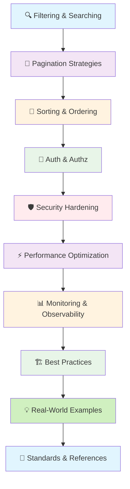

# 🚀 Intermediate

*Mastering core concepts and practical patterns for robust FastAPI applications*

Welcome to the Intermediate section! This guide builds upon the foundational knowledge, diving deeper into essential patterns, security, performance, and best practices for developing more sophisticated and production-ready RESTful APIs with FastAPI.

## 📋 Overview

This section provides practical concepts and patterns for developers who want to enhance their FastAPI applications, focusing on common challenges and effective solutions:

### 🔍 **Query & Data Handling**
Master efficient filtering, searching, pagination, and sorting techniques for managing complex data interactions.

### 🛡️ **Security & Authentication**
Implement robust authentication and authorization mechanisms to secure your API endpoints.

### ⚡ **Performance & Optimization**
Learn strategies to optimize your API's speed and resource usage for better scalability.

### 📊 **Monitoring & Best Practices**
Understand how to monitor your API in production and apply industry-proven development patterns.

## 🛤️ Learning Path

### 🔍 **[1. Filtering & Searching Like a Pro](/docs/03_intermediate/01-filtering-searching)**
Building smarter APIs that help users find exactly what they need.

**Key Topics:**
- Building intelligent filter systems
- Creating search APIs
- Optimizing performance for fast results

[→ Master Filtering & Searching](/docs/03_intermediate/01-filtering-searching)

---

### 🎯 **[2. Mastering Pagination Strategies in FastAPI](/docs/03_intermediate/02-pagination-strategies)**
Transform your API from basic data browsing to enterprise-grade navigation systems.

**Key Topics:**
- Offset-based pagination
- Cursor-based pagination
- Keyset pagination
- Pagination metadata

[→ Implement Efficient Pagination](/docs/03_intermediate/02-pagination-strategies)

---

### 🍕 **[3. Smart Sorting & Ordering: From Simple Lists to Intelligent Discovery](/docs/03_intermediate/03-sorting-ordering)**
Design flexible and powerful sorting mechanisms that handle complex ordering requirements.

**Key Topics:**
- Multi-field sorting
- Dynamic sort parameter parsing
- Field validation and security
- Custom sort order implementations

[→ Build Flexible Sorting](/docs/03_intermediate/03-sorting-ordering)

---

### 🔐 **[4. Authentication and Authorization with FastAPI](/docs/03_intermediate/04-authentication-authorization)**
Building a fortress-level security system for your API kingdom.

**Key Topics:**
- JWT and API key authentication
- OAuth2 and OpenID Connect
- Role-based access control (RBAC)
- Permission-based authorization

[→ Secure Your Endpoints](/docs/03_intermediate/04-authentication-authorization)

---

### 🛡️ **[5. Advanced Security Hardening](/docs/03_intermediate/05-security-considerations)**
Beyond authentication: Advanced fortress defenses for production FastAPI applications.

**Key Topics:**
- Input validation and sanitization
- SQL injection prevention
- XSS protection techniques
- Security headers and CORS configuration

[→ Fortify Your APIs](/docs/03_intermediate/05-security-considerations)

---

### ⚡ **[6. Performance Optimization: From Good to Great](/docs/03_intermediate/06-performance-optimization)**
Transform your FastAPI from a bicycle to a Formula 1 race car.

**Key Topics:**
- Caching strategies (Redis)
- Response compression
- Database query optimization
- ETag and conditional requests

[→ Optimize Performance](/docs/03_intermediate/06-performance-optimization)

---

### 📊 **[7. Monitoring & Observability: Find Your API's Heartbeat](/docs/03_intermediate/07-monitoring-observability)**
Building production-grade observability systems for enterprise FastAPI applications.

**Key Topics:**
- Prometheus metrics integration
- Request logging and tracing
- Health check endpoints
- Application performance monitoring

[→ Monitor Your APIs](/docs/03_intermediate/07-monitoring-observability)

---

### 🏗️ **[8. Best Practices: From Good to Great FastAPI Applications](/docs/03_intermediate/08-best-practices)**
A practical guide to building robust, scalable, and maintainable APIs.

**Key Topics:**
- API design anti-patterns to avoid
- Performance optimization checklists
- Testing strategy recommendations
- Load testing with practical examples

[→ Apply Best Practices](/docs/03_intermediate/08-best-practices)

---

### 💡 **[9. Real-World FastAPI Examples](/docs/03_intermediate/09-examples)**
From Theory to Practice: Building Production-Ready APIs.

**Key Topics:**
- Comprehensive FastAPI implementation patterns
- Building complete API systems
- Practical application of learned concepts

[→ Study Implementation Patterns](/docs/03_intermediate/09-examples)

---

### 📖 **[10. Enterprise Standards & References: A Developer's Guide](/docs/03_intermediate/10-references-standards)**
A progressive guide to the essential standards for building world-class FastAPI applications.

**Key Topics:**
- HTTP and REST specifications
- Security standards and guidelines
- FastAPI ecosystem resources
- Performance monitoring tools

[→ Explore References](/docs/03_intermediate/10-references-standards)

---

## 🎯 Prerequisites

Before starting this section, ensure you've completed the [Foundation](/docs/02_foundation) section, which covers:

- ✅ **RESTful API design principles**
- ✅ **Request and response handling**
- ✅ **Data validation with Pydantic**
- ✅ **Error handling strategies**
- ✅ **API versioning approaches**
- ✅ **Project structure and testing**

*Need to review? Start with our [Foundation Guide](/docs/02_foundation)*

## 🎓 Learning Objectives

By the end of this section, you'll be able to:

- ✅ **Implement efficient query patterns** with filtering, searching, and sorting
- ✅ **Design and implement robust pagination** for large-scale data access
- ✅ **Apply strong authentication and authorization** to protect your APIs
- ✅ **Harden your API security** against common vulnerabilities
- ✅ **Optimize API performance** using various caching and compression techniques
- ✅ **Set up monitoring and observability** for production environments
- ✅ **Follow industry best practices** for building maintainable APIs
- ✅ **Leverage real-world examples** to build complete API systems
- ✅ **Reference authoritative standards** for professional API development

## 📈 Learning Approach

This section follows a practical, hands-on methodology:

### 🛠️ **1. Practical Implementation**
Focus on building and implementing core features with clear code examples.

### 🚀 **2. Performance Awareness**
Every technique is evaluated for its impact on API performance and scalability.

### 🔒 **3. Security First**
Security implications are addressed throughout all implementation examples.

### 🔄 **4. Iterative Development**
Concepts are introduced progressively, allowing for continuous learning and application.

## 🚀 Ready for Intermediate Development?

Choose your starting point based on your current priorities:

- **🔍 Data Management**: Begin with [Filtering & Searching](/docs/03_intermediate/01-filtering-searching) for efficient data handling
- **🔐 API Security**: Start with [Authentication and Authorization](/docs/o3_intermediate/04-authentication-authorization) to secure your endpoints
- **⚡ Speed & Efficiency**: Jump to [Performance Optimization](/docs/03_intermediate/06-performance-optimization) for faster APIs
- **📊 Production Readiness**: Begin with [Monitoring & Observability](/docs/03_intermediate/07-monitoring-observability) for operational insights

---

*💡 **Pro Tip**: These intermediate patterns are crucial for building reliable and scalable APIs. Focus on understanding the "why" behind each technique.*

**Ready to build more robust and efficient APIs? Let's enhance your skills! 🚀**