# 🚀 Advanced

*Mastering enterprise-grade RESTful APIs with FastAPI*

Welcome to the Advanced section! This comprehensive guide covers sophisticated API patterns, performance optimization, and production-ready techniques for building scalable, enterprise-grade RESTful APIs with FastAPI.

## 📋 Overview

This section provides advanced concepts and patterns for developers who want to build high-performance, scalable APIs that can handle complex requirements and large-scale deployments:

### 🔍 **Advanced Query Patterns**
Master sophisticated filtering, searching, pagination, and sorting techniques for complex data retrieval scenarios.

### 🛡️ **Production Security & Performance**
Implement enterprise-grade security measures and optimization strategies for high-performance APIs.

### 📊 **Monitoring & Observability**
Build comprehensive monitoring, logging, and observability solutions for production environments.

### 🎯 **Best Practices & Patterns**
Apply industry-proven patterns and avoid common pitfalls in enterprise API development.

## 🛤️ Learning Path

```mermaid
graph TD
    A[🔍 Filtering & Searching] --> B[📄 Pagination Strategies]
    B --> C[🔄 Sorting & Ordering]
    C --> D[🛠️ Implementation Examples]
    D --> E[🛡️ Security Considerations]
    E --> F[⚡ Performance Optimization]
    F --> G[📊 Monitoring & Observability]
    G --> H[📚 Best Practices]
    H --> I[📖 References & Standards]
    
    style A fill:#e1f5fe
    style B fill:#f3e5f5
    style C fill:#fff3e0
    style D fill:#e8f5e8
    style E fill:#ffebee
    style F fill:#f3e5f5
    style G fill:#fff3e0
    style H fill:#e8f5e8
    style I fill:#e1f5fe
```

### 🔍 **[1. Filtering, Searching & Querying](/docs/04_advance/01-filtering-searching)**
Master advanced query capabilities with comprehensive filtering, full-text search, and complex query parameters.

**Key Topics:**
- Advanced filter operators and query syntax
- Full-text search with relevance scoring
- Complex nested filtering patterns
- Search highlighting and result ranking

[→ Master Advanced Querying](/docs/04_advance/01-filtering-searching)

---

### 📄 **[2. Pagination Strategies](/docs/04_advance/02-pagination-strategies)**
Implement efficient pagination for large datasets with offset-based, cursor-based, and keyset pagination approaches.

**Key Topics:**
- Offset-based pagination with performance warnings
- Cursor-based pagination for large datasets
- Keyset pagination for ordered data
- Pagination metadata and navigation links

[→ Implement Efficient Pagination](/docs/04_advance/02-pagination-strategies)

---

### 🔄 **[3. Sorting & Ordering](/docs/04_advance/03-sorting-ordering)**
Design flexible and powerful sorting mechanisms that handle complex ordering requirements.

**Key Topics:**
- Multi-field sorting with priority
- Dynamic sort parameter parsing
- Field validation and security
- Custom sort order implementations

[→ Build Flexible Sorting](/docs/04_advance/03-sorting-ordering)

---

### 🛠️ **[4. Implementation Examples](/docs/04_advance/04-implementation-examples)**
Explore comprehensive FastAPI implementation patterns for authentication, middleware, and advanced features.

**Key Topics:**
- JWT and API key authentication
- Custom middleware development
- Exception handlers and error processing
- Advanced dependency injection patterns

[→ Study Implementation Patterns](/docs/04_advance/04-implementation-examples)

---

### 🛡️ **[5. Security Considerations](/docs/04_advance/05-security-considerations)**
Implement enterprise-grade security measures with comprehensive input validation and sanitization.

**Key Topics:**
- Advanced input validation patterns
- SQL injection prevention
- XSS protection techniques
- Security headers and CORS configuration

[→ Secure Your APIs](/docs/04_advance/05-security-considerations)

---

### ⚡ **[6. Performance & Optimization](/docs/04_advance/06-performance-optimization)**
Optimize API performance with caching strategies, response compression, and database query optimization.

**Key Topics:**
- Redis caching implementation
- Response compression middleware
- Database query optimization
- ETag and conditional requests

[→ Optimize Performance](/docs/04_advance/06-performance-optimization)

---

### 📊 **[7. Monitoring & Observability](/docs/04_advance/07-monitoring-observability)**
Build comprehensive monitoring and observability solutions for production APIs.

**Key Topics:**
- Prometheus metrics integration
- Request logging and tracing
- Health check endpoints
- Application performance monitoring

[→ Monitor Your APIs](/docs/04_advance/07-monitoring-observability)

---

### 📚 **[8. Best Practices](/docs/04_advance/08-best-practices)**
Learn proven patterns and avoid common pitfalls in enterprise API development.

**Key Topics:**
- API design anti-patterns to avoid
- Performance optimization checklists
- Testing strategy recommendations
- Load testing with practical examples

[→ Apply Best Practices](/docs/04_advance/08-best-practices)

---

### 📖 **[9. References & Standards](/docs/04_advance/09-references-standards)**
Access comprehensive references to industry standards, RFCs, and authoritative resources.

**Key Topics:**
- HTTP and REST specifications
- Security standards and guidelines
- FastAPI ecosystem resources
- Performance monitoring tools

[→ Explore References](/docs/04_advance/09-references-standards)

---

## 🎯 Prerequisites

Before starting this section, ensure you've completed the [Foundation](/docs/02_foundation) section, which covers:

- ✅ **RESTful API design principles**
- ✅ **Request and response handling**
- ✅ **Data validation with Pydantic**
- ✅ **Error handling strategies**
- ✅ **API versioning approaches**
- ✅ **Project structure and testing**

*Need to review? Start with our [Foundation Guide](/docs/02_foundation)*

## 🎓 Learning Objectives

By the end of this section, you'll be able to:

- ✅ **Implement advanced query patterns** with complex filtering and search capabilities
- ✅ **Design efficient pagination** for large-scale data access
- ✅ **Build flexible sorting systems** that handle complex ordering requirements
- ✅ **Apply enterprise security measures** to protect production APIs
- ✅ **Optimize API performance** using caching and compression techniques
- ✅ **Monitor and observe** API behavior in production environments
- ✅ **Follow industry best practices** and avoid common pitfalls
- ✅ **Reference authoritative standards** for professional API development

## 📈 Learning Approach

This section follows an enterprise-focused methodology:

### 🏢 **1. Enterprise Patterns**
Real-world patterns used by large-scale applications and enterprise systems.

### 🔬 **2. Performance Focus**
Every technique is evaluated for performance impact and scalability considerations.

### 🛡️ **3. Security First**
Security implications are addressed throughout all implementation examples.

### 📊 **4. Production Ready**
All examples include monitoring, error handling, and observability considerations.

## 🚀 Ready for Enterprise Development?

Choose your starting point based on your current priorities:

- **🔍 Data-Heavy APIs**: Begin with [Filtering & Searching](/docs/04_advance/01-filtering-searching) for complex queries
- **📈 Scale Challenges**: Start with [Pagination Strategies](/docs/04_advance/02-pagination-strategies) for large datasets
- **🛡️ Security Focus**: Jump to [Security Considerations](/docs/04_advance/05-security-considerations) for protection
- **⚡ Performance Issues**: Begin with [Performance Optimization](/docs/04_advance/06-performance-optimization) for speed

---

*💡 **Pro Tip**: These advanced patterns are designed for production environments. Consider the complexity vs. benefit trade-off for your specific use case.*

**Ready to build enterprise-grade APIs? Let's advance your skills! 🚀**