# 🚀 Intermediate REST API Design Patterns

*Elevating your API development with advanced patterns and enterprise-grade practices*

Welcome to the intermediate level of REST API design! This section explores sophisticated patterns that handle complex business scenarios, performance optimization, and enterprise requirements.

## 📋 What You'll Master

This comprehensive guide covers advanced topics that every professional API developer should know:

### 🏗️ **Advanced URI Design & Architecture**
Master sophisticated URI patterns for complex business domains, multi-tenant systems, and hierarchical resource relationships.

**Key Topics:**
- Complex resource modeling and state management
- Multi-tenant architecture patterns
- Action-based resource operations
- Performance-optimized URI design
- Smart caching and progressive loading

[→ Explore Advanced URI Design](/docs/03_intermediate/01-uri-design)

---

### 🚀 **Advanced HTTP Methods & Semantic Mastery**
Leverage HTTP methods for complex business operations with safety and idempotency guarantees.

**Key Topics:**
- Method safety and idempotency patterns
- Conditional request handling with ETags
- Batch operations with transactional semantics
- Streaming and asynchronous operations
- Method override for client limitations

[→ Master HTTP Methods](/docs/03_intermediate/02-http-methods)

---

### 🔄 **Enterprise API Versioning & Evolution**
Implement sophisticated versioning strategies for production environments supporting multiple client ecosystems.

**Key Topics:**
- Semantic versioning at scale
- Feature flag integration with versioning
- Automated migration support
- Version analytics and monitoring
- Multi-strategy version detection

[→ Implement API Versioning](/docs/03_intermediate/03-api-versioning)

---

### 🎨 **Advanced Request Format Standards**
Handle complex request scenarios with multi-format content negotiation and enterprise-grade validation.

**Key Topics:**
- Multi-format request handling (JSON, XML, YAML, CSV)
- Complex field dependencies and cross-validation
- Business rule validation systems
- Request transformation pipelines
- Sanitization and normalization patterns

[→ Master Request Formats](/docs/03_intermediate/04-request-format)

---

### 🎯 **Advanced Response Format Standards**
Implement sophisticated response structures with adaptive formats and content negotiation.

**Key Topics:**
- Advanced content negotiation with quality factors
- Streaming and progressive responses
- Context-aware adaptive responses
- Hypermedia-enhanced responses (HATEOAS)
- Response transformation pipelines

[→ Design Response Formats](/docs/03_intermediate/05-response-format)

---

### 📊 **Advanced HTTP Status Code Patterns**
Master sophisticated status code usage for complex business scenarios and enterprise APIs.

**Key Topics:**
- Strategic status code architecture
- Contextual success response patterns
- Intelligent redirection strategies
- Advanced client error handling
- Resilient server error patterns

[→ Implement Status Codes](/docs/03_intermediate/06-http-status-codes)

---

### 🛡️ **Enterprise Error Handling & Resilience**
Build robust error handling systems with comprehensive recovery strategies and observability.

**Key Topics:**
- Advanced error classification systems
- Sophisticated recovery mechanisms
- Circuit breakers and fallback patterns
- Error observability and monitoring
- Production-grade error responses

[→ Build Error Handling](/docs/03_intermediate/07-error-handling)

---

## 🎯 Learning Path

```mermaid
graph TD
    A[🏗️ URI Design] --> B[🚀 HTTP Methods]
    B --> C[🔄 API Versioning]
    C --> D[🎨 Request Formats]
    D --> E[🎯 Response Formats]
    E --> F[📊 Status Codes]
    F --> G[🛡️ Error Handling]
    
    style A fill:#e1f5fe
    style B fill:#f3e5f5
    style C fill:#fff3e0
    style D fill:#e8f5e8
    style E fill:#f3e5f5
    style F fill:#fff3e0
    style G fill:#ffebee
```

## 🏆 Prerequisites

Before diving into intermediate patterns, ensure you're comfortable with:

- ✅ **Foundation Concepts**: HTTP basics, REST principles, and basic CRUD operations
- ✅ **FastAPI Fundamentals**: Request/response handling, validation, and basic error handling
- ✅ **API Design Basics**: Resource modeling, status codes, and request/response formats

*Haven't covered the basics? Start with our [Foundation Guide](/docs/02_foundation)*

## 🎪 What Makes This Level Different

### 🔧 **Production-Ready Patterns**
Move beyond basic CRUD to handle real-world complexity:
- Multi-step workflows and business processes
- Complex validation and business rules
- Performance optimization strategies
- Resilience and recovery mechanisms

### 🌐 **Enterprise Considerations**
Address challenges of large-scale systems:
- Multi-tenant architectures
- Version migration strategies
- Observability and monitoring
- Security and compliance requirements

### 🧠 **Advanced Problem Solving**
Learn to think like a senior developer:
- Trade-off analysis and decision frameworks
- Performance vs. complexity considerations
- Maintainability and extensibility patterns
- Error handling and recovery strategies

## 📈 Expected Outcomes

By completing this intermediate guide, you'll be able to:

1. **🎯 Design Complex APIs**: Handle sophisticated business requirements with elegant solutions
2. **⚡ Optimize Performance**: Implement caching, streaming, and efficient data transfer patterns
3. **🛡️ Build Resilient Systems**: Create APIs that gracefully handle failures and recover automatically
4. **📊 Monitor and Observe**: Implement comprehensive monitoring and alerting systems
5. **🔄 Manage Evolution**: Design APIs that can evolve without breaking existing clients
6. **💼 Think Strategically**: Make informed architectural decisions for long-term success

## 🚀 Ready to Begin?

Choose your starting point based on your current needs:

- **📐 Start Systematically**: Begin with [Advanced URI Design](/docs/03_intermediate/01-uri-design) for a structured approach
- **⚡ Focus on Performance**: Jump to [Response Formats](/docs/03_intermediate/05-response-format) for optimization patterns
- **🛡️ Prioritize Reliability**: Start with [Error Handling](/docs/03_intermediate/07-error-handling) for resilience patterns
- **🔄 Handle Evolution**: Begin with [API Versioning](/docs/03_intermediate/03-api-versioning) for compatibility strategies

---

*💡 **Pro Tip**: Each section builds upon previous concepts while being self-contained. Feel free to jump around based on your immediate needs, but consider working through the full sequence for maximum benefit.*

**Happy coding! 🎉**