# 🔄 Advanced Sorting & Ordering Strategies

*Enterprise-grade sorting for complex data relationships and multi-dimensional queries*

## 🎯 Overview

Advanced sorting goes beyond simple field ordering to handle **complex enterprise scenarios**:
- 🏗️ **Multi-dimensional ranking** with weighted priorities
- 📊 **Context-aware sorting** based on user preferences and data relationships  
- ⚡ **Performance-optimized sorting** for large datasets with smart indexing
- 🔄 **Dynamic sort algorithms** that adapt to data patterns
- 🛡️ **Security-conscious sorting** with field access control

```mermaid
graph TD
    A[🎯 Sort Request] --> B{Data Complexity}
    B -->|Simple Fields| C[📊 Multi-Field Sort]
    B -->|Complex Relations| D[🏗️ Weighted Ranking]
    B -->|Large Dataset| E[⚡ Performance Sort]
    B -->|User Context| F[🎨 Personalized Sort]
    B -->|Real-time Data| G[🔄 Adaptive Sort]
    
    C --> H[🎯 Optimized Response]
    D --> H
    E --> H
    F --> H  
    G --> H
    
    style A fill:#e1f5fe
    style B fill:#fff3e0
    style H fill:#e8f5e8
```



## 🏗️ Enterprise Multi-Dimensional Sorting

### 🧠 The Complexity Challenge
Imagine sorting a **library** where books should be ordered not just by title, but by **relevance to the reader, availability, popularity, and even the reader's reading history**!

### 🎯 Advanced Sort Parameter Design

```python
from fastapi import FastAPI, Query, HTTPException, Depends, Security
from pydantic import BaseModel, Field, validator, root_validator
from typing import List, Optional, Dict, Any, Tuple, Literal, Union
from enum import Enum
import re
from datetime import datetime
import json

class SortDirection(str, Enum):
    asc = "asc"
    desc = "desc"

class SortNullHandling(str, Enum):
    nulls_first = "nulls_first"
    nulls_last = "nulls_last"
    exclude_nulls = "exclude_nulls"

class SortContext(str, Enum):
    user_preference = "user_preference"
    data_driven = "data_driven"  
    business_logic = "business_logic"
    temporal = "temporal"

class AdvancedSortField(BaseModel):
    field: str
    direction: SortDirection = SortDirection.asc
    weight: float = Field(1.0, ge=0.1, le=10.0, description="Sort field importance weight")
    null_handling: SortNullHandling = SortNullHandling.nulls_last
    case_sensitive: bool = Field(False, description="Case sensitivity for string fields")
    
    # 🎯 Advanced sorting features
    boost_function: Optional[str] = Field(None, description="Custom boost function name")
    boost_params: Optional[Dict[str, Any]] = Field(None, description="Parameters for boost function")

class EnterpriseSort(BaseModel):
    """🏗️ Enterprise-grade sorting with multi-dimensional capabilities"""
    
    # 📊 Core sorting configuration
    fields: List[AdvancedSortField] = Field(default_factory=list)
    sort_string: Optional[str] = Field(None, description="URL-friendly sort string")
    
    # 🎯 Context and personalization
    context: SortContext = SortContext.data_driven
    user_id: Optional[str] = Field(None, description="User ID for personalized sorting")
    
    # ⚡ Performance optimization
    performance_mode: Literal["accurate", "fast", "approximate"] = Field("accurate")
    max_sort_fields: int = Field(5, ge=1, le=10, description="Maximum number of sort fields")
    
    # 🔒 Security and access control
    allowed_fields: Optional[List[str]] = Field(None, description="Fields user can sort by")
    
    @root_validator
    def validate_sort_configuration(cls, values):
        fields = values.get('fields', [])
        sort_string = values.get('sort_string')
        
        # Parse sort string if provided
        if sort_string and not fields:
            values['fields'] = parse_advanced_sort_string(
                sort_string, 
                values.get('allowed_fields', [])
            )
        
        # Validate field count
        if len(values.get('fields', [])) > values.get('max_sort_fields', 5):
            raise ValueError(f"Too many sort fields. Maximum: {values.get('max_sort_fields', 5)}")
        
        return values

def parse_advanced_sort_string(
    sort_string: str, 
    allowed_fields: List[str] = None
) -> List[AdvancedSortField]:
    """
    🎯 Parse advanced sort strings with weights and modifiers
    
    Examples:
    - "name:asc,created_at:desc"  (basic)
    - "relevance:desc:2.5,price:asc:1.0"  (with weights)
    - "title:asc:1.0:nulls_first,score:desc:3.0:nulls_last"  (full syntax)
    """
    if not sort_string:
        return []
    
    sort_fields = []
    
    for field_spec in sort_string.split(','):
        parts = field_spec.strip().split(':')
        
        if len(parts) < 2:
            raise HTTPException(
                status_code=400,
                detail=f"Invalid sort format. Expected 'field:direction', got: {field_spec}"
            )
        
        field_name = parts[0]
        direction = parts[1].lower()
        weight = float(parts[2]) if len(parts) > 2 else 1.0
        null_handling = parts[3] if len(parts) > 3 else "nulls_last"
        
        # 🔒 Security check
        if allowed_fields and field_name not in allowed_fields:
            raise HTTPException(
                status_code=403,
                detail=f"Sorting by field '{field_name}' is not allowed"
            )
        
        # ✅ Validate direction
        if direction not in ['asc', 'desc']:
            raise HTTPException(
                status_code=400,
                detail=f"Invalid sort direction: {direction}. Use 'asc' or 'desc'"
            )
        
        sort_fields.append(AdvancedSortField(
            field=field_name,
            direction=SortDirection(direction),
            weight=weight,
            null_handling=SortNullHandling(null_handling)
        ))
    
    return sort_fields

## 🎨 Context-Aware Personalized Sorting

### 🧠 The Personalization Challenge
Different users need different perspectives on the **same data**. A data analyst wants technical metrics first, while a sales manager prioritizes revenue-related fields!

```python
class UserSortingProfile(BaseModel):
    """🎯 User-specific sorting preferences and context"""
    user_id: str
    role: str
    department: str
    preferences: Dict[str, Any]
    
    # 📊 Usage analytics for smart defaults
    frequently_sorted_fields: List[str] = Field(default_factory=list)
    last_sort_patterns: List[str] = Field(default_factory=list)

class SortingEngine:
    """🏗️ Advanced sorting engine with context awareness"""
    
    def __init__(self):
        # 🎯 Boost functions for different data types and contexts
        self.boost_functions = {
            "recency_boost": self._apply_recency_boost,
            "popularity_boost": self._apply_popularity_boost,
            "relevance_boost": self._apply_relevance_boost,
            "user_preference_boost": self._apply_user_preference_boost,
            "business_priority_boost": self._apply_business_priority_boost
        }
    
    def _apply_recency_boost(self, item: Dict, params: Dict) -> float:
        """📅 Boost recent items higher in sort order"""
        from datetime import datetime, timezone
        
        created_at = datetime.fromisoformat(item.get('created_at', '2020-01-01T00:00:00Z').replace('Z', '+00:00'))
        now = datetime.now(timezone.utc)
        days_old = (now - created_at).days
        
        # Exponential decay boost (newer = higher boost)
        max_boost = params.get('max_boost', 2.0)
        decay_days = params.get('decay_days', 30)
        
        boost = max_boost * (0.5 ** (days_old / decay_days))
        return max(0.1, boost)  # Minimum boost of 0.1
    
    def _apply_popularity_boost(self, item: Dict, params: Dict) -> float:
        """📈 Boost popular items based on engagement metrics"""
        views = item.get('view_count', 0)
        likes = item.get('like_count', 0)
        shares = item.get('share_count', 0)
        
        # Weighted popularity score
        popularity_score = (views * 0.1) + (likes * 0.5) + (shares * 2.0)
        
        # Normalize to boost factor (1.0 to max_boost)
        max_boost = params.get('max_boost', 3.0)
        max_popularity = params.get('max_popularity', 1000)
        
        normalized_score = min(popularity_score / max_popularity, 1.0)
        return 1.0 + (normalized_score * (max_boost - 1.0))
    
    def _apply_user_preference_boost(self, item: Dict, params: Dict) -> float:
        """👤 Boost items based on user's historical preferences"""
        user_profile = params.get('user_profile', {})
        
        # Check if item matches user's preferred categories/tags
        item_tags = set(item.get('tags', []))
        preferred_tags = set(user_profile.get('preferred_tags', []))
        
        tag_overlap = len(item_tags & preferred_tags)
        total_preferred = len(preferred_tags)
        
        if total_preferred == 0:
            return 1.0
        
        preference_score = tag_overlap / total_preferred
        max_boost = params.get('max_boost', 2.5)
        
        return 1.0 + (preference_score * (max_boost - 1.0))

@app.get("/products/context-sorted")
async def get_products_context_sorted(
    sort_config: EnterpriseSort = Depends(),
    user_profile: UserSortingProfile = Depends(get_user_profile),
    request: Request
):
    """
    🎨 Context-aware sorting with personalization and business logic
    
    ✨ Features:
    - User role-based default sorting
    - Personalized boost functions
    - Business logic integration
    - Performance-optimized execution
    - A/B testing support
    """
    start_time = time.time()
    
    # 🎯 Initialize sorting engine
    sorting_engine = SortingEngine()
    
    # 📊 Generate personalized default sort if none provided
    if not sort_config.fields:
        sort_config.fields = generate_contextual_default_sort(
            user_profile, sort_config.context
        )
    
    # 🏗️ Simulate product data with rich metadata
    products = [
        {
            "id": f"prod_{i:04d}",
            "name": f"Enterprise Product {i}",
            "price": round(99.99 + (i * 12.50), 2),
            "created_at": f"2024-{((i % 12) + 1):02d}-{((i % 28) + 1):02d}T10:30:00Z",
            "category": ["electronics", "software", "services", "consulting"][i % 4],
            "rating": round(3.5 + (i % 15) * 0.1, 1),
            "popularity_score": (i * 47) % 1000,  # Simulated popularity
            "view_count": (i * 123) % 5000,
            "like_count": (i * 67) % 500,
            "share_count": (i * 23) % 100,
            "tags": [f"tag_{(i + j) % 10}" for j in range(3)],
            "in_stock": i % 3 != 0,  # 2/3 in stock
            "featured": i % 7 == 0,  # Every 7th item featured
            "business_priority": ["low", "medium", "high", "critical"][i % 4]
        }
        for i in range(1, 101)  # Larger dataset for realistic testing
    ]
    
    # 🎯 Apply advanced sorting with context
    sorted_products = []
    
    for product in products:
        # 📊 Calculate composite sort score
        composite_score = 0.0
        
        for sort_field in sort_config.fields:
            field_value = product.get(sort_field.field)
            if field_value is None:
                if sort_field.null_handling == SortNullHandling.exclude_nulls:
                    continue  # Skip this item
                field_value = 0  # Default for scoring
            
            # 🔢 Normalize field value to 0-1 range for scoring
            if isinstance(field_value, (int, float)):
                normalized_value = min(max(field_value / 1000, 0), 1)
            elif isinstance(field_value, str):
                normalized_value = len(field_value) / 100  # Simple string length normalization
            elif isinstance(field_value, bool):
                normalized_value = 1.0 if field_value else 0.0
            else:
                normalized_value = 0.5  # Neutral score for complex types
            
            # 🎯 Apply boost functions if specified
            boost_factor = 1.0
            if sort_field.boost_function:
                boost_func = sorting_engine.boost_functions.get(sort_field.boost_function)
                if boost_func:
                    boost_params = sort_field.boost_params or {}
                    boost_params['user_profile'] = user_profile.dict()
                    boost_factor = boost_func(product, boost_params)
            
            # 📈 Apply direction (desc = invert score)
            if sort_field.direction == SortDirection.desc:
                normalized_value = 1.0 - normalized_value
            
            # 🏆 Add weighted score to composite
            field_score = normalized_value * boost_factor * sort_field.weight
            composite_score += field_score
        
        # 📊 Store product with its computed score
        sorted_products.append({
            **product,
            "_sort_score": composite_score,
            "_sort_debug": {
                "base_scores": {
                    sf.field: product.get(sf.field) for sf in sort_config.fields
                },
                "applied_boosts": [sf.boost_function for sf in sort_config.fields if sf.boost_function]
            }
        })
    
    # 🎯 Final sort by composite score (descending = highest score first)
    sorted_products.sort(key=lambda x: x["_sort_score"], reverse=True)
    
    # 🧹 Clean up debug info for production
    if sort_config.performance_mode == "fast":
        for product in sorted_products:
            product.pop("_sort_score", None)
            product.pop("_sort_debug", None)
    
    query_time = (time.time() - start_time) * 1000
    
    return {
        "data": sorted_products[:50],  # Return first 50 results
        "sorting": {
            "fields_applied": [
                {
                    "field": sf.field,
                    "direction": sf.direction.value,
                    "weight": sf.weight,
                    "boost_function": sf.boost_function
                }
                for sf in sort_config.fields
            ],
            "context": sort_config.context.value,
            "performance_mode": sort_config.performance_mode
        },
        "personalization": {
            "user_role": user_profile.role,
            "user_department": user_profile.department,
            "personalized_defaults_applied": len(sort_config.fields) == 0
        },
        "metadata": {
            "total_products": len(sorted_products),
            "query_time_ms": round(query_time, 2),
            "sort_algorithm": "weighted_composite_scoring",
            "cache_eligible": sort_config.performance_mode == "fast"
        }
    }

def generate_contextual_default_sort(
    user_profile: UserSortingProfile, 
    context: SortContext
) -> List[AdvancedSortField]:
    """🎯 Generate smart default sorting based on user context"""
    
    # 👤 Role-based default sorting
    role_defaults = {
        "sales_manager": [
            AdvancedSortField(field="price", direction=SortDirection.desc, weight=2.0),
            AdvancedSortField(field="popularity_score", direction=SortDirection.desc, weight=1.5)
        ],
        "data_analyst": [
            AdvancedSortField(field="created_at", direction=SortDirection.desc, weight=1.0),
            AdvancedSortField(field="rating", direction=SortDirection.desc, weight=1.5)
        ],
        "customer": [
            AdvancedSortField(
                field="rating", 
                direction=SortDirection.desc, 
                weight=2.0,
                boost_function="popularity_boost",
                boost_params={"max_boost": 1.8}
            ),
            AdvancedSortField(field="price", direction=SortDirection.asc, weight=1.0)
        ]
    }
    
    # 🎯 Get default based on user role or fallback
    defaults = role_defaults.get(
        user_profile.role.lower(), 
        role_defaults["customer"]  # Default fallback
    )
    
    return defaults

async def get_user_profile(
    current_user: dict = Security(get_current_user)
) -> UserSortingProfile:
    """👤 Get user profile for personalized sorting"""
    # In real implementation, fetch from user service/database
    return UserSortingProfile(
        user_id=current_user.get("user_id"),
        role=current_user.get("role", "customer"),
        department=current_user.get("department", "general"),
        preferences=current_user.get("preferences", {}),
        frequently_sorted_fields=["price", "rating", "created_at"],
        last_sort_patterns=["price:desc", "rating:desc,price:asc"]
    )
```

## ⚡ Performance-Optimized Sorting for Large Datasets

### 🏎️ The Scale Challenge
Sorting **millions of records** with complex business logic can bring your API to its knees. Think of it like **organizing a massive warehouse** where you need smart strategies, not just brute force!

```python
from functools import lru_cache
import asyncio
from concurrent.futures import ThreadPoolExecutor

class HighPerformanceSorter:
    """🚀 Enterprise-grade sorting with performance optimizations"""
    
    def __init__(self):
        self.cache = {}  # Sort result caching
        self.executor = ThreadPoolExecutor(max_workers=4)  # Parallel processing
    
    @lru_cache(maxsize=1000)
    def get_sort_index_recommendation(
        self, 
        fields: tuple, 
        dataset_size: int
    ) -> Dict[str, Any]:
        """📊 Recommend optimal database indexes for sort performance"""
        
        recommendations = {
            "recommended_indexes": [],
            "query_hints": [],
            "estimated_performance": "unknown"
        }
        
        # 🎯 Multi-column index recommendations
        if len(fields) > 1:
            # Composite index for multi-field sorts
            index_columns = " DESC, ".join(fields) + " DESC"
            recommendations["recommended_indexes"].append({
                "type": "composite",
                "definition": f"CREATE INDEX idx_sort_{hash(fields) % 10000} ON table_name ({index_columns})",
                "benefit": "Eliminates sort operation in database"
            })
        
        # 📈 Performance estimation based on dataset size
        if dataset_size > 1000000:  # > 1M records
            recommendations["query_hints"].append("USE INDEX (idx_sort_optimized)")
            recommendations["estimated_performance"] = "requires_optimization"
        elif dataset_size > 100000:  # > 100K records
            recommendations["estimated_performance"] = "moderate"
        else:
            recommendations["estimated_performance"] = "excellent"
        
        return recommendations

@app.get("/analytics/performance-sorted")
async def get_analytics_performance_sorted(
    sort_config: EnterpriseSort = Depends(),
    limit: int = Query(50, ge=1, le=1000),
    enable_parallel: bool = Query(True, description="Enable parallel processing"),
    use_approximation: bool = Query(False, description="Use approximate sorting for speed")
):
    """
    ⚡ High-performance sorting for large datasets with smart optimizations
    
    🎯 Performance Features:
    - Parallel sort processing for multi-dimensional sorting
    - Intelligent index recommendations  
    - Approximate sorting for ultra-fast results
    - Query result caching with smart invalidation
    - Memory-efficient streaming for huge datasets
    """
    start_time = time.time()
    
    # 🚀 Initialize high-performance sorter
    sorter = HighPerformanceSorter()
    
    # 📊 Generate large analytics dataset (simulated)
    dataset_size = 500000  # Half million records
    
    if use_approximation:
        # 🏃‍♂️ Fast approximation: sample subset and extrapolate
        sample_size = min(dataset_size // 100, 5000)  # 1% sample, max 5K
        
        analytics_data = [
            {
                "id": f"analytics_{i}",
                "timestamp": f"2024-01-{(i % 30) + 1:02d}T{(i % 24):02d}:00:00Z",
                "metric_value": round(100 + (i * 0.1) + random.uniform(-10, 10), 2),
                "category": ["web", "mobile", "api", "database"][i % 4],
                "region": ["us-east", "us-west", "eu", "asia"][i % 4],
                "user_segment": ["enterprise", "pro", "basic"][i % 3],
                "conversion_rate": round(random.uniform(0.01, 0.15), 4),
                "revenue_impact": round(random.uniform(100, 10000), 2)
            }
            for i in range(sample_size)  # Sample for approximation
        ]
        
        # 🔮 Extrapolate sorting pattern to full dataset
        estimated_total_time = (time.time() - start_time) * (dataset_size / sample_size)
        
    else:
        # 🎯 Accurate sorting with parallel processing
        if enable_parallel:
            # 🔄 Parallel sort processing using chunking
            chunk_size = 10000
            chunks = []
            
            # Create data chunks for parallel processing
            for chunk_start in range(0, min(dataset_size, 50000), chunk_size):  # Limit for demo
                chunk_data = [
                    {
                        "id": f"analytics_{i}",
                        "timestamp": f"2024-01-{(i % 30) + 1:02d}T{(i % 24):02d}:00:00Z",
                        "metric_value": round(100 + (i * 0.1), 2),
                        "category": ["web", "mobile", "api", "database"][i % 4],
                        "region": ["us-east", "us-west", "eu", "asia"][i % 4],
                        "user_segment": ["enterprise", "pro", "basic"][i % 3],
                        "conversion_rate": round(0.05 + (i * 0.0001) % 0.1, 4),
                        "revenue_impact": round(1000 + (i * 10) % 5000, 2)
                    }
                    for i in range(chunk_start, min(chunk_start + chunk_size, 50000))
                ]
                chunks.append(chunk_data)
            
            # 🚀 Process chunks in parallel
            loop = asyncio.get_event_loop()
            
            async def sort_chunk(chunk):
                """Sort individual chunk"""
                return await loop.run_in_executor(
                    sorter.executor,
                    lambda: sorted(
                        chunk, 
                        key=lambda x: (
                            x.get('metric_value', 0),
                            x.get('conversion_rate', 0),
                            x.get('revenue_impact', 0)
                        ),
                        reverse=True
                    )
                )
            
            # 🔄 Execute parallel chunk sorting
            sorted_chunks = await asyncio.gather(*[sort_chunk(chunk) for chunk in chunks])
            
            # 🎯 Merge sorted chunks (k-way merge)
            analytics_data = []
            chunk_indices = [0] * len(sorted_chunks)
            
            for _ in range(limit):  # Only get what we need
                best_chunk = -1
                best_value = -1
                
                # Find chunk with highest next value
                for i, chunk in enumerate(sorted_chunks):
                    if chunk_indices[i] < len(chunk):
                        value = chunk[chunk_indices[i]].get('metric_value', 0)
                        if value > best_value:
                            best_value = value
                            best_chunk = i
                
                if best_chunk == -1:
                    break  # No more data
                
                analytics_data.append(sorted_chunks[best_chunk][chunk_indices[best_chunk]])
                chunk_indices[best_chunk] += 1
        
        else:
            # 🐌 Single-threaded processing (for comparison)
            analytics_data = [
                {
                    "id": f"analytics_{i}",
                    "timestamp": f"2024-01-{(i % 30) + 1:02d}T{(i % 24):02d}:00:00Z",
                    "metric_value": round(100 + (i * 0.1), 2),
                    "category": ["web", "mobile", "api", "database"][i % 4],
                    "region": ["us-east", "us-west", "eu", "asia"][i % 4]
                }
                for i in range(min(dataset_size, 10000))  # Limit for single-threaded
            ]
            
            analytics_data.sort(
                key=lambda x: x.get('metric_value', 0), 
                reverse=True
            )
            analytics_data = analytics_data[:limit]
    
    # 📊 Get index recommendations
    sort_fields = tuple(sf.field for sf in sort_config.fields) if sort_config.fields else ("metric_value",)
    index_recommendations = sorter.get_sort_index_recommendation(sort_fields, dataset_size)
    
    query_time = (time.time() - start_time) * 1000
    
    return {
        "data": analytics_data,
        "performance": {
            "query_time_ms": round(query_time, 2),
            "dataset_size": dataset_size,
            "parallel_processing": enable_parallel,
            "approximation_used": use_approximation,
            "estimated_total_time_ms": round(estimated_total_time * 1000, 2) if use_approximation else None,
            "performance_grade": (
                "excellent" if query_time < 100 else
                "good" if query_time < 500 else
                "needs_optimization"
            )
        },
        "optimization": {
            "index_recommendations": index_recommendations,
            "cache_hit": False,  # First run
            "optimization_suggestions": [
                "Consider using database-level sorting for better performance",
                "Implement result caching for frequently accessed sort combinations",
                "Use pagination with cursor-based navigation for large result sets"
            ]
        },
        "metadata": {
            "sort_algorithm": "parallel_k_way_merge" if enable_parallel else "single_threaded",
            "memory_usage_mb": round((len(analytics_data) * 500) / 1024 / 1024, 2),  # Estimated
            "scalability_limit": "1M+ records with optimization"
        }
    }

## 📊 Sorting Strategy Comparison

| Strategy | Best For | Performance | Complexity | Personalization | Real-time |
|----------|----------|-------------|------------|-----------------|-----------|
| **📊 Multi-Field** | Standard business data | ⚡⚡ | ⭐⭐ | ❌ | ✅ |
| **🎨 Context-Aware** | User-facing applications | ⚡⚡ | ⭐⭐⭐ | ✅ | ✅ |
| **⚡ Performance** | Large datasets, analytics | ⚡⚡⚡ | ⭐⭐⭐⭐ | ⚡ | ⚡ |
| **🔄 Weighted Composite** | Search/recommendation | ⚡⚡ | ⭐⭐⭐⭐⭐ | ✅ | ⚡ |

## 🎯 Advanced Sort Patterns

### 🧠 **Smart Default Selection**
```python
# 🎯 Role-based defaults
sales_team_sort = "revenue:desc:3.0,conversion_rate:desc:2.0"
analyst_sort = "created_at:desc:1.0,accuracy:desc:2.0"

# 📊 Context-aware defaults  
mobile_user_sort = "relevance:desc:popularity_boost"
desktop_user_sort = "comprehensive:desc:detail_boost"
```

### 🎨 **Dynamic Boost Functions**
```python
# 📅 Time-decay boost
boost_params = {
    "recency_boost": {"max_boost": 2.0, "decay_days": 30},
    "popularity_boost": {"max_boost": 3.0, "trending_window": 7}
}

# 👤 User preference boost
user_boost = {
    "category_preference": user_profile.preferred_categories,
    "historical_engagement": user_analytics.engagement_patterns
}
```

### ⚡ **Performance Optimization**
```sql
-- 🎯 Optimized indexes for common sort patterns
CREATE INDEX idx_multi_sort ON products (rating DESC, price ASC, created_at DESC);
CREATE INDEX idx_user_context ON products (user_segment, category, rating DESC);

-- 📊 Materialized views for complex sorts
CREATE MATERIALIZED VIEW product_scores AS
SELECT *, (rating * 0.4 + popularity * 0.6) as composite_score
FROM products;
```

## 🎉 Summary

Advanced sorting transforms your API from **simple data listing** to **intelligent data discovery**:

- 🏗️ **Multi-dimensional sorting** with weights and boost functions
- 🎨 **Context-aware personalization** based on user profiles and behavior
- ⚡ **Performance optimization** with parallel processing and smart caching
- 🔄 **Dynamic algorithms** that adapt to data patterns and user context

The key is **matching the sorting strategy** to your specific use case - from simple business listings to complex recommendation engines!